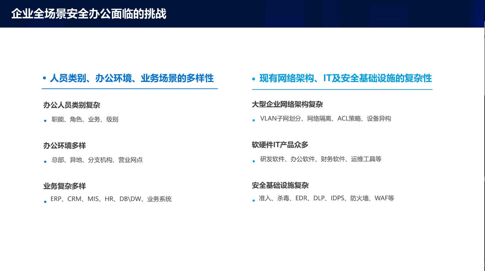

# 零信任在企业中的落地实践

贝壳找房零信任落地时的场景和解决方案。

本质上，零信任就是精准授权。

## 贝壳找房的实践
### Draft （2nd） NIST Special Publication 800-207

给了3个方案IAM、MSG（微分段）、SDP(软件定义边界)，贝壳都在使用。

零信任的价值：
- 每一次访问，都能够被有效

### 贝壳都需要什么？

贝壳安全问题：
- 复杂的访问主体：相互之间授权不能相同。需要有个精准控制访问控制权限的方案
- 多样的访问环境：110个城市、8000个门店、百万经纪人、银行网络、和合作伙伴。

### 零信任作用于贝壳作业场景

#### 场景1 职场办公场景

- HTTP服务办公场景
  - 使用网关作为流量收口
  - 使用OpenResty 构建了动态网关。
  - 以用户身份为中心，精细粒度授权
  - 用户行为分析审计，权限动态调整（动态风控）
- SSH服务办公场景（分了好多个阶段实施）
  - 堡垒机（适合做访问收口，记录行为，但有性能瓶颈，后面准备使用去中心化的堡垒机方案）与零信任结合. 对命令分级、对账号分类。
  - 以用户身份为中心，充分认证并授权
  - 用户行为审计，权限动态调整
- 其他服务办公场景
  - 例如Mysql等协议，通过http服务封装，禁止直接访问。
  - 没有封装的流量还有一些，比较少。

####  场景2 代码调试场景

- 无法交互的身份认证（IDE不能身份认证，但是可以对设备进行认证）
  - 使用网关进行流量收口
  - 授权主体为设备IP
  - 设备通过入网信息关联到人（用户）
  - 最终实现对“人”的权限收敛
  - 目前不支持公网下代码调试。
  - 使用终端安全软件给终端进行标识。

对设备授权，仅限于职场中的接入设备，且需要已经安装公司终端安全软件。

####  场景3 服务间调用场景

- 机器-机器间的授权思路
  - 使用网关进行流量收口
  - 结合既存的ak/sk验证机制
  - 通过网关识别到 service ID，实现对服务器的精细化授权

Google 基于容器化部署的BeyondProd安全方案（但成本较高），将成为未来方向。

####  场景4 外部组织访问场景

- 外部API请求
  - 专线接入划定网段
  - 固定IP，且最小化授权原则

- 外部人员访问
  - 外部人员访问，通过开通临时账号，实现以人为中心的最小化授权。

####  场景5 职场伙伴远程访问场景

- 电脑办公场景
  - 必须终端安全软件安装及准入
  - 安全终端作为网络边界的延申
  - 以身份认证为中心的最小化授权
  - SSH及其他协议转化为HTTP协议
- 移动办公场景
 - 打通

####  场景6 经纪人伙伴访问核心平台场景

- 经纪人伙伴的AnyOffice
  - 结合作业使用软件A+,集成安全准入功能
  - 部分作业系统对外开放
  - 安全终端作为边界延申

###  决策中心建设

概览图：

策略模型（基于SARE)：

---

## 快手零信任实践

### 背景
- 快手推进SSO比较困难。
- 快手在不同地点建办公区
- Google提出通过代理（Nginx）的方式实现访问控制

### 建设内容（Web安全网关）
基于Ningx构建web安全网关。
#### web安全网关的功能
- 主要是访问控制：统一的访问控制可以增加系统防护能力，防止内部系统的访问控制疏漏。
- HTTPS
- 日志审计
- WAF
- WEB水印
- 为扫描器输出测试系统流量
- 后端健康状态监控
- 内部DAU统计

#### 访问控制
访问控制的实现流程：

网关必须高可用：

### 动态策略

---

## 输朋科技（厂商）的实践

零信任面临的挑战：
- 传统防护解决的是访问控制，但数据存储、计算、传输的安全缺失，ZTA需要解决这些。
- 支持B/S之外的架构和协议
- 应用与资源整合，成本较低。

不仅要进行访问安全，还要考虑数据安全：

### 应用场景

#### 企业研发知识产权保护

#### 跨组织安全协同

#### 客服职场、营业网点用户隐私信息保护

#### 企业全场景安全办公

能有机结合各种安全设备，例如DLP、EDR等。

### 小结

