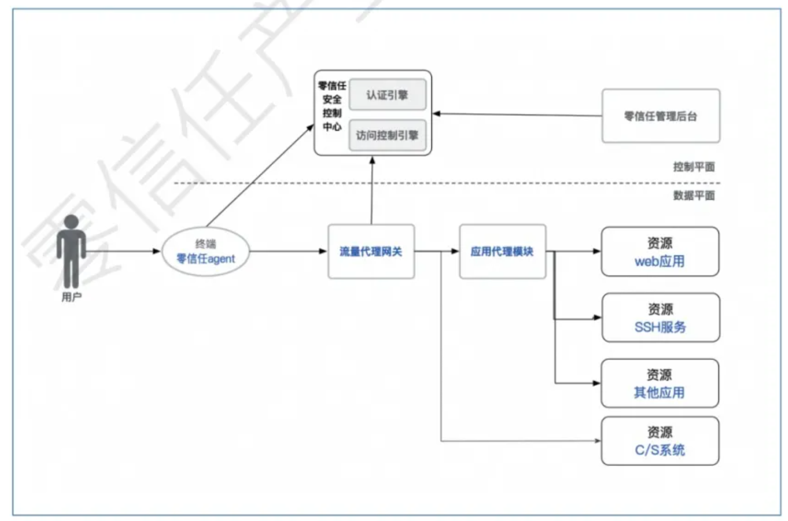

# 零信任实践

## Zero Trust 概述

零信任是一种新的安全理念，而非某个技术或产品，其目标是为了降低资源访问过程中的安全风险，防止未授权的资源访问，关键是打破信任和网络位置的默认绑定关系。

在零信任中，在访问资源前，所有访问主体都需要身份认证和授权。

### 基本假设
- 内部威胁不可避免
- 从空间上，资源访问的过程中涉及到的所有对象（用户、终端设备、应用、网络、资源等）默认都不信任，其安全不再由网络位置决定；
- 从时间上，每个对象的安全性是动态变化的（非全时段不变的）。

### 基本原则
- 任何访问主体（人、设备、应用等），在访问被允许之前，都必须要经过身份认证和授权，避免过度的信任；
- 访问主体对资源的访问权限是动态的（非静止不变的）；
- 分配访问权限时应遵循最小权限原则；
- 尽可能减少资源非必要的网络暴露，以减少攻击面
- 尽可能确保所有的访问主体、资源、通信链路处于最安全状态；
- 尽可能多的和及时的获取可能影响授权的所有信息，并根据这些信息进行持续的信任评估和安全响应。

### 与传统边界安全理念的优劣对比

#### 传统边界防护模型的优缺点

优点：
- 适用于传统网络访问；
- 结构清晰，简单可靠；
- 阻断效果明显；
- 对业务系统影响小，大多不用改造。

缺点：
- 不适于保护“云、大、物、移”等技术发展引发的边界模糊下的网络访问；
- 基于网络位置确定主体身份；
- 网络边界固定不易变更，边界容易绕过；
- 同域横向攻击难以防护；
- 合法权限的复用难以防护
- 安全检测不介入业务系统，仅存于边界或核心交换，存在大量盲点；

#### 零信任安全模型的优缺点

优点：
- 访问授权前，要通过对人、终端、应用、资源的综合身份认证，安全可信度更高；
- 每次对资源的请求，都是一次重新校验，安全是动态的，动态防护能力更强；
- 全链路加密
- 嵌入业务系统，分析能力更强；
- 访问集中管控
- 同步资源管理

缺点：
- 对资源的控制都集中在网关上，存在单点风险，网关故障会导致业务中断；
- 集中化权限管理，降低了一定管理成本，但增加了权限集中风险；
- 零信任架构覆盖用户、终端、应用、资源，涉及多层次组件，系统复杂度大增，增加故障识别和修复成本；
- 零信任架构建设周期长、投资大，机会成本和投资风险高。

### 零信任 vs VPN
虽然这两者不是同一个维度的概念，但在安全接入和数据加密通信等方面有相似性。

> VPN 是一种公共网络上建立专用数据通道的技术，是对企业内网的延申。VPN使用了隧道技术，对通信数据进行封装和解封，实现数据透明和安全传输。常用的二层隧道协议包括PPTP, L2TP, 三层隧道协议包括GRE, IPSec, 应用层隧道协议SSL等。

Gartner 预测到2023年有60%的VPN被零信任取代。

#### VPN优劣

优点：
- 技术成树
- 技术选型范围宽

缺点：
- 不能解决内部安全威胁；
- 在用户证书被盗或身份验证强度不足时，容易被黑客利用；
- 一次性用户身份认证，缺少持续安全监测；
- 稳定性不足，在网络不佳状况下用户体验差；
- 灵活性不足，第三方采购、部署周期长，容量、带宽受前期设计限制，不能弹性扩容。

#### 零信任优劣

优点：
- 有更强的安全监测能力和范围；
- 支持细粒度身份认证和访问授权；
- 适用于复杂场景的认证、授权和审计；
- 可快速扩容
- 对网络链路质量要求较vpn低

缺点：
- 新理念，新技术
- 架构复杂，实施有难度

## Zero Trust 标准化进展

- 2014年，CSA的SDP group 发布了 《SDP Specification 1.0》，描述了SDP协议架构、工作流、协议实现、SDP应用等内容；
- 2019年7月，腾讯联合CNCCERT，中果移动设计院、奇虎科技、天融信等，发起CCSA《零信任安全技术参考框架》行业标准立项。
- 2019年9月，国际电信联盟通信标准化组织ITU-T的SG17安全研究组会议上，腾讯、CNCERT、中国移动设计院主导的“服务访问过程持续保护参考框架”国际标准立项。
- 2019年9月，美国NIST发布《零信任架构（草案）》NIST SP.800-207-Draft Zero Trust Architecture，2020年2月修订，8月11日，正式标准发布。
- 2020年，奇安信牵头在国家信息安全技术标准化委员会TC260申请《信息安全技术 零信任参考体系架构》标准立项。

## 零信任参考架构

目前尚未由统一的定义来落地零信任理念，但不少组织正在尝试。比较突出的是：
- 软件定义边界 SDP 
- NIST零信任架构

### SDP架构

CSA 在2013年推出的《SDP标准规范1.0》中定义SDP为：“SDP旨在使应用程序所有者能够在需要时部署安全边界，以便将服务与不安全的网络隔离开来，SDP将物理设备替换为在应用程序所有者控制下运行的逻辑组件并仅在设备验证和身份验证后才允许访问企业应用基础架构。”

SDP架构包含3大组件：
- SDP 控制器
  - 决定哪些IH,AH可以通信
  - 可使用外部认证服务
- SDP 连接发起主机（IH, Initial Host）
- SDP 连接接受主机（AH，Accept Host）

SDP控制层和数据层保持分离，可以实现可扩展的安全系统。所有组件都是可以冗余的，用于扩容和提高稳定性。

### NIST零信任架构

主题访问客体时，需要通过策略决策点（PDP）和相应的策略执行点PEP授予访问权限。

NIST的架构图更接近ISO国际标准中经典的访问管理架构（Access Management），将访问控制分为PDP和PEP，但是这个抽象架构很难看出零信任理念的特性。零信任架构下，资源访问控制策略不再仅基于网络位置，而是基于风险，并通过建设相关系统确保策略得到正确和一致性的执行。

### 通用参考架构

对比SDP架构和NIST架构，可以发现：
- SDP控制器功能上类似于NIST的PDP
- SDP的AH功能类似NIST的PEP

综合SDP和NIST ZT架构，以及一些实践经验，目前业界对零信任架构的理解正趋于一致，总体如下：

其中：
- 零信任安全控制中心，作为SDP的controller和NIST的PDP的抽象；
  - 对访问请求进行授权决策；
  - 进行身份认证或中继到已有的认证服务；
  - 安全监测；
  - 信任评估；
  - 策略管理；
  - 设备安全管理；
  - 可增设微隔离管理中心。
- 零信任安全代理组件，作为SDP的Accept Host 和 NIST的PEP的抽象。
  - 实现对访问控制决策的执行；
  - 采集访问主体的安全信息；
  - 对访问请求进行转发、拦截；
  - 可增设微隔离组件。

## 零信任实现方案

业界出现了很多似是而非的零信任方案和产品，需要甄别。

再次聚焦零信任方案解决的痛点：
- 解决传统防护重在边界，对绕过后的攻击防护能力有限的问题；
- 提高持续安全监测能力，即提高安全事件的发现和响应能力。

零信任方案或实践中的核心要素：
- 用户：访问主体，自然人在网络中的身份映射；
- 终端：发起访问所用的设备，包括硬件、系统、应用、代码；
- 资源：最重要访问的客体，常见为某内部应用系统；
- 链路：终端访问资源的网络通道、链路。

以上各要素有各自面临的网络安全风险，在实现零信任方案的过程中，要实现的核心目标可分为：
- 用户可信：确保用户登录及后续操作为本人，而非盗用者；
- 终端可信：确保终端设备的安全可信，包括以下子目标：
  - 可信设备：终端为可信设备，并授权给可信用户适用；
  - 安全基线：终端具有基本安全防护能力，满足安全基线需求；
  - 可信程序：终端发起资源请求的程序为可信程序，防止恶意代码嵌入或伪装。
- 资源权限可信：保障资源被拥有权限的用户正确获取，阻止越权访问。
- 链路传输可信：保障链路加密，防止中间人攻击。

在实现零信任方案的过程中，要实现的附加目标还有：
- 动态监测，即持续、动态的检测用户、终端、资源、链路是否可信；
- 动态防护。

### 两种零信任架构实现思路

- 以用户视角的零信任方案
  - 以用户访问内部资源过程为线索
  - 如何验证用户是可信的
  - 如何确保访问终端可信
  - 如何确认拥有访问资源权限

- 服务资源之间的安全相互访问

### 以用户视角构建零信任架构

#### 核心理念

持续、动态地校验：用户可信、设备可信、链路核心、资源权限可信（这4点一般具有顺序关系）。

#### 抽象技术框架

主要功能组件和功能：
- 零信任终端代理：用户端的核心组件。
  - 生产终端唯一标识码，用来区分不同终端和设备，防止终端伪造；
  - 建议用户建立授权关系：即允许该终端被哪个用户使用，建立绑定关系；
  - 收集终端信息：用于决策中心判断终端安全状态，是否符合对资源访问的要求。

- 零信任网关：暴露在外部可被用户直接访问的系统。
  - 转发：对未授权请求转发到控制中心的认证/授权服务；对已授权请求，转发至指定资源服务。
  - 拦截：对禁止访问的请求，进行拦截阻断（以及防DDoS处理）。
  

- 零信任安全控制中心
  - 认证：对用户、终端身份进行认证和授权；
  - 持续访问控制：
    - 访问控制策略：访问控制策略包含访问过程的关键对象、访问权限、环境安全状态因素，可以进行灵活的配置，方便在访问过程中根据策略做风险判断，给予授权或阻断。
    - 动态安全检测：决策中心对鉴权和安全状态的检验是持续动态的，即每次对资源的访问都应重新进行鉴权和校验。
    - 动态防护响应：对于判断有风险的访问，应当及时采取降权、阻断等控制。

- 零信任管理后台：提供集中化管理能力。
  - 用户管理：集中标识、认证、授权。
  - 终端管理：集中终端标识、认证。
  - 资源管理：对接入资源进行集中管理；
  - 策略管理。

#### 技术实现方式

零信任在技术实现上有多种方式，只要满足其核心目标，都可视为技术实现。

##### 反向代理网关方式（含终端Agent）

这种方式指通过OSI L7层web协议反向代理方式实现零信任网关，通过将后端业务域名解析到网关，实现对资源访问的拦截和转发。

该方式下的一般访问过程如下：
- 1.用户通过零信任终端Agent进行设备注册和授权，获取客户端证书；
- 2.终端Agent进行安全基线加固，以及上传终端设备安全状态；
- 3.应用系统域名通过DNS解析到反向代理网关；
- 4.用户通过浏览器或集成Agent功能的安全浏览器，向网关发起资源访问请求；
- 5.反向代理网关通过决策中心验证用户、设备、资源间的可信关系；
- 6.反向代理网关鉴权通过后，带上凭证将请求转发给应用系统，获取资源；
- 7.反向代理网关将资源转发给终端，完成一次请求。

需要注意的地方：
- 控制通道与数据传输通道应当分离，防止堵塞后相互影响；
- 终端Agent需要接受终端安全策略，实现设备可信，实现用户/设备证书的维护;
- 浏览器访问后端应用时，传输通道应当加密，并使用证书、用户与设备信息进行认证授权。
- 网关可以通过客户端证书，以及带入的设备、用户信息实现身份验证。

该模式的零信任实现有以下优势：
- 使用应用层协议代理，可实现细粒度的控制，针对不同应用和不同资源设置不同策略。
- 易于实现内容分析、审计、安全检测；
- 使用7层协议效率高、可靠性强；
- 易于负载均衡和横向扩展。

劣势：
- 非Web类服务不适用，例如C/S应用，不能支持全场景办公需求。

##### 反向代理网关方式（无终端Agent）

无终端Agent和有终端Agent的区别在于：
- 所有的安全控制都集中在网关和安全控制中心，由它完整用户与设备的身份认证和授权；
- 用户使用普通浏览器发出请求；

该方式下的一般访问过程如下：
- 1.用户通过浏览器发起资源访问请求；
- 2.反向代理网关通过安全控制中心，完成用户认证、设备认证、确认各部分可信度；
- 3.应用系统域名通过DNS解析到反向代理网关；
- 4.反向代理网关鉴权通过后，带上凭证将请求转发给应用系统，获取资源；
- 5.反向代理网关将资源转发给终端，完成一次请求。

优势：
- 无特定的用户端Agent，便于用户访问，适于开放型服务；
- 可实现细粒度控制；
- 可通过网关进行内容分析、审计、检测；
- HTTP协议稳定可靠。

劣势：
- 没有用户端Agent，无法判断终端设备安全状态，不能实现设备可信；
- 不能有效支持非HTTP业务。

##### 应用层代理网关方式

这种方式实现的网关，通过设置本地应用层代理转发访问请求。应用层代理网光实现了零信任安全策略。

该方式下的一般访问过程：
- 1.用户通过零信任终端Agent进行设备注册和授权，获取客户端证书；
- 2.终端Agent进行安全基线加固，以及上传终端设备安全状态；
- 3.用户通过林新人终端Agent或可信集成的浏览器，来设置本地应用层代理，指定应用层代理网关；
- 4.应用层代理网关通过安全控制中心，进行认证和鉴权；
- 5.应用层代理网关鉴权通过后，将请求转发给应用系统，获取请求资源；
- 6.应用层代理网关将资源转发给林新人终端，完成一次请求。

对上图的说明：
- 0-1配置不同第三方应用程序兼容性，系统代理设置、浏览器设置、环境变量配置，以及其他可以通过插件支持配置的软件。
- 2-4本地启动一个代理服务劫持所有发生的访问请求，进行安全检查身份检查和访问授权，如果是需要转发的，则加密转发到对应的应用代理网关，否则直接通过物理网卡直连出去。
- 5网关代理做二次的授权控制，身份-访问资源的合法性校验，合法则进行流量代理；
- 6网关代理需要守护和安全检查，必须对本地代理的请求做严格的数据来源合法性校验和保护。

优点：
- 作为应用层代理，可实现细粒度控制；
- 可通过网关进行内容分析、审计、检测；

劣势：
- 对于非HTTP的CS客户端，需要有开放的配置能力，否则不可用。

##### 流量代理网关方式

此方式通过零信任agent通过hook、虚拟网卡、网络过滤驱动等方式，将本地流量转发给零信任网关，由网关负责流量拦截和转发。

该方式下的一般访问过程：
- 1.用户通过零信任终端Agent进行设备注册和授权；
- 2.终端Agent进行安全基线加固，以及上传终端设备安全状态；
- 3.用户通过零信任终端Agent的hook方式、虚拟网卡、网络过滤驱动等方式，将对资源发起访问请求转发到流量代理网关上；
- 4.流量代理网关通过安全控制中心，进行认证和鉴权；
- 5.流量代理网关鉴权通过后，将请求转发给应用系统，获取请求的资源；
- 6.流量代理网关将资源转发给零信任终端，完成资源请求。

上图说明：
- 1-2认证后，Agent利用本地流量劫持的方式，通过网卡设备驱动或网卡系统过滤驱动，劫持所有的TCP和UDP流量。涉及到的需要转发的URL、IP的流量检查，同时兼容具体的业务进程发起的访问，对业务进行白名单安全性检查。
- 3本地流量劫持的服务进程或者代码，对发起访问的应用进程白名单或者可信检查，同时身份-访问业务系统的合法性检查，也可以增加获取本机当前的安全基线状态，确认之后分配到对应的授权加密附带授权信息，转发到网关。没有分配到授权的请求，则直接提供物理网卡对外直连。
- 4本地劫持服务对网关直接提供加密信道，内容包含对应访问授权和原始数据的加密。
- 5-6进行二次访问控制确认，合法流量解密还原成为原始流量，负载发送到具体的业务系统。

优点：
- 作为4层代理，可以实现全局代理，兼容 B/S和C/S应用；
- C/S应用不需要改造，可直接接入零信任体系，对业务干扰小；
- 由于是全局流量代理，所以可以实现全局流量分析。

劣势：
- 作为4层代理，加密/解密成本大；
- 不易实现应用层的细粒度权限控制，对于垂直的web流量，需要额外的web流量网关；
- 对于加密数据，不易作分析；
- 全流量代理模式容易出现和其他流量劫持软件冲突。

##### 混合网关方式

上面各种单一网关实现方式都存在一些弊端和优势，混合网关作为融合型技术对多种能力进行了整合，用全流量代理网关作为统一入口，再对特定请求分配特定代理实现细节控制。

该方式下的一般访问过程：
- 1.用户访问资源时，将请求发送到流量代理网关；
- 2.流量代理网关通过安全控制中心对用户进行认证和鉴权；
- 3.鉴权后，流量网关根据请求资源的类型，向后转发，可分为以下几种情况：
  - 直接转发：如没有特定的应用代理，请求直接转发给应用，如C/S的server；
  - 转发到应用代理模块：对于有映射关系的请求，转发到相应的应用代理模块，进一步完成细粒度鉴权，例如进行基于属性的访问控制，还可区分ssh服务、web服务、iot服务等。
- 4.流量代理网关将资源转发给终端，完成一次请求。

优点：
- 可以兼容C/S和B/S应用，支持绝大多数应用场景；
- 可根据需求，实现细粒度控制，可区分不同服务的控制方式；
- 覆盖完整，检测能力强。

缺点：
- 成本高
- 复杂

#### 部署模式

##### 企业内部部署

这种部署模式主要用于企业内部服务保护，因此将零信任网关部署到服务器网络前。

使用零信任系统提供的统一业务安全访问通道后，内部终端与外部终端都需要通过零信任网关进行认证鉴权等访问控制。

##### 集团多分支部署

这种方式可以对集团、子公司组织（用户群组）架构或用户设置访问策略。

##### 云业务服务部署

中小企业可能使用多个公用云服务，或者公司使用混合云服务。这种情况下，可以采用下列部署模式。

这种模式下，多个云复用一个零信任控制中心，提供统一访问控制策略，通过低流量的策略同步或者不影响带宽的机制，做到统一的授权管理。

### 服务之间调用模式构建零信任架构

这种模式的侧重点在于防止跨越边界后的横向移动（攻击）。
- 大数据中心改善了集中运维管理的问题，但增加了数据集中泄露的风险；
- 内部恶意软件的传播不受边界防护控制（绝大多数服务器是不安装杀毒软件的）；

现实中，绝大多数企业不能有效保障服务之间调用的映射关系，不能保证其安全可控。内部业务流可见性低，这也是实现服务间调用安全的基础。

#### 核心理念

核心元素：
- 工作负载：承载业务的主机，可能是物理或虚拟机，又或者是容器；
- 访问者：发起访问、请求服务的主机或工作负载；
- 提供者：提供服务、响应访问的主机或工作负载；
- 服务：供其他工作负载或用户访问的服务。

以上元素面临的风险有：
- 工作负载风险：主机安全；
- 访问者风险：是否可信？
- 提供者风险：是否可信？
- 服务风险：是否开放可被利用的服务或端口？服务调用是否符合业务逻辑？

服务之间调用模式零信任方案的核心目标：
- 尽可能的使零信任架构覆盖所有工作负载；
- 确保访问者、服务提供者可信；
- 遵循服务最小化原则。

主要抓手在于：
- 理清工作负载间调用关系；
- 使内部业务流量清晰可见；
- 实现动态安全策略；
- 实现自动策略控制。

#### 技术框架

数据中心内部零信任建设，一般采用软件定义方式进行，分为控制平面与数据平面。核心组成：
- 零信任安全控制中心：实现身份鉴别、授权、业务流量可视化等功能。
  - 认证等访问控制
  - 安全策略配置
  - 动态策略调整

- 零信任安全代理（策略执行点）：用于执行访问控制策略，允许/决绝通信或进行协商加密；将工作负载相关信息传到控制中心完成决策；可以是单个逻辑组件，也可以分为客户端（工作负载上的agent）和网关端。

#### 实现方式

目前落地的案例较少，对实现方式的分类参考2015年NIST报告，可分为以下类型：
- 基于虚拟化宿主机的隔离：将不同安全级别的应用部署在不同宿主机的虚拟机中，再将宿主机连接到不同物理交换机上，再通过防火墙进行控制。
- 基于虚拟交换机的隔离
- 基于虚拟化防火墙的隔离
- 在虚拟化网络中使用VLAN进行隔离
- 基于跨平台的网络隔离

2017年Gartner报告总结了更符合现代数据中心的内部隔离方式，提出了4种实现方式：
- 云原生控制
  - 常见于云服务商。提供主机安全配置和VPC配置；
  - 侧重于隔离，而不是控制；
  - 优点是不需要额外部署设备，隔离能力与基础设施紧密耦合，控制台和管理平台与云管平台一致。
  - 缺点是隔离能力与基础设施紧密耦合。
- 第三方防火墙
  - 第三方防火墙供应商提供的虚拟防火墙，两种部署方式：
  - 一种是为虚拟化环境种的每一台宿主机运行一台虚拟防火墙，通过与底层架构对接，使此台宿主机上虚拟机的流量先通过防火墙；
  - 另一种模式是与NFV的结合方式。NFV的启用使得虚拟防火墙有了更强的控制。
  - 优点是可以提供丰富安全能力与报告，将防火墙移植到虚拟化环境内部。
  - 缺点是需要与虚拟化架构底层对接，目前结合较好的是vmware，仅支持本地虚拟化环境，无法覆盖到公有云、物理环境和容器环境。
- 代理模式
  - 多数Overlay模式，使用某种形式的代理，这种代理必须部署到每个主机（虚拟机）中，而不是像防火墙在外部拦截通信。
  - 这种方式除了使用主机墙作为控制手段，也有部分供应商利用工作负载间的协商加密方式进行通信控制。
  - 加密也是一种隔离，这种方式相当于在现有网络上构建一个独立网络，只有按照策略完成协商才能通信。
  - 优点：可以覆盖几乎所有环境，包括物理机、任何架构的私有云、公有云、容器；
  - 缺点：需要安装代理。
- 混合模式
  - 通过上述方式的组合实现更大的ROI。

## 选型

选型参考要素：
- 团队与人员
- 领导支持力度
- 明确的安全目标、阶段目标
- 预算
- 业务团队的支持力度
- 第三方厂商支持力度
- 适用场景
- 技术模型类型
- 