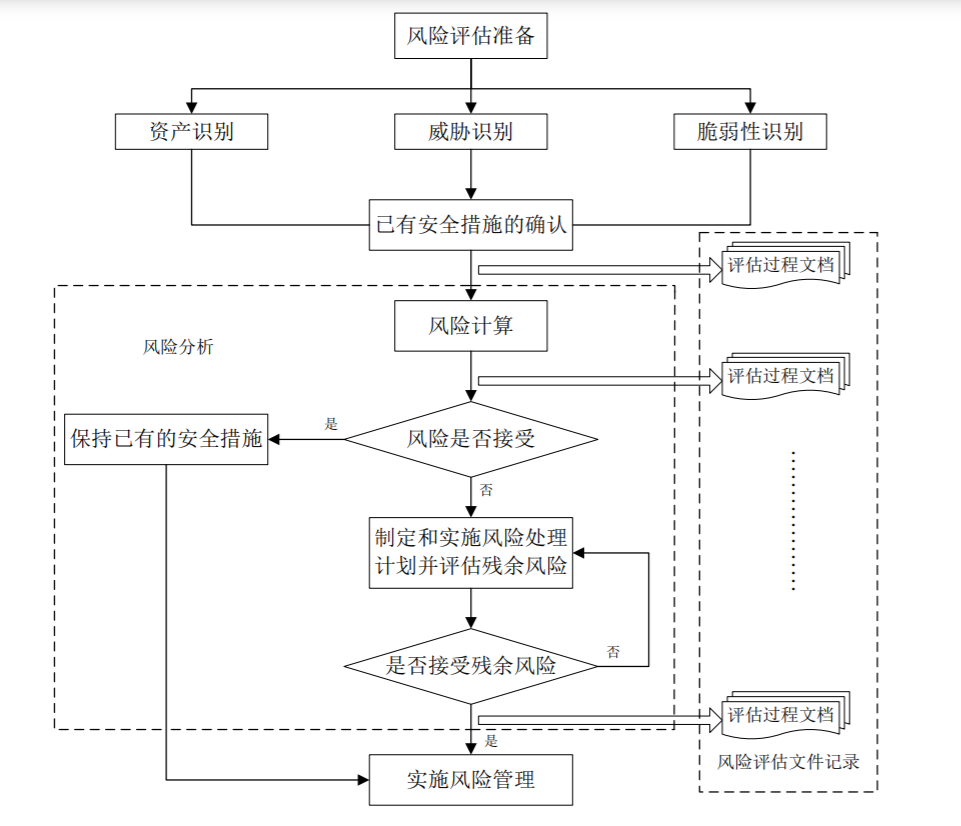

# 企业信息安全风险评估

信息安全分析评估就是从风险管理角度，运用科学的方法和手段，系统地分析信息系统所面临的威胁及其存在的脆弱性，评估安全事件一旦发生可能造成的危害程度，提出有针对性的抵御威胁的防护对策和整改措施，为防范和化解信息安全风险，将风险控制在可接受的水平，最大限度地保障信息安全提供科学依据。

信息安全风险评估作为信息安全保障工作的基础性工作和重要环节，要贯穿于信息系统的规划、设计、实施、运行维护以及废弃各个阶段，是信息安全等级保护制度建设的重要科学方法之一。

信息系统安全风险评估是信息安全保障体系建立过程中重要的评价方法和决策机制。

## 概念

（信息安全）风险评估 （information security）risk assessment 依据有关信息安全技术与管理标准，对信息系统及由其处理、传输和存储的信息的保密性、完整性和可用性等安全属性进行评价的过程。它要评估资产面临的威胁以及威胁利用脆弱性导致安全事件的可能性，并结合安全事件所涉及的资产价值来判断安全事件一旦发生对组织造成的影响。

信息系统的安全风险——是指由于系统存在的脆弱性，人为或自然的威胁导致安全事件发生所造成的影响。

## 评估框架

### 风险评估要素
主要包括：
- 资产
- 威胁
- 缺陷
- 安全措施

风险评估中各要素的关系如图：

说明：
- 方框部分的内容为风险评估的基本要素
- 椭圆部分的内容是与这些要素相关的属性。
- 风险评估围绕着资产、威胁、脆弱性和安全措施这些基本要素展开；
- 在对基本要素的评估过程中，需要充分考虑业务战略、资产价值、安全需求、安全事件、残余风险等与这些基本要素相关的各类属性。

风险要素及属性之间存在着以下关系：
- 业务战略的实现对资产具有依赖性，依赖程度越高，要求其风险越小；
- 资产是有价值的，组织的业务战略对资产的依赖程度越高，资产价值就越大；
- 风险是由威胁引发的，资产面临的威胁越多则风险越大，并可能演变成为安全事件；
- 资产的脆弱性可能暴露资产的价值，资产具有的弱点越多则风险越大；
- 脆弱性是未被满足的安全需求，威胁利用脆弱性危害资产；
- 风险的存在及对风险的认识导出安全需求；
- 安全需求可通过安全措施得以满足，需要结合资产价值考虑实施成本；
- 安全措施可抵御威胁，降低风险；
- 残余风险有些是安全措施不当或无效,需要加强才可控制的风险；而有些则是在综合考虑了安全成本与效益后不去控制的风险；
- 残余风险应受到密切监视，它可能会在将来诱发新的安全事件。

### 风险分析原理
风险分析原理如图 2 所示：

风险分析中要涉及资产、威胁、脆弱性三个基本要素。每个要素有各自的属性，资产的属性是资产价值；威胁的属性可以是威胁主体、影响对象、出现频率、动机等；脆弱性的属性是资产弱点的严重程度。风险分析的主要内容为：
- a）对资产进行识别，并对资产的价值进行赋值；
- b）对威胁进行识别，描述威胁的属性，并对威胁出现的频率赋值；
- c）对脆弱性进行识别，并对具体资产的脆弱性的严重程度赋值；
- d）根据威胁及威胁利用脆弱性的难易程度判断安全事件发生的可能性；
- e）根据脆弱性的严重程度及安全事件所作用的资产的价值计算安全事件的损失；
- f）根据安全事件发生的可能性以及安全事件出现后的损失，计算安全事件一旦发生对组织的影响，即风险值。

### 实施流程
风险评估的实施流程如图 3 所示：

关键步骤有：

- 1.风险评估准备
  - 组织实施风险评估是一种战略性的考虑，结果受组织业务战略、业务流程、安全需求、系统规模和结构等方面的影响。
  - a.确定风险评估的目标
  - b.确定风险评估的范围
  - c.组建适当的评估管理和实施团队
  - d.进行系统调研
  - e.确定评估依据和方法
  - f.获得最高管理者对风险评估工作的支持。
- 2.资产识别
  - a.资产分类
  - b.资产赋值
- 3.威胁识别
  - a.威胁分类
  - b.威胁赋值
- 4.脆弱性识别
  - a.脆弱性识别内容
  - b.脆弱性赋值
- 5.已有安全措施确认
- 6.风险分析
  - a.风险计算原理
  - b.风险结果判定
  - c.风险处理计划
  - d.残余风险评估
- 7.风险评估文档记录
  - a.记录要求
  - b.评估文档

## 系统建设各阶段中的风险评估

### 规划阶段的风险评估
规划阶段风险评估的目的是识别系统的业务战略，以支撑系统安全需求及安全战略等。规划阶段的评估应能够描述信息系统建成后对现有业务模式的作用，包括技术、管理等方面，并根据其作用确定系统建设应达到的安全目标。
### 设计阶段的风险评估
设计阶段的风险评估需要根据规划阶段所明确的系统运行环境、资产重要性，提出安全功能需求。设计阶段的风险评估结果应对设计方案中所提供的安全功能符合性进行判断，作为采购过程风险控制的依据。
### 实施阶段的风险评估
实施阶段风险评估的目的是根据系统安全需求和运行环境对系统开发、实施过程进行风险识别，并对系统建成后的安全功能进行验证。根据设计阶段分析的威胁和制定的安全措施，在实施及验收时进行质量控制。
### 运行维护阶段的风险评估
运行维护阶段风险评估的目的是了解和控制运行过程中的安全风险，是一种较为全面的风险评估。评估内容包括对真实运行的信息系统、资产、威胁、脆弱性等各方面。
### 废弃阶段的风险评估
当信息系统不能满足现有要求时，信息系统进入废弃阶段。根据废弃的程度，又分为部分废弃和全部废弃两种。

## 风险评估的工作形式

信息安全风险评估分为自评估和检查评估两种形式。信息安全风险评估应以自评估为主，自评估和检查评估相结合、互为补充。

## 风险评估工具

### 安全管理评价系统
从安全管理入手，评估信息资产所面临的威胁。

常用的风险评估工具有：
- CCTA RISK ANALYSIS ARID MANAGEMENT METHOD
- COBRA
- Objective and Bi
- ASSET
- RISK
  
### 信息基础设施风险评估工具
包括：
- 脆弱点评估工具
- 渗透性测试工具。
### 风险评估辅助工具
用于收集评估所需的数据，完成现状分析和趋势分析。
包括：
- IDS
- 安全审计工具
- 漏洞库

## 参考标准和文献

- 《GB/T 31509-2015	信息安全技术 信息安全风险评估实施指南》
- 《GB/T 20984-2007	信息安全技术 信息安全风险评估规范》（目前在修订）
- 《GB/T 36466-2018	信息安全技术 工业控制系统风险评估实施指南》
- 《GB/T 26333-2010	工业控制网络安全风险评估规范》
- 《YD/T 3663-2020	移动通信智能终端安全风险评估要求》
- 《YD/T 1730-2008	电信网和互联网安全风险评估实施指南》
- 《YD/T 2252-2011 网络与信息安全风险评估服务能力评估方法》
- 《JR/T 0058-2010 保险信息安全风险评估指标体系规范》
- 《金融信息系统网络安全风险评估规范》在起草