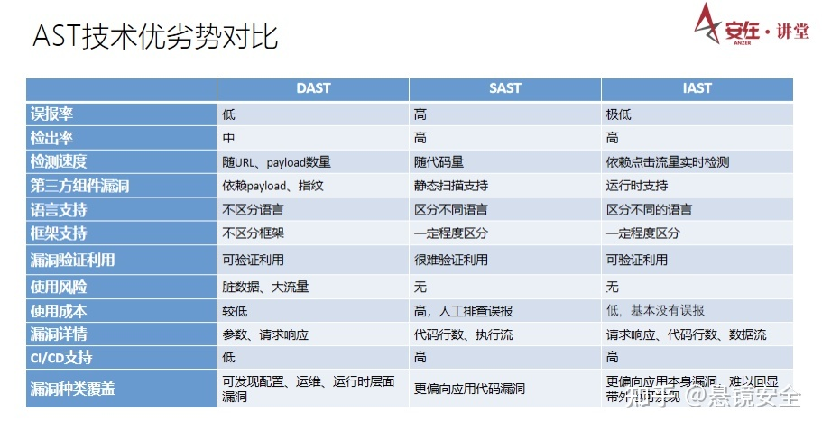
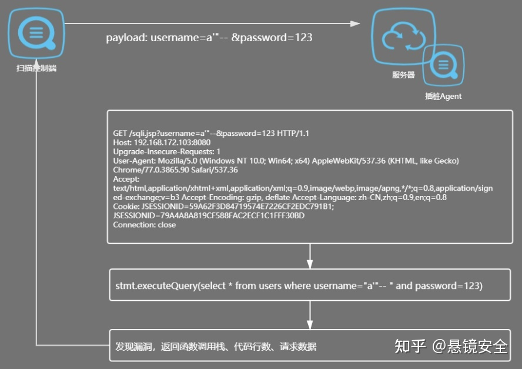
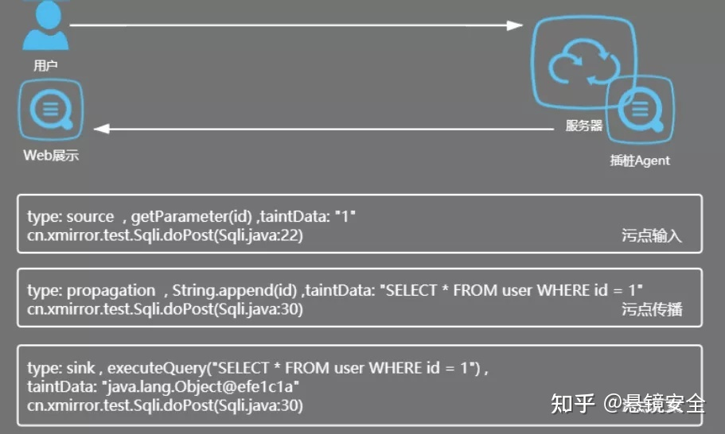
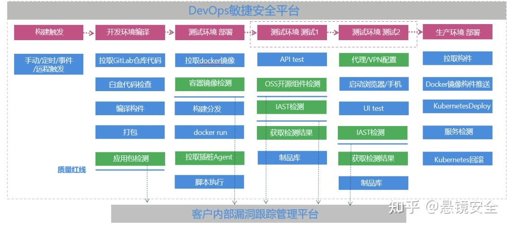
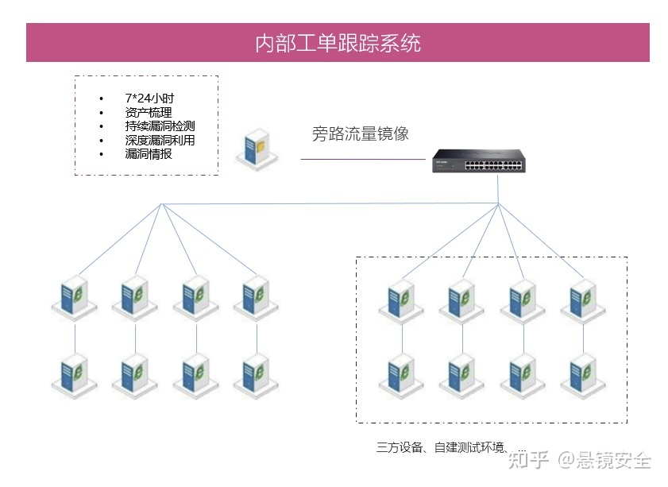
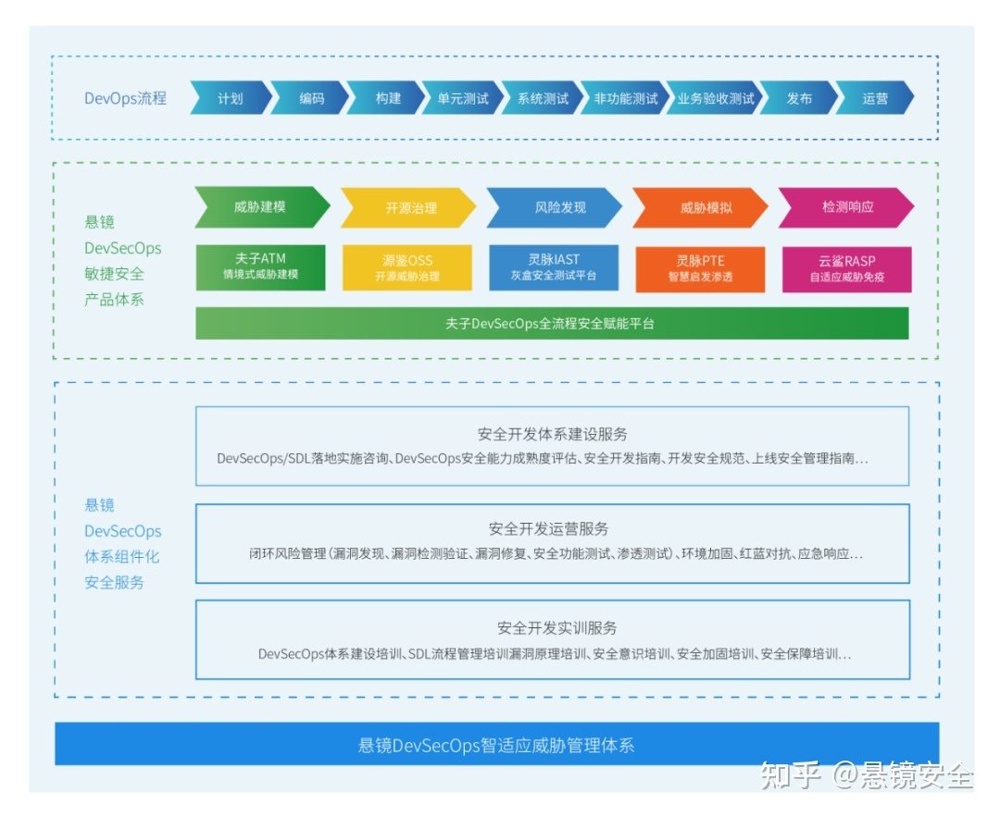

# IAST 

交互式应用程序安全测试，最早由Gartner 2012年提出，他同时规避了黑盒安全扫描DAST 和白盒代码审计技术的主要技术缺陷，通过轻量级微探针技术，使得它在具有黑盒流量的同时，获得白盒的精准代码行定位。

IAST 之所以被用户认同，来源于DevSecOps的兴起，RSAC2018正式提出了黄金管道概念，特别强调了自动化工具在CI/CD中的作用，AST 应用安全测试就是其中的关键工具链技术之一，包括DAST、SAST、IAST等。

对比三种测试技术，DAST黑盒的误报率低，使用成本低，可发现配置、运维、运行时层面漏洞。但是由于其采用模拟攻击行为的方式，所以会具有一定的脏数据和大流量，容易对正常测试造成干扰，且无法深入定位到代码行。

SAST白盒的优点是可以在开发环节就快速定位漏洞。但缺点是扫描时间长，误报率高，迫使企业花费更多的时间消除误报，使用成本高。

IAST灰盒通过服务端部署微探针的方式，在过滤流量的同时，精准定位漏洞的代码文件、代码行、函数以及参数等。实际上IAST灰盒是DAST和SAST优势的结合，既不会造成脏数据，还可以将结果与业务测试同步出来。

## 产品

### 悬镜

悬镜IAST灰盒安全测试产品介绍

灵脉IAST，是悬镜安全旗下的IAST灰盒安全测试产品。

它主要有三个特点：

1.将RNN深度学习算法与IAST技术结合，能够快速帮助用户建立内部安全众测平台；

2.通过主动和被动两种插桩模式结合，降低误报；

3.可以通过多种流量采集模式覆盖更多的场景。

也就是说，灵脉IAST结合了主动插桩、被动插桩、旁路流量镜像、主机流量嗅探、流量代理/VPN以及实时的Web日志分析，可以达到低门槛、低侵入、低消耗的基本要求。

主动插桩是通过Agent把流量进行初步分析后，将流量发送到扫描控制端，结合payload对数据流量重放。优点是精度更高，更易于指导研发修复，且支持漏洞利用、漏洞复现；但缺点是难以处理签名加密接口，且流量的重放会产生一定的脏数据。不过我们可以基于插桩的原理，在关键步骤进行阻断，以防止脏数据的出现。

被动插桩采用动态污点追踪技术，对所有变量打上污点标记，可知污点标记在传播过程中经历了哪些函数，结合Agent获取到的请求，判断是否有漏洞存在。优点是不需要进行数据重放，没有脏数据，可处理签名、加密接口，更适合敏捷开发；但漏报率会略有上升。

流量的采集主要有两种方式：一是交换机的端口镜像功能，二是在目标主机上安装嗅探探针。通过这两种方式采集流量发送到扫描控制端，再结合payload对数据进行重放。这两种方式适用于测试目标或部门之间存在隔离，无法清晰了解测试资产的场景，通过在网络出口旁路部署流量镜像，可以透明无感知接入。

代理是在测试前在浏览器上配置代理，VPN则是在客户端上配置相应的VPN，这两种方式都是将流量采集后结合payload进行数据重放。这种方案适合于测试小白，对一个简单的网站或是一项业务进行安全测试。

#### 落地场景

场景1：DevSecOps研发模式（插桩模式、代理/VPN检测模式）

描述：企业DevOps研发运维一体化业务开发模式转型过程中，传统安全工具阻断流程，难以接入上线前安全测试。

适配方案：将IAST插桩模式、代理/VPN检测模式，嵌入对应的流水线流程中。整个流程十几分钟，结合自动化测试用例覆盖应用业务，完成安全测试获取测试结果。

将检测结果同步返回到客户内部的跟踪管理平台，设置相应的质量阈或质量红线，可以作为一款产品从发布到生产环节前的质量门槛来判断其是否符合安全的需求。

场景2：非自研发业务系统环境（流量镜像模式、纵深嗅探模式）

描述：企业系统包括第三开发、自研应用系统等，各资产难以梳理，无法准确掌握网络环境内具体应用资产信息，不能有效的保证安全测试覆盖业务。

适配方案：使用IAST流量镜像检测模式，透明旁路部署，获取交换机中用户对业务系统发起的访问流量。从而在梳理业务系统资产的同时，持续进行漏洞挖掘，保障业务安全。

因为可以在这个过程中获取备份流量，因此便可将这部分流量作为检测数据，达到不干扰正常业务测试的目的。

我认为，一款优秀的IAST产品应当具备以下几个能力：

1、优秀的漏洞检出率和误报率；

2、能够覆盖全面的场景；

3、高漏洞覆盖率，并且可以灵活自动化地安装，与第三方平台很好地结合。

悬镜DevSecOps智适应威胁管理体系目前针对安全开发、运营的每一个阶段进行了全覆盖。从威胁建模、开源治理、威胁发现、威胁模拟以及检测响应五个环节，覆盖开发、测试、运营过程中的每一个阶段，并通过相应的工具组成了工具链。

但光有工具链还不足以形成完整的体系，所以悬镜安全强调平台的建设。在威胁建模环节设置夫子平台，既可以负责工具链的打通，维护安全漏洞的流转，还可以在此基础上结合人工和安全服务，形成“工具链+平台+安全服务”的模式，可以使DevSecOps更加合理的落地。

我个人认为，IAST技术比较适合敏捷开发的场景，其流量和代码行也能协助安全人员快速定位漏洞，符合当前大家所倡导的在敏捷开发环境下安全左移或安全前置的需求。

POC测试之甲方体验某人力资源服务企业信息安全 负责人
我们企业此前在被测系统功能点的覆盖率、漏洞检测项目的覆盖率、漏洞的检出率、误报率以及检测效率等方面面临一些困境和挑战。

为了解决这些问题，我们采用过商用黑盒扫描器、自研扫描器以及人工测试等方式。但由于黑盒扫描难以自定义攻击荷载，庞大的请求不符合甲方内部测试环境需求；自研扫描器所需要承担的人力成本太过庞大；人工测试会受到检测人员经验和状态的影响等，导致这些方式都存在各自的问题。

结合企业重点关注的几个方面，我们对悬镜灵脉IAST灰盒安全测试平台行了测试。从测试结果来看，悬镜IAST在漏洞检测类型方面提供的功能还是非常全面的。它同时也给我们提供了一些自定义检测类型的功能，基本可以解决基础安全漏洞类型检测覆盖率的问题，以及一些特殊系统特殊漏洞类型的检测问题。

在扫描配置方面，我觉得悬镜IAST平台的URL去重功能点非常好。因为通常情况下，甲方的被测服务器都不是特别好，这个功能其实可以有效降低扫描请求的数量。

在扫描模式方面，主被动插桩和代理模式的结合，也给了我们多种选择。以此次测试为例，考虑到我们公司会有多语言类型、多语言框架类型这种非常复杂的被测环境，所以我们用了它的主被动插桩模式和代理模式进行测试。

插桩模式我们重点关注它的漏洞检出率、误报率，还有最终代码定位的问题。从测试结果上看，漏洞的检出率和误报率还都是比较理想的，被测系统也没有产生过多的脏数据，这对于测试系统的维护人员来说是比较受欢迎的。

同时悬镜IAST还做了闭环管理，直接在系统里集成了漏洞修复和漏洞复检功能，能够让安全工程师从基础工作中解放出来，把更多的经历投入到安全体系建设里。

对于代理扫描模式，我们重点关注了漏洞检出率以及是否会影响工程师的正常测试工作，结果也是比较理想的，检出率相较于我们自研的系统也有一定的提升。

从这次测试来看，我认为这种插桩和流量镜像结合的模式效果应该会更好，也可能是未来风险扫描的一种主流模式。总的来说感觉还是不错的，帮助我们在检测效率和漏洞检出率等方面都有比较显著的提升，也可以基本上实现我们测试项目标准化的目标。

悬镜目前是国内支持插桩语言最多的IAST厂商，但由于我们的环境系统非常复杂，语言种类非常多，后续如果在语言种类上支持更多的话，我觉得这款产品会更为出色。

POC测试之大咖点评数世咨询创始人 李少鹏
这两年代码安全、开发安全、应用安全、软件安全等概念相关的产品其实是非常火爆的，2019和2020分别有两家厂商入围了RSA创新沙盒的十强，国内更是有一批提倡DSO（DevSocOps）的初创企业。因此在讨论悬镜ISAT的POC之前，我想先谈一谈DSO和传统开发安全的一些区别。

传统的开发是瀑布流，之后迭代到敏捷开发，但是敏捷开发本质还是瀑布流，所以在我们眼中都属于SDL。虽然SDL使用的大多工具都可以用于DSO，但实际传统的开发安全和DSO两者之间还是有两点最大的区别的。

一是开发模式。传统开发安全是固定模式，瀑布流那种阶段性流程；DSO是强调CI/CD的，持续集成持续交付，是一种基于DevOps动态环境下的开发安全。所以从安全角度来讲，传统开发安全是安全补充的概念，DSO则是安全融合的概念。

根据当前业内的共识，DSO的理念是“安全是无处不在的”，不仅仅是左移，同时也在右移。因此数世的分析师提出了安全平铺的概念，意思就是在规划、设计、编码、测试、上线运行等各个环节都要将安全融入其中，而不是作为补充。

这样一来DSO最大的落地难点，就是如何把安全进行融合。因为，传统的开发安全工具其实大多数是可以用到DevOps流程中的。

因此我们提出来一个观点：既然传统的开发安全工具都能够在DSO中有自己的价值，那么怎么才能真正形成DSO呢？这一点也是考验我们所有DSO工具提供商的一大挑战。

我认为，DSO肯定是方向，但是不同的客户和应用场景会有不同的需求，所以DSO和SDL两者会长期并存。让相关的DSO工具介入DevOps平台是主流；而在未来，DevOps平台会逐渐升级为DSO平台。

说到这里我们回到今天的主题上，通过厂商和甲方的分享我们可以看出，其实IAST最适合在在动态持续的环境下使用，可以通过插桩和流量两种方式，综合动态和静态两种技术的优势，同时减少两种技术的缺点。

但是实际上IAST也有自己的问题，主要是集中在测试环节的使用。因为前面我说了融合平铺的概念，所以安全就应该贯彻到开发测试的任何一个环节里。基于以上的原因，我认为IAST技术最终还是要在多个环节取得效果的。

从此次悬镜IAST的POC报告来看，交付部分6项全部满足需求，评价也不错；功能有5项满足需求，有一项受到业务场景限制没有检测。除此以外，威胁发现在报告里没有体现，但从一篇行业文章里可以得知，悬镜IAST的威胁发现率达到了90%，高于人工的85%。

通过这次对悬镜IAST的POC测试，我总结出它的几个优点。其中我最认可的就是应用场景比较全，插桩和流量的结合确实弥补了很多缺点。同时流量镜像在代码安全当中是非常主流也是非常受到关注的事情，因此结合上述所讲的技术核心点、应用场景，以及对DevSecOps的理解，我认为悬镜IAST是能够结合现有的DevSecOps流程的。

前面我一直强调传统开发和DSO的区别，有了这个区别之后，如果想要并存，对于有DSO场景和需求的企业来说，谁能够更好地结合现有的DevOps流程，谁就能有先发的技术壁垒和优势，才能够帮助甲方用户构建新型的DSO开发流程。

最后我建议我们的POC可以更加关注检测效果。同时对于悬镜IAST在DSO领域目前的品牌、市场、技术积累等方面，我们数世咨询也是非常认可的。

