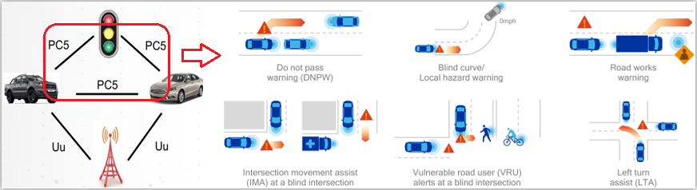
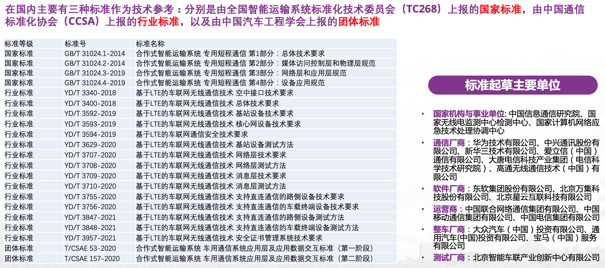
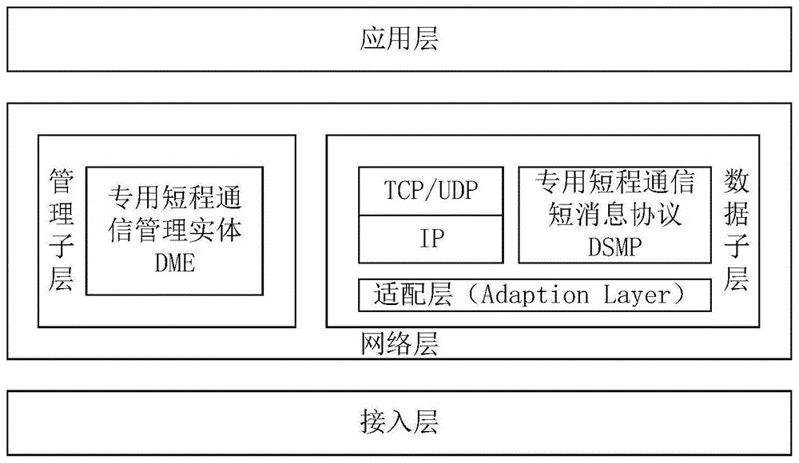

# C-V2X 

## 背景

- 2018年三跨：跨通信模组、跨终端、跨整车
- 2019年四跨：跨芯片模组、跨终端、跨整车、跨安全平台。中心频率5910MHz，带宽10MHz
- 2020新四跨：跨芯片模组、跨终端、跨整车、跨安全平台+高精地图和定位

## 术语

- ACME 可能是这个的缩写（Autonomous and Connected Mobility Evaluation）This is default tool that comes with the LTE-V2X Development Platform
(OBU/RSU) to interface with LTE-V2X RSU/OBU. It enables sending and receiving of raw
application layer byte arrays.

### RMnet

rmnet driver 适用于支持多分和聚集协议（MAP）。这个协议被所有近期使用高通技术的芯片所使用。

该驱动可以用于以 IP mode 注册到任何物理网络设备。物理传输包括 USB、HSIC、PCIe、IP 加速器等等。

## 标准

## 产品

5GAA 网站上2021年发布的设备列表 [List of C-V2X Devices](https://5gaa.org/wp-content/uploads/2021/11/5GAA_List_of_C_V2X_devices.pdf)。

这个列表中包含了：
- 芯片
- 模组（module）
- OBU
- RSU

## C-V2X 协议
C-V2X协议的总体技术要求标准为：
- GB/T 31024.1-2014
- YD/T 3400-2018

|协议层次|对应标准|
|-|-|
|应用层| T/CSAE 53—2020、T/CSAE 157-2020|
|消息层 |GB/T 31024.3-2019、YD/T 3709-2020|
|安全层 |YD/T 3957-2021|
|网络层 |GB/T 31024.3-2019、YD/T 3707-2020|
|接入层| GB/T 31024.2-2014、YD/T 3340-2018 |

C-V2X 中的C指Cellular，是基于3/4/5G等蜂窝通信技术演进，形成的车用无线通信技术。
C-V2X包含的通信接口有2类：
- PC5直连通信接口，适用于车、人、路之间短距离通信
- Uu远程通信接口，适用于终端和基站之间的远距离、大范围通信。

Uu和PC5都属于LTE-V2X接入层协议，网络层构成：
- 管理子层
  - 专用管理实体DME
- 数据子层
  - 底层为适配层
  - 上层为：TCP/IP 或 专用短消息协议DSMP

## C-V2X OTA 最小通信系统建立

物料：
- C-V2X 射频模组（收、发各1）
  - 国内厂商包括：移远C-V2X射频模组AG15（高通9150芯片）
- 应用处理器AP（收、发各1）
  - 例如：飞思卡尔imx6q

## References
- [Open Source Mobile Communications](https://osmocom.org/)
- [Quectel EC25 Linux](https://osmocom.org/projects/quectel-modems/wiki/EC25_Linux)
- [Rmnet Driver](https://www.kernel.org/doc/html/latest/networking/device_drivers/cellular/qualcomm/rmnet.html)
- [Android Kernel 逆向分析准备](https://pkiller.com/android/android-kernel-%E9%80%86%E5%90%91%E5%88%86%E6%9E%90%E5%87%86%E5%A4%87/)
- [vmlinux-to-elf](https://github.com/marin-m/vmlinux-to-elf)
- [移动基带安全研究系列之一](https://www.anquanke.com/post/id/186103)
- [Qualcomm Hexagon Product Suite](https://developer.qualcomm.com/software/hexagon-dsp-sdk/tools)