# CAN
CAN以总线形式统一了点对点的线束，降低了线束数量、成本、重量，提高了

## CAN 

主要特点：
- 总线，可挂载多设备
- 多主机（每个设备都可以是master）
- 无地址，区分设备依赖can id。
- 最大速率 1Mbps，但是常见的是高速 500kbps，低速125kbps。
- 最长线40m。
- 每帧数据8字节。

标准：
- ISO 11898-2

### 物理层

#### 电平表示
can使用双线差分表示电平信息。

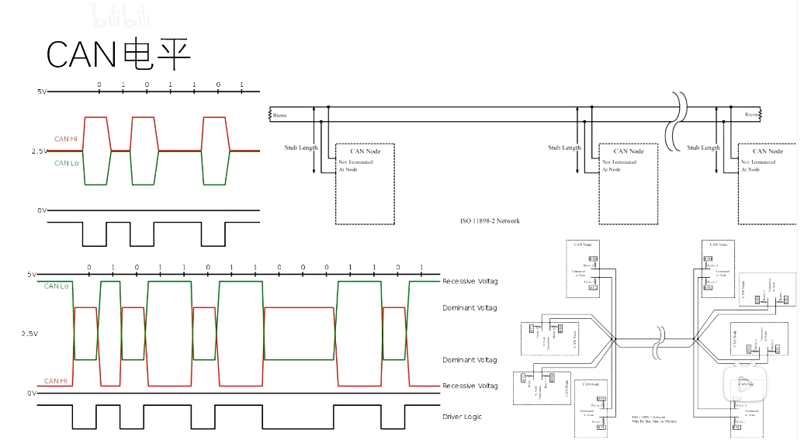

看上图，可见：

高速CAN
- 上半部分为高速can，采用Hi-Lo双线差分来表示具体信号值。
  - 例如： can-hi为+5v，can-lo为0v，那么这样的压差就表示二进制0（也称为显性电平）；
  - 又例如：can-hi为2.5v，can-lo为2.5v，那么这样的压差就为二进制1.（也称为隐性电平）；
  - 在高速can的两端，需要分别有一个终端电阻Rtem，阻值120欧。
  - 高速can上的每个节点，不需要挂终端电阻，直接接节点。

低速can（也称为容错CAN，即上图下半部分）：
- 每个节点，都需要挂终端电阻，不能直接接节点。
- 显性电平（即二进制0），can-hi 电压（3.xv）要比can-lo电压（1.xv）高；
- 隐性电平（即二进制1），can-lo 电压（5v）要比can-hi电压（0v）高。

通过差分电平定义，就可以表示0或1的二进制信息。

#### can 位定义

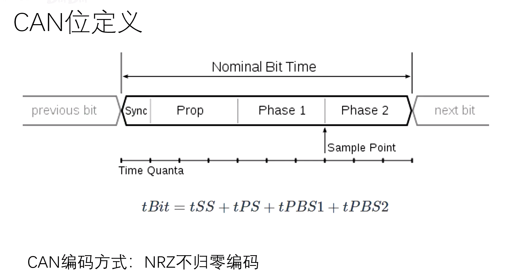

说明：
- 最前面的是同步信号，为了让每个设备都能接收到这个信号，所以必须传播间断时间必须大于2倍的传播时间。就是图中 tBit=tSS+tPS+tPBS1+tPBS2。假设工作在1mbps，那么tBit就应该是1s/1m = 1ms。

### 链路层
#### can 帧硬同步

如果两个CAN总线上设备没有设定在同一波特率，例如一个是115200 另一个是115000，那么一般串口通信会接收到乱码，但can具有容错性。

有两种同步方式：
- 硬同步（每一帧发送前，会有硬同步）：
  - 假设硬同步前，发送节点A发送一个帧，接收节点本来要接收的位置没有看到同步信号，而是滞后的位置看到同步信号，那么硬同步机制会令B强制在A的同步到来时再接收信号。如下图所示：

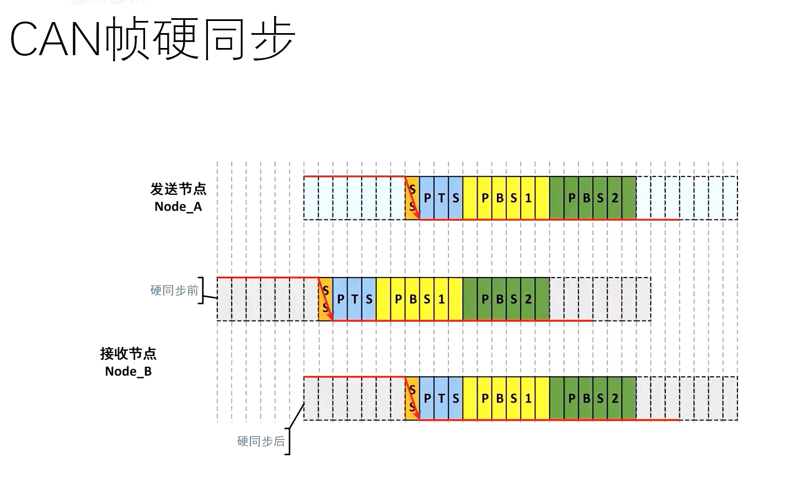

- 为了解决帧中间出现的不同步情况，还有一种位重同步
  - 假设发送节点慢，接收节点快，那么会产生跳变沿误差，这时，接收节点会在接收完 SYN+PTS+PBS1 后，插入等待，即延长PBS1，等待PBS2到来，保持同步。
  - 假设发送节点快，接收节点慢，那么发送节点会缩短PBS2，使之同步。

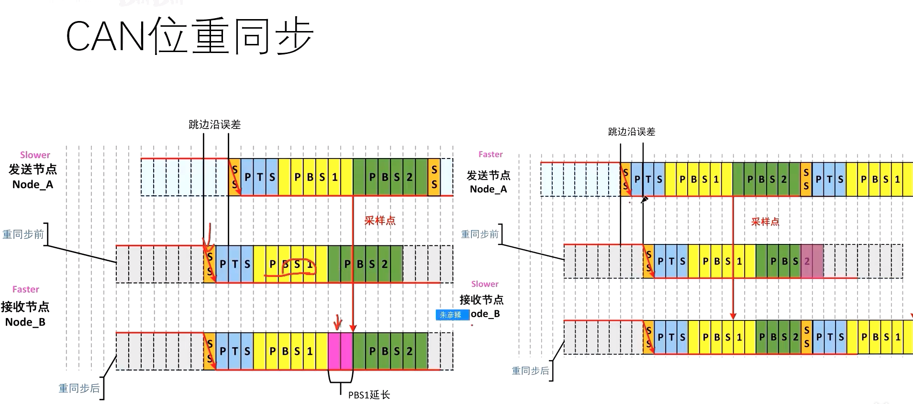

#### CAN 帧的类型

可分为：
- 数据帧：包含用于传输的节点数据，可包含0～8个字节数据。
  - 基本数据帧：11位ID，即0x000～0x7FF ，2048个。
  - 扩展数据帧：29位ID，即0x00000000～0x3FFFFFFF 。例如商用车中常见。

- 远程帧：请求传输特定标识符的帧。不包含任何数据（没有data field）。很少见。
- 错误帧：由任何检测到错误的节点发送的帧
- 过载帧：在数据帧或远程帧之间插入延迟的帧。

注意：CAN ID 在单一CAN总线上必须时唯一的，否则两个节点将在仲裁位（ID）传送结束后继续传输，造成错误。

#### can基本数据帧

看下图可知，一个基本帧包括8个字节：
- 帧头（SOF） 1bit=0
- Aribitration Field
  - CAN ID 11bit，ID10～ID0 
  - Reque Remote，1bit
- Control Field，即DLC
  - ID extention bit，若为1表示为扩展帧，为0表示基本帧
  - Reserved 保留位 1bit
  - DL3～DL0，4bit，数据长度
- DATA Field
  - DB7～DB0， 8bit
- CRC Field
  - CRC14～CRC0，15位
  - CRC delimiter ，1bit
- ACKnow shot bit ，1bit
- ACKnow delimiter，1bit
- End of Frame Field（EOF）
  - EOF6～EOF0，7bit
- IFS2
- IFS1
- IFS0

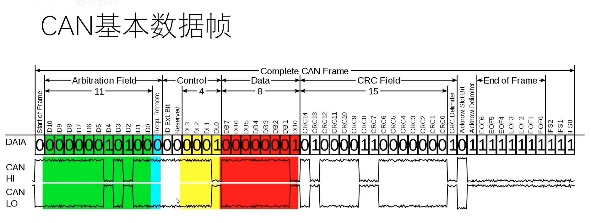

#### 帧优先级仲裁
CAN总线每一时刻仅允许一个节点占用总线。

对于同时发送到总线上的CAN帧，哪个优先？基本上CAN-ID（0～2047）越小越优先。

以下图为例：

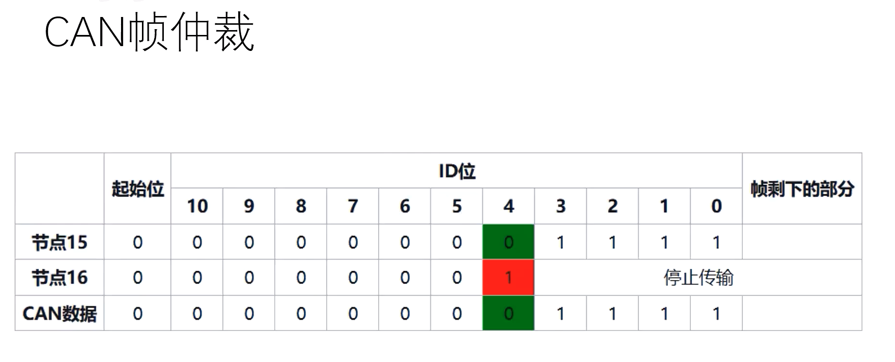

可以看到，节点15和节点16前面都一样，但到了id4位不一样了，节点15为0即显性电平，那么节点16位隐形电平，这时显性电平胜出，即节点15继续发，节点16不发了。

#### CAN的校验

CAN的CRC由15位CRC码组成

CAN的CRC计算算法由CRC1、CRC15、CRC17等多种：
- CRC1: 奇偶校验，即$x+1$
- CRC15：传统CAN，$x^{15}+x^{14}+x^{10}+x^{8}+x^{7}+x^{4}+x^{3}+x^{0}$
- CRC17:ISO can FD: $x^{17}+x^{16}+x^{14}+x^{13}+x^{11}+x^{6}+x^{4}+x^{3}+x^{1}+x^{0}$

#### 寻址方式
有两种方式：
- 点对点寻址 Noding Addressing
- 广播寻址 broadcasting addressing

CAN Controller 中会有一个Filter，可以过滤是否接收消息，即对比自身can id 与数据包中id来进行过滤。

#### 数据保护
手段有：
- CRC 对数据场进行校验
- Bit Monitoring
- stuff check
- ACKnowledgement check
- Form check：对固定位进行检查，例如EOF全为1

错误信号：
- error frame
- negative acknowledgement

Error correction：
- re-transmission，发送节点会重发

##### 发送节点的错误检查机制
主要是
- bit monitoring：检查发送的数据和回读的数据是否一致。
  - 发0回读1 ，在仲裁场部分认为是错误。
  - 发1回读0。在仲裁场部分不认为是错误。
- ack check
  - 发1回读0，不认为错误，表示有校验成功
  - 发0回读1，认为错误。

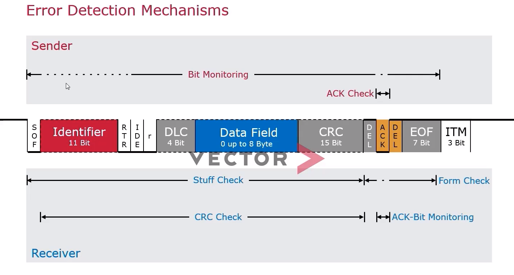

##### 接收者的错误检查机制
- stuff check，看上图的检查范围，按照每5个极性相同位就插入1个极性相反位的规则，如果填充出现6个或以上的极性相同就会报错。
- form check，查看帧中DEL、DEL、EOF都是固定的1.
- CRC check
- ACK-bit monitoring，接收节点回读自己发出的ack。
  - 发1读0
  - 发0读1，会在下一位立即发错误帧

#### 错误帧

当检查到错误，错误帧会立即发送（除CRC错误）。

错误帧构成：错误标志位+错误界定符

主动错误节点（error-active node）的错误帧：
- active error flag为 ： 000000
- 但如果别的节点也发现了错误，可能也会发000000，这样总线上就不止6个0了
- 界定符（delimiter）：11111111

被动错误节点（error-passive）node：
- passive error flag：111111
- delimiter：1111111

举例说明：
- 如下图所示,发送节点发现自己在第4位发0读1，所以立即插入error-active 帧的flag 000000
- 接收节点一开始并不知道发0读1，所以只有在后面发现填充规则被违反（连续五个极性相同位），所以在后面发出error-active 帧的flag 000000
- 可以看到，实际表现的错误帧是多于6个0（11个0）加6个1
- 错误帧在CAN中是批量出现的，因为所有发现错误的节点都会发出错误帧。
- 连续11个1出现后，总线自动纠错机制触发，发送节点再次发送原帧。

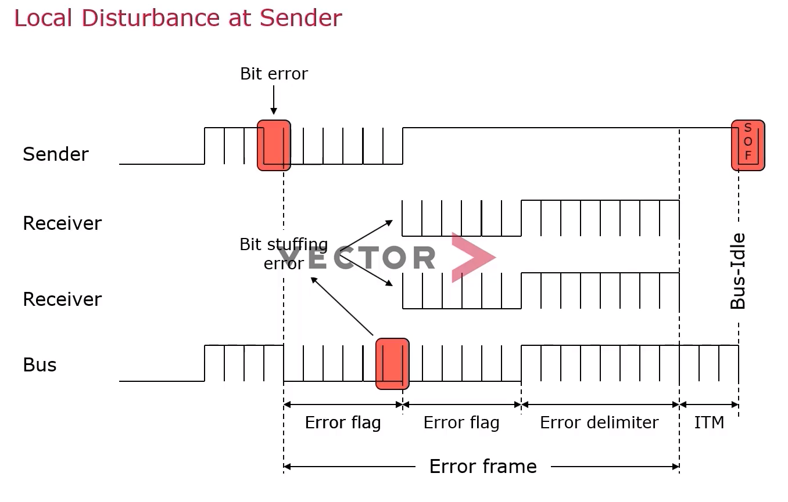

#### 错误界定（fault confinement）
如何确定节点处于主动or 被动错误状态？

为了减少潜在的错误节点扰乱总线。

CAN网络中的节点，必然处在下列3种状态之一：
- 主动错误状态（Error Active），即正常状态，该发发该收收。
- 被动错误状态（Error Passive），不允许3个bit帧间隔后不能立刻访问总线，等待8bit后才允许访问总线。
- Bus Off状态：不参与总线通信。

状态间的切换通过两个寄存器数值来控制：
- TEC
- REC

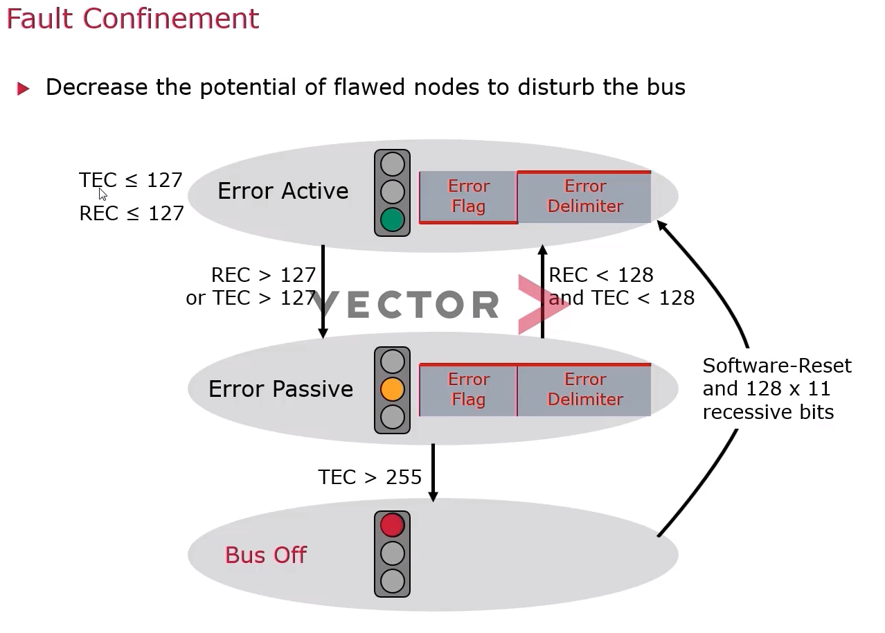

### CAN 硬件设计

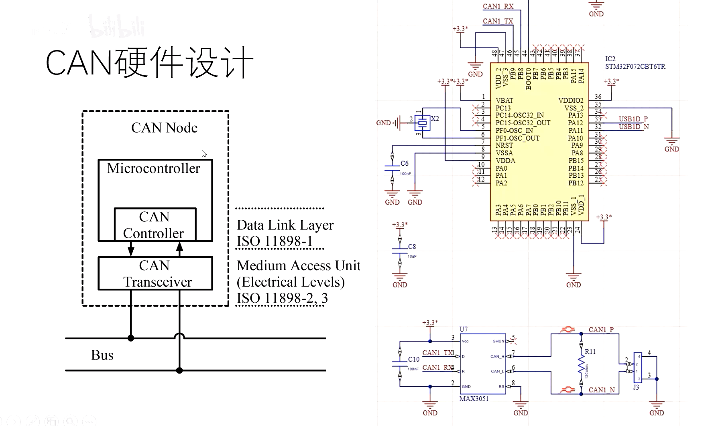

上面图中芯片

### CAN 系统结构

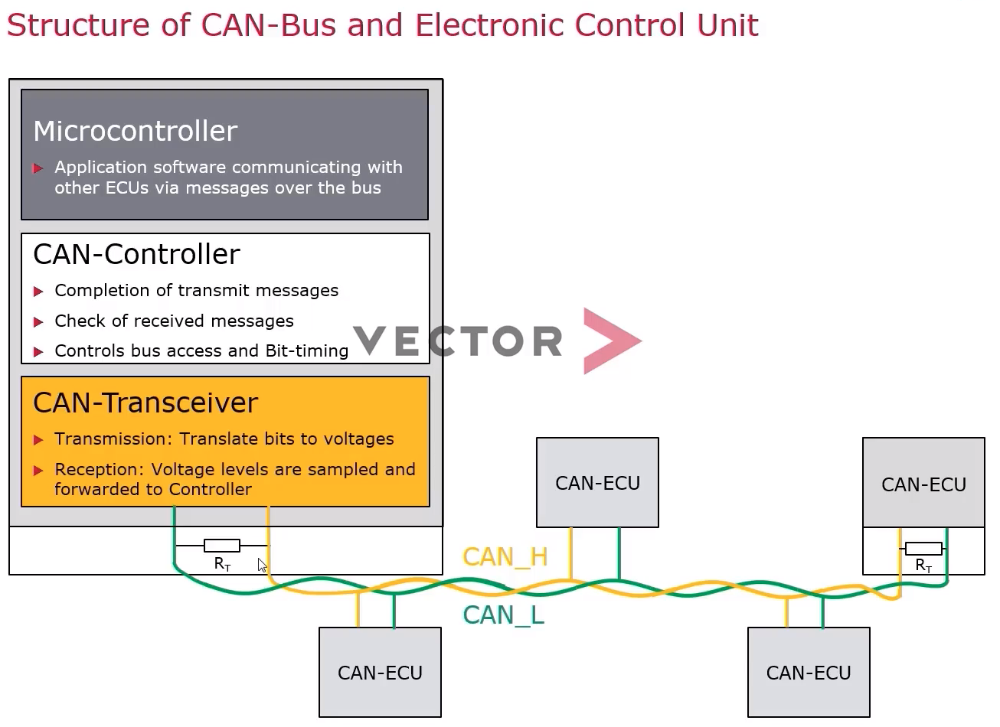

单节点系统：
- MCU
  - 执行应用程序，与其他ecu通信
  
- CAN-controller
  - 完成传输信息
  - 检查接收数据
  - 控制总线访问和bit-timing
- CAN-transceiver
  - 发送：转换比特为电压
  - 接收：电压水平采样并发送给控制器

## CANFD
可以理解成CAN协议的升级版，只升级了协议，物理层未改变。
Can与CanFD主要区别：
- 传输速率不同。
  - CAN最高1Mbps
  - CAN-FD，速率可变，仲裁比特率与CAN一样，最快1Mbps；数据比特率最高8Mbps。
- 数据长度不同，can一帧数据最长 8 Bytes；CAN-FD，一帧最长64字节。
- 帧格式不同，新增了FDF（确定为CAN还是CAN-FD报文）、BRS（位速率转换，该位隐性速率可变，否则恒定）、ESI（发送节点状态）位。
- ID长度不同。CAN标准帧ID长度11比特；CANFD标准帧长度可扩展为12比特。

## CAN 设备

### CANid
CAN device可以接收和发送多条不同的ID报文。 设备定义了接收ID 和 发送 ID，发送时可从定义的发送ID中选择，接收时只接收接收ID集中的。换句话说，在CAN协议里，报文的标识符不代表节点的地址，而是跟报文的内容相关的。因此，发送者以广播的形式把报文发送给所有的接收者。节点在接收报文时,根据标识符(CAN ID)的值决定软件是否需要该报文；如果需要，就拷贝到SRAM里；如果不需要，报文就被丢弃且无需软件的干预。

比如在一条CAN总线上有三个device，叫做A，Ｂ，C吧。
- A device有：
  - 接收ID：202，302；
  - 发送ID：101，102；
- B device有
  - 接收ID：101，303；
  - 发送ID：201，202；
- C device有
  - 接收ID：101，102，201；
  - 发送ID：302，303；

如果A device发送了ID为101的一条报文，因为B device和C device都有接收为101的ID，那么B device和C device都可以接收到这条报文。

如果A device发送了ID为102的一条报文，因为只有C device都有接收为102的ID，那么只有C device可以接收到这条报文。

如果B device发送了ID为202的一条报文，因为只有A device都有接收为202的ID，那么只有A device可以接收到这条报文。

可以看出，CAN ID其实是个报文过滤器，当总线上报文的ID和自己接收的ID有相匹配的时候，就可以接收相应的报文。

CAN中的ID是为了定义相应的报文的含义，每个ID对应有自己的具体含义。

注意：

- CANid的作用：1、主要用作CAN总线的仲裁使用，所以一般来说网络上的每个节点（向总线上发送）的ID应该有所不同。
- ID值越低，报文优先级越高，在两组不同ID报文同时上线时候，仲裁机制使得ID值低的占用总线，ID值高的退出。
- ID域可以是11位和29位，其值和含义可以由用户自定义，可以用作高层协议的管理，比如CANopen等协议中把ID的部分做为“源地址”，部分作为“目的地址”，这样CAN报文从哪来到哪去都清晰了。

3、ID的另一个作用是配合接收方滤波使用，就是说一般接收的滤波器可以设定接收ID的范围等，用于过滤掉不需要接收的信息，减轻CPU的处理负担。
