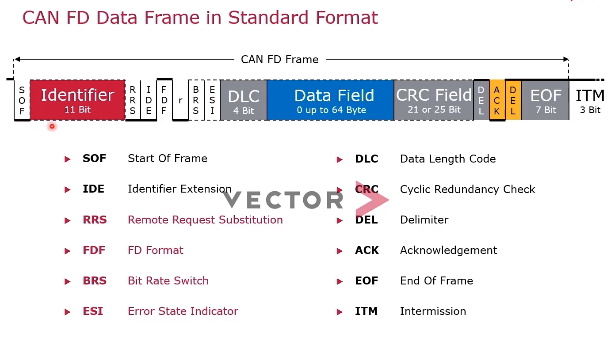
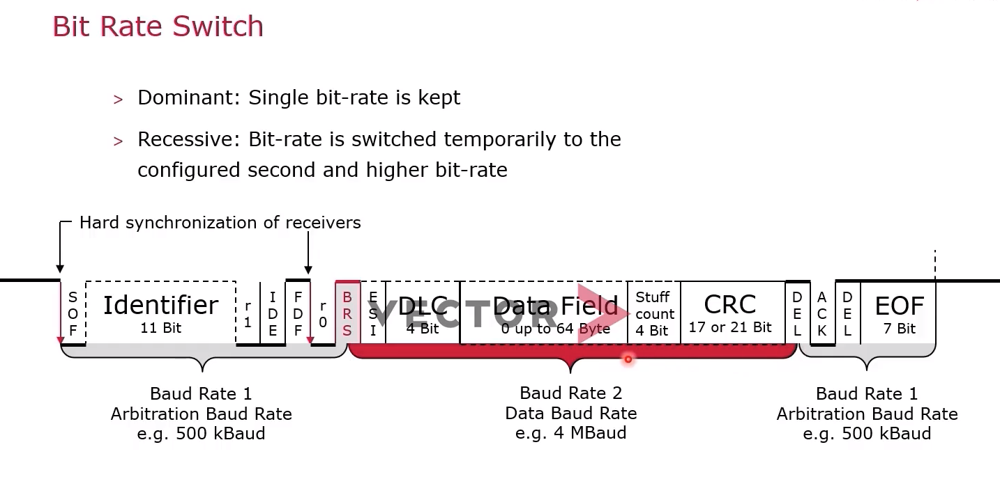

# CANFD

CAN 传统情况：
- 8字节数据载核
- 最高1mbps

而CANFD
- 更高速率，但不是所有位都一样，是可变速率，大体是中间高，两头低。最高8Mbps
- 更大的数据载核。由8个到64个字节。
- 新CAN控制器与传统CAN控制器比较小。

## 报文类型
- CANFD DATA Frame 标准帧
  - 11bit CANid
  - 数据段 0～64 字节
- CANFD DATA Frame 扩展帧
  - 29位 canid
  - 数据段 0～64字节

## 帧结构

- CANFD报文中低15位 FDF ：1表示为CANFD报文；0表示不是CANFD报文。
- RRS
## 位速度切换

