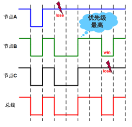
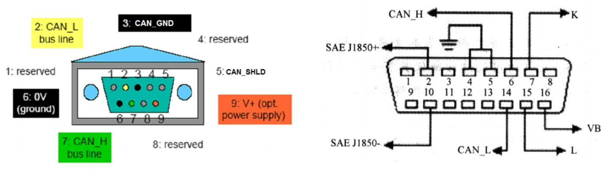

# CAN 网络

随着汽车ECU数量的不断增多，采用点对点的布线方式非常不合适，对线束冗余及维修成本要求越来越高，总线技术应运而生。CAN总线可以实现信息共享、减少线束、维修成本低等特点。

## 相关概念

### SPI
SPI是串行外设接口（Serial Peripheral Interface）的缩写，是一种高速的，全双工，同步的通信总线，并且在芯片的管脚上只占用四根线，节约了芯片的管脚，同时为PCB的布局上节省空间，提供方便，正是出于这种简单易用的特性，越来越多的芯片集成了这种通信协议，比如AT91RM9200。

###  CAN
Controller Area Network，简写为CAN。CAN是BOSCH公司开发的，最终成为国际标准（ISO11519），是国际上应用最广泛的现场总线之一。

CAN是一种多主控（multi-master）总线系统，实现广播式的消息发送，是一种基于广播模式的串行通信总线。例如CAN总线上可以并联工控pc、编码器、各类传感器、控制器、电机、接近开关、光电开关、信号调理模块、现场仪表等等。

CAN的最高传输速度为1Mbps，最远距离为10km，无损位仲裁机制。

### CAN 标准

CAN总线标准定义了物理层和数据链路层（ISO 11898）。不同的CAN仅仅是物理层不同。

- 应用层：用户自定义
  - Honeywell的SDS
  - ODVA的DeviceNet
  - CiA的CANopen
  - SAE的J1939
- 数据链路层（ISO11898）：
  - ISO 11898-1 ：11bit ID
  - ISO 11898-1 ： 11 bit 和 29 bit ID
  - ISO 11898-1 ： 29 bit ID
- 物理层
  - ISO 11898-2 或 ISO 11898-3 也即 BOSCH CAN2.0

### CAN 拓扑网络

CAN 网络的拓扑一般为总线型，线束为双绞线（CAN-H 和 CAN-L），线上传输为对称的差分电平信号，即物理媒介只需要2根线。

CAN网络中节点主要有：
- Host：常集成CAN控制器；
- 控制器：负责出列协议相关功能，以减轻Host负担；
- 收发器：将控制器连接到传输媒介。

<image src="images/can/can构成1.jpeg">

控制器和总线收发器通过光耦或磁耦隔离，这样即便总线上过压损坏收发器，控制器和Host设备也可以得到保护。

### 收发过程

发送数据时：
- 1.CAN控制器吧要发送的二进制编码通过CAN-TX线发送到CAN收发器；
- 2.收发器吧这个普通的逻辑电平信号转化为差分信号，通过差分线CAN-High 和 CAN-Low 输出到CAN总线网络。

接收数据时与发送数据相反。

采用差分信号，可以取得更好的电磁兼容效果。

## 物理规格
高速CAN总线最高信号传输速率为1Mbps，支持最长距离40m。

ISO11898-2要求在高速CAN总线两段安装端接电阻RL（端接电阻一般为120Ω，因为电缆的特性阻抗为120 Ω，为了模拟无限远的传输线。）以消除反射。

低速CAN最高速度只有125Kbps，所以ISO11898-3没有端接要求。

<image src="images/can/电阻接发.png">

因为传输距离越大，信号时延也越大，为了保证消息的正确采样，总线上的信号速率相应也要下降。下图是推荐的信号速率与距离的关系。

<image src="images/can/采样速率参考表.png">

### CAN 收发器

CAN总线分为高速、低速两种，收发器也分为高速（1Mbps）、低速（125Kbps）两种。

低速CAN也叫 Fault Tolerance CAN，即总线上一根线失效，总线依然可以通信。如同串口中MAX3232用作电平转换，CAN收发器的作用则是吧逻辑信号转换为差分信号。

<image src="images/can/can收发器.png">

#### 差分信号

CAN总线采用差分信号传输，通常情况下只需要两根信号线就可以正常通信。在差分信号中，逻辑 0 和逻辑 1 是用两个差分信号线的电压差来表示。

当处于逻辑1，CAN-High 和 CAN-low的电压差小于 0.5V时，成为隐性电平（recessive）；

当处于逻辑0，CAN-High 和 CAN-low的电压差大于 0.9V时，成为显性电平（dominant）；

高速CAN信号:

<image src="images/can/高速CAN信号.png">
<image src="images/can/高速CAN信号2.jpeg">

低速CAN信号:

<image src="images/can/低速CAN信号1.png">

CAN总线遵从“线与”机制：
- “显性”位可以覆盖“隐性位”；
- 所有节点都发送“隐性位”，总线才为隐性位。

线与机制使CAN总线呈现显性优先的特点。

### CAN 总线连接器

#### 左图，DB9连接器：
- 1 保留
- 2 CAN-L bus line
- 3 CAN GND
- 4 Reserved
- 5 CAN-SHLD
- 6 0V （ground）
- 7 CAN-H bus line
- 8 reserved
- 9 V+ （opt power supply）

#### 右图 DB16
- 2 SAE J1850 +
- 4与5 GND
- 6 CAN-H
- 7 K
- 14 CAN-L
- 10 SAE J1850 -
- 15 L
- 16 VB

## 数据链路层

在SPI通信中，片选、时钟、数据输入、数据输出这4歌信号都有单独的信号线。

CAN使用的是两条差分信号线，只能表达一个信号。简单的物理层必然要一个复杂的上层协议才能发挥功能。如何实现？答案就是对数据或操作命令进行打包。

### 通信机制

#### 多主机（multi-master）

安全敏感的应用（如汽车动力）对通信系统的可靠性要求很高。将总线能否正常工作归结到单一节点是非常危险的，比较合理的方案是对总线接入的去中心化，即每个节点都有介入总线的能力。也是CAN总结采用多主控线性拓扑结构的原因。

CAN总线上，每个节点都有往总线上发送消息的能力，而消息的发送不必遵从任何预先设定的时序，通信是事件驱动的。

只有当新的信息传递时，CAN总线才处于忙碌的状态，这使得节点接入总线的速度非常快。CAN总线理论最高数据传输速率为1Mbps，对于异步事件反应迅速，基本对于ms级别的实时应用没有任何问题。

#### 寻址机制

不同于其他类型的总线，CAN总线不设定节点的地址，而是通过消息的标识（Identifier）来区别消息。这种机制虽然增加了消息的复杂度（增加了标识符），但节点在此情况下可以无需了解其他节点的状况，而相互间独立工作。

在总线上增加节点时仅需关注消息类型，而非系统上其他节点的状况。

#### 总线访问 CSMA/CD + AMP

CAN总线通信原理：多路载波侦听 + 基于消息优先级的冲突检测 + 非破坏性仲裁机制 （CSMA/CD + AMP）。

CSMA（Carrie Sense Multiple Access）指的是所有节点必须都等到总线处于空闲状态时才能往总线上发送消息；

CD+AMP（Collision Detection + Arbitration on Message Priority）指的是如果多个节点往总线上发送消息时，具备最高优先级的消息获得总线。

- 多路载波侦听：网络上所有节点以多点接入的方式连接在同一根总线上，且发送数据是广播式的。网络上各个节点在发送数据前都要检测总线上是否有数据传输：若网络上有数据，暂时不发送数据，等待网络空闲时再发；若网络上无数据，立即发送已经准备好的数据。
- 冲突检测：节点在发送数据时，要不停的检测发送的数据，确定是否与其他节点数据发送冲突，如果有冲突，则保证优先级高的报文先发送。
- 非破坏性仲裁机制：通过ID仲裁，ID数值越小，报文优先级越高

发送低优先级报文的节点退出仲裁后，在下次总线空闲时自动重发报文。

https://zhuanlan.zhihu.com/p/32262127
