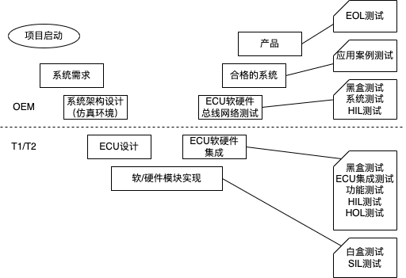

# CAN 通信矩阵

## CAN总线开发流程
V字开发流程

## 通信矩阵
CAN 通信矩阵通常由OEM车企完成定义，车辆网络中的各个节点需要遵循该矩阵才能完成信息的交互和共享。

ISO 11898协议规定了CAN总线的数据链路层和物理层，但未定义具体的CAN ID和数据。乘用车在满足UDS和尾气排放协议后，剩余了绝大部份的ID段，这些ID段由OEM自主分配，分配好后会形成一个excel格式表格。有了个这个表格，开发人员就知道零部件应该接收哪些ID的数据，需要发送什么ID的数据。

例如：

从网络接收的信号
|#|signal name |bit length|resolution/精度|offset 偏移量|physical range 物理范围|Default value 默认值|Invalid value 无效值|Unit 单位|Period 希望周期| remarks 备注|
|-|-|-|-|-|-|-|-|-|-|-|

- 信号名称：一般以发送字节的名字开头，“_"后面是具体指代的内容，如BMS_GeneralStatus
- 信号长度：该信号的长度，单位bit。
- 精度/偏移量：描述信号值如何转变为信号物理值。比如精度是2，偏移量是5，那么信号的真实物理值=信号值*2+5.
- 物理值范围：经过物理值转换后的最大最小值。

## CAN 总线测试

CAN总线测试可以分为单节点测试、总线集成测试等。

功能性测试要确保每个节点和系统的：

- 完整性
- 正确性
- 系统通信鲁棒性
- 电气鲁棒性
- 系统容错自恢复能力

测试过程：

- 1.制定测试规范
  - 由于CAN协议的灵活性，目前没有统一的测试规范，各厂商自定义。
  - 通常结合设计需求和规范文档提取测试需求。
- 2.依据规范编写测试方案
  - CAN总线测试内容可以按通信层次划分为物理层测试、数据链路层测试、应用层测试等内容。
  - 物理层测试主要包含节点及系统在电路设计、物理电平特性等方面的性能。包括电阻电容特性、节点差分电阻、总线终端电阻、CAN线上的物理电平特性等方面。
  - 数据链路层测试，包括位定时测试、采样点测试、SJW测试等内容。保证各节点的通信参数能够保证一致性，所组成的网络能够正常有效工作。
  - 应用层测试包括了上层应用层协议测试、网络管理功能测试、故障诊断测试等。包括的内容有：数据库使用正确性测试、通信周期准确性测试、节点休眠唤醒功能测试、网络管理功能测试、网关测试、错误帧频率测试、电压影响测试、总线物理故障测试、节点故障自恢复能力测试、通信失败的故障诊断功能测试等。
- 3.构建测试环境 
  - 
- 4.测试实施
- 5.数据分析
- 6.形成报告

## 工具
- 低价的用周立功
- 数千元的PCAN、Kvaser的USBCAN
- 数万元的Vector VN1600

这些工具需要是双通道的，一收一发。

嵌入式平台：

- 入门级： STM32F103C8T6（16元）、ST-LINK 下载器 （18元）、免费软件 STM32Cube IDE

## 协议
- J1939 商用车
- CANOpen 用于现场控制，如电机控制器。
- ISO 15031-5 用于OBD诊断。
  

## Refrences
- [如何进行汽车CAN总线开发](https://www.zhihu.com/question/35630289)
- [CAN总线系统测试技术](https://link.zhihu.com/?target=http%3A//wenku.baidu.com/link%3Furl%3D04J7gkG6TFOaIZzooLEOP4hY2__K38czWLp7nBxWQ2F3iL0SSDPLc2D4CwCicDRsF80ASDgEHqsVWe5YbaammLo1XLy0oGa4yDjC1qHmRaa)

- [CAN基础](https://link.zhihu.com/?target=http%3A//wenku.baidu.com/link%3Furl%3DddTATD4HHbeWzFOnR0souA9yK2D9wCrrduMnvx9R7a-qUvcawr51NGSEGuC1EdyIqQt4vb7Mlan75w_zrxbd4myYnTZbAanGwbzIcxVbcR3)

- [总写协议介绍合集](https://link.zhihu.com/?target=https%3A//www.bilibili.com/video/BV1M5411N7Kc/%3Fshare_source%3Dcopy_web)
- [为什么can总线上显性和隐性电平，显性具有优先，有一个单元输出显性总线上即为显性？](https://www.zhihu.com/question/53821741/answer/144260312)