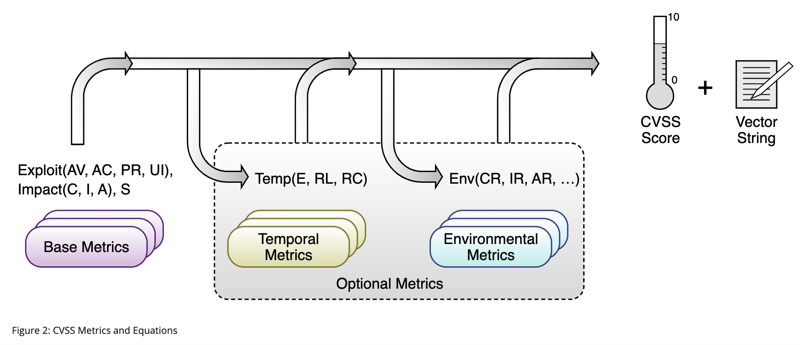

# CVSS v3.1 标准

文章来源: https://www.first.org/cvss/v3.1/specification-document


通用漏洞评分系统（CVSS）是一个开放的框架，用于交流软件漏洞的特征和严重程度。CVSS由三个度量组组成：基本、时间和环境。基本组表示漏洞的内在质量，这些内在质量随着时间的推移和用户环境的变化而变化，时间组反映漏洞的特征，这些特征随着时间的变化而改变，环境组表示用户环境特有的漏洞特征。基本指标产生的分数范围从0到10，然后可以通过对时间和环境指标进行评分来修改。CVSS分数也表示为向量字符串，这是用于导出分数的值的压缩文本表示。最新的CVSS资源可以在 https://www.first.org/cvss/ 找到。

CVSS由美国非营利性组织FIRST.Org，Inc.（FIRST）拥有和管理，其使命是帮助全球的计算机安全事件响应团队。FIRST保留自行决定定期更新CVSS和本文件的权利。虽然FIRST拥有CVSS的所有权利和权益，但它允许公众自由使用，但须符合以下条件。FIRST的成员资格不需要使用或实施CVSS。然而，FIRST确实要求任何使用CVSS的个人或实体在适用的情况下给予适当的归属，即CVSS归FIRST所有并经许可使用。此外，FIRST要求公布分数的任何个人或实体符合本文件中描述的指南，并提供分数和分数向量，以便其他人能够理解分数是如何得出的，以此作为使用条件。

## 1. 简介

通用漏洞评分系统（CVSS）捕捉了软件、硬件和固件漏洞的主要技术特征。它的输出包括表示漏洞相对于其他漏洞的严重程度的数字分数。CVSS由三个度量组组成：基本、时间和环境。基本得分根据漏洞的内在特征反映了漏洞的严重性，这些特征随着时间的推移是恒定的，并假设在不同的部署环境中存在合理的最坏情况影响。时间度量根据随时间变化的因素（如漏洞代码的可用性）调整漏洞的基本严重性。环境度量根据特定的计算环境调整基本严重性和时间严重性。他们考虑了诸如在该环境中存在缓解措施等因素。

基本分数通常由维护易受攻击产品的组织或代表其进行评分的第三方产生。通常只发布基本度量，因为这些度量不会随时间变化，并且对所有环境都是通用的。CVSS的消费者应使用针对其使用易受攻击产品的时间和环境评分来补充基本评分，以产生更准确的组织环境严重程度。消费者可以使用CVSS信息作为组织漏洞管理流程的输入，该流程还考虑了不属于CVSS的因素，以便对其技术基础设施的威胁进行排名，并做出明智的补救决定。这些因素可能包括：产品线上的客户数量、违约造成的金钱损失、生命或财产受到威胁，或公众对高度公开的漏洞的情绪。这些不在CVSS的范围内。

CVSS的好处包括提供标准化的供应商和平台无关的漏洞评分方法。这是一个开放的框架，为用于得出分数的个人特征和方法提供了透明度。

### 1.1. 指标

CVSS由三个度量组组成：Base、Temporal和Environmental，每个度量组都由一组度量组成，如图1所示。


基本度量组表示漏洞的内在特征，这些特征在一段时间内和用户环境中是不变的。它由两组度量组成：可利用性度量和影响度量。可利用性指标反映了可利用漏洞的易用性和技术手段。也就是说，它们代表了易受攻击的事物的特征，我们将其正式称为易受攻击组件。影响指标反映了成功利用的直接后果，并代表了遭受影响的事物的后果，我们正式将其称为受影响的组件。虽然易受攻击的组件通常是软件应用程序、模块、驱动程序等（或可能是硬件设备），但受影响的组件可能是软件应用、硬件设备或网络资源。这种测量易受攻击组件以外的漏洞影响的可能性是CVSS v3.0引入的一个关键功能。此属性由Scope度量捕获，稍后将进行讨论。时间度量组反映了漏洞的特征，这些特征可能会随着时间的推移而变化，但不会在用户环境中发生变化。例如，一个简单易用的漏洞利用工具包的存在会增加CVSS分数，而官方补丁的创建会降低分数。环境指标组表示与特定用户环境相关且唯一的漏洞特征。考虑因素包括可能减轻成功攻击的部分或全部后果的安全控制措施的存在，以及技术基础设施中易受攻击系统的相对重要性。下面将进一步详细讨论这些指标中的每一个。《用户指南》包含基本指标的评分准则，这些准则在评分时可能很有用。

### 1.2 评分

当分析师为基本指标赋值时，基本方程计算的得分范围为0.0至10.0，如图2所示。



具体而言，基本方程由两个子方程推导而来：可开采性子得分方程和影响子得分方程。可利用性子得分方程源自基本可利用性指标，而影响子得分方程则源自基本影响指标。然后，可以通过对时间和环境指标进行评分来细化基本得分，以便更准确地反映特定时间点用户环境的漏洞造成的相对严重性。不需要对时间和环境指标进行评分，但建议进行更精确的评分。

通常，基本和时间度量由漏洞公告分析师、安全产品供应商或应用程序供应商指定，因为他们通常拥有有关漏洞特征的最准确信息。环境指标由最终用户组织指定，因为他们最能评估自己计算环境中漏洞的潜在影响。对CVSS度量进行评分还会生成一个向量字符串，这是用于对漏洞进行评分的度量值的文本表示。此矢量字符串是一个特定格式的文本字符串，包含分配给每个度量的每个值，并且应始终与漏洞分数一起显示。下面将进一步解释评分方程和向量串。

请注意，所有指标都应在假定攻击者已经找到并识别了漏洞的情况下进行评分。也就是说，分析人员不需要考虑识别漏洞的方法。此外，许多不同类型的个人可能会对漏洞进行评分（例如，软件供应商、漏洞公告分析师、安全产品供应商），但请注意，漏洞评分对个人及其组织来说是不可知的。

## 2. 基本矩阵
### 2.1 可利用性指标

如前所述，可利用性指标反映了易受攻击的事物的特征，我们将其正式称为易受攻击组件。因此，下面列出的每个可利用性指标都应该相对于易受攻击的组件进行评分，并反映导致成功攻击的漏洞的财产。

在对基本指标进行评分时，应假设攻击者对目标系统的弱点有深入的了解，包括一般配置和默认防御机制（例如，内置防火墙、速率限制、流量监管）。例如，利用导致可重复、确定性成功的漏洞仍然应被视为攻击复杂性的低值，与攻击者的知识或能力无关。此外，针对特定目标的攻击缓解（例如，自定义防火墙过滤器、访问列表）应反映在环境指标评分组中。特定配置不应影响对CVSS基本得分有贡献的任何属性，即，如果攻击需要特定配置才能成功，则应在假设处于该配置的情况下对易受攻击的组件进行评分。

#### 2.1.1.攻击向量（AV）

此指标反映了可能利用漏洞的情况。攻击者利用易受攻击的组件的远程（逻辑上和物理上）越远，该度量值（以及因此的基本得分）就会越大。假设可以通过网络利用的漏洞的潜在攻击者数量大于可以利用需要物理访问设备的漏洞的可能攻击者数量，因此有理由获得更高的基本分数。可能的值列表如表1所示。


|矩阵值|描述|
|-|-|
|度量值|易受攻击的组件绑定到网络堆栈，并且一组可能的攻击者扩展到下面列出的其他选项之外，甚至包括整个互联网。这种漏洞通常被称为“可远程利用”，可以被认为是在一个或多个网络跳离（例如，跨一个或更多个路由器）的协议级别可利用的攻击。网络攻击的一个例子是，攻击者通过广域网发送特制的TCP数据包（例如 CVE‑2004‑0230），从而导致拒绝服务（DoS）。|
|相邻（A）|易受攻击的组件绑定到网络堆栈，但攻击在协议级别仅限于逻辑相邻的拓扑。这可能意味着攻击必须从相同的共享物理（例如，蓝牙或IEEE 802.11）或逻辑（例如，本地IP子网）网络发起，或者从安全或以其他方式受限的管理域（例如，MPLS，到管理网络区域的安全VPN）内发起。相邻攻击的一个例子是ARP（IPv4）或邻居发现（IPv6）泛滥，导致本地LAN段上的拒绝服务（例如，CVE‑2013‑6014）。|
|本地（L）|本地（L）易受攻击的组件未绑定到网络堆栈，攻击者的路径是通过读/写/执行功能。两者之一：攻击者通过本地（例如键盘、控制台）或远程（例如SSH）访问目标系统来利用该漏洞；或攻击者依靠另一个人的用户交互来执行利用该漏洞所需的操作（例如，使用社会工程技术诱骗合法用户打开恶意文档）。|
|物理（P）|攻击要求攻击者对易受攻击的组件进行物理触摸或操作。身体互动可能是短暂的（例如，邪恶女仆攻击）或持续的。这种攻击的一个例子是冷启动攻击，其中攻击者在物理访问目标系统之后获得对磁盘加密密钥的访问。其他示例包括通过FireWire/USB直接内存访问（DMA）进行的外围设备攻击。|

评分指南：在决定网络和相邻网络时，如果可以通过广域网或从逻辑相邻的管理网络域之外发起攻击，请使用网络。即使攻击者需要在同一企业网络上才能利用易受攻击的系统，也应使用网络（例如，攻击者只能从公司网络内部利用该漏洞）。

#### 2.1.2. Attack Complexity (AC)

此指标描述了攻击者无法控制的情况，这些情况必须存在才能利用该漏洞。如下所述，这样的条件可能需要收集更多关于目标的信息，或者计算异常。重要的是，该指标的评估排除了利用漏洞进行用户交互的任何要求（这些条件在用户交互指标中被捕获）。如果攻击需要特定的配置才能成功，则应假设易受攻击的组件处于该配置中，对基本指标进行评分。对于最不复杂的攻击，基本得分最高。表2中列出了可能的值。

|矩阵值|描述|
|-|-|
|低（L）|不存在特殊准入条件或情有可原的情况。攻击者在攻击易受攻击的组件时可能会获得可重复的成功。|
|高（H）|成功的攻击取决于攻击者无法控制的条件。也就是说，成功的攻击不能随意完成，但需要攻击者投入一定的精力来准备或执行针对易受攻击组件的攻击，然后才能预期成功的攻击。[^2]例如，成功的攻击可能取决于攻击者能否克服以下任何条件：（1）攻击者必须收集有关易受攻击的目标/组件所在环境的信息。例如，要求收集有关目标配置设置、序列号或共享机密的详细信息。（2）攻击者必须准备好目标环境以提高攻击可靠性。例如，重复利用以赢得比赛条件，或克服先进的利用缓解技术。（3）攻击者必须将自己插入目标和受害者请求的资源之间的逻辑网络路径，以便读取和/或修改网络通信（例如，中间人攻击）。|

如第2.1节所述，对易受攻击组件的详细了解不在攻击复杂性的范围内。当存在特定于目标的攻击缓解时，在对攻击复杂性进行评分时，请参阅该部分以获得更多指导。


#### 2.1.3 所需特权（PR）

此指标描述了攻击者在成功利用该漏洞之前必须拥有的权限级别。如果不需要特权，则基本得分最高。可能的值列表如表3所示。

|矩阵值|描述|
|-|-|
|无（N）|攻击者在攻击前未经授权，因此不需要对易受攻击系统的设置或文件进行任何访问即可进行攻击。|
|低（L）|攻击者需要提供基本用户功能的权限，这些功能通常只会影响用户拥有的设置和文件。或者，具有低权限的攻击者只能访问非敏感资源。|
|高（H）|攻击者需要对易受攻击的组件提供重要（例如，管理）控制的权限，以便访问组件范围的设置和文件。|

评分指南：对于硬编码的凭证漏洞或需要社会工程的漏洞（例如，反映的跨站点脚本、跨站点请求伪造或PDF阅读器中的文件解析漏洞），“所需权限”通常为“无”。

#### 2.1.4 用户交互（UI）

此度量捕获了除攻击者之外的人类用户参与成功危害易受攻击组件的要求。此指标确定是否可以仅根据攻击者的意愿利用漏洞，或者是否必须由单独的用户（或用户启动的进程）以某种方式参与。当不需要用户交互时，基本得分最高。可能的值列表如表4所示。

|矩阵值|描述|
|-|-|
|无（N）|易受攻击的系统可以在没有任何用户交互的情况下被利用。|
|必需（R）|成功利用此漏洞需要用户在利用该漏洞之前采取一些操作。例如，只有在系统管理员安装应用程序的过程中，才有可能成功利用漏洞。|


### 2.2 范围（S）

范围度量捕获一个易受攻击组件中的漏洞是否会影响超出其安全范围的组件中的资源。

从形式上讲，安全授权是一种机制（例如，应用程序、操作系统、固件、沙盒环境），它定义并强制执行访问控制，即某些主体/参与者（例如，人类用户、进程）如何以受控的方式访问某些受限制的对象/资源（例如，文件、CPU、内存）。单一担保机构管辖下的所有主体和对象都被视为在一个担保范围内。如果易受攻击的组件中的漏洞会影响与该易受攻击组件处于不同安全范围的组件，则会发生范围更改。直观地说，每当漏洞的影响突破安全/信任边界并影响易受攻击组件所在的安全范围之外的组件时，就会发生范围更改。组件的安全范围包括仅为该组件提供功能的其他组件，即使这些其他组件具有自己的安全权限。例如，一个应用程序单独使用的数据库被视为该应用程序安全范围的一部分，即使该数据库具有自己的安全权限，例如，基于数据库用户和相关数据库权限控制对数据库记录的访问的机制。当范围发生变化时，基本得分最大。可能的值列表如表5所示。

|矩阵值|描述|
|-|-|
|未更改（U）|被利用的漏洞只能影响由同一安全机构管理的资源。在这种情况下，易受攻击的组件和受影响的组件要么相同，要么由同一安全机构管理。|
|已更改（C）|被利用的漏洞可能会影响由易受攻击组件的安全机构管理的安全范围之外的资源。在这种情况下，易受攻击的组件和受影响的组件是不同的，由不同的安全机构管理。|

### 2.3.影响指标

影响指标捕捉成功利用的漏洞对遭受最坏结果的组件的影响，该结果与攻击最直接、最可预测地相关。分析师应将影响限制在合理的最终结果，他们相信攻击者能够实现这一结果。在对漏洞的影响指标进行评分时，只应考虑由于成功利用漏洞而导致的访问权限、特权的增加或其他负面结果。例如，考虑一个需要只读权限才能利用该漏洞的漏洞。成功利用后，攻击者将保持相同级别的读取访问权限，并获得写入访问权限。在这种情况下，只应对完整性影响指标进行评分，而机密性和可用性影响指标应设置为无。

请注意，当对影响的德尔塔变化进行评分时，应使用最终影响。例如，如果攻击者开始部分访问受限信息（机密性低），并且成功利用该漏洞导致机密性完全丧失（机密性高），则由此产生的CVSS基本得分应参考“最终游戏”影响度量值（机密性高时）。

如果范围没有发生变化，影响指标应反映对易受攻击组件的保密性、完整性和可用性的影响。但是，如果范围发生了变化，则影响指标应反映机密性、完整性和可用性对易受攻击的组件或受影响的组件的影响，以最严重的结果为准。


#### 2.3.1.保密（C）

此指标衡量由于成功利用漏洞而对软件组件管理的信息资源的机密性造成的影响。保密性是指仅将信息访问和披露限制在授权用户，并防止未经授权的用户访问或披露信息。当受影响组件的损失最大时，基本得分最大。表6中列出了可能的值。

|矩阵值|描述|
|-|-|
|高（H）|完全失去机密性，导致受影响组件中的所有资源泄露给攻击者。或者，只获得一些受限制的信息，但披露的信息会产生直接、严重的影响。例如，攻击者窃取了管理员的密码或网络服务器的私有加密密钥。|
|低（L）|保密性有所损失。可以访问某些受限制的信息，但攻击者无法控制所获得的信息，或者损失的数量或种类受到限制。信息披露不会对受影响的组件造成直接、严重的损失。|
|无（N）|受影响的组件内部不存在机密性损失。|

#### 2.3.2.完整性（I）

此指标衡量成功利用的漏洞对完整性的影响。诚信是指信息的可信度和真实性。当受影响组件的后果最高时，基本得分最高。可能的值列表如表7所示。

|矩阵值|描述|
|-|-|
|高（H）|完全失去完整性，或完全失去保护。例如，攻击者能够修改受影响组件保护的任何/所有文件。或者，只能修改某些文件，但恶意修改会对受影响的组件造成直接、严重的后果。|
|低（L）|修改数据修改是可行的，但攻击者无法控制修改的结果，或者修改的数量有限。数据修改不会对受影响的组件产生直接、严重的影响。|
|无（N）|受影响部件内没有完整性损失。|

#### 2.3.3可用性（A）

此指标衡量成功利用漏洞对受影响组件可用性的影响。虽然保密性和完整性影响指标适用于受影响组件使用的数据（如信息、文件）的保密性或完整性损失，但该指标指的是受影响组件本身的可用性损失，如网络服务（如网络、数据库、电子邮件）。由于可用性是指信息资源的可访问性，因此消耗网络带宽、处理器周期或磁盘空间的攻击都会影响受影响组件的可用性。当受影响组件的后果最高时，基本得分最高。表8列出了可能的值。

|矩阵值|描述|
|-|-|
|高（H）|完全失去可用性，导致攻击者能够完全拒绝访问受影响组件中的资源；这种损失要么是持续的（当攻击者继续进行攻击时），要么是持久的（即使在攻击完成后，这种情况仍然存在）。或者，攻击者有能力拒绝某些可用性，但可用性的丧失会直接导致，对受影响的组件造成的严重后果（例如，攻击者无法中断现有连接，但可以阻止新的连接；攻击者可以重复利用漏洞，在每次成功攻击的情况下，该漏洞只会泄漏少量内存，但在重复利用该漏洞后，会导致服务完全不可用）。|
|低（L）|性能降低或资源可用性中断。即使有可能重复利用该漏洞，攻击者也无法完全拒绝向合法用户提供服务。受影响组件中的资源要么一直是部分可用的，要么只是部分时间完全可用，但总体而言，对受影响组件没有直接、严重的后果。|
|无（N）|对受影响组件内的可用性没有影响。|


## 3.时间度量

时间度量衡量漏洞利用技术或代码可用性的当前状态、是否存在任何补丁或解决方案，或对漏洞描述的信心。

### 3.1.利用代码成熟度（E）

该指标衡量漏洞受到攻击的可能性，通常基于当前的利用技术状态、利用代码可用性或活跃的“野外”利用。易于使用的漏洞代码的公开性增加了潜在攻击者的数量，包括那些不熟练的攻击者，从而增加了漏洞的严重性。最初，现实世界中的剥削可能只是理论上的。随后可能会发布概念验证代码、功能利用代码或利用漏洞所需的足够技术细节。此外，可用的漏洞利用代码可能会从概念验证演示发展到持续成功利用漏洞的代码。在严重的情况下，它可能会作为基于网络的蠕虫或病毒或其他自动攻击工具的有效载荷提供。

可能的值列表如表9所示。漏洞越容易被利用，漏洞得分就越高。

|矩阵值|描述|
|-|-|
|未定义（X）|指定此值表示没有足够的信息来选择其他值之一，并且对整体时间分数没有影响，即，它对分数的影响与指定高分数相同。|
|高（H）|功能自治代码存在，或者不需要利用（手动触发），并且详细信息广泛可用。利用代码在任何情况下都有效，或者通过自主代理（如蠕虫或病毒）主动传递。网络连接的系统可能会遇到扫描或利用企图。Exploit开发已经达到了可靠、广泛可用、易于使用的自动化工具的水平。|
|功能性（F）|功能性漏洞利用代码可用。该代码适用于存在漏洞的大多数情况。|
|概念验证（P）|概念验证漏洞代码可用，或者攻击演示对大多数系统来说不实用。该代码或技术并非在所有情况下都能正常工作，可能需要熟练的攻击者进行大量修改。|
|Unpoven（U）|没有可用的漏洞利用代码，或者理论上存在漏洞利用。|

### 3.2 补救水平（RL）

脆弱性的补救水平是确定优先级的一个重要因素。最初发布时，典型的漏洞是未修补的。在发布正式补丁或升级之前，解决方案或修补程序可能会提供临时补救。这些相应阶段中的每一个都向下调整时间分数，反映出随着补救措施的最终实施，紧迫性不断降低。表10列出了可能的值。官方和永久性修复越少，漏洞得分就越高。

|矩阵值|描述|
|-|-|
|未定义（X）|指定此值表示没有足够的信息来选择其他值之一，并且对总体时间得分没有影响，即，它对得分的影响与指定不可用相同。|
|不可用（U）|要么没有可用的解决方案，要么无法应用。|
|变通办法（W）|有一种非官方的、非供应商的解决方案。在某些情况下，受影响技术的用户会创建自己的补丁，或提供解决或以其他方式减轻漏洞的步骤。|
|临时修复（T）|有一个官方但临时的修复可用。这包括供应商发布临时修补程序、工具或解决方法的实例。|
|官方修复（O）|提供完整的供应商解决方案。要么供应商已经发布了官方补丁，要么可以进行升级。|

### 3.3.报告可信度（RC）

该指标衡量对漏洞存在的信心程度以及已知技术细节的可信度。有时只公开漏洞的存在，但没有具体细节。例如，影响可能被认为是不可取的，但根本原因可能未知。该漏洞稍后可能会得到研究的证实，研究表明漏洞可能在哪里，尽管研究可能不确定。最后，可以通过受影响技术的作者或供应商的确认来确认漏洞。当已知漏洞确实存在时，漏洞的紧迫性会更高。该指标还表明了潜在攻击者可获得的技术知识水平。表11中列出了可能的值。供应商或其他信誉良好的来源对漏洞的验证越多，得分就越高。

|矩阵值|描述|
|-|-|
|未定义（X）|指定此值表示没有足够的信息来选择其他值之一，并且对整体时间得分没有影响，即，它对得分的影响与指定已确认值相同。|
|已确认（C）|存在详细报告，或者功能复制是可能的（功能利用可能提供这一点）。源代码可用于独立验证研究的断言，或者受影响代码的作者或供应商已确认存在漏洞。|
|合理（R）|重要的细节已经公布，但研究人员要么对根本原因没有完全的信心，要么无法访问源代码来完全确认可能导致结果的所有交互。然而，存在合理的信心，即漏洞是可复制的，并且至少有一个影响能够得到验证（概念验证漏洞可能会提供这一点）。一个例子是对漏洞研究的详细总结，并附有解释（可能混淆或“留给读者练习”），保证如何重现结果。|
|未知（U）|有影响报告表明存在漏洞。报告表明，漏洞的原因尚不清楚，或者报告可能对漏洞的原因或影响有所不同。报告者不确定漏洞的真实性质，也不相信报告的有效性，也不知道在描述的差异下是否可以应用静态的基本分数。例如，一份错误报告指出，会发生间歇性但不可再现的崩溃，内存损坏的证据表明，可能会导致拒绝服务或可能的更严重影响。|

## 4.环境指标

这些指标使分析师能够根据受影响的IT资产对用户组织的重要性来定制CVSS分数，这些分数是根据补充/替代安全控制措施、保密性、完整性和可用性来衡量的。这些度量是基本度量的修改等价物，并根据组织基础结构中的组件位置分配值。

### 4.1 安全要求（CR、IR、AR）

这些指标使分析师能够根据受影响的IT资产对用户组织的重要性定制CVSS评分，以保密性、完整性和可用性为衡量标准。也就是说，如果IT资产支持可用性最重要的业务功能，那么相对于机密性和完整性，分析师可以为可用性分配更大的价值。每个安全要求有三个可能的值：低、中或高。

对环境得分的全面影响由相应的修正基础影响指标决定。也就是说，这些指标通过重新加权修改的机密性、完整性和可用性影响指标来修改环境得分。例如，如果机密性要求（CR）较高，则修改的机密性影响（MC）度量的权重会增加。同样，如果保密性要求较低，则修改后的保密性影响度量的权重也会降低。如果“保密性要求”为“中等”，则“修改的保密性”影响度量权重为中性。这一过程同样适用于完整性和可用性要求。

请注意，如果（修改的基础）保密影响设置为“无”，则保密要求不会影响环境得分。此外，当（修改的基础）影响指标设置为高时，将保密要求从中提高到高不会改变环境得分。这是因为修改后的影响子分数（计算影响的修改后的基本分数的一部分）已经达到了最大值10。

表12中列出了可能的值。为了简洁起见，所有三个度量都使用了相同的表。安全要求越高，分数就越高（请记住，Medium被视为默认值）。

|矩阵值|描述|
|-|-|
|未定义（X）|指定此值表示没有足够的信息来选择其他值之一，并且对整体环境评分没有影响，即，它对评分的影响与指定Medium相同。|
|高（H）|机密性、完整性、可用性的损失可能会对组织或与组织相关的个人（如员工、客户）产生灾难性的不利影响。|
|中等（M）|机密性、完整性、可用性的丧失可能会对组织或与组织相关的个人（如员工、客户）产生严重的不利影响。|
|低（L）|机密性、完整性、可用性的损失可能只会对组织或与组织相关的个人（如员工、客户）产生有限的不利影响。|

### 4.2.修改后的基本指标

这些指标使分析师能够基于用户环境的特定特征来覆盖各个基本指标。影响可开采性、范围或影响的特征可以通过适当修改的环境评分来反映。对环境得分的全面影响由相应的基本指标决定。也就是说，在应用环境安全要求之前，这些指标通过覆盖基本指标值来修改环境得分。例如，易受攻击组件的默认配置可能是以管理员权限运行侦听服务，对此，妥协可能会给攻击者带来“机密性”、“完整性”和“可用性”的影响，这些影响都很高。然而，在分析师的环境中，同样的互联网服务可能会以减少的权限运行；在这种情况下，“修改的机密性”、“修改的完整性”和“修改的可用性”可以分别设置为“低”。

为了简洁起见，只提到了Modified Base度量的名称。每个“修改的环境”度量值与其对应的“基本”度量值相同，外加一个“未定义”值。未定义是默认值，并使用关联的基本度量的度量值。该指标的目的是定义针对给定环境的缓解措施。使用修改后的指标来表示增加基本得分的情况是可以接受的。例如，组件的默认配置可能需要很高的权限才能访问特定的功能，但在分析师的环境中可能不需要权限。分析师可以将“需要的权限”设置为“高”，将“需要修改的权限”设为“无”，以反映其特定环境中这种更严重的情况。

可能的值列表如表13所示。
|矩阵值|描述|
|-|-|
|修改的攻击向量（MAV）、修改攻击复杂性（MAC）、所需修改权限（MPR）、修改后的用户交互（MUI）、修改范围（MS）、修改后的保密性（MC）、改良完整性（MI）、修改后的可用性（MA）|与相应的基本度量相同的值（请参见上面的基本度量），以及未定义（默认值）。|

## 5. 定性严重程度评定量表

出于某些目的，用文本表示基数、时间和环境分数是很有用的。所有分数都可以映射到表14中定义的定性评级。

定性严重程度评定量表

|评级|CVSS评分|
|-|-|
|无|0.0|
|低|0.1-3.9|
|中等|4.0-6.9|
|高|7.0-8.9|
|致命|9.0-10.0|

例如，CVSS基本得分为4.0时，相关的严重程度评级为中等。这些定性严重程度评级的使用是可选的，在发布CVSS评分时不需要将其包括在内。它们旨在帮助组织正确评估其脆弱性管理过程并确定其优先级。

## 6.矢量字符串

CVSS v3.1矢量字符串是一组CVSS度量的文本表示。它通常用于以简洁的形式记录或传输CVSS度量信息。CVSS v3.1矢量字符串以标签“CVSS:”和当前版本的数字表示“3.1”开头。度量信息以一组度量的形式出现，每个度量前面都有一个正斜杠“/”，用作分隔符。每个度量都是一个缩写形式的度量名称、一个冒号、“：”及其缩写形式的相关度量值。缩写形式在本规范前面定义（在每个度量名称和度量值后面的括号中），并在下表中进行了总结。

向量字符串应该按照表15所示的顺序包含度量，尽管其他顺序也是有效的。所有基本度量都必须包含在矢量字符串中。时间和环境度量是可选的，忽略的度量被认为具有未定义（X）的值。如果需要，可以将值为“未定义”的度量显式包含在向量字符串中。读取CVSS v3.1矢量字符串的程序必须接受任何顺序的度量，并将未指定的“时间”和“环境”视为“未定义”。矢量字符串不能多次包含相同的度量。

表15：基本、时间和环境矢量

|矩阵组|矩阵名称（和缩写形式）|可能值|强制要求？|
|-|-|-|-|
|基本|攻击向量（AV）|[N，A，L，P]|是|
|基本|攻击复杂性（AC）|[L，H]|是|
|基本|需要特权（PR）|[N，L，H]|是|
|基本|用户交互（UI）|[N，R]是|
|基本|范围（S）|[U，C]|是|
|基本|保密性（C）|[H，L，N]|是|
|基本|完整性（I）|[H，L，N]|是|
|基本|可用性（A）|[H，L，N]|是|
|时机|渗透代码成熟度（E）|[X，H，F，P，U]|否|
|时机|补救水平（RL）|[X、U、W、T、O]|否|
|时机|报告置信度（RC）|[X，C，R，U]|否|
|环境|环境保密要求（CR）|[X，H，M，L]|否|
|环境|完整性要求（IR）|[X，H，M，L]|否|
|环境|可用性要求（AR）|【X、H、M、L】|否|
|环境|修改的攻击向量（MAV）|[X，N，A，L，P]|否|
|环境|修改攻击复杂度（MAC）|[X，L，H]|否|
|环境|需要修改权限（MPR）|[X，N，L，H]|否|
|环境|修改后的用户交互（MUI）|[X，N，R]|否|
|环境|修改范围（MS）|[X，U，C]|否|
|环境|修改后的保密性（MC）|[X，N，L，H]|否|
|环境|改良完整性（MI）|[X，N，L，H]|否|
|环境|修改的可用性（MA）|[X，N，L，H]|否|

例如，如果基本度量值为“攻击向量：网络，攻击复杂性：低，所需权限：高，用户交互：无，范围：不变，机密性：低，完整性：低、可用性：无”，并且没有指定的时间或环境度量，则会产生以下向量： CVSS:3.1/AV:N/AC:L/PR:H/UI:N/S:U/C:L/I:L/A:N

同样的例子，添加了“可利用性：功能性，补救级别：未定义”，并使用非首选顺序的指标，将产生以下向量：CVSS:3.1/S:U/AV:N/AC:L/PR:H/UI:N/C:L/I:L/A:N/E:F/RL:X

## 7.CVSS v3.1方程

CVSS v3.1方程在以下小节中进行了定义。它们依赖于定义如下的辅助函数：
- Minimum返回其两个参数中较小的一个。
- 四舍五入返回指定为小数点后1位的最小数字，该数字等于或高于其输入。例如，Roundup（4.02）返回4.1；四舍五入（4.00）返回4.0。为了确保编程语言和硬件之间的结果一致，请参阅附录A，以获得对实现人员的建议，避免在某些浮点实现中引入小的不准确。

用第7.4节中列出的相关常数替换方程中使用的单个度量。

## 7.1.基本度量方程

基本得分公式取决于影响子得分（ISS）、影响和可利用性的子公式，所有这些公式的定义如下：

ISS =	1 - [ (1 - Confidentiality) × (1 - Integrity) × (1 - Availability) ]
```
Impact =	
If Scope is Unchanged	6.42 × ISS
If Scope is Changed	7.52 × (ISS - 0.029) - 3.25 × (ISS - 0.02)15
Exploitability =	8.22 × AttackVector × AttackComplexity ×
                    PrivilegesRequired × UserInteraction


BaseScore =	
If Impact \<= 0	0, else
If Scope is Unchanged	Roundup (Minimum [(Impact + Exploitability), 10])
If Scope is Changed	Roundup (Minimum [1.08 × (Impact + Exploitability), 10])
```

### 7.2. 时间矩阵公式
```
TemporalScore =	Roundup (BaseScore × ExploitCodeMaturity × RemediationLevel × ReportConfidence)
```
### 7.3.环境指标方程

环境得分公式取决于修改影响子得分（MISS）、修改影响和修改可利用性的子公式，所有这些公式的定义如下：

```
MISS =	Minimum ( 1 - [ (1 - ConfidentialityRequirement × ModifiedConfidentiality) × (1 - IntegrityRequirement × ModifiedIntegrity) × (1 - AvailabilityRequirement × ModifiedAvailability) ], 0.915)

ModifiedImpact =	
If ModifiedScope is Unchanged	6.42 × MISS
If ModifiedScope is Changed	7.52 × (MISS - 0.029) - 3.25 × (MISS × 0.9731 - 0.02)13
ModifiedExploitability =	8.22 × ModifiedAttackVector × ModifiedAttackComplexity × ModifiedPrivilegesRequired × ModifiedUserInteraction
```

请注意，ModifiedImpact子公式末尾的指数为13，这与CVSS v3.0不同。有关此更改的更多详细信息，请参阅《用户指南》。

```
EnvironmentalScore =

If ModifiedImpact \<= 0	0, else
If ModifiedScope is	Roundup ( Roundup [Minimum ([ModifiedImpact + ModifiedExploitability], 10) ] × ExploitCodeMaturity × RemediationLevel × ReportConfidence)
Unchanged	
If ModifiedScope is	Roundup ( Roundup [Minimum (1.08 × [ModifiedImpact + ModifiedExploitability], 10) ] × ExploitCodeMaturity × RemediationLevel × ReportConfidence)
Changed
```

7.4.公制值

每个度量值都有一个相关的常数，该常数在公式中使用，如表16所定义。

|矩阵|矩阵值|数字值|
|-|-|-|
|Attack Vector / Modified Attack Vector	|Network	|0.85|
||Adjacent|	0.62|
||Local	|0.55|
||Physical|	0.2|
|Attack Complexity / Modified Attack Complexity	|Low	|0.77|
||High|	0.44|
|Privileges Required / Modified Privileges Required	|None	|0.85|
||Low	|0.62 (or 0.68 if Scope / Modified Scope is Changed)|
||High	|0.27 (or 0.5 if Scope / Modified Scope is Changed)|
|User Interaction / Modified User Interaction	|None|	0.85|
||Required	|0.62|
|Confidentiality / Integrity / Availability / Modified Confidentiality / Modified Integrity / Modified Availability|	High|	0.56|
||Low	|0.22|
|None	|0|
|Exploit Code Maturity	|Not Defined	|1|
||High	|1|
||Functional|	0.97|
||Proof of Concept|	0.94|
||Unproven|	0.91|
|Remediation Level|	Not Defined	|1|
||Unavailable|	1|
||Workaround	|0.97|
||Temporary Fix	|0.96|
||Official Fix|	0.95|
|Report Confidence|	Not Defined	|1|
||Confirmed	|1|
||Reasonable|	0.96|
||Unknown|	0.92|
|Confidentiality Requirement / Integrity Requirement / Availability Requirement|	Not Defined|	1|
||High	|1.5|
||Medium|	1|
||Low|	0.5|


## 7.5.关于CVSS v3.1方程和评分的一句话

CVSS v3.1公式提供了按严重程度排序的所有可能的度量组合的数学近似值（漏洞查找表）。为了生成CVSS v3.1公式，CVSS特别利益小组（SIG）通过为实际漏洞和严重性组（低、中、高、关键）分配度量值来构建查找表。在为每个严重程度级别定义了可接受的数字范围后，SIG与德勤会计师事务所合作调整公式参数，以使指标组合与SIG提出的严重程度评级保持一致。


考虑到数字结果的数量有限（101个结果，范围从0.0到10.0），多个评分组合可能产生相同的数字分数。此外，由于权重和计算是从度量组合的严重程度排序中得出的，因此可以省略一些数字分数。此外，在某些情况下，度量组合可能偏离所需的严重性阈值。这是不可避免的，并且不容易进行简单的校正，因为为了修正偏差而对一个度量值或方程参数进行的调整会导致其他可能更严重的偏差。


一致认为，正如CVSS v2.0所做的那样，可接受的偏差值为0.5。也就是说，用于推导权重和计算的所有度量值组合将在其指定的严重程度级别内或在该指定级别的0.5范围内产生数字分数。例如，一个预期被评为“高”的组合的数字分数可能在6.6到9.3之间。最后，CVSS v3.1保留了0.0到10.0的范围，以实现向后兼容性。

附录A-浮点舍入

第7节中定义的Roundup函数的简单实现可能会导致不同编程语言和硬件平台的不同结果。这是由于使用浮点运算时会出现小的不准确性。例如，尽管0.1+0.2的直观结果是0.3，但许多系统上的JavaScript实现返回0.300000000000000004。Roundup的一个简单实现会将其四舍五入到0.4，这与直觉相悖。

CVSS公式的实现者必须采取措施来避免这些类型的问题。不同的语言和平台可能需要不同的技术，有些技术可能提供标准功能，最大限度地减少或完全避免此类问题。

一种建议的方法是，Roundup函数首先将其输入乘以100000，然后将其转换为最接近的整数。然后，应仅使用整数算术来执行四舍五入，这不会受到浮点不准确性的影响。用于这种实现的伪代码的示例是：

```
function Roundup (input):
    int_input = round_to_nearest_integer (input * 100000)
    if (int_input % 10000) == 0:
        return int_input / 100000.0
    else:
        return (floor(int_input / 10000) + 1) / 10.0

```

第6行的floor函数表示整数除法，即小于或等于其输入的最大整数值。许多编程语言都将floor函数作为标准函数。

第3行检查整数的最低有效位四位是否都是零，例如，1.200003的输入将由第2行转换为120003，使模运算的结果为0，因此if语句条件为true。如果为true，则不需要额外的舍入。如果为false，则整数在返回之前递增0.1，尽管第6行对比结果大十倍的数字执行此操作，以便使用整数运算。

## Appendix C - On-Line Resources
CVSS main page - https://www.first.org/cvss/
The main web page for all CVSS resources, including the most recent version of the CVSS standard.

Specification Document - https://www.first.org/cvss/specification-document
The latest revision of this document, defining the metrics, formulas, qualitative rating scale and vector string.

User Guide - https://www.first.org/cvss/user-guide
A companion to the Specification, the User Guide includes further discussion of the CVSS standard including particular use cases, guidelines on scoring, scoring rubrics, and a glossary of the terms used in the Specification and User Guide documents.

Examples Document - https://www.first.org/cvss/examples
Includes scores of public vulnerabilities and explanations of why particular metric values were chosen.

Calculator - https://www.first.org/cvss/calculator/3.1
A reference implementation of the CVSS standard that can be used for generating scores. The underlying code is documented and can be used as part of other implementations.

JSON and XML Schemas - https://www.first.org/cvss/data-representations
Data representations for CVSS metrics, scores and vector strings in JSON Schema and XML Schema Definition (XSD) representations. These can be used to store and transfer CVSS information in defined JSON and XML formats.