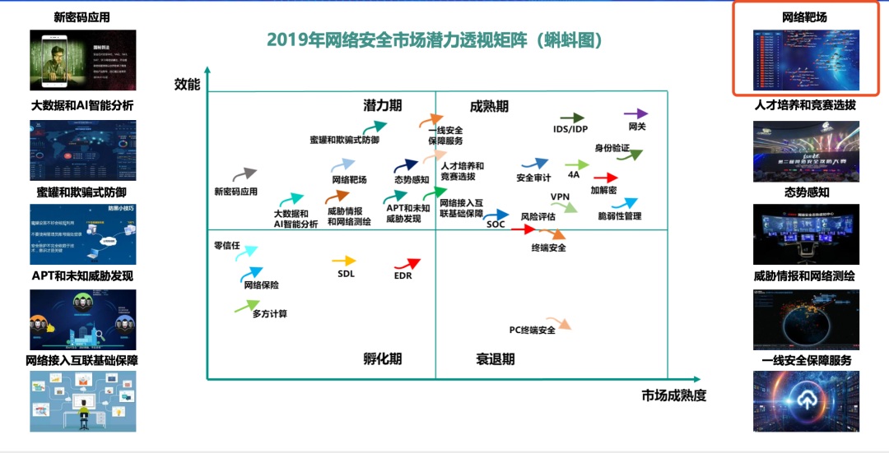

# ICV 靶场与数字孪生

## 概念

### 数字孪生

数字孪生是一种数字化理念和技术手段，它以数据与模型的集成融合为基础与核心，通过在数字空间实时构建物理对象的精准数字化映射，基于数据整合与分析预测来模拟、验证、预测、控制物理实体全生命周期过程，最终形成智能决策的优化闭环。

其中，面向的物理对象包括实物、行为、过程，构建孪生体涉及到的数据包括实时传感数据和运行历史数据，集成的模型涵盖物理模型、机理模型和流程模型等。

随着经济社会数字化转型的持续推进，数字孪生逐渐成为产业各界关注的热点技术。数字孪生起源航天军工领域，近年来持续向智能制造、智慧城市等垂直行业拓展，实现机理描述、异常诊断、风险预测、决策辅助等应用价值，已成为助力企业数字化转型、促进数字经济发展的重要抓手。

从政策层面来看，数字孪生成为各国推进经济社会数字化进程的重要抓手；从行业应用层面来看，数字孪生成为垂直行业数字化转型的重要使能技术；从企业主体层面来看，数字孪生被纳入众多科技企业战略大方向，成为数字领域技术和市场竞争主航道；从标准化层面来看，数字孪生标准体系初步建立，关键领域标准制修订进入快车道。

数字孪生具有四个典型的技术特征：
- （一）虚实映射。数字孪生技术要求在数字空间构建物理对象的数字化表示，现实世界中的物理对象和数字空间中的孪生体能够实现双向映射、数据连接和状态交互。
- （二）实时同步。基于实时传感等多元数据的获取，孪生体可全面、精准、动态反映物理对象的状态变化，包括外观、性能、位置、异常等。
- （三）共生演进。在理想状态下，数字孪生所实现的映射和同步状态应覆盖孪生对象从设计、生产、运营到报废的全生命周期，孪生体应随孪生对象生命周期进程而不断演进更新。
- （四）闭环优化。建立孪生体的最终目的，是通过描述物理实体内在机理，分析规律、洞察趋势，基于分析与仿真对物理世界形成优化指令或策略，实现对物理实体决策优化功能的闭环。

作为发展数字经济的重要使能技术，数字孪生近年来备受业界关注，技术体系不断发展，核心技术快速演进，产业生态持续完备，行业应用走深向实，成为促进工业、城市、交通、网络等垂直行业实现数智化转型的重要抓手。

但同时也需要注意，数字孪生作为一项新兴技术理念，尚处于发展初期，仍存在许多短板问题亟待破解。

- 一是实施成本高企。数字孪生技术的实现涉及到企业研发、生产、供应链、管理等系统的改造，投资大、沉没成本高。受限于此，目前数字孪生往往仅能成为大企业“锦上添花”的高端技术应用，而难以成为广大小企业“雪中送炭”的普适技术应用。

- 二是产业基础薄弱。数字孪生产业链长、分工细致、碎片化程度高，跨领域之间的技术融合性较差、资源整合难，存在IT企业不懂行业机理、OT企业难以报团的突出痛点，亟需产业整合者的出现。

- 三是商业模式不成熟。不同垂直行业对数字孪生的需求差异大，垂直行业内需求“长尾效应”显著，解决方案的可复制性不强，导致数字孪生应用多以项目交付型为主，平台化、模块化程度较低，不利于高效推广。

- 四是技术短板凸显。在机理建模、仿真分析、数据集成等方面的技术短板制约了数字孪生技术整体的应用深度，同时部分核心技术被国外龙头企业垄断，“安可”有潜在风险。

- 整体上来看，为进一步促进数字孪生技术融合发展，形成产业合力，推广技术应用，打造赋能千行百业的通用技术底座，业界需要从顶层设计、技术攻关、生态构建和标准化四个层面重点突破。

- 一是顶层设计层面，在相关部委指导下联合产业多方智库力量尽快研究明确数字孪生中长期发展规划，为技术产业发展指明方向和路径。同时建立完备的数字孪生评价体系，从建模精度、数据互通性、同步演进性、智能化程度、系统间数据的共享程度等多种维度构建评价指标，牵引数字孪生向高阶演进。

- 二是技术攻关层面，聚焦数字孪生基础理论及关键核心技术，鼓励产学研联合研发，在信息建模、机理建模、模型同步、模型融合、智能决策、智能感知和信息安全等方面突破一批技术瓶颈，形成基础扎实、稳定成熟的技术体系。

- 三是生态构建层面，数字孪生产业链长，技术体系复杂，垂直行业壁垒高筑，需要产业各方协同创新、优势互补、形成合力，特别是在基础设施共建、跨领域技术融合、数据共享互认、能力开放互用等方面形成长效协同机制，依托产业联盟、创新中心等方式加深产业链的交流合作与需求对接，构建优势互补、协同共赢的产业生态。

- 四是标准化层面，在技术发展初期，尽快完善术语、通用架构等基础共性标准，形成统一的话语体系和规范性指导框架。在此基础上，进一步对信息模型、数据集成、平台等数字孪生核心要素和垂直行业应用模式进行规范统一，力求快速形成覆盖数字孪生基础共性、关键技术和行业应用的标准体系。

Digital Twin 是物理实体的数字化映像。通过搭建整合制造流程的数字孪生生产系统，能实现从产品设计、生产计划到制造执行的全过程数字化，将产品创新、制造效率和有效性提升至一个新的高度。

它是从设计/仿真，延伸到产品全生命周期的数字化系统。

数字孪生网络空间靶场可用于指导、测试和评估网络空间靶场的风险评估、漏洞分析、漏洞挖掘等功能。数字孪生靶场涵盖网络空间靶场所需的三大层次数字表示和映射，成为数据驱动决策、技术综合集成的网络空间靶场综合技术支撑体系。

数字孪生靶场本质：
- 数据全域标识
- 状态精准感知
- 数据实时分析
- 模型科学决策
- 智能精准执行

通过构建数字孪生靶场数据闭环赋能体系，实现网络空间靶场的模拟、监控、诊断、预测和控制，解决靶场构建、检测、运行、漏洞挖掘、风险评估的复杂性和不确定性。

从仿真模拟发展看，数字孪生靶场是未来实体测试仿真模拟的虚拟映射对象和智能操控体，形成虚实对应、相互映射、协同交互的复杂巨系统，是实现网络空间靶场的最终仿真程度最高的“虚拟世界”，即支撑网络空间靶场全要素数字化和虚拟化、网络空间靶场全状态实时化和可视化、网络空间靶场决策协同化和智能化，实现网络空间靶场服务情景交融，驱动网络空间靶场智能运行、迭代创新。

数字孪生靶场可在数字化水平相对较高、需要运行机理建模、实现虚实空间协同优化、彰显多维智能决策支撑等方向，如安全防护策略、攻防对抗、网络攻击测试、漏洞挖掘等领域优先落地实施，以数字孪生靶场为代表的新型数字孪生仿真建模发展新理念和新模式或将变为现实，成为网络空间靶场高水平建设的必由之路，成为网络空间靶场数字化高保真的重要参考。

在网络空间靶场搭建过程中应用数字孪生技术，一是可快速复现实物现场真实状态，更准确评估攻防影响；二是可有效避免攻防验证过程中带来的物理元器件损坏，节省测试成本；三是可通过数字孪生靶场构建复杂大型测试场，对漏洞、病毒、木马、网络攻击武器等在大型网络环境下的传播破坏能力进行验证。

## 网络靶场
网络空间已成为第五大主权领域空间。随着网络空间的对抗日益实战化、体系化、智能化，针对各国关键基础设施的攻击更是层出不穷。网络靶场作为网络空间安全研究、学习、测试、验证、演练等必不可少的重要基础设施，日益受到各国政府和企业的重视。网络靶场作为网络安全市场的一个新兴投资方向，其重要地位也在日益加强。在赛迪顾问发布的“2019网络安全最具价值增长潜力十大方向”中，对当前网络靶场的发展潜力和效能给予了较高的评价。

针对于网络靶场的定义，国内暂没有形成统一的共识。其中比较具有代表性的是Techopedia（IT领域在线词典），它认为网络靶场是针对网络攻防演练和网络新技术评测的重要基础设施，用来提高网络和信息系统的稳定性、安全性和性能。在百科中，网络靶场被释义为通过虚拟环境与真实设备相结合，模拟仿真出真实赛博空间攻防的环境，能够支撑网络对抗能力研究和对抗工具验证的试验平台。虽然这两种定义的角度不同，但总体来看，对网络靶场的理解差距不大。

结合以上两种说法以及绿盟科技的实践，我们认为，网络靶场是通过虚拟化、虚实结合、安全编排、行为及流量仿真、效果评估等技术综合构建而成的一个真实“冗余环境”。类似于我们印象中的“训练基地”。这个环境可以用于完成人才培养、竞赛演练、应急演练、实战演练、设备测试、技术研究和效能评估等任务，响应国家网络强国战略，批量培养网络安全人才队伍，同时加快网络安全基础建设，提高现有网络环境的稳定性、安全性和性能。

### 核心价值
网络靶场核心价值，是提供近乎真实的练兵场。这里可以从关键能力和应用方向两个角度来讨论。

### 能力
网络靶场的能力包括：网络和业务环境仿真、用户和攻防行为仿真、数据采集和效果评估等。

网络和业务环境仿真是网络靶场平台的基础能力。网络和业务仿真主要通过虚拟化技术来实现，而仿真环境的规模及种类是衡量网络靶场能力的重要技术指标之一。因为现阶段虚拟化技术还不能够实现对工控、物联网等环境足够理想的仿真，所以需要通过虚实结合技术将真实环境和仿真环境进行连接。

用户和攻防行为仿真是网络靶场有效性的关键。如何将用户真实操作行为和受到攻击情况进行完整复现是仿真的难点。行为仿真除了使用手动方式产生外，还可借助流量发生器及自动化攻击工具等来完成。只有最大程度实现了用户和攻防行为的仿真，才能在网络靶场发现真实环境中可能出现的问题。

数据采集和效果评估是目标。只是完成对环境或者行为的仿真还是不够的，还需能够对仿真的网络环境、攻防行为进行数据采集，并根据这些行为所造成的影响进行评估，才能真正就现化真实网络环境中会发生的情况找到应对策略，提高真实环境的稳定性、安全性和性能。

### 应用
现阶段，网络靶场的应用方向主要有人才培养、攻防演练和科研测试三类。

人才培养：快速培养大批网络安全攻防人才；满足本单位网络安全人才需求。
攻防演练：提升员工的攻防对抗能力；提高企业的安全防护水平；提升企业的区域影响力。
科研测试：提升企业的安全研究能力；降低设备的测试成本；提升企业的攻防技术水平。

### 逻辑架构

该平台按照逻辑架构可分为四个层面，分别为大规模网络仿真、数据采集及效果评估、用户及业务仿真和网络空间测试场，每个层包括若干模块。

01
大规模网络仿真
大规模网络仿真层主要作用是为上层能力或场景提供资源和实验环境支撑，其中虚拟资源主要包括基础虚拟资源池和外接实体资源。虚拟资源除包括虚拟机资源、网络设备和安全设备资源池外，也支持与工控、测试等实体设备进行连接。虚拟化资源及网络管理对底层资源的细粒度操作进行封装，向上提供对宿主机、虚拟机、虚拟网络的管理，支持通过安全能力编排配置虚拟安全设备，并提供向导模式便捷构建靶场实验环境。

02
数据采集及效果评估
数据采集及效果评估层面主要作用为采集实验数据和对实验效果进行评估。大数据平台通过群集管理多个计算节点，使用消息队列实时采集多种来源的实验数据并使用流式计算框架进行数据处理，支持分布式文件存储、索引数据库、图数据库或关系数据库等多种类型的存储方式进行数据存储。态势感知模块利用大数据基础子系统采集的实验数据进行态势要素收集，通过态势理解进行数据融合，通过态势推理预测输出态势推理结果。效果评估模块根据大数据基础子系统采集的数据和态势感知的推理结果，进行效果动评估、Flag校验评估、考试评估，也支持手动评估介入，并集成了反作弊系统进行作弊行为和异常行为的检测。

03
用户及业务仿真
用户及业务仿真层面主要对用户权限管理和业务场景仿真。用户管理模块负责对靶场用户的权限进行限定，包含角色、用户组、域等多类内容。业务仿真模块分为业务仿真和用户行为仿真两部分。业务仿真主要包括知识库、课程库、赛题资源、靶标资源等，并支持用户快速构建靶场业务场景。用户行为仿真通过情报库、知识图谱、流量仿真等技术或工具对用户的业务和行为进行仿真。

04
网络空间测试场
网络空间测试场层面主要是具体的靶场应用场景。目前包括实训演练靶场，竞赛演练子靶场、应急演练靶场、APT场景还原、测试验证靶场、实战演练靶场、科研合作靶场、工控仿真靶场等，并可根据客户的实际情况进行定制。各个靶场由平台态势展示、业务性能监控、场景课件构建、效果评分、日志审计等通用功能支撑。

其中，实训演练靶场主要用于教学培训，提供实训课程以供用户上机操作。竞赛演练靶场主要提供竞赛及演练环境，提供理论、CTF、CFS和AWD等竞赛模式。应急演练靶场主要针对提供运营商、金融、能源等行业典型仿真场景，可在此场景上开展应急演练、战术推演等任务。

特别，APT场景还原较为特殊。该应用由绿盟科技伏影实验室提供知识支持，包括Wannacry勒索病毒传播场景、APT32海莲花攻击演练场景、乌克兰停电攻击演练场景，在真实的入侵场境中训练攻防双方的能力。

此外，实战演练靶场为用户开展真实环境上的攻防对抗提供对抗态势展示、攻击行为监控、攻击结果评判等功能。测试验证靶场可根据用户需求生成各类仿真场景来进行相关技术验证或产品测试，并提供攻防工具库，靶标资源、漏洞资源、自动化测试工具，流量仿真工具等。科研合作靶场提供漏洞挖掘、威胁狩猎研究、知识图谱等研究课题提供场景。工控仿真靶场则是通过虚实结合，构建电力、水务、轨交等仿真场景。可支持用户在此场景上开展攻防演练、测试验证等任务。其它定制靶场，可根据用户需求定制车联网、物联网等方向的靶场。

### 核心价值
对客户而言，绿盟网络空间安全仿真平台的核心价值，可以概括为以下四点：

1. 靶场种类丰富，并支持自定义选配
平台提供实训演练、竞赛演练、应急演练、APT攻防演练、实战演练、测试验证、工控仿真、科研合作、定制等多个方向的靶场，用户可根据实际情况进行选配。

2. 网络安全设备仿真，贴合实际应用环境
平台提供多类虚拟安全设备，覆盖设施安全、数据安全、工控安全、物联网安全等领域，而包含网络安全设备的仿真网络环境更加符合用户实际情况。

3. 攻防行为仿真，复现真实攻防场景
通过流量仿真、自动化漏洞检测和验证等工具对攻防行为进行模拟，同时结合用户的实际操作行为，最大程度的仿真攻防情况。

4. 基于态势感知的效果评估
基于绿盟科技态势感知能力，不仅可对攻防效果进行评分，也可对攻防态势进行研判，为后续安全事件的响应提供决策依据。

五
网络靶场发展展望
随着国家和各行业对网络安全和人才培养的重视，网络靶场也将逐渐成为用户的基础设施，市场角度也具有很大的增长空间。

未来，网络靶场可能的发展方向，可以概述为以下三个趋势：

1. 网络靶场应用仿真种类会越来越多
网络靶场的核心是应用仿真。随着企业上云、智能制造、新基建、5G的快速发展，会产生很多革命性的应用，与之对应的需要在网络靶场中仿真测试、研究、培训的场景就越来越多，靶场的种类也会更加细化，功能更加聚焦。如在人才培养方面，会出现密码学、无线、数据安全等靶场；在行业应用方面会出现金融、运营商、能源等靶场；在科研方面会出现漏洞研究、车联网、工控等靶场。

2. 网络靶场能够提升关键基础设施的响应能力
随着网络空间的基础设施安全日益受到重视，国内外的监管单位也在针对关键基础设施企业开展各种演练活动，如美国银行业的“量子黎明”，美国国土安全部的“网络风暴”（Cyber Storm），演练各个关基企业的响应水平。与之对应的，建设了“关键基础设施指挥决策分布式演练环境（DECIDE）”网络靶场，演练关基单位响应体系以及主管单位的应急指挥能力。更作为NIST网络安全框架（CSF）中关键基础设施部分的研究场，指导各个单位构建防御体系和响应协调体系。而国内的一些创新企业，也把网络靶场作为企业网络安全运营和响应的一部分来进行建设。通过网络靶场与企业内部环境的联动，提高企业整体的安全运营和响应水平。

3. 网络靶场云服务等新服务模式快速发展
因网络靶场的建设需要投入较大的资源，对于一些预算有限和使用频率不高的客户来说，采购的意愿不会很大。而网络靶场云服务等各种服务化的产品，可减少企业的建设投入和运维成本，满足不同投入程度客户的需求。因此，基于网络靶场的各种新服务也将获得较快发展。

后续，绿盟科技也将根据网络靶场的发展状况及客户需求，适时推出不同方向的网络靶场产品及服务，满足客户的个性化需求，推动网络安全人才培养和网络安全建设，为网络强国战略提供有力保障。