# OTA

## 概念
远程升级（Over The Air，OTA）是通过移动通信的空中接口实现对移动终端设备进行远程管理的技术。汽车OTA通常由汽车生产厂商发起。

在网联化和软件定义汽车两大趋势下，汽车OTA（远程升级）受到汽车业界越来越多的重视。据调研报告，多达383.8万汽车支持不同程度的汽车OTA（远程升级）。OTA（远程升级）的先锋是特斯拉，在2020年总共发送了137次升级，涉及影音娱乐，个性化定制，自动辅助变道等方面。目前汽车OTA（远程升级）主要挑战是稳定的通信性能和网络安全。

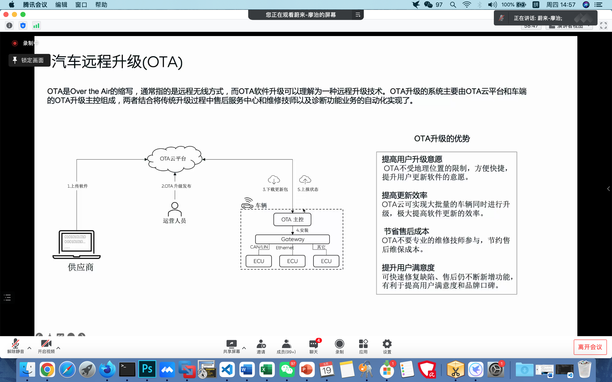

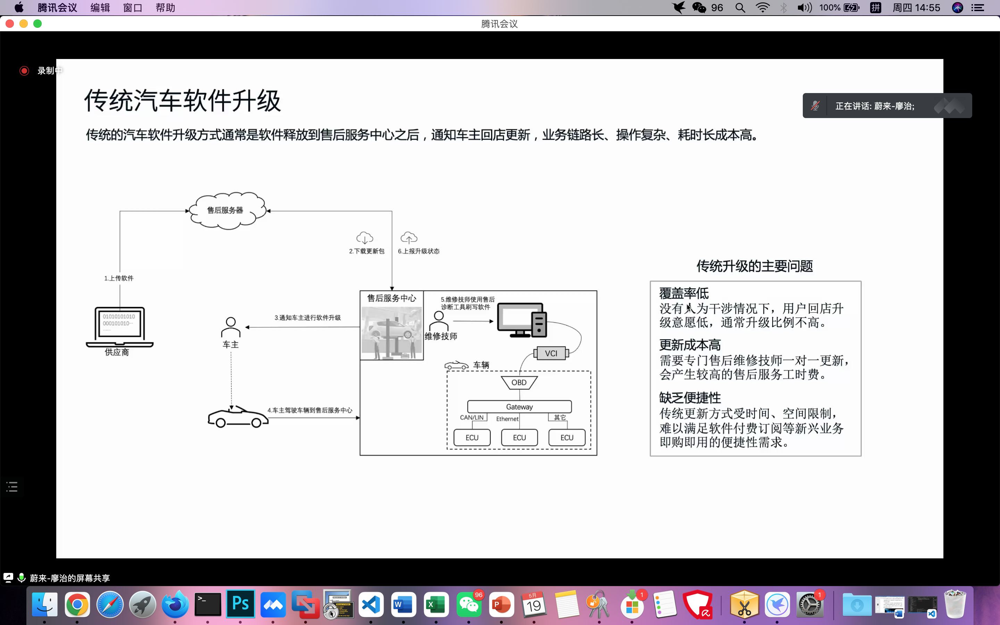

《节能与新能源汽车技术路线图2.0》预计到2025年，我国部分自动驾驶、有条件自动驾驶智能网联汽车的销量占当年汽车总销量的比例超过50%，高度自动驾驶智能网联汽车开始进入市场，C-V2X终端新车装配率达50%。随着汽车智能化、网联化技术快速发展，OTA技术作为汽车产品软件更新的主要手段，将成为智能网联车标配。OTA技术可以持续为用户提供新功能，优化车辆性能，获得全新体验，越来越受到整车企业和大众消费者的关注。但是在升级过程中，OTA云端、车端、升级包等关键环节均存在攻击和篡改等安全隐患。一旦出现安全问题，可能导致车辆运行异常、隐私泄露、财务损失、人身伤亡等风险。因此，保障OTA升级的安全尤为重要和紧迫。

- 企业推送OTA升级包，车端与OTA云端服务器建立安全连接，一般将更新的固件传输到车辆的T-Box，再传给OTA manager
- OTA manager 管理所有ECU的升级过程，它负责将固件分发到ECU，并告知ECU何时执行更新
- ECU更新完成后，OTA manager 通过 T-Box 向云端服务器发送确认。

OTA面临的挑战：
- 规范不统一，ecu刷写规范混乱、升级包格式多样化
- 串行刷写耗时，关联ecu升级用户体验差
- 零件状态差异，空间大小不足，网速慢
- 域控制器分层，分级管理困难，升级刷写混乱
### OTA涉及的模块
- 智能座舱（仪表板、网络）
- 智能驾驶域控制器
- ADAS
- 电池控制模块
- 通信模块
- 空调控制模块
- 车身控制
- 底盘控制
- 动力控制

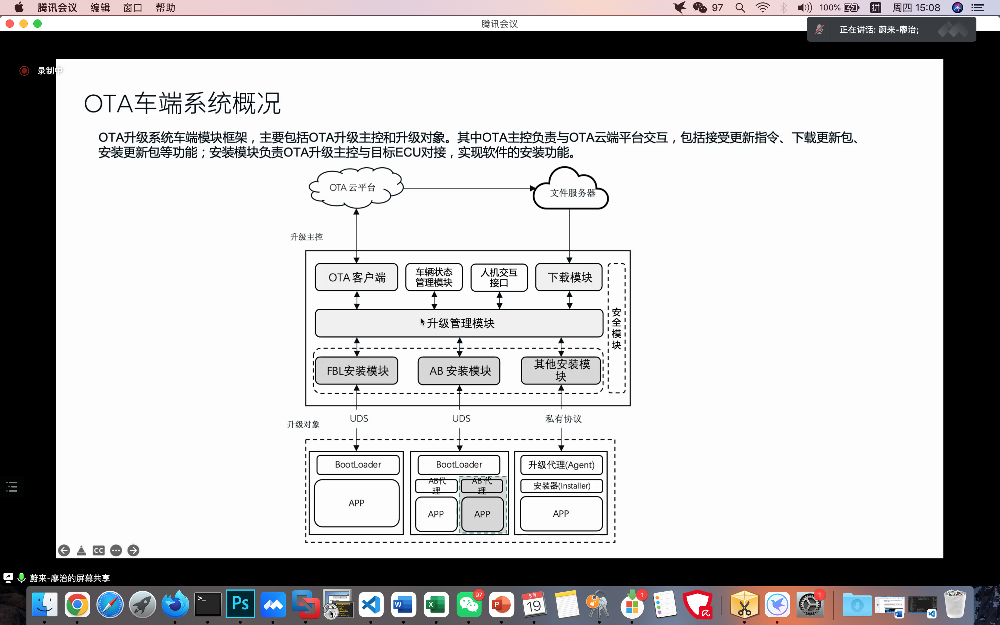

OTA相关的EE架构：
- T-Box负责对外通信
- 车载网关负责OTA管理
- 车身域控制器BCM
- 智能座舱域控制器CDC
- 智能车控域控制器VDC
- 智能驾驶域控制器MDC

相关接口：
- 车身控制接口
  - 控制外围设备：座椅、车灯、车门、车窗
- 底盘执行控制接口
  - 执行器连接线控底盘、动力驱动、三电
- 传感接口
  - 传感器：激光雷达、摄像头、毫米波雷达

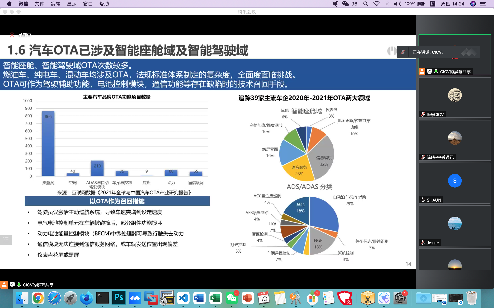

在实现ota时，车企需求：
- 开发fota、sota系统
- 云端功能：基础数据管理、软件版本管理、组件管理、升级策略/任务管理、数据统计与分析、用户管理、审批管理、差分平台等
- 其他相关系统：生产管理系统MES、远程服务平台TSP、PKI、应用生命周期管理ALM（软件物料清单SBOM）、审批系统、手机端、CDN、远程诊断、大数据平台等等
- 通信协议设计：目前常见的是https、mqtt、oma、其他私有协议
- 车端功能：主控节点功能、HMI交互功能、零件间通信协议设计
- 车型范围：几款车型、几款配置、具体EE

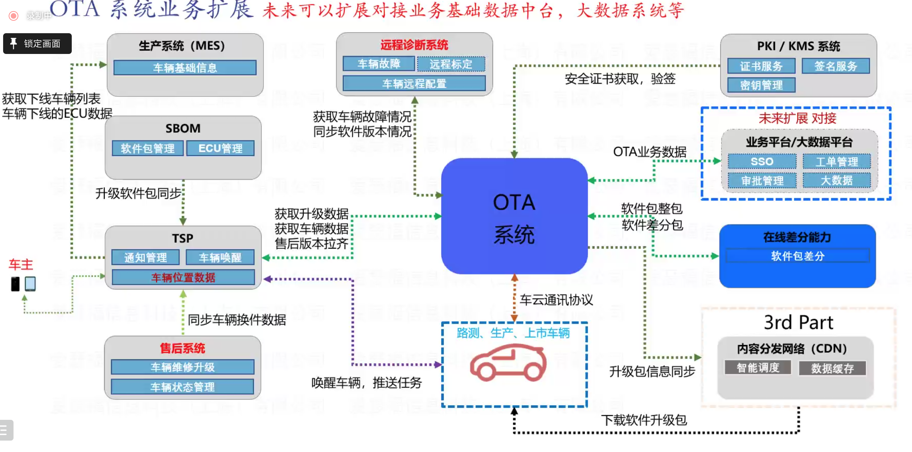

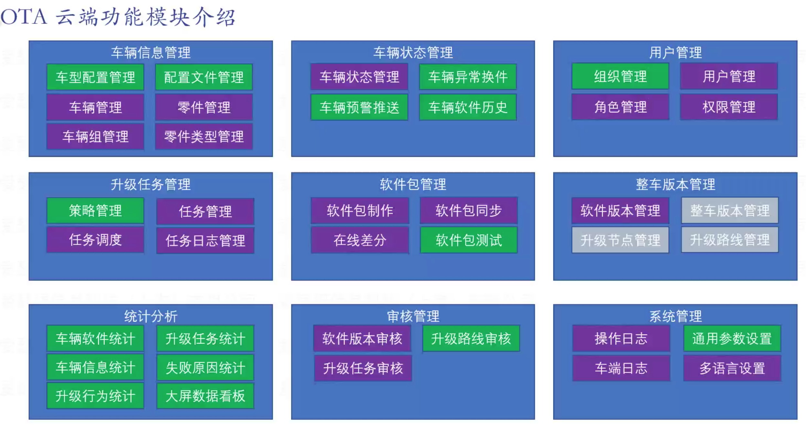

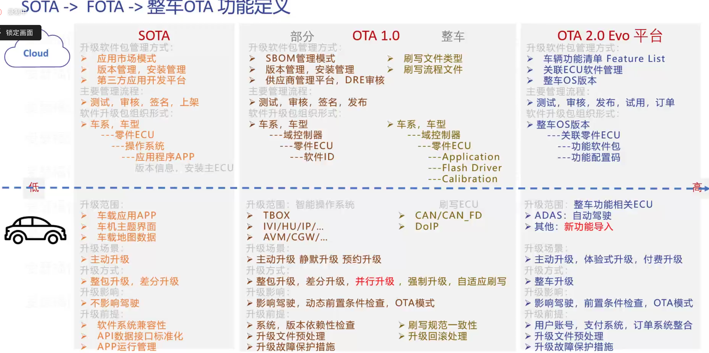

#### OTA主控部署方案
根据EE不同，不同车的OTA升级主控及升级对象ECU的交互存在很大差异，但主控的功能都类似。下面是Bosch提出的不同EE架构路线中不同阶段架构相对应的常见OTA主控部署方案：

- TCU做主控
- IVI做主控
- GW做主控

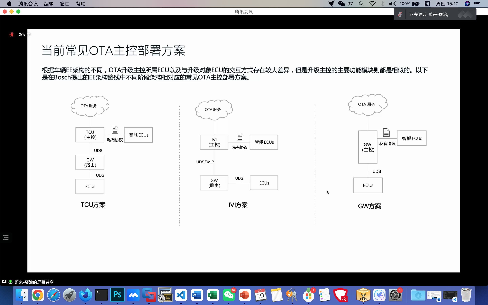

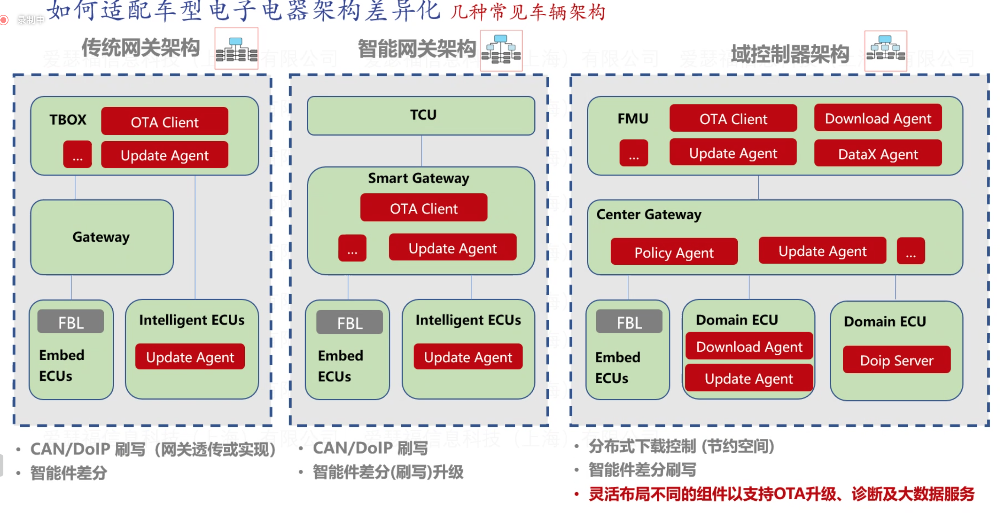

此外，随着SOA架构的应用，区域控制器的EE也称为现在的发展趋势，针对区域控制器的OTA主控部署方案如下：

- 中央控制单元CCU做主控。
  - 对于ECU的刷写，可以采用两种方案：1）区域控制器作为辅助主控；2）区域控制器作为路由。

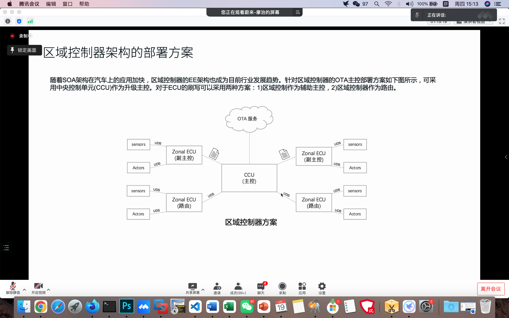

在ECU端（OTA升级对象），需要按照一定的协议接受目标版本数据，将数据写入指定区域并引导运行新版本软件，从而实现更新。根据ECU类型及内存结构，可分为3种方案：
- 单分区方案
  - 只有片内存储。
- 片外双区方案
- 片内双区方案

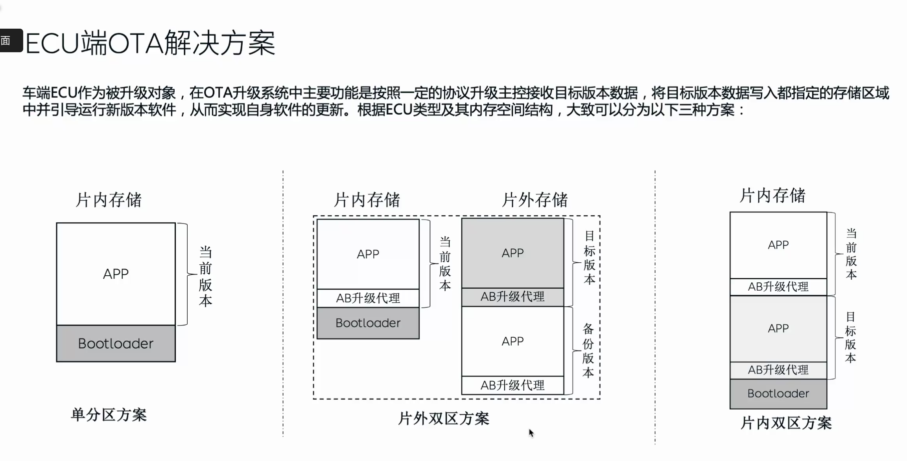

### 基本实施流程包括：
- OTA云端与车端的安全连接建立
- 版本检测
- 升级任务下发
- 云端的升级数据（包）下载
- 云端到车端的升级包推送与安全传输
- 车内的升级包拆包、分发与执行
- 升级日志记录与结果上报
- 失败回滚
- 日志分析

安全的ota流程：

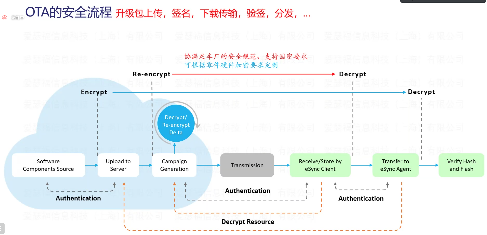

### 升级模式
可分为：
- 静默升级
- 主动升级
- 通知升级
- 强制升级

### 升级数据

- 车辆采用的版本数据
- 车主数据/用户隐私数据
- 埋点数据处理（？）
- 国家法规要求的数据

OEM系统中的数据杂乱，OTA系统的数据管理有一些问题需要注意：
- MES系统的车型数据与OTA车型数据存在不一致
  - 定义车型的依据不同。例如：MES系统中不同颜色、不同装饰就是不同车型；但OTA系统可能认为是同一车型
  - 车型分组依据不同
- 车型ota配置的差异化
  - 燃油车、新能源汽车的OTA参数不一致
  - 需要考虑OTA前置条件、OTA零件范围、升级顺序
  - 默认值设置（通知、下载、上报日志）
- 车型ota管理的差异化
  - 不同车型的管理流程可以定制
  - 每个车型/组配置不同的用户角色审批权限
  - 不同车型/组配置不同的审批权限
- 测试车辆的OTA管理
  - 定义车辆的测试属性
  - 允许定义及修改车辆的属性（台架、测试、生产、售后），以满足测试要求
  - 允许车辆的配置进行更新，满足不同属性的车辆的ota功能限制（静默、数据保护、法规要求）

### OTA升级数据包格式标准

### OTA升级刷写规范
- 整车环境要求
- 零件诊断规范
- Some/IP 、DoIP、UDS on CAN/CANFD等
#### 整车环境要求
- 车辆模式管理中应设置OTA模式，ota过程中抑制部分功能。
- 新能源车电源管理要求：电量水评、充电状态下的ota、解闭锁
- obd刷写的仲裁处理：处理obd诊断的冲突及其他功能的冲突

例如车辆模式可以包括：
- 正常使用模式
- ota模式
- 充电模式
- 诊断模式
- e-call/b-call

OTA模式中包括功能：
- ota升级前整车诊断
- 整车ota通知
- ota期间整车功能限制
- 故障码清除
- ota模式退出
- 零件/系统重启
#### 零部件ota要求

- 智能零件：自升级接口、自诊断接口、A/B分区系统、差分系统、RAM、ROM
- 非智能零件：ECU刷写标准、SA算法、MCU的CAN TP层的处理效率、SPI/UART通道
- 其他特殊情况：
  - 委托下载模式、分片下载模式
  - 边还原边刷写模式
  - 预安装模式（减少升级时间、确保用户体验）
  - 升级状态确认、MCU中写版本号
- 其他场景需求：
  - EOL：产品下线证书安装、OTA功能激活
  - 售后OTA需求，线下刷写数据同步

#### OTA升级技术标准
- AUTOSAR AP UCM（更新和配置管理）
- ASAM SOVD：从诊断刷写扩展而来

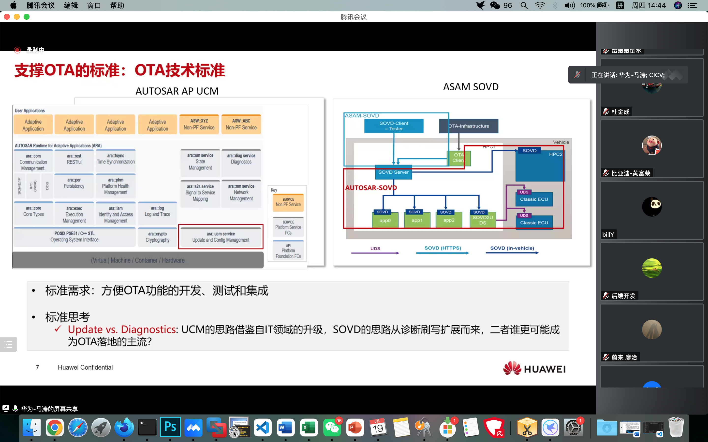

#### OTA管理标准
- UN Regulation No.156 软件升级管理系统SUMS。
  - 企业建立SUMS，并通过认证；
  - SUMS包括：
  - 管理流程（RXWIN版本、一致性评估、兼容性等）
  - 安全保障（升级安全、防篡改、行驶安全等）
  - 信息记录

- ISO 24089 Road vehicles-software update engineering
  - 企业组织管理
  - 升级项目管理
  - 基础设施开发
  - 车端系统开发
  - 升级包开发
  - 软件升级实施

目前问题：
- 供应商和OEM的交互模式和分工界面没有明确
- OEM如何认证供应商的生命周期软件管理能力？
### OTA监管要求

- 上市前的准入监管
  - 监管对象：OTA功能
  - 监管要求：要求车辆的OTA功能满足基本的技术门槛，保障车辆的行驶安全和网络安全。
- SOP后的一致性监管
  - 监管对象：OTA版本
  - 监管要求：要求OTA版本变更后的车辆仍然符合国家法律法规、技术标准及技术规范等要求，保证汽车产品生产一致性。
  - 相关文件：
    - 2021年8月12日发布的《关于加强智能网联汽车生产企业及产品准入管理的意见》，工信部【2021】103号。
    - 2022年4月15日发布的《关于开展软件在线升级备案的通知》，工信部装备中心【2022】229号。
    - 《关于加强汽车软件升级认证管理的通知》认监委
- 在用阶段的召回监管
  - 监管对象：OTA活动，特别是修复缺陷的OTA活动
  - 监管要求：规范OTA技术在召回工作中的应用，避免利用OTA隐瞒缺陷规避召回。
  - 相关文件：
    - 2020.11.25.发布《关于进一步加强汽车远程升级（OTA）技术召回监管的通知》，市监质【2020】123号
    - 2021.6.4.发布《关于汽车远程升级（OTA）技术召回备案的补充通知》
    - SAC/TC 463《基于远程升级技术的汽车产品召回实施要求》正在制定，明确召回实施流程要求
    - 指导缺陷判定评估的国标GB/T34402-2017《汽车风险评估与风险控制指南》

### OTA测试评价

- 研发测试
  - 测试环境
    - 单节点测试
    - 台架测试
    - 实车测试
  - 新功能/技术
    - 预约升级
    - 升级离车
    - 无感升级
    - 。。。
  - 功能流程测试
    - 升级包创建
    - 升级策略配置
    - 升级任务创建发布
    - 升级任务检测
    - 升级包下载
    - 安装升级
    - 结果上报
  - 异常环境测试
    - 弱网络环境
    - 异常断电
    - 存储空间不足
    - 升级包异常
    - 前置条件不满足
    - 大文件包下载/升级
  - 性能测试
    - 云端压力测试
    - 多ecu升级
    - 连续多次升级
    - 升级稳定性测试
### OTA软件仿真测试

爱瑟福等公司推出了ota软件仿真工具，基于pc的车端模拟器，可以实现：
- ota组件级通信测试
- 控制器级刷写测试
- 模拟整车级ota功能流程测试
- ota不同升级场景测试
- 异常场景注入测试

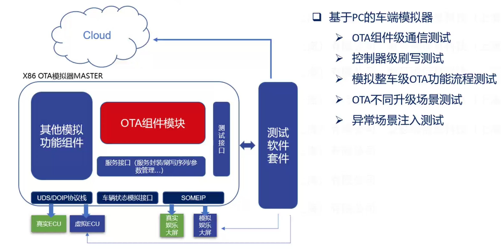

ota自动化功能测试

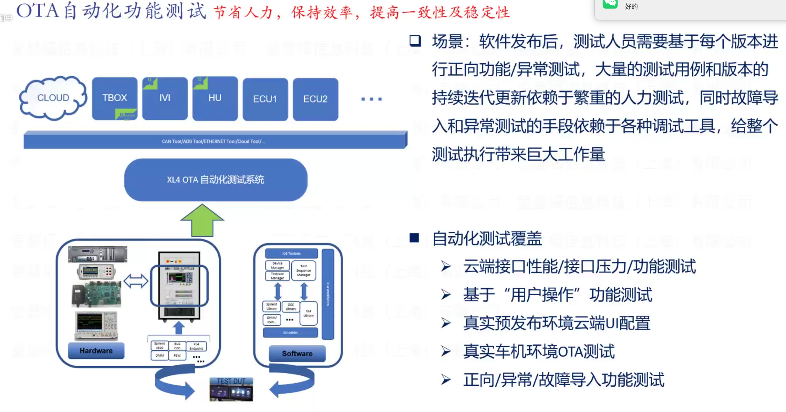

### OTA升级安全测试要求

除了测试标准（测试项、测试过程、测试结论判别依据、测试记录模版、测试报告模版）外，还需要总结实施经验，形成评价指标体系。

<>

### 发展历程 

- 零部件OTA（2000）
  - 首先针对T-Box进行尝试
  - 2012年，tesla model S开始第一次OTA升级
  - 升级对象多为单个软件或信息娱乐系统
- 整车FOTA+SOTA （2015）
  - 推出整车ota系统升级解决方案
  - 传统车企开始采用局部ota
  - 通用，丰田，福特，大众先后宣布使用ota技术
- FOTA+企业级 OTA（2019）
  - 蔚来，小鹏，理想等新势力企业开始布局ota，建立整车软件管理体系，推出云诊断服务
  - 国家监管力量进一步加强，促进行业标准生成，减少ota隐患
- 将来
  - 随着汽车EEA的进一步继承，车载以太网发展，单ECU性能大幅提升，ECU总数下降，软件数量增加，OTA将更加普及
  - 全产业链协调程度更高，以大数据驱动OTA升级闭环，赋予智能网联汽车一定时间内持续升级动力。
### OTA 场景

#### 售后场景

##### 恢复至车辆出厂前的OTA版本
- 云端提供软件的基线版本管理
- 售后通过诊断仪完成基线版本刷写
  - 1.售后诊断仪连接车辆
  - 2.检查VIN、软件version
  - 3.向OTA server请求基线版本（认证后下载）
  - 4.诊断仪对车辆进行刷写
  - 5.刷写结果上报至服务器
- 售后通过WiFi对车辆进行刷写
  - 1.售后诊断仪连接车辆
  - 2.检查VIN、软件version
  - 3.向OTA server请求基线版本（认证后下载）
  - 4.OTA主控节点完成对对车辆及零部件的升级刷写
  - 5.刷写结果上报至服务器

##### 车辆到4S店维修保养
- 云端创建4s店端升级任务，车辆收到提醒后到4s店。
- 1.云端创建店端升级任务；
- 2.车端升级管理模块收到信息后，提醒用户到4s店升级；
- 3.售后利用诊断仪发送特定诊断帧，通知车端自动完成软件版本信息的同步下载
- 4.OTA主控节点完成整车零部件升级刷写
- 5.OTA升级结果自动上报服务器数据。

## NXP 公司 Brian Carlson 的OTA updates 介绍

2018-09

OEM对OTA的要求：
- 降低对驾驶人的影响（没有时间到4s店）
- 不会导致车辆可用性降低
- 安全防范恶意改动或盗窃

OEM因OTA而产生的收益：
- 节约成本，减少车辆召回
- 容易修复关键漏洞和问题
- 提供新功能而形成增量收入

OTA解决的现实问题：
- 15%的车辆召回和60%的维保都与固件相关
- 固件更新要求车辆到修理厂，耽误车主时间，增加经济成本
- 未能保修的客户将要求召回
- 很难将新服务/功能投递给客户
- OEMs错过了后市场增量收入机会。

OTA升级需要解决的问题：
- 网络安全和注入攻击问题
- 因升级导致车辆不可用或可用性降低
- 实现：是否存在漏洞？发生问题时是否可以回滚？OTA升级是否可以及时完成？
- 消费者接受度：是否每次升级都要询问？消费者持续postpone更新？消费者拒绝特定的升级？

### 当前常见OTA状态

- OTA升级仅负责IVI和TCU（TBOX）进行升级；
- 所有的其他节点（ECUs）的升级都在修理厂通过OBD进行。

随着网关成为OTA管理器，这种情况会发生变化。

### 整车OTA升级模型

- OEM OTA 云端服务器作为OTA服务器
- 车端通过TCU（TBOX）连接OTA服务器
- 车端网关作为OTA manager ，通过TCU获取升级信息和数据
- 升级包及相关信息存放在车端NAND 存储中（类似usb盘）
- 从网关下发ECUs，实现升级

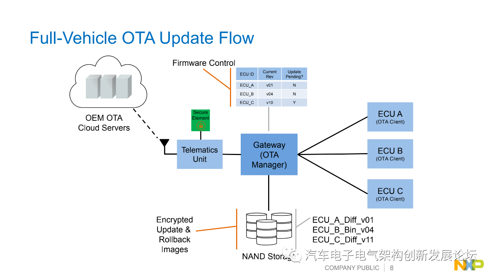

####  OEM 云端服务器

主要包括以下特性：

- 车辆数据库
  - 包括以VIN/序列数为索引的所有车辆细节数据
  - 每辆车的当前软件列表
  - 管理多个节点上的固件版本依赖性

- 软件数据库
  - 包括所有软件、固件、地图、其他数据等
  - 按需求产生差异化的文件

- 实时监控和报告
  - 从当前车辆接收用例信息和错误代码
  - 能够推动车辆更新本地数据库

#### 车端TBOX/TCU

TCU主要负责通信连接，主要功能包括：

- IP 连接
  - 建立物理通信链接和IP连接
  - 处理多个通用协议（WIFI、蜂窝网、V2X、等）

- 到云端服务器到逻辑连接
  - 认证车辆和服务器
  - 在车辆和服务器间建立安全连接
  - 处理连接丢包问题
  - 将升级包交给OTA manager

#### OTA 管理器（网关）

OTA 管理器的主要功能：

- 包含所有ECUs的数据库
- 对接收到的升级包进行认证和hash
- 解压接收到的文件，并分发给各个ECUs
- （各ECUs）存储升级包，做好安装前准备
- 可能要生成一些diffs
- 对多个节点进行升级同步（不同版本的兼容问题处理）
- 与ECUs建立安全信道
- 提示IVI，向驾驶员显示升级细节
- 与终端节点建立UDS诊断回话
- 向云端服务器反馈升级成功（或失败）的状态

#### 终端节点（OTA Client）/ECUs

ECUs作为待更新的客户端，主要功能有：
- 验证/认证升级image
- 解密image（optional）
- 使用版本号来确认固件是最新的
- 执行差异计算（仅适用于差异更新）
- 删除 flash 块
- 程序升级
- 切换到新的版本并通知OTA管理器

软件部分的特点：
- 在终端节点运行升级
- 执行真实的flashing 操作
- 根据bootloader执行典型动作
- 可能非常小（小于2k）

#### Flash 编程时间

当使用 In-place 方法是，一个主要的计时因素是flash 存储程序和删除时间。

NXP C55 内置flash
- 256KB 块删除，典型耗时 884ms，最大 4000ms
- 256KB 块程序执行，典型552ms，最大 4000ms

### OTA 升级方法
通常有2种方法执行终端升级：
- 1 In-Place
- 2 A/B

In-Place 方法：
- 在已存在版本上执行升级。升级前是bootloader+current version，升级后是bootloader+new firmware。
- 优势：不需要额外的flash
- 问题：要求车辆在更新过程中停止；如果升级发生问题，不能即时回滚。

A/B 方法：
- 在已存在固件的flash上进行升级，有两个版本。
- 升级前：flash中有 bootloader + 当前固件+老的固件
- 升级后：flash中有 bootloader + 当前固件+新的固件
- 在下一次接通（key-on）后：flash中有 bootloader + 老的固件 + 新的固件
- 优势：升级可以在应用软件运行时进行；升级发生问题时，总是有可回滚的老版本固件可用；升级过程中，车辆不需要停驶，即便升级发生错误也不需要。
- 问题：要求 2倍的flash 用于存储；需要更大的空间支持运行。
- 注意：bootloader 一般不经过ota进行升级。

### 升级固件的格式

有两种可分发的固件格式。两种格式都可以用于 A/B 升级和In-place升级。
- 完整文件格式
- 差异文件格式

完整文件格式：
- 待升级的二进制包被完整下载到终端节点进行升级，程序运行也在这个flash上。
- 优点：不要保存老的固件，可以从任意老版本进行升级；对接收文件进行最小的过程，简化了flash中的程序执行。
- 缺点：需要较长的下载时间（can总线最高500kbps，canfd 1mbps）；要求更大的存储空间。

差异升级包格式：
- oem厂商比较新老软件包的差异，产生差异文件，其大小大约是完整升级包的十分之一
- 要求二进制差异工具，例如开源软件 bsdiff。
- 优势：传输快、要求存储空间少。
- 缺点：要求CPU和RAM带块来计算新image；依赖于先前的固件；增加了OEM和车端的复杂性。

### 支持OTA升级的MCU特性
- RWW flash：在一个flash block上删除或执行程序的同时，允许从另一个flash block读数据。
- Multi Core：允许一个内核执行升级，同时另一个内核运行现有程序，最小化对性能的影响。
- Lockable Flash regions：对关键代码提供额外的保护，例如在允许升级期间防止意外删除bootloader 
- 停电（Brownout）检测和恢复：在未知状态下flash执行升级失败时，MCU 应该检查这个问题的发生，辅助bootloader执行恢复。
- Flash 重映射/MMU：允许在新/老固件镜像间即时切换，它们存储在不同的物理位置。
- Lifecycle 管理：安全地记录当前固件版本，并防止非法的试图回滚到老版本，或安装未授权版本的软件或硬件。
- 密码技术安全：能够存储私钥和快速解密和验证接收到的更新包。同时认证每次启动的固件，防止篡改。
- 小代码flash块大小：更小的flash块会提升速度和效率。在原位差异升级状态下，将近修改较小辆的位置，需要备份、删除和安装。

### 安全的OTA升级要求端到端的安全

主要包括几个方面：
- 加固无线接口：通过硬件加密、防止篡改
  - 保护固件的认证和完整性，防止黑客运行篡改后的代码
  - 加密固件
  - 建立安全的端到端的通信，防止中间人攻击
  - 对oTA管理器应用，确认一个安全的、可信的位置
- 加固网关：通过物理隔离、加固OTA升级管理。

- 加固车内网络通信
- 加固实时和应用处理

### 升级案例

基本场景：

ECU A：

ECU B：

ECU C：

## ISO 24089 道路车辆软件更新工程
ISO/DIS 24089(草案)
> 注意24089 不仅指OTA。

### 组织级的软件更新要求

#### 目标

这一部分条款为实现以下目标：
- 为软件升级工程建立特定于组织的规则、过程和程序；
- 采用质量管理、功能安全和网络安全管理进行软件更新工程；

## OTA 系统解决方案案例

### 极氪SOA架构下的OTA解决方案
汽车SOA是对整车智能化的底层能力进行组织，将车端的硬件能力和各种功能服务化。这些服务根据SOA标准进行服务化接口设计拆分成颗粒度更小的接口，基于SOA标准协议进行通信。这样，各服务组件之间就可以相互访问，从而扩展了服务的组合形式。

SOA软件架构的特性是高内聚、松耦合、服务平台无关化、服务动态部署/动态发现。因而为汽车出厂后的持续软件迭代降低难度、拓展出更多的可能性。当今的智能汽车，由于技术革新，EE架构（电子电气架构）的升级和车载以太网应用，让SOA的应用变得顺理成章。

以往的传统汽车采用分布式的EE架构，需要上百个ECU（电子控制单元）。传统架构下，各个ECU不但直接驱动执行器和传感器，还承担了业务功能的很多控制逻辑。因此，一个功能的实现往往需要耦合多个ECU，功能的迭代和单个ECU的升级变更往往需要多个ECU共同配合修改。而各个ECU采购于不同的供应商，最终导致商务复杂性增加，技术复杂性加大，变更成本推高以及软件交付周期加长。随着整车EE架构朝着功能域集中式的发展，极氪智能科技上一代EE架构已实现功能域集中架构，由4大功能域主控承担整车级别的各域功能逻辑软件部署中心的角色，将执行器和传感器与功能逻辑分离，普通ECU变成纯粹的执行和传感单元，域内的逻辑接口交互在域控内部就可完成，跨域逻辑接口交互通过FlexRay主干网实现。ECU实现功能业务逻辑和执行器控制逻辑的解耦，功能接口模块化、标准化。这样通过4个功能域主控，就能实现对执行传感层硬件的控制，在架构设计上为SOA提供了良好的基础。

极氪智能汽车新一代EE架构是以1个中央计算机搭配2个区控制器为核心，在中央计算机上完成对传感和执行层硬件的能力抽象并基于此开发和部署全部功能逻辑，构建硬件抽象层到功能逻辑层到整车管理层到云端的垂直SOA框架体系。与此同时接管大运算量和复杂任务处理（e.g. Audio/Video处理、Lidar/Radar环境感知处理，Machine learning等）。区控制器作为物理中心承担该区内的配电、网关和I/O驱动，以及部署一些特殊的时间敏感功能逻辑。这种新架构形态体现了类生物特征的设计理念（中央大脑/区域眼耳手脚）的模式。极氪智能汽车最新EE架构致力于打破功能域边界，运用物理分区，逻辑分层的方法论，把整车平台服务、功能逻辑运算、大数据处理等核心能力集中放入中央计算机，各区控制器仅作为执行单元控制。

传统的车载网络架构主要由CAN总线组成，按照功能划分出不同的功能域，比如动力总成、车身控制等总线域。各个ECU都有自己独立的通信渠道，使得整车线束成本高昂，总装复杂程度也较大。而且同一个CAN总线上的所有节点共享带宽，普通CAN总线的通信带宽仅1Mb/s。目前极氪整车主干网选择用以太网取代传统的CAN总线，作为新的车载网络架构。以太网是交换机式(Switched Network)通信方式，所有的终端节点通过交换机连接到一起，通过交换机转发传递信息，拥有更高的带宽（大于100 Mb/s）和更低的延时。有了更好的硬件基础架构，加上带宽更宽、延时更低的网络，才为SOA的应用和实现奠定了基础。

极氪汽车的OTA已进入第四阶段，在新一代EE架构下打造产业链生态OTA解决方案。新一代EE架构，支持基于中央计算平台+区控制器的OTA方案，可实现车载网络各系统的OTA升级，为车主提供千人千面的个性化服务，满足不同客户的需求，提升用户对车辆的满意度和车辆粘性，达到为整车提供全栈和全生命周期的快速OTA更新迭代。

1、整车全栈升级：基于传统电子电器架构的局限性，大部分OTA升级主要针对信息娱乐系统，极氪先进的新一代EE架构，实现了软硬件解耦，可做到对整车软件的升级，包含中央计算单元，左右岸以及其他控制单元的升级刷写。

2、全生命周期覆盖：该模式下的OTA解决方案支持打通整车研发、生产制造、售后体系。研发端释放整车软件基线实时同步给OTA系统，制造端生产下线的车辆实时同步至OTA，售后端的售后信息与OTA端协同配合，使得车辆通过OTA软件升级及维修，形成研发、制造、售后OTA的全生命周期闭环。

其中整车功能基线、服务订阅对所有控制器纵向软件版本进行统一管理，不同通讯协议的转换，整车系统状态控制、集中式升级服务管理等技术手段，是实现OTA功能的前置条件。
极氪自研OTA方案概要

极氪OTA解决方案由云端平台，车云管道，车端组件构成，同时支持第三方系统数据对接适配以及借助PKI体系实现升级的安全管控。

OTA云平台实现了OTA升级范围内的车辆以及零部件，可升级软件的管理、服务订阅，服务订单以及软件版本迭代升级过程管理，支持与其他管理系统对接（如TSP，MES，PKI/KMS等）,实现数据同步以及安全管理闭环。

车端为实现不同总线架构的灵活适配，根据功能解耦设计，拆分子功能如：车云通讯管理、下载管理、整车升级状态管理，具体ECU的升级控制管理，差分升级管理，HMI用户交互管理等功能。且支持智能型ECU（Android/Linux/QNX操作系统）及非智能型ECU的升级。

车云间的管道借助4G/5G、HTTPS、MQTT、CDN等成熟通信技术，不仅确保通讯符合信息安全规范，同时借助高带宽、网络分发技术，提高软件包触达每辆车的概率，确保每辆车都能得到OTA服务。整个OTA升级流程主要分为3个大阶段：生成升级包，下载和传输升级包，安装升级包。整个阶段通过网络通信连接，最终实现车辆终端代码和数据的更新，进而增强车辆终端的功能和服务。

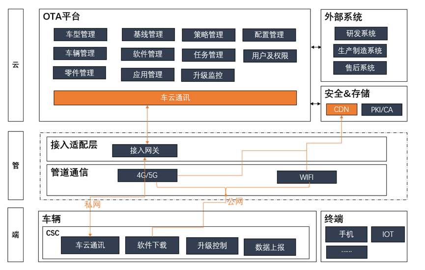

极氪自研OTA是基于SOA框架实现，主要包括如下服务：：

1、OTA Client：负责与OTA Server交互，获取升级信息和升级包；负责与OTA Master进行交互，提供车云通信服务；

2、OTA Master：车端升级控制主程序，负责解析安装策略，执行安装流程。

3、APP Install:  负责升级中央计算平台CSC，左区控制器ZC-L，右区控制器ZC-R的应用程序。

4、Diagnostic Manager：是诊断管理服务，为OTA Master提供诊断刷写服务。DM 主要分成DCM，DEM 两个模块。其中DCM （Diagnostic Communication Management）主要负责诊断通信管理，也就是 UDS 相关命令的处理。DEM（Diagnostic Event Management）即诊断事件管理，主要负责软件平台内部事件的处理。

5、Update Agent：为OTA Master提供”还原差分文件”的服务。

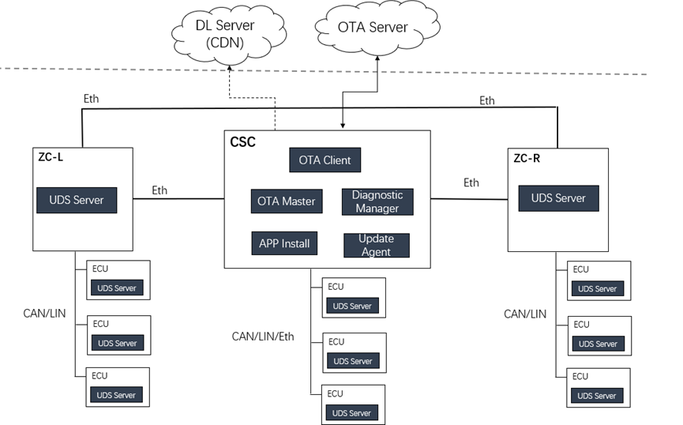

OTA云管端信息安全防护     

为确保OTA升级包的机密性、完整性和真实性，在升级包制作过程需采用签名，数据加密，验签技术，实现OTA升级包的合法性验证。通过云管端一体网络安全防护体系，结合支持国密算法的独立安全芯片，对通信链路、升级数据存储、分发等方面，进行了全方位的信息安全防护。

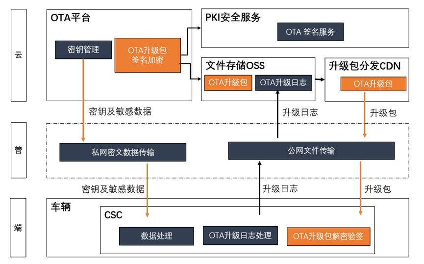

为极氪带来的价值

数据驱动，提升生态运营能力

基于SOA架构下的OTA方案，拓宽了“服务”和“运营”的范畴，增加了车辆的附加价值。随着极氪智能汽车OTA频次的增加，通过用数据替代人力，数据驱动算法的高速进化来形成车辆更新迭代闭环。搭配极氪智能科技的开发者平台，应用商店，数字货柜等多层联动，打造基于软件、应用、资源、内容等服务，构建推送、分发等策略，支持多样化的运营场景。
软硬件解耦，打造良好的汽车软件生态

整车SOA架构的实现，让应用开发与整车硬件平台解耦，一次开发可以适配不同的车型平台，同时为应用开发提供一个标准的基础平台。从平台化到产业化，助力极氪汽车向科技服务数字化转型，持续迭代XOTA（FOTA/SOTA/DOTA）联动的技术方案，在软件+服务的核心竞争要素上持续赋能，持续进化整车能力，拉长用户生命周期，构建完整的生态闭环。

### 德国ota公司ATS

德国聚焦于汽车软件的公司倾向于基于开源和开放标准的软件解决方案。

云端技术相对通用，但嵌入式软件大多是闭源且需要引入第三方供应商。

OTA技术要求了高度灵活的车辆ECUs接口、OEM后端服务器系统，而且这些接口对供应商、服务商和网联基础设施相关。没有持续的同步数据和软件，自动驾驶在高度联网环境下不易实现。

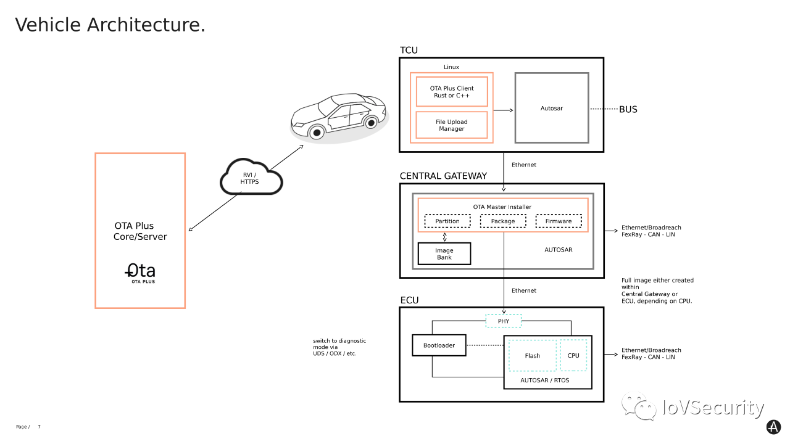

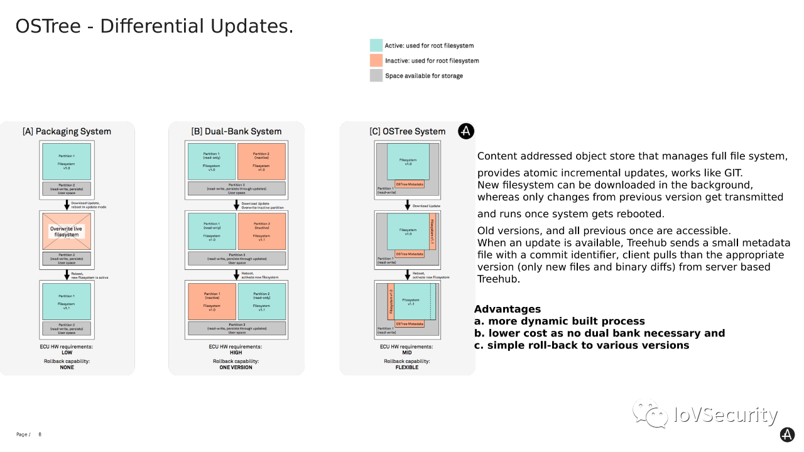

## 国家要求

### 工信部《关于开展汽车软件在线升级备案的通知》

2022年4月15日，工业和信息化部装备工业发展中心发布了《关于开展汽车软件在线升级备案的通知》，要求“获得道路机动车辆生产准入许可的汽车整车生产企业（以下简称“企业”）及其生产的具备OTA升级功能的汽车整车产品（以下简称“产品”）和实施的OTA升级活动，应进行备案。申请主体应是汽车整车生产企业。”

### 汽车软件升级通用技术要求

- 5.1 一般要求
  - 5.1.1 升级包真实性、完整性
  - 5.1.2 车辆应具备更新软件识别码的能力
  - 5.1.3 车辆应具备更新软件版本的能力
  - 5.1.4 软件识别码/软件版本免受未经授权的修改
- 5.2 在线升级要求
  - 5.2.1 用户告知
  - 5.2.2 升级确认
  - 5.2.3 先决条件
  - 5.2.4 电量保障
  - 5.2.5 升级车辆安全影响
  - 5.2.6 升级驾驶安全影响
  - 5.2.7 升级不禁止车门锁止
  - 5.2.8 升级结果告知
  - 5.2.9 升级失败或中断

- 试验方法
  - 6.1 升级包真实性完整性试验
  - 6.2 软件识别码/软件版本更新级读取试验