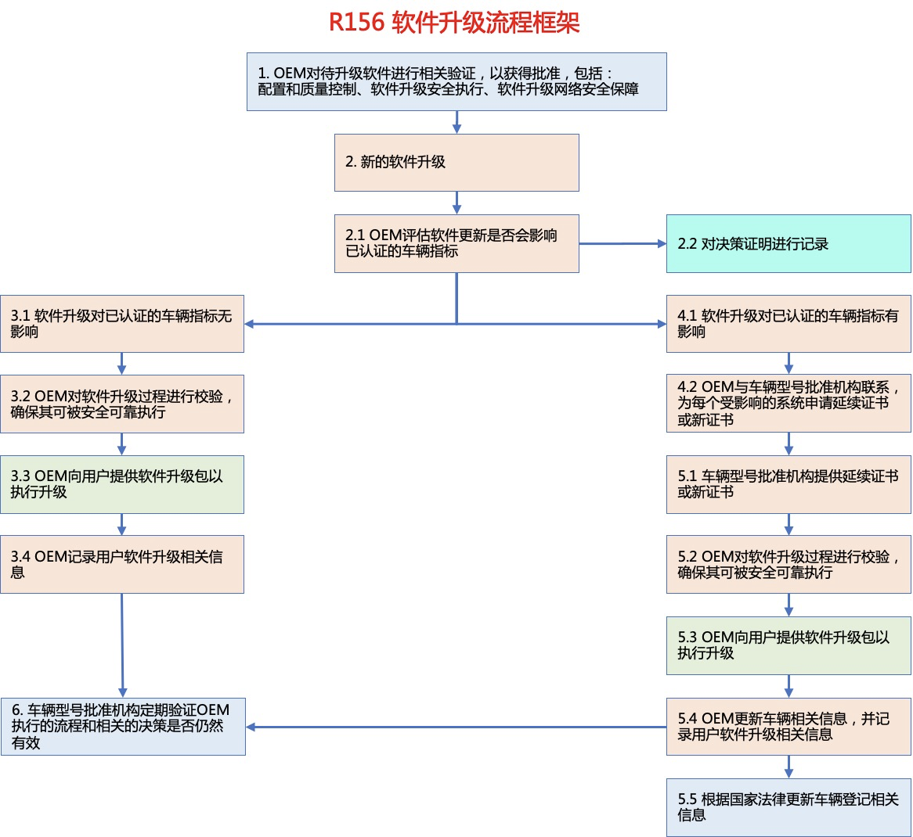
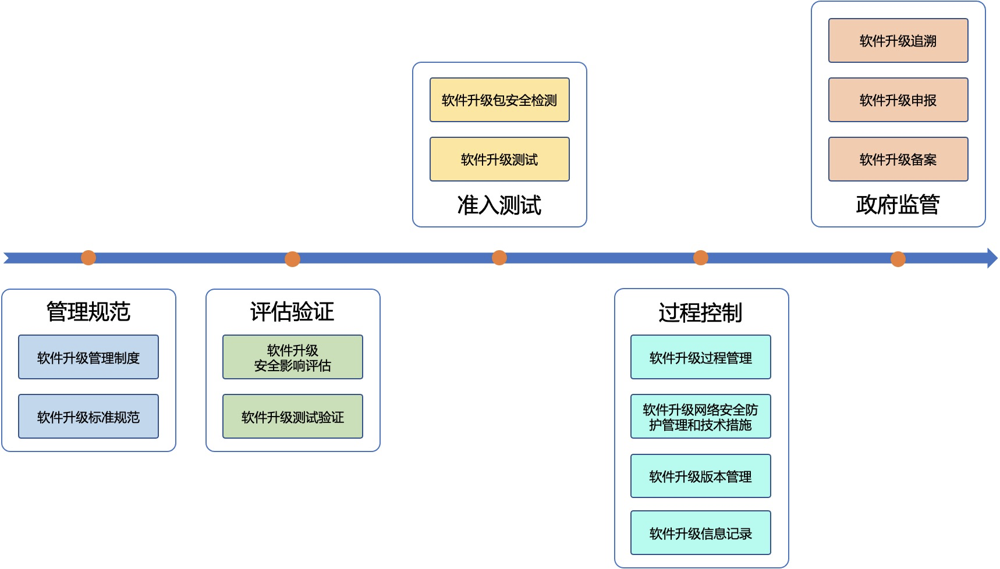
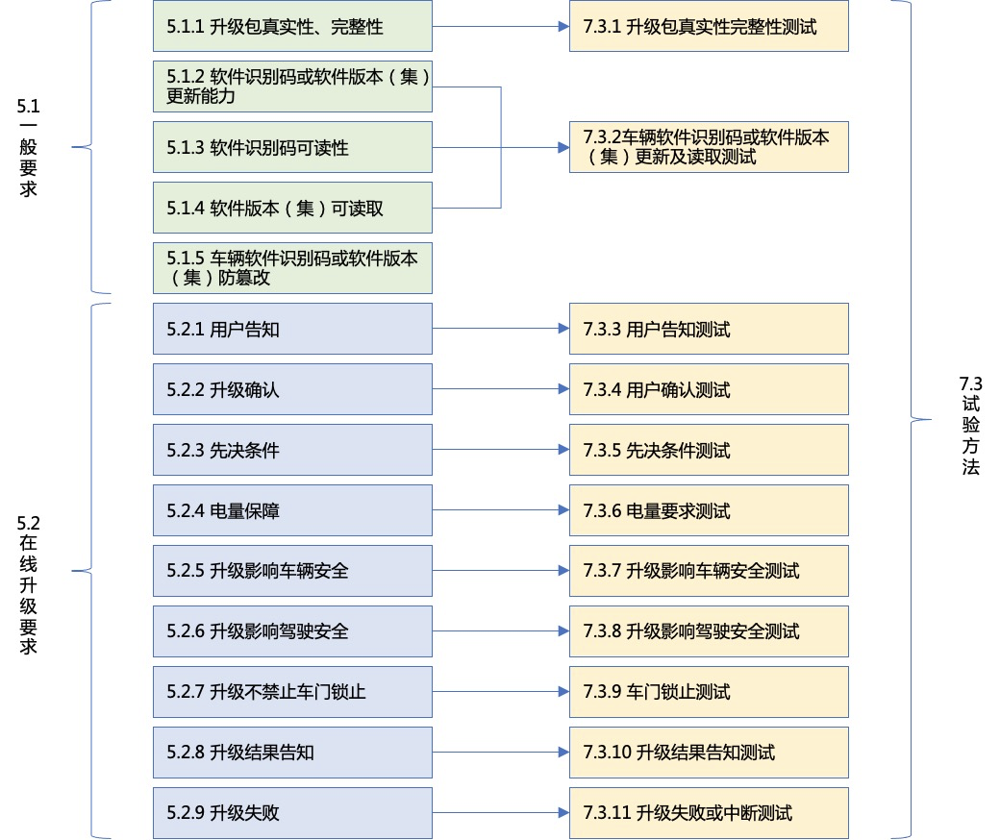

# OTA 安全测试

近来，随着越来越多的智能网联汽车走向市场，软件在线升级（OTA升级）技术的应用日益广泛。相比传统通过召回车辆修复系统缺陷的方式，OTA升级技术因具有低成本、高效率的优势而被广泛应用。但同时OTA升级技术也带来了新的挑战。

## 相关法规

### R156

2020 年 6 月，联合国世界车辆法规协调论坛（WP.29）颁布了《软件升级与软件升级管理系统》（Software Update and Software Update Management System，R156）技术法规。R156法规提出了软件升级管理体系认证要求，规范了软件升级实施流程，确保软件升级过程安全、可控、合规，该法规已于2021年1月正式生效。2021年3月召开的WP.29论坛审议通过了R156解读文件，对法规部分条款作出进一步解释，以帮助企业及审核机构理解并应对法规具体管理要求。

R156法规对软件升级的要求如下：
- 在对车辆实施首次软件升级之前，OEM应确保其软件升级过程、与车型相关的软件升级管理系统经过批准；
- OEM应评估软件升级是否会影响车辆型式批准系统的合规性，并进行记录；
- 如果软件升级不影响任何型式批准系统的合规性，则OEM可以进行直接升级，但应确保所实施的软件升级过程是安全的，并进行记录；
- 如果软件升级可能影响型式批准系统的合规性，则OEM应与相关型式批准机构联系，为受影响的系统寻求延期认证或进行新认证；
- 如果延期认证或新认证被批准，则OEM还应依据国家法规对受影响的车辆进行登记，此后便可实施软件升级，升级完成后要更新符合性声明中的车辆信息，以反映车辆经过型式机构批准的新的类型状态；
- 型式批准机构应定期检查OEM部署的软件和作出的决策是否适当，检查应包括对软件升级相关记录进行审计等内容。

2021年6月，欧盟汽车专家组提交了Regulation (EU) 2018/858和Regulation (EU) 2019/2144关于软件更新的修订法规草案，将R156法规融入其中，预计相关内容将于2022年正式实施。另外，国际标准化组织道路车辆委员会软件升级工作组于2019年3月正式对标准ISO 24089《道路车辆 软件升级工程》进行立项，旨在为道路车辆软件升级提供一个标准架构，目前该标准处于草案编写阶段，预计将于2024年发布。

### 国内

我国对智能网联汽车软件升级可能引发的车辆安全、驾驶安全问题极为重视，国家市场监管总局、国家工业和信息化部也陆续发布相关管理文件加强监管。

2020年11月25日
国家市场监管总局发布《关于进一步加强汽车远程升级（OTA）技术召回监管的通知》；
02
2021年4月7日
工业和信息化部发布《智能网联汽车生产企业及产品准入管理指南（试行）》（征求意见稿）；
03
2021年6月4日
国家市场监管总局发布《关于汽车远程升级（OTA）技术召回备案的补充通知》；
04
2021年7月30日
工业和信息化部发布《关于加强智能网联汽车生产企业及产品准入管理的意见》；
05
2021年9月13日
工业和信息化部装备中心发布《关于开展汽车数据安全、网络安全等自查工作的通知》；
06
2021年9月15日
工业和信息化部发布《工业和信息化部关于加强车联网网络安全和数据安全工作的通知》。

以上文件对智能网联汽车软件升级相关工作和要求进行了明确，涉及事前、事中、事后三个阶段，包括企业管理、评估验证、准入测试、过程控制、政府监管五个维度。

#### 准入

针对软件升级技术被滥用的问题，工业和信息化部《关于加强智能网联汽车生产企业及产品准入管理的意见》明确指出：“企业实施在线升级活动前，应当确保汽车产品符合国家法律法规、技术标准及技术规范等相关要求并向工业和信息化部备案，涉及安全、节能、环保、防盗等技术参数变更的应提前向工业和信息化部申报，保证汽车产品生产一致性。未经审批，不得通过在线等软件升级方式新增或更新汽车自动驾驶功能。”

#### 汽车软件升级通用技术要求

此外，为进一步将汽车软件升级管理相关要求进行规范、具体、细化，全国汽车标准化技术委员会智能网联汽车分标委汽车信息安全标准工作组正在组织制定《汽车软件升级通用技术要求》强制标准（以下简称“软件升级标准”），该标准参考了R156法规，涉及软件升级管理体系要求、车辆要求、车辆试验方法等，并针对R156法规缺乏试验方法的不足进行了完善。

软件升级标准5.1节提出了针对车辆升级的一般要求，包括应保护软件升级包的真实性和完整性，以防止其受到损害并防止无效升级；应具备更新软件识别码或软件版本（集），并支持通过标准接口以标准方式进行读取；对应的7.3节则相应提出了对软件升级包的真实性和完整性测试、对软件识别码或软件版本（集）的更新及读取测试的方法。

软件升级标准5.2节提出了针对车辆在线升级过程的具体要求，包括用户告知要求、用户确认要求、先决条件要求、电量保障要求、车辆安全影响、驾驶安全影响、不禁止车门锁止、升级结果告知、升级失败处理等内容，对应的7.3节则针对以上内容逐一提出了相应的测试方法。

目前，标准工作组正在针对试验方法组织开展验证活动，同时，也在对软件升级管理体系要求等内容进行完善，预计该标准将于2022年年底报批。

总的来看，针对汽车软件升级的法规、标准正在逐步完善，具体的申请备案、审查评估等实施办法也会进一步细化。同时，车企的OTA技术也将更加成熟、可靠。严格有效的监管机制将对车企软件升级行为进行规范，在保障消费者权益的同时，也将为整个行业的发展带来积极影响。

## OTA 常见安全威胁
OTA安全风险存在于升级的各个流程，常见的安全风险有：
- 云服务器安全风险
  - OTA云端服务器主要进行升级包制作、软件管理、策略及任务管理等。
  - OTA云服务器与其他云平台一样，易受各类网络攻击影响，例如DDoS攻击等，可能导致用户敏感信息泄漏、推送的升级包篡改、升级策略篡改等威胁。
- 传输安全风险
  - OTA云服务腿聪的软件升级包到车端的过程，若采用弱认证方式或明文传输，容易收到中间人攻击、窃听攻击等，黑客可以进一步获取升级包进行解析、篡改，可能导致信息泄漏。
- 通信协议安全风险
  - 云端与车端的通信过程若采用不安全的通信协议或通信过程不采用认证机制、明文通信等，容易遭受中间人攻击、窃听攻击、重放攻击、DoS攻击等，可能导致车端升级信息错误、敏感信息泄露、拒绝服务等风险。
- 车端安全
  - 车端获取到升级包后会进入升级流程。若引导程序、系统程序、OTA版本号等固定参数可信验证策略不安全或缺失，可能导致车端运行恶意系统，造成隐私泄露、财产损失等风险。此外，车端系统出现公开漏洞，若不及时进行修复，可能导致黑客利用漏洞进行攻击，造成车辆、财产乃至人身安全风险。
- 升级包篡改
  - 篡改或伪造升级包后发送到车端，若车端升级流程缺少必要的验证机制或验证机制存在漏洞，篡改或伪造的升级包可顺利完成升级流程，可达到篡改系统、植入后门等恶意目的。

### 案例

- 通过调试工具进入车机系统，发现数据库文件存在TSP平台信息泄漏，可以看到OTA升级地址。如otaUrl、calllogUrl、svtUrl等。
- 对该云平台进行渗透，发现开放端口，需要证书进行连接。
- 发现采用了明文mqtt协议进行传输，尝试接入，发现可连接并可订阅相关消息
- 使用漏洞扫描工具对ivi进行漏洞扫描，发现dhcp服务器存在漏洞
- 篡改升级包后无法正常启动。

## OTA安全测试

### 中国汽研
作为行业第三方机构，中国汽研北京分院积极布局OTA安全测评能力，依托与国家互联网应急中心共同成立的车联网安全实验室，联合国内主要OTA产品提供商以及安全厂商等行业资源，主要支撑了TC463中《基于远程升级技术的汽车产品召回实施要求》标准草案编写，并且联合中国标准化研究院等单位，先后承担了《智能网联汽车安全检测平台》、《智能网联汽车车载安全网关》等4项国家课题研究，目前具备先进的OTA测试设备，以及数千条专项的测试用例，现已形成面向汽车产品OTA安全评估解决方案。

本解决方案面向台架测试、实车测试、软件测试等多维测试环境，包含通用业务安全功能、OTA云平台、OTA车端和OTA升级包四大模块，共计58项测试服务内容，提供全面性、系统性、专业性服务，为企业OTA升级全流程保驾护航。

汽车OTA安全测试：
- 通用业务安全功能（20项）
  - 软件下载
  - 软件升级
  - 升级条件检查
  - 升级过程监督
  - 升级失败处理
- 升级车辆安全测试（20项）
  - 硬件安全
  - 数据安全
  - 通信安全
  - 系统安全
  - 安全异常防护
  - 功能安全保护
  - 鲁棒性测评
- 软件升级包安全测评（10项）
  - 漏洞测评
  - 防护性测评
  - 功能安全验证
- 云端安全测评（8项）
  - 云端业务流程
  - 云端系统安全
  - 云端稳定性

案例：
- （1）通过调试工具进入到车机系统后，发现数据库文件存在TSP平台信息（url）泄露。可以看到OTA升级地址。
- （2）对该云平台尝试进行渗透。发现开放某端口，且需要证书进行连接。
- （3）发现采用了明文MQTT协议进行传输。尝试接入，发现可连接并可订阅相关消息。
- （4）使用漏洞扫描工具对IVI进行漏洞扫描。发现DHCP服务器存在检测漏洞，低危。
- （5）篡改升级包，尝试进行本地升级。修改相关文件关键信息，升级包无法正常启动。
### 罗德与施瓦茨
作为汽车通信测试技术的领导者，罗德与施瓦茨（简称“R&S”公司）针对主机厂对汽车OTA（远程升级）通信性能的测试需求，提出了汽车OTA（远程升级）下载流量测试方案：

#### 方案一：OTA（远程升级）下载流量测试方案

这套方案核心设备是CMW/CMX500 网络模拟器。CMW/CMX500提供了理想的移动通信环境，既可以测试基本的通话功能，也可以测试汽车应用或T-box通信性能和诊断汽车到车企用户服务器链路等问题，详细功能列举如下:

- 汽车上传下载网速测试和IP数据统计，比如汽车T-box在4G或5G网络下一定时间内的数据吞吐量测试，统计IP网络的时延，丢包等；

- 提供基于IP的理想测试环境供客户定制测试内容，比如汽车应用通过CMW/CMX500网络模拟器连接第三方服务网站如爱奇艺，用户手机APP通过CMW/CMX500访问汽车等；

- IP数据分析和设置不同服务等级（QoS），比如分析每个IP连接，应用，协议所产生的数据流量的行为和占比，可以设置不同IP服务优先级（网络时延，抖动和丢包等级）进行测试。

(注意此测试需要改写汽车芯片的esim信息，改成兼容CMW/CMX500的加密和鉴权参数。)

汽车用户投诉应用下载问题基本发生在实际网络环境下，所以为了节省在道路上外网环境下解决客户投诉问题的时间和费用，主机厂还想要在研发实验室复现用户在道路上实际网络遇到的问题。

#### 在方案一基础上，R&S公司又提出了Road to Lab测试方案

该方案的架构和功能如下：

方案二主要包括外场移动网络扫频软件“Romes”，扫频仪和图形化外场网络信号复现编辑软件”CM360°“，最后通过生成的测试脚本将外场网络信号导入CMW/CMX500网络模拟器中进行测试。通过外场路测采集客户投诉较多地方的网络信号(包括小区参数SIB系统消息，L3层信令消息信令流程，小区信号强度动态变化)生成log并在实验室复现分析，集中定位问题和解决客户的投诉。

测试方案二已能够帮助车企解决汽车互联网应用在外场实际网络中的网络性能相关的问题和投诉。

### 为辰信安

网络安全是汽车OTA（远程升级）的核心要素。随着欧盟WP29 R156号法规软件升级及软件升级管理体系（SUMS）和国内相关的监管法规的陆续推出，汽车行业对OTA（远程升级）的信息安全满足法规测试的需求越来越迫切。

OTA（远程升级）由“云”（业务平台）、“管”（通信通道）、“端”（车辆端设备）组成，存在非常多的外部可攻击点，安全隐患问题突出。为辰信安是国内领先的汽车网络安全技术与服务提供商，针对主机厂OTA信息安全测试的需求，提供OTA（远程升级）的信息安全测试系统架构如下图所示：

OTA（远程升级）信息安全测试系统具有如下特点：
- 测试过程记录清晰、统计全面准确。测试过程自动化程度高，降低对检测人员的专业背景需求，自动分析检测结果并生成报告；
- 与CMW/CMX500深度融合。支持对CMW/CMX500、示波器等设备的程控管理，实现测试过程的自动执行以及结果数据的自动回收处理；
- 同步国际权威特征库，时效性强。以国际漏洞库CVE为基础，结合OTA（远程升级）最佳实践，并持续收集和完善特征库；
- 提供可定制化服务。提供开放的SDK，支持系统功能的灵活扩展。

OTA（远程升级）的信息安全测试内容，根据测试对象可分为云、管、端等几个方面。

