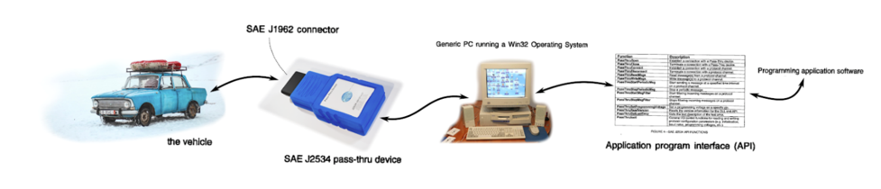
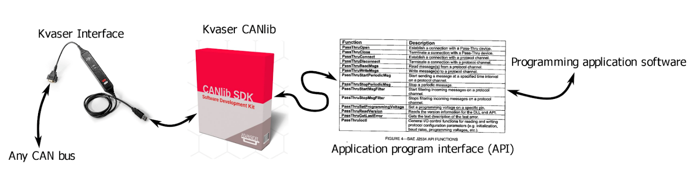
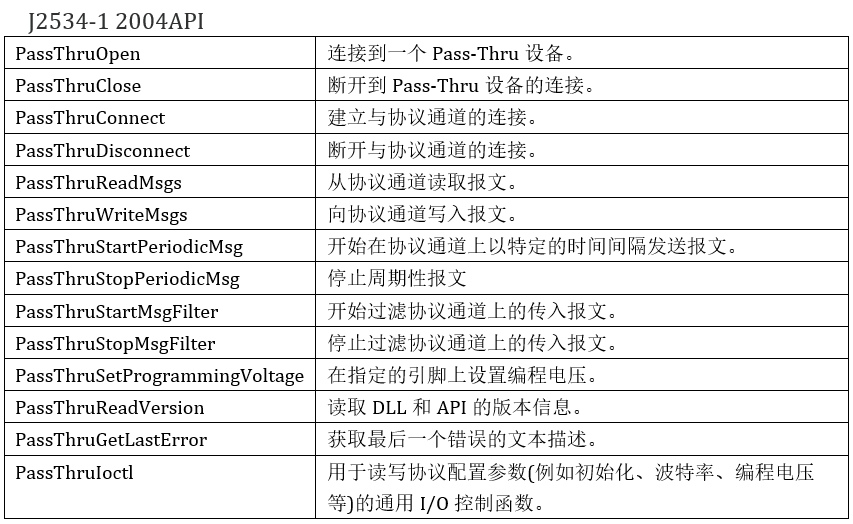
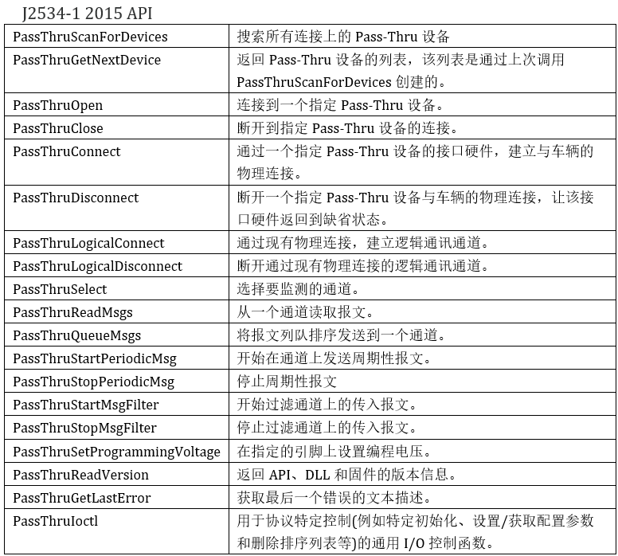
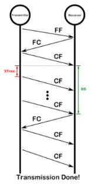

# SAE J2534

## 历史和概念

2002年，美国汽车工程师学会(SAE)注意到，有必要标准化维修技术人员重新给车辆编程的操作。与其让维修技术人员购买各种各样的设备，接入车辆检测，而汽车制造商不得不支持所有这些设备，不如让这些维修人员购买一个标准化的设备 – 仍然是从他们自己选择的供应商那里 – 所有设备都使用一个统一的标准API。这将有助于汽车制造商和维修技术人员在这个快速变化的领域优化他们的技术投资。

2002年，SAE为此发布了一个名为SAE J2534-1的标准，标准化了他们所称的“Pass-Thru Device(通过式设备)”以及控制它的API。而且此Pass-Thru设备可使用维修人员常用的任何一种协议与汽车进行通信，同时仅由一个具备多个函数的接口控制 – 这些函数都被称为PassThruXxx()——以免你忘记你在使用“Pass-Thru Device”。

我们的J2534传奇中的最近一个事件是J2534-2:2019的发布，它带来升级后的可选功能。由于J2534-1:2015的要点是删除可选性，它仍然基于J2534-1:2004。因此，尽管J2534-2:2019是在J2534-1:2015之后发布，它仍然是基于2004年的J2534-1版本。而J2534-2:2019之所以引人注目，是因为该标准新增了对CAN FD的支持，包括ISO-TP FD。它还引入了一种“查询机制”，让用户应用程序能向DLL询问：它支持哪些协议，以及该设备有多少个通道等。

下面列出了所有的J2534标准，以及对每一个标准的概括：
- J2534-1 2002
- J2534-1 2004 (×2)，包含了CAN 2.0和基于K-line的规范
- J2534-2 2006 (基于J2534-1 2004)。实现多个设备和多通道；在同一通道上混合CAN 2.0和ISO-TP报文
- J2534-2 2010 (基于J2534-1 2004)。没有太大意义
- J2534-1 2015。有新的API；CAN 2.0和基于K-line的协议；更明确地解释操作，更详细的接口；无可选功能
- J2534-2 2019 (仍然基于J2534-1 2004)。支持CAN FD；查询机制

### 关于 Pass-Thru 概念

J2534-1:2004对所谓的“Pass-Thru概念”有这样的说法：

[J2534-1]为SAE J2534 Pass-Thru设备定义了下面两个接口：

1.在电脑上运行的编程应用程序和pass-thru设备的软件设备驱动程序之间的应用程序接口(API)

2.pass-thru设备与车辆之间的硬件接口

此标准假定一个特定的设置。你的车辆有一个J1962连接器，并且你可将一个Pass-Thru设备插入其中。然后，你将该设备插入一台装有32位Windows操作系统的计算机，用户应用程序使用一个具有标准化接口的DLL来控制该Pass-Thru设备。

J2534设备与软件供应商Kvaser并不销售Pass-Thru设备，但仍提供J2534 DLL。这样用户可以通过与Pass-Thru设备相同的标准化API来使用任何Kvaser接口。这是通过包装Kvaser的CANlib库，添加和扩展功能来实现J2534标准的适用部分。

J2534特别要求使用32位DLL。

Kvaser的J2534 DLL为CANlib库提供了一个J2534 API，它基于J2534-1:2004的API并与之兼容，并且支持J2534-2:2019中适用的可选功能。就协议而言，这意味着它支持CAN 2.0、CAN FD、ISO-TP和ISO-TP FD。

### 两个 API

下面是2004年和2015年版本的J2534 API中的所有函数，以及相关标准提供的简短说明。

## 术语定义

ISO-TP
15765-2:2011定义的传输协议, 不支持15765-2:2016引入的CAN FD，有时被简单地称为ISO 15765-2或ISO 15765。
ISO-TP FD
15765-2:2016 (支持CAN FD)定义的传输协议。
CAN
ISO 11898限定的控制器局域网, 是对CAN 2.0和CAN FD的总称。
CAN 2.0
“classic” CAN支持最大8个字节的数据，不支持比特率切换。
CAN FD
CAN FD(可变速率)协议，支持比CAN 2.0更长的数据帧和比特率切换。
J2534
一系列标准 – 用于指定Pass-Thru设备，以及用于通过J2534 DLL与这些设备通讯的Pass-Thru API。
J2534 DLL
适配器制造商提供的DLL, 兼容Pass-Thru API。
Pass-Thru API
适合所有J2534 DLL的API, 无论在选用哪个公司的DLL, 车辆制造商均可以使用。
Pass-Thru设备
由J2534标准化的一种特定类型的设备, 并且附带一个J2534 DLL。

## 使用 2004 API
要有效地使用J2534 API，你既需要了解你使用的协议，还需要了解该协议的API操作序列 – 而J2534实际上尽力让协议不可知。让我们先简要概述一下它所支持的基于CAN的协议(直到J2534-2 2019)，然后简要介绍一下如何通过J2534 API使用每种协议。

### 协议基础
我们将介绍Kvaser的J2534 DLL目前支持的四种协议：CAN 2.0、CAN FD、ISO-TP和 ISO-TP FD。在J2534中，它们有单独的协议“ID”，我们将把它们作为单独的协议来对待，但实际上它们有细微的差别。这两个FD协议实际上是无FD版本的CAN升级版本，支持CAN可变速率格式(FD)，同时还提供普通CAN版本的所有功能。还值得一提的是，ISO-TP (具备或不具备FD)是在CAN (对应2.0或FD)之上的高级协议。

#### CAN 2.0
作为下列所有协议的基础，CAN 2.0(有时称为经典CAN)是一个容错协议，用于传输称为帧的报文，广播给总线上的所有节点。这些帧由CAN数据(最长为8字节)和CAN ID组成，CAN ID长度可以是11(标准)或29(扩展)位，用于确定哪些帧优先进入总线，这称为“仲裁”。然后这些帧在总线上以预定义的比特率发送。

#### CAN FD
2015年，CAN的标准文件ISO11898得到升级，包括了CAN FD – 可变速率CAN。这意味着你现在可以选用一个比特率来仲裁CAN ID，和使用另一个(更高的比特率)来发送实际数据。通过更高的传输速度，我们还可以发送更大的帧，CAN数据长度为12、16、20、24、32、48和64个字节 – 在CAN 2.0已有的最长8个字节基础上。

在总线上，每帧数据都编码了，是否启用比特率转换(BRS)，由其传输的其中一个数据位决定。是否使用CAN 2.0或CAN FD的总体决定也在其中一个传输位中编码(尽管如果你不使用FD，就不能使用BRS)，这意味着支持CAN FD的设备能以三种不同格式读取和写入报文： 

|格式|数据长度（字节）|比特率|ID 长度|
|-|-|-|-|
|can 2.0 |1-8|单一|11/29|
|can fd|1-8,12,16,...,64|单一|11/29|
|can fd|1-8,12,16,...,64|可变/数据|11/29|

注意，不论格式如何，都可以选择 11或29位ID。与BRS一起使用的两个比特率通常称为“仲裁比特率”和“数据比特率”(也可能在中间加入“-段”)。
####  ISO-TP
ISO 15765是国际标准化组织制定的一系列标准。我们感兴趣的是它的第二部分，ISO 15765-2，它定义了“传输协议和网络层服务” — 我们尤其需要了解传输协议ISO-TP。

请注意不同的人赋予此协议不同的名称，因为该标准本身从未为其命名。J2534将其称为ISO 15765（尽管ISO 15765系列中还有四个其他标准），其他人将其称为ISO 15765-2（尽管该标准还包括标准化传输协议之外的大量内容），但我将继续称其为ISO-TP（ISO传输协议），因为这样最为清楚明了，仅指传输协议和字面上仅限传输协议。

ISO-TP是构建在CAN 2.0之上的更高级别协议，其主要目的是让报文可“分段”，分成多个CAN帧 — 这意味着你可以发送更长的报文。为了以一种有序的方式进行此操作，它在发送方和接收方之间使用往返沟通来控制帧的发送速度，并确保帧到达。

此往返沟通意味着，如果你想让报文分段，就必须把它发送给唯一的接收方。这是ISO-TP的最后一部分；报文可以一对一发送，也可以一方对多方发送。在ISO-TP术语中，一对一通信称为“物理寻址”， 一方对多方通信称为“功能寻址”。虽然这些术语常让感到更困惑而不是更清楚。

帧的分段

你要发送一条ISO-TP报文？如果它适合一个单个CAN帧，那么很简单，它将直接作为单个帧(SF)传输。对于一方对多方通信，这是唯一可行方法 — 一对多ISO-TP报文必须使用SF。

而一对一通讯可发送更长的报文。在这种情况下，发送器发送一个携带尽可能多有效负载的单个CAN帧 — 第一个帧(FF)，然后一个(单个)接收器被设置为必须答复一个流量控制(FC)帧。此操作可以暂停、取消或继续传输，在继续传输的情况下，它包含两个参数：STmin(最小间隔时间)和BS(块大小)，这两个参数将一直使用到下一个流量控制帧FC。

然后，发送器将发送一个包含有效载荷的CAN帧“块”，称为连续帧(CF)，其帧的数量多少由块大小(Block Size)控制。最小间隔时间是总线上发送CAN帧之间必须等待的时间。发送一个块后，发射器等待下一个FC，然后重复此过程。当整个有效负载传输完毕后，传输对话随即悄然停止。

Addressing寻址

网络中的每个节点都有一个地址，对于每条报文，该地址以几种方式之一被编译成“地址信息”，这其中有些方式是标准化的，有些不是，每种方式都有几种不同的变体 – 视其功能或物理寻址而定。

还好，J2534 API让将用户选择这一切。就API而言，每个ISO-TP报文都有一个地址。这可以是一个“扩展”地址 – 在这种情况下它比CAN ID长一个字节，也可以是一个普通地址 – 在这种情况下，它完全等同于CAN ID。

然后用户可以定义：

以哪个地址接收单个帧SF。
以哪个地址监听分段传输，以及回复每个分段传输的地址。
哪些地址可以接收传输，以及哪些地址需要接收各个回复。

#### ISO-TP FD
2016版ISO 15765-2在ISO-TP协议下增加了支持CAN FD。幸运的是，这对我们来说没有什么变化。你现在必须指定帧为CAN 2.0、CAN FD或是带有BRS的CAN FD，以及指定单个CAN FD帧的大小(你可能不需要每个帧都有64字节)。

另一个区别是，ISO-TP报文的有效负载最多为4095字节，而ISO-TP FD添加的新机制可使用4G字节(4294967296 字节)。

…其中J2534 API只能使用28或29个额外字节，总共4124或4123个字节，这取决于我们是否使用扩展寻址。这是因为报文放在静态大小的结构中。:/. (由于此原因，Kvaser API目前没有实现这种额外机制。)

### 操作顺序
现在你已经了解这个协议的发展过程，那么如何设置DLL以进行通讯呢？基本的调用顺序是：

- PassThruOpen(): 打开一个设备(Kvaser DLL只有一个设备)。
- PassThruConnect(): 使用特定的协议ID连接到设备上的通道。
- 根据你的需要使用通道
- PassThruDisconnect(): 断开通道
- PassThruClose(): 关闭设备。

第一步是打开一个设备，第二步是让该设备连接到一个通道。基础J2534-1 2004只有一个设备，但你仍必须打开它才能连接到通道。如果DLL根据J2534-2实现对其他通道的访问，则可以使用同一设备连接多个通道，只要它们不使用同一个物理连接。

由于断开通道和关闭设备不是很有趣，从现在起将省略这些步骤。

请注意，所有API调用都会返回一个状态，如果一切正常，该状态将为status_NOERROR=0。否则，请调用PassThruGetLastError() 以获取对错误的更详细描述，例如，你提供的CAN ID是否太小或太大，或者是CAN数据出错，而不仅仅是ERR_INVALID_MSG。

#### CAN 2.0
协议ID: CAN, CAN_CH1, CAN_CH2…

CAN使用注册表中提供的通道号，CAN_CH1为CANlib通道0，CAN_CH2为CANlib通道1，等等。

PassThruOpen()
PassThruConnect(), 通过协议ID选择CANlib通道并给出比特率。在连接标志上，你必须指定通道需要发送11位或29位CAN ID的帧，或者两者都需要。
无需任何设置即可发送报文。
PassThruStartFilter(), 定义应监测哪些CAN ID并将其报告给用户。在设置过滤器之前，无法看到来自总线的通讯。

#### CAN FD
协议IDs: FD_CAN_CH1, FD_CAN_CH2…

CAN FD无法使用注册表中的通道号，CHx ID的操作方式与CAN 2.0类似：FD_CAN_CH1是CANlib通道0，FD_CAN_CH2是CANlib通道1，等等。

PassThruOpen()
PassThruConnect(), 使用协议ID选择CANlib通道并给出仲裁比特率(仅限此比特率)。在连接标志中，你必须指定通道发送11位或29位CAN ID的帧，或者两种都需要。通道尚未连接。
PassThruIoctl(), SET_CONFIG(配置): 设置FD_CAN_DATA_PHASE_RATE为需要的数据比特率。通道现在已连接到CAN总线。
无需任何设置即可发送报文。
PassThruStartFilter(), 定义应监测哪些CAN ID并将其报告给用户。在设置过滤器之前，无法看到来自总线的通讯。
即使你从不使用比特率切换，也必须在通道连接到CAN总线并发送和接收报文之前，指定数据比特率。

#### ISO-TP
协议ID: ISO15765, ISO15765_CH1, ISO15765_CH2…

与CAN 2.0类似，ISO15765使用注册表中提供的通道号，ISO15765_CH1为CANlib通道0，ISO15765_CH2为CANlib通道1，等等。

PassThruOpen()
PassThruConnect(), 通过协议ID选择CANlib通道并给出比特率。在连接标志中，你必须指定通道发送11位或29位CAN ID的帧，或者两种都需要。
无需任何设置即可发送非分段报文。
PassThruStartFilter(), 定义报文地址对。此通道将通过流量控制帧FC的传输地址响应具有接收地址的报文。分段报文也可以在传输地址上发送，在这种情况下，通道期待FC具有接收地址。当接收一对多(物理寻址)报文时，需要提供相同的地址两次(因为一对多报文从不需要流量控制帧FC)。

#### ISO-TP FD
协议ID: FD_ISO15765_CH1, FD_ISO15765_CH2…

与CAN FD类似，当FD_ISO15765_CH1为CANlib通道0，FD_ISO15765_CH2为CANlib通道1等时，无法使用注册表中的通道号。

PassThruOpen()
PassThruConnect(), 通过协议ID选择CANlib通道并给出比特率。在连接标志中，你必须指定通道发送11位或29位CAN ID的帧，或者两种都需要。通道尚未连接。
PassThruIoctl(), SET_CONFIG: 设置FD_CAN_DATA_PHASE_RATE为需要的数据比特率。通道现在已连接到CAN总线。
无需任何设置即可发送非分段报文。
PassThruStartFilter(), 定义报文地址对。此通道将通过流量控制帧FC的传输地址响应具有接收地址的报文。分段报文也可以在传输地址上发送，在这种情况下，通道期待FC具有接收地址。当接收一对多(物理寻址)报文时，需要提供相同的地址两次(因为一对多报文从不需要流量控制帧FC)。

## 开始使用和SAE J2534
第一步是考虑你将使用哪些协议，然后查找协议基础知识和该协议的操作顺序。这是因为这些协议根本上是不同的，你需要了解如何使用各种协议以得到你需要的结果。

如果你不了解此API为何以某种特定方式工作，或者想知道该查看历史和概念哪些标准文档，以得到特定结果。

要访问Kvaser的J2534 DLL，你需要安装CANlib驱动程序，确保选择安装“J2534驱动程序”(默认设置)。

https://www.kvaser.cn/developer-blog/sae-j2534-getting-started-kvaser-and-saej2534-part-3/