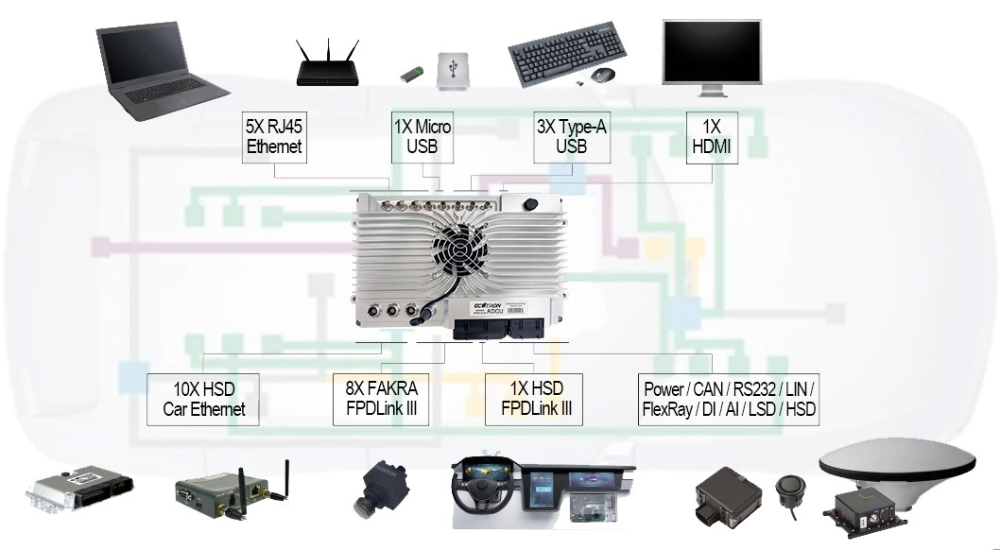

# ADAS
## 术语

> 根据GB/T 39263-2020 《道路车辆 先进驾驶辅助系统ADAS术语及定义》

ADAS

- ADCU: 接收来自多个传感器的数据，例如摄像头、雷达、激光雷达和云数据（V2X），并从VCU获取车辆动态数据，以便支持决策和路线规划算法。ADCU的输出将用于驾驶状态反馈、车辆控制和各种自动驾驶功能.

ADAS Advanced Driver-Assistance Systems
ACC Adaptive Cruise Control
AEB Automatic Emergency Braking
LKA Lane Keeping Assist
LDW Lane Departure Warning
FCW Forward Collision Warning
RCW Rear Collision Warning
PCW Pedestrian Collision Warning
CAN Controller Area Network
BSD Blind Spot Detection
CMS Collision Mitigation System
RSR Road Sign Recognition
HMW Headway Monitoring Warning
TTC Time-To-Collision

- FPD-Link：FPD-Link III 串行总线方案支持通过单个差分链路实现高速视频数据传输和双向控制通信的全双工控制。 通过单个差分对整合视频数据和控制可减少互连线尺寸和重量，同时还消除了偏差问题并简化了系统设计。最初 FPD-LINK 应用在笔记本电脑上用于视频显示，TI公司结合汽车娱乐信息系统应用环境，开发出FPD-Link III 串行器/解串器，在信息娱乐系统显示屏和 ADAS 摄像头应用中通过一条 STP 或同轴电缆传输视频、音频、控制数据和电力。

## 设备示例

### ADCU

https://ecotron.ai/adcu/

EAXVA05 (Xavier + Xavier + TC297)特色：
- NVIDIA Jetson Xavier * 2 & TC297TP
- 64 TOPS
- 10 CAN buses
- 12 HD Cameras
- Multiple I/O interfaces

EAXVA05 (Xavier + Xavier + TC297)接口：
- video input: 12 channels, FPDLink III
- Video output: 2 channels HDMI
- USB: 2 channels TYPE-A
- RS232: 8 channels, 1 channel for debug
- Automotive Ethernet: 5 channels, 100Base-T1/1000Base-T1
- Standard Ethernet: 4 channels, 100Base-T/1000Base-T
- CAN: 4+6 channels, 4 channels connected to SOC, 6 channels connected to MCU, CAN FD compatible, 2 of them have the function of wake-up by specific CAN message
- LIN: 4 channels
- Digital input: 6 channels,4 channels active high, 2 channels active low
- Analog input: 6 channels, 2 channels 5V voltage type, 2 channels 36V voltage type, 2 channels resistor type
- Digital low-side output: 8 channels@250mA
- Digital high-side output:	4 channels@1A
- 5V sensor power supply:	2 channels maximum current 100mA

以ecotron adcu eaxva05为例，配备2个nvida xavier芯片和1个infineon tc297芯片，可以支持低速的l4自动驾驶系统。Infineon TC297 采用TriCore架构，工作频率300MHz，具有728KB+8MB存储，ECC（纠错编码）RAM保护。Ecotron 的ADCU基于ISO26262 设计，支持ASIL-D 安全等级要求。Ecotron ADCU 在本地目标上安装了一套开发工具，包括 gcc、make、CMake、catkin、Bazel 和 gdb 调试器。应用程序开发人员可以直接在目标控制器上开发用户空间应用程序。EcoCoder-AI 是添加在 MATLAB/Simulink 上的功能强大的自动代码生成库，可直接链接到目标控制器。EcoCoder-AI集成了自动代码生成、编译和一键生成可执行文件。它可以直接将 Simulink 模型转换为目标控制器的可执行程序并下载到目标控制器。它支持使用 Simulink Library，极大地方便了控制工程师基于自动驾驶中间件图形化开发应用程序。此外，EcoCoder-AI 支持使用 Simulink 外部模式进行动态校准。

## ADAS 数据采集

数据采集不仅要有适配接口、协议，还要实现多路数据的时钟同步。高精度的统一时间戳数据记录（精确到1微秒）。

接口：
- CAN
  - 毫米波雷达、超声波雷达、IMU、其他
- CAN-FD
- LIN
- FlexRay
- 以太网
  - 激光雷达
  - 高清摄像头
- USB
- HDMI
- 音频
- 视频采集
- RS232
- RS485
  - GPS
- DI
- DO
- AI
- 路以太网
- 路摄像头
  - Fakra

协议：
- CCP
- XCP
- UDS
- Monitor

数据库：
- DBC
- A2L
- ODX
- PDX
- FIBEX

存储：
- SSD

