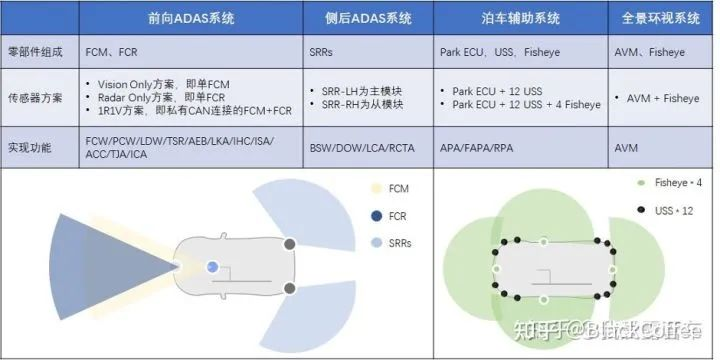

# ADAS/AD

## 概念

智能化是实现汽车作为人们第三生活空间这一目标的重要技术路径，当前汽车智能化主要有两大发展方向：驾驶自动化和座舱智能化。自动驾驶（ADAS/AD）的使命是将人的脚（纵向控制）、手（横向控制）、眼（感知）和脑（决策）等从驾驶任务中解放出来。人的精力被释放出来后，进一步促进了人在汽车内办公、休闲和娱乐的需求，这些需求推动了汽车座舱的数字化、信息化以及新兴的人机交互模式等技术的蓬勃发展，这也就是“智能座舱（Intelligent Cockpit）”技术。

目前自动驾驶技术在全球范围内已经进入快速发展期。随着搭载L1/L2级别ADAS功能的汽车进入大规模量产，L1/L2级别ADAS功能的市场渗透率将快速提升。而L3/L4级别自动驾驶系统仍处于小规模原型测试阶段。当今的自动驾驶行业，中国市场绝对是主力。今年中国L2的搭载量预计突破80万，中国品牌占据绝大部分份额。

早期的ADAS技术主要以被动报警为主，如今的ADAS主要是主动干预。

ADAS功能市场渗透率的快速提升来自几个方面的驱动力：

1. ADAS相关的软硬件技术越来越成熟和稳定，成本也越来越低。比如：毫米波雷达跟五年前相比下降了超过50%。

2. 一些基本的ADAS功能（比如：自动紧急刹车AEB）被纳入到了各国的汽车评测体系（比如：C-NCAP）中，这在客观上极大的推动了这些ADAS功能的普及。

3. 中低端车竞争加剧，ADAS功能可以有效地提升品牌的科技感和驾车体验，造成主流合资品牌和自主品牌的重点车型甚至超过了一些国际上的高端品牌。

未来中国市场ADAS功能的渗透率还将持续快速提高，中低端汽车所配置的ADAS功能将逐步增多。根据艾瑞咨询研究报告显示，预计2025年ADAS功能在乘用车市场可以达到65%左右的渗透率。L3级别的高速自动领航HWP功能和L4级别的AVP自动泊车功能，目前车型渗透率较低，未来提升空间较大。

## 术语

通常，L0-L2级自动驾驶，习惯用ADAS表征；L2+级自动驾驶，用ADAS/AD表征，以示过渡；L3-L4级自动驾驶，用AD表征。

> 根据GB/T 39263-2020 《道路车辆 先进驾驶辅助系统ADAS术语及定义》

ADAS

- ADCU: 接收来自多个传感器的数据，例如摄像头、雷达、激光雷达和云数据（V2X），并从VCU获取车辆动态数据，以便支持决策和路线规划算法。ADCU的输出将用于驾驶状态反馈、车辆控制和各种自动驾驶功能.

自动驾驶域需要具备多传感器融合、定位、路径规划、无线通讯、决策控制、高速通讯等能力，自动驾驶域需要外接如毫米波雷达、激光雷达、车载摄像头、惯性导航等硬件设备，从而实现自动驾驶的感知、决策能力，其核心是芯片的处理能力，最终目标是实现自动驾驶的算力需求，简化设备，提高自动驾驶系统的集成度。自动驾驶域也是负责汽车在自动驾驶状态下底层核心数据、联网数据的安全保障工作，是推动L3及以上更高等级自动驾驶的核心部件。

ADAS Advanced Driver-Assistance Systems
ACC Adaptive Cruise Control
AEB Automatic Emergency Braking
LKA Lane Keeping Assist
LDW Lane Departure Warning
FCW Forward Collision Warning
RCW Rear Collision Warning
PCW Pedestrian Collision Warning
CAN Controller Area Network
BSD Blind Spot Detection
CMS Collision Mitigation System
RSR Road Sign Recognition
HMW Headway Monitoring Warning
TTC Time-To-Collision

- FPD-Link：FPD-Link III 串行总线方案支持通过单个差分链路实现高速视频数据传输和双向控制通信的全双工控制。 通过单个差分对整合视频数据和控制可减少互连线尺寸和重量，同时还消除了偏差问题并简化了系统设计。最初 FPD-LINK 应用在笔记本电脑上用于视频显示，TI公司结合汽车娱乐信息系统应用环境，开发出FPD-Link III 串行器/解串器，在信息娱乐系统显示屏和 ADAS 摄像头应用中通过一条 STP 或同轴电缆传输视频、音频、控制数据和电力。

## 自动驾驶域控制器产品

随着汽车智能化进程加速，传统的分布式ADAS ECU（比如，智能摄像头一体机、泊车控制器、全景环视控制器）正在为具有集中式、大算力、更集成的ADAS域控制器让路。作为智能驾驶的大脑，融合来自摄像
头、雷达、超声波、高精度定位和地图数据，用于感知和决策。

发展历程：
- 2016年奥迪的驾驶辅助系统控制单元 zFAS 成为汽车行业算力域控制器的一个里程碑。集成了传统MCU、Mobileye、英伟达的两颗算力SoC、FPGA。
  - Nvidia Tegra K1用于360°数据融合处理；
  - Mobiley的EyeQ3则专门负责来自摄像头的图像处理（内置感知算法，用于车辆/行人检测等）。
  - 还有一颗来自Altera Cyclone的FPGA用于数据预处理、融合。

- 德尔福（后来更名为安波福，zFas的一级供应商）、博世等陆续导入“功能域”的概念，来统一搭建集中式整车电子电气架构。
- 英伟达推出的大算力SoC（Xavier），一度成为博世、采埃孚等传统Tier1的域控制器芯片合作伙伴，但进展缓慢。
- 博世中国团队主导研发的高阶智能驾驶3.0平台预计要到2023年量产。
- 而直到今年初，采埃孚才宣布将携手越南本地汽车制造商VinFast开发L2+级别自动驾驶和泊车功能，并在未来几年共同致力于开发L3及以上级别的自动驾驶功能。这也是采埃孚集团全球首个L3级别自动驾驶项目，将由中国研发团队主导，德国和美国团队协作开发。整套方案通过硬件预埋（基于英伟达 Orin X）实现L2+的自动驾驶功能。
- 在中国市场，小鹏汽车+英伟达+德赛西威的组合，推动了全球首款基于英伟达Xavier自动驾驶域控制器产品（IPU03）的正式量产搭载小鹏P7。
- 此后，博世的Dasy1.0 ADAS控制器、安波福的中央域控制器（5R1V卫星架构）也陆续在中国市场量产落地。
- 而随着TI TDA4、英伟达Orin、高通Snapdragon Ride平台以及地平线征程3、征程5，Mobileye EyeQ5的陆续定点、量产，更多的中国本土域控制器厂商也在加快落地。

### 2021 智驾域控制器本土厂商
- 第一德赛西威 （份额第一）
  - 德赛西威第一代高算力自动驾驶域控制器平台IPU03，主打高性能，已率先在小鹏汽车的P7、P5车型上大规模量产供货；
  - 新一代高算力自动驾驶域控制器平台IPU04基于英伟达Orin系列芯片打造，将实现算力大幅提升，可支持实现冗余设计及未来升级高级别的自动驾驶功能，已获得众多项目定点，包括传统自主品牌客户和新造车势力。
  - 德赛西威智能驾驶业务客户包括吉利汽车、长城汽车、小鹏汽车、理想汽车、上汽通用等众多主流车企，并提供软硬一体的智能驾驶域控制器产品。此外，基于L2/L2+级别的IPU02（基于TDA4）则满足行泊一体的需求，已经实现量产上车。
- 第二 东软睿驰 （研发第一）
  - 东软睿驰推出的NeuSAR（国内首个产品化基础软件平台），兼容最新版AUTOSAR标准，既支持传统的ECU开发，同时又对新一代电子电器架构下的基于域控制系统的软件开发提供丰富的基础软件、中间件和开发工具。
  - 东软睿驰推出的第四代自动驾驶域控制器X-Box是基于SDV开发模式下的全新L2+级别域控制器标准品，产品基于地平线征程5系列人工智能芯片，具备L2+级别行车与泊车功能，支持8M摄像头、4D点云毫米波雷达和激光雷达的接入，场景覆盖高速路、城市快速路、部分城市道路和多类停车场。
  - 第四代自动驾驶域控制器X-Box的安全性设计按照ISO 26262和ISO 21434对功能安全和信息安全进行开发，对行车典型场景和泊车典型场景实施了最小风险策略，对车端、云端、手机端的网联系统实施了安全启动、安全存储、安全升级、安全通信等模块的部署。通过标准化硬件、平台化软件、工具化服务为车企分层次提供自动驾驶域控制器解决方案。

- 第三 知行科技
  - 去年10月在吉利极氪首款量产车实现域控制器及全栈智驾方案的量产上车。这是该公司和Mobileye深度合作的Supervision系统首发量产，包括两块EQ5H芯片组成的高算力自动驾驶控制器，可实现城区道路、高速高架场景下的导航辅助自动驾驶功能。
  - 知行科技来自极氪001在手订单超10万套。此外，该公司还获得长城、奇瑞、吉利SMART等多个一线主机厂的多个车型量产定点。
  - 知行科技还推出了IDC行泊一体域控制器，基于高度自动驾驶系统及软件架构向下兼容设计开发，最大算力可达100+TOPS（支持Urban NoA及AVP等功能）。2022年即将在多家头部车企新车型上交付应用的IDC Mid版可同时支持NoA Highway、HPA、SV3D等功能。

- 第四 华为MDC
- 第五 诺博科技 （成长潜力第一）
  - 是一家致力于智能座舱、智能车控、智能网联、智能驾驶领域的智能汽车关键系统集成供应商。该公司在去年率先实现座舱域控制器（基于高通平台）的前装规模化量产。
  - 该公司正在将业务板块从智能座舱域控制器拓展到自动驾驶域控制器市场，专注于自动驾驶域控制器硬件平台开发，布局L2+到L4的产品平台，并在2025年融入到车载计算平台One Brain中。
  - 诺博科技正在与毫末智行合作开发自动驾驶产品，毫末智行负责应用软件和算法开发，而诺博科技则负责硬件和底层开发。平台基于高通5纳米制程的芯片打造，首车型项目的量产计划在2022年。
  - 公开信息显示，诺博科技采用的是平台化开发方案，强调产品方案开放、包容以及合作方式灵活等。比如诺博科技既可以为OEM提供整体解决方案，也接受与OEM的联合开发。

- 第六 宏景智驾
- 福瑞泰客 （全栈布局第一）
- 创时智驾
- 均胜电子
  - 公司旗下宁波均胜智能汽车技术研究院，紧贴市场需求,发力智能驾驶领域，推出智能驾驶域控制器，产品分为主打L2/L2+的高性价比版(Lite)与标准版(Standard)，以及主打L2++至L4的高阶版(Advanced)与超能版(Ultra)。
  - 同时，宁波均胜智能汽车技术研究院也积极布局针对未来车型EE架构的研发工作，在舱泊一体、舱驾一体、多域融合以及未来的ZONAL架构等方面进行业务探索和布局。
- 经纬恒润

其他厂商：
- 伟世通
- 大陆
- 博世
- 维宁尔
- 采埃孚
- 安波福
- 松下
- 麦格纳
- 佛吉亚
- 百度
- 德赛西威
- 宏景智驾
- 航盛电子
- 布谷鸟
- 福瑞泰克
- 电装
- 华阳
- 北斗星通
- 三星哈曼
- 博泰
- 现代摩比斯

## 功能
目前（2021）常见的ADAS系统包括：

主动安全功能：
- 车道偏离预警系统（Lane departure warning system, LDWS）
- 车道保持系统LKS（Lane keeping System）
- 前碰撞预防系统FCW （Front collision warning）
- 行人碰撞预警PCW（Pedestrian collision warning）：监测车辆前方30m，车辆中心两侧1.8m的矩形区域内的行人，实时计算在车前方的行人和车子即将发生碰撞的时间（TTC），当TTC一旦降低到一个危险值的时候，如车辆在2s内会撞到行人，PCW会发出告警。
- 自动紧急制动AEB（Autonomous Emergency barking warning）
- 盲点监测系统BSD （Blind spot detection warning）
- 变道辅助LCA （Lane Changing Assist）
- 后向碰撞预警（Rear Collision Warning）
- 车道居中控制（Lane Centering Control）

驾驶舒适性：
- 驾驶员疲劳预警系统DFM
- 自适应巡航系统ACC（adaptive cruise control）
- 自适应灯光控制ALC
- 交通拥堵辅助TJA（traffic jam assist）
- 集成巡航辅助ICA（Integrated cruise assistant）
- 高速公路辅助HWA（Highway assist）
- 夜视系统NVD等
- 导航自动驾驶辅助NOA（navigation on autopilot）

泊车辅助：
- 自动泊车系统APA（automated parking assist）
- 远程泊车辅助RPA（Remote Parking Assist）
- 家庭区域泊车辅助HPA（Home zone parking pilot)
- 全景环视监控AVM（Around View Monitoring）
- 召唤Summon

L3/L4级监督或无监督的自动驾驶：
- 交通拥堵领航TJP：驾驶员可以在拥堵的高速或快速路上放开手脚，同时注意力可以长时间内从驾驶环境中转移，看手机或接电话、看风景等活动。该系统最高工作速度为40-60kph。
- 高速公路领航HWP
- 自动代客泊车AVP（Automated valet parking）：对于停车场等封闭场，用户在指定下客点下车，通过手机APP下达泊车指令，车辆在接收到指令后可自动行驶到停车位，不需要用户操作与监控。AVP被称为是解决用户最后一公里自由的L4级自动驾驶技术，是目前最有希望成为商业落地的自动驾驶技术应用场景。
- 城市领航CP（city-pilot），也成Urban pilot，属于开放道路下的L4级别自动驾驶功能。
#### LDWS

车道偏离预警系统LDWS（ Lane departure warning system）是指行车中未打转向灯突然大幅度偏离车道，不正常偏移时，行车记录仪一旦判定行驶路线有异，便会以行车记录仪的显示屏幕提醒驾驶人，并发出声响警告对司机进行警示。这将使司机可以马上采取行动，回到原行车道上。

车道偏离预警系统主要由4部分组成:
- HUD抬头显示器
- 摄像头
- 控制器
- 传感器

当车道偏离预警系统开启时，摄像头（一般安置在车身侧面或后视镜位置）会时刻采集行驶车道的标识线，通过图像处理获得汽车在当前车道中的位置参数。

当检测到汽车偏离车道时，传感器会及时收集车辆数据和驾驶员的操作状态，之后由控制器发出警报信号，**整个过程大约在0.5秒完成**，为驾驶者提供更多的反应时间。而如果驾驶者打开转向灯，正常进行变线行驶，那么车道偏离预警系统不会做出任何提示。

#### 车道保持系统LKS

车道保持辅助系统（Lane keeping system）属于智能驾驶辅助系统中的一种。它可以在车道偏离预警系统（LDWS）的基础上对刹车的控制协调装置进行控制。对车辆行驶时借助一个摄像头识别行驶车道的标识线将车辆保持在车道上提供支持。可检测本车在车道内的位置，并可自动调整转向，使本车保持在车道内行驶。

如果车辆接近识别到的标记线并可能脱离行驶车道，那么会通过方向盘的振动，或者是声音来提请驾驶员注意，并轻微转动方向盘修正行驶方向，使车辆处于正确的车道上，若方向盘长时间检测到无人主动干预，则发出报警，用来提醒驾驶人员。

如果车道保持辅助系统识别到本车道两侧的标记线，那么系统处于待命状态。这通过组合仪表盘中的绿色指示灯显示。当系统处于待命状态下，如果在Y过标记线前打了转向灯，警告信号就会被屏蔽，认定驾驶员为有意识地换道。

该系统主要应用于结构化的道路上，如高速公路和路面条件较好（车道线清晰）的公路上行驶。当车速达到65km/h或以上才开始运行。

#### 自适应巡航系统ACC

自适应巡航系统ACC（Adaptive Cruise Control）是一项舒适性的辅助驾驶功能。如果车辆前方畅通，自适应巡航（ACC）将保持设定的最大巡航速度向前行驶。如果检测到前方有车辆，自适应巡航（ACC） 将根据需要降低车速，与前车保持基于选定时间的距离，直到达到合适的巡航速度。

自适应巡航也可称为主动巡航，类似于传统的定速巡航控制，该系统包括雷达传感器、数字信号处理器和控制模块。在自适应巡航系统中，系统利用低功率雷达或红外线光束得到前车的确切位置，如果发现前车减速或监测到新目标，系统就会发送执行信号给发动机或制动系统来降低车速，从而使车辆和前车保持一个安全的行驶距离。

当前方道路障碍清除后又会加速恢复到设定的车速，雷达系统会自动监测下一个目标。主动巡航控制系统代替司机控制车速，避免了频繁取消和设定巡航控制。当与前车之间的距离过小时，ACC控制单元可以通过与制动防抱死系统、发动机控制系统协调动作，使车轮适当制动，并使发动机的输出功率下降，以使车辆与前方车辆始终保持安全距离。自适应巡航系统适合于多种路况，为驾驶者提供了一种更轻松的驾驶方式。

#### 前碰撞预防系统FCW
前碰撞预防系统FCW (Forward Collision Warning)是通过雷达系统来时刻监测前方车辆，判断本车与前车之间的距离、方位及相对速度，当存在潜在碰撞危险时对驾驶者进行警告。FCW系统本身不会采取任何制动措施去避免碰撞或控制车辆。

通过分析传感器获取的前方道路信息对前方车辆进行识别和跟踪，如果有车辆被识别出来，则对前方车距进行测量。同时利用车速估计，根据安全车距预警模型判断追尾可能，一旦存在追尾危险，便根据预警规则及时给予驾驶人主动预警。

#### 自动泊车系统APA

自动泊车系统APA（Automatic Parking Assist）是利用车载传感器（一般为超声波雷达或摄像头）识别有效的泊车空间，并通过控制单元控制车辆进行泊车。相比于传统的倒车辅助功能，如倒车影像以及倒车雷达，自动泊车的功能智能化程度更高，有效的减轻了驾驶员的倒车困难。

全自动泊车辅助系统APA，通过控制车辆的加减速度和转向角度自动停放车辆。该系统通过AVM（环视）和USS（超声波雷达）感知泊车环境，使用IMU和车轮传感器估计车辆姿态（位置和行驶方向），并根据驾驶员的选择自动或手动设置目标泊车位。然后系统进行自动泊车轨迹计算，并通过精确的车辆定位与车辆控制系统使车辆沿定义的泊车轨迹进行全自动泊车，直至到达最终目标泊车位。

#### 盲点监测系统BSD

由于汽车后视镜存在视觉盲区，变道之前就看不到盲区的车辆，如果盲区内有超车车辆，此时变道就会发生碰撞事故。在大雨天气、大雾天气、夜间光线昏暗，更加难以看清后方车辆，此时变道就面临更大的危险，盲点监测系统就是为了解决后视镜的盲区而产生的。

盲点监测系统BSD（ Blind Spot Detection)，是汽车上的一款安全类的高科技配置，主要功能是扫除后视镜盲区，依赖于车辆尾部两个雷达时刻监测车辆的侧后面和侧面状态，如果车辆位于该区域内，驾驶员将通过后视镜上盲点警告指示灯和组合仪表获得相关警告提示，避免在车道变换过程中由于后视镜盲区而发生事故。

#### 驾驶员疲劳预警系统DFM

驾驶员疲劳预警系统DFM（Driver Fatigue Monitor System）主要是通过摄像头获取的图像，通过视觉跟踪、目标检测、动作识别等技术对驾驶员的驾驶行为及生理状态进行检测，当驾驶员发生疲劳、分心、打电话、抽烟等危险情况时在系统设定时间内报警以避免事故发生。DFM系统能有效规范驾驶员的驾驶行为、大大降低交通事故发生的几率。

通过分析驾驶员的疲劳特征（如打哈欠、闭眼等），对疲劳行为及时发出疲劳驾驶预警。高精准度的算法甚至能做到不受时间段、光照情况、是否戴墨镜等外界条件影响，始终对驾驶员的疲劳状态进行有效管理。当驾驶人员产生生理疲劳状态时，立即发出预警警告，及时唤醒驾驶员，避免严重事故发生。

#### 自适应灯光控制ALC

自适应灯光控制ALC（Adaptive Light Control）是一种智能灯光调节系统。通过感知驾驶员操作、车辆行驶状态、路面变化以及天气环境等信息，AFS 自动控制前照灯实时进行上下、左右照明角度的调整，为驾驶员提供最佳道路照明效果。

自适应前照灯系统共由四部分组成：传感器、ecu、车灯控制系统和前照灯。汽车车速传感器和方向盘转角传感器不断地把检测到的信号传递给ecu，ecu根据传感器检测到的信号进行处理，把处理完后的数据进行判断，输出前照灯转角指令，使前照灯转过相应的角度。

汽车在转弯时，重点是要提前看到所转方向的障碍物，根据现实驾驶的经验，车灯一般只需转过o～15°即可，只需要所转方向侧的那只前照灯实现智能转向就可，另一侧前照灯还是保持原来的方向。虽简化了控制，仍然能够达到预期的效果。它可以通过控制系统能够显著改善各种路况下的照明效果，提高行车安全。

#### 自动紧急制动AEB 

自动紧急制动AEB（Autonomous Emergency Braking）是一种汽车主动安全技术，主要由 3 大模块构成，其中测距模块的核心包括微波雷达、激光雷达和视频系统等，它可以提供前方道路安全、准确、实时的图像和路况信息。

AEB 系统采用雷达测出与前车或者障碍物的距离，然后利用数据分析模块将测出的距离与警报距离、安全距离进行比较，小于警报距离时就进行警报提示，而小于安全距离时即使在驾驶员没有来得及踩制动踏板的情况下，AEB 系统也会启动，使汽车自动制动，从而为安全出行保驾护航。

#### 夜视系统NVD 

夜视系统NVD（Night Vision Device）是一种源自军事用途的汽车驾驶辅助系统。在这个辅助系统的帮助下，驾驶者在夜间或弱光线的驾驶过程中将获得更高的预见能力，它能够针对潜在危险向驾驶者提供更加全面准确的信息或发出早期警告。

夜视系统NVD由安置于车前保险杠的（UFPA）侦测传感器和液晶抬头显示器（HUD）组成，主要是通过主动式红外照射、微光夜视技术以及红外热成像技术，来帮助驾驶者看见以汽车远光灯无法清楚辨识的物体，驾驶者可将虚拟影像当作前方视野的一部分，提升了视线不佳时的行车安全性。

## ADAS/AD 系统架构

智能驾驶系统本质上就是要解决三个问题：1）我在哪？2）我去哪？3）我该如何去？基于这样一个系统模型，典型的智能驾驶系统或者自动驾驶系统通常由三部分组成：

- 环境感知：感知系统依靠各种传感器（包括：摄像头、毫米波雷达、超声波雷达、激光雷达、高精地图/IMU/GPS等）来获取汽车所处环境信息和周边车辆、行人、交通信号灯和路标等信息，为汽车的综合决策提供数据支撑，解决“我在哪”的核心问题。
  - 车辆运动感知
  - 外部环境感知
  - 车内情况/人员感知

- 决策规划：通过环境感知的结果进行数据融合，结合高精地图数据确定合适的工作模型，决定相应的轨迹规划方案，以达到替代人类作出驾驶决策的目的，将智能汽车以拟人化的方式融入整个交通流当中，解决“我去哪”的核心问题。
  - 车辆轨迹预测
  - 行驶路线规划
  - 危险行为预警
  - 异常处理
  - 数据融合

- 控制执行：也就是对一个具体的最小决策规划结果的实际执行，从而达到规划的目的。具体在车上，通常体现为通过各种控制理论和算法来控制车辆的驱动、制动和转向系统，从而实现车辆的横向及纵向控制，使汽车精准地按照决策规划实现有效的避让、减速、车距保持、转向等动作，解决“我该如何去”的核心问题。
  - 轨迹跟踪
  - 转向控制
  - 驱动控制
  - 制动控制
  - 安全控制

### ADAS/AD感知系统
自动驾驶的感知系统其实包括：环境感知、车辆自身状态感知以及车辆定位等几大模块。传感器是车辆感知系统收集环境信息、车辆自身状态信息和位置信息等的重要手段。自动驾驶车辆所配备的传感器可以分为三类：

车辆自身状态感知传感器（简称：自感知传感器）：自感知使用本体感应传感器来测量车辆的当前状态，包括：车辆的速度、加速度、横摆和转向角等。本体感应西西里通常使用预先安装的测量单元来获取信息，比如：里程表、惯性测量单元（IMU）、陀螺仪（Gyroscopes）和来自控制器局域网（CAN）总线的信息。

定位传感器（Localization）：定位传感器使用GPS等外部传感器（Exteroceptive Sensor）或惯性测量单元读数的航位推算进行定位，可以确定车辆的全球和本地位置。车辆高精度定位通常会基于多个传感器信息的组合来进行，比如：GPS、IMU、里程表和摄像头等。对多个传感器的数据融合可以最大限度减少单个传感器的局限性和缺点，提高定位的精度和可靠性。

环境感知传感器（Surrounding-sensing）：环境感知传感器主要有摄像头、超声波雷达、毫米波雷达和激光雷达等四种。

环境感知系统依靠这些环境感知传感器来采集车辆所处环境信息数据，并对其进行一些列的计算和处理，从而对周围环境进行精确建模，其输出结果是一个环境模型。所谓环境模型是指车辆外部物理世界的数字表示，它包括道路、要避开的物体（比如：其它车辆、易受伤害的道路使用者等）以及可驾驶的“自由空间（Freespace）“的表示。

不同传感器特点各异
不同的传感器由于其工作原理不同，因此具有不同的特性。主机厂为了保证ADAS感知系统的冗余和鲁棒性，通常会采取多种传感器融合的配置方案。下表总结了ADAS系统中常见的各类传感器的特点：

数据采集不仅要有适配接口、协议，还要实现多路数据的时钟同步。高精度的统一时间戳数据记录（精确到1微秒）。

接口：
- CAN
  - 毫米波雷达、超声波雷达、IMU、其他
- CAN-FD
- LIN
- FlexRay
- 以太网
  - 激光雷达
  - 高清摄像头
- USB
- HDMI
- 音频
- 视频采集
- RS232
- RS485
  - GPS
- DI
- DO
- AI
- 路以太网
- 路摄像头
  - Fakra

协议：
- CCP
- XCP
- UDS
- Monitor

数据库：
- DBC
- A2L
- ODX
- PDX
- FIBEX

存储：
- SSD

#### ADAS系统传感器布局方案

主流的ADAS系统从L0级别发展到目前的L2+级别，技术方案已经发生了巨大的变化，从早起的分布式智能传感器方案演变到现在基于ADAS域控制器的ADAS域集中式方案。相应的传感器布局也有了很大的变化。

下面是常见的一些ADAS传感器布局中的术语简称：

FCM：Front Camera Module，前视摄像头总成，有单目（Mono）、双目（Stereo）、双焦（Bi-Focals）和三焦（Tri-Focals）4种形态。

FCR：Front Central Radar，前雷达模块，有MRR (中距，Mid-Range Radar) 和 LRR (长距,Long-Range Radar) 2种形态。一般1R1V方案（后续会详细解释该方案）中常选择MRR作为前雷达模块，5R1V方案中，常选择LRR作为前雷达。

SRRs：Side-Rear Radars，侧后雷达模块（左、右，一般左master右slave），有SRR (短距Short-Range Radar) 和MRR (中距Mid-Range Radar) 2种形态；SRR常为24G毫米波，MRR常为77-79G毫米波。这里SRR缩写就有两个含义，可能是指侧后雷达模块，也可能是指短距离毫米波雷达，因此加s区分侧后雷达模块（SRRs）。

USS：Ultra Sonic Sensor，超声波雷达传感器。

早期的L0-L2级别的ADAS系统是由几个互相独立的子系统组成的，每个子系统实现相应独立的ADAS功能，因此也称为分布式的ADAS系统方案。

前向ADAS系统：一般由单FCR，或者单FCM组成；当前主流配置是FCR+FCM组成的1R1V方案，能够支持到TJA/ICA的L2 ADAS（单车道驾驶辅助）。后续伴随视觉检测能力的提高，在L0-L2级ADAS/AD定位的车型上，有向单FCM发展趋势，因为车道线等横向控制所需感知信息，只有视觉能提供；省掉雷达能降低系统成本。

侧后ADAS系统。一般由侧后方两个SRRs组成，实现大部分侧后向ADAS功能。

自动泊车系统。即泊车控制器+12颗超声波传感器（USS）组成的APA（自动泊车辅助）系统；实现功能主要是APA和FAPA等。

全景环视系统。即由全景环视控制器（实际现在该控制器目前已很少见，该零部件实体已经被吸收合并到其他控制器节点上了；主要由车机、泊车控制器或者域控制器所取代）+ 四个鱼眼摄像头组成。实现AVM功能（Around View Monitoring，环视监控）。

其中，前两个系统常称之为行车ADAS系统（Driving ADAS System），有时候这种行车ADAS方案也常被称作3R1V方案，3 Radar 1 Vision方案；后两个常称之为泊车ADAS系统（Parking ADAS System）。

到L2+级别的ADAS系统，集成度更高、性能更强大的ADAS域控制器整合了原来分散的ADAS子系统，原本分散系统所独占的传感器数据可以被多个ADAS功能所复用。

L2+级别的ADAS系统主要有两大类：1）多雷达域集中式方案，主要是5雷达方案，常见的有5R1V、5R2V、5R5V等方案；2）多视觉的域集中式方案，是指基于多雷达方案的继续演进，形成多视觉感知+雷达冗余感知的系统，比如5R12V方案。

下图是L2+级别ADAS/AD系统最大化的传感器架构方案——5R-12V-12USS方案。这个传感器布局架构的上限就是“坚决不上激光雷达”。只要上了激光雷达（一般是前向激光雷达），就到了L3级AD系统的传感器架构；

前视主摄像头（Main Camera, x1）：主摄像头在L0-L2阶段对应FCM总成，即单目前视方案；在L2+域控方案中，作为dummy Camera,采用LVDS与域控制器连接。常见的HFOV（水平视场角，Horizontal Field Of View）主要有30° - 50° - 60° - 100° - 120°等核心设计值，一般较为圆整化。实际工程实现值，会根据具体光学镜头的不同，有48°/52°（设计值50°）、28°（设计值30°）等规格。摄像头色彩矩阵（Patten）通常为RCCB或RCCC，有向RYYCy发展的趋势。RYYCy没有Clear，色彩信息未丢失，可以保证色彩还原性能。检测距离150-170米。

前视窄角摄像头（Narrow Camera, x1）：30°左右的前视摄像头，用来观察红绿灯/车辆/行人等关键目标。一般与前视主摄像头会采用相同的图像传感器（比如同为1.3MP，或同为2MP，甚至同为8MP的Image sensor），缩小FOV后，像素密度变大，检测距离相对Main Camera更远；Patten常为RCCB或RCCC。检测距离250米。

前视广角摄像头（Wide Camera, x1）：HFOV约140°，类似特斯拉的三焦视摄像头中的广角摄像头。在上了8MP摄像头后，Main Camera的FOV都能达到120°了，Wide Camera可能就不需要了。

侧前(左右两颗)摄像头（Corner Camera, x2）：HFOV约70°-80°，后续会升级到约100°；类似特斯拉的B柱摄像头，向侧前方看，主要关注近距离车辆cut-in和自车变道需求。Patten常为RCCB或RCCC。

侧后(左右两颗)摄像头（Wing Camera，x2）：HFOV约80°-90°，后续可能会统一到100°。Patten常为RCCB或RCCC；关注侧边和侧后方目标，满足变道需求。

后视摄像头（Rear Camera）：同前向Main Camera，用于后方目标检测。

以上这些摄像头，也常称为Driving Cameras（行车摄像头，多用于行车功能）。

前向鱼眼摄像头（Front Fisheye Camera）：鱼眼环视摄像头之一，用于全景环视功能的Display（给人看的，显示功能，HMI），以及融合泊车功能的视觉Detection（给“车”看的，视觉感知，目标检测）；常用色彩矩阵为RGGB，因为有色彩还原需求。若使用8MP摄像头，并使用像素合并技术降低到2MP使用，则可以选择RYYCy。

左侧鱼眼摄像头（Left Fisheye Camera）：同上。

右侧鱼眼摄像头（Right Fisheye Camera）：同上。

后向鱼眼摄像头（Rear Fisheye Camera）：同上。

以上这四颗鱼眼摄像头，也常称为Parking Cameras（泊车摄像头，多用于泊车功能）；当然L2+阶段各个传感器不断融合，目前Driving Camera和Parking Camera的界限已经渐渐模糊了。泊车功能也常用前视摄像头做记忆泊车（MPA，Memory Park Assist）；行车功能也常用侧边鱼眼摄像头检测车道线做safety stop。

除以上视觉传感器，还有很多主动型传感器：

前向毫米波雷达（Front Central Radar）：一般为LRR（Long-Range Radar），负责前方目标检测，具备良好的测距测速性能，也不容易被遮挡；

侧前角雷达（Side-Front Radar, SFR x2）和侧后角雷达（Side-Rear Radar, SRR x2）: 车辆四角，一般由SRR（Short-Range Radar）或MRR（Middle-Range Radar）充当。可以提供双模检测模式，Long Range Mode和Short Range Mode；长距离模式FOV小，检测距离远；短距离模式FOV大，检测距离近。在域控制器方案中，雷达不分Master和Slave。在分布式方案中，一般左侧雷达为Master，右侧雷达为Slave。

超声波传感器（Ultra Sonic Sensor, USS）：12颗，侧边4个长距离，前后8个短距的。

除了上诉环境感知传感器之外，L2+及以上ADAS/AD系统还需要GNSS定位、IMU（一般信号来源于安全气囊控制器或者ESP系统）、高精地图等不同感知数据源。

### ADAS/AD域控芯片及方案
#### L0-L2级别的ADAS方案

正如前所述，早期大多数L0-L2级别的ADAS系统都是基于分布式控制器架构，整个ADAS系统由4-5个ADAS子系统组成，每个子系统通常是个一体机整体方案（可以被看作是一个smart sensor），子系统独占所配置的传感器，通常相互之间是独立的。

以智能前视摄像头模块（Intelligent Front Camera Module，FCM）为例，整个子系统ECU主板上包含2颗芯片：一颗是安全核（Safety Core）；另一个颗是性能核（Performance Core）。安全核一般由英飞凌TC297/397之类的MCU充当，承载控制任务，因此需要较高的功能安全等级需求；性能核通常是具有更高性能算力的多核异构MPU，会承载大量的计算任务。

下面是一个对L0-L2级别方案的总结：

- L0级别方案：实现各种ADAS报警功能，比如：FCW、LDW、BSW、LCA等。分布式架构，通常由FCM、FCR、SRRs、AVS、APA等几大硬件模块组成。

- L1级别方案：完成各种ADAS单纵向核单横向控制功能，比如：ACC、AEB、LKA等。也是分布式架构，硬件模块组成与L0级别方案大致相同。

- L2级别方案：完成ADAS纵向+横向组合控制功能。比如：基于FCM+FCR融合系统，融合前向视觉感知和前雷达目标感知信息，实现TJA/ICA等功能；或者基于AVS+APA的融合系统，实现自动泊车功能。

#### L2+以上级别的ADAS方案

分布式架构的ADAS系统存在两个致命缺点：
- 1）各个子系统互相独立，无法做多传感器之间的深度融合。
- 2）各子系统独占所配置的传感器，因此无法实现跨多个不同子系统传感器的复杂功能。

当整车EE架构演进到域集中式EEA之后，ADAS域控制器中配置了集成度更高、算力性能更高的计算处理器平台，进而可以支撑更复杂的传感器数据融合算法，以实现更高级级别的ADAS功能，比如：HWP、AVP等。

集中式ADAS域控制器方案从最早的四芯片方案，过渡到三芯片方案，再到当前业界主流的两芯片方案，如下图3-5所示：

下图是一个典型的车载ADAS域功能结构示意图，无论硬件方案如何变化，各方案所需实现的功能结构都是类似的。

## 设备示例

### ADCU

https://ecotron.ai/adcu/

EAXVA05 (Xavier + Xavier + TC297)特色：
- NVIDIA Jetson Xavier * 2 & TC297TP
- 64 TOPS
- 10 CAN buses
- 12 HD Cameras
- Multiple I/O interfaces

EAXVA05 (Xavier + Xavier + TC297)接口：
- video input: 12 channels, FPDLink III
- Video output: 2 channels HDMI
- USB: 2 channels TYPE-A
- RS232: 8 channels, 1 channel for debug
- Automotive Ethernet: 5 channels, 100Base-T1/1000Base-T1
- Standard Ethernet: 4 channels, 100Base-T/1000Base-T
- CAN: 4+6 channels, 4 channels connected to SOC, 6 channels connected to MCU, CAN FD compatible, 2 of them have the function of wake-up by specific CAN message
- LIN: 4 channels
- Digital input: 6 channels,4 channels active high, 2 channels active low
- Analog input: 6 channels, 2 channels 5V voltage type, 2 channels 36V voltage type, 2 channels resistor type
- Digital low-side output: 8 channels@250mA
- Digital high-side output:	4 channels@1A
- 5V sensor power supply:	2 channels maximum current 100mA

以ecotron adcu eaxva05为例，配备2个nvida xavier芯片和1个infineon tc297芯片，可以支持低速的l4自动驾驶系统。Infineon TC297 采用TriCore架构，工作频率300MHz，具有728KB+8MB存储，ECC（纠错编码）RAM保护。Ecotron 的ADCU基于ISO26262 设计，支持ASIL-D 安全等级要求。Ecotron ADCU 在本地目标上安装了一套开发工具，包括 gcc、make、CMake、catkin、Bazel 和 gdb 调试器。应用程序开发人员可以直接在目标控制器上开发用户空间应用程序。EcoCoder-AI 是添加在 MATLAB/Simulink 上的功能强大的自动代码生成库，可直接链接到目标控制器。EcoCoder-AI集成了自动代码生成、编译和一键生成可执行文件。它可以直接将 Simulink 模型转换为目标控制器的可执行程序并下载到目标控制器。它支持使用 Simulink Library，极大地方便了控制工程师基于自动驾驶中间件图形化开发应用程序。此外，EcoCoder-AI 支持使用 Simulink 外部模式进行动态校准。

### Mobileye EyeQ系列芯片方案

Mobileye成立于1999年，是以色列提供基于视觉算法分析和数据处理来提供ADAS/AD解决方案的全球领先者。其EyeQ系列芯片产品截止2021年底已经总计出货接近一亿片。尽管在L3/L4领域被英伟达和高通压制，但是在主流的L2级别ADAS市场，仍然是霸主，其市场占有率高达75%。2021年出货量高达2810万片。

Mobileye一直采用“传感器+芯片+算法”绑定的软硬件一体化的ADAS解决方案模式。这种“黑盒”商业模式的优点是开发周期短，客户可以快速出产品，比较受转型较晚或者软件/算法能力较弱的传统主机厂或者Tier 1厂商欢迎。但是缺点是导致客户开发灵活度下降，不能满足客户差异化定制产品的需求。越来越多的主机厂希望采用更开放的平台，把“芯片和算法剥离开，采用可编程的芯片，从而通过OTA来实现持续的算法迭代升级”。这也是软件定义汽车的思路。

下面是其EyeQ4/5/6三代产品的基本情况：

##### EyeQ4芯片平台

EyeQ4新品配置了4个MIPS CPU核、6个矢量微码处理器（VMP）以及两个可编程宏阵列（PMA）。每个CPU核拥有4个硬件线程。总计2.5TOPS的算力，可以实现以每秒36帧的处理速度处理8路摄像头的视频信息。总体性能相比EyeQ3提升8倍之多，此外，EyeQ4还引入“路网采集管理（REM）”系统，它利用纵包数据的方法将路标、车道线等进行压缩，最终聚合成路书，从而为自动驾驶汽车提供更精确的定位。

##### EyeQ5芯片平台

EyeQ5主要有4个模块：CPU核、计算机视觉处理器（CVP）、深度学习加速器（DLA）和多线程加速器（Multithreaded Accelerator，MA）。其中，CPU和CVP是大头。

EyeQ5选择了Imagination的MIPS I6500作为CPU内核，每个MIPS I6500内核都拥有2个硬件线程。总共配置8个CPU内核，可提供高达52000 DMIPS算力。

EyeQ5总共配置18个CVP内核。CVP是Mobileye针对很多传统计算机视觉算法设计的新一代视觉处理器。Mobileye从公司成立时起就以自己的CV算法而闻名，也因为用专用的ASIC来运行这些CV算法而达到极低的功耗而闻名。

EyeQ5采用了7nm的制程工艺，总计可提供高达24TOPS的算力，并且只有10W左右的TDP功耗，因此有着极为出色的能效比。EyeQ5最多支持20个外部传感器，包括：摄像头、雷达或者激光雷达等。出色的计算性能使得我们在EyeQ5上进行深度的传感器融合，以实现更复杂的L2+/L3级别ADAS功能。

下图是EyeQ5的芯片功能模块图：

##### EyeQ6芯片平台

EyeQ6H与Mobileye之前的芯片最大的不同就是加入了两个小算力规模的GPU，一个是ARM Mali GPU，算力为64GFLOPS，预计用于ADAS的AR图像叠加输出。另一个是Imagination的BXS 1024 MC-2，算力为1000GFLOPS，预计用于OpenCL加速引擎。

CPU仍然是EyeQ5的MIPS I6500-F架构，不同之处在每个CPU内核的线程数从2个增加到4个，总共是8核32线程。

EyeQ6H可以用比EyeQ5多25%的功耗，提供比3倍于EyeQ5的算力性能。

Mobileye芯片平台最大优点是产品成本低，开发周期很短，开发费用极低，绝大部分功能都经过验证，没有风险。而缺点是系统非常封闭，难以搞特色功能，迭代困难，出了问题，较难改进或提升。对于传统车厂而言，Mobileye基本是唯一选择，对于总想与众不同的新兴造车厂家来说就有点无法适应。然而新兴造车企业毕竟还是极少数。Mobileye霸主地位至少五年内稳如泰山。

### TI Jacinto 7 芯片平台

2020年初的CES大会上，TI发布了其最新的Jacinto 7架构的系列车载芯片。上一代的Jacinto 6架构主要聚焦在车载Infotainment（信息娱乐）的功能，例如更炫的UI（用户界面）、更多的显示屏等。随着新一代Jacinto 7架构芯片的发布，可以看出TI已经基本放弃智能座舱和IVI市场，而重点转向ADAS域控和汽车网关域方向。

Jacinto 7系列芯片包含两颗车规级芯片：（1）用于高级辅助驾驶（ADAS）系统的TDA4VM芯片；（2）用于网关系统的DRA829V处理器。这两款处理器都包含了用于加速数据密集型计算任务的专用加速器（如计算机视觉和深度学习等），而且它们也都集成了支持ISO26262功能安全的MCU核，使得我们可以用一颗芯片来同时承载ASIL-D高级别功能安全的控制任务和传感器数据处理这样的计算密集型任务。

#### TDA4VM ADAS芯片

基于Jacinto™ 7架构的TDA4VM处理器专为L2+或以上级别的集中式ADAS域控制器平台而设计的，它集成了各种加速器、深度学习处理器和片上内存，具有强大的数据分析和处理能力，是一个全功能、可编程的高集成度ADAS域控处理器平台。

这种多级处理能力使得TDA4VM能够胜任ADAS域的各种中心处理单元角色。比如：TDA4VM处理器支持接入8MP（800万像素）高分辨率的摄像头，更强大的前视摄像头可以帮助车辆看得更远，因此可以开发出更强的辅助驾驶增强功能。用户也可以用TDV4VM处理器同时操作4到6个300万像素的摄像头，并还可以将毫米波雷达、超声波雷达和激光雷达等其它多种传感器数据处理在一个芯片平台上进行深度融合（后融合）。还可以将TDA4VM处理器用作自动泊车系统中的中心处理器，实现360度的环视感知能力，从而可以开发出用户体验更好的360度全屏泊车系统。

以下框图的左边是当前典型的ADAS 系统框图，主要数据处理部分是由GPU或NPU完成，在这颗应用处理器外，会集成MCU、外部ISP、以太网交换机和PCIe交换机等。右边是使用TDA4VM后的ADAS系统框图。TDA4把原来外部需要的上述模块集成到芯片中，其中包含通用处理部分的CPU、实时MCU、功能安全MCU、C7x DSP、MMA深度学习加速器、VPAC DMPAC视觉加速器、内部的ISP和以太网交换机，以及PCIe交换机等等。显然使用TDA4VM可以大大简化ADAS系统的硬件复杂度。

下图是TDA4VM处理器的Block Diagram。其芯片中关键特性如下：

具有两个64位 Arm® Cortex®-A72微处理器子系统,工作频率高达1.8GHz,22K DMIPS;

每个Cortex®-A72核集成了32KB L1 D-Cache和48KB L1 I-Cache。

每个双核Cortex-A72 Cluster共享一个1MB大小的L2 Cache。

有六个Arm® Cortex®-R5F MCU,工作频率高达1.0GHz,12 K DMIPS;

每个核存储器为64K L2 RAM

隔离安全岛中的MCU子系统有两个Arm® Cortex®-R5F MCU

通用计算部分有四个Arm® Cortex®-R5F MCU

两个C66x浮点DSP,工作频率高达1.35 GHz, 40 GFLOPS, 160 GOPS;

C7x浮点,矢量DSP,高达1.0 GHz, 80 GFLOPS, 256 GOPS;

深度学习矩阵乘法加速器(MMA),1.0GHz高达8 TOPS (INT8);

视觉处理加速器(VPAC)和图像信号处理器(ISP)和多个视角辅助加速器;

深度和运动处理加速器(DMPAC);

“C7x”是TI的下一代DSP，它将TI 行业领先的DSP 和EVE 内核整合到单个性能更高的内核中并增加了浮点矢量计算功能，从而实现了对旧代码的向后兼容性，同时简化了软件编程。新型“MMA”深度学习加速器可在业界最低功率包络内实现高达8TOPS 的性能。专用的ADAS/AV 硬件加速器可提供视觉预处理以及距离和运动处理。

TDA4VM处理器还能很好地满足整个系统的功耗要求，当胜任这些ADAS域控所需的高性能计算，TDA4VM处理器仅需5到20W的功耗，因此无需主动冷却。比如：Momenta曾在2020年CES有一个演示，在现场有客户触摸TDA4 的芯片外壳，发现芯片外壳上没有做任何的散热，可见功耗是非常低的。

TDA4VM处理器內的功能安全设计包括两部分：1）隔离的功能安全岛中集成了两个支持双核锁步模式的Cortex-R5F核，可以实现ASIL-D级别的功能安全；2）其余主处理器部分可以达到ASIL-B功能安全。

隔离的功能安全岛中集成了两个支持双核锁步模式的Cortex-R5F核，可以实现ASIL-D级别的功能安全；

功能安全岛中的两个ARM Cortex-R5F核带有浮点协处理器，支持双核锁步运行模式。

512字节的Scratchpad RAM内存

高达1MB、带有ECC支持的片上SRAM

安全岛內专用的电压与时钟域（独立于主处理器）

安全岛內专用的内存和接口设计（独立于主处理器）

主处理器的其余部分可以达到ASIL-B功能安全：

片上内存和互联都带有ECC保护

内置自检机制（Built-in Self-Test，BIST）

#### DRA829V网关芯片

传统汽车过去一直在使用低速网络（比如：CAN/LIN等）进行通信，因此如果要对整车所有电控单元进行软件升级将会是非常缓慢的。当现代汽车演进到域集中式EEA之后，比如常见的三域EE架构（ADAS域、座舱域、整车控制域），域与域之间的通信就需要非常高速的通信总线，因此就需要中央网关跨域通信的网络协议转换和包转发功能。DRA829V处理器就是用于这个场景。

DRA829V 处理器是业界第一款集成了片上 PCIe 交换机的处理器，同时，它还集成了支持 8 端口千兆支持 TSN 的以太网交换机，进而能够实现更快的高性能计算和整车通信。

下图的左边是TI理解的整个车身运算平台的框架，在这个框架应用处理器外需要接上外部的PCIe交换机、以太网交换机，也需要外部的信息安全模块（eHSM），外部的MCU。而下图的右边用DRA829V处理器把上述外部需要集成的IP模块全部集成进来，因此大大降低了硬件复杂度，提高了可靠性。TI汽车网关处理器最核心的一点是高性能处理器，同时需要功耗非常低。

DRA829V SoC 通过提供计算资源、在车辆计算平台中高效移动数据以及在整个车辆网络中进行通信，解决了新型车辆计算架构带来的难题，可以看到DRA829V 主要是处理数据交换和安全的问题。

与NXP S32G2/S32G3相比，虽然这两款芯片都是针对汽车中央网关场景，但是设计特点是不同。

NXP的S32G是作为一个成熟的网络处理器设计的，最大的特色是通过网络卸载引擎来加速3层的协议转换和包转发。它完全是作为汽车域集中式EE架构中的中央网关场景量身设计的，可以有效处理各控制器的OTA升级、数据网关的交互，安全信息的传输等任务。

而DRA829V 更多是车内高速信号的集联和转发，这些能力使DRA829V更适合充当域内的高速信号的集联和转发节点（注意：这不同于NXP S32G的中央网关角色，可以认为是域主控处理器所需要的网关功能）。当然，DRA829V也可以作为中央网关的角色，但是因为缺乏类似于NXP S32G网关中包转发引擎，因此这并不是DRA829V的主打功能。

### NVIDIA Xavier/Orin的方案

英伟达是全球最大的智能计算平台公司。公司早期专注于PC图形计算，后来利用其适合大规模并行计算的GPU架构，逐步将业务重点拓展到云端的AI加速、HPC高性能计算、AR/VR等领域。除了优秀的硬件平台架构和性能之外，NVIDIA在软件和生态上也具有巨大的优势。基于NVIDIA GPU架构的CUDA软件开发平台，是业界事实标准的异构计算框架。NVIDIA在CUDA计算框架的基础上，开发出了DNN加速库、编译器、开发调试工具以及TensorRT推理引擎等。

NVIDIA 2015年正式发布其面向移动端/机器人/自动驾驶等领域的智能处理器Tegra X1，它内置集成了当时NVIDIA最先进的Maxwell架构的GPU核。这颗SoC处理器的发布也在全球开启了嵌入式领域的AI计算时代。

借助于它在云端积累的CUDA+TensorRT生态优势，NVIDIA在自动驾驶领域提供“芯片+完全自动驾驶软件栈”端到端解决方案，包括：Drive AV软件平台、Drive IX软件平台、Drive Sim等完整的软件生态。

#### Xavier自动驾驶计算平台

NVIDIA在2018年CES上推出了Xavier平台，作为Driver PX2 的进化版本。NVIDIA称Xavier 是“世界上最强大的SoC（片上系统）”，Xavier可处理来自车辆雷达、摄像头、激光雷达和超声波等传感器的自主驾驶感知数据，能效比市场上同类产品更高，体积更小。“NVIDIA® Jetson AGX Xavier™ 为边缘设备的计算密度、能效和 AI 推理能力树立了新的标杆。”

2020年4月上市的小鹏汽车 P7，成为首款搭载 NVIDIA DRIVE AGX Xavier 自动驾驶平台的量产车型，小鹏 P7 配备了13 个摄像头、5 个毫米波雷达、12 个超声波雷达，集成开放式的 NVIDIA DRIVE OS 操作系统。

Xavier SoC基于台积电12nm FinFET工艺，集成90亿颗晶体管，芯片面积350平方毫米，CPU采用NVIDIA自研8核ARM64架构（代号Carmel）， 集成了Volta架构的GPU（512个CUDA核心），支持FP32/FP16/INT8，20W功耗下单精度浮点性能1.3TFLOPS，Tensor核心性能20TOPs，解锁到30W后可达30TOPs。

Xavier是一颗高度异构的SoC处理器，集成多达八种不同的处理器核心或者硬件加速单元。使得它能同时、且实时地处理数十种算法，以用于传感器处理、测距、定位和绘图、视觉和感知以及路径规划等任务负载。

八核CPU：八核 “Carmel” CPU 基于ARMv8 ISA

深度学习加速器(DLA)：5 TOPS (FP16) | 10 TOPS (INT8)

Volta GPU：512 CUDA cores | 20 TOPS (INT8) | 1.3 TFLOPS (FP32)

视觉处理器：1.6 TOPS

立体声和光流引擎（SOFE）：6 TOPS

图像信号处理器(ISP)：1.5 Giga Pixels/s

视频编码器：1.2 GPix/s

视频解码器：1.8 GPix/s

Xavier的主处理器可以达到ASIL-B级别的功能安全等级需求。

下面是Xavier SoC的Block Diagram：

除了强大的计算资源外，Xavier SoC拥有丰富的IO接口资源：

Xavier有两个版本的片上系统(System On Module)，分别是Jetson AGX Xavier 8GB和Jetson AGX Xavier：

Jetson AGX Xavier 8GB：是一款价格实惠的低功耗版的Jetson AGX Xavier，在软硬件上与现有的 Jetson AGX Xavier 完全兼容。其整个模块最高消耗 20W 功率，同时提供高达 20 TOPS 的 AI 性能。

Jetson AGX Xavier：作为世界上第一个专为自主机器人设计的智能计算平台，Jetson AGX Xavier可以提供很高的计算性能，同时保持较低的功耗。Jetson AGX Xavier平台可以预设10W、15W和30W三种运行模式，Jetson AGX Xavier Industrial（工业版）则提供两种可选的功耗模式：20W和40W。

下面是各不同版本的Jetson AGX Xavier片上系统的性能参数对比：

#### 基于Xavier的ADAS DCU方案
Ecotron（ecotron.ai/）是美国一家专注于ADAS DCU（ADCU）的制造商。它于2019年9月发布了EAXVA03型ADAS域控制器，这是一款采用NVIDIA Xavier SoC和Infineon TC297 MCU打造、面向L3/L4级别自动驾驶领域的高性能中央计算平台。按照设计方案考虑，Xavier智能处理器用于环境感知、图像融合、路径规划等，TC297 MCU用于满足ISO26262功能安全需求（ASIL-C/D级别）的控制应用场景（也即作为Safety Core），比如安全监控、冗余控制、网关通讯及整车控制。

目前最新的型号已经发展到EAXVA04和EAXVA05。EAXVA04是EAXVA03的升级版，还是一颗Xavier+一颗TC297的方案，而EAXVA05则采用了两颗Xavier+TC297的方案，因而可以提供更大的算力。下面是EAXVA04 ADAS域控制器的结构图：

下面是EAXVA05 ADAS域控制器双Xavier+TC297 MCU的方案结构图：

#### Orin自动驾驶计算平台

2019年12月英伟达发布了新一代面向自动驾驶和机器人领域Orin芯片和计算平台。具有ARM Hercules CPU内核和英伟达下一代GPU架构。Orin SoC包含170亿晶体管，晶体管的数量几乎是Xavier SoC的两倍，具有12个ARM Hercules内核，将集成Nvidia下一代Ampere架构的GPU，提供200 TOPS@INT8性能，接近Xavier SoC的7倍，Orin SOC将在2021年提供样片，2022年正式面向车厂量产。

2020年5月GTC上，英伟达介绍了即将发布的新一代自动驾驶Drive AGX Orin平台，它可以搭载两个Orin SoC和两块NVIDIA Ampere GPU，可以实现从入门级ADAS解决方案到L5级自动驾驶出租车（Robotaxi）系统的全方位性能提升，平台最高可提供2000TOPS算力。未来L4/L5级别的自动驾驶系统将需要更复杂、更强大的自动驾驶软件框架和算法，借助强劲的计算性能，Orin计算平台将有助于并发运行多个自动驾驶应用和深度神经网络模型算法。

作为一颗专为自动驾驶而设计的车载智能计算平台，Orin可以达到ISO 26262 ASIL-D 等级的功能安全标准。

借助于先进的7nm制程工艺，Orin拥有非常出色的功耗水平。在拥有200TOPS的巨大算力时，TDP仅为50W。

下图是Orin SoC的Block Diagram：

下表是Jetson AGX Orin的片上系统的性能参数：

### 高通Snapdragon Ride自动驾驶平台

2020年12月30日，长城汽车召开智能驾驶战略升级发布会，正式发布全新的咖啡智驾“331战略”。会上，长城还与高通达成战略合作关系，决定在量产车上搭载高通Snapdragon Ride自动驾驶平台。长城汽车计划在2022年推出全球首个基于高通Snapdragon Ride平台的L4级量产车。搭载IBEO的4D全半导体真固态激光雷达，也就是Flash激光雷达，最远有效距离可达300米。

高通Snapdragon Ride自动驾驶平台在硬件方面由两块芯片构成：1）SA8540主处理器（作为ADAS域应用主处理器，满足系统级安全需求）；2）SA9000B加速器，提供自动驾驶系统所需的算力。全部达到ASIL-D，可支持L1~L5级别的自动驾驶。单板的AI算力是360TOPS（INT8），整体功耗65瓦，计算能效比约为5.5TOPS/W，通过PCIe交换机可以增加到4套计算平台，四加速器的AI算力总计达1440TOPS。

ADAS应用处理器：Kryo CPU、Adreno GPU、神经处理器、嵌入式视觉处理器

自动驾驶专用加速器（ASIC）：神经网络处理器阵列

L1/L2级ADAS：面向具备AEB、TSR和LKA等驾驶辅助功能的汽车。硬件支持：1个ADAS应用处理器，可提供30 TOPS的算力

L2+级ADAS：面向具备HWA（高速辅助）、自动泊车APA以及TJA（低速辅助）功能的汽车。所需硬件支持：2个或多个ADAS应用处理器，期望所需算力要求60~125 TOPS的算力

L4/L5级自动驾驶：面向在城市交通环境中的自动驾驶乘用车、机器人出租车和机器人物流车；所需硬件支持：2个ADAS应用处理器 + 2个自动驾驶加速器（ASIC），可提供700TOPS算力，功耗为130W

到目前为止，高通还未公开其SA8540P和SA9000B两款芯片的信息，高通单独为L3/L4自动驾驶开发全新芯片的可能性极小，所以我们可以根据高通的其它相关芯片产品来大致推测一下。高通在2021年上半年正式商业化一款AI 100边缘计算套件，采用骁龙865做应用处理器，AI 100做加速器，在M.2 edge接口下，算力为70TOPS，在PCIe接口16核心下，算力可达400TOPS。

根据长城的宣传图片，8540和9000都是7纳米，AI 100和骁龙865也是7纳米，PCIe也在长城的宣传图片上可以看到。当然为了车规，必须牺牲一点性能，通过降频来降低功耗，达到车规，因此性能降到了360TOPS。骁龙865是高通7纳米芯片中最顶级的，870的频率更高，最高达3.2GHz，功耗势必更高，因此8540最有可能是骁龙865的车规版芯片，当然X55的Modem可以去掉。高通只有一款加速器，SA9000B很可能就是AI 100的车规版。

高通AI 100的核心走的是DSP路线，单芯片最多有16个AI核心。每个AI核的SRAM是9MB，16个就是144MB，特斯拉FSD是64MB，基本上AI 100是特斯拉的两倍。高通套件用的是12GB的LPDDR5，特斯拉FSD只能对应LPDDR4。

高通当然不会只提供硬件，而是会提供全套软硬件解决方案，包括软件SDK、工具和仿真等。

高通自动驾驶平台的合作伙伴，重点是其视觉感知和驾驶策略软件栈Arriver。实际Arriver就是Veoneer的软件品牌，泊车方面主要是法雷奥，Park4u是法雷奥泊车系统的名称。DMS方面主要合作伙伴是Seeing Machines，即凯迪拉克DMS供应商。

总体来看，高通的策略是自己提供端到端的完整软硬件解决方案，并同时积极布局上下游相应的生态合作伙伴。

## adas/ad 芯片关键指标

作为整个汽车的大脑，自动驾驶域控制器通常要连接多个摄像头、毫米波雷达、激光雷达以及IMU等传感器设备，并对来自这些传感器的大量数据进行处理和计算。尤其是摄像头和激光雷达所产生的数据量非常大，因此需要配置一个核心运算性能越来越强劲的自动驾驶主处理器。

下面我们总结一下自动驾驶主处理器所应具有的关键指标：

### CPU核心

在汽车电子领域，通常以DMIPS（Dhrystone MIPS）来测量CPU核心的整数计算能力。

Dhrystone标准的测试方法很简单，就是单位时间内跑了多少次Dhrystone程序，其指标单位为DMIPS/MHz。MIPS是Million Instructions Per Second的缩写，每秒处理的百万级的机器语言指令数。DMIPS中的D是Dhrystone的缩写，它表示了在Dhrystone标准的测试方法下的MIPS。

除了Dhrystone Benchmark之外，CoreMark是另一套在嵌入式领域常见的CPU核心性能的测试基准。CoreMark是由嵌入式微处理器基准评测协会EEMBC的Shay Gla-On于2009年提出的一项基准测试程序，其主要目标是测试处理器核心性能，这个标准被认为比陈旧的Dhrystone标准更有实际价值。

### Memory带宽

自动驾驶芯片平台因为要接入大量的传感器数据，因此内存的压力非常大。整个系统往往呈现出Memory-Bound系统的特点，因此内存带宽通常决定了系统性能的理论上限。

比如常见的256-bit LPDDR4@4266，其带宽为：（256 * 4266）/ （8 * 1000）= 136.5GB/s。256-bit LPDDR5@6400的带宽为：(256 * 6400) / (8 * 1000) = 204.8 GB/s。

### AI算力

自动驾驶系统因为要处理各种各样的传感器数据，因此对算力需求很大。其中当属对来自摄像头的视觉图像数据的处理最为消耗算力。

自动驾驶级别每升高一个级，其所需算力至少增加数倍。比如：L2级别需要10+ TOPS的算力，L3需要100 TOPS左右的算力，L4级别可能需要500 TOPS左右的算力，L5级别甚至需要1000+ TOPS以上的算力。

除了理论硬件算力之外，实际的算力利用率也至关重要。不同AI加速器的架构设计通常会导致不同的硬件算力实际利用率，因而相同的神经网络模型在两款具有相同硬件理论算力的AI加速器上跑出不同的实测性能。

### 能效比

能效比是算力与TDP功耗之比，也即每瓦功耗所能贡献的理论算力值，这是衡量AI加速器设计好坏的一个非常重要指标。比如：NIVIDA Orin芯片的算力为200TOPS，TDP是50W，其能效比约为4TOPS/W。

### 车规与功能安全

与消费电子产品相比，汽车芯片在安全性和可靠性上有这个最高的要求。

汽车芯片长年工作在“-40℃到125℃”高低温以及剧烈震动的恶劣环境下，为了保证汽车电子产品达到对工作温度、可靠性与产品寿命的高标准质量要求，国际汽车电子协会（Automotive Electronics Council，AEC）建立了相关的质量认证标准，其中AEC-Q100是针对于车载集成电路压力测试的认证标准。AEC-Q100标准经过多年发展，已经成为汽车电子产品在可靠性和产品寿命等方面的工业事实标准。

除了满足车规级要求之外，自动驾驶芯片也需要满足由ISO 26262标准定义的“功能安全（Function Safety，简称Fusa）”的认证要求。功能安全对芯片上的设计要求是要尽可能找出并纠正芯片的失效（分为：系统失效和随机失效）。系统失效本质上是产品设计上的缺陷，因此主要依靠设计和实现的流程规范来保证，而随机失效则更多依赖于芯片设计上的特殊失效探测机制来保证。

ISO 26262对安全等级做了划分，常见的是ASIL-B和ASIL-D级别。ASIL-B要求芯片能覆盖90%的单点失效场景，而ASIL-D则要求能达到99%。芯片面积越大，晶体管越多，相应的失效率越高。

### 视觉接口与处理能力

摄像头接入目前通常采用MIPI-CSI2接口标准。MIPI CSI（Camera Serial Interface）是由MIPI联盟下 Camera 工作组指定的接口标准。CSI-2 是 MIPI CSI 第二版，主要由应用层、协议层、物理层组成，最大支持4通道数据传输、单线传输速度高达1Gb/s。同时接入的摄像头路数是自动驾驶芯片的一个重要指标。比如：NVIDIA的Xavier/Orin都允许同时接入16路摄像头。

ISP作为视觉成像处理的核心芯片，也是非常重要的。自动驾驶芯片通常内置集成的ISP模块。通过MIPI-CSI-2接口所连接的摄像头Sensor，先把Raw图像数据送给ISP进行处理，ISP处理过后的RGB/YUV图像数据再送给其它模块，比如：CODEC或CV加速器等。为了得到更好的图像效果，自动驾驶汽车上对ISP的要求非常高。

此外，跟视觉处理相关的重要特性还包括：图像绘制加速GPU，显示输出接口以及视频编解码等。

### 丰富的IO接口资源

自动驾驶的主控处理器需要丰富的接口来连接各种各样的传感器设备。目前业界常见的自动驾驶传感器主要有：摄像头、激光雷达、毫米波雷达、超声波雷达、组合导航、IMU以及V2X模块等。

对摄像头的接口类型主要有：MIPI CSI-2、LVDS、FPD Link等。

激光雷达一般是通过普通的Ethernet接口来连接。

毫米波雷达都是通过CAN总线来传输数据

超声波雷达基本都是通过LIN总线

组合导航与惯导IMU常见接口是RS232

V2X模块一般也是采用Ethernet接口来传输数据

除了上述传感器所需IO接口外，常见的其它高速接口与低速接口也都是需要的，比如：PCIe、USB、I2C、SPI、RS232等等。

## ADAS/AD 网络安全
安全性是 ADAS 和自动驾驶系统的关键设计目标。ADAS 功能的开发人员需要确保他们已经考虑和分析了问题的所有方面，并且可以提供可衡量的证据证明他们的功能是安全的。即将出台的标准和法规没有描述任何特定的方法，但要求系统地考虑所有方面。

高级驾驶辅助系统暴露出巨大的攻击面，网络安全漏洞可能会造成毁灭性的后果。汽车网络安全不仅是一项关键要求，而且是安全 ADAS 和未来自动驾驶汽车的关键先决条件。没有网络安全就没有安全。

确保 ADAS 和 AD 的网络安全是一项具有挑战性的任务，因为任何无线接口都可能成为潜在的攻击媒介。ADAS，尤其是自动驾驶系统基于复杂的硬件和软件的混合，通常集成了车辆到一切 (V2X) 通信和后端连接。汽车 OEM 和供应商已经建立了内部组织来确保其产品的网络安全，而最近的法规要求建立网络安全管理系统，以确保产品在整个生命周期内的安全。

Pilot Systems 对 ADAS 和 AD 网络安全进行了研究，重点关注传感器和传感器融合算法的漏洞，因为已经记录并发布了几起专注于感知层的白色黑客攻击。

ADAS 和自动驾驶汽车部署了各种传感器，如超声波、雷达、摄像头和激光雷达，并结合传感器测量结果来创建车辆环境的准确表示。摄像头传感器特别常见且广泛使用，通常提供车辆周围环境的 360 度视图。

然而，相机传感器和许多用于图像分析、传感器融合和感知的算法，尤其是那些基于神经网络/深度学习系统的算法，很容易受到操纵和网络攻击。

图宾根大学和马普智能系统研究所的研究人员最近证明了这一点。他们表明，即使是墙壁上的小画、噪音源或贴纸等细微的改动也会混淆基于人工智能的自动驾驶汽车图像分析。这些对环境的修改激怒了光流分析，使物体看起来朝着错误的方向移动。更令人不安的是，这些变化可能非常微妙，甚至人类都不会注意到。

其他研究人员证明了基于摄像头的 ADAS 在对抗性攻击中对交通标志和道路标记的修改的脆弱性是限速标志和道路标记被操纵。几下就足以使 35 英里/小时的限制标志显示为 85 英里/小时。一些 ADAS 架构被愚弄并将速度信息误解为远高于允许的值。在现实世界中，这可能会导致危险的速度调整。人类驾驶员很可能会忽略错误标志，将其解释为视错觉、恶作剧、道路施工人员的错误或故意的恶意修改。该判断将基于有关交通场景的元信息，并考虑到操纵交通标志的可能性。然而，ADAS 中的感知机制，

有关制造商声称该问题已在当前一代的摄像头中得到解决，但黑客攻击揭示了 ADAS/AD 和感知算法的更深层次的结构问题。总会有一些场景需要在不同的感知和解释级别之间进行判断和上下文切换。虽然人类是处理此类情况的专家，但基于人工智能的系统面临困难或完全失败。

## ADAS 测试

测试包括：
- 测试人员
- 测试规范
- 测试设备

### AEB 测试

#### 测试设备

AEB 测试包括：
- 静态假人（4A公司生产）
  - 成人
  - 小孩
- 静态自行车
- 成人行人横穿
  - 需要标准化牵引设备、基站（精准定位）
- 儿童鬼探头
  - 需要标准化牵引设备、基站（精准定位）
- 自行车横穿
- 静态假车
- 动态假车（需要假车拖拽设备、RT、设备定位站、工程电脑）

#### 测试规范

需要采用标准化测试设备。

需要专业的测试分析。

## 域控制器指标

芯片集成度 
软件与硬件解耦度 
算法与算力解耦度 
域控总AI算力 
域控总CPU算力 
主芯片AI算力 
主芯片CPU算力 
主芯片GPU算力 
主芯片ISP能力 
主芯片内存带宽 
主芯片功耗 
AI/NN硬件加速 
通信传输能力 
存储能力 
接口丰富程度 
摄像头支持能力 
毫米波雷达支持能力 
激光雷达支持能力 
软件开放度 
操作系统支持 
中间件支持(CP、AP等) 
工具链完备性 
平台时延 
平台启动时间 
功能安全认证 
信息安全认证 
软件认证 
定点客户数量 
量产出货情况 

## 芯片
中央控制器作为自动驾驶核心部件，作为自动驾驶的 “ 大脑 ” 端，通常需要外接多个摄像头、毫米波雷达、激光雷达，以及 IMU 等设备，完成的功能包含图像识别、数据处理等。

域控制器作为一个智能硬件，为了完成复杂的 AI 计算和智能控制，硬件层面需要承担环境感知和深度学习等超大算力需求的 AI 处理芯片、负责控制决策和逻辑运算的CPU 、以及负责功能安全和车辆控制的 MCU ；软件层面包括操作系统、中间件以及应用层 AI 算法等。

硬件层面的三部分芯片或者叫三颗重要芯片：

第一部分通常是GPU或TPU，承担大规模浮点数并行计算需求，主要用于环境感知和信息融合，包括摄像头、激光雷达等传感器信息的识别、融合、分类等，如Xavier的GPU单元、昇腾310。

第二部分大多为ARM架构，类似于CPU，主要负责逻辑运算和决策控制，处理高精度浮点数串行计算。

第三部分主要负责可靠性和车辆控制，也就是功能安全和冗余监控作用，不要求很高的算力，但是可靠性必须要有保障，ISO26262等级要求达到ASIL-D，目前用的较多的就是Infineon的TC297或者TC397。

软件层面应用层AI算法一般由造车企业或主机厂自行研发，这是体现车辆性能和差性的所在；中间件一般由域控制器开发商提供，类似于ROS，主要包含一些接口驱动和对于操作系统的优化部署。

操作系统方面，华为采用自研鸿蒙系统，并且MDC平台支持兼容Adaptive AUTOSAR；QNX是目前车规级的最佳也是唯一选择，但是面临高昂的费用；Linux和Autoware 由于开源反而获取了最多的用户，尤其是Linux，借助其强大的工程师基础和生态，加之ROS的多年应用基础，基于Linux内核的操作系统目前很受欢迎。

### 关于自动驾驶AI芯片选型

目前市面上可供选择的AI芯片并不多，尤其是达到量产状态的，只有特斯拉、NVIDIA、Mobileye了。除了特斯拉自研自用不对外，其他品牌目前都可以通过合作开发方式拿到测试样件。

以NVIDIA Xavier为例，相对而言，由于NVIDIA Xavier推出较早，并且生态布局相对完善，对于开发者来说可以快速构建系统和开发AI应用，因此基于Xavier模组进行域控制器设计的企业不在少数。

XavierSoC最高算力可达30TOPs，内有Valta TensorCore GPU，八核ARM64 CPU，双NVDLA 深度学习加速器，图像处理器，视觉处理器和视频处理器等六种不同的处理器，使其能够同时实时地处理数十种算法，用于传感器数据处理、环境感知、定位和绘图以及路径规划。

芯片内部结构如下图所示：

NVIDIA 提供的Xavier为核心模组，其接口如下图所示：

1)Core：内核通常是空间中心。一方面便于自动驾驶控制器和外围传感器、执行器通讯，同时也用外围来保护它。core强调运行态，通常出现的core-down，是指cpu计算上出现问题了，core强调的是自动驾驶控制器整体对外功能中的核心功能。

2)DMIPS：主要用于测整数计算能力。包含每秒钟能够执行的指令集数量，以及其这些指令集在实现我的测试程序的时候，每秒钟能够实现的工作数量，这个能力由cpu的架构，内存memory的访问速度等硬件特性来决定。它是一个测量CPU运行相应测试程序时表现出来的相对性能高低的一个单位（很多自动驾驶芯片评估场合，人们习惯用MIPS作为这个性能指标的单位）。

3)Memory：存储器管理单元的主要功能包括：虚拟地址到物理地址映射、存储器访问权限控制、高速缓存支持等；

4)DataFlash：DataFlash是美国ATMEL公司推出的大容量串行Flash存储器产品，采用Nor技术制造，可用于存储数据和程序代码。与并行Flash存储器相比，所需引脚少，体积小，易于扩展，与单片机或控制器连接简单，工作可靠，所以类似DataFlash的串行Flash控制器越来越多的用在自动驾驶控制器产品和测控系统评估中。

5)ISP：ISP作为视觉处理芯片核心，其主要功能包括 AE（自动曝光）、AF（自动对焦）、AWB（自动白平衡）、去除图像噪声、LSC(Lens Shading Correction)、BPC(Bad PixelCorrection)，最后把 Raw Data 保存起来，传给 videocodec 或 CV 等。通过 ISP 可以得到更好的图像效果，因此在自动驾驶汽车上对ISP的要求很高，比如开始集成双通道甚至三通道的 ISP。一般来说 ISP 是集成在 AP 里面（对很多 AP 芯片厂商来说，这是差异化竞争的关键部分），但是随着需求的变化也出现了独立的 ISP，主要原因是可以更灵活的配置，同时弥补及配合 AP 芯片内 ISP 功能的不足。

6)算力：自动驾驶的实现，需要依赖环境感知传感器对道路环境的信息进行采集，将采集到的数据传送到汽车中央处理器进行处理，用来识别障碍物、可行道路等，依据识别结果，规划路径、制定车速，自动控制汽车行驶。整个过程需要在一瞬间完成，延时必须要控制在毫秒甚至微秒级别，才能保证自动驾驶的行驶安全。要完成瞬时处理、反馈、决策规划、执行的效果，对中央处理器的算力要求非常高。

在自动驾驶中，最耗费算力的当属视觉处理，占到全部算力需求的一半以上，且自动驾驶级别每升高一级，对计算力的需求至少增加十倍。L2级别需要2个TOPS的算力，L3需要24个TOPS的算力，L4为320TOPS，L5为4000+TOPS。

光有算力还不够，考虑汽车应用的复杂性，汽车处理器还需要同时考虑算力利用率、是否通过车规和安全标准等。算力理论值取决于运算精度、MAC的数量和运行频率。

理论算力是根据Net卷积层的乘法运算累加得出，卷积层中的每次乘加（MAC）算成两个OPS，卷积运算量占DL NET的90%以上，其它辅助运算或其它层的运算忽略不计，SSD所有卷积层乘法运算总数是40G MACs，所以理论算力是80GOPS。

其中，

图片
真实值和理论值差异极大，考虑其它运算层，硬件实际利用率要高一些。决定算力真实值最主要因素是内存（ SRAM和DRAM)带宽，还有实际运行频率（即供电电压或温度），还有算法的batch尺寸。

7)功耗：在最高性能模式下，如果自动驾驶控制器的芯片功耗级别较高，即便其自身性能强劲，但也会引发某些未可预知的隐患，如发热量成倍增加，耗电率成倍增加，这些结果尤其对于新能源车型来说也毫无疑问是颗“核弹”。因此，我们在前期自动驾驶芯片设计中需要充分考虑其功耗指标。

8)3D GPU：GPU是基于大的吞吐量设计，用来处理大规模的并行计算。GPU的控制单元可以把多个的访问合并成少的访问。GPU将更多的晶体管用于执行单元，而非像CPU那样用作复杂的数据cache和指令控制。由于GPU具有超强的浮点计算能力，可用于在智能汽车前端的图像或视频处理领域的应用，也越来越多地应用在中央控制器高性能计算的主流设计中。

9)丰富的IO接口资源

自动驾驶的主控处理器需要丰富的接口来连接各种各样的传感器设备。目前业界常见的自动驾驶传感器主要有：摄像头、激光雷达、毫米波雷达、超声波雷达、组合导航、IMU以及V2X模块等。

对摄像头的接口类型主要有：MIPI CSI-2、LVDS、FPD Link等。

激光雷达一般是通过普通的Ethernet接口来连接。

毫米波雷达都是通过CAN总线来传输数据

超声波雷达基本都是通过LIN总线

组合导航与惯导IMU常见接口是RS232

V2X模块一般也是采用Ethernet接口来传输数据

除了上述传感器所需IO接口外，常见的其它高速接口与低速接口也都是需要的，比如：PCIe、USB、I2C、SPI、RS232等等。

10)PCIe：作为CPU的局部总线，最大的特点在于数据传输吞吐量大和延迟低。

11)SaftyGoal：功能安全目标是整个自动驾驶中央控制器的核心设计需求，由于其影响对整个自动驾驶功能设计中的单点失效分析结果，因此，在前期硬件设计中就需要充分考虑其是否能够完全满足系统对于硬件的功能安全设计需求。

12)OTA：远程升级为用户修复软件故障，大幅度缩短中间步骤的时间，使软件快速到达用户，同时可以为车辆增加新功能，拓宽 “服务”和“运营”的范畴。因此，中央控制器芯片是否支持OTA对于减少汽车制造产商和用户的成本，包括汽车制造产商的召回成本，用户的时间成本，增加用户的新鲜感，增加车辆的附加价值显得不可或缺。

13)封装类型：控制器封装尺寸的大小、引脚定义等影响整体驾驶控制器对安装形式的影响，同时影响对外围部件的连接情况分布。另外，接口是否防水，如果能防水，则控制器的安装环境可以相对更加自由。不过，目前的域控接口都是不防水的。

14)温度/电压：控制器的温度控制范围包括其存储、使用环境温度，且后期若实际车辆确认前毫米波控制器总成布置区域存储、使用环境温度高于该值，需要在该基础上进行一定程度的整改上调范围，并满足OEM要求，且供应商需要保证不因为硬件设计缺陷导致召回。特别是算力达到100以上，功耗在60W以上时，温度的上升极可能需要主动散热来确保热量可以及时的传递出去，不影响控制器的正常工作。主动散热一般包括：风扇散热、水冷散热。

15)车规与功能安全

与消费电子产品相比，汽车芯片在安全性和可靠性上有这个最高的要求。

汽车芯片长年工作在“-40℃到125℃”高低温以及剧烈震动的恶劣环境下，为了保证汽车电子产品达到对工作温度、可靠性与产品寿命的高标准质量要求，国际汽车电子协会（Automotive Electronics Council，AEC）建立了相关的质量认证标准，其中AEC-Q100是针对于车载集成电路压力测试的认证标准。AEC-Q100标准经过多年发展，已经成为汽车电子产品在可靠性和产品寿命等方面的工业事实标准。

除了满足车规级要求之外，自动驾驶芯片也需要满足由ISO 26262标准定义的“功能安全（Function Safety，简称Fusa）”的认证要求。功能安全对芯片上的设计要求是要尽可能找出并纠正芯片的失效（分为：系统失效和随机失效）。系统失效本质上是产品设计上的缺陷，因此主要依靠设计和实现的流程规范来保证，而随机失效则更多依赖于芯片设计上的特殊失效探测机制来保证。

ISO 26262对安全等级做了划分，常见的是ASIL-B和ASIL-D级别。ASIL-B要求芯片能覆盖90%的单点失效场景，而ASIL-D则要求能达到99%。芯片面积越大，晶体管越多，相应的失效率越高。

16)芯片系统：如控制器是否支持MCU+MPU的集成控制方式，还是只支持单芯片控制的形式。

17）供应链保障

较大的市场需求导致半导体供应链和产能紧缺，包括疫情在内的各种“天灾人祸”不断扰乱半导体的正常生产节奏，而需求与产能之间的矛盾在短期内难以解决。对
在全球芯片供应链如此紧张的背景下，对于域控制器供应商而言，供应链的保障也是十分的具有挑战性。整车厂在选择域控制器供应商的时候，其合作伙伴芯片厂商的供货能力也是重要的考量指标。
2022 年，芯片短缺仍在影响汽车行业，有些整车厂已经开始思考半导体供应的新思路，有的甚至绕过Tier1直接找芯片设计厂商。更深入一点的主机厂已经开始参与到芯片设计的研发流程中。比如，多家车企已经与黑芝麻、地平线这样的自动驾驶AI芯片厂商建立了战略合作关系。更有甚者，直接打入半导体供应链内部，将芯片设计引入主机厂内部，这种模式称之为“OEM-Foundry-Direct”模式，代表企业有特斯拉、比亚迪等。
18）市场定位
选择什么样的主控芯片，首先要看该域控制器的市场定位：打算实现什么样的功能，用于配置在什么价位区间的车型上。
如果目标定位是做辅助驾驶，做一个L1~L2级的产品，而且是走量的，在选择芯片的时候对成本就很敏感。这样的域控产品，选择中低端芯片即可。
“如果说目标定位是打造一款L4级限定场景下的无人驾驶，那么客户可能更倾向于去打造一款定制化的产品。比如，定位做Robotaxi，打算走运营的一个模式，目的是想要先把算法打磨出来。它的量就不会特别大，那么选择芯片时，对成本相对就没那么敏感，但要求性能足够好，足够稳定。”
19）芯片的Roadmap
东软睿驰副总经理刘威提到：“从与芯片公司合作的角度来看，会看它是不是一个主流的芯片厂商，有没有连续的产品Roadmap。比如，有一些芯片厂商可能开发出了一款不错的芯片，但是后续没有更新换代。那么围绕该芯片来做域控制器，后续产品的迭代和升级会存在很大的问题。”
同样，均胜电子智能驾驶系统设计负责人李茂青也提到了相同的观点：“在域控制器系统设计中对于硬件方案的选型上除了关注芯片本身的功能性能外，还需要充分了解芯片公司的产品Roadmap，是否有灵活的家族化芯片系列，后续的芯片能不能PIN to PIN地在硬件平台上升级，继而可以在提升硬件性能的同时降低开发成本？”
20）芯片的生态（工具链）
芯片整个软件的工具链或者对一些算法的开发是不是能满足客户的需求。也就是说芯片的生态怎么样，是否具备一个良好的生态系统能够支撑客户做可落地化的开发,也是主机厂或Tier1在选择芯片时候的重要考量因素之一。
英伟达的芯片生态在业界做的是比较领先的，它的生态包含了开发者、可用的应用软件、丰富的工具和库：
可为汽车领域提供丰富的软件算法人才；
在通用AI领域已训练出大量的算法模型及相关应用软件；
统一的硬件和底层软件接口架构（CUDA-X），可便捷的移植到汽车领域；
由于大量的用户使用，合作伙伴为CUDA平台贡献了大量的库和工具。
知行科技硬件研发总监解释道：“现在很多主机厂都在用英伟达的Orin芯片，除了它是一个大算力平台，另外一个重要的原因是它能提供整个软件的工具链，甚至一些底层的代码以及一些算法的代码都可以提供；开发者可以在上面做更多的适配，能够更好地开发出一款可以落地的高级自动驾驶计算平台。选择芯片，除了芯片本身，更多的是在选择一种生态。”
由如上对于自动驾驶域控制器选型过程中比较重要的几个因素，我们对市场主流的控制器芯片进行了统计分析得出如下分析结果对比表：

