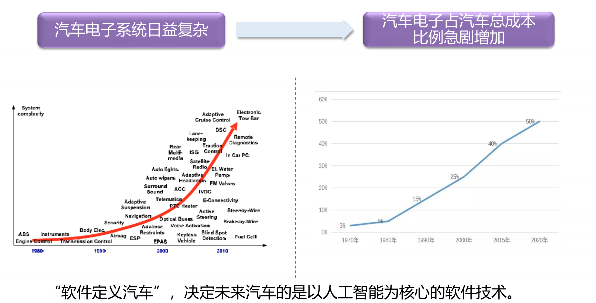
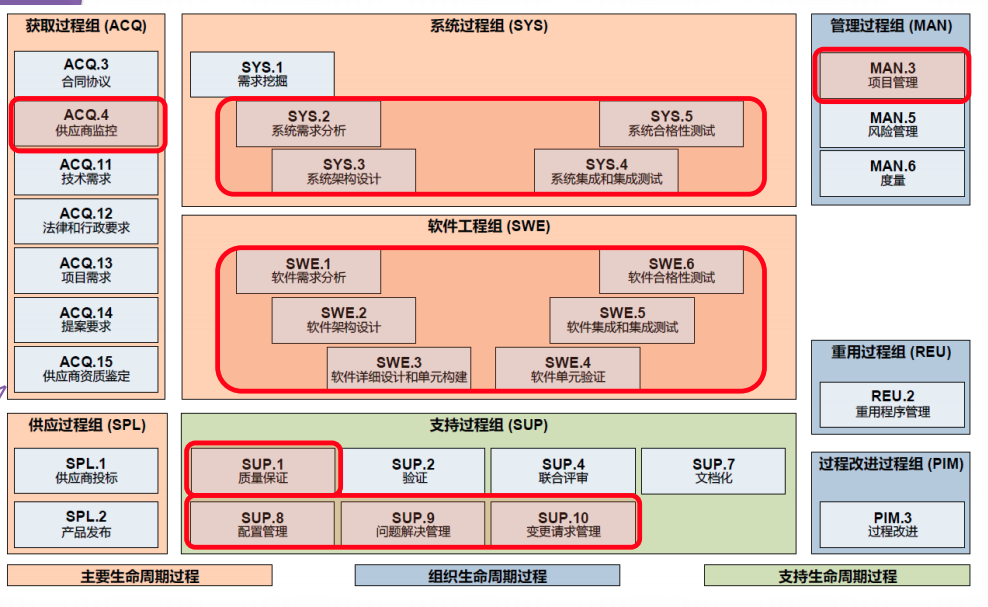
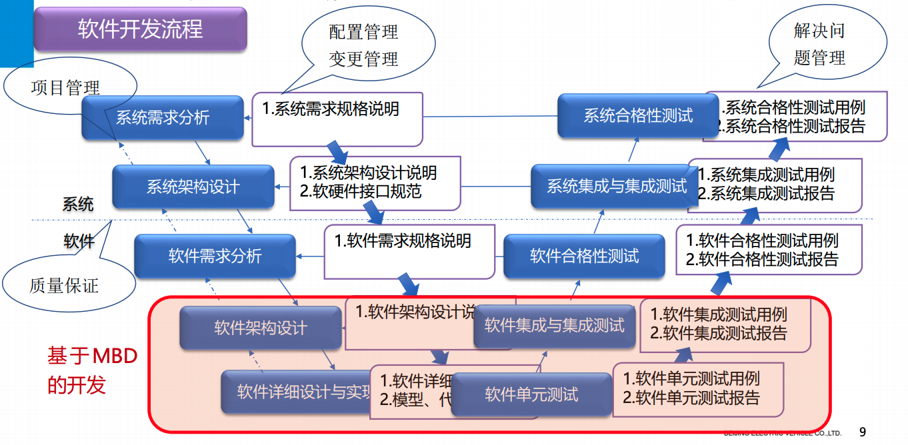
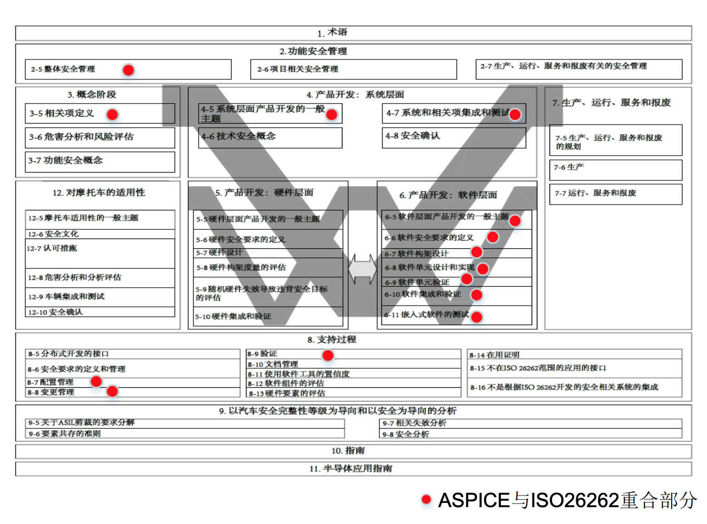
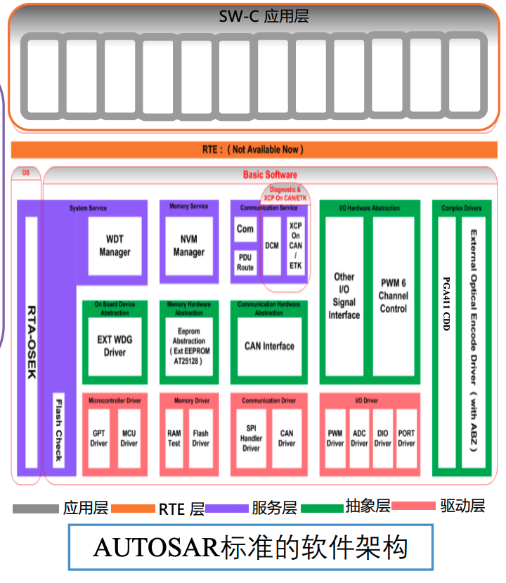

# ASPICE  标准的汽车软件开发过程

## ASPICE 

### 概要

涵盖了32个过程域：
- 管理
- 系统
- 软件
- 采购
- 重用
- 过程改进
- 支持活动

ASPICE等级：
- L5 创新级
- L4 可预测级
- L3 已建立级
- L2 已管理级
- L1 已执行级

### 与功能安全区别与联系
- 功能安全（ISO 26262）： 侧重安全，包括系统、硬件、软件、生产等，提出了怎么做
- ASPICE：侧重流程改进，包含系统及软件，但不包含硬件、生产等，提出了做什么？
- 相似点：ASIL等级的软件开发。

### 现状

- 国外：大众、宝马、奔驰、保时捷等均具备ASPICE认证，公司也有具备审核能力的组织，要求供应商页具备ASPICE L3认证证书或具备同等能力。
- 国内：北汽、上汽、吉利、长城已取得L2证书，其他厂已启动

## 满足ASPICE标准的MBD软件应用

### 软件需求
包括3部分：
- 功能需求
- 非功能需求
- 限制条件

常见问题：
- 非功能性需求不完整
- 非功能性需求及限制条件不完整
- 验证准则描述不清晰，无法与测试对应

解决办法：
- 非功能需求可以考虑性能需求、安全需求、质量需求
  - 响应时间、采样时间
  - 启动时间
  - 内存消耗
  - CPU负载
- 限制条件也需要可实现性、可验证性、正确性分析
- 验证准则包括
  - 验证方法
  - 验证环境
  - 先决条件
  - 特殊条件
  - 约束条件
  - 成功标准

### 软件架构设计

ASPICE对软件架构的要求：
- 识别软件元素
- 分配软件需求
- 定义软件元素接口
- 定义软件动态架构（任务、中断）及资源消耗目标
- 评估软件架构
  - 可维护性
  - 可扩展性
  - 可靠性
  - 安全性
  - 易用性
- 双向可追溯性和一致性
  - 与软件需求、详细设计、软件集成、测试之间的一致性和可追溯性

