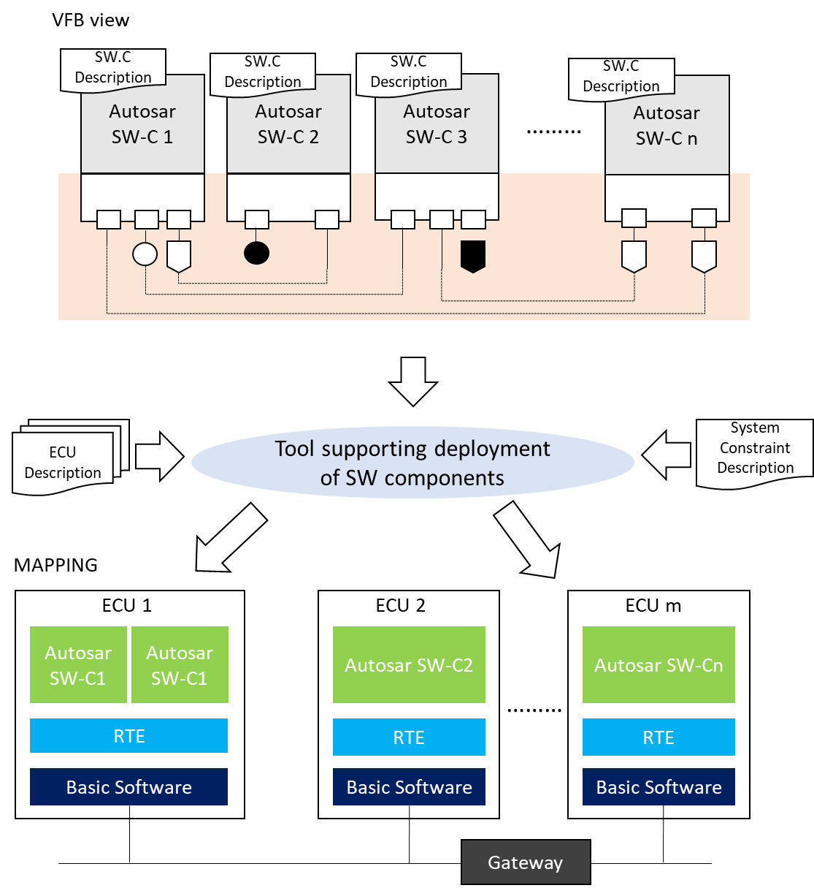
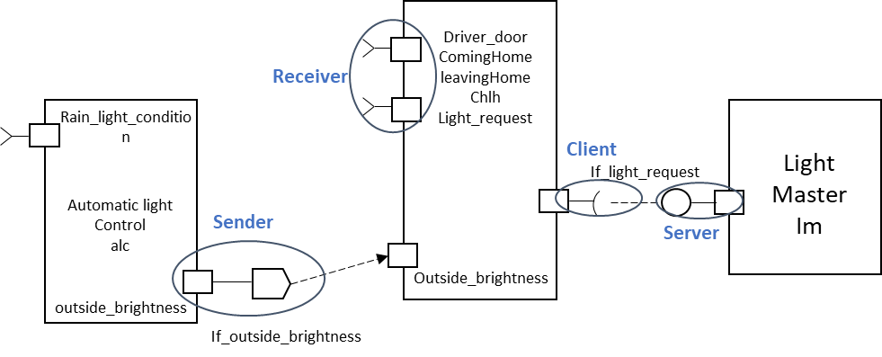

# AUTOSAR

AUTOSAR 旨在为汽车行业创建通用的标准化软件体系结构。

AUTOSAR （Automotive Open System Architecture）是一个由丰田、宝马、大众、福特、戴姆勒、通用、博世和 PSA 等汽车巨头在 2003 年成立的的联盟，Autosar 旨在为汽车 ECU 提供标准化的开放软件架构。

在缺乏通用标准的情况下，ECU 软件开发在不同的平台上进行。不同供应商使用不同的软件架构为 OEM 设计 ECU 软件。这种方式会导致OEM 想要切换到新的供应商，变得比较困难。新供应商过去在理解 ECU 软件开发中使用的现有软件架构、硬件平台和标准方面可能不适用于当前OEM。 

## 功能和意义

AUTOSAR的目标、主要挑战和解决方案以及这些解决方案所带来的好处。
- 处理与系统相关的快速增长的电气/电子复杂性；
- 产品修改、升级和更新的实施灵活性；
- 提高软件解决方案的可扩展性和交叉兼容性；
- 提高系统的软件质量和可靠性；
- 在早期开发阶段启用错误检测。

AUTOSAR 的应用范围专用于汽车 ECU，并具有以下特性：
- 与硬件（传感器和执行器）的强交互，
- 连接到车辆网络，如 CAN、LIN、FlexRay 或以太网，
- 计算能力和内存资源有限的微控制器。
- 时间关键的系统和实时程序从内部存储器执行。

意义：
- 使软件开发更加独立于硬件，具有移植性和灵活性。
- 实现软件模块间的标准接口，便于通信（使用虚拟功能总线VFB）和使用。
- 分解难度，分而治之。

## 概念

虚拟功能总线 VFB：

### 层次化架构

High-Level 抽象基于3层架构模型，提供了一种在ECUs间传递信息的机制。AUTOSAR 标准制定了使用组件来实现应用层。

- 应用层，是autosar顶层，由车辆应用关键的应用程序构成。
  - 典型的End to End 通信依赖于每个系统，autosar中，系统功能的实现由应用软件组件（SW-C）完成。
- RTE层 （runtime environment）,autosar 的中间层。
- BSW层 （basic software），autosar的底层

#### 应用层
应用层是 AUTOSAR 软件架构的最顶层，支持自定义功能实现。该层由特定的软件组件和许多应用程序组成，它们是一组相互连接的 AUTOSAR 软件组件，并按照指令执行特定任务。

每个 AUTOSAR 软件组件都封装了完整应用软件的部分功能。AUTOSAR 没有规定 AUTOSAR 软件组件有多大。根据应用程序的要求，AUTOSAR 软件组件可能是一个小型的、可重复使用的功能，例如车道保持辅助、雨刷控制、自动门解锁等。

软件组件之间的通信是通过使用虚拟功能总线的特定端口实现的。这些端口还可以实现软件组件和 AUTOSAR 基础软件 (BSW) 之间的通信。

应用层各模块间，有两种通信关系：
- 客户端-服务端通信：客户端可以通过支持操作的服务端发起操作的执行，服务端执行操作并立即将结果提供给客户端（同步操作调用）。

- 发送者-接收者通信：这是一种异步通信模式，其中发送者提供一个或多个接收者所需的数据。

#### 运行时环境 (RTE)
RTE 层为应用软件组件提供独立于 ECU 的接口，为应用软件组件(SWC)提供通信服务。

SWC 接口完全独立于 ECU。它使 AUTOSAR 软件组件独立于到特定 ECU 的映射。SWC 之间的通信主要通过两种端口进行。
- 客户端/服务端端口，其中服务端是服务的提供者，客户端是服务的用户。
- 发送方/接收方端口，发送方将信息发送到一个或多个接收方。

#### 基础软件 ( BSW ) 

BSW分为三层：
- 服务层
- ECU抽象层
- 微控制器抽象和复杂设备驱动程序 (CDD)。

服务层提供：
- 操作系统功能
- 车联网通讯及管理服务
- 内存服务（NVRAM 管理）
- 诊断服务（UDS、错误处理、内存）
- ECU状态管理、模式管理
- 逻辑和时间程序流监控（WdgM）

ECU抽象层：
- ECU 抽象层为微控制器抽象层 (MCAL) 的驱动程序接口抽象，如通信、内存或 I/O，它还包含 ECU 内外部设备的驱动程序，并为各种外围硬件提供抽象。

复杂设备驱动层：
- 复杂设备驱动程序 (CDD) 层从硬件层到 RTE。CDD 满足操作复杂传感器和执行器所需的特殊功能和时序要求。

微控制器抽象层（MCAL）
- 微控制器抽象层是基础软件的最底层，这意味着 MCAL 模块可以直接访问硬件资源。MCAL 包含内部驱动程序，这些驱动程序是直接访问 µC 和内部外围设备的软件模块。顾名思义，MCAL 层使上层独立于 HW（MCU）。

### Autosar com模块
com模块在通信堆栈中放置。
基本组成如下：
- service layer：
  - autosar com：位于RTE和PduR之间的服务层模块，主要用于与RTE之间的信号交互，对信号进行打包和解包。另外在该模块中还可以配置IPDU的通信周期、通信周期偏移量、IPDU Group等。
  - PDU Router：PduR的作用是为通信协议栈中的不同总线的IPDU提供路由路径。例如它将接收的IPDU路由至COM、Dcm等模块，或者将COM模块需要发送的IPDU路由至CanIf模块，最后传送至芯片的CAN Driver，将信号发送至总线。
  - Bus TP：Tp表示传输协议。该模块是特定于总线，其配置取决于基础总线协议，可以是CAN、LIN、CANFD等总线。该模块主要用于长报文的分段发送，以及对分段报文进行重组。
  - Bus State Manager：总线状态管理模块负责相应总线状态机的管理和总线故障的处理。它可以基于CAN总线的CanSM，或者是基于LIN总线的LinSM等。
  - Generic NM：它是ECU抽象层的一部分。它可以是用于CAN收发器的CanTrcv，用于以太网收发器的EthTrcv，用于Flexray收发器的FrTrcv等。此模块用于对收发器进行初始化配置，它提供独立于控制器硬件的用于启动传输的服务和用于通知接收事件的回调函数。
  - Bus NM：
- ECU Abs Layer
  - Bus Interface
  - Bus Trcv Drv
  - Ext Bus Driver Asic

- MCAL Layer
  - I/O Driver：DIO Driver
  - Comm Driver：
    - SPI handler Driver
    - Bus Driver：该模块是AUTOSAR MCAL层的一部分（例如：CanDrv，LinDrv，FrDrv），它实际上与ECU的底层硬件进行交互，并为其上层提供独立于硬件的接口。此模块取决于硬件，并且驱动程序代码可能会根据基础硬件而有所不同。BusIf是唯一可以访问此总线驱动程序的模块。

### 接口
为了与硬件、软件、外设、人进行通信，AUTOSAR 由一组抽象接口，由RTE提供并生成面向SWCs和ECU固件的接口。

三种类型的接口：
- AUTOSAR 接口：与RTE一起生成，切是一种面向应用的，能够实现应用层数据交换
- 标准化Autosar 接口：由BSW模块提供，存在于ECU管理器和诊断事件管理器中，用于SWCs访问AUTOSAR 服务。
- 标准化接口：由AUTOSAR 标准提供，作为c语言编写的API存在，提供了RTE与OS、RTE于COM-BSW的选项。

### 安全概念
- 通信栈
在BSW中通信协议栈负责提供BSW通信服务、Crypto加密栈负责加密通信，提供密码学工具确保基于认证的认证和消息完整性。

- 加密栈

- 安全扩展

###  多核MCU的分层软件架构

autosar 4.0 引入了多核嵌入式RTOS的支持，引入了多核启动关闭、核间通信（IoC）等新概念。

## 功能安全

系统的安全性取决于特定功能的预期操作。功能安全标准 ISO26262 源自 IEC-61508，指导我们采用基于汽车特定风险的方法来开发电气和电子 (E/E) 系统。功能安全的目标是正确执行预期操作，否则系统将发生故障并转移到可预测的安全状态。软件是影响系统级复杂性的参数之一。可以使用软件开发的新技术和概念来最小化复杂性，从而有助于实现功能安全。AUTOSAR R4.0 考虑了对现代汽车软件开发很重要的功能安全方面。

Autosar下有很多开发方法来检测和报告软件开发每个阶段的功能错误。即使功能安全在整个产品开发的每个阶段都适用并遵循，直到涉及到用户。

以下是导致 E2E 保护检测到的错误的典型干扰源列表：

SW相关来源：
- S1.大多数生成的 RTE 中的错误；
- S2.部分生成和部分手动编码的 COM 中的错误
- S3.网络堆栈错误
- S4.生成的 IOC 或 OS 出错

硬件相关资源：
- H1.硬件网络故障
- H2.网络电磁干扰
- H3.上下文切换期间或内核之间通信时的微控制器故障

开发 SWC 接口时采用的一个实用方法示例是为数据正确性提供端到端保护。

对于每个传输安全相关数据的 RTE Write 或 Read 函数（如 Rte_Write_
_<o>()），都有对应的 E2E 保护封装函数。
- 封装函数调用 AUTOSAR E2E 库。
- 包装函数是软件组件的一部分，最好是生成的。
- 封装函数与相应的 RTE 函数具有相同的签名，只是代替Rte_ 的是E2EPW_。
- E2EPW_ 函数由 SW-C 的应用逻辑调用，封装函数执行保护/检查并在内部调用 RTE 函数。
- 对于 ECU 间通信，通过 E2E 保护发送的数据元素是按字节数组。字节数组被复制到 COM I-PDU 而不做任何更改。