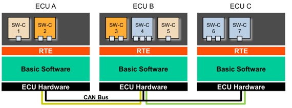

# Autosar E2E 

E2E 全称 End to End，代表 AUTOSAR 的数据保护机制。

End 指的是 Autosar 架构中最上层包含的Software componet 即 SW-C的应用层，类似各种APP，即这里的端指的是服务、进程、软件。

E2E 通信是从一个SWC，经过RTE、BSW（basic software）、物理总线（如CAN），到另一个SWC。传输过程中，可能会遇到一些故障，使得通信无法到达目的终端，或者信号本身被干扰损坏，特别是对safety相关的一些信号：车速、档位、电源模式等，因为信号不能到达而形成功能安全隐患。

## E2E 的适用范围

E2E协议可以适用于各种总线，例如CAN、CAN FD、LIN、Flexray等，以太网应该也可以，例如使用基于SOA的C/S通信模式+序列号变化、超时检测等问题。

E2E是与安全PDU，或称SecOC相配合的autosar 安全机制。
- SecOC用于保护PDU，E2E用于保护SW-C通信/信号；
- SecOC层次为PDU 路由；E2E 位于 SW-C
- 校验方式上，E2E采用CRC，SecOC采用自定义（例如加密）方式。

## E2E 机制

autosar RTE间传递的数据元素由两部分呢构成：APP数据元素+E2E header。

在 E2E profile1 中，发送到RTE的数据包括3个部分：
- 4 bit counter，每发送一次就增加一个计数
- 1 byte CRC，按照E2E profile 1 的计算方式得到，计算因子包括：Data ID、Counter、应用数据。
- 被保护的应用数据

说明：
- DATAID是一个预先定义的密钥，不会发到总线上。

E2E完整过程：
- SW-C生成原数据
- 将Counter和原数据组成待校验数据
- 使用Data ID进行CRC的校验
- 将原数据、Counter和CRC值发送给RTE
- 经过诸如总线通信等路径，原数据、Counter和CRC传递到目标RTE
- 将接收的数据拆包，校验Counter和CRC
- 目标SW-C接收到原数据
- 接收方处理
  - 计数丢失处理
  - 计数无效处理
  - 计数重复处理
  - 超时处理

## E2E 测试

对于网络中的ECU而言，E2E测试包含：
- E2E发送测试
- E2E接收测试。

典型的E2E发送测试是将ECU发送的包含E2E信息的数据源按照 E2E Profile 1的方式，计算一个CRC，如果与原始发送的CRC相等则验证通过，反之亦然。

E2E接收测试包括正向和逆向测试，

- 逆向测试主要是验证ECU在接收到错误的E2E时的行为
  - 丢弃该数据信息
  - 记录E2E错误DTC等
- 再次接收到正确E2E时的行为测试，此类测试需软件层面的支持，比如定义相关的DTC方可实现黑盒测试，或提供相关的内部数据的访问接口和方法，或与功能测试相结合，总之依赖特定的条件。

### 数据库兼容性

E2E属性信息是在ARXML中定义的，为了实现测试环境的仿真，可能需加载DBC、LDF、FIBEX等不同格式通信数据库。此时，不同数据库之间信号名称的一致性问题就突显出来。为此，开发了“位流”的解析方案，解决了数据库的兼容问题。

技术难点已被攻克，自动化测试不再是难事。我们基于Vector 的CANoe软件，开发了一套自动化在线测试脚本，已经支持了CAN、LIN、CAN FD、FlexRay总线E2E测试。

自动化在线测试有很多优点，比如可以实时监控ECU报文发送状态，可以模拟故障注入等场景.

但是，在线测试也有无法解决的场景：
- 并行分析，发现潜在的或偶发的问题
- 针对OEM而言，ECU尚未交样的情况提前验证，或同时交样时多样件同时测试时的资源占用问题

针对以上问题，我们专门开发了一套完整的离线测试软件工具链，通过ECU通信的log数据或者实车GL记录仪存储的log数据，就可以完成E2E离线测试，过程如下。

下图显示了e2e离线测试的流程：

1.E2E测试对象的提取

通过ARXML文件解析软件，提取出E2E测试对象，作为E2E测试的输入文件。

2.Log文件解析和通道映射

该离线工具支持CAN、CAN FD、LIN、FlexRay等报文的解析，可实现对BLF文件的解析，同时支持多总线多ECU同时测试，根据实车记录的数据，在软件中进行通道和总线的映射，实现一次性测试。

3.测试执行

导入E2E测试对象文件、通道映射文件和实车BLF log文件，执行测试。该离线软件支持高并发处理，1GB的log数据可在几分钟内完成测试

4.测试结果分析

从测试执行结果分析，该ECU有两个E2E计算错误，经分析为DATA ID配置错误；1个E2E对应的报文未发送，定位为Com层问题；1个E2E对应的信号组的Update Bit始终未置1，与功能触发有关引起。

## reference

- AUTOSAR_SWS_E2ELibrary
- AUTOSAR_SWS_SecureOnboardCommunication
- 北汇信息-蒋露、张恒