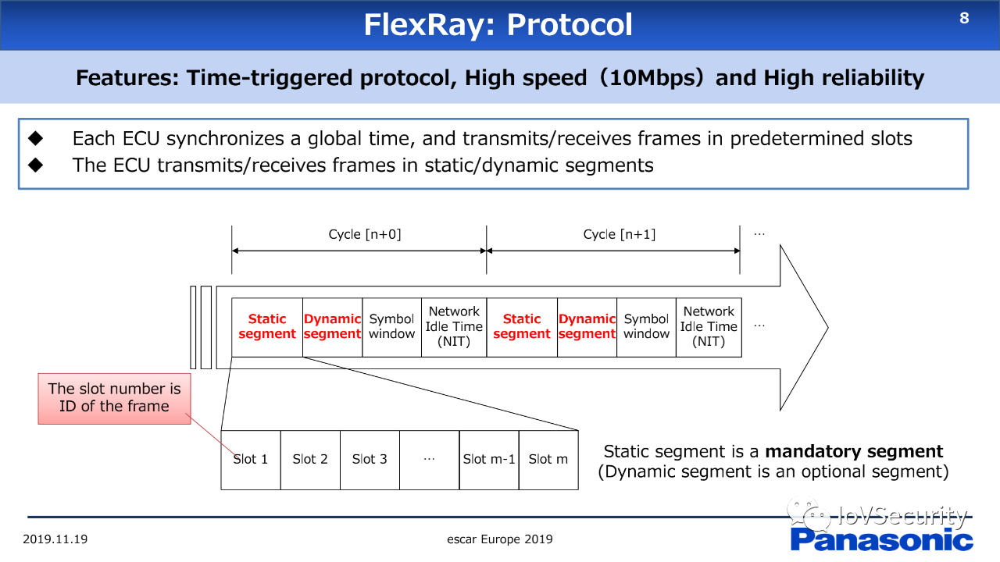

# FlexRay Attack

## Basic
Features:
- Time triggered protocol 
- High Speed (10 Mbps)
- High reliability

### 协议

- Flexray相关ECU会同步一个全局时间，在预定义的slots进行发送和接收帧。
- Flexray在static/dynamic 段实现ECU 收/发帧。

从上图可知，FlexRay的帧结构为：
- 同步 + Cycle 【n+0】+ Cycle 【n+1】
- Cycle 【n+0】：
  - Static Segment + Dynamic Segment + Symbol window + Network Idle Time（NIT）
    - Static Segment：Slot 1 + Slot 2 + Slot 3 + ... + Slot m-1 + Slot m
    - Slot 号是帧的ID。
    - Static 段是必要的段，动态段是可选的段。
- Cycle 【n+1】
  - Static Segment + Dynamic Segment + Symbol window + Network Idle Time（NIT）

FlexRay 可以支持高灵活性的网络设计：
- 协议方面：支持总线、星型、混合等拓扑。
- 错误控制：错误控制未指定，各应用自行负责。主要的错误定义包括：SyntaxError，ContentError，BoundaryViolation，TxConflict。
- 物理层：通过两路电压差分线实现信号传输。

### FlexRay 漏洞

目前看，FlexRay协议的漏洞是不清楚的。国际上有少量的研究，但实验验证是不充分的，不足以评估Flexray的具体漏洞。

下图所示的研究，左图研究尝试进行中间人攻击，但未实现；右图尝试进行DoS攻击，发现静态段不能被篡改欺骗。

## Spoofing 攻击

在星型和总线两类拓扑网络上，可以验证欺骗攻击。

基本场景定义：
- 发送方（一般的ECU和攻击者所使用的ECU）使用同样的ID，进行 static/dynamic 帧进行发送；
- 接收方ECU接收到这个两个帧。

攻击结果：
- static frame 欺骗不能在BUS拓扑上实现，因为两个ECU发送ID相同的帧产生了冲突。但是可以在星型网络上实现，原因是星型网络的路由机制。星型网络下的车辆功能可能被控制。
- 接收方ECU不接收非法的、欺骗的 static 帧。
- 接收方ECU 仅在合法帧不发送时才接收欺骗帧。

- 发生冲突时，在接收ECU上会发生 SyntaxError ，而在发送ECU上会发生 TxConflict 错误。

## 错误检测和发送者通知

FlexRay的错误控制时抑郁实现且精确的。

- 当欺骗攻击发生时，错误检测由发送方ECU执行。
- 当欺骗攻击发生时，由发送方ECU发出通知，告知产生错误的接收方ECUs。通知在帧的动态部分。

