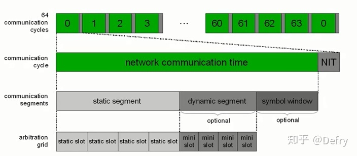

# FlexRay 
## Flexy 概要

在flexray 出现之前，基于时间触发协议（TTP/C）的分布式容错架构用于解决CAN总线的一些问题，例如没有时间触发特性。

### Flexray联盟
核心成员：BMW、DC、GM、Bosch、Motorola、Philips等。
高级成员：大陆、德尔福、日本电装、菲亚特、本田、福特...
### 发展历史
1995年BMW和Bosch开始探索线控
1998年比较研究Byteflight/can/ttcan/ttp/c与芯片商第一次接触
2000年flexray联盟成立
2002.4摸你黑向公众展示flexray
2002～2003年NXP推出由fpga和线路驱动器形成的首个集成电路样品
2004.6 公布flexray2.0扩展协议范围
2005.5 公布名flexray2.1的扩展协议规范

2006.9第一款flexray单元车型上市，通信速率10Mbps
2007定义了autosar层
2008年奥迪生产了第二款带flexray的车型。所有大型芯片公司开始提供组件。
2010年flexray联盟解散
2020年flexray设备出现在更多汽车、自动驾驶系统中。

### 协议

http://www.flexray.com/ 联盟官网发布了flexray 2.1版和2.0版。已公布的3.0不会出现网上，但可购买。

### 主要特点

- 通信带宽：不受协议机制限制，可以在单通道上支持2.5、5、10Mbps的通信。采用双通道冗余系统时，最高可达 2*10Mbps
- 时间确定性：采用建立在通信循环基础上的时分多路数据传输形式，周期性数据在通信循环中拥有固定的位置，确保了报文到达的时效性。
- 分布式时钟同步：使用基于同步时基的访问方法，同步时基通过协议自动建立，精度可达1微秒
- 容错数据传输：flexray通过专用的确定性故障容错协议支持多个级别的容错，其中包括通过单通道或双通道模式，提供传输所需的冗余和可扩展的容错机制，确保数据传输可靠性。
- 灵活性：支持总线型、星型、级联星型和混合型等多种拓扑结构，支持时间触发和事件触发两种方式，支持报文冗余和非冗余方式传输，且提供大量配置参数可调。

FalexRay是一种时间触发式的总线系统，符合TDMA(Time Division Multiple Access)的原则，因此在时间控制区域内，时隙会分配给确定的消息，即会将规定好的时间段分配给特定的消息，时隙是经固定周期重复，也就是说信息在总线上的时间可以被预测出来，因此保证了其确定性。这就意味着控制信号是根据预定义的时间进度传输的，无论系统外部发生什么情况，都不会产生计划外事件。在确定性算法中，始终会预先定义正确的输出结果，这些结果是基于特定输入的。

### 工作原理

flexray的通信层次和整体形式：结构上看，FlexRay采用了俄罗斯套娃式的并行双交叉层次结构。

功能的俄罗斯套娃形式：涉及通信循环（cycle）、通信段（segment）、时隙（slot）、通信帧（frame）、字节（byte）和位（bit）等术语。

时间的俄罗斯套娃形式：涉及全局时间（global time）、宏节拍（macrotick）、微节拍（microtick）和本地时钟（clock）等术语。

全局时间=网络时间，本地时间=本地节点时间。

Flexray通信的时间层次：通过时间分层的方法来定义通信循环。通信循环分为三层：
- 通信循环层：包含静态段、动态段、符号窗口和网络空闲时间。这些段都由众多宏节拍组成。
- 宏节拍层
- 微节拍层

flexray的通信循环通常分为4个时间段：
- 静态段（ST）：专门针对确定性实时应用，具有已知和确定的带款。
- 动态段（DYN）：可选项，专门针对时间触发应用，具有可变带宽。
- 符号窗（SW）：可选项，用于发送专用通信符号，专门针对采用了总线监控器（BG）的应用，如使用了双传输通道的应用。
- 网络空闲时间（NIT）：循环结束段。在这时间段，网络处于空闲模式（时间同步）。

根据规则，flexray通信循环的可能组合包括4种：
- 纯静态：ST+NIT
- 混合：ST+DYN+NIT
- 带符号窗口的纯静态：ST+SW+NIT
- 带符号窗口的混合：ST+DYN+SW+NIT

Flexray通信循环的持续时间：
- 为了满足应用的实时和快速运行需求，**Flexray 通信循环的持续时间必须是介于 10微秒～16毫秒之间的固定时间值。** 
- 利用某些技巧，也可以明显缩短最小循环时间（通过重复某些时隙）或延长最大循环时间（通过执行循环时间复用）。例如 BMW X5的实际使用。

- 值得注意的是，在初始化或唤醒阶段，通信循环及其排序有网络上的主要管理节点进行初始化。

##### 静态段工作原理
ST由多个slot组成。
- 时隙个数：用参数 gNumberOfStaticSlots 表示
- 时隙长度：gdStaticSlot个宏节拍（MT）

一旦确定后，个数和长度都是固定不变的。

静态段使用时分多路（TDMA）方式控制通信网络，即每条报文被框在一个固定的时间窗（存在上下限）

节点在每个通道（A或B）上都有一个时隙计数器（slot counter），对应状态变量 vSlotCounter 。 每个时隙计数器在循环开始时的初始值均为1，并在时隙结束时递增。**当时隙数和报文（帧）号，即帧ID相等时，报文将被传输。**

##### 动态段

由大量的微时隙组成。
- 微时隙个数由参数 gNumberOfMinislots 表示
- 微时隙长度由 gdMinislot 个宏节拍去定
- 动态时隙包含一个或若干个微时隙（与动态时隙发送的flexray帧长度有关）

动态段采用柔行时分多路访问FTDMA方式控制通信网络系统。

当一个微时隙没有被用到时，时隙数将加1，这个时隙被标记为未用时隙。当时隙数和报文（帧）号（帧ID）相等时，报文将被传输，且覆盖一定数量的微时隙。传输完成后出现下一个未用微时隙时，时隙数又加1.这使得动态段里的空间能够得到较好的利用。具有较大的帧ID的报文必须等待较长的时间才能传输。

##### 符号窗

通信循环中的符号窗（Symbol window)是个可选字段，他是

#### 数据传输
FlexRay规范定义了OSI参考模型中的物理层和数据链路层，每个FlexRay节点通过一个FlexRay Controller和两个FlexRay Transceivers（用于通道冗余）与总线相连，FlexRay Controller负责Flexray协议中的数据链路层，FlexRay Transceivers则负责总线物理信号接收发送。

## FlexRay 漏洞

目前看，FlexRay协议的漏洞是不清楚的。国际上有少量的研究，但实验验证是不充分的，不足以评估Flexray的具体漏洞。

下图所示的研究，左图研究尝试进行中间人攻击，但未实现；右图尝试进行DoS攻击，发现静态段不能被篡改欺骗。

## Spoofing 攻击

在星型和总线两类拓扑网络上，可以验证欺骗攻击。

基本场景定义：
- 发送方（一般的ECU和攻击者所使用的ECU）使用同样的ID，进行 static/dynamic 帧进行发送；
- 接收方ECU接收到这个两个帧。

攻击结果：
- static frame 欺骗不能在BUS拓扑上实现，因为两个ECU发送ID相同的帧产生了冲突。但是可以在星型网络上实现，原因是星型网络的路由机制。星型网络下的车辆功能可能被控制。
- 接收方ECU不接收非法的、欺骗的 static 帧。
- 接收方ECU 仅在合法帧不发送时才接收欺骗帧。

- 发生冲突时，在接收ECU上会发生 SyntaxError ，而在发送ECU上会发生 TxConflict 错误。

## 错误检测和发送者通知

FlexRay的错误控制时抑郁实现且精确的。

- 当欺骗攻击发生时，错误检测由发送方ECU执行。
- 当欺骗攻击发生时，由发送方ECU发出通知，告知产生错误的接收方ECUs。通知在帧的动态部分。

