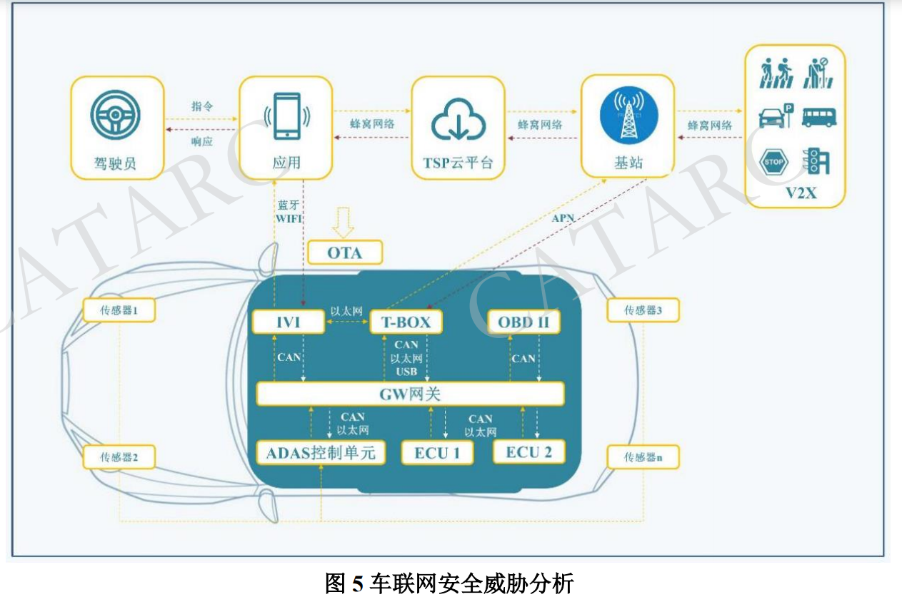
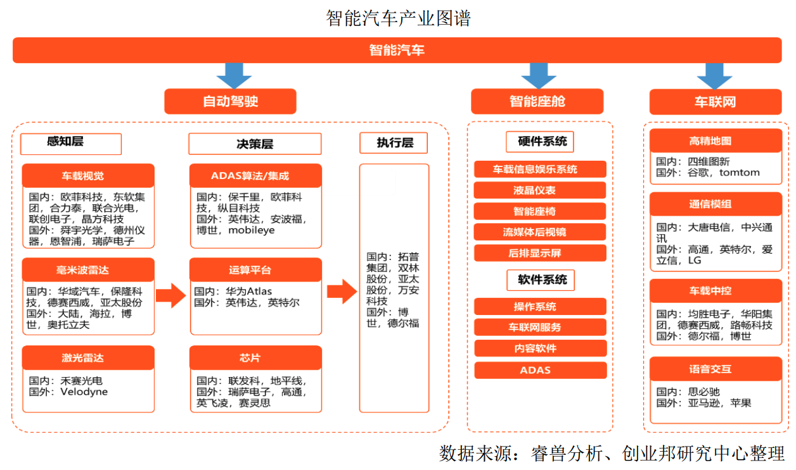
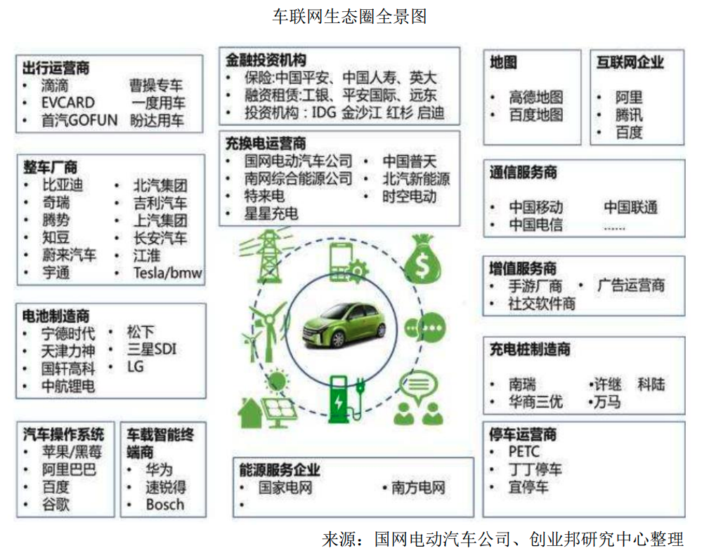
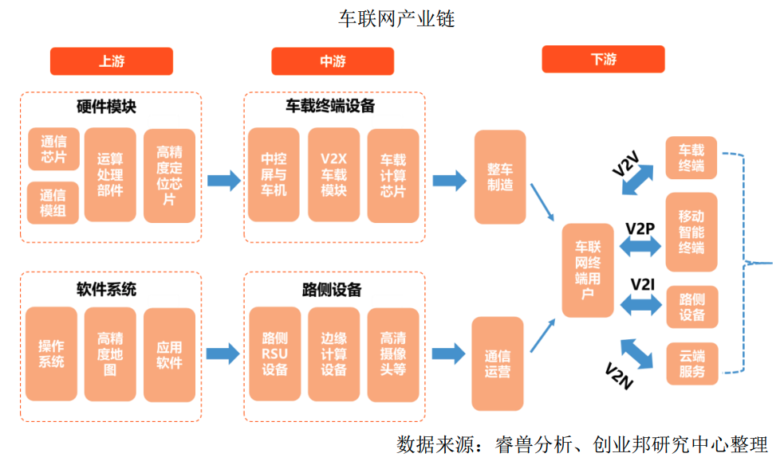
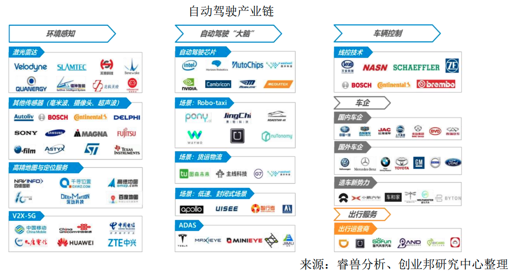
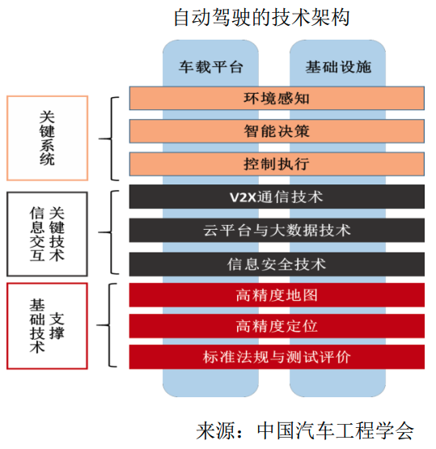
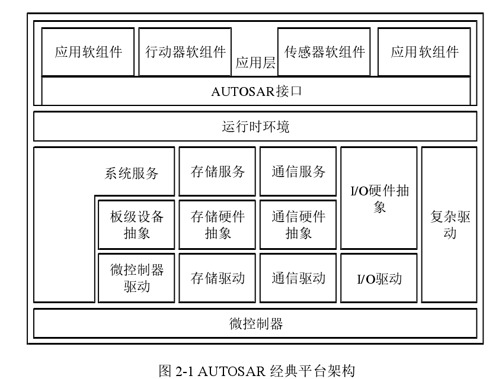
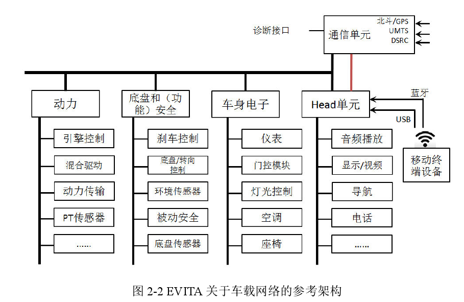
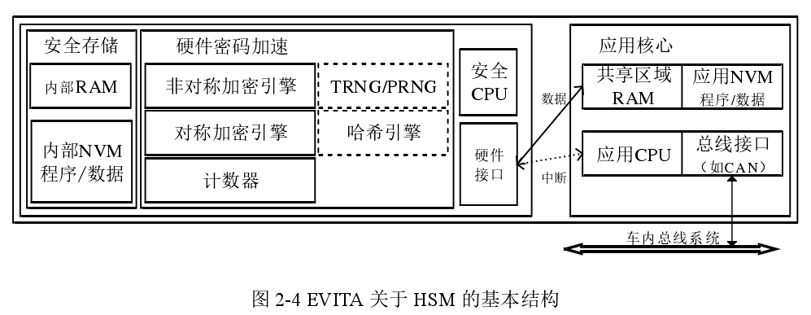

# ICV概述

智能汽车是指通过搭载先进传感器等装置，运用人工智能等新技术，具有自动驾驶功能，逐步成为智能移动空间和应用终端的新一代汽车。智能汽车车端威胁模型如图 5 所示。

主要涉及下列组件的安全风险:
- 车载网关
- 远程信息处理器（Telematics BOX，T-BOX）
- 车载信息娱乐系统（In-Vehicle Infotainment，IVI）
- 各电子控制单元（Electronic Control Unit，ECU）
- 车载诊断接口（On-Board Diagnostic，OBD）
- 传感器
- 空中下载（Over-The-Air，OTA）
- 车载操作系统（OS）
- 车内网络。

## 基本概念

智能汽车三大要素：
- 智能驾驶：车辆控制及驾驶功能
  - 辅助驾驶
  - 智能安全
  - 车辆智能驾驶
  - 智能地图
- 智能交互：需求输入或主动识别需求
  - 语言交互
  - 手势/面部识别及生物体征监测
- 智能服务：与人、生活相关密切的服务
  - 后市场服务
  - 出行服务
  - 社交娱乐及生活服务

## 产业特点
来源：2020中国智能汽车产业研究报告

ICV 产业链长、涉及面广等特点，涉及：
- 上游
  - 感知系统
  - 决策系统
  - 执行系统
  - 通信系统
- 中游
  - 智能座舱
  - 自动驾驶解决方案
  - 智能汽车整车
- 下游
  - 出行服务
  - 物流服务
  - 数据增值

在ICV的全景生态图中，车辆是载体、智能化是目的、网联化是主要手段。传统车企、互联网巨头、零部件厂商、通信业巨头构建了“四轮驱动”模式。

车联网是汽车智能化和网联化的关键一步。车联网是信息与数据时代对汽车产业链的延伸，是从制造到服务的价值重心转移。使汽车由交通工具变为个人/家庭/小组的终端，将汽车行业从制造延伸到服务。

几个值得关注的车联网新企业：
- 希迪智架：智能网联车载前装产品
- 星云互联：智能网联汽车技术研发上
- 梧桐车联：车联网整体解决方案
- 飞驰镁物：智能车联系统供应
- 优必爱：车联网大数据服务
- 蘑菇智行：车联网整体解决方案

几个值得关注的智能座舱新企业：
- 芯驰科技：汽车智能芯片研发
- 智眸科技：智能双目相机软硬件一体提供商
- 宏景智架：车载后视镜研发商
- 明珞装备：车身电子系统开发生
- 精虹科技：车辆主动安全设备研发
- 联车科技：疲劳驾驶预警系统研发
- 镁佳科技：汽车智能化和联网化零部件供应商。
  - Smart Mega OS+，提供数字座舱、多个域控制器、T-Box、网关

几个值得关注的自动驾驶新企业：
- 四维智联：自动驾驶汽车智能网联系统开发商
- 楚航科技：辅助驾驶系统研发商。
- 智加科技：自动驾驶解决方案服务商
- 清研微视：汽车辅助驾驶系统开发商
- 纵目科技：自动驾驶技术研发商
- 开易科技：高级驾驶辅助系统研发商

几个值得关注的ADAS领域新企业：
- 径卫视觉：驾驶安全监控系统
- 前向启创：高级驾驶辅助系统技术研发
- 极目智能：智能驾驶方案，复杂环境的智能感知。
- 智华汽车：智能识别处理技术提供商

## 相关架构
过去的传统汽车行业通常处于相对独立的运作模式，在与外界很少需要进行交互的情况下，一般汽车厂商其内部标准已经能够通过自身较完整的服务框架体系解决绝大部分的安全问题。但是随着现代汽车电气化智能化的趋势不可阻挡，车与路、车与车等交互的 V2X 应用场景将会频繁出现，并且需要考虑将其融入智慧城市或者智慧交通这一概念体系中去，因此急需要合理统一的汽车电子网络安全技术及其标准的出现。但考虑到汽车电子领域的特殊性，能够直接从传统信息安全领域中借鉴的基础共性技术相对较少，需要针对性更强的安全需求分析方法、概念模型和参考架构等内容。

### 计算平台
工信部希望在2020年“建立可靠、安全、实时性强的智能网联汽车智能化平台，形成平台相关标准，支撑高度自动驾驶（HA级）”。以智能计算芯片为核心的计算平台体系架构，是实现ICV环境感知、计算处理、驾驶决策、车载通信的硬件基础条件。

ICV计算平台包括：
- 硬件
  - 计算处理单元：传统CPU不能支撑，现在多为CPUs+协处理器s的异构架构，CPU负责主控和顺序计算，协处理器负责运算密集部分的加速处理。
    - 按处理单元的类型划分，处理平台可分为GPU、FPGA/ASIC、DSP三类。
  - 存储管理单元
  - 接口通信单元
  - V2X通信单元
- 软件
  - 动态运行环境
  - 硬件驱动
  - 编译工具链
  - 开发支持库
  - 操作系统
  - 数据库
  - 应用软件
- 算法
    - 深度卷积神经网络的图像识别，每秒数十亿次计算（GOPs）
    - 感知算力需要万亿次每秒

ICV计算平台特点：
- 多元传感器输入
- 大量传感数据并行
  - 摄像头 100MB/s
  - 激光雷达 5MB/s
  - 毫米波雷达 40kb/s
  - 超声波雷达 12B/s
- 实时处理
- 实时动态决策
- 处理能力要求高
- 功耗需要控制在较低水平

特斯拉autopilot2.0为例，传感系统包括8个摄像头，12个超声波雷达，1个毫米波雷达。

北极狐s：3个华为激光雷达，5G信道

### 汽车软件平台标准

目前在汽车电子行业化的主流软件平台标准首推 AUTOSAR（AUTomotive Open System ARchitecture，汽车开放式系统架构），AUTOSAR 是在当前汽车电子系统复杂程度和 ECU 软件数量爆炸增长、传统嵌入式系统的软件模块化有限以及不支持硬件抽象、存在各式各样的硬件开发平台的背景下提出的，目的在于构建一套属于汽车电气/电子架构行业的开放标准，目前已成为 ECU 在基础软件开发方面的事实架构标准，被国内外企业广泛采用。

AUTOSAR 的经典平台（classic platform）将汽车软硬件架构主要分为三个层次：应用（Application）、运行时环境（Runtime Environment）和基础软件（Basic
Software） [14]。如图2-3所示，其在服务层面主要分为系统、通信和存储服务，并且将基础软件也分为三个层次包括前面的服务层次以及 ECU 抽象层次和微控制器
抽象层次，同时包含一个复杂驱动（Complex Drivers）。并且应用层软件基本上与硬件相独立，这是建立在模块化、可转换、可扩展和可重用的平台设计目标基础
上。作为国内多数自主汽车嵌入式软件平台相当重要的参考之一，AUTOSAR 基础软件平台标准客观上也促进和引领了自主汽车嵌入式软件的标准化和平台化。

### 车载网络参考架构
EVITA（E-safety Vehicle Intrusion Protected Applications，电子安全车辆入侵防护应用），旨在于为智能网联汽车的车载网络的体系结构进行设计和验证操作过程并形成原型，通过研究智能网联汽车在 V2X 应用场景下的通信安全，来避免相关安全组件被的被篡改风险，并防止用户的敏感数据遭受外部攻击。

EVITA 关于车载网络的参考架构如图2-2所示，汽车内部各类电子元器件包括ECU 计算单元、传感器和控制器等以及其他各类机械传动模块通过车身总线系统连接，各类总成设备所采用的总线协议依据各自资源条件确定而不尽相同，最后通过其各部分域控制器连接至中央通信网关设备，并对外提供诊断服务接口。

### 车载网络协议

随着电子控制系统的复杂性增加以及对电子控制单元的内部控制功能之间的通信能力的要求不断提高，点对点链接的使用将极大程度地增加汽车中的电气线束数量。并且给汽车从设计到制造的工作带来了很大麻烦是需要从汽车内部通信的安全性、可靠性和重要性等各方面进行综合考量。因此，为了减少汽车内部布线复杂程度以实现方便的数据共享和快速交换，同时提高系统可靠性等方面，在快速发展的计算机网络上实现了基本的汽车电子网络系统即车载网络 [15–18]，主流的车载网络协议主要有 CAN、LAN、LIN、MOST 等，典型的智能汽车网络架构如图2-3所示。

CAN（Controller Area Network）, 是由博世公司最初定义的支持实时和分布式通讯的串行总线协议，旨在解决汽车电子系统中多个 ECU 之间的数据传输问题。在 CAN 总线中各个通信设备节点以线性拓扑结构连接，理论上可进行连接的节点数量是没有限制的，其通信物理介质可采用双绞线或同轴电缆。在 CAN 总线协议中，由于所有通信节点通过 CAN 数据包的 ID 而无所谓 IP 概念进行判断是否需要接收并进行处理，即是通过广播形式进行消息发送。CAN 消息的报文帧类型分为多种包括数据帧、遥控帧、错误帧和过载帧等，其帧各字段及其具体含义如表2-1所示。

CAN 总线协议字段描述

|CAN字段域|含义|长度|
|-|-|-|
|帧起始|表示数据帧或远程帧的起始地址|1位|
|仲裁域|ID,RTR字段，决定数据帧优先权|12位|
|控制段|包含数据长度字段，显示数据段长度|6位|
|数据段|CAN总线传输的数据|0到64位|
|CRC段|对CAN总线数据包进行CRC校验|16位|
|ACK段|对CRC校验合法的CAN数据帧应答|2位|
|帧结束|这个字段标识数据帧或远程帧结束|7位|

而 LIN（Local Interconnect Network）是一种基于 UART/SCI 的低成本开放式串行通信总线协议，其设计之初的目标便是属于 CAN 的辅助网络，其主要用于
车内分布式电控系统，即车身电子控制中各模块节点间的低成本通信层次，因此无需使用 CAN 网络。LIN 的节点间连接方式采用星型拓扑及单线形式，同时通过
CAN 网关和其他 ECU 交互数据。综上所述，LIN 能够补充汽车内部多重网络分级架构，满足汽车电子系统中对于爆发增长的控制单元的可实现性和可维护性，使
汽车制造厂商在提升汽车性能的同时更好地控制成本。

MOST（Media Oriented Systems Transport）是一种主要面向于汽车多媒体应用的网络总线协议，即汽车的信息娱乐管理系统，用于管理所有车载多媒体设备，
并且具有同时播放 15 个不同的音频流的能力，这是由于其以单根光纤为载体能够提供高达最大 25Mbps 的集合带宽，远高于传统车载总线协议 CAN。不同的是，
MOST 通常采用环形拓扑，这种结构好处在于能够对于不同目标的多个数据流进行准确有效的处理而不发生错误 [19]。

继 CAN 和 LIN 之后的新一代车载网络总线协议 FlexRay，能够在新一代车内控制系统中提供 CAN 所不具备的速度和可靠性，结合事件触发和时间触发两种方
式，因此常用于汽车的核心通信网络。速度方面其单通道传输带宽最大 10Mbps，而双通道最大可达 20Mbps，即 CAN 的 20 倍之多。可靠性方面其具备冗余通信能
力，能够采用硬件的方式进行网络配置的完全复制，保证在少数通信节点失效的情况下仍能够保持整体通信的正常。同时 FlexRay 能够提供简单而灵活的结构配置方式，支持星型、总线和混合等多种拓扑结构。

---

## 车端组件

### 车载网关
车载网关为各网段 ECU 提供报文路由转发服务，与车内所有 ECU 均有数据交互，有些网关还承担 OTA 升级的主刷控制器功能，车载网关通过不同网络间的物理隔离和不同通信协议间的转换，在各个共享通信数据的功能域，如动力总成域、底盘和安全域、车身控制域、信息娱乐域、远程信息处理域、高级驾驶辅助系统（Advanced Driving Assistance System， ADAS）域之间进行信息交互。汽车网关是整车电子电器架构那个的核心部件，可通过控制器局域网络（Controller Area Network， CAN）协议与车内其它 ECU 进行交互，是车内网络的数据交互枢纽。

在 CAN 协议中，所有的消息都以固定的格式发送。总线空闲时，所有与总线相连的单元都可以开始发送新消息。两个以上的单元同时开始发送消息时，根据消息 ID（Identity document）决定优先级。两个以上的单元同时开始发送消息时，对各消息 ID 的每个位进行逐个仲裁比较。仲裁获胜（被判定为优先级最高）的单元可继续发送消息，仲裁失利的单元则立刻停止发送而进行接收工作。汽车一般存在一个中央网关去负责车内的通信，如表 6 所示，存在消息欺骗，消息劫持和拒绝服务等威胁场景。

当前的车载网络大部分采用了速度相对缓慢的汽车专用网络，如CAN、LIN（Local Interconnect Network）等。随着汽车的内部运作变得更加智能和复杂，越来越多的智能传感器和高性能车载计算机被引入，应用于汽车的新网络不仅要更快、更经济、支持多节点互联，而且需要实行标准化和广泛应用，以保证不同供应商和行业之间的兼容和互通。

车载以太网是用于连接汽车内各种电气设备的一种物理网络。车载以太网的安全威胁主要包括泛洪攻击测试，ICMP flood 是利用 ICMP（Internet Control Message Protocol）报文进行攻击的一种方法。攻击者向目标主机发送大量的ICMP ECHO 报文，产生 ICMP 泛洪。目标主机将大量的时间和资源用于处理ICMP ECHO 报文，而无法处理正常的请求或响应就会受到攻击。泛洪攻击的过程是首先 nmap 查找到同一网段下的车载以太网网关，利用 ping 命令可以与网关建立连接，在进行攻击后，连接断开，同一网段为无法再与车载以太网网关进行连接。

### T-BOX
T-BOX是车载智能终端，主要用于和车联网服务平台进行通信，是智能汽车的通信中枢。T-BOX 主要由微控制单元（Microcontroller Unit， MCU）和通信模块组成，MCU 主要负责整车 CAN 网络数据接收与处理、信息上传、电源管理、数据存储、故障诊断以及远程升级等功能；通信模块主要负责网络连接与数据传递，为用户提供 WI-FI 热点连接、为 IVI 提供上网通道。

### IVI
IVI 车载信息娱乐系统是采用车载专用中央处理器，基于车身总线系统和互联网服务，形成的车载综合信息娱乐系统。

IVI 系统基于嵌入式操作系统或移动操作系统架构，暴露的攻击面比其他车载部件更广，对 IVI 系统的攻击也可分为以下三种：
- 一是系统本身可能存在内核漏洞，例如 WinCE、Unix、Linux、Android、iOS 等均出现过内核漏洞，其迁移操作系统也存在系统漏洞风险；
- 二是系统存在被攻击者安装恶意应用的风险，可能影响 IVI 系统功能的可用性；
- 三是 IVI 系统上的第三方应用可能存在安全漏洞，信息泄露、数据存储、应用鉴权等风险。此外，IVI 系统的底层可信引导程序、系统层证书签名、PKI 证书框架等也是存在攻击风险的脆弱点。

如表 8 所示，存在利用漏洞提权、劫持，拒绝服务、攻击安全引导程序等威胁场景。

### ECU
ECU（Electronic Control Unit）电子控制单元，是汽车专用微机控制器，由微处理器、存储器等大规模集成电路组成。ECU 作为微处理器，主要面临来自软硬件两个方面的安全威胁。

软件安全威胁：
- 一是通过 OBD（On Board Diagnostics） 接口或将 ECU 拆解下来对其进行固件读取，然后进行逆向分析；
- 二是 ECU 固件应用程序因代码缺陷存在安全漏洞，可能导致拒绝服务攻击，导致汽车功能不能正常响应；
- 三是 ECU 更新时没有对更新固件包进行安全校验或者校验方法被绕过，可刷入被篡改过的系统固件，造成严重后果。
  
硬件安全风险主要在于可以使用多种调试协议对硬件进行调试。

随着当前 ECU 集成化水平越来越高，域控器的出现给 ECU 的安全带来新的风险，攻击者只要对其硬件、存储、启动、通讯等某一方面进行数据篡改、植入恶意程序或是进入调试端口，均会给 ECU甚至整车带来严重危害。由于域控器是连接通讯某一重要域部分的组件，它的安全漏洞危害会比普通 ECU 危害还要高。如表 9 所示，存在伪造，拒绝服务等威胁场景。

#### EBCM 
Electronic Brake Control Module 电子制动控制模块。它可以在EBS电控回路失效的情况下, 控制回路作备用控制回路工作, 保证制动系统的制动性能。

### OBD
OBD（On-Board Diagnostic）是车载诊断系统接口，可通过诊断指令与总线进行交互，以进行车辆故障诊断，并控制指令收发，是智能汽车外部设备接入CAN 总线的重要接口。OBD 接口对接入的设备没有任何访问验证授权机制，再加上 CAN 总线系统中的消息采用明文传输，导致任何人都可以使用 OBD 诊断设备接入车辆进行操作。

目前大量的接触式攻击均通过 OBD 接口实施，OBD 接口面临的安全威胁有两类：
- 一是攻击者可通过 OBB 接口读取 CAN 总线消息，分析并破解总线控制协议，为后续渗透攻击提供可能；
- 二是 OBD 接口在设计之初由于依据不对外开放的设定，没有鉴权与认证的安全考虑，无法识别恶意消息和攻击报文。

如表 10 所示，存在篡改，提权、欺骗，劫持等威胁场景。

### 传感器
传感器是智能汽车的数据输入端，主要包括激光雷达、摄像头、毫米波雷达、超声波雷达等。其基本功能是采集周围环境的基本信息，并将数据传输至决策层，基于多传感器融合技术，感知算法能实时计算出环境中自动驾驶汽车的位置、类别和速度方向等信息，因此传感器是实现自动驾驶的基础，其安全极为关键。智能汽车的传感器由于传感器位于整个计算系统的最前端，其面临的威胁主要有外部设备的干扰和欺骗。如表 11 所示，存在干扰的威胁场景。

### OTA
OTA（Over-The-Air）远程升级指通过云端升级技术，为具有连网功能的设备以按需、易扩展的方式获取系统升级包，并通过 OTA 进行云端升级，完成系统修复和优化的功能。其面临的主要威胁包括：一是攻击者可能利用固件校验、签名漏洞，刷入篡改固件；二是攻击者可能阻断远程更新获取，阻止厂商用于修复安全漏洞。如表 12 所示，存在欺骗、中间人攻击等威胁场景。

主要测试类：
- TBOX远程升级服务
- OTA业务通信管道安全
- OTA业务云端安全

#### T-BOX远程升级服务
- OTA升级模式安全测试，文件防护测试，升级包加密保护，升级包完整性，升级包授权，升级包截流解密，第三方公/私有云升级包存储安全策略检测;
- OTA云端接口测试
- 通信链路安全测试(TLS，手机升级，自动升级等)
- 升级包存储安全策略(需包含ADAS域功能)
- 升级流程逆向分析
- 被升级零部件的设备伪冒测试
- 升级包加密及签名
- 升级传输中防护
- 升级过程中防护
- 版本控制
- 异常处理机制
- OTA程序逆向
- OTA日志安全存储
- 验证是否能成功对OTA程序进行动态调试，能从中获取关键逻辑或敏感数据.

#### OTA业务通信管道安全
- 升级传输中防护
- 安全协议
- 证书有效性
- 关键数据加密和校验
- 签名认证、身份认证
- 敏感信息泄露
- 数据加密
- 蜂窝网络安全(APN安全)
- 数据欺骗
- 重放攻击
- 业务逻辑测试

#### OTA业务云端安全
- 服务安全(拒绝服务攻击)
- 前端安全(XSS, URL劫持)
- 后端安全(命令执行、文件上、CSRF. SSRF、逻辑漏洞、身份验证、不安全的认证方式、失效的访问控制、不安全的反序列化)
- 用户认证安全(用户名枚举、空口令攻击、密码暴力枚举、用户撞库攻击、登陆锁定阂值机制、多点认证检测）
- 会话安全(Cookies劫持、未经验证的会话建立、会话未授权访问)
- 数据库安全(SQL注入、安全配置错误、敏感数据泄露)
- 组件安全(使用含有已知漏洞的组件)
- 服务器安全(配置核查、服务扫描、漏洞扫描)

### 车载 OS
车载 OS 作为智能汽车的核心，能够有效分配车机的硬件资源，对车内各种任务功能进行协同管理，并控制各项任务优先级别。常见的车载 OS 有 Linux、QNX、Android、WinCE、freeRTOS 等。其面临的主要威胁有：一是由于系统特性，内核层存在大量已知高危漏洞；二是攻击者可通过漏洞利用从而获取系统权限，进行攻击，导致车载 OS 操作异常，威胁用户数据安全和车辆行驶安全。如表 13 所示，存在拒绝服务攻击、溢出攻击、提权攻击等威胁场景。

### 硬件安全模块
通常典型的加解密计算时间超过信号处理函数计算时间的数量级，实时性能和加密方法开销的要求相互冲突，仅仅通过软件无法解决。因此一个显而易见的解决方案是使用专门的硬件，这些硬件可以与主处理器并行计算适当或者其中大部分算法。汽车电子网络安全的实现需要软件和硬件的共同支持，因此奥迪和宝马等厂商合作制定了 SHE（Secure Hardware Extension，安全硬件扩展）针对于硬件模块的安全规范，主要内容为密码模块的通用软硬件接口。硬件密码模块是以基于硬件的安全机制为目标，EVITA 在 SHE 规范的基础上提出了 HSM（Hardware Security Module，硬件安全模块） [20–22] 硬件安全规范，所提出的面向汽车硬件安全模块的基本通用结构如图2-4所示，图中 ECU 的应用 CPU 附带拥有一个密码协处理器 HSM 作为信任根，HSM 承担的功能作用主要是对所有密码应用的执行操作，其中包括基于对称密钥和非对称密钥的加密解密运算、完整性校验、消息认证码的生成与校验、数字签名的生成与验证，以及基础的真随机数生成功能。

HSM 实际上是一种专用的加解密处理机用来保护加密密钥的整个生命周期过程 [23]。硬件安全模块通过在强化且防篡改的设备中安全地管理、处理和保存加密密钥，成为信任链的起点，为世界上具有最高安全意识的组织保护其加密基础设施。HSM 通常有其受保护的内存（RAM），程序代码和数据的专用闪存区，及其外围设备，例如定时器、用于某些密码算法的硬件加速器或用于真随机数的发生器。它能够访问主机的所有硬件，在运行时实现系统的安全、认证启动或主机监测。专用数据闪存可以用来存储密钥，主机系统无法随意访问。这意味着主机可以请求 HSM 执行加密操作，而密钥无需离开 HSM。由于 HSM 通常是公钥基础设施（PKI）或网上银行一类关键基础设施的一部分，一般会同时使用多个 HSM 以实现高可用性。

在 HSM 实际应用中，通常将密钥分为三级：主密钥、密钥加密密钥或称为传输密钥、数据加密密钥或称为工作密钥。数据加密密钥包括 TPK、TAK、ZPK、
ZAK、PVK、CVK 等密钥，用来加密多种不同类型的数据，主要功能有数据加解密、信息认证、数字签名的生成与校验等，例如 ZAK 用于防篡改，ZPK 用于加
密密码。而数据加密密钥存储在本地时通过密钥加密密钥进行加密传递而进行各通信节点间的密钥分配，不同通信节点使用不同的密钥加密密钥，从而实现密钥
的分工管理。密钥加密密钥通常包括 TMK、ZMK 等。而密钥加密密钥需要使用HSM 内的主密钥进行加密，主要负责对他所有密钥和本地数据进行加密，因此也
是安全性要求最高的密钥。

EVITA 的规范中主要定义了 HSM 的功能模块划分，并将 HSM 按照功能从强到弱分为三个等级包括 High、Medium、Light，其中 Light HSM 功能与 SHE 类似，
其只包含基于 AES-128 算法的对称加解密模块，来满足车内传感器和执行器在成本和效率上的需求妥协，限制条件包括协议限制、处理器能力和消息大小等。除
SHE 和 EVITA 的 HSM 外，主流硬件安全策略还有 TPM（Trusted Platform Module）和智能卡（smartcard）等。

## 车联网通信

车联网通信按照访问边界可以划分为三个域：
- （1）基础设施设备域；
- （2）V2X 通信域；
- （3）车内域。
### 基础设施设备域
基础设备不仅仅指代信号灯等交通设施，还包括提供网络服务的基站等通信设施。V2N 中依赖于通信设施完成与互联网通信的功
能，因此，基础设备域中需要考虑设备所带来的网络服务以及服务的管理系统，涉及到服务提供商、信任机构、制造供应链等。此域中威胁主要以系统平台拒绝服务和窃取敏感数据为主。

### V2X 通信域
由车载设备与路基设备间通信、车载设备与人间通信，车载设备与车载设备间通信等构成。此域中面临的威胁以窃听、干扰、泛洪、伪造身份等为主。

### 车内域
包括网关、T-Box、IVI 系统、ECU 电子控制单元和 CAN 总线等。用户可通过近程通信方式如蓝牙、Wi-Fi 和 USB 接口等，与车内的 IVI 系统等进行交互。此域中的威胁以篡改通信数据包，篡改软件系统等为主。如表 14所示为通信安全的威胁场景。

此外，车联网有着与传统因特网不同的显著特点，这些特点一方面使得一些传统的网络安全防护策略不再适用，另一方面需要引入新的安全机制。表现为：
- 在车联网中，每个车辆节点通常快速地移动，其网络拓扑高速动态变化；
- 车与车（V2V）之间采用 P2P 的方式进行通信，通信内容一般具有高度的时效性，同时也容易泄露用户隐私；
- 车联网中同时存在着错综复杂的 V2V，V2I，V2N 等各种传输介质（无线或有线）、协议（TCP/IP 和广播）、结构（分布式和集中式）的网络等。

车联网独有的攻击方式一般针对信息的完整性和时效性，隐私保护也是车联网网络安全的重要内容。如表 15 所示为车联网通信安全威胁列表。

## 车联网服务平台

车联网服务平台即汽车远程服务提供商（TSP）平台，该平台集合了地理信息服务和通信服务等现代计算机技术，为车主和个人提供强大的功能，如导航、娱乐、资讯、安防、SNS、远程保养、车辆及道路基础设施设备信息汇聚、计算和监控管理，并提供智能化交通管控、车辆远程诊断、交通救援等服务。大多数车联网服务平台是放在云端服务器使用公有云技术。那么车联网服务平台就有一
部分面临云端的威胁，比如可以通过虚拟机逃逸到宿主机，再从宿主机到达 TSP平台的虚拟机中获取 TSP 的核心接口、密钥、证书等关键信息，横向控制其他的汽车。所以部署在云端的车联网服务平台对于系统自身和依赖环境的安全至关重要。对于部署在整车厂自己的服务器中的车联网服务平台，则需要考虑抗拒绝服务能力，还有传统的 IT 防护，安全管理等因素。

车联网服务平台系统在车联网架构中是汽车和手机之间的重要通讯桥梁，广泛地应用在车联网场景中，作为重要的通信服务器，面临着形式各异的攻击威胁。

车联网服务平台可通过蜂窝网络与移动应用进行通信交互，接收到用户移动应用发送的指令后，通过内部专有网络与车载 T-Box 进行通信，T-Box 再将指令解析为 CAN 总线指令发送至汽车上的相应 ECU，从而实现远程启动引擎、开启空调、车辆预热等功能。

由于车联网服务平台的开放性，理论上攻击者和普通用户拥有相同的权限，可以接入和共享车联网服务平台提供的各种资源。由于攻击者可访问公开的服务接口，导致车联网服务平台比传统云计算服务平台面临更多的攻击面，攻击造成的危害性也更严重。如表 16 所示，车联网服务平台面临跨站脚本攻击，SQL 注入，逻辑漏洞，暴力破解，文件上传，信息泄露，拒绝服务，通信协议安全等网络安全威胁。

## 移动应用
移动应用是整个车联网系统的接入端，用户可通过手机移动应用，实现远程打开车门，开启车灯和车辆启动等控车操作。在汽车共享出行领域，手机移动应用广泛的应用于用户预订订单、取车、还车等环节。在给消费者带来出行便利的同时，汽车移动应用也面临着各种各样的网络安全隐患。

车主通过对手机移动应用进行操作，使用 Wi-Fi 或者蜂窝网络发送远程控制指令到 TSP 服务器，TSP 服务器与 T-Box 进行交互，将车主的控制指令通过车载网关下发到相应的 ECU 上实现对汽车的远程控制等功能。同时，手机移动应用也可以通过蓝牙、Wi-Fi 或者 USB 等近程通信方式与 IVI 系统进行交互，从而使用 IVI 系统提供的娱乐服务。

移动应用因其广泛应用及易于获取等特点成为黑客攻击的热点，尤其是Android 及 iOS 应用逆向技术的成熟，越来越多的攻击者选择通过调试或者反编译应用来获取通信密钥、分析通信协议，并结合车联网远程控制功能伪造控制指令干扰用户使用，例如进行远程启动引擎、开启天窗等操作。

如表 17 所示，移动应用主要面临二次打包、鉴权机制、Activity 劫持、反编译，组件配置不当、移动应用已知漏洞以及通信协议等攻击威胁。

## 车联网数据安全威胁分析
车联网数据安全威胁存在于数据采集、数据传输、数据存储、数据使用、数
据迁移、数据销毁等数据生命周期相关的各个阶段。车联网数据采集过程中，主
要面临的威胁有感知设备存在被干扰、欺骗的风险，感知数据的完整性遭到破坏，
路测设备存在风险等；在传输过程中，存在的安全威胁主要有数据被截获、篡改，
致使数据的完整性、机密性遭到破坏；存储过程中，主要存在数据被篡改、删除、
插入等威胁；使用过程中，受到的威胁主要有非法访问、敏感数据泄露等；迁移
过程中，主要有迁移方式存在风险、迁移设备存在信息泄露风险等威胁存在；销毁过程中，面临的威胁主要有数据未完全销毁、存在副本、数据可被恢复等。

## 安全防护组件

### 车端
#### 关键组件系统加固
智能汽车车端的关键部件，例如 T-BOX、IVI 等，通常既可以与车内的网络进行通信，获取车内网络数据，同时也可以与外界进行通信，将这些信息传输出来。如果这些关键部件的系统被攻击，那么很容易通过这些关键部件将数据信息窃取出来，所以需要对关键部件的系统进行加固。

针对智能汽车车端关键部件所面临的安全风险，通常采取安全启动技术，在设备启动的各个阶段对启动过程进行安全校验。采取进程白名单技术，对系统中运行的程序进行检测。

#### 传感器安全防护
针对感知层的防护从两个角度出发，一是从代码层的角度入手，通过优化传感器数据处理方法，借助一致性判断、异常数据识别、数据融合等技术不断提高自动驾驶系统感知层的鲁棒性。

另一方面从传感器本体入手，通过布置冗余的传感器提高感知系统的稳定性，同时针对摄像头的强光攻击，可通过优化镜头材料
等方式进行防护；针对中继攻击，可采取信号实时性验证，通信设备认证等方式实现中继设备的识别；针对干扰攻击，可采用匹配滤波器进行高斯噪声信号的过滤。

#### CAN 总线认证加密
随着智能网联汽车智能汽车的迅速发展，车内总线网络逐渐接入互联网，车内网络开始通过各种各样的通信方式与外界进行这信息交互。由于 CAN 总线设计之初并没有考虑任何安全机制，从而导致现阶段车内总线网络完全暴露在互联网环境下，黑客可以轻松监听总线报文信息，从而逆向破解总线协议，实施恶意攻击。针对 CAN 总线的安全风险，采取不同的安全机制进行应对，分别使用对称密码算法防止总线协议破解、使用新鲜值机制防止重放攻击、使用 CMAC（加密消息认证码）认证码应对伪造 ECU 等问题、使用安全芯片对密钥进行安全存储。

#### 车载入侵检测
车载 IDPS 技术支持通过在线升级和离线升级方式，实现对特征库、规则文件和状态机模型的升级，增强引擎的防护能力。通过使用车载 IDPS 技术，采用多重检测技术和多种防御手段，实时对车内网络流量进行深度检测。通过使用CAN 帧深度检测、CAN-ID 检测、帧周期异常检测、行为状态机检测、洪泛攻击检测、车载以太协议检测、无线网络协议检测等技术，精准判断出攻击行为和异常行为，并支持日志上报、安全规则更新等功能，为用户提供立体式多层级网络安全防护方案，确保车端网络安全。

#### OBD 安全接入
针对 OBD 接入存在的安全风险，通过在网关处设置外部诊断设备的安全访问策略来实现对诊断设备的管控。默认情况下，网关可通过配置只允许部分的诊断指令通过。诊断仪想发送其他的诊断指令时，需要先与网关进行身份认证，采用基于对称算法的随机挑战应答方式进行身份认证并协商会话密钥。认证通过后，网关将进入解锁状态，转发后续的所有诊断指令，但是每次认证有效期只持续短暂的时间，这个时间值可通过网关配置，并通过心跳包技术达到认证过程的时效性。

#### T-box 安全隔离
在智能汽车车端采用 T-Box 安全隔离为车载网络提供安全域隔离功能，通过本地服务访问控制、数据转发访问控制、基于应用类型的访问控制、基于域名的访问控制、基于应用层内容的访问控制以及安全审计技术为智能汽车 T-Box 提供相匹配的访问控制技术，确保智能汽车车端的网络安全。

#### OTA 安全升级
为保障 OTA 系统的安全性，做到端到端的安全可信，在 OTA 升级的过程中采用安全的升级机制，通过数字签名和认证机制确保升级包的完整性和合法性。可调整升级策略，通过通信加密保证整个通信包的传输安全。通过在固件提供方平台、T-Box、ECU 上集成安全组件和安全服务系统，使 OTA 升级过程中的每个参与方都具备安全通信的能力，确保 OTA 升级的安全防护。同时具备相应的固件回滚机制，保证升级失败时升级设备也可恢复到升级前状态。

### 通信安全防护
#### 车内通信安全防护
当前车内通信主要通过 CAN 总线方式传输信息。CAN 总线协议和传输机制存在一定的安全隐患，如无校验的点到线传播方式，未做加密的通讯报文明文传输，无合法性校验报文来源等。针对车内通讯存在的安全问题，可以采取的防护措施具体包括：一是通过软、硬件集成方式将 ECU 的 CAN 收发器进行加密传输，可有效保障通讯数据的机密性；二是通过采用 ECU 物理隔离的方式将重要域与信息娱乐域做物理隔离，保障重要信息的真实性；三是对 OBD 或网关处加装防火墙，设置黑白名单机制，防止泛洪攻击，保障数据的有效性。

#### 车云通信安全防护
智能汽车和企业的云服务平台的通信是所有信息服务的基础。保障车辆正确识别云端身份，鉴别每条控制指令的合法性、保障网络中传输数据指令的隐私性等安全问题都是保障车辆联网功能安全、可靠部署的必要前提条件。面对车云通信所需的安全防护需求，目前主要通过使用 PKI 体系进行安全防护，具体措施包括：在服务器端部署 SSL 证书来实现传输通道加密，确保机密数据传输安全，同时，服务器上机密数据用证书加密存储，解密后在 https 下浏览；各种代码（PC代码和移动 APP 代码）都要有数字签名，来保证代码的真实可信身份和防止代码被恶意篡改；联网设备具备可信计算证书，用于证明设备可信身份和加密各种数据与各种通信。

#### V2X 通信安全防护
V2X 通信由车载设备与路基设备间通信、车载设备与人间通信，车载设备与车载设备间通信等构成。通信内容一般具有高度的时效性，同时也容易泄露用户隐私；车联网中同时存在着错综复杂的 V2V，V2I，V2N 等各种传输介质（无线或有线）、协议（TCP/IP 和广播）、结构（分布式和集中式）的网络等。

V2X 网络通信安全包含蜂窝通信接口通信安全和直连通信安全。蜂窝通信接入过程中，终端与服务网络之间应支持双向认证，确认对方身份的合法性，蜂窝通信过程中，终端与服务网络应对 LTE 网络信令支持加密、完整性以及抗重放保护，对用户数据支持加密保护，确保传输过程信息中不被窃听、伪造、篡改、重放；直连通信过程中，系统应支持对消息来源的认证，保证消息的合法性，支持对消息的完整性及抗重放保护，确保消息在传输时不被伪造、篡改、重放，应根据需要支持对消息的机密性保护，确保消息在传输时不被窃听，防止用户敏感信息泄露，直连通信过程中，系统应支持对真实身份标识及位置信息的隐藏，防止用户隐私泄露。

### 车联网服务平台安全防护
智能汽车正式上路之后，云平台将作为智能汽车数据存储和智能计算、应用加速的平台，为智能汽车提供云端智能决策加速、推理、车型改进和系统升级提供数据支撑。依据防护对象不同，车联网服务平台安全防护可分为站点安全、主机安全、数据安全、业务安全等内容。

1）站点安全 
站点安全防护措施主要有：利用防火墙技术实现 WEB 应用攻击防护、DDOS
防御；利用病毒过滤网关过滤拦截病毒、木马、间谍软件等恶意软件；通过上网
行为管理系统防止非法信息传播、敏感信息泄漏，并进行实时监控；通过文件底
层驱动技术对 Web 站点目录提供全方位的保护，防止任何类型的文件被非法篡
改和破坏。
2）主机安全
主机安全防护措施主要有：利用入侵检测技术实时检测和阻断包括溢出攻击、
RPC 攻击、WebCGI 攻击、拒绝服务攻击、木马、蠕虫、系统漏洞等网络攻击行
为；对木马、僵尸网络等异常行为进行高精度监测及旁路阻断；利用异常流量管
理与抗拒绝服务识别出各种已知和未知的拒绝服务攻击流量，并能够实时过滤和

清洗，确保网络服务的可用性。
3）数据安全
数据安全的防护从两方面展开：一是基于统一管理框架，以数据防泄漏为基
础，通过深度内容分析和事务安全关联分析技术来识别、监视和保护静止、移动
以及使用中的数据，确保敏感数据的合规使用；二是利用数据安全网关实现黑白
名单、高危操作风险识别、用户访问权限控制、数据库攻击检测、数据库状态监
控、操作行为审计、综合报表等功能，帮助用户实时阻断高风险行为，提高对数
据库访问的可控度。
4）业务安全
业务安全主要从以下两个方面展开：一是在固件包流转的每个网络通信过程
中进行必要的安全防护以保障 OTA 系统的安全性；二是在固件提供方平台、TBOX、ECU 上集成安全组件，安全组件提供签名计算、证书解析、加解密等基
础安全能力。在 OTA 平台提供安全服务系统，通过安全组件与安全服务系统的
加入，使 OTA 系统中的每个参与方都具备安全通信的能力。
移动应用安全防护
大多数智能汽车厂商使用自己开发或者第三方开发的移动应用软件来为客
户提供相关服务，然而由于缺少规范的安全监管标准和流程，许多厂商不能对应
用软件执行必要的安全性测试，结果导致智能汽车移动应用中的漏洞会在不知不
觉的情况下被黑客利用，使得智能汽车处于风险之中，针对移动应用的安全风险，
通过使用移动应用加固技术、密钥白盒技术、敏感数据防泄漏系统，移动应用安
全检测等技术确保移动应用的安全。
1）移动应用加固
在不改变应用源代码的情况下，将针对应用各种安全缺陷的加固保护技术集
成到应用 APK，通过文件加壳混淆等多元化技术组合的破解逆向防护，分级文
件校验等多层技术应用的数据资源防护，调试注入防护等技术来提升应用的整体
安全水平。
2）密钥白盒
密钥白盒是将密码算法白盒化的过程，可分为静态密钥白盒和动态密钥白盒。
其核心思想是混淆。通过在白盒环境下安全进行加解密操作，保护智能汽车移动
应用的密钥，防止通过逆向分析还原出密钥，从而保障移动应用的安全。
3）敏感数据泄漏防护
对移动应用进行全方位检测、监控与保护，并通过数据安全管理中心进行统
一策略管理、事件分析、可视化风险展现，掌握安全态势。监视和保护移动应用
上静止的数据、移动的数据以及使用中的数据，确保敏感数据的合规使用，防止
主动或无意识的数据泄漏事件发生。
4）移动应用安全检测
通过使用静态检测、动态检测、内容检测等检测技术检测移动应用内部存在
的安全风险，对发现的安全问题给出解决建议。提供高效、准确、完整的移动应
用安全分析报告，协助开发/监管人员掌控移动应用中存在的风险，有效提高移
动应用开发的安全性。
车联网数据安全防护
车联网数据防护的目标是保障车联网信息服务过程数据的机密性、完整性、
可用性，重点针对数据采集、数据传输、数据存储、数据使用、数据迁移、数据
销毁，以及数据备份恢复等数据生命周期相关的数据活动。
1）车联网数据采集
针对车联网数据采集，依据车联网信息服务数据的安全目标、重要性、敏感
度以及发生安全事件时造成的影响范围与严重程度划分不同的车联网数据安全
防护等级，对不同安全等级的数据进行分类采集。
2）车联网数据传输
针对车联网数据传输，可以采用安全的通信协议及相应的数据加密算法、数
据签名等安全防护措施，以保障车联网敏感及关键数据在通信传输过程中的保密
性、完整性。
3）车联网数据存储
针对车联网数据存储，可以采用一定安全等级的加解密算法、访问控制、安
全检测及预警机制等安全防护措施，采取有效的车联网业务场景下存储数据磁盘
保护或数据碎片化存储等方法，检测车联网数据在存储过程中完整性是否受到破坏，防止数据被篡改、删除和插入等操作，以保障车联网数据存储安全性、保密
性、可用性。
4）车联网数据使用
针对车联网数据使用，通过采用访问控制、身份鉴别、权限设置、安全审计
等防护措施，保障车联网数据在使用过程中的机密性。对数据的使用进行授权和
验证，确保数据使用的目的和范围符合网络安全法等国家相关法律法规的要求。
同时对重要业务系统运行数据和敏感数据的使用进行审计，形成审计日志，确保
数据在使用过程中的完整性与可用性。
5）车联网数据迁移
在数据迁移前系统性安全评估数据迁移的安全风险，基于可能存在的风险，
提前做好相应的安全防护措施。保证车联网数据在不同数据设备之间迁移不影响
业务应用的连续性，同时车联网数据迁移中应做好数据备份及恢复相关工作。
6）车联网数据销毁
建立体系化数据管理制度和数据销毁安全策略，以保障车联网数据在销毁及
流转过程中的安全性、合理性。提供技术手段协助清除因不同设备间迁移、业务
终止、合同终止等遗留的数据，清除车联网数据的所有副本，确保文件、目录和
数据库记录等资源所在的存储空间被释放或重新分配给其他用户前得到完全消
除，并采用技术手段禁止被销毁数据的恢复。
7）车联网数据备份和恢复
通过数据冗余备份技术和管理手段，实现车联网关键敏感数据的安全备份和
恢复机制。车联网备份数据应与原数据具有相同的访问控制权限和安全存储要求，
采用身份认证等安全认证措施，确保仅授权情况下才能执行本地和远程备份和恢
复数据的操作。

