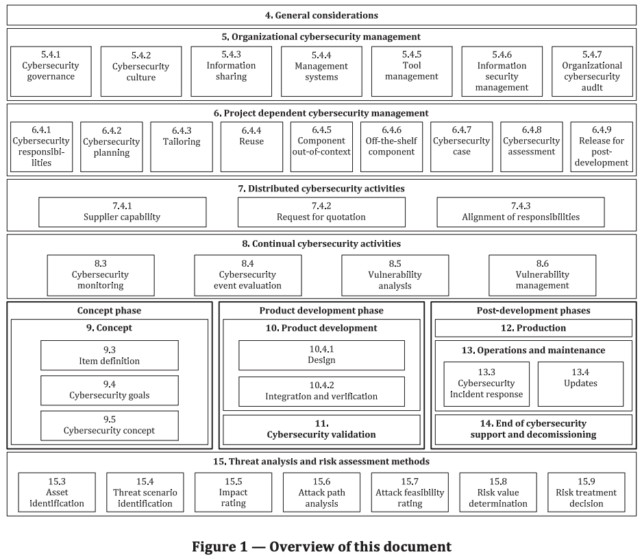
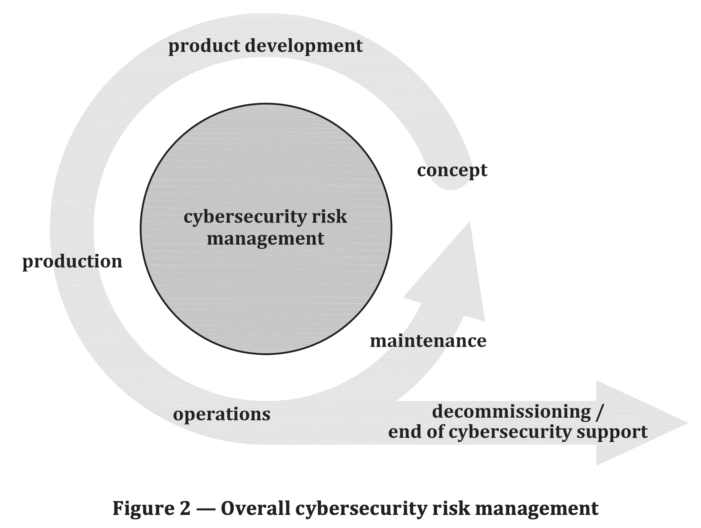
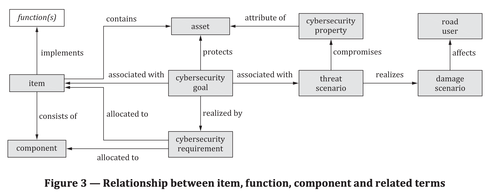
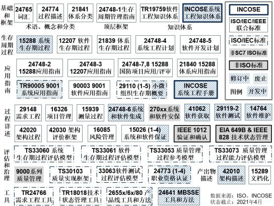
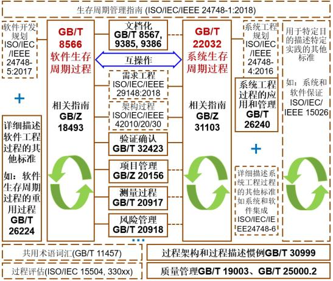

# ISO/SAE 21434

## 介绍

这篇文档阐述了道路车辆电子电器系统工程中的网络安全观点。通过保障适当的网络安全考虑（consideration），这篇文档目的在于使E/E系统工程能够跟上当前技术发展和演进的攻击方法。

这篇文档提供了一种贯穿供应链全过程通用理解的关于网络安全工程方面的词汇、目标、需求和指引。这使组织可以：
- 定义网络安全策略和过程
- 管理网络安全风险
- 培育网络安全文化

### Scope

ISO 21434 文档详细描述了关于道路车辆中电子电器系统的概念、产品开发、生产、运营、维护和终止的网络安全风险管理的工程需求，包括他们的组件和接口。

ISO 21434 定义了网络安全过程的功能（需求）框架和一种交流和管理网络安全风险的通用语言。

这篇文档没有描述网络安全特定技术或解决方案。

### 术语

架构设计（architectural design）：给出组件、组件边界、接口和交互的表述。

资产：有价值或对价值有贡献的对象。

攻击可行性（attack feasibility）：攻击路径的属性，用于描述成功执行攻击行动的容易程度。

out-of-context：not developed in the context of a specific item

damage scenario：adverse consequence involving a vehicle or vehicle function and affecting a road user.
破坏场景：涉及车辆或车辆功能并影响道路使用者的不利后果。

threat scenario：为了实现damage scenario，一个或多个资产的网络安全属性受损的潜在原因。

### 框架

- 一般考虑
- 组织的网络安全管理
  - 网络安全治理
  - 网络安全文化
  - 信息共享
  - 管理系统
  - 工具管理
  - 信息安全管理
  - 组织的网络安全审计
- 相关项目的网络安全管理
  - 网络安全责任
  - 网络安全规划
  - Tailoring
  - 重用
  - 组件的外部环境
  - 现有（off-the-shelf）组件
  - 网络安全案例
  - 网络安全评估
  - 后开发发布（Release for post-development）
- 分布式的网络安全活动
  - 供应商能力
  - 引用要求
  - 责任对齐
- 持续的网络安全活动
  - 网络安全监控
  - 网络安全事件评估
  - 漏洞分析
  - 漏洞管理
- 感念阶段-概念
  - 条目识别（item definition）
  - 网络安全目标
  - 网络安全概念
- 产品开发阶段
  - 产品开发
    - 设计
    - 整合和验证
  - 网络安全验证
- 后开发阶段
  - 产品生产
  - 运营和维护
    - 网络安全事件响应
    - 更新
  - 网络安全支持终结和退役
- 威胁分析和风险评估方法
  - 资产识别
  - 威胁场景识别
  - 影响评级
  - 攻击路径分析
  - 攻击可行性评级
  - 风险值决定
  - 风险应对决策

### 缩略语（Abbreviated terms）
CAL cybersecurity assurance level
CVSS common vulnerability scoring system
E/E electrical and electronic
ECU electronic control unit
OBD on-board diagnostic
OEM original equipment manufacturer
PM permission
RC recommedation
RQ requirement
RASIC responsible , accountable, supporting, informed, consulted
TARA threat analysis and risk assessment
WP work product

## 通用考虑 General considerations

一个 item 包含车内涉及实现某个车级特定功能的所有的电子装备和软件。
An item comprises all electronic equipment and software in a vehicle involved in the realization of a specific functionality at vehicle level.

ISO 21434 文件限于网络安全相关的item和一系列道路车辆产品（非原型）的组件，包括后市场和服务部分。车辆外部系统（例如：后端服务器）可以作为网络安全目标，但不包含在本文档内。

ISO 21434 文档描述了源自单一 item 的透视图的网络安全工程。准确定位道路车辆E/E架构中 items的功能不在本文档范围内。车辆作为一个整体，车辆E/E架构或它的网络安全相关items和组件的网络安全案例集合可能被考虑。如果本文档中描述的网络安全活动在 items 和组件上被执行，那么不合理的车辆网络安全风险将被解决。

本文档中描述的一个组织的全局网络安全风险贯穿于全生命周期。

概念-产品开发-产品-运营-维护-废弃

网络安全风险管理涉及完整的供应链以支持网络安全功能。汽车供应链呈现乐多样化的协作模式。不是所有的网络安全活动都与某个特定项目相关联的所有组织有关系。网络安全活动可能被调整以适应特定情况的需要（Clause 6）。某个特定item或组件的开发合作者都要同意工作划分，以便可用的网络安全活动可以被执行（Clause 7）。图3 显示了在一个 item、功能、组件和相关条款的关系。

Clause 15 描述了在文档其他部分描述的网络安全活动的模块化的网络安全风险评估方法。

在网络安全工程上下文中的分析活动，是识别和发现有恶意意图并引起车辆E/E系统入侵危害的抽象敌对攻击者执行的潜在行为。

网络安全工程和来自不同专业领域的专家的协同，可以支持深度的分析和特定网络安全风险的缓解。网络安全监视、缓解和事件响应活动补充了概念和产品开发活动，这些活动作为一种响应式方法，接受了在道路车辆E/E系统中环境持续变化的条件以及未来识别和管理缺陷和漏洞的需求。

纵深防护方法可用于缓解网络安全风险。纵深防护方法利用了网络安全控制层次，以提升车辆网络安全。如果某个攻击能够渗透或绕过某一层次，另一层次将限制攻击并继续保护资产。

## 第5章 组织的网络安全管理（Organizational cybersecurity management）

### 概述

为了实现网络安全工程，组织制定（institutes）和维护网络安全治理（governance）和网络安全文化，包括网络安全意识管理（awareness mangement）、能力管理（competence mangement）和持续优化（continuous imporvement）。这涉及到详细描述（specifying）组织规则（organization rules） 和过程（processes），它们需要根据本文档的目标做独立审计。

This involves specifying organizational rules and processes that are independently audited against the objectives of this document.

为了支持网络安全工程，组织实现的网络安全管理系统，包括管理工具和应用一套质量管理系统。

>本章规定了公司/组织层面网络安全管理的战略要求。其中心思想是：对车辆的全生命周期，站在全公司层面，制定网络安全管理战略和措施。

### Objectives

本条款的目标是：
- 定义网络安全策略和网络安全方面的组织规则和过程；
- 落实负责执行网络安全活动人员的责任和对应职权；
- 支持网络安全实现，包括提供（provision）资源和管理网络安全过程和相关过程之间的交互；
- 管理网络安全风险；
- 制定和维护一种网络安全文化，包括能力管理、认知管理和持续提升；
- 支持和管理网络安全信息共享；
- 制定和维护支持网络安全运维的管理系统；
- 提供不影响网络安全的工具使用的证据；
- 执行组织的网络安全审计。

### 输入

#### 前置要求
无
#### 更多支持信息
下列信息可以被考虑：
- 遵循支持质量管理的相关标准相的已有证据。例如：IATF 16949 与ISO 9001， ISO 10007 ，Automotive SPICE， ISO/IEC 330xx族标准， ISO/IEC/IEEE 15288 和 ISO/IEC/IEEE 12207 相配合

> 2016年10月，国际汽车工作组（IATF）正式发布 IATF 16949:2016，取代 ISO/TS 16949:2009作为规范汽车行业质量管理的标准，新版标准的目标是规范汽车行业各组织质量管理体系的各项要求，以实现持续改进、强调缺陷预防并减少供应链中的变异和浪费。IATF 16949:2016是全球通用的汽车行业质量管理标准，涵盖了有效运行质量管理体系（QMS）的相关要求。该标准与关键业务密切相关，因此对于许多汽车制造厂商 (OEM) 和供应商，是需要严格遵照的强制要求。

> ISO 10007 Quality Management - Guidelines for configuration management。ISO 10007:2017 provides guidance on the use of configuration management within an organization. It is applicable to the support of products and services from concept to disposal.
> Automotive SPICE 是由欧洲的主要汽车制造商共同策定的「面向汽车行业的流程评估模型」。它的目的是，改善搭载于汽车上的电子控制单元（ECU）/车载电脑的质量。Automotive SPICE的最大特点便是，它是由ECU配件供应商的OEM（汽车制造商）所策定的规格。因此它的意义不仅仅限于「取得认证」，更着重于「改善产品开发项目的质量」。最近，汽车制造商开始要求供应商对应Automotive SPICE，以满足功能安全 ISO 26262 所要求的流程建立。

>ISO/IEC 33001:2015 Information technology - Process assessment - Concepts and terminology
> ISO/IEC 33003:2015, Information technology—Process assessment—Requirements for process measurement frameworks
> ISO/IEC 33004:2015, Information technology—Process assessment—Requirements for process reference, process assessment and maturity models
> ISO/IEC 33020:2015, Information technology—Process measurement framework for assessment of process capability

> ISO/IEC/IEEE 15288 系统和软件工程-生命周期过程.ISO/IEC/IEEE 15288:2015 establishes a common framework of process descriptions for describing the life cycle of systems created by humans. It defines a set of processes and associated terminology from an engineering viewpoint. These processes can be applied at any level in the hierarchy of a system's structure. Selected sets of these processes can be applied throughout the life cycle for managing and performing the stages of a system's life cycle. This is accomplished through the involvement of all stakeholders, with the ultimate goal of achieving customer satisfaction.

> ISO/IEC/IEEE 12207 Systems and software engineering - Software life cycle processes.ISO/IEC/IEEE 12207:2017 also provides processes that can be employed for defining, controlling, and improving software life cycle processes within an organization or a project. The processes, activities, and tasks of this document can also be applied during the acquisition of a system that contains software, either alone or in conjunction with ISO/IEC/IEEE 15288:2015, Systems and software engineering?System life cycle processes.

> 自从2003年ISO/IEC JTC1/SC7联合INCOSE、IEEE等组织启动ISO/IEC 15288:2002 Systems engineering — System life cycle processes和ISO/IEC 12207:1995 Information technology — Software life cycle processes两个标准协调一致工作，十多年来系统工程和软件工程相关国际标准日益成熟完善，不但实现了ISO/IEC/IEEE 15288和ISO/IEC/IEEE 12207两个标准的协调一致，形成了系统和软件工程生存周期管理统一的共用词汇、过程集合和结构，而且形成了两个领域共享一致、相对完整的生存周期管理标准体系.

>系统和软件工程生存周期管理国际标:

>系统和软件工程生存周期管理国际标准体系包括基础和框架层（系统和软件工程术语和知识体系、体系分类、过程框架和生存周期管理顶层指南）、生存周期过程层（系统、软件和体系）、生存周期过程应用指南层（系统、软件和体系，以及面向国防新项目和小微组织体的应用）、过程详述层（ISO/IEC/IEEE 15288、ISO/IEC/IEEE 12207各过程组和过程）、评估和治理层（系统、软件、质量管理、系统和软件工程职业资格认证）、产出物描述层（架构和文档）、以及工具层（需求工程、技术状态管理、产品线、基于模型的系统和软件工程）。

> 面向MBSE新范式的第一个国际标准——ISO/IEC/IEEE 24641: Methods and tools for model-based systems and software engineering正在制定中。
> 参考ISO/IEC/IEEE 15288和ISO/IEC/IEEE 12207两个标准协调一致的方法以及图1中系统和软件工程生存周期管理国际标准体系，图2给出了围绕GB/T 22032和GB/T 8566两个国家标准协调一致工作的现状和未来工作展望。我们可以通过自主制定相关国家标准或采用对应国际标准的方式，实现有中国特色的系统和软件工程生存周期管理国家标准体系。

>生存周期管理标准是系统和软件工程领域的顶层标准，起到统领全局的框架作用。生存周期管理标准制定的目标是统一对生存周期模型 、过程、活动等的认识，并通过经验总结给出开展相应过程和活动的最佳实践，以指导系统和软件工程的生存周期管理、过程评估和改进。

### 要求和建议（Requirements and recommendations）

#### 网络安全治理（cybersecurity governance）

##### [RQ-05-01]：组织必须定义一个网络安全方针。

主要内容：
- a)道路车辆网络安全风险确认  acknowledge of road vehicle of cybersecurity risks
- b)执行管理层承诺管理相应的网络安全风险 the executive management's commitment to manage the corresponding cybersecurity risks.

Note 1: 网络安全策略可能包括对于组织目标的链接和别的策略。The cybersecurity policy can include links to the organization's objectives and other policies.

Note 2: 考虑内部和外部环境，网络安全政策可以包括一份声明，它关于组织产品或服务组合的一般威胁场景风险的处理。The cybersecurity policy can include a statement regarding the risk treatment of generic threat scenarios with respect to the organization's porducts or services portfolio, considering the context, either external or internal.

##### [RQ-05-02]：组织应建立和维护组织层面的规则和流程以支持相关要求的实现和网络安全活动的执行。

- a) 能够实现本文档中所列的要求 enable the implementation of the requirements of this document;
- b) 支持执行相应的活动 support the execution of the corresponding activities。

> 这个流程可以包含流程定义，技术规则，方法论或模板等形式，必须覆盖项目的整个生命周期，包括了网络安全风险管理，信息共享、漏洞披露、网络安全监控，事件响应等重要活动。

例1：流程定义、技术规则、指引、方法和模版。

Note3: 网络安全风险管理可能包括活动的成本-效益分析（effort-benefit considerations）

Note4: 涵盖概念、产品开发、生产、运营、维护、报废等阶段的规则和过程，包括了TARA 方法、信息共享、网络安全监视、网络安全事件响应和触发机制。

Note5: 关于漏洞披露的规则和流程，例如作为信息共享的一部分，可以根据 ISO 29147 进行描述。

> ISO 29147 Information technology — Security techniques — Vulnerability disclosure

[RQ-05-03]：组织应对网络安全活动的职责进行分配和授权
[RQ-05-04]：组织应提供解决网络安全问题所需的资源。
[RQ-05-05]：组织应识别与网络安全相关的专业领域，并建立和维护这些领域之间的沟通渠道。
[RQ-05-06]：组织必须在风险矩阵中定义一个风险值。
这里所说的风险矩阵会在8.8 风险确定 中详细说明

网络安全文化（cybersecurity culture)
[RQ-05-07]：组织必须建立和维护网络安全文化
[RQ-05-08]：组织必须保证参与网络安全的人员具有相应的能力和意识

包括了专业领域的知识，经验，网络安全相关的培训，工具，系统等
组织应建立和维护持续改进的流程

网络安全风险管理（cybersecurity risk management)
[RQ-05-09]：网络安全风险管理应符合ISO 31000
[PM-05-01]：组织可保持网络安全风险管理与企业风险管理的一致性

网络安全审计（organization cybersecurity audit）
[RQ-05-11]: 应进行网络安全审计以独立判断组织的流程是否达到了本标准的要求

信息共享（Information Sharing)
[RQ-05-12]: 组织应定义环境条件，考虑组织内部和外部哪些共享是必须的、允许的，哪些是被禁止的

管理系统（Management System)
[RQ-05-13]: 组织应按照国际标准或同等标准建立和维护一个质量管理体系来支撑网络安全工程
[RQ-05-14]: 量产产品的网络安全配置信息应在产品终止维护前保持可用
[RC-05-01]: 应制定针对生产制造流程的网络安全管理体系

工具管理（Tool Management)
[RQ-05-15]: 应对能够影响相关项目、系统和组件的工具进行管理
[RC-05-02]: 在对产品支持结束之前，一个支持网络安全事件响应补救措施的相应环境必须可复制。

例如用于复现漏洞的测试环境，必须在支持周期结束之前一直保持可复制

信息安全管理（Information security management)

[RC-05-03]: 网络安全计划要求的工作产品的相关信息属性应该由一个信息安全管理系统来管理

根据以上的8项要求，应该产出以下这些工作产品
[WP-05-01]: 网络安全方针、规则和流程
[WP-05-02]: 能力管理、意识管理和持续改进的证据
[WP-05-03]: 组织层面的网络安全审计报告
[WP-05-04]: 组织管理体系的证据
[WP-05-05]: 工具管理的证据

*RQ: Requirement; RC: Recommandation; PM: Permission；WP：Work Product

可以看出，21434在这一章里主要阐述了组织层级对于网络安全应采取的活动，在主机厂的实施过程中，这项工作的归口在公司的体系部门，质保和IT等部门作为支持。由于涉及整个公司层面的流程，组织架构和管理措施，因此整车厂通常是根据自身原有的流程，匹配21434相应的要求，并在工作产品上突出网络安全方面的证据，以符合标准的要求。

实际上，这种自上而下、逻辑驱动的网络安全体系建设是比较理想的情况，现实中更多的情况是由法规驱动的体系建设。整车厂为了满足VTA的形式认证要求，首先以产品为落脚点进行网络安全要求的研究，一边保证技术上的合规，一边再自下而上地推动体系的建设。毕竟体系上的"文审" 有比较宽松的操作空间，但产品上的形式认证如果没有通过，则很有可能被“一票否决”。

## 项目网络安全管理
项目相关的网络安全管理（Project dependent cybersecurity management) 一章给出了一个普适性的，项目层面的网络安全管理要求。其中包含了需要实施的网络安全活动，各项活动的职责分配，裁剪原则，以及网络安全案例和网络安全评估的要求。

网络安全职责及其分配（Cybersecurity Responsibility and Their Assignment)

根据上一章[RQ-05-03]的原则进行沟通和分配。

网络安全计划（Cybersecurity Plan)

这部分是本章的重点之一，制定网络安全计划的步骤如下：
首先确定哪些组件与网络安全有关，21434在附录D这种给出了一个判断的流程。
分析组件时新开发还是复用，从而确定是否需要进行裁剪
根据以上的分析结果，结合[RQ-05-03]，[RQ-05-04]的要求，制定网络安全计划并分配职责。

对于网络安全计划，还有以下的一些要求：
网络安全计划应被纳入项目的开发计划当中
网络安全计划概念阶段和产品开发阶段的活动必须符合本标准中的要求（在之后的章节会提到）
网络安全计划必须包含：
活动的目的
对其它活动或信息的依赖性
活动的负责人
进行活动所需的资源
开始、结束的时间点以及持续时间
工作产品的标识
相关的活动，工作成果需进行维护和更新
如果活动涉及供应商，需按照本标准中第15章的要求进行网络安全活动的计划
所有网络安全产生的工作产品，都要进行配置管理需求管理和文件管理。
网络安全活动的裁剪（Tailoring of the Cybersecurity activities)

在21434中允许对网络安全活动进行必要的裁剪，如果实施了裁剪，必须提供相应的证据，以证明裁剪后仍然可以充分实现网络安全的相关目标。

在标准中规定了三种可进行裁剪的情况，分别是复用、需求外的组件和已有的组件，在这三种情况下，需根据标准中的要求和建议进行裁剪。

复用（Reuse)

组件复用在整车研发中非常的常见，虽然复用的组件使用的是已有的架构，接口和安全方案，但是由于运行环境、配置信息等的变化，以及攻击技术的不断发展，新漏洞的发现，仍然需要对其进行必要的分析，实施相应的网络安全活动。

对于复用的组件必须进行复用分析，分析遵循以下步骤：
识别在本项目中，组件所在环境的变更，设计变更以及配置或校准数据的变更；
分析组件是否能满足当前项目的网络安全要求，现有的工作产品是否足以支持其集成到新项目中；
识别出缺少的工作产品及网络安全活动，制定针对该组件的网络安全计划。

超出当前需求的组件（Component out of context)

超出当前需求的组件通常指供应商预开发或预埋的组件，这些组件通常是因为平台化开发而预留的，不在当前产品需求的Scope里。

对于此类组件，21434要求在工作产品中对其预期的用途、环境和接口进行记录，并且这些组件必须基于预期用途的网络安全要求来开发。

现有组件（Off-the-shelf Component）

现有组件指那些不是专门为项目开发的软件，如第三方的软件，开源软件库等。对于此类组件，21434要求必须收集其相关的网络安全信息，保证其相关的证据文档足以支撑当前项目的网络安全要求。

网络安全案例（Cybersecurity case)

网络安全案例就是网络安全评估的对象，案例必须提供一系列网络安全计划所需的工作产品，以证明在这个项目上网络安全的实施程度。

网络安全审核（Cybersecurity Assessment)

网络安全审核的目的是判断对象或者组件的网络安全实现程度，确定其是否能达到本标准要求的网络安全目标。

对于网络安全活动是否执行，实现程度的审核主要基于对工作产品和文档证据的审核，下图显示了网络安全审核涉及的主要内容：

图

评估的结果包括接受、带条件接受和拒绝。带条件接受通常会在评估结果中提出整改要求，并会在项目各个阶段对整改项的完成情况进行监控。

用于后期开发的发布（Realease for Post-Development)

以下工作产品必须在后期开发开始之前发布：
网络安全案例
网络安全评估报告
后期开发的网络安全要求

小结：本章对于项目层面网络安全的实施要求进行了定义，包括如何制定网络安全计划，如何识别项目范围，裁剪的原则，以及审核的原则。相对上一章，本章更加贴近实际的工作，笔者目前参与的项目也是从这个阶段开始进行的，在后续的VTA认证中，很大程度会参考本章中网络安全审核的要求来进行。不过标准中的要求很多都是十分宽泛的，具体的网络活动要如何实施，实施到什么程度，都还没有一个明确的基线，也没有所谓的”最佳实践案例“，各大OEM和咨询机构都还在等待着”第一个吃螃蟹“的主机厂。

## 持续的网络安全活动
与传统整车研发中大部分的工程活动不同，网络安全活动是一个贯穿了产品整个生命周期的持续性的活动。OEM不仅要在开发阶段进行必要的风险分析、网络安全开发，还要在后续的整个产品生命周期实施网络安全监控和运维，建立网络安全事件应急响应的机制，持续地保证车辆的网络安全。新漏洞的发现、网络安全突发事件和新攻击技术的出现等都可能触发网络安全活动。

在21434中，规定了4项需要持续进行的网络安全活动：
网络安全监控

网络安全事件评估

脆弱性分析

脆弱性管理

网络安全监控（Cybersecurity Monitoring)

通过网络安全监控持续地收集组件的潜在威胁、脆弱性和可能的解决措施等信息，以应对已知和新出现的威胁。监控获取的信息可作为脆弱性管理和网络安全事件响应的输入。

监控的信息可来源于外部或内部。

外部来源：网络安全研究者、商业/非商业来源、供应链、客户、政府

内部来源：脆弱性分析结果、现场获取的信息（如脆弱性扫描报告，维修信息，客户使用信息）、配置信息（如软硬件材料清单）

需对于收集到的信息进行分类，以确定其是否可被定义为网络安全事件。组织需定义一个分类的准则，准则可参考以下的因素：
是否来源于已知的可信来源
根据[RQ-09-05]确定该信息在各威胁场景下的风险；
信息的类型（主动攻击、POC测试等）

输出产品：

网络安全监控来源清单、网络安全信息分类结果

网络安全事件评估（Cybersecurity Event Assessment)

网络安全事件评估的目的是确定网络安全事件的严重性，以决策是否采取响应的活动。根据脆弱性分析对事件进行分析，确定该网络安全事件是否影响相关组件。如果不影响，可不实施相应的网络安全活动。如果影响，则应进行脆弱性管理或网络安全事件应急响应。

输出产品：

网络安全事件评估结果

脆弱性分析（Vulnerability Analysis)

脆弱性分析的输入可来源于之前的网络安全事件评估、过去的脆弱性分析文档、验证报告、安全应急事件响应信息等。目的是检查某个脆弱点的脆弱程度，评估其是否会被利用来进行网络安全攻击。

脆弱性分析的对象是的脆弱点（Weakness），脆弱点包含了以下几种：
缺少要求或规范
架构或设计上的脆弱点，包括不正确的安全协议设计
实施中的脆弱点，包括硬件和软件缺陷，安全协议的错误实施
操作过程和流程中的脆弱点，包括误用和不充分的用户培训
使用过时或者弃用的函数，包括保密算法

根据第8章的攻击路径分析、攻击可行性分析方法，确定每个脆弱点的攻击可行性等级。

输出产品：
脆弱性分析结果

脆弱性管理（Vulnerability Management）

根据之前脆弱性分析和网络安全事件的评估结果，进行脆弱性管理，保证相应的风险被处置。在这项活动中，必须定义一个风险处置的原则，确保每项风险都有对应的处置措施，风险处置原则可基于脆弱性分析结果，风险判定结果等信息，对于脆弱性处置的具体方法会在第8、9、10章中介绍。

注：接受风险也是一种风险处置措施，但需要解释记录风险被接受的合理原因。

输出产品：

脆弱性管理基本原理

最后用一张表总结一下本章中介绍的四项活动的输入和输出：

