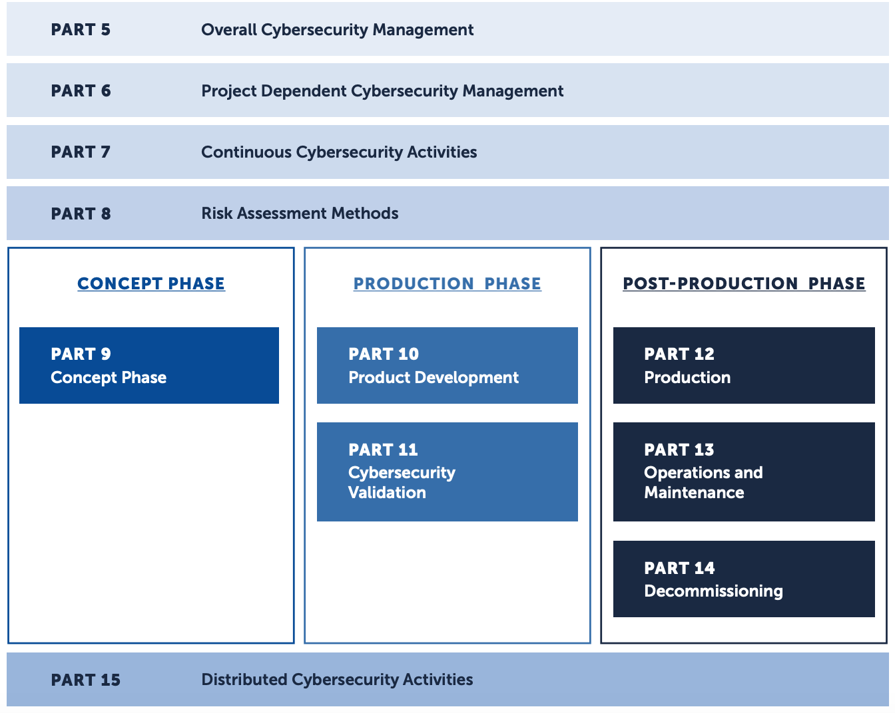
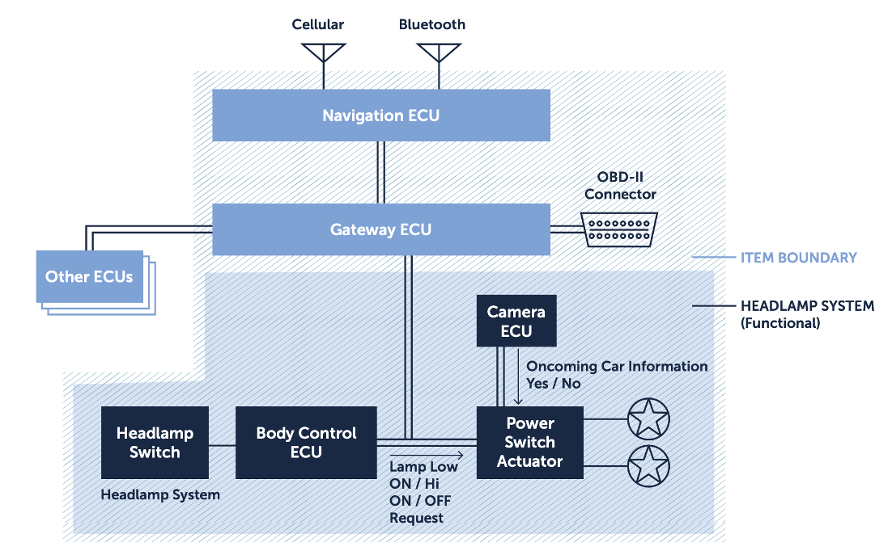
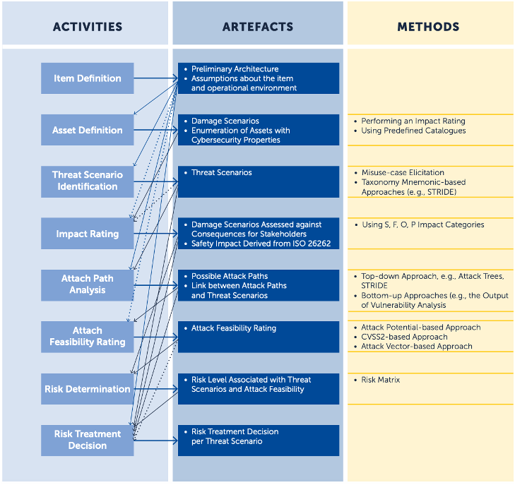
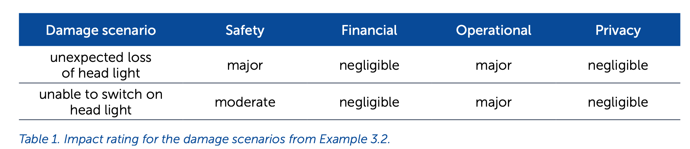
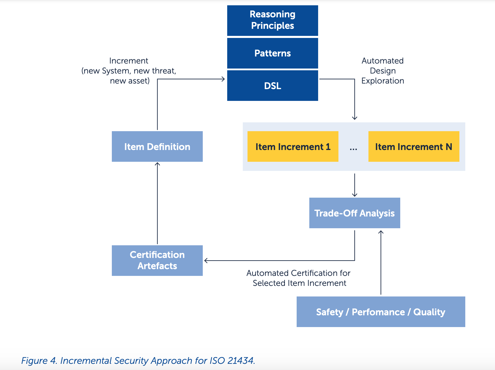

# ISO 21434 示例

> 源自白皮书：Security Engineering for ISO 21434 ,by fortiss

ISO/SAE 21434 是一个新标准，旨在解决汽车网络安全的未来挑战。本文以实例方式解释ISO21434工程，理解ISO21434的各部分，关键活动，主要工作产出。工程师首先要获取标准的文档，然后执行包括安全风险评估方法、形成安全参数和证据支持

ISO21434 技术部分的摘要信息如下图所示：



- Part5 详述了构建和维持网络安全文化和治理的需求；
- Part6 描述了开发特定产品的网络安全活动管理需求；
- Part7 和 8 描述了在产品生命周期中用于确保网络安全的活动和方法；
- Part9 详述了概念阶段的需求；
- part10 和 11 详述了产品阶段的需求；
- Part 12-14 详述了售后（post-production）阶段的需求
- Part 15 详述了供应商管理的需求。

## 实践示例

下面以车大灯系统为例，介绍ISO 21434应用实践过程。

前灯系统的主要架构如下：
- 车身控制ECU通过CAN总线向电源切换执行器发送信息，以请求打开/关闭前灯；
- 摄像头ECU连接着电源切换执行器，可以对对面来车进行检测，以自动切换远光/近光；
- CAN总线与网关ECU相连，网关ECU控制着CAN总线连接的其他部件（如导航系统）到车灯系统的访问；
- 导航ECU由两个接口：蜂窝和蓝牙；
- 网关ECU还通过CAN总线连接着OBD-II连接器；
- OBD-II 是用于监控车辆数据的车载计算机；
- 蓝牙和蜂窝接口与OBD-II连接器是外联入口，可能成为攻击的入口点。




### 风险评估

本节描述应用ISO 21434 part8 和part9 进行风险评估的具体过程。

part 9  使用了Part 8描述的风险评估方法。下图摘要刻画了相关活动，包括需要产出的输出和可采用的方法。



#### 项目定义 Item Definition
项目定义。这是一项早期活动，定义了将要评估其风险评估的项目。在这项活动中，描述了项目的初步架构，并对其运行环境进行了假设

##### 示例 1
在这个阶段，需要分析前大灯系统，形成：
- 前照灯系统的初步结构 preliminary architecture of the headlamp system.
- 架构中各元素的描述（例如功能）
- 项目边界（item boundary）

#### 资产识别 Asset Identification

根据项目定义活动的输出，项目的危险场景（damage scenarios）将被识别，而且需要枚举具有网络安全属性的已识别的资产，网络安全属性指可能导致资产处于危险场景（damage scenarios）的因素。ISO21434列出了3种方法执行此活动：
- 影响评级：该方法评估网络攻击对资产的影响。
- 从威胁场景（Threat scenarios）中获取资产：威胁场景（Threat scenarios）（在危险场景活动中生成）有助于识别关键资产
- 预定义目录：现有目录为识别资产提供了良好的来源。

##### 示例 2

例如，前照灯的一个资产是CAN总线，它传输诸如打开/关闭灯的请求等消息。与CAN总线相关的网络安全属性包括完整性和可用性。
- 完整性方面，CAN总线必须确保传输信息的准确性和完整性。
- 可用性方面，CAN总线必须在任何时候都可用，例如，车身控制ECU请求打开/关闭灯。

CAN总线的损坏情况包括以下意外行为：
- 前大灯意外受损：在黑夜驾驶过程中，由于CAN信号完整性问题导致前大灯关闭。
- 不能打开前大灯：由于CAN总线可用性问题，电源开关执行器不能接受来自车身控制ECU的打开车灯的请求。

#### 威胁场景（Threat scenarios）识别

对于每个危险场景（damage scenarios），威胁场景（Threat scenarios）应当被识别。注意某一个危险场景（damage scenarios），可能关联着多个威胁场景（Threat scenarios）。一个威胁场景（Threat scenarios）可能包含着目标资产、被入侵网络安全属性、攻击者可能执行的导致危险的活动。

ISO 21434 提出了2类方法或结合方法：
- 误用用例启发（misuse-case elicitation）：威胁场景（Threat scenarios）经常可以通过无意但可能发生的项目进行识别。
- 基于分类记忆法的方法，例如STRIDE威胁模型，系统地进行威胁识别。
- 此外，还可以通过区分攻击者类型进行场景构建，例如脚本小子、网络安全犯罪分子、敌对国家支持的特工，所使用的攻击方式是不一样的。

##### 示例 3

对于危险场景（damage scenarios）1和2，威胁场景（Threat scenarios）分别有：
- 1.攻击者伪造一个CAN信号，引起对前灯发起请求的CAN消息完整性问题；
- 2.攻击者发起CAN总线泛洪攻击，导致前灯系统CAN总线可用性问题。

对于威胁场景（Threat scenarios）2，攻击者可以使用高优先级CAN消息，发起CAN总线泛洪攻击，使得前灯系统请求被暂时取消，形成前灯启动严重滞后。


#### 影响评级 Impact Rating

这一活动以资产识别获得的危险场景（damage scenarios）为输入。每个危险场景（damage scenarios）根据4个影响范畴来评定其影响评级：
- Safety 安全性
- Financial 经济性
- Operational 执行性
- Privacy 隐私性

别的范畴也可以被考虑。

下列影响评级与危险长江相关联：
- 严重（severe）
- 重要（major）
- 中等（moderatate）
- 轻微（negligible）

最后，功能安全（safety）相关的影响可从ISO 26262 中获取。

##### 示例 4
危险场景（damage scenarios）的影响评级如下表所示：



#### 攻击路径分析 （Attack Path Analysis）

从预设架构出发，假定项目和环境，以及危险场景，可以形成可能的攻击路径和它相关联的威胁场景。

ISO 21434 提出了从下至上（漏洞分析）方法、从上至下（如攻击树）方法。

攻击路径包括下列信息：
- 漏洞、可被利用的缺陷
- 攻击中漏洞如何被利用

##### 示例 5
蓝牙和蜂窝接口都是外界访问的途径，因此他们是前大灯系统可能的攻击入口点。

威胁场景1的威胁路径：
- A. 攻击者通过蜂窝接口入侵导航ECU，发送恶意信号，在黑夜驾驶中关闭前大灯；
- B. 入侵导航ECU 传递已经接收到的恶意信号；
- C. 网关ECU传递恶意信号经CAN总线给电量切换执行器。


注意，通过蓝牙接口也可以有非常类似的攻击路径：
- A. 攻击者通过蓝牙接口入侵导航ECU，发送恶意信号，在黑夜驾驶中关闭前大灯；
- B. 入侵导航ECU 传递已经接收到的恶意信号；
- C. 网关ECU传递恶意信号经CAN总线给电量切换执行器。


#### 攻击可能性评级 Attack Feasibility Rating

每条攻击路径的评级可以根据下列分类进行：
- 高（high）
- 中（medium）
- 低（low）
- 很低（very low）

下面3种方法被建议使用：
- 攻击潜力（Attack Potential）：攻击路径的等级是通过评估攻击级别来获得的，评估时考虑了所需的核心因素，包括所需的运行时间（eclipsed time）、专业知识（specialist expertise）和项目知识（item knowledge required）、机会窗口（widow of opportunity）和设备（equipment）。
- CVSS2:攻击路径评级可食用通用漏洞评分系统，可参考 https://www.first.org/cvss/
- 攻击向量（Attack Vector）：攻击评级可通过分析攻击路径中的主要攻击向量进行判定。

##### 示例 6
这里使用攻击潜力方法，针对威胁场景1的攻击路径，表2显示了攻击可能性评级结果：


#### 风险判定 Risk Determination
威胁场景的风险，可以通过与相关危险场景的影响评级和相关攻击路径的可能性共同判定。

风险值为1（最低风险）到5（最高风险）的整数。可以通过列出一个矩阵（横坐标可以为攻击路径可能性，纵坐标可以是危险场景影响评级）来确定风险值。

##### 示例 7

威胁场景来自示例3的分析，危险场景影响评级来自示例4，攻击可能性评级来自示例6，功能安全评级来自示例4，得到如下结论：
- 威胁场景1的风险值为4，其对功能安全的影响是重要的（major），攻击可能性高（high）。
- 威胁场景2的风险值为2，对功能安全的影响为中度，攻击路径可能性为中度。

#### 风险应对决策 Risk Treatment Decision
风险应对决策，对每个威胁场景都是必不可少的环节。这一阶段的输出包括应对选择，例如：移除风险源来避免风险、减少风险、分担风险或转移风险、接受或保留风险。

### 增量方法 Incremental Approach

虽然ISO 21434是网联车辆网络安全的一个进步，但它没有涉及如何有效实施网络安全的细节。考虑到连接车辆的复杂性，如果没有自动化，在满足生产时间表的同时执行所有活动和生产所有人工制品是不可行的。此外，网络安全是一项持续的任务，因为新的漏洞和攻击被发现（在车辆生产之后），需要新的对策和分析。本文提出了ISO 21434的增量方法，该方法基于三个主要支柱实现了持续有效的网络安全：

- 严格的安全评估。

本文提出了基于精确逻辑模型和精确语义的安全严格评估规范。与包括文本元素的现有评估语言（如目标结构符号 Goal Structure Notation]）相比，严格的安全评估可以自动检查论证中的假设缺失或缺陷。在之前的工作的基础上，本文提出了支持系统架构规范的领域特定语言，即组件和通道，包括物理组件，例如CAN总线或ECU，以及安全和安保元件，例如危险和威胁，以及safety和security体系结构模式，例如safety和security监视器、看门狗和防火墙。

从这种语言中，安全和安全推理原则被指定为逻辑编程规则。例如，它们规定了在何种条件下，给定体系结构中使用的特定安全模式可以保证针对某些给定威胁的安全性。

- 增量评估维持 Incremental Assessment Maintenance

每当系统发生变化时，例如添加或删除新功能，或更改环境，例如一旦发现新的威胁，应重新评估安全评估（论据和证据）。与重新评估整个安全评估相比，更好的方法是重新评估受这些增量变化影响的安全评估部分。为逻辑编程开发了自动增量技术。这些工作指定了用于维护数据库中使用的增量（分布式）逻辑规范和网络路由的算法。似乎可以使用和调整这些技术来维持严格的安全评估。

- 自动化
自动化为了提高流程效率和减少错误，增加自动化支持是关键。幸运的是，在过去的几年里，出现了几种自动推理系统架构的方法。例如设计探索（ design exploration），以及通过使用形式化工具（如静态分析器和模型检查器 static analyzers and model-checkers）生成证据。


下图显示了上述3个支柱在ISO21434增量安全工程的情况。




假设一给定的项目定义I已经进行了严格的安全评估。此外，假设该项目有一个新的增量D即新功能，或对环境的假设，例如新的威胁，这可能会使现有的I安全评估失效。

增量D被提供给基于特定领域语言（DSL）的逻辑规范，在该语言上指定了架构模式和推理规则。通过使用设计探索技术，机器自动生成一组项目增量，所有这些增量都与安全评估相关。考虑到安全、性能、成本或质量等其他方面，对生成的项目增量进行权衡分析。这种权衡得到了自动化技术的支持，能够选择最合适的项目增量。最后，认证人工产出，例如将为新项目生成安全评估。

与基于模型工程的现有方法相比，例如与GSN模型或文本模型（excel 表）相比，本文提出的方法有两个主要优点：
- 第一个好处是使用基于逻辑的规范生成安全评估。因此，我们可以使用精确的语义来依赖诸如稳健性和完整性之类的概念，而不是文本语义，例如在GSN模型中，文本语义可能是模糊的。这样可以自动检查安全评估中使用的参数是否正确，或者推理是否存在缺陷或假设缺失。此外，使用基于逻辑的工具，甚至可以自动枚举完成安全参数仍然需要哪些证据。
- 第二个好处是使用增量方法和自动化。这使得认证过程不那么容易出现人为错误，也更高效。如果没有这两个要素，认证的间接成本非常高，正如航空电子领域已经观察到的那样，在航空电子领域，更改一行代码可能意味着数百万美元的认证成本。

上述两个好处的一个关键影响是，拟议的增量方法能够持续认证连接的车辆。每当项目或环境假设发生新的增量变化时，应制作新的认证人工制品进行认证。通过使用严格的安全评估和增量方法，可以依靠逻辑编程工具等自动推理工具，以高度自动化的方式生产这些人工输出。此外，认证机构必须检查这些文物是否符合ISO 21434。由于该方法中使用的方法基于严格的安全评估，认证机构可以使用现有工具自动检查安全参数是否正确。

### 增量方法示例

#### 自动化 ISO 21434
该机制将初步系统架构以及与系统架构和网络安全属性中的资产相关的危险场景作为输入。机器还希望输入每个给定危险场景的影响等级。这些内容涵盖了风险评估中的三项活动，即项目定义、资产识别和影响评级。

考虑示例 2。该设备是从网关ECU向前照灯系统传输信息的CAN总线。本节仅考虑危险场景1，即意外失去前照灯。

##### 示例 I1

在DSL语言中，可以指定已识别的资产和危险场景如下：

```dsl
asset(can2).
dmgScenario(“hl turns off overnight driving”,can2,int, [maj,neg,maj,neg]).
```

上述内容中：
- 参数 can2 显示了用于ECUs间通信的CAN，can2是一项真实资产。
- dmgScenario显示了危险场景（前大灯系统在黑夜行驶中关闭车灯），它与can2 和网络安全属性（短整数/int）相关。
- 对该危险场景的影响评级结果为`[maj,neg,maj,neg]`.

接下来的活动时威胁场景识别和攻击路径分析。这套机制可以自动化执行这些活动。推理规则制定了潜在的威胁或每个资产关联的威险场景。潜在的威胁在资产可被访问时会转化为真实的威胁。

接下来的风险评估是攻击可能性评级和风险判定过程，该机制回一每个攻击步骤的评级作为输入，然后自动化计算攻击路径的全局评级。给定攻击路径的全局评级，推理机回自动计算每个风险矩阵的风险判定值。

```
{attFS([can2,[can2,gw,can1,bt], int,maj],high)}
{riskDT([can2,[can2,gw,can1,bt],int,maj],4)}
```

对于attFS和riskDT这两个函数，第一个参数是威胁ID。威胁ID由已识别的资产（can2）、攻击者的路径（从右到左的方向）、网络安全属性（完整性）和影响等级（主要）组成。本例仅考虑安全影响等级。attFS和riskDT的最后一个参数分别表示总体可行性评级（高）和已识别威胁的风险值（4）。

在风险评估最后阶段，是风险应对决策。这个机制可以自动化推荐安全模式，以缓解已识别的威胁。推理机制可用于：
- 缓解（mitigation）：哪些威胁可以通过给定的已部署安全模式进行缓解；哪些威胁不能；
- 安全模式推荐：哪些安全模式，例如防火墙或安全监控，可以被应用于部署来缓解威胁，以及哪些不能进行缓解。

下面的图显示了一个防火墙用于缓解已识别的威胁：


总的来看，该机制可以自动化下列iso21434风险评估部分：
- 对给定危险场景，识别威胁
- 识别攻击者利用已识别威胁的路径
- 对戈丁攻击路径每一个攻击步骤，计算攻击者路径全局级别（攻击可能性评级）
- 计算每个已识别威胁的风险值（风险判定）
- 推荐安全模式以环节可识别威胁（风险应对决定）。

#### 增量安全方法

为了解释图4，假设在前灯系统有如下改变：
##### 增量

考虑车身控制器ECU上增加了软件更新功能。假设在前灯系统生命周期的某个点，会执行软件更新。软件更新可能通过OBD-II连接器进行，或者通过蓝牙或蜂窝接口的空口执行。

此增量功能可能会引入新的威胁。潜在威胁是攻击者注入恶意代码到车身控制器ECU，可能因未授权访问导致车身控制器完整性受损。


##### 自动设计探索
接下来，该机制会自动提出缓解已识别威胁的解决方案。图6描述了两种解决方案。它建议部署一个安全监视器来缓解已识别的威胁。其目标是通过强制执行访问控制策略来减轻来自公共元素的恶意访问，例如“只有来自公共元素的授权用户才能将数据写入身体控制ECU”。

Figure 6a illustrates a security monitor associated with the Body Control ECU, whereas Figure 6b illustrates a security monitor associated with the CAN bus. Both solutions can mitigate the identified threat. The main difference is that the former may be deployed by means of software instrumentation, and the latter may be deployed as a physical proxy between the Gateway ECU and the Body Control ECU.

##### 权衡分析
应进行权衡分析，以帮助工程师为系统选择最合适的解决方案。例如，作为代理部署的安全监控器可能比通过软件检测部署的监控器更昂贵（性能方面）。原因是，无论消息的目的地是什么，部署的代理都将拦截来自网关ECU的每条传入消息。与车身控制ECU相关的安全监视器只能截获发送至车身控制ECU本身的消息。因此，基于此类解决方案的性能影响，可以选择图6a所示的安全监视器，而不是图6b所示的安全监视器。

##### 自动生成安全参数

一旦选择了设计解决方案，机器就可以基于（以前和新）确定的威胁以及提出的安全模式构建安全论证。也就是说，它可以以GSN模型的形式构造安全参数。图7描述了从前照灯系统机械衍生的GSN模型（一部分）。它包括已识别的威胁，以及可以使用哪种安全模式来缓解哪种威胁。


### 相关研究

Recent white papers [12][32] also give an overview
on ISO 21434. They both discuss the set of guidelines proposed for securing automotive vehicles.
The white paper [12] focuses on the activities performed in the risk assessment. It proposes an approach to automotive cybersecurity engineering.
This approach suggests the use of offense and defense mechanisms for helping engineers to implement the guidelines of ISO 21434. The white paper
[32] proposes a layered approach for securing automotive vehicles. The advantage of this approach
is to reduce the probability of an attack’s success
by providing multi-layered response to attacks for
protection, detection, and response. This paper proposes an incremental approach to enable the continuous certification for automotive vehicles.
ThreatGet is a model-based engineering tool for
security analysis [30][5]. ThreatGet can perform security analysis on system architectures following the
ISO 21434 risk assessment. ThreatGet automatically
identifies threats given a path between a source and
a target element. ThreatGet lists possible countermeasure that can be selected by users to mitigate
the identified threats. The main advantages of the
machinery presented here over ThreatGet include
that it can automate more parts of the ISO 21434
risk assessment such as both attack feasibility rating
and risk determination. It explicitly shows where
countermeasures shall be deployed in the system
architecture to mitigate identified threats. It enables
the construction of security arguments in the form
of a GSN model. To the best of our knowledge,
ThreatGet does not support the generation of such
security arguments. Finally, this paper considers an
incremental approach to risk assessment, thus enabling continuous certification.
Goal-oriented approaches, such as GSN [6] and
KAOS [20], have been used for modeling safety cases.
Similar to these approaches, several papers [13]
have proposed using Attack Trees [31] for modeling
risk assessments. Extensions include quantitative
models for evaluating how defenses can be used
to mitigate attacks [13, 15]. A key difference to the
approach proposed here is the focus on automated analysis. Whereas in the previous work, Attack
Defense trees shall be manually constructed, the
proposed approach can carry out such analysis in
an automated fashion.
A number of work [29, 21, 24] have proposed using
general models encompassing both safety and
security concerns. For example, GSN extensions
with security features, so that in a single framework, one can express both security and safety [24].
Moreover, our previous work [23, 27] proposed mechanisms for extracting security relevant information from safety analysis, such as Fault Tree Analysis
or Failure Mode and Effects Analysis.
While this paper is inspired by these previous work,
the main focus here is on incremental methods for
safety and security co-analysis. As illustrated by the
running example and in our previous work [18], the
proposed approach takes into account both safety
and security during trade-offs to determine the best
design increments.