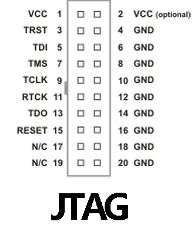
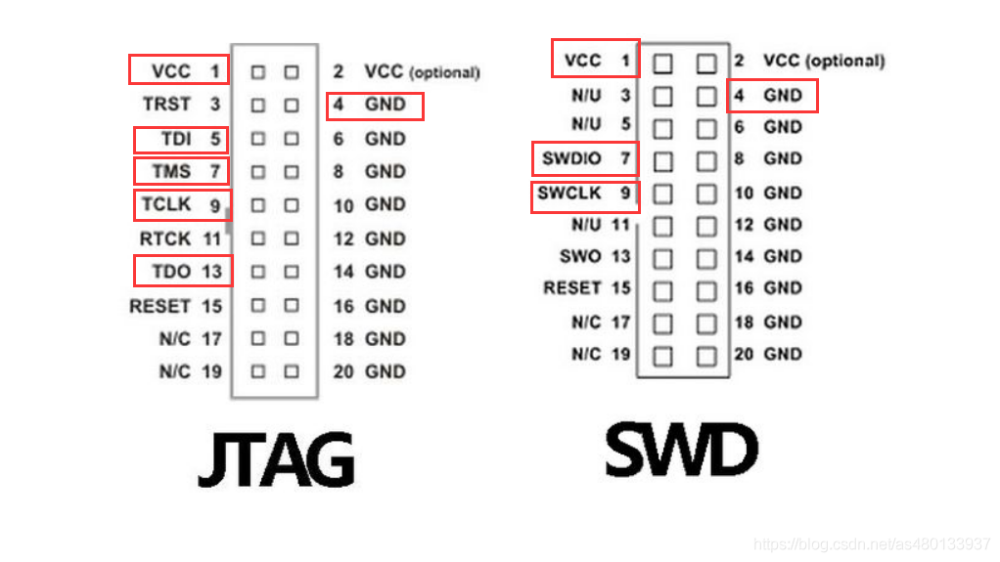

# JTAG

JTAG Joint Test Action Group 是一种国际标准测试协议（ IEEE 1149.1 兼容），主要用于芯片内部测试。大多数高级芯片都支持 JTAG 协议，例如：ARM、DSP、FPGA等等。

JTAG 标准接口为20线，但最为常用的是下面4线：
- TMS：模式选择 ，引脚7
- TCK：时钟，引脚9
- TDI：数据输入，引脚5
- TDO：数据输出，引脚13

另外还有：
- Vcc，引脚1，2
- GND，引脚4，6，8，10，12，14，16，18，20.
- RESET：复位信号，引脚15
- TRST：测试复位信号，低电平有效。 引脚3.

JTAG主要功能：
- 下载器，用于奖软件下载到芯片的flash中
- 调试器: 最为主要的工作。
- 边界扫描：可以用于访问芯片内部的信号逻辑状态，芯片引脚状态。

JTAG和SWD的关系：
- SWD 是ARM公司提供的另一种调试接口，相对于JTAG用更少的线和信号。SWD只需要4条线。

SWD 引脚：
- Vref 目标参考电压，用于检测目标是否供电，直接与目标的VDD相连，并不向外提供输出电压。
- GND：公共地
- SWDIO：串行数据输入信号，作为方针信号的双向数据信号线，建议上拉
- SWCLK：串行时钟输入，建议下拉；
- SWO：串行数据输出，cpu调试接口可通过swo输出一些调试信息，可选引脚
- RESET：仿真器输出值目标cpu的系统复位信号。

20针的J-Link上：
- TMS == SWDIO
- TCLK == SWCLK

## 应用

### 边界扫描

边界扫描的思想：在靠近芯片的输入/输出管脚上增加一个移位寄存器单元。因为这些移位寄存器单元都分布在芯片的边界上，所以称之为边界扫描。

### 
## 工具

### J-Link

J-Link 是 SEGGER 公司为支持仿真ARM内核芯片开发的JTAG 仿真器。配合下列IDE可以支持多种内核芯片仿真：
- IAR EWAR
- ADS
- KEIL
- WINARM
- RealView

支持所有ARM7/ARM9/ARM11，Cortex M0/M1/M3/M4， Cortex A5/A8/A9等内核芯片。

J-Link是一个JTAG协议转换盒，它通过USB传输，在仿真器内部转换成JTAG协议，实现了了一个从软件到硬件转换的工作。使用者只需要一个USB接口，便可以实现JTAG下载， 在以前JTAG协议都是用20pin的转接头(上图)，但是随着时代的发展，很多电脑都不在配备并口的，取而代之的是越来越多的USB接口，这就随之而诞生了J-Link仿真器，只需要一个USB接口，使用者就可以实现芯片的烧录与调试，极大地方便了工作并简便了电脑接口