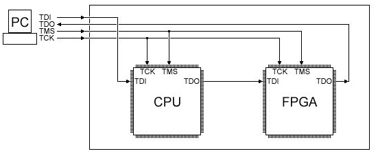
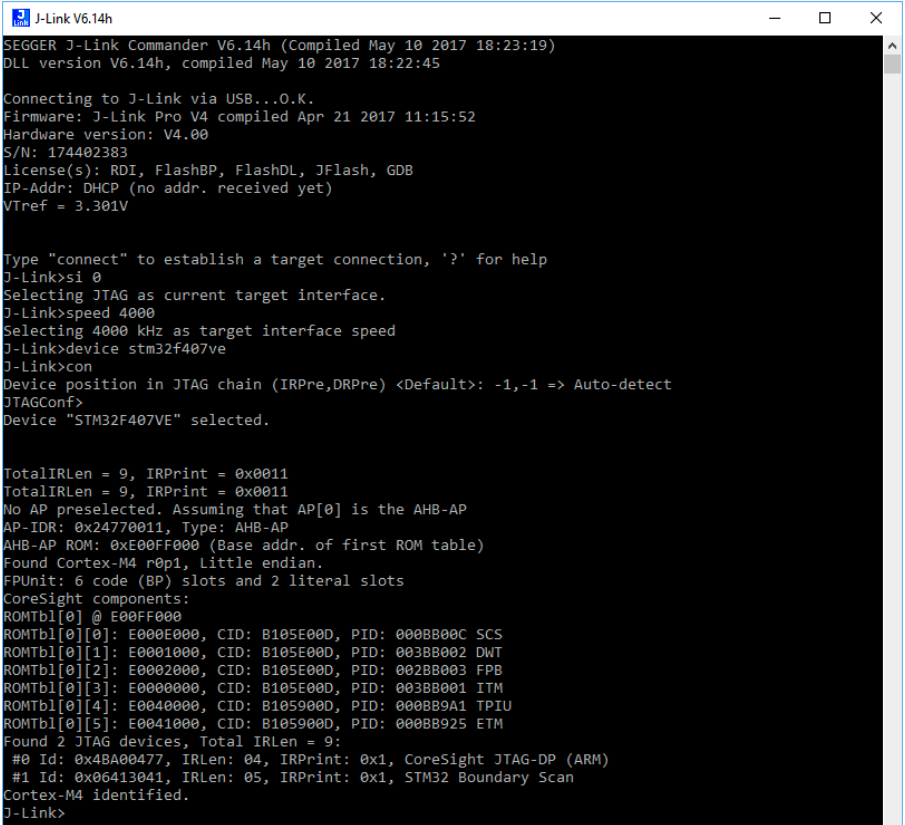

# JTAG


JTAG Joint Test Action Group 是一种国际标准测试协议（ IEEE 1149.1 兼容），主要用于芯片内部测试。大多数高级芯片都支持 JTAG 协议，例如：ARM、DSP、FPGA等等。

JTAG 标准接口为20线，但最为常用的是下面4线：
- TMS：模式选择 ，引脚7
- TCK：时钟，引脚9
- TDI：数据输入，引脚5
- TDO：数据输出，引脚13

另外还有：
- Vcc，引脚1，2
- GND，引脚4，6，8，10，12，14，16，18，20.
- RESET：复位信号，引脚15
- TRST：测试复位信号，低电平有效。 引脚3.


JTAG主要功能：
- 下载器，用于奖软件下载到芯片的flash中
- 调试器: 最为主要的工作。
- 边界扫描：可以用于访问芯片内部的信号逻辑状态，芯片引脚状态。

JTAG和SWD的关系：
- SWD 是ARM公司提供的另一种调试接口，相对于JTAG用更少的线和信号。SWD只需要4条线。

SWD 引脚：
- Vref 目标参考电压，用于检测目标是否供电，直接与目标的VDD相连，并不向外提供输出电压。
- GND：公共地
- SWDIO：串行数据输入信号，作为方针信号的双向数据信号线，建议上拉
- SWCLK：串行时钟输入，建议下拉；
- SWO：串行数据输出，cpu调试接口可通过swo输出一些调试信息，可选引脚
- RESET：仿真器输出值目标cpu的系统复位信号。


20针的J-Link上：
- TMS == SWDIO
- TCLK == SWCLK


## 应用

### 边界扫描

通常芯片设计时会在在靠近芯片的输入/输出管脚上增加一个移位寄存器单元。因为这些移位寄存器单元都分布在芯片的边界上，所以称之为边界寄存器，对这些寄存器的扫描称之为边界扫描。当芯片处于调试状态时，这些边界扫描寄存器可以将芯片和外围的输入输出隔离开来。通过这些边界扫描寄存器，可以实现对芯片输入输出信号的观察和控制。


- 对于芯片的输入引脚，可以通过与之相连的边界扫描寄存器把信号/数据加载到该引脚上去。
- 对于芯片的输出引脚，可以通过与之相连的边界扫描寄存器捕获该引脚上的信号/数据。

正常情况下，边界扫描寄存器对芯片来说是透明的，正常运行不受影响。边界扫描寄存器事实上启动了观测和控制所需调试芯片的作用。

输入/输出引脚上的边界扫描寄存器可以互相连接起来，在芯片的周围围成一个边界扫描链（Boundary Scan Chain）。一般的芯片都会提供几条独立的边界扫描链，用来实现完整的测试功能。边界扫描链可以串行的输入和输出，通过相应的时钟信号和控制信号，就可以方便的观察和控制处在调试状态下的芯片。



 


## 工具

### J-Link

#### J-Link 文件中的术语
SWO：Serial Wire Output 串行线输出

SWV：Serial Wire Viewer 串行线查看器

ITM：Instrumentation Trace Macrocell，仪器跟踪宏单元。

RTT（Real Time Transfer）是一种嵌入式应用中服务于交互式用户I/O的技术。它是SWO和semihosting两者优点的结合体，有更高的性能。

SFR：Special Function Registers，J-Mem可以显示正在运行的目标系统的特定功能寄存器

svf：Serial Vector format。svf是一种用于边界扫描向量的标准格式，可用于不同工具和目标。svf文件包含了人类可读的ASCII svf 语句，组成要素有：SVF 命令、待发送数据、期待的响应、用于响应或额外信息的mask。JTAGLoad 支持的SVF命令有：ENDDR、ENDIR、FREQUENCY、HDR、HIR、RUNTEST、SDR
SIR、STATE、TDR、TIR。下面是一个svf的示例

```svf
! Set JTAG frequency
FREQUENCY 12000000HZ;
! Configure scan chain
! For a single device in chain, header and trailer data on DR and IR are 0
! Set TAP to IDLE state
STATE IDLE;
! Configure end state of DR and IR after scan operations
ENDDR IDLE;
ENDIR IDLE;
! Start of test
! 32 bit scan on DR, In: 32 0 bits, Expected out: Device ID (0x0BA00477)
SDR 32 TDI (0) TDO (0BA00477) MASK (0FFFFFFF);
! Set TAP to IDLE state
STATE IDLE;
! End of test
```


#### 基本介绍
J-Link 是 SEGGER 公司为支持仿真ARM内核芯片开发的JTAG 仿真器。配合下列IDE可以支持多种内核芯片仿真：
- IAR EWAR
- ADS
- KEIL
- WINARM
- RealView

支持所有ARM7/ARM9/ARM11，Cortex M0/M1/M3/M4， Cortex A5/A8/A9等内核芯片。

J-Link是一个JTAG协议转换盒，它通过USB传输，在仿真器内部转换成JTAG协议，实现了了一个从软件到硬件转换的工作。使用者只需要一个USB接口，便可以实现JTAG下载， 在以前JTAG协议都是用20pin的转接头(上图)，但是随着时代的发展，很多电脑都不在配备并口的，取而代之的是越来越多的USB接口，这就随之而诞生了J-Link仿真器，只需要一个USB接口，使用者就可以实现芯片的烧录与调试，极大地方便了工作并简便了电脑接口。


#### 基本功能
安装J-link软件后，提供的功能有：
- J-Link Commander 一个具有基本目标分析功能的命令行工具。
- J-Link GDB Server 可以经tcp/ip连接的debugger 服务器。还包括其命令行版本。
- J-Link Remote server 提供远程访问 J-Link 的功能。
- J-Mem 目标芯片内存观察器，允许编辑内存。
- J-Flash 独立的flash编程应用。
- J-Link RTT viewer 可以显示使用RTT的目标系统的终端输出。可以与debugger 同时使用，也可单独使用。
- J-Link SWO Viewer 显示使用SWO pin的目标的终端输出
- J-Link SWO Analyzer 命令行工具，用于分析SWO RAW 输出和存储到一个文件里。
- JTAGLoad 命令行工具，可以打开一个svf文件并通过jlink发送其中数据到目标
- J-Link Configurator GUI的JLINK 配置工具。
- RDI support 提供远程调试接口功能。
- Processor specific tools 用于处理特定处理器的命令行工具，包括：STR9 commander 和STM32 unlock。

#### 基本使用

首先要下载Segger 网站中的[J-Link软件](https://www.segger.com/downloads/jlink/)。它起到驱动和部分观察和改写作用。更多的功能还是需要调试器或IDE完成。

与JLINK相配套的IDE和调试器有很多，包括：
SEGGER Embedded Studio
IAR_EWARM
Keil MDK
Eclipse

使用Jlink的基本步骤：
- 1.安装好jlink软件、ide软件
- 2.先连接jlink的usb端到电脑（给jlink加电），然后连接jtag/swd端到被调试目标；最后，启动被调试设备。
- 3.验证目标设备的连接状态。如果连接和启动过程正确，会在j-link 命令行界面上看到：经USB连接成功，且可以发现JTAG目标和目标的核心ID。



JLINK 使用LEDs灯作为指示器，提供一些关于当前状态的信息。

- 主指示灯：jlink v7版本之前，主指示灯是单色绿色的，Jlink v8之后，变成了2色绿和红色的，现在的版本是彩色的，有红、绿、橘红等色彩。
  - 绿色且以10Hz（0.1秒闪一次），表示模拟器枚举
  - 绿色且闪烁不止，表示模拟器正在运行，闪烁速度依赖于目标接口的速度。
  - 绿色常亮，表示模拟器已经枚举且处于空闲状态。
  - 绿色，每秒钟关闭10ms，表示Jlink 心跳，在模拟器已经处于空闲状态至少7秒钟后将要被激活
  - 橙色，目标reset被激活。
  - 红色，以1Hz闪烁，模拟器有一个致命错误。不正常。


- 输入/输出指示灯：新版本的Jlink 例如Jlink pro/ultra 有此类指示灯。

##### JTAG接口
通常，在JTAG扫描链上仅假设有一台设备。如果你有多个设备在scan chain上，必须正确配置它。这需要指定需要被定为的cpu的精确位置。扫描配置由目标应用来完成。目标应用可能是某个debugger ，例如 IAR C-SPYA debugger，使用RDI的ARM‘S AXD、flash 编程应用（如segger的jflash）或是使用jlink/jtrace的其他应用。很多应用提供了一个对话框来解决配置问题。

