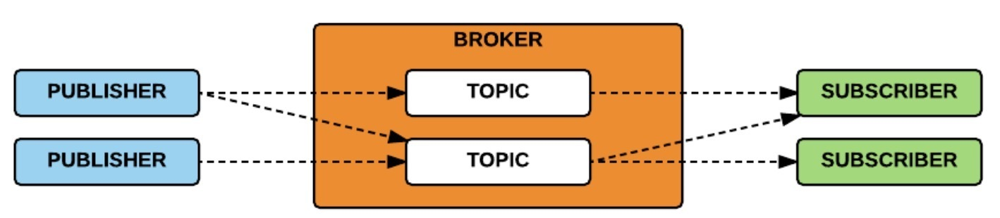
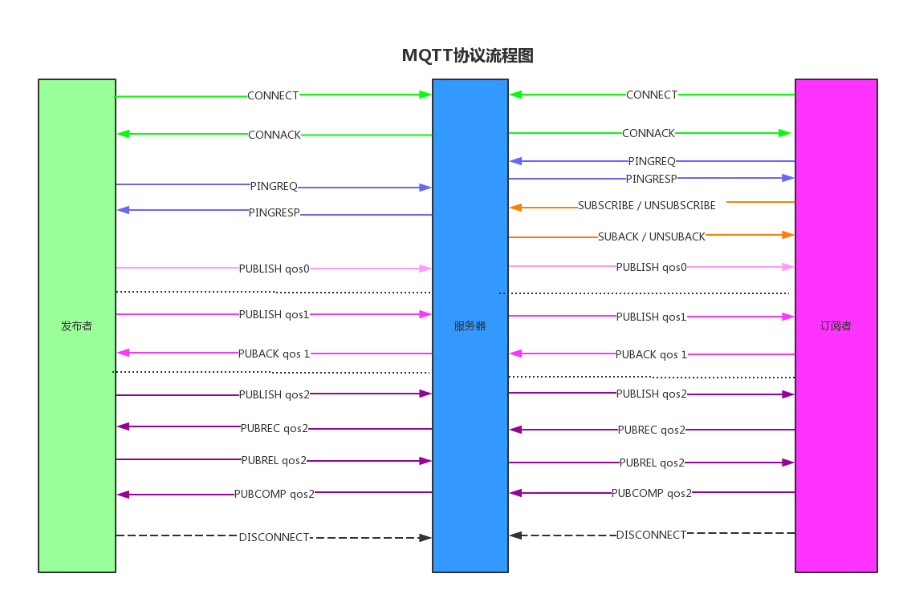

# MQTT 安全

## 概述
MQTT 全称为 Message Queuing Telemetry Transport（消息队列遥测传输）是ISO 标准(ISO/IEC PRF 20922)下基于发布/订阅范式的消息协议，由 IBM 发布。由于其轻量、简单、开放和易于实现的特点非常适合需要低功耗和网络带宽有限的IoT场景。比如遥感数据、汽车、智能家居、智慧城市、医疗医护等。

目前支持的服务端程序也较丰富，其PHP，JAVA，Python，C，C#等系统语言也都可以向MQTT发送相关消息。 目前最新的版本为5.0版本，可以在https://github.com/mqtt/mqtt.github.io/wiki/servers 这个连接中看到支持MQTT的服务端软件。 其中hivemq中提到针对汽车厂商的合作与应用，在研究过程中会发现有汽车行业应用了MQTT协议。

特点：
- 使用发布/订阅的消息模式，支持一对多的消息发布；
- 消息是通过TCP/IP协议传输；
- 简单的数据包格式；
- 默认端口为TCP的1883，websocket端口8083，默认消息不加密。8883端口默认是通过TLS加密的MQTT协议。

### 管理平台 emq x
对于MQTT应用之外，还可以关注管理平台。目前EMQ X是其中比较流行的一个。

EMQ X全称 Erlang/Enterprise/Elastic MQTT Broker，它是基于 Erlang/OTP 语言平台开发，支持大规模连接和分布式集群，发布订阅模式的百万级开源 MQTT 消息服务器。EMQ X常见端口和默认密码为：

TCP 端口： 1883

Websocket 端口： 8083

TCP/TLS 端口： 8883

Websocket/TLS 端口： 8084

管理平台端口：18083

默认用户名密码：admin/public

FOFA Dork：(port="18083" && title="dashboard") || body="href=/static/emq.ico"

通过登录平台，可以很方便的看到客户端连接、主题、订阅信息等，还可以通过添加规则来过滤数据。本地搭建的效果如下：


### 发布/订阅模式

mqtt协议中有三种角色和一个主要概念，三种角色分别是发布者（publisher）、订阅者（subscriber）、代理（broker），还有一个概念为主题（topic）。

消息的发送方被称为发布者，消息的接收方被称为订阅者，发送者和订阅者发布或订阅消息均会连接BROKER，BROKER一般为服务端，BROKER存放消息的容器就是主题。发布者将消息发送到主题中，订阅者在接收消息之前需要先“订阅主题”。每份订阅中，订阅者都可以接收到主题的所有消息。





## mqtt攻击

根据其特点，可以扩展如下几个攻击点：
- 授权：匿名连接问题。如果未做安全设置，则任何人都可以发布或订阅消息，可能泄漏敏感数据或指令。
- 传输：默认情况下，未加密。可以使用中间人攻击获取敏感信息。
- 认证：弱口令问题。
- 应用：订阅端明文配置可以泄漏其验证的用户名和密码。
- 漏洞：服务端软件自身存在缺陷；或订阅端/服务端解析内容不当引发的问题。

### MQTT 利用工具 MQTT-pwn

已有的mqtt工具有[mqtt-pwn](https://github.com/akamai-threat-research/mqtt-pwn)。
```
git clone https://github.com/akamai-threat-research/mqtt-pwn.git
cd mqtt-pwn
docker-compose up --build --detach
```

运行：
```
docker-compose ps
docker-compose run cli
```

很多mqtt服务端软件默认是开启了匿名访问。微软的mqtt监听口味8883，但物联网服务器的常为1883. 还有的使用8083，1884等等。

可以使用mqtt-pwn的connect连接 : `connect -o host`

查看系统信息：`system_info`

查看可渗透对象：`victims`

mqtt topic发现：`discovery`

用户名密码爆破：

`bruteforce --host hostname --port port -uf user_dic -pf pass_dic`

端口常为1883，用户名/口令在resources/wordlists下。


## 参考
引用
https://dzone.com/articles/exploiting-mqtt-using-lua
https://www.hindawi.com/journals/wcmc/2018/8261746/
https://github.com/akamai-threat-research/mqtt-pwn
https://morphuslabs.com/hacking-the-iot-with-mqtt-8edaf0d07b9b
https://book.hacktricks.xyz/pentesting/1883-pentesting-mqtt-mosquitto
https://hackmd.io/@QwmL8PAwTx-bYDnry-ONpA/H1nm2tHzb?type=view
https://ttm4175.iik.ntnu.no/prep-iot-mqtt.html
https://mobilebit.wordpress.com/tag/mqtt/
https://www.hivemq.com/blog/seven-best-mqtt-client-tools/
https://nmap.org/nsedoc/lib/mqtt.html
http://mqtt.p2hp.com/