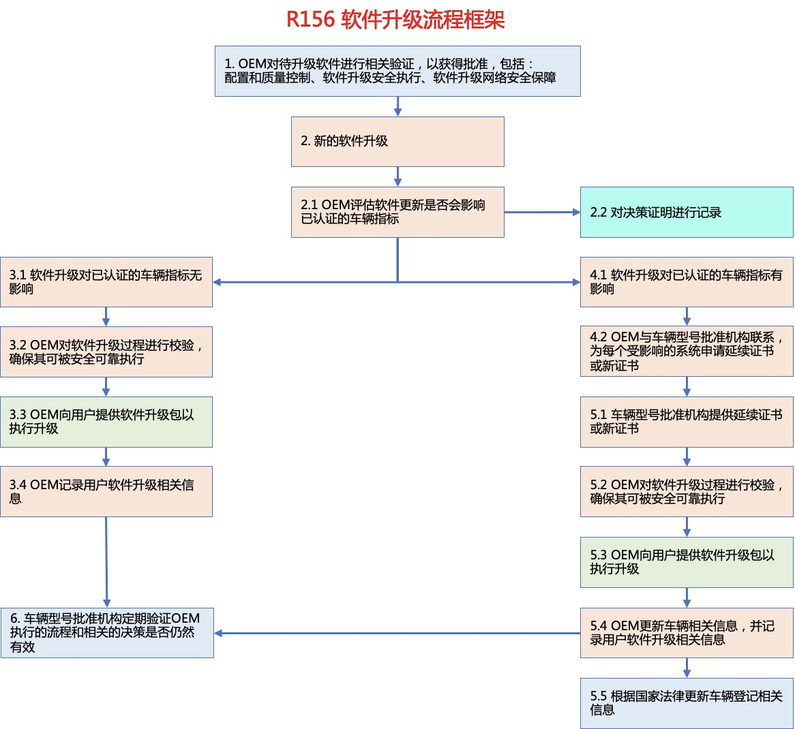

# OTA 安全测试

近来，随着越来越多的智能网联汽车走向市场，软件在线升级（OTA升级）技术的应用日益广泛。相比传统通过召回车辆修复系统缺陷的方式，OTA升级技术因具有低成本、高效率的优势而被广泛应用。但同时OTA升级技术也带来了新的挑战。

## 相关法规

### R156

2020 年 6 月，联合国世界车辆法规协调论坛（WP.29）颁布了《软件升级与软件升级管理系统》（Software Update and Software Update Management System，R156）技术法规。R156法规提出了软件升级管理体系认证要求，规范了软件升级实施流程，确保软件升级过程安全、可控、合规，该法规已于2021年1月正式生效。2021年3月召开的WP.29论坛审议通过了R156解读文件，对法规部分条款作出进一步解释，以帮助企业及审核机构理解并应对法规具体管理要求。

R156法规对软件升级的要求如下：
- 在对车辆实施首次软件升级之前，OEM应确保其软件升级过程、与车型相关的软件升级管理系统经过批准；
- OEM应评估软件升级是否会影响车辆型式批准系统的合规性，并进行记录；
- 如果软件升级不影响任何型式批准系统的合规性，则OEM可以进行直接升级，但应确保所实施的软件升级过程是安全的，并进行记录；
- 如果软件升级可能影响型式批准系统的合规性，则OEM应与相关型式批准机构联系，为受影响的系统寻求延期认证或进行新认证；
- 如果延期认证或新认证被批准，则OEM还应依据国家法规对受影响的车辆进行登记，此后便可实施软件升级，升级完成后要更新符合性声明中的车辆信息，以反映车辆经过型式机构批准的新的类型状态；
- 型式批准机构应定期检查OEM部署的软件和作出的决策是否适当，检查应包括对软件升级相关记录进行审计等内容。

2021年6月，欧盟汽车专家组提交了Regulation (EU) 2018/858和Regulation (EU) 2019/2144关于软件更新的修订法规草案，将R156法规融入其中，预计相关内容将于2022年正式实施。另外，国际标准化组织道路车辆委员会软件升级工作组于2019年3月正式对标准ISO 24089《道路车辆 软件升级工程》进行立项，旨在为道路车辆软件升级提供一个标准架构，目前该标准处于草案编写阶段，预计将于2024年发布。

### 国内

我国对智能网联汽车软件升级可能引发的车辆安全、驾驶安全问题极为重视，国家市场监管总局、国家工业和信息化部也陆续发布相关管理文件加强监管。

2020年11月25日
国家市场监管总局发布《关于进一步加强汽车远程升级（OTA）技术召回监管的通知》；
02
2021年4月7日
工业和信息化部发布《智能网联汽车生产企业及产品准入管理指南（试行）》（征求意见稿）；
03
2021年6月4日
国家市场监管总局发布《关于汽车远程升级（OTA）技术召回备案的补充通知》；
04
2021年7月30日
工业和信息化部发布《关于加强智能网联汽车生产企业及产品准入管理的意见》；
05
2021年9月13日
工业和信息化部装备中心发布《关于开展汽车数据安全、网络安全等自查工作的通知》；
06
2021年9月15日
工业和信息化部发布《工业和信息化部关于加强车联网网络安全和数据安全工作的通知》。

以上文件对智能网联汽车软件升级相关工作和要求进行了明确，涉及事前、事中、事后三个阶段，包括企业管理、评估验证、准入测试、过程控制、政府监管五个维度。

#### 准入

针对软件升级技术被滥用的问题，工业和信息化部《关于加强智能网联汽车生产企业及产品准入管理的意见》明确指出：“企业实施在线升级活动前，应当确保汽车产品符合国家法律法规、技术标准及技术规范等相关要求并向工业和信息化部备案，涉及安全、节能、环保、防盗等技术参数变更的应提前向工业和信息化部申报，保证汽车产品生产一致性。未经审批，不得通过在线等软件升级方式新增或更新汽车自动驾驶功能。”

#### 汽车软件升级通用技术要求

外，为进一步将汽车软件升级管理相关要求进行规范、具体、细化，全国汽车标准化技术委员会智能网联汽车分标委汽车信息安全标准工作组正在组织制定《汽车软件升级通用技术要求》强制标准（以下简称“软件升级标准”），该标准参考了R156法规，涉及软件升级管理体系要求、车辆要求、车辆试验方法等，并针对R156法规缺乏试验方法的不足进行了完善。

软件升级标准5.1节提出了针对车辆升级的一般要求，包括应保护软件升级包的真实性和完整性，以防止其受到损害并防止无效升级；应具备更新软件识别码或软件版本（集），并支持通过标准接口以标准方式进行读取；对应的7.3节则相应提出了对软件升级包的真实性和完整性测试、对软件识别码或软件版本（集）的更新及读取测试的方法。

软件升级标准5.2节提出了针对车辆在线升级过程的具体要求，包括用户告知要求、用户确认要求、先决条件要求、电量保障要求、车辆安全影响、驾驶安全影响、不禁止车门锁止、升级结果告知、升级失败处理等内容，对应的7.3节则针对以上内容逐一提出了相应的测试方法。

目前，标准工作组正在针对试验方法组织开展验证活动，同时，也在对软件升级管理体系要求等内容进行完善，预计该标准将于2022年年底报批。

总的来看，针对汽车软件升级的法规、标准正在逐步完善，具体的申请备案、审查评估等实施办法也会进一步细化。同时，车企的OTA技术也将更加成熟、可靠。严格有效的监管机制将对车企软件升级行为进行规范，在保障消费者权益的同时，也将为整个行业的发展带来积极影响。