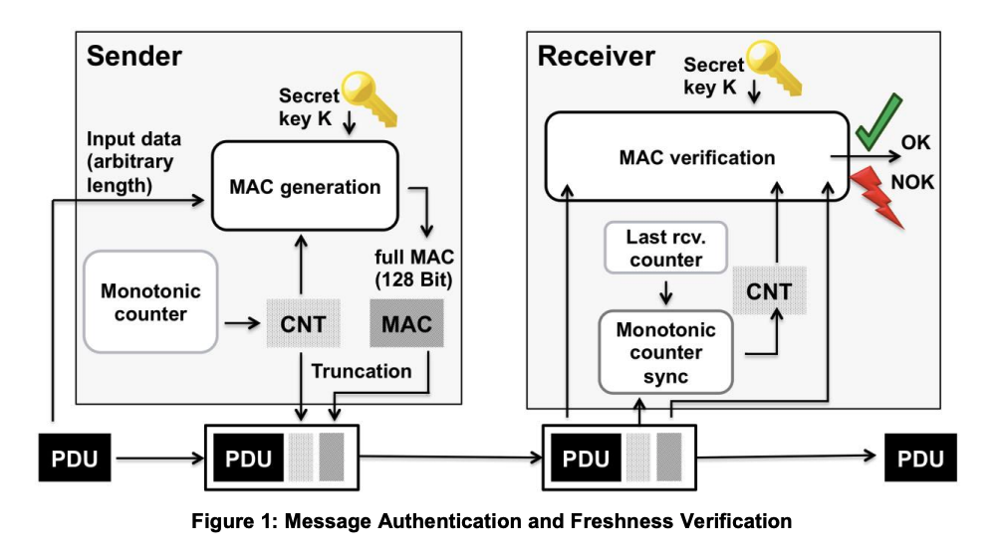

# SecOC

作为一种车载网络安全通信协议，Security Onboard Communication，简称SecOC。

SecOC是在AUTOSAR软件包中添加的信息安全组件（组件位置及可应用的通讯方式如下图所示），该Feature增加了加解密运算、秘钥管理、新鲜值管理和分发等一系列的功能和新要求。SecOC模块在PDU级别上为关键数据提供有效可行的身份验证机制。认证机制与当前的AUTOSAR通信系统无缝集成，同时对资源消耗的影响应尽可能小，以便可为旧系统提供附加保护。该规范主要使用带有消息认证码（MAC）的对称认证方法。与不对称方法相比，它们使用更小的密钥实现了相同级别的安全性，并且可以在软件和硬件中紧凑高效地实现。但是，规范提供了两种方法必要的抽象级别，因此对称和非对称身份验证方法都可使用。

secoc 在交互层协议数据包（I-PDU）层面，实现有效的、可实现的关键数据认证机制。

这种认证机制与现有AUTOSAR 通信系统无缝对接，提供完整性和认证安全需求。

SecOC试图防止两类威胁：
- 防止有害硬件融入通信网络，成为合法节点
- 利用已有ECU发送或修改发往总线的数据。这个工作由加密栈功能实现，如hash计算、生成和验证消息验证码、随机数生成、加密和解密使用对称或非对称算法、生辰和验证数字签名、密钥管理选项。

> 根据 Requirements on Secure Onboard Communication ：
> SecOC的目的是提供一个AUTOSAR BSW 模块，在两个或多个设备间发送安全的数据，在车载嵌入式网络中交换数据。

> 根据 “Specification of Secure Onboard Communication Protocol”
> 敏感数据的认证和完整性保护，对于车辆系统是保护功能正确和功能安全的必要手段。它确保了模块接收到的数据来自正确的ECU，并且具有正确的值（未被篡改）。
> 该文件中描述了SecOC模块必需实现的功能，以验证PDU的认证信息和新鲜度值。
> 为了提供消息新鲜度，SecOC 模块会在发送和接收侧从额外的新鲜管理器处获得新鲜值，以保证可唯一识别每个Secured I-PDU，例如对每个安全的通信链路。
> 在发送端，SecOC 模块通过在准备外发的Authentic I-PDU上增加认证信息，以生成一个Secured I-PDU。认证信息由一个Authenticator（例如MAC）和新鲜值选项构成。无论新鲜值是否包含在Secured I-PDU载荷中，新鲜值被认为在Authenticator 中生成。在向接收方提供认证信息之前，新鲜度管理器应增加新鲜度计数器。
> 在接收端，SecOC 模块检查freshness 和认证信息。

## 车载网络安全技术
|层次|保护和访问限制|威胁检测|攻击响应|漏洞修复|
|-|-|-|-|-|
|V2X互联安全|设备认证、PKI、传输加密|IDS 数据记录、流量历史、深度检查|IPS 流量控制、消息过滤、深度检查|OTA 在线升级|
|车辆架构|架构的物理和逻辑隔离、网关防火墙|IDS 数据记录、流量历史、深度检查|IPS 流量控制、消息过滤、深度检查|OTA 在线升级|
|网络通信|SecOC、豹纹数据加密诊断刷写安全机制、以太网安全通信机制（VACL、ACL、MACsec、IPSec、TLS、DTLS）|IDS 数据记录、流量历史、深度检查|IPS 流量控制、消息过滤、深度检查|OTA 在线升级|
|ECU及接口|系统和存储分区、调试接口禁用、安全启动、刷写、存储|IDS 数据记录、流量历史、深度检查|IPS 流量控制、消息过滤、深度检查|OTA 在线升级|

SecOC 涉及数据访问与保护

## 数据保护

造成数据传输发生问题的原因包括：
- 系统错误
  - 硬件相关错误
    - 寄存器错误
    - 。。。
  - 软件相关错误
    - RTE 错误
    - 。。。
- 攻击
  - 针对数据的攻击，例如窃听、篡改、损坏
  - 针对协议的攻击，例如重放、端口扫描、畸形协议、DoS

数据保护的方法：
- 校验
  - CRC
  - 签名
- 计数
  - Counter
  - 全局时间
- 加密
  - 对称
  - 非对称
- 过滤
  - 防火墙

### checksum+counter

- counter：发送一次报文+1，几乎不定义错误场景
- checksum：
  - 异或校验
  - 奇偶校验
  - crc校验

常见的 CRC 类型：
- 8-bit CRC 
  - 8-bit SAE J1850 CRC
  - 8-bit 0x2F pilynomial CRC
- 16-bit CRC
  - 16-bit CCITT-FALSE CRC16
  - 16-bit 0x8005 polynomial CRC
- 32-bit CRC
  - 32-bit Ethernet CRC 
  - 32-bit 0xF4ACFB13 polynomial CRC
- 64-bit CRC 
  - 64-bit ECMA polynomial CRC

例如：
CRC result width： 8 bits
- polynomial：0x1Dh
- initial value：0xFFh
- input data reflected: No
- result data reflected: No
- XOR value: 0xFFh
- Check: 0x4Bh
- Magic check: C4h

### E2E
场景1：SWC1-1 发送数据到 SWC-2，依次发送了counter 为 1，2，3，之后 SW-1 发送counter 为4 的报文给 SWC-3，之后再次给 SWC-2报文 5，6。这里报文的counter 有跳跃，不连续。

场景2: SWC1 以20ms周期发送请求，COM 以40ms周期发送报文，那么SWC-2收到的信息就会有重复2次。

场景3: SWC1 以40ms周期发送请求，COM 以20ms周期发送报文。

接收方如何判读？

#### counter
针对发送请求，最大值为14.
- 引入 MaxDeltaCounter ，设置允许counter计数器跳变的最大值，若接收方发现当前counter和上一counter的差，超过了MaxDeltaCounter，则认为不合理。
- 引入UB （update bit），SWC-1 每次发送消息后，RTE会将UB置1，底层COM口发送消息后，UB置0。这意味着，RTE会在UB=1时发数，而UB=0时不会将SWC-1的消息转发。即便SWC-1 不断发送重复数据，通过UB设置，可以防止重放。

#### CRC
E2E 采用了多种CRC类型，且会多次使用。

还会在计算时采用Data ID，类似密钥，2字节，有4种使用模式：
- BOTH：2个字节参与计算
- ALT：根据Counter奇偶计算不同字节
- LOW：只计算低字节
- NIBBLE：只使用12bit；高字节会发送到总线；低字节只参与计算。

#### profile
即配置方式。

在autosar 标准中，E2E profile 号有：1，2，4，4m，5，6，7，7m，8，11，22，44等类型，还有一些变体（Variant）。

#### variants
即标准profile 的变体。

#### E2E 库

由多种profile构成。

对E2E 的调用，可以有三种形式：
- wrapper
- callouts
- transformer

不同的库调用方法，反映了不同位置序列化数据的方式。

## SecOC

### MAC （消息校验）

基于AES-128 的CMAC算法。

### DATA-ID
同E2E， 128bit
但使用方法单一

### Key 
128位
#### MAC 生成

MAC 是受保护数据的身份认证。可以由多种算法生成，每个算法还可以多种配置。例如可以使用profile1中提供的方案 cmac/aes-128 算法，截取 8bit 新鲜度值和 24bit MAC ，配置信息如下：
- Algorithm：CMAC/AES-128
- Length of Freshness Value ：Not specified
- Length of truncated Freshness value ：8 bit
- Length of truncated MAC：24bit

MAC生成还需要128 bit的密钥（这里假设预先定义了0x0102030405060708090A0B0C0D0E0F10）、16 bit的Data ID（这里预先定义了33）、完整的新鲜度值和需要认证的数据。Data ID是用来标识I-PDU的数据，可以给密钥管理机制提供支持。以demo中时间戳为8.300203的I-PDU进行说明，需要认证的数据为0xE8030000000000FF，完整的新鲜度值为0x100000405，实际进行加密运算的数据为Data ID、待认证数据和完整新鲜度值的拼接，计算后的实际MAC为0x498330e818f3fbb068759ff3b72d015f，截取24 bit后发送的MAC为0x498330。
 

### FV 新鲜度值
secoc中，有多重freshness management 方案：
- 单独基于 counter 的递增型方案
- 基于全局 timestamp 的方案，源于时间戳的一致性
- 基于同步的复合 counter（multiple freshness counters），这种方案最为优秀。

#### 基于同步的复合 counter / secoc multiple freshness counters（truncated freshness value）
完整的新鲜度值包括包括：
- 同步计数器（trip counter）
- 重置计数器（reset counter）
- 重置标志值（reset flag）
- 消息计数器（message counter），又分为高值和低值。

但是真正发送的值，一般是裁剪过的，只包括消息计数器的低值和重置标志值。

在canoe提供的Demo例子(C:\Users\Public\Documents\Vector\Security Manager\CANoe Sample Configuration\General\CANoe_11\Autosar SecOC TripBased)中，新鲜度值为 0x10000040F，实际发送的新鲜度值0xF。由于重置标志位位 1bit，消息计数器虽然以步长1递增，实际发送到总线上的新鲜度值则是以2的补偿递增的。

新鲜度值存在2个重要的基准：
- 同步计数器 trip counter
- 重置计数器 reset counter
- 这两个计数器在收发两端要保持一致。
- secoc对新鲜度值提供了主从模式，主节点向接收方和发送发分发同步计数器和重置计数器，从而达到同步目的。

SecOC 包括4 类节点：发送节点、接收节点；主节点和从节点。

- freshness value： 新鲜度数值，作用于发送节点和接收节点
- synchronization message：同步消息，作用域主节点和从节点

##### freshness value
从MSB（最高位）到LSB（最低位），SecOC Freshness value 包括：Trip Counter + Reset Counter + Message Counter （即 MsgCntUpper+MsgCntLower）+Reset Flag。其长度被称为SecOC Freshness value length。

特别地，MsgCntLower+Reset ，又被称为SecOC Freshness value Txlength 部分。

##### synchronization message

synchronization message这部分从MSB（最高位）到LSB（最低位）由 Trip Counter + Reset Counter + Authenticator 构成。

##### counter 计数规则

- TripCnt ：
  - 增长条件：（1）当FV管理master ECU 启动；（2）On wakeup；（3）On reset；（4）当电源状态变化为：IG-OFF=>IG-ON", 每次加1.
  - 初始条件：在TripCnt达到最大值时，MsgCnt增长条件形成。
  - 初始值：FV managment master ECU ：1；Slave ECU：0.
  - 计数长度：TripCnt 长度最大24位。
  - 达到最大值时会重置；

- RstCnt
  - 增长条件：每个固定时间间隔（ResetCycle）加1.
  - 初始条件：TripCnt增加或初始化时。
  - 初始值：FV managment master ECU ：1；Slave ECU：0.
  - 计数长度：TripCnt 长度最大24位。
  - 达到最大值时会维持最大值；

- MsgCnt
  - 增长条件：每个消息传递加1.
  - 初始条件：在RstCnt增长或初始化时。
  - 初始值：Slave ECU：0.
  - 计数长度：MsgCntLength max 24位。、
  - 达到最大值时会维持最大值；

MsgCnt 依赖于 RstCnt ，RstCnt 依赖于 TripCnt，TripCnt 依赖点火（循环）。

主节点会给从节点分发 TripCnt 和 RstCnt，从节点反馈MsgCnt。

- Latest value：最新的值，来自于主节点的同步信息
- Previous value：先前的值，成功发送和成功接收
- receive value：接收的值

## checksum+counter 、E2E、SecOC 对比

相似点：
- 附加校验码来保证数据正确性，附加counter 保证消息的更新
- 不实现加密功能，数据可以被窃听
- 可选多种算法、策略

差异点：
- 由于存在密钥，secoc更难被破解，防攻击能力更强；
- 由于e2e是针对swc，secoc针对COM，e2e发现错误的面更广
- 三类方法的校验码的算法，counter 的策略有很大差异。

自定义内容举例：
- data id：可以使用can id  or 单独定义id
- e2e校验数据的序列化方式：填充、对齐、排序、大小端；是否与报文中字节一致
- secoc的密钥：分发、更新、丢失、密钥转换
- 同时应用checksum+counter，secoc ，e2e

## 附录
## Autosar 标准： Requirements on Secure Onboard Communication
### 名词

- I-PDU：交互层协议数据单元（在Autosar COM中封装或解包），由一个或多个信号组成。
- L-PDU：数据链路层协议数据单元（在autosar 硬件抽象层封装或解包）
- N-PDU：
- signal：在Autosar COM 上下文中的信号，相当于一个DOC——ISO-COM中的消息。
- Authentic I-PDU：一个Authentic I-PDU是任意AUTOSAR I-PDU，其内容在网络传输期间通过Secured I-PDU进行安全保护。安全内容包括完整的IPDU或I-PDU的一部分。
- secured I-PDU：一个Secured I-PDU是一个附有额外认证信息、包含Authentic I-PDU载荷的Autosar I-PDU。

### functional requirements

#### 配置
##### [ SRS_SecOC_00001 ] Selection of Authentic I-PDU
认证I-PDU可选择

SecOC配置器选择与I-PDU相应的PDU IDs应当是安全的，它应当能够增加安全相关配置来实现特定级别的安全

##### [ SRS_SecOC_00002 ] Range of verification retry by the receiver

验证重试的次数应当可被接收者配置。

##### [ SRS_SecOC_00003 ] Configuration of different security properties

不同安全属性应可配置。

#### 初始化

##### [ SRS_SecOC_00005 ] Initialisation of security information 

SecOC模块的安全配置信息应当在模块启动时进行初始化。

#### 正常操作
##### [ SRS_SecOC_00026 ] Capability to transmit data and authentication Information separately

SecOC 应当支持使用不同的消息（数据包）传输数据（Authentic I-PDU）和认证信息（Authenticator）。

##### [ SRS_SecOC_00028 ] Properly match up data and authentication information when verifying

当使用不同消息传递数据和认证信息时，SecOC 应当确保一个数据（认证I-PDU）使用正确的认证（Authenticator）来验证。

##### [ SRS_SecOC_00006 ] Creation of a Secured I-PDU from an Authentic I-PDU

安全信息（MAC 和 Freshness Counter）应当与数据（Authentic I-PDU）一起通信传输，并使安全的I-PDU可以根据协议能力被置于L-PDU或N-PDU中被传递。

##### [ SRS_SecOC_00007 ] Verification retry by the receiver
在接收端一旦验证失败，SecOC 模块应当提供一种方法结合自计算新鲜值，进行重复验证过程，直到在可配置的范围内验证成功为止。

##### [ SRS_SecOC_00010 ] Communication security is available for all communication paradigms of AUTOSAR 

一个安全ECU与另一个或多个ECUs的安全通信，应当提供某种机制。

接收消息的ECU应当能够验证信号的来源是某个有权限的ECU源，并且其发送的数据未被篡改。数据验证过程应独立于其他程序，每个ECU都应实现。对于无安全要求的ECU可以接收各种信号数据，且不做出验证计算。

#####  [ SRS_SecOC_00029 ] Flexible freshness construction

灵活的新鲜值构造。

认证PDU的新鲜值的生成应当有额外的组件生成和维护。既可以是SW-C也可以是复杂设备驱动（CD）

##### [ SRS_SecOC_00012 ] Support of Automotive BUS Systems

支持车载总线系统。

SecOC模块应当能够对Autosar中不同类型的总线系统和典型的车辆环境给以支持。

##### [ SRS_SecOC_00030 ] Support of capability to extract Authentic IPDU without Authentication

SecOC模块应当有能力在不经过认证就从Secured I-PDU 中提取 Authentic I-PDU。

##### 支持端到端和点对点保护
如果数据不是直连通信或经总线通信，而是经过多跳或网关进行转发，那么SecOC模块应当同时实现两种保护：端到端、点对点。

- 点对点安全通信：在点对点通信模式中，网络的每个单一点之间传递的数据应当是安全的，以至于多跳情况下，认证被执行多次，验证也被执行多次。
- 端到端安全通信：在端到端模式下，通信被发送者和接受者安全加固，而不担心中间跳。仅有的一次认证在发送节点被执行，而仅有的一次验证在接收节点被执行。
#####  [ SRS_SecOC_00017 ] PDU security information override
SecOC模块应当能够拒绝（override）PDUs的验证结果，强制验证失败并使该SecOC模块可以拒绝该消息。

##### [ SRS_SecOC_00020 ] Security operational information persistency

SecOC模块应当提供一种存储在NVM中的安全信息的安全持久化机制，这些安全信息用于在关机操作前的常规操作。

#### Fault Operation 错误操作

##### [ SRS_SecOC_00021] Transmitted PDU authentication failure handling

认证I-PDU一旦认证失败，不安全的PDU不应被发送。

##### [ SRS_SecOC_00022] Received PDU verification failure handling

接收到的PDU若验证失败处理

已接收的安全PDU一旦验证失败，认证的PDU不应被传递到别的模块，并且应当发出一个通知。
### 非功能需求
#### 计时需求
##### [ SRS_SecOC_00025] Authentication and verification processing time

认证和验证处理时间

认证和验证处理应当以时效方式执行，使实时关键信号不被影响。

### SAE J1850 bus 协议
> http://www.interfacebus.com/Automotive_SAE_J1850_Bus.html

该总线协议用于车载网络诊断和数据共享应用。这类总线有两种：
- 41.6Kbps Pulse width modulated （PWM）的2线差分方法（two wire differential approach)
- 10.4 Kbps Variable Pulse Width (VPW) 单线方法（single wire approach）。单线方法最大线长 35米，32个节点。

特性：
A high resides between 4.25 volts and 20 volts, a low is any thing below 3.5 volts. High and low values are sent as bit symbols (not single bits).
Symbols times are 64uS and 128uS for the single wire approach.
The bus uses a weak pull-down, the driver needs to pull the bus high, high signals are considered dominant.
A passive logic 1 is sent as a 128uS low level, an active logic 1 is sent as a 64uS high.
A passive logic 0 is sent as a 64uS low level, an active logic 0 is sent as a 128uS high.
The J1850 protocol uses CSMA/CR arbitration. The frame consists of a Start Of Frame [SOF], which is high for 200uS.
The Header byte follows the SOF and is one byte long. The data follows the header byte.
The one byte CRC [Cyclic Redundancy Check] follows the data field.
After the CRC an End Of Data [EOD] symbol is sent. The EOD is sent as a 200uS low pulse.

J1850 传输信号格式：SOF+Header+Data+CRC+EOD+IFR+CRC+EOF

现实中，J1850 常见于 OBDII 连接器中。

## secoc 测试
从上面看，SecOC 机制较为复杂，测试内容包括：
- 新鲜度值的管理
- MAC认证
- 密钥分发

为了保证ECU的运行环境、监测ECU自身行为，需要仿真外部条件，包括：
- 同步报文
- ECU接收的SecOC报文

为实现上面的环境，可以使用CANoe的Security 模块。

- 在CANoe 的security configuration 中，对secoc方案的进行选择和配置，并对其控制器进行映射。
- 在arxml中，可直接配置相关信息，包括dataid，新鲜度值长度等等。可以位每个i-pdu进行不同dataid的配置，从而形成i-pdu和dataid 的映射。
- Canoe的security manager中，可以对 dataid 进行其密钥的写入，实现密钥与data id 的映射。
- 使用canoe的security 模块，还可以集成canoe的secoc接口函数等进行编程来实现仿真环境。可以根据环境开发实现测试脚本，一方面验证正向正向SecOC流程；另一方面验证SecOC机制的防攻击特性。通过使用canoe的各个内置函数及外部第三方编程接口，对仿真条件进行相应的输入控制，并检测ecu的反馈，可以高效的完成secoc的验证。

## AUTOSAR_SWS_SecureOnboardCommunication

### SecOC 依赖

SecOC依赖下列功能：
- PduR：secoc模块依赖于PduR的API和能力：
  - 通信接口模块的api
  - 传输协议模块的api
  - 使用传输协议的上层模块的api
  - 处理来自通信接口模块的i-pdus的api

- CSM：secoc 依赖密码学算法（由CSM模块提供）
  - MAC-generate 接口（CSM_MacGenerate)
  - MAC_verify interface csm_macverify
  - signature-generate interface
  - signature-verify interface
  - key management interface

- RTE:secoc 模块提供一个有管理功能的api，这些功能有点来自于RTE
  - secoc associatekey
  - secoc verificationstatus
  - secoc verifystatusoverride

### 安全配置（profiles）

autosar提供的secoc标准，允许使用多种不同的密码算法和模式来进行MAC计算，以及不同方式的截取MAC和Freshness value。

安全配置提供了一个与secoc相关的配置参数构成的子集。

每个安全配置应明确：
- 认证算法 authAlgorithm
- 新鲜值长度 SecOCFreshnessValueLength
- 截取新鲜值的长度
- 截取MAC的长度
- profile描述

安全配置在系统模版中应当通过下列强制参数定义：
- authAlgorithm :String[ 0..1 ]
- authInfoTxLength: PositiveInteger
- freshnessValueLength: PositiveInteger
- freshnessValueTxLength: PositiveInteger

#### SecOC profile 1

使用基于 NIST SP 800-38B AES128的CMAC算法， 使用freshness 值的最低8有效位作为截取的新鲜度值，使用最高的 24 个有效位作为截取的MAC值。

- algorithm: CMAC/AES-128
- SecOCFreshnessValueLength: Not Specified
- SecOCFreshnessValueTxLength: 8bits
- SecOCAuthInfoTxLength: 24bits

#### profile 2
这个配置不使用新鲜度值。

- algorithm: CMAC/AES-128
- SecOCFreshnessValueLength: Not Specified
- SecOCFreshnessValueTxLength: 0 bits
- SecOCAuthInfoTxLength: 24 bits

#### profile 3

这种情况下，使用了JasPar 计数器作为FV，使用了主从同步方法。

- algorithm: CMAC/AES-128
- SecOCFreshnessValueLength: 64 bits
- SecOCFreshnessValueTxLength: 4 bits
- SecOCAuthInfoTxLength: 28 bits