# TARA

## 智能网联汽车风险评估
2017年，SAE出台J3061《信息物理融合系统网络安全指南》，旨在通过统一全球标准，来推动汽车电气系统与其他互联系统之间安全流程的建立。信息安全问题不会导致新的安全隐患（即新的不安全状态），但会改变现有隐患的发生概率，甚至使以前认为不可能发生的隐患变为可能。因此在系统设计的过程中，必须同时兼顾信息安全和功能安全。SAE J3061与ISO 26262标准之间具有一致性，保证了汽车电子电气的功能安全之外，还保证了非安全关键领域，例如用户数据隐私或资产方面。对于智能网联汽车，

SAE J3061对概念阶段的信息安全问题制定了指南，并提出在概念阶段就要建立威胁分析和风险评估（TARA）的框架。

在系统信息安全分析过程中，威胁模型有助于信息安全研究员了解软件、应用程序或系统结构可能受到攻击的不同方式。建模过程有助于识别系统的弱点，识别弱点后再对威胁进行分类，最后采取相应的对策解决问题。本文所讨论的威胁模型，也是基于TARA框架来建立的，在此命名为TARA+

从 SAE J3061 到 ISO 21434 威胁分析与风险评估（TARA）均被作为核心的网络安全分析方法，已经成为ICV网络安全功能开发实施与测试的前提和基础。

TARA的目的不是计算攻击概率和影响的精确数值，而是为汽车整车厂（OEM）生成相对值，在后续过程中对相关风险分组和排序。

### EVITA
参考了ISO 26262 中的功能安全评估方式，并结合了信息安全特点进行扩展，将非功能安全和多车场景纳入其中。

最后使用THROP评估方法将所有的威胁和风险进行统一整理，并最终形成信息安全开发优先级，在保证整车总体信息安全基础上，合理分配研发资源。

### HEAVENS
J3061 介绍了HEAVENS评估方法，鉴于当前ICV信息安全风险评估具体指导意见、方法和标准尚未出台，梆梆建议可以根据实际情况，采用EVITA、HEAVENS或其他方法对ICV进行评估。

HEAVENS 针对汽车电子电气系统威胁分析和风险评估的方法，提供了完整的评估流程、其目标是提出一种系统方法，一边可以获得汽车电子电气系统的信息安全需求。

HEAVENS有4个特点：
- 适用性范围广泛，可适用于乘用车和商用车；
- 以威胁为中心，同时采用微软 STRIDE 对电子电气进行威胁评估
- 在威胁分析期间建立了安全属性与威胁之间的直接映射关系，有助于及早评估特定资产对特定技术的影响程度，这种影响程度包括机密性、完整性、可用性。
- 将安全目标（例如信息安全、财产、操作、隐私和法规等）与威胁分析期间的影响度相结合，有助与评估威胁对相关利益方。

HEVAENS 相比于 EVITA 更完整，除了评估方法，还提供了一套评估流程，分了三个阶段：
- 威胁分析
- 风险评估
- 安全需求

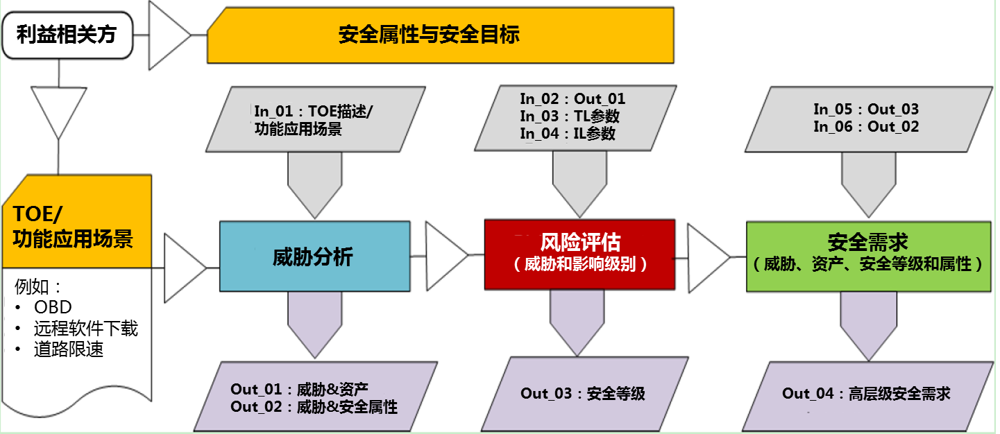

主要的步骤：
- 利益相关方梳理
- 各方安全属性与安全目标定义
- 功能及信息安全应用场景（TOE）定义
  - 可能的场景有：
    - OBD
    - OTA
    - 融合泊车
    - 自适应巡航
    - 车道保持
    - 开门预警
    - 智能限速提醒
    - 远程泊车
    - 哨兵模式
    - 影子模式
    - 智驾大数据
    - ...

- 各场景下的资产分析
- 各场景下的数据流分析
- 各场景下的网络通信分析
- 各场景下的威胁分析（基于STRIDE方法）
  - 输入
    - 输入1.TOE描述、功能应用场景
  - 输出
    - 输出1.威胁与资产映射
    - 输出2.威胁与安全属性映射
- 各场景下的风险评估（确定风险等级）
  - 输入
    - 输入2：输入1
    - 输入3：威胁等级参数（威胁等级通过4个参数评估：经验、评估对象的知识、所需设备和机会窗口）
    - 输入4：影响等级参数
  - 输出
    - 输出3：安全等级
- 各场景下的安全需求确认
  - 输入
    - 输入5：输出3
    - 输入6：输出2
  - 输出
    - 输出4:高层级安全需求

### 威胁等级确定

四个参数来评估威胁等级。

即经验、评估对象的知识、所需设备和机会窗口，针对这四个参数进行分值评估。这四个参数在EVITA中也有提及，但是评估内容有所区别。

#### 经验：

|参数 |数值 |解释|
|-|-|-|
|非专业人员 |0 |没有任何专业知识 |
|精通 |1 |对信息安全领域有一定了解并且是从业者|
|专家 |2 |熟悉底层算法、协议、硬件、架构、安全行为，并且可以定义并开发新的攻击技术和工具|
|多领域专家|3|需要不同的专业领域来进行不同的攻击步骤|

#### 评估对象的知识（Knowledge about TOE）

|参数 |数值 |解释|
|-|-|-|
|公共|0|通过公开途径获取，比如网络、书店等|
|受限|1|例如仅能在产品开发部门获取的知识|
|敏感|2|例如在开发部门某几个团队之间共享的知识，并且对其的访问仅限于指定团队成员|
|重要|3|例如只有少数人才能知道的知识且需要在严格控制下|

#### 所有设备（equipment）
|参数 |数值 |解释|
|-|-|-|
|标准|0|该设备可以是评估对象本身的一部分获可以容易地获得|
|特殊|1|例如购买一些专用设备或编写攻击脚本或程序|
|定制|2|设备不容易为公众所用，因为它可能需要专门的生产，或者因为设备非常专业以至于其受控销售等|
|多种定制|3|使用不同的定制设备实现不同的攻击步骤|

#### 机会窗口

|参数 |数值 |解释|
|-|-|-|
|非常高|0|通过公共网络就可以实现访问和攻击，并且不受任何限制|
|高|1|可实现远程访问和攻击|
|中|2|在不使用特殊工具情况下，很难评估对象进行物理接触式的访问和攻击|
|低|3|评估对象非常难以拆卸，也无法通过物理接触式的方式实现对评估对象的攻击|

#### 小结

通过使用这些参数对评估对象的威胁进行评估，然后根据参数值进行等级划分，具体划分原则如下所示。采用无、低、中、高和严重，这五个等级，同时得出TL具体分值。

|TL参数值总和 |威胁等级（TL） |TL数值|
|-|-|-|
|大于9|无|0|
|7～9|低|1|
|4～6|中|2|
|2～3|高|3|
|0～1|严重|4|

#### 影响等级

影响等级（Impact Level）主要是指确保车辆乘客、道路和基础设施安全的要求。针对于这部分的评估参数主要由功能安全、财产损失、操作和隐私及法规这四部分构成。这部分的评估相对会比较复杂，既涉及到功能安全，又涉及到信息安全隐私，甚至还需要和法规有关系，因此该部分参考的标准较多，除了ISO26262外，还会参考BSI的相关标准。

功能安全借鉴了ISO 26262-3概念阶段中HARA的评估参数，即严重性（Severity）来实现，具体评估内容如下表所示。严重性在实践落地中可以采用AIS进行参考，这也是ISO 26262中所推荐的。

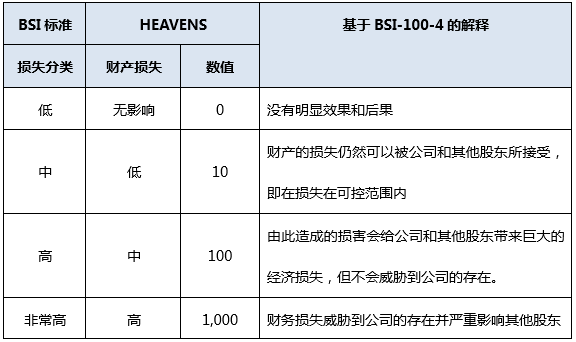

#### 财务损失

财务损失主要指的是相关利益方，比如整车厂的财产损失，这个和整车厂的财务实力有关。HEAVENS将限额表示为总销售额、总利润或类似基值的百分比，并且需要将损害定性地分类而不是定量计算损失。这部分评估借鉴了BSI-100-4中的内容。具体评估内容如下表所示。

#### 操作性

操作性主要是通过车辆缺陷程度对其进行评估，可以借鉴功能安全中的FMEA方法来实现，具体评估内容如下所示。

隐私和法规是两个概念，隐私指的针对车主、车辆运营方和驾驶员等的隐私侵犯；法规是指车主、车辆运营方和驾驶员等因为驾驶违背了相关法律法规，比如环境和交通法规等。具体隐私和法规的相关评估内容如下表所示，该部分评估内容主要与BSI中的“隐私影响评估指南”保持一致。

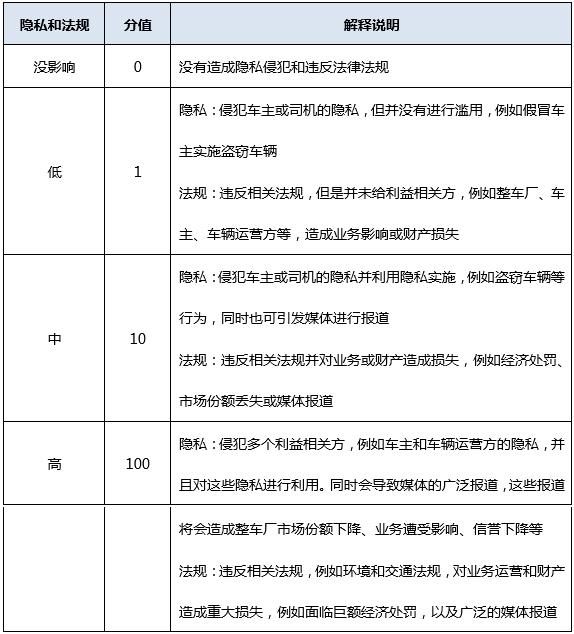

经过上面的功能安全、财产损失、操作和隐私及法规这四部分的评估，可以评估出影响等级（Impact Level），具体分级如下所示:

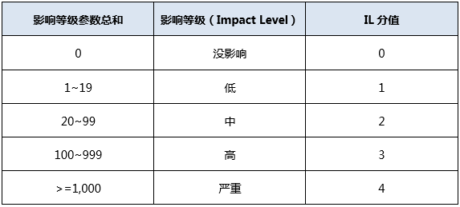

通过上面的评估，完成威胁等级和影响等级评估获得TL和IL分值后，就可以通过两个参数的矩阵共同决定安全等级（Security Level），具体评估如下所示。

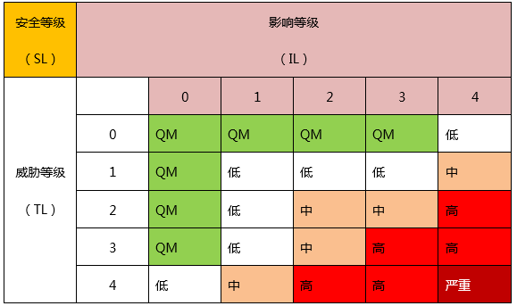

安全需求

HEAVENS的最后部分是安全需求，即对资产、威胁、安全属性和安全级别进行评估的列表，研发人员根据列表中的安全级别，确定开发优先级。需要注意的是，有可能存在一个资产会存在多个威胁，因此这个资产也会有多个安全等级，在进行开发的时候，通常的做法是关注安全等级最高的。下面给出两个最终评估完成的例子，供参考。

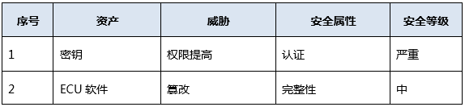

梆梆安全研究院认为HEAVENS和EVITA相比具有如下相同点：首先，二者都是同功能安全相结合，并且借鉴了ISO 26262-3中的HARA评估方法和思路；其次，二者都可以应用于汽车电子电气系统的信息安全评估；最后，二者都关注财产和隐私，而这两个也正是信息安全关注的核心。

梆梆安全研究院认为HEAVENS和EVITA相比也有不少不同点：首先，HEAVENS除了评估方法外，还形成了一整套评估流程；其次，HEAVENS在影响等级评估方面除了隐私和财产外，还将操作性和法规纳入到影响度评估范围中，评估的维度比EVITA要大；最后，HEAVENS的评估内容除了参考ISO 26262外，还借鉴了BSI相关标准，使得评估的可信程度得到了一定的提高。

智能网联汽车信息安全建设需要在规划阶段开始，威胁分析与风险评估是整个信息安全建设的基石，梆梆安全研究院认为可以采用HEAVENS作为J3061在车厂信息安全威胁分析与风险评估的实践落地，梆梆安全研究院同时也在多个智能网联汽车项目中，采用该方法同EVITA、ISO 26262等标准相结合的方式进行安全评估，因此具有较强的借鉴意义。

## TARA+

基本思路：
- 使用一个参考架构来弥补概念阶段系统信息的缺失。
  - 一方面侧重实施攻击的难度
  - 一方面侧重于系统的承受能力而非其系统的漏洞
  - 这种设计应允许对风险进行早期评估
- 驾驶员应在可控性的考虑范围之内，可控性应被定义为自动驾驶系统和驾驶员的一种属性。
  - ISO 26262 中，未涉及驾驶的自动化程度，其中隐含了一个假设，即人类驾驶员始终在车中（这与信息安全分析是相反的）。
- 侧重点方面应局限在利用自动驾驶方面，特别是利用目标应用程序实施的攻击。
- 分析的侧重点应放在L3和L4有条件的高度自动驾驶系统上。这种级别的自动驾驶系统中，人类驾驶员应当保持较强货较弱状态，以便偶尔进行人机交接。

### 模型的构架

- 根据SoA中定义的攻击潜力和攻击影响对威胁量化；
- 全新的“可控性”因素
- 篡改后的攻击影响计算，气冲包括“可控性”
- 基于攻击可能性和提出的完善后的影响的2D风险矩阵
- 超出车辆本身的攻击面分析，包括对攻击可控性的考虑。

### 自动驾驶的若干攻击面分析

#### 攻击面1：距离、传感器（雷达、超声波、激光雷达）

- 相关攻击方法：
  - 身份欺骗
  - 篡改攻击
  - DoS

- 专业知识：精通
- 设备要求：光电收发器、信号发生器
- 机会窗口：小，收到时空频能调制的限制，例如雷达取决于激光雷达脉冲发射频率
- 可控性注意事项：
  - 传感器的冲突检测应采用传感器融合技术。攻击会影响传感器的感知功能（及系统预期功能复合ISO/PAS 14446），但不会引起传感器故障。荣誉的传感器使其在可控制范围内。
  - 在城市场景下，车辆与路边的距离较近，行驶速度较低，更容易设置攻击设备。将攻击设备安装在路边，通过静态设备，可以瞄准传感器，会造成压制干扰或欺骗干扰。

#### 攻击面2 视觉传感器

- 相关攻击方法：
  - 身份欺骗
  - 信息篡改（错误数据）
  - DoS

- 专业知识：业余（通过极端的白光就可使摄像头致盲）
- 设备要求：光源（LED点阵）
- 机会窗口：小，在传感器检测范围内才可
- 可控性注意事项：
  - 假设传感器具有自动控制功能，并正在检测异常或超出阈值，则可以使闯敢骑在可控范围之内。传感器融于的增加，也会提高传感器的可控性。如果传感器本身没有异常检测，则应采用传感器融合技术来检测传感器的冲突检测。
  - 如果从动态设置来考虑，将光源设置于引导车辆，则攻击效果更佳。
  - 如果从静态设置来考虑，将光源设置于在特殊位置（例如交通信号灯附近），被攻击的车辆上的传感器则会停止运行一段时间。
  - 由于摄像头可能无法恢复运行，且其他传感器无法执行特定的视觉任务（例如红绿灯识别），在城市案例场景下，攻击造成影响比较显著。

#### 攻击面3 遥控钥匙控制/泊车应用程序的智能手机控制

- 相关攻击方法：
  - 身份欺骗
  - 信息篡改（错误数据）
  - DoS
  - 越权访问（获取AD ECU的权限）
  - StepStone攻击

- 专业知识：精通（精通蓝牙、无线电信号干扰）
- 设备要求：可复制BlueTooth/无线电信号并进行传输的设备
- 机会窗口：中等（在无线信号范围内或在有LTE网络范围内）
- 可控性注意事项：
  - 假设已部署合适的IDS系统和系统分离，则在可控制范围内。
  - 无线电、蓝牙是车辆开放接口，对其攻击可导致信号阻塞和身份欺骗，从而实施车辆盗窃、损害，甚至控制汽车以伤害行人。

#### 攻击面4 车载wifi

- 相关攻击方法：
  - 数据监听
  - 身份欺骗
  - 信息篡改（错误数据）
  - DoS
  - 越权访问（获取AD ECU的权限）
  - StepStone攻击

- 专业知识：专家或复合专家（精通wifi信号欺骗和干扰）
- 设备要求：具有wifi连接设备
- 机会窗口：中等（在车辆wifi信号范围内）
- 可控性注意事项：
  - 假设网关受到足够保护（防火墙、数字证书，并确保出站连接智能由车辆启动），则可以通过适当的IDS系统和系统分离，使其在可控制范围内。
  - 通过车载wifi的攻击可能并不会直接对ecu进行攻击，但攻击方可能通过wifi来利用信息娱乐系统或tcu。
  - telematics 可提供声音、数据无线网络，并可能连接到所有的can总线。

#### 攻击面5 道路结构元素（例如交通灯、车道）

- 相关攻击方法：
  - 身份欺骗
  - 信息篡改（错误数据）
  - DoS
  - 越权访问（获取AD ECU的权限）
  - StepStone攻击

- 专业知识：业余或精通（基于视觉的感知干扰）
- 设备要求：可能导致物理路面或交通标志变形的材料（例如颜料）干扰道路标志内容显示的专用设备。
- 机会窗口：不限
- 可控性注意事项：
  - 由于目前还没有高清地图，二动态定位和匹配是一个运行时间密集的过程，所以很难检测到被篡改的交通标志。
  - 由于该攻击方式可以独立于车辆执行，所以对于攻击者来说容易实现。该攻击会影响车辆的自动定位能力，并可能导致基于视觉伪像检测到物体产生误报（例如，在路面上绘制3D物体）。

#### 攻击面6 ECU攻击
针对以后的电子电器架构，可以提出对应的层级信息安全架构。

Layer1：单个的ECU层级：这一层主要是要保证ECU的软件和数据完整性，主要体现为：
Layer2: 车辆内部节点通信层级：这个层级聚焦在车辆内部通信，比如CAN、Ethernet、Flexray等，这个层面主要要保证通信信号的可靠性和完整性（有的攻击是通过功能CAN信号来触发一些特殊功能）。

Layer3：网关层级：这个层级要求隔开网关与各域控制器保持适当“距离”，中间加入安全隔墙。

Layer4：防火墙层级：要求车辆与外界的通信，需要加上防火墙（与PC的防火墙同一个概念）。

汽车ECU关注的方面：
- ECU不可被恶意刷写；
- ECU不可被外界通过诊断或标定接口恶意更改策略；
- ECU的内存不可被外界访问，需要保护起来；
- ECU不可被外界通过调试接口访问或恶意更改；

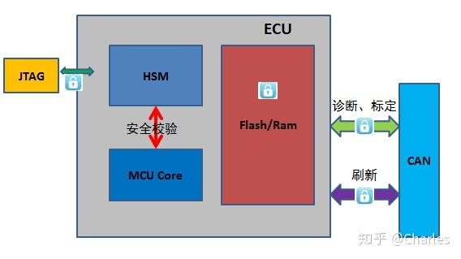

对于ECU层级的Security，HSM很关键，HSM的全称是Hardware Security Module，如下图所示，左边是我们熟悉的Tricore及相应的外设，右边就是HSM，中间隔了一层Firewall，可以有效保护HSM。HSM本身有自己的内核，可以做一些加密解密运算，同时内部也有一些Module是做各种安全算法的，比如ECC256，Hash算法等，还有随机数生成TRNG；另外HSM也有自己独有的RAM和Flash，只有HSM的内核才可以访问，Tricore是访问不了的。有了HSM，我们可以将一些Key存储在HSM的Flash，也可以通过HSM来进行加密或解密，这样安全性会得到相应的保证。

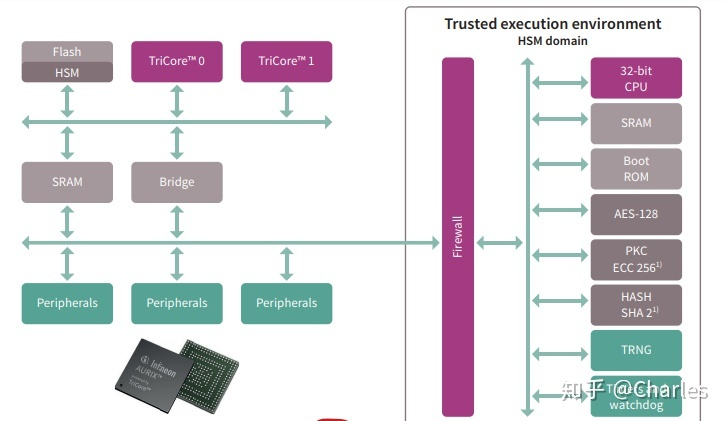
ECU的工程应用：

1）刷新的安全性

目前汽车ECU使用的刷新协议都是UDS On CAN，那我们怎么去保证刷新的安全性呢？

第一，我们可以使用27服务，来禁止未经授权的刷新，通过Seedkey的校验方式来进行，这种SeedKey的校验可通过HSM来进行，提高安全性；

第二，我们需要确保数据来源的可靠性，这个可以通过数字签名的方式来进行保证；将事先将我们要刷入的软件进行签名，将签名的文件和要刷入的软件一起传到ECU中，ECU只有完成了签名认证，才会完成数据的刷写，否则拒绝刷写。

在这里简单提一下加密的原理：

当前比较流行的是非对称加密，即存在公钥和私钥，两者是一对的，私钥要经过严格保存，公钥可对外开放。根据接收者还是发送者拥有私钥，有两种应用场景：

第一种是私钥在接收方手里，这样的话可以做到加密解密的作用，即发送方使用接收方给的公钥加密报文，该报文发出去之后，其他人没法查看，只有Bob使用它的私钥可以解开，这样就体现了秘密传输的作用了；

Encryption/Decryption示意图
第二种是私钥在发送方手里，这样的话就实现了签名和认证的作用，即私钥在发送方手里，当接收者接收到这个报文时，可以使用手里的公钥进行解密，且手里的公钥只能解密相应的私钥加密的报文，这样可保证数据来源的可靠性。但是存在另一个问题，就是假如黑客给了一个公钥给接收者，自己用对应的私钥进行加密报文，并将密文发给接收者，接收者还是收到了不可靠的密文，为了解决这个问题，需要一个认证机构来证明对应的公钥是可靠的，即发送方需向自己的公钥发送给权利机关，权利机关会将公钥和其他相关必要信息放在一起进行Hash计算，生成一个证书，这个证书就可以证明公钥是可信的。

Signing/Verification示意图
2）标定/诊断功能

标定、诊断是通过XCP、UDS的通信协议来实现的，可通过安全访问来进行限制，与刷新的安全校验原理类似；

3）通信功能

通常我们不会将传输的报文进行加密，因为汽车总线上CAN通信报文非常多，不可能对每帧进行加密，然后传输，再解密，可能会消耗很多计算资源。我们可使用在CAN报文的基础上加上一段密文，我们称之为MAC（Message Authentication Code，这段是基于要发送的报文，经过Hash运算得到的密文，采用对称加密，即加密和解密使用的是同一把钥匙），随着报文一起发送出去，到接收方时，会使用秘钥进行验证，只有算出的Hash值与MAC一致，才认为该帧报文传输是正确的。（MAC的校验也可通过HSM来进行）

MAC校验示意图
而随着MAC的需要，普通的CAN传输肯定满足不了需求，因为普通的CAN每帧只有8字节，如果除了MAC以外，实际传输的内容就会很少，这就影响了传输效率，所以CANFD应运而生。

4）Debug接口

Debug接口在ECU批产后，会使用相应话的配置初始化（比如IFX芯片可通过配置UCB的方式实现；ST芯片可通过DCF的方式来实现），将Debug保护起来，只有提供正确的Password才可解开Debug接口，进而可以对ECU进行调试。

https://zhuanlan.zhihu.com/p/37966075

#### 攻击面7 人工智能故意威胁
故意威胁包括恶意攻击，是通过人工智能和机器学习方法中存在的局限性和脆弱性进行的，旨在造成预期的犯罪和伤害。故意滥用AI会产生新的漏洞并提高潜在影响的上限，从而改变当前的网络安全格局。由于AI系统倾向于参与高风险的决策，因此针对AI的网络攻击可能会产生严重影响。AI还可以充当网络犯罪的推动者：网络犯罪分子可以使用AI自动化攻击各个方面，从而使他们能够更快、更大规模、更低成本、更高精度地发起攻击。

自动驾驶汽车属于故意威胁。

##### 自动驾驶中有关攻击AI的场景

大量的研究工作正在发现自动驾驶汽车的AI安全问题和漏洞，并提出潜在缓解方法，着重指出了车辆本身和相关基础设施受到损害的潜在影响，与不同的传感器、控件和连接机制相关的威胁已经被明确指出。除了上一节讨论的特定于机器学习系统的漏洞之外，与AI相关的安全问题还利用了数字系统中更为经典的硬件和软件漏洞，从而扩展了标准攻击向量。更准确地说，通常的一些安全问题和漏洞包括：

- 传感器卡塞、欺骗和致盲/饱和：传感器可能被蒙蔽或卡住。这样，攻击者可以操纵AI模型，向算法提供错误数据或有意提供稀缺数据，从而降低自动决策的效率。

- DoS / DDoS攻击：中断自动驾驶汽车可用的通信渠道，使其本质上对外界盲目。它直接影响其可用性，并阻碍自动驾驶所需的操作，DDoS攻击的目的是破坏这种通信渠道。

- 操纵车辆通信：劫持和操纵通信通道会严重影响自动驾驶操作，从而使对手能够修改传输的传感器读数或错误地解释来自道路基础设施的消息。

- 信息公开：鉴于车辆为了自动驾驶而存储和利用的大量（个人和敏感）信息包括有关AI组件的关键数据，潜在的攻击可能会获取这种类型的信息，并导致数据泄露。

3.1AI模型和数据的系统安全性验证

在机器学习模型学习核心过程中，数据在构建和验证AI系统时起着重要作用。自动驾驶汽车具有多个传感器，每秒可以根据各种模式收集数百万个描述环境的值。这些庞大的数据集为动态的复杂AI模型提供了支持。在这种情况下，系统数据验证至关重要，防止由于现实中车辆可能遇到的多种情况而导致意外行为，包括基于输入变化的攻击，例如中毒和逃逸。公司和研究小组不仅依赖于现实世界中的静态数据集，而且还利用仿真环境来获取大量现实而又简单的数据。在全球范围内，应实施与自动驾驶中数据的特殊性相适应的数据治理定义，以便厘清何者为数据占有者，何者可以访问或适当使用数据。

AI模型的特殊之处在于，它们可以随着时间的推移更改其行为，这意味着安全性和鲁棒性评估不仅要在开发过程中的给定时间点进行，而且应该在整个AI模型生命周期中系统地进行。考虑到来自第三方的预训练模型的扩散和使用， AI模型不断从新获取的数据集中学习十分重要。人工智能模型的系统验证对于自动驾驶汽车的网络安全而言是一个具有挑战性的问题，要确保自动驾驶汽车人工智能系统的安全性，确保模型更新不会增加漏洞。

在这种情况下，重要的是要确保系统地评估和测试模型更新的安全性和稳定性，确保其与数据依赖相关的质量和可靠性、模型的复杂性、可再现性、测试以及外部世界的变化。这也包括机器学习模型使用的数据，这些数据最终可能包含未预期的模式以及训练数据集中未出现的模式，无意（环境变化等）或有意地更改以进行网络攻击。

建议

为主动或被动AI模型建立监视和维护流程。

进行系统的风险评估，尤其要考虑整个生命周期中的AI组件。

采用防灾机制备案，并在发生事故时对事故做出反应。

建立测试车辆操作的反馈回路，可以进行连续监控并吸取经验教训。

建立审核流程支持事件发生后的法医分析，并解决未来的相关问题。

引入其他验证检查点，限制错误数据的影响。

3.2与AI网络安全相关的供应链挑战

软件和硬件供应链的安全性对于网络安全至关重要。供应链应足够牢固，可以捕获所有涉及的部分，确保软件的安全性。供应链管理是一个众所周知的挑战，大多数参与方和利益相关方都承认这一挑战。在AI组件的整个供应链中缺乏适当的安全策略，会导致缺乏弹性以及系统中存在潜在的安全漏洞。要确保对整个供应链的安全策略进行适当的治理，就需要让利益相关者参与进来，这些利益相关者包括开发商、制造商、供应商、卖方、售后市场支持运营商、最终用户或在线服务的第三方提供商。

最近，随着人工智能系统越来越多地加入到自动驾驶汽车中，情况变得更加复杂，并且对供应链及其复杂性产生了其他影响。AI生命周期所有阶段的安全性都导致汽车供应链有了新的安全性风险。此外，机器学习中独特的开源文化限制了此类资产的追踪，虽然在线提供了经过预训练的模型，并在机器学习系统中已广泛使用，但并不能保证其起源。

用于自动驾驶的AI供应链安全性的另一个特殊性与汽车行业针对汽车数字组件的特定方式有关。尽管有新的参与者（例如特斯拉）将自己的电子控制单元（ECU）集成在一起，但大多数制造商都依赖第三方的ECU，从而导致车辆具有来自多个制造商的数十个ECU。

因此，供应链的安全流程应捕获特定的AI功能，并在每次潜在变化中变得动态而灵活。高度可访问的组件以及缺乏稳健的AI模型取决于自动驾驶汽车的架构，这可能会引起对网络安全性的重大担忧。使用安全的嵌入式组件来执行最关键的AI功能，类似于使用硬件安全模块进行加密一样十分重要。未经授权访问不安全元素会导致整个汽车生态系统受到威胁。

网络安全是所有利益相关者（包括原始设备制造商、一级供应商、二级供应商实体）之间的共同责任，他们应解决安全问题，减轻各种风险并确保人们的安全。

建议：

在整个供应链（包括第三方提供商）中建立适当的AI安全策略。

确保整个供应链对AI安全策略进行治理。

识别和监控自动驾驶中与AI相关的潜在风险和威胁。

在所有利益相关者的参与下，在整个供应链中发展AI安全文化。

遵守整个供应链中汽车行业的法规。

3.3AI事件处理和漏洞发现及经验教训

在许多组织中，尽管网络安全团队知道AI中许多组件和系统所面临的主要威胁，但人们往往只有在遭受事件或发现漏洞时才真正意识到安全的重要性。尽管对安全漏洞进行了广泛宣传，但对安全的相关意识和承诺仍然很低，尤其是在AI系统的漏洞方面。

值得强调的是，在许多情况下，漏洞发现对安全性的影响可能比对潜在高风险存在的先验信息影响更大。乐观的想法是造成这种情况的主要原因，许多人认为他们不太可能经历负面事件，因为他们对实际风险没有足够的了解，或者低估了风险。在这种情况下，乐观的想法可能会对汽车中AI安全风险的感知产生巨大的负面影响。

缺乏AI安全意识以及AI安全培训不足，也加剧了这种想法并使之长期存在。在这种情况下，由于缺乏有关潜在违规预期结果的信息、案例研究以及对安全事件和其他安全缺陷的第一手说明，导致需要大量时间才能按照当前的做法得到适当解决。因此，必须进行实际培训以应对乐观想法对AI安全带来的负面影响。

考虑到车辆中数字组件的数量不断增加，尤其是基于AI的数字组件，应考虑制定一个明确的网络安全事件处理和响应计划。可以将AI事件视为事故，在该事故中，视听系统的计划模块指示的车辆行为容易造成伤害，可能是因为故意攻击，抑或是机器学习管道中元素失灵。这可能包括潜在的侵犯隐私和安全性的行为，例如外部攻击者试图操纵模型或窃取模型中编码的数据或者不正确的预测，这可能会导致发生交通事故。

为了减少事故成本以及对组织和自动驾驶汽车的最终用户的损害，必须有一个结构合理且针对特定领域的行动计划，该计划应在AI安全漏洞或故障发生后立即采取行动。还应该有一种方法来监督AI系统并检测错误预测（例如，通过将其与一些实际情况进行比较，例如来自外部来源的地图和/或V2X消息），将AI弱点（例如，红队）或渗透测试纳入考虑AI特定问题的框架也应被考虑。

新参与者在安全事件方面没有任何经验，这就需要建立一种网络安全文化，以便能够理解系统固有的潜在漏洞和潜在威胁，从而使其知道正确的安全防护步骤并在发生事件时确定操作的优先级。此外，汽车供应链中涉及的所有利益相关者应保持对AI威胁态势的不断了解，以便能够将风险和攻击映射到业务运营中。最后，在遇到AI安全事件时吸取教训的过程也可以刺激整个供应链中安全程序的创建。

建议：

调整考虑AI特殊性的事件响应计划。

建立AI安全事件学习文化。

促进知识共享。

促进对AI安全事件报告使用强制性标准。

组织高管理水平的灾难演习，加深了解漏洞的潜在影响。

模拟安全事件，提高安全认知。
#### 攻击面8 人工智能无意威胁
由于当前AI和机器学习方法的可信赖性、稳健性、局限性和安全性所固有的开放性问题，因此无意的威胁会成为恶意使用的副作用。无意威胁包括由AI和机器学习的缺点、不良的设计和/或内部特性引起的不可预测的故障或负面后果。实验研究和真实环境操作表明，这些方法可能会遇到几个问题，包括由于偏见从数据传播到模型和结果而导致的决策不公平；由于复杂的模型结构和数学运算而导致的决策过程不透明；无法进行简单易懂的解释；由于关键场景表示不当或外部导致的不安全性在开发阶段输入模型的训练数据；或具有挑战性的重现性和验证性，可能会传达机器学习方法的实际和预期结果之间的不匹配，并在重现和调查决策过程时引起问题。这些问题在实践中也会影响方法的可靠性。
## 威胁建模层级

威胁模型可以包含多个层级。如果模型中的某个过程过于复杂，应当考虑通过在模型框图中增加层级，将该过程进一步分解。但是，在建模初始阶段，你往往只能分解到Level 2 级。

### level 0 鸟瞰试图

进行本级建模时，需要参考在分析攻击面时建立的检查表。分析数据通过何种方式进入车辆。将车辆绘制在中心，并标注出内部空间和外部空间。Level 0 框图的范例如图所示：

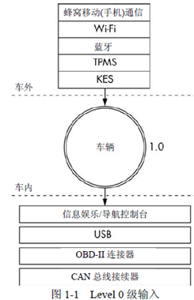

在图1-1 中，矩形框表示输入，中心的圆形代表整辆汽车，在输入到达车的过程中穿过的两条点虚线则分别表示外部和内部威胁的边界。车辆周围的圆形并不表示某个输入，而表示一个复杂过程——也就是一系列可进一步分解的任务。所有过程都有编号，如图1-1 所示，图1-1 中的过程被编号为1.0。如果在威胁模型中有多个复杂过程，则将编号顺延。例如，第二个过程编号为2.0，第三个则是3.0，以此类推。随着对汽车功能了解的逐步深入，对模型框图作相应的更新。

### Level1 级：接收端

要继续进行 Level 1 级框图建模，需要选择一个过程进行分析。由于图1-1 中只有一个“车辆”过程，因此本节将深入该过程内部，聚焦于各个输入与哪些对象交互。图1-2 中的Level 1 级映射图与Level 0 级中的几乎相同，唯一的区别是在Level 1 级映射图中标识出了一些接收Level 0 级输入的车辆数据连接。在本级中暂时不对接收端作深入分析，而只关注与输入交互的各个基本设备或区域。

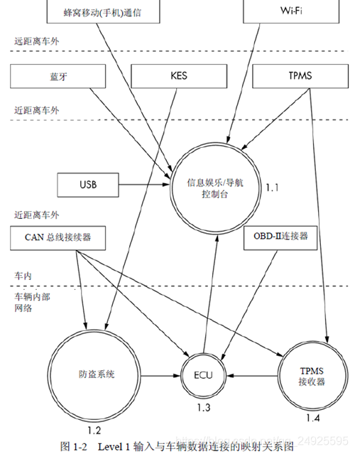

请注意，在图1-2 中对每一个接收端进行了编号。第一位数字代表Level 0 级框图(见图1-1)中的过程编号，第二位数字则代表该接收端的编号。由于信息娱乐单元既是一个复杂的过程，也是数据输入源，因此这里用一个圆形过程符号表示它。

另外还有其他3个过程：
- 防盗系统
- ECU(Electronic Control Unit，电子控制单元)
- TPMS(Tire PressureMonitoring System，胎压监测系统)接收器。

Level 1 级框图中的点虚线表示信任域的边界。框图顶部的输入是最不被信任的，而框图底部的信任级别最高。通信信道穿过的信任边界数量越多，意味着它的风险程度越高。

### Level2级：接收端分解

在 Level 2 级，对车辆内部的通信进行分析。示例框图(见图1-3)关注了某个基于Linux的信息娱乐控制台，即图1-2 中的接收端1.1。它是接收端中较为复杂的之一，且往往直接连接到车辆内部网络。在图1-3 中，使用代表信任边界的虚线框对通信信道进行分组。现在，信息控制台内部新增了一条称为内核空间的信任边界。能直接与内核交互的外部系统的风险级别高于与系统应用程序交互的外部系统，因为前者可能绕过信息娱乐单元上的访问控制机制。例如，蜂窝移动(手机)通信信道的风险级别比WiFi高，因为蜂窝移动(手机)信道穿过了一条信任边界直达内核空间。另一方面，WiFi则与用户空间中的WPA 客户端进程通信。

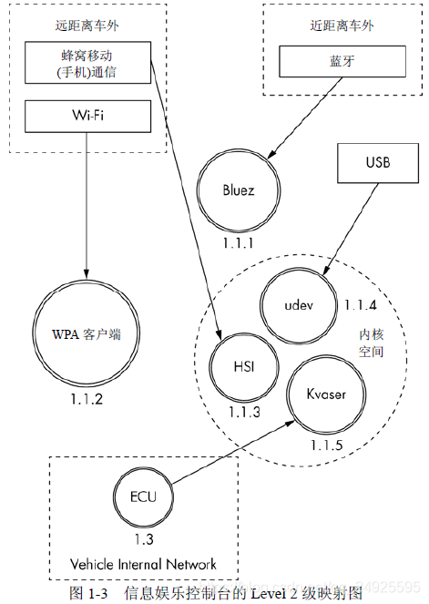

该系统是一个基于Linux 的IVI(In-Vehicle-Infotainment，车载信息娱乐)系统，它使用与Linux 环境通用的部件。在内核空间中，可以看到对udev、HSI 和Kvaser 这3 个接收本威胁模型输入的内核模块的引用。其中，udev 加载USB 设备，HSI 是处理蜂窝通信的串口驱动程序，而Kvaser 则用于驱动车辆的内部网络。Level 2 级威胁模型的编号形式为x.x.x，继续沿用如前所述的标识系统。在Level 0级框图中，将整辆汽车的信息处理过程标识为1.0，在对该过程进行更深入分析的Level 1级框图中，将其中的过程分别标识为1.1、1.2 等，依次顺延。由于在Level 2 级框图中选择了信息娱乐控制台过程1.1 并对其进行了进一步分解，因此在Level 2 级框图中将复杂过程标识为1.1.1、1.1.2 等，依次顺延(在深入分析过程时，可以继续使用该编号方案。该编号方案旨在满足文档编制需求，通过它可以准确引用合适层次的某个过程)。

注意：理想情况下，本阶段应能标注出哪个过程处理哪个输入的对应关系，但目前还只能依赖猜测。在现实条件下，往往需要对信息娱乐系统进行逆向工程以获取这一信息。在建造或设计汽车系统的过程中，应当对尽可能多的复杂过程进行持续“下钻”式分析。邀请开发团队参与工作，讨论每个应用程序所用的库和方法，以将这些库和方法纳入该应用程序自身的威胁框图。在进行应用程序级的建模分析时，往往会发现信任边界通常处于应用程序和内核之间、应用程序和库之间、应用程序相互之间，甚至是应用程序内部的函数与函数之间。在分析这些连接时，标出那些具有更高权限或处理更敏感信息的方法。

## 百度实践

百度Apollo信息安全基于百度Apollo的运营实践，已经打造了一套“点线面体”多向发力的防御体系，用科学打败无序。

通过TARA分析形成系统功能点。作为信息安全功能设计的前置条件，TARA分析可以帮助识别车载智能终端的潜在威胁和安全漏洞，通过对威胁的风险量化评估与优先级排序，形成一份高层级的网络安全需求，即系统功能点。若干系统功能点集结之后，根据纵深防御形成零部件级的安全防线，该防线需从硬件安全、系统安全、数据安全、应用安全、通信安全五个层面进行布局，层层嵌套方能抵御黑客攻击。

结合车内零部件安全应用的协同联动，形成车端安全防护面。发言里提到，80%的攻击会集中在20%的控制器上，是符合二八定律的。这20%的控制器分别指的是网关、T-BOX、车机和自动驾驶控制器4个控制器，每个控制器承载着不同的属性以及不同的交互对象，在进行整车设计时，将4个控制器的安全功能协同联动起来，最终形成一个安全防护面。经过持续迭代升级，Apollo汽车安全引擎已经成为当前智能汽车行业最成熟的基于智能座舱、智能驾驶原生安全解决方案，并通过了EAL4级的认证，是国内软件防护等级最高的汽车信息安全方案。

点线面串联之后，通过云端安全监控运营平台进行攻击收敛，集中监控安全风险，打造全方位、立体化的动态安全防护体系。安全并非一劳永逸，当智能汽车面临安全威胁之时，需通过动态安全防护流程建立响应机制。目前，百度Apollo已经建立起一套完善的跨平台安全响应机制，可以实现对安全事件的精准定位，进而通过人工智能技术实现攻击预测，最终达到“现状可见、问题可察、风险可辨、未来可测”的效果。

百度Apollo汽车安全引擎作为国内首创的智能汽车原生安全动态防护体系，具有准入合规、防护攻击、安全品牌、守护商业四大价值。具体来说，通过百度Apollo汽车安全引擎可以满足国内外愈发严格的车辆准入法规要求；建设抵御网络安全攻击和预知网络安全风险的能力；促使车辆不断进化，娱乐操控安全性能全面提升；个性化匹配用户使用习惯，保障商业模式的安全运营，这也是最为重要的一点。

自2019年以来，百度Apollo在智能汽车安全领域不断发力。先后发布了全球第一份全产业链参与的自动驾驶安全文件，参与制定了国内首个智能网联汽车的信息安全评测标准，并于4月20日发布了百度Apollo汽车安全引擎。这一切只因百度作为拥有强大互联网基础的领先AI公司，深知在智能汽车赛道的竞争格局当中，唯有牢牢守住安全这根红线才能行稳致远。

## 芯片安全
### AI芯片
常见为：
- L2/L3市售晶片TI Jacinto TDA4MV、NXP恩智浦的I.MX 8M Plus(Beta)

2020年的TESLA Model 3為例，已包含Autopilot功能如自動輔助導航駕駛、自動召喚、自動停車、自動變換車道，並且公告下一代電池耐用程度可達100萬英里。蘇教授分享目前市售電動車多以L0/L1晶片為主，L2需LiDAR，且晶片達14nm，整合自駕功能關閉、自動召喚、以及道路巡航功能，如介入地景與危險迴避等。L3達10nm或7nm，增加自動輔助導航與地圖、自動車門功能。

而L2/L3市售晶片介紹如TI Jacinto TDA4MV、NXP恩智浦的I.MX 8M Plus(Beta)，可用來處理AI運算，內部使用Neural Processing Unit: 2.3 TOPS、影像處理使用3D GC7000UL、2D GC520L。而高通的Snapdragon Ride旨在通過利用其高性能、高效能硬體、產業領先的人工智慧技術，以及開創性的自動駕駛疊層以解決自動駕駛和先進駕駛輔助系統（ADAS）的複雜性，提供全面、高成本效益和高能源效率的系統解決方案。
### eMMC
全称为embeded MultiMedia Card，是一种嵌入式非易失性存储器系统，由Nand flash和Nand flash控制器组成，以BGA方式封装在一款chip上。

在组成结构上：emmc存储芯片简化了存储器的设计，将NAND Flash芯片和控制芯片以MCP技术封装在一起，省去零组件耗用电路板的面积，同时也让手机厂商或是计算机厂商在设计新产品时的便利性大大提高。

在功能上：eMMC则在其内部集成了 Flash Controller，包括了协议、擦写均衡、坏块管理、ECC校验、电源管理、时钟管理、数据存取等功能。相比于直接将NAND Flash接入到Host 端，eMMC屏蔽了 NAND Flash 的物理特性，可以减少 Host 端软件的复杂度，让 Host 端专注于上层业务，省去对 NAND Flash 进行特殊的处理。同时，eMMC通过使用Cache、Memory Array 等技术，在读写性能上也比 NAND Flash要好很多。而NAND Flash 是直接接入 Host 端的，Host 端通常需要有 NAND Flash Translation Layer，即 NFTL 或者 NAND Flash 文件系统来做坏块管理、ECC等的功能。另一方面，emmc的读写速度也比NAND Flash的读写速度快，emmc的读写可高达每秒50MB到100MB以上；

https://blog.csdn.net/woshishui918/article/details/85056958

### Nand Flash
一种存储数据介质；若要读取其中的数据，需要外接的主控电路。
而NAND Flash仅仅只是一块存储设备，若要进行数据传输的话，只能通过主机端的控制器来进行操作。
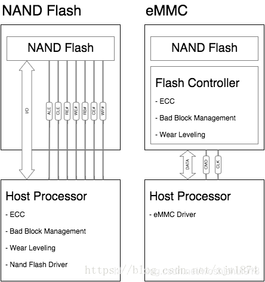

### nor flash
Nor flash：也是一种存储介质；它的存储空间一般比较小，但它可以不用初始化，可以在其内部运行程序，一般在其存储一些初始化内存的固件代码；

### HSM

硬件安全模块（英语：hardware security module，缩写HSM）是一种用于保护和管理强认证系统所使用的密钥，并同时提供相关密码学操作的计算机硬件设备。硬件安全模块一般通过扩展卡或外部设备的形式直接连接到电脑或网络服务器。

HSM提供篡改留证（tamper evidence/proof）、篡改抵抗（tamper evidence）两种方式的防篡改功能，前者设计使得篡改行为会留下痕迹，后者设计使得篡改行为会令HSM销毁密钥一类的受保护信息。每种HSM都会包括一个或多个安全协处理器，用于阻止篡改或总线探测。

多年来，不论是ECU之间的连接，还是ECU与外部的连接，汽车电子控制单元（ECU）的连接程度是在不断加深的。然而，随着软件日益复杂，新的需求也随之而生，对通信的要求也越来越高。从安全角度来看，这意味着从单个孤立系统到高度连接节点的变化。因此，抵御外部威胁的安全防护变得越来越重要。除此之外，这种保护可以通过加强密码使用来实现。乍看之下，在经典的实时系统中实现密码保护并非易事。密码学曾经只在特殊操作模式下才需要，例如修配车间的ECU软件更新。

现在，必须确保加密在常规运行时同样有效：例如，对通信伙伴和通信内容进行身份验证并防止拦截。想要适当的实施，必须允许实时需求。这与密码方法的计算时间要求看似相矛盾。硬件安全模块（HSM）可以解决这个问题。它们允许在单独的处理器上计算密码，如果可行，可用硬件加速。然而，我们需要一个优化的实现来发挥其全部的潜力。
#### 汽车实时性

对车辆实时性的要求通常是由所谓的连锁效应造成的。在处理从传感器到相关执行器期望输出脉冲的输入脉冲时，分析涉及到的硬件或软件组件，以及排列顺序。从传感器和执行器的物理状态中得出整个链的最长可接受运行时间。然后，将其分解成单个组件的最长允许运行时间。根据用例不同，从10微秒到100毫秒不等。如果超出了最长允许运行时间，可能会降低便利性，导致噪音。对于需要实时性的安全相关功能来说，这甚至可能伤害生命和肢体。

为了满足对软件的实时需求，并实现需求，AUTOSAR操作系统将相关的软件功能划分为子步骤，即所谓的任务。通过外部事件触发任务，比如加注可运行标记，然后基于优先级进行处理。大多数应用程序会使用具有循环触发表的定时器来触发任务，因为相关的控制功能会连续处理新的生成信号。这样会产生一个默认的时间响应，几十毫秒一次循环。为确保满足实时要求，必须实施下列步骤。一方面，在处理信号时，必须采取适当措施，确保能够提供所需的时间响应。另一方面，必须确保ECU中与时间相关的触发任务能够满足时间要求。为此，必须分析所有任务在运行时期的行为，找到适当的优先级及触发命令时序，确保时效性。

#### AUTOSAR基础软件
ECU功能涉及的不仅是信号处理。处理通信和管理的基本软件也是ECU的重要组成部分。同样，基础软件必须分成不同任务，根据运行需求进行分析，并将其放进整个系统中加以考虑。简而言之，有两种不同的功能集：例如，基本软件中用于通信信号值的一部分，对于处理实时信号十分必要，必须高度重视。而另一部分的实时需求明显较低：必须在后台定期运行；然而，它可能被具有较强实时要求的功能短暂抢占。因此，常见模式是将这些非关键功能转移到低优先级后台任务中。此文的问题在于如何划分功能的优先级：通常，存在多个后台活动，所以在较长时期不必确定哪个不合格。解决优先级排序的方法是循环调度，对每个低优先级功能计时小段时间，后面紧接着下个功能。AUTOSAR术语中，涉及的每个模块都提供了一个运行时间有限的所谓的“主功能”。在后台任务中，这些功能将按顺序调用。

#### 信息安全
“后台功能”中一个典型的例子是密码算法。4.0发布之后，AUTOSAR包含加密基础软件的规范——版本修改和微调的规范。在这种情况下，所谓的密码服务管理器（CSM）为应用程序提供加密服务：

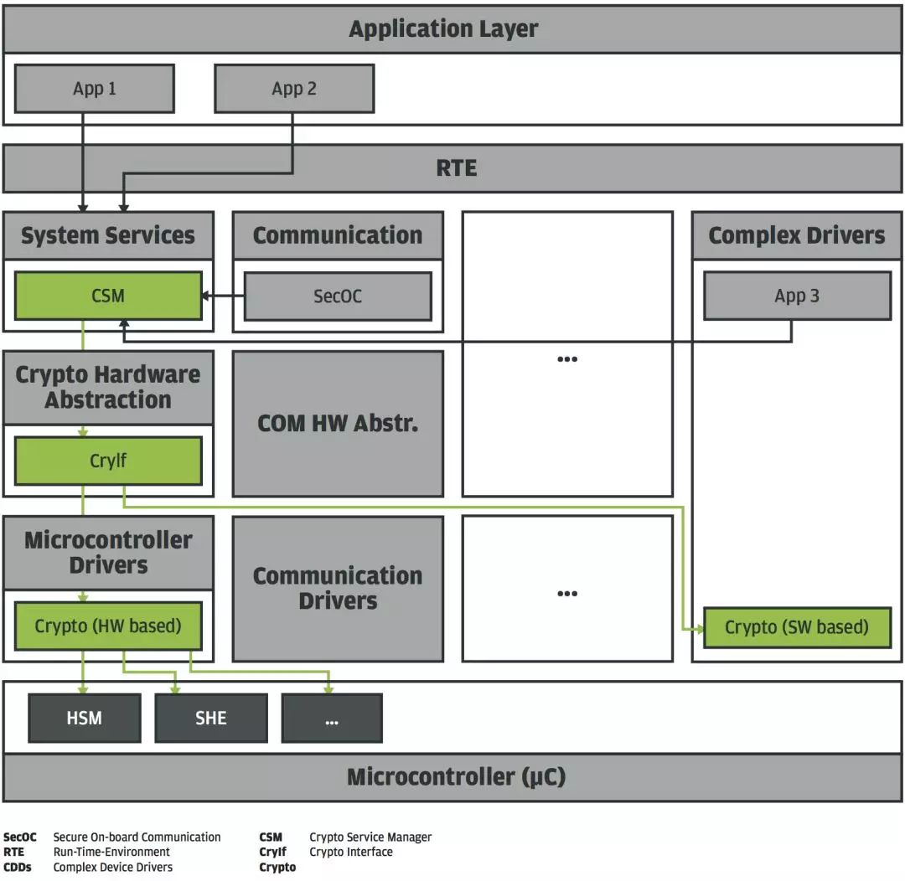
例如，安全车载通信系统(SecOC)使用CSM对传输数据包中信号值进行加密验证。顾名思义，CSM管理密码服务。通过制造商专用密码库实现。为了集成到具有实时需求的AUTOSAR系统中，CSM异步处理请求：最初，CSM 主功能调用只保存请求，然后逐个处理请求。为此，CSM主功能就其本身而言，调用所有底层加密原语的主功能，然后每个对加密原语进行几步计算。

典型的加密计算时间超过了信号处理函数计算时间的数量级。调用主函数时，就出现了一个两难问题：允许的计算能力是多少？计算步骤过多，密码系统会失效，整个系统的实时性会成为问题。而步骤太少，加密操作的计算则会延迟，导致受益有限。
此外，还必须考虑另一个影响：特定的主函数用于管理内部计算状态，允许逐步执行计算。这种状态管理在某种程度上意味着开销。实际计算调用越少，开销越大。

应由软件供应商找到一个标准的解决方案。在典型场景中，例如，运行时的加密常用对称加密方法来验证较小的数据块。其中一种解决方案是为每个主函数调用计算一个对称块。然而，如果使用更为复杂的方法，很难找到明智的折衷方案。

示例包括对大量数据进行认证/加密或生成非对称签名。例如，假设每1毫秒计算100微妙可接受——这个假设十分乐观，因为在多数实时场景中保持这个状态并非易事。

与纯计算时间相比，这种划分意味着在结果可用之前时间增加了10倍。对于纯计算时间已经造成困难的密码函数而言，这种划分严重限制了实际应用。

硬件安全模块

显然，实时性能和加密方法开销的要求相互冲突，仅仅通过软件无法解决。因此，一个显而易见的解决方案是使用专门的硬件，这些硬件可以与主处理器并行计算适当算法或者其中大部分。然后，AUTOSAR CSM及相关的密码库仅负责将请求传递给该硬件，并在主功能中循环检查结果是否可用。过去十年里，在制造商的软件计划（HIS）里，这些硬件协处理器中的第一批被指定为“安全硬件扩展”。而在密码算法中规范仍限于在不同模式下实现AES-128。最近的发展显示，由于存在大量的可能情况，纯硬件协处理器常常是有限的，因此并不理想。

结果出现了所谓的硬件安全模块（HSM）趋势。HSMs是由一种防火墙连接到主机系统总线的独立微控制器。HSM通常有其受保护的内存（RAM），程序代码和数据的专用闪存区，及其外围设备，例如定时器、用于某些密码算法的硬件加速器或用于真随机数的发生器。它能够访问主机的所有硬件。在运行时实现系统的安全、认证启动或主机监测。专用数据闪存可以用来存储秘钥，主机系统无法随意访问。这意味着主机可以请求HSM执行加密操作，而密钥无需离开HMS。然而，在这方面，HSM的特殊优点是它是可自由编程的。作为一个独立的微控制器，HSM能够运行为当前用例优化的任何程序代码。这使得其安全性要求比简单的协处理器更高。

#### HSM固件实现

仅在HSM上建立良好的AUTOSAR标准软件，使用标准AUTOSAR方法将其与环境连接，似乎很不错。这样可以重用熟悉的AUTOSAR实现模式。然而，事实并非如此：具有实时信号处理功能的典型AUTOSAR系统，和关注安全性的HSM的用例大有不同。这清楚表明，如果HSM固件可以更自由地优化其目的，则可以实现更高的效率。此外，当前HSM硬件可用资源有限——另一个因素使得在HSM上使用AUTOSAR软件变得困难。

HSM用例通常是典型的客户机-服务器模型：主机将一个或多个请求发送到HSM，在HSM中处理这些请求，并在结果可用时立即发出通知。与传统的AUTOSAR系统不同，HSM上管理和后台任务的数量非常有限。因此，可以假定HSM大部分计算时间将专用于处理主机请求。

当在HSM上使用允许中断的操作系统时，可以相应优化任务映射和优先次序。这样的话，可以在低优先级任务中处理长时间运行的操作，中断较短的操作。如有需要，高优先级中循环任务允许处理管理任务。通过这种类型的映射，可以实现加密例程，在一个会话中执行特定任务。不再需要适当的例程允许中断。然而，操作系统使得日常操作透明化。不再需要相关的管理开销，这大大减少了代码规模和运行时间。此外，中断只有在实际需要时才会发生——如果只需处理单个操作，那么计算将不会中断。图2是HSM固件的体系结构。

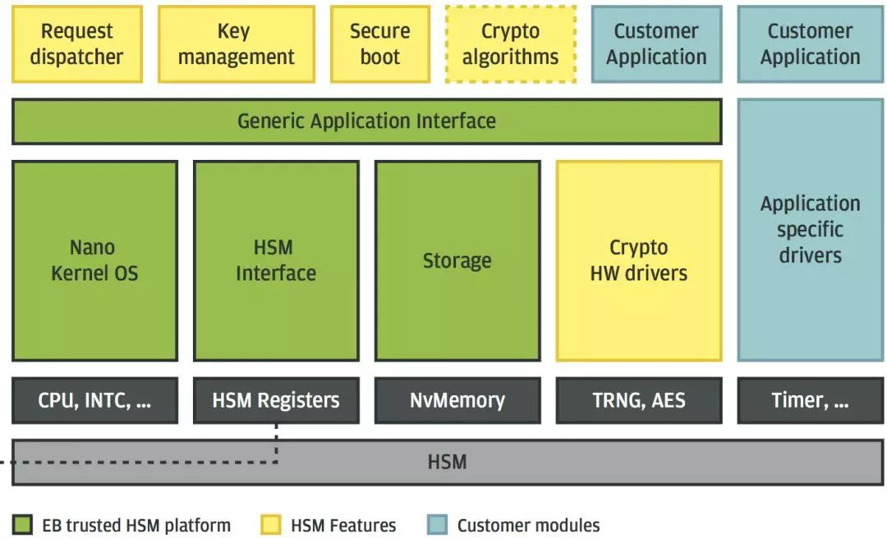

#### 算法布局的影响

事实上，与ECU硬件性能相比，HSM硬件性能有限，这可能是HSM软件优化的障碍之一。因此，理论上纯软件实现在HSM上需要的时间比主机更长。然而，在实践中，优化节省了时间。图3是tc397 ECDSA英飞凌测量（secp-256r1）上的主机系统，明显比HSM慢。虽然主机核心运行300MHz，HSM核心运行100MHz，主机上的软件算法比HSM的执行时间快了三倍。不幸的是，在一个真正的ECU中，主机CPU时间无法专门用于执行算法计算。事实上，使用AUTOSAR时间片和并发应用的用例可能只占主机CPU时间的10%，可用于算法计算。因此，100% CPU时间场景中的xyz ms，在结果可用之前，其操作将围绕实际ECU项目中的xyz * 10 ms。

有趣的是硬件加速器可以用来加速算法，所以软件部分只需设置输入数据并读出结果。计算是由硬件来完成，不需要任何CPU周期。图3显示了惊人的加速速度。具有8k输入数据的测量ECDSA secp-256r1仅需要9.6ms验证签名，而相应的HSM软件需要大约750ms，才能给出结果。这是一个78倍的加速。如果我们将硬件解决方案与具有10%CPU时间的主机CPU解决方案进行比较，结果在2.5秒之后是可用的，这意味着在硬件支持下，我们可以实现260倍的加速。

https://www.zhihu.com/column/c_1038495484041515008

#### 加密时间

因此，使用具有优化固件的HSM，也使实时ECUs成为永不过时的技术来验证密码。非对称加密方法也不再局限于特定的操作模式，而是可以在运行时以可接受的性能计算和使用。这开创了以前无法实现的密码用例。HSM的自由可编程性使得在选择所需方法及其实现方面能够进行特定于应用程序的优化。

## 参考

### linux kernel

#### udev

Linux 设备文件策略经历了：
- 早期，带有适当属性集的普通文件（有mknode命令创建，放在/dev下）
- 后来，devfs（基于内核的动态设备文件系统，首次出现于2.3.46），Mandrake、Gentoo等linux采用这种方式。2.6.13后因其有限制被移除。
- 目前，udev（用户空间程序）

udev支持控制上千个硬盘、热插拔等功能。

通常了解udev是为了使用新的、外来设备，修改配置后才能使用这类设备。同时，例如修改RS-232串口、音频设备等文件的属组或权限。

udev较之之前的设备文件管理方法，有以下优势：
- 确定的设备映射，使其可靠。设备应该给予其序列号或其他标识符唯一确定的设备文件来映射，但静态文件或devfs都无法做到

- 足够的主/辅设备号。每个设备文件是有两个8位的数字：主设备号和辅设备号。这两个8位的数字加上设备类型（如块设备、字符设备）来唯一标识一个设备。不幸的是这些数字不够用。udev可以

- /dev目录下文件太多，一个系统若采用静态设备文件关联的方式，那么这个目录文件必然足够多。
- 命名灵活
- 内核内存使用消耗小。

udev使用用户空间（user-space）工具来管理/dev/目录树，他和文件系统分开。知道如何改变缺省配置，你就可以知道如何定义自己的系统，比如创建设备字符连接，改变设备属组、权限等。

udev配置文件：
- 主要的配置文件是 /etc/udev/udev.conf
- 规则存储目录： /etc/udev/rules.d 

https://www.cnblogs.com/sopost/archive/2013/01/09/2853200.html

#### HSI
High Speed Synchronous Serial Interface

是一个全双工、低延迟协议，优化了应用处理器和基带芯片组的 die-level 交互。 

https://www.kernel.org/doc/html/v4.15/driver-api/hsi.html

#### Kvaser

## 芯片国际认证

SOGIS CC EAL

银联芯片安全认证

国密二级认证

国际安全认证

### 车规AEC-Q100认证

AEC-Q100 美国汽车电子协会（AEC）所制定的规范,主要是针对车载应用的集成电路产品所设计出的一套应力测试标准, 与传统消费电子、工业电子相比，AEC-Q100认证极为严苛，需要通过加速环境应力检验、加速寿命模拟验证、封装完整性检验、芯片晶圆可靠性检验、电气特性检验、缺陷筛选检验等一系列车规级认证，是芯片厂商进入汽车电子领域的特别通行证。
### CC 

国际通用准则CC 是对信息安全产品的测评认证

CC（Common Criteria）认证是世界上认证要求最高、认可范围最广的国际安全认证标准之一，常被用于银行卡芯片、网络系统等对信息安全有极高要求领域。该认证也是安全领域的“全球通”，可在全球31个国家中使用。

SOG-IS 协议是为了响应欧盟理事会 1992 年 3 月 31 日 (92/242/EEC) 在信息系统安全领域的决定以及随后的理事会于 4 月 7 日 (1995/144/EC) 的建议而产生的通用信息技术安全评估标准。

该协议于2010年1月更新，全文可在网站“协议”部分下载。本协议的参与者是来自欧盟或EFTA（欧洲自由贸易联盟）国家的政府组织或政府机构，代表他们的国家。

#### MDFPP标准
该标准针对手机安全审计、密码支持、用户数据保护、身份与认证、安全功能保护、设备访问、可信通信共7个安全功能类别，对产品开发生命周期各阶段进行安全评估和认证。本次共完成178条技术需求认证和155项用例的多轮测试。

商密二级认证

EAL5+认证

## 攻击示例

https://zhuanlan.zhihu.com/p/266393629