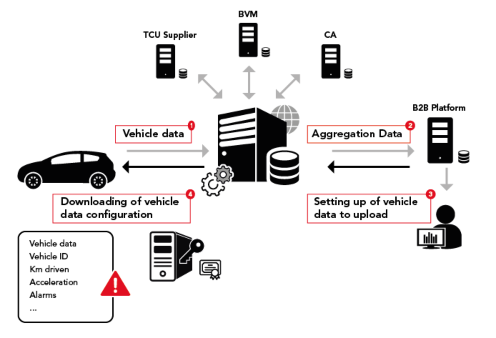
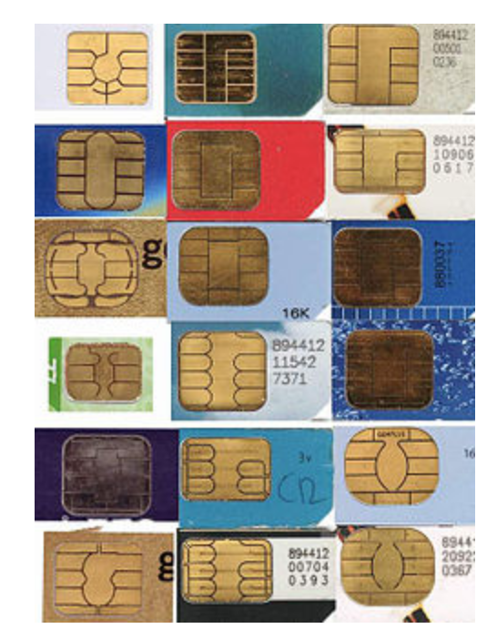
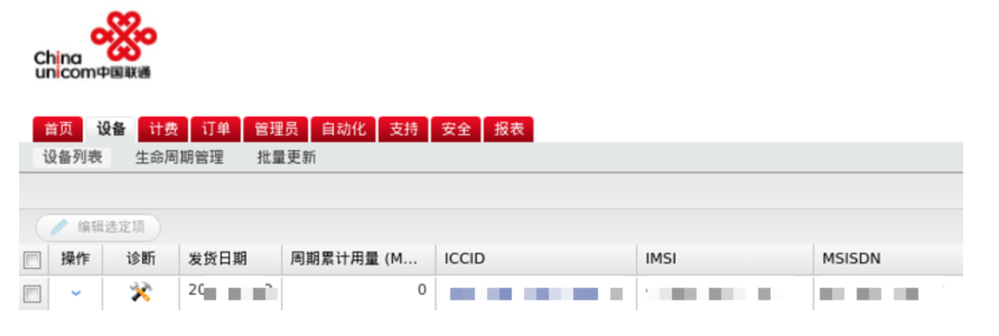
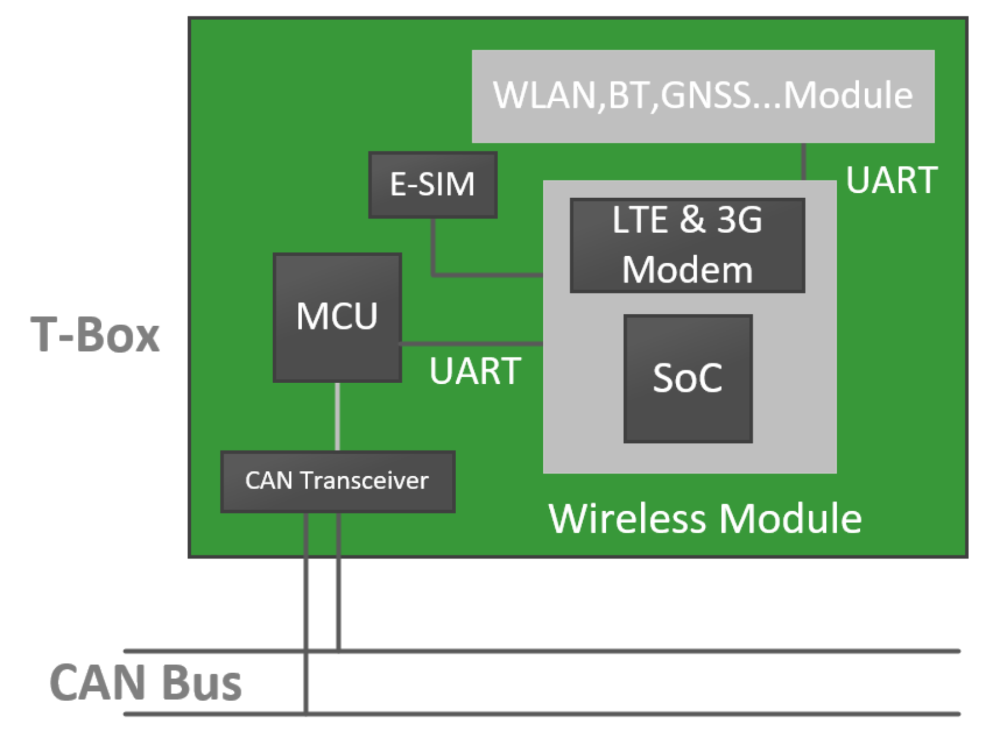
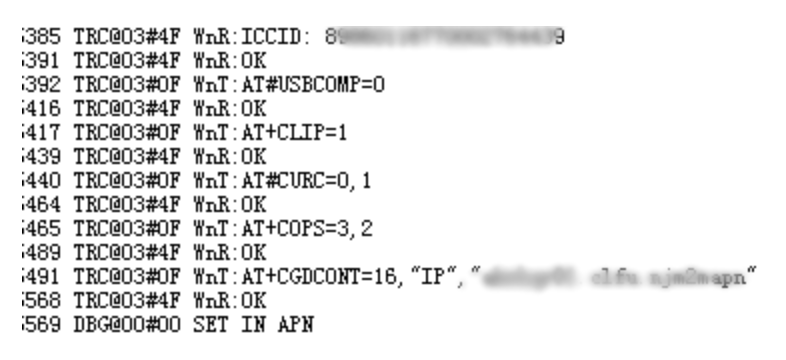
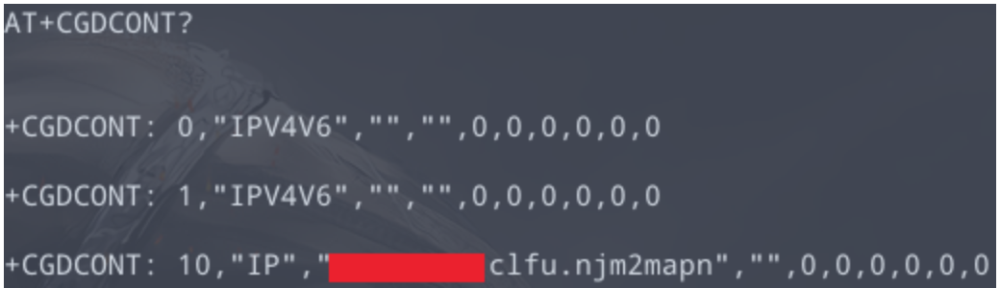
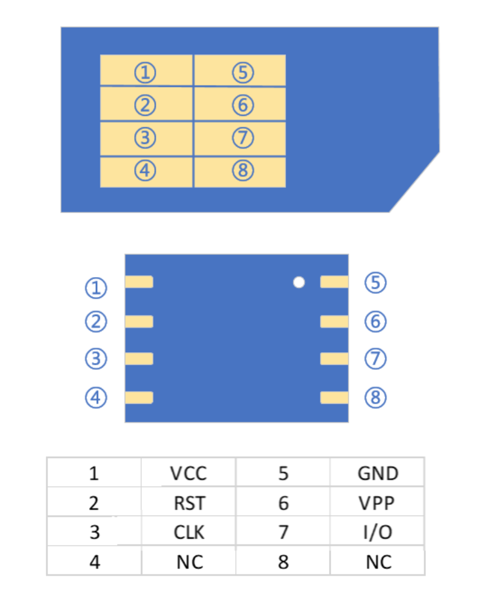
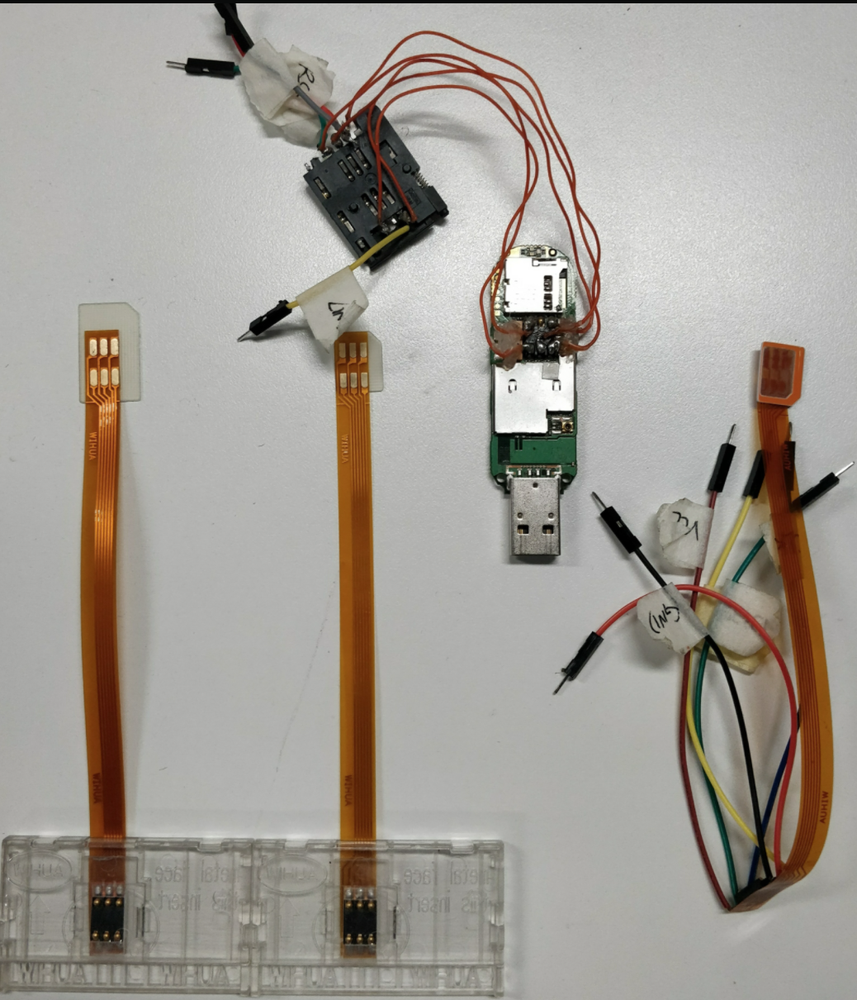
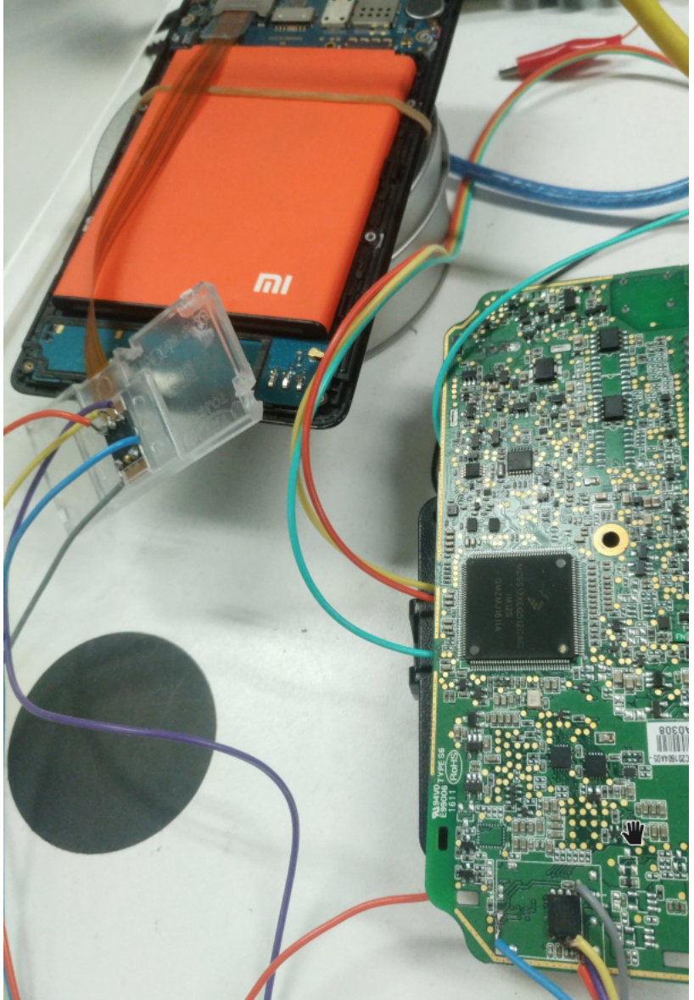
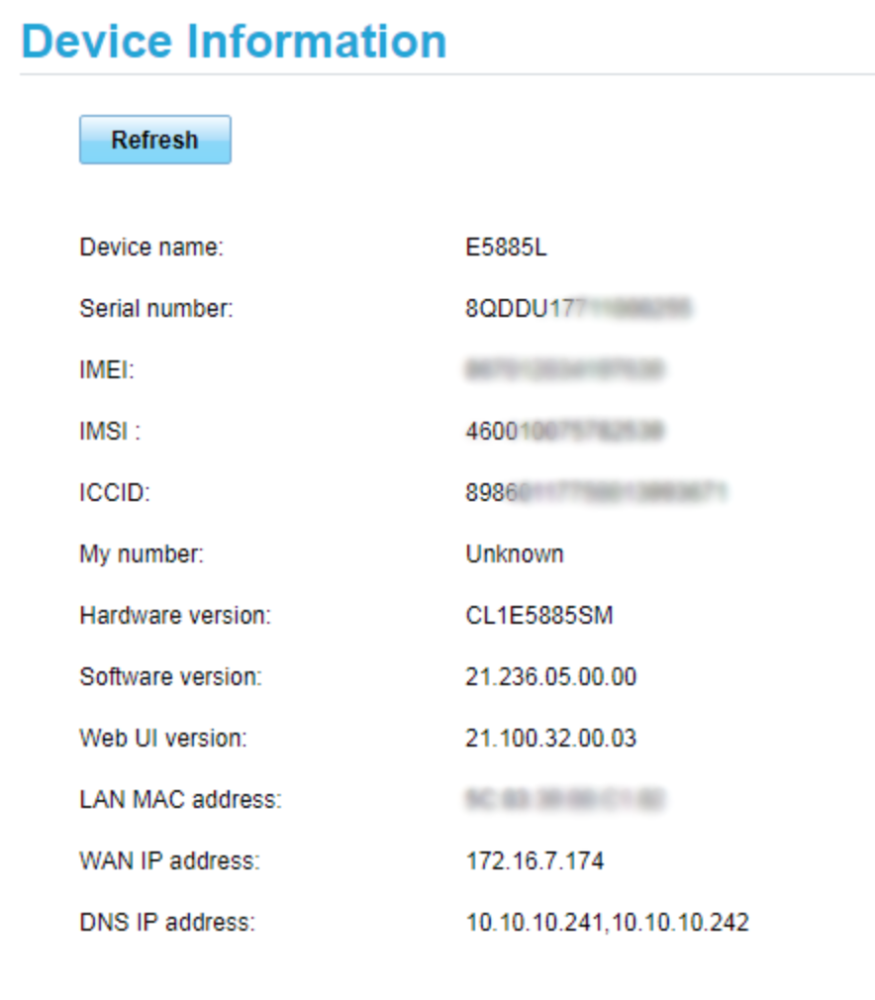

# TBox

T-Box 从1995开始出现，发展至今已经成为非常重要的车载零部件。

TBox 是目前连接车内网络与车外网络的桥梁。
- 对内，它通过CAN收发器直接连接网关，与车内网络通信，能够获取娱乐CAN、诊断CAN伤的数据。可以对BCM、VCU等进行控制，或下发诊断命令。
- 对外，它通过eSIM与LTE、5G电信网络进行通信。

## TBox功能组件
T-Box 为用户提供行车数据、行驶数据、实时状态检测、远程控制以及安防服务等功能，是车联网系统中的关键部件。


它自带的外设和内置资源很多，主要有：

- 通信类
  - GPS
  - GSensor
  - BLE
  - USB（连接娱乐系统）
  - LTE模块，可以提供多路APN，使其可以与多个专有网络和公共网络通信。并提供一个可编程ARM，供MPU使用
- 计算类
  - MCU
  - MPU，与MCU使用UART和SPI两类方式连接。
- 对外物理接口
  - 4G主天线
  - 4G副天线
  - GPS天线
  - USB数据
  - PIN脚

## Tbox 接入内网

### 将TBox作为节点直接接入CAN

如果仅需要在TBox实现一路CAN的控制功能（车身CAN），直接将TBOX作为一路网络节点接入即可。

优点是简单易用，做好TBox节点的休眠唤醒机制和安全访问即可，其他节点的网络管理策略不需要重新配合修改。

缺点是功能有限。

### 网关集成TBox

这时，网关和Tbox融为一体。

优点是信息传递直接有效，实现简单。
缺点：安全性要求比较高。

### TBoX 连接在can外网络

Tbox对外连接LTE等外部网络，然后通过网关转发豹纹。

优点：外部网络与娱乐系统高度融合，便于实现娱乐和社交功能；信息经过MOST网关转发，安全性较高。
缺点：MOST总线成本高，MOST网关开发难度大。


## 如何利用tbox接入车内网

T-Box 可能需要配置 APN 才能正常使用车联网服务，这些车联网服务处于车厂内网或TSP供应商内网。

T-Box供应商通常使用eSIM，而不是可插拔的SIM卡。eSIM与4G通信模组相连，由于他们彼此独立，所以这里可以通过连线使用自己设备上的eSIM。

### 接入内网的意义

这里指的车厂内网包括了TSP内网，TSP的内网可能由车厂负责，也有可能是TSP供应商负责。通过对TSP内网渗透，可以获得车主的个人数据，篡改车主APP。对车辆下发篡改后的升级固件，批量远程控制汽车。实际研究成本和攻击效果，都要优于近场攻击。



### SIM
SIM (subscriber identification module,客户识别模块)是一个能够安全存储移动通信配置IC。

这是2G电信网络的叫法，彼时sim由硬件和软件构成。

3G网络时代，SIM变成了纯软件应用，和CSIM、USIM一样，可以运行在UICC里面。UICC（universal integrated circuit card）通用集成电路卡，就是我们手机里面所谓的SIM卡，属于智能卡的一种。



SIM卡中存放了用来识别和验证客户端的配置信息：
- ICCID（integrated circuit card identifier ，IC卡识别码）
- IMSI（international mobile subscriber identity，国际移动用户识别码）
- Authentication Key 是GSM网络下的一个128位鉴权key，因为GSM算法存在漏洞，导致key被泄漏从而可以复制SIM卡。

早期的SIM卡使用的是单向鉴权机制：在接入网络时只对SIM卡做身份认证，曾有黑客表示可以在短时间内远程控制任何一个SIM卡号码，甚至复制。

而USIM卡使用的则是双向鉴权机制：通过AUTN（认证令牌）实现用户和网络的鉴权，接入网络时不仅对USIM卡进行身份认证，USIM卡同时也要对网络进行身份认证，因此可大幅提升破解难度，还能有效地识别或屏蔽伪基站，提升网络通讯的安全。

找回丢失苹果手机，就可通过查IMEI对应的ICCID锁定手机号，这个ICCID就是新插入SIM卡的识别码。

#### e-SIM

SIM卡的IC包括：CPU、ROM、RAM、EEPROM和I/O，尺寸也越来越小，直到2016年出现的eSIM（嵌入式sim），也叫eUICC，是芯片格式的sim卡，大多采用SON-8封装。

eSIM是下一代SIM卡技术，遵循GSMA（全球移动通信协会）规范，核心思想是将SIM卡硬件（eUICC）的生产与运营商数据（profile）的生产分离。运营商数据通过空中写卡方式写入自己的profile，杜绝被中间人攻击的风险。

优势：

摆脱SIM卡限制，方便携号转网。
包含其他安全信息，可以进行私有网络认证。
弃用卡槽和IC卡。成本降低，节省空间。
在运营平台就能开卡，压缩了制卡的流程。

局限：
在移动设备上不支持双卡双待。
目前国内集成eSIM卡的设备，普遍是由运营商或指定网络服务方牵头的，无法转网。


E-SIM在车联网的应用
ISP会给T-Box提供定制化的网络服务，也就是所谓的物联网卡，目前三大运营商都有物联网卡服务。目前大部分车厂使用的是联通智网。ISP为客户提供管理账号，可对SIM卡的套餐以及状态进行管理。

为了方便计费和管理，T-Box可能需要配置APN(Access Point Name)才能正常使用车联网服务，这些车联网服务处于车厂内网或者TSP供应商内网。



T-Box供应商通常使用eSIM，而不是可插拔的SIM卡。一方面为了成本考虑，另一方面是为了安全。



eSIM与4G通信模组相连。实际上eSIM和通信模组都是独立的，因此我们直接使用4G通信模组，也可以自己的设备上使用eSIM。

#### 获取APN
网络配置信息在4G通信模组里，一般通过OTA的方式修改APN信息。

因此根据上图，获取APN有多种方式：

##### 获取T-Box固件(MCU or SoC)，从字符串或者配置文件提取。

假设能shell到tbox，那么使用strings命令可以搜索二进制中的可打印字符：

`strings mcu.bin |grep -i apn` 类似的命令就可以尝试去发现文件

##### 嗅探MCU和通信模组之间的UART实时数据




##### 对通信模组使用AT命令，获取当前APN配置

AT命令，用来控制TE（Terminal Equipment）和MT(Mobile Terminal)之间交互的规则，如下图所示。在GSM网络中，用户可以通过AT命令进行呼叫、短信、电话本、数据业务、传真等方面的控制。


#### IMEI绑定绕过
少数ISP会在写号时，将IMEI和ICCID绑定，一旦接入的IMEI和ICCID不匹配，则马上冻结号卡。因此需要在使用eSIM之前，将自己设备的IMEI修改成目标T-Box的IMEI。

最方便的是MTK平台手机，使用AT命令就能修改IMEI。当然也可以使用MTK烧录软件修改IMEI。

```
AT+EGMR=1,7,"phone1_IMEI"
AT+EGMR=1,10,"phone2_IMEI"
```

其次是华为4G路由器，需要刷机才能开启自定义功能，参考 [4pda - Huawei E5885](https://4pda.ru/forum/index.php?showtopic=842340&st=0#entry64662849)

`echo -e "AT^CIMEI=target_imei" > /dev/appvcom`

高通平台手机，修改IMEI较为麻烦。可以使用CDMA Tools或者QPST这类写号软件修改IMEI。

#### E-SIM飞线
eSIM的引脚定义如下，VPP引脚可以不接。




可以使用SIM排线，避免直接飞线到卡槽上。



eSIM被固定在T-Box的PCB上，为了降低损坏风险，可以将e-SIM飞线到第三方通信设备上，记得给T-Box断电。




最后成功接入内网，可对目标车联网进一步渗透



#### 防御措施

对于设备本身，为防止拆车件被攻击者利用，建议绑定IMEI和ICCID，一旦检测到IMEI异常，则冻结号卡。另外，对车联网做好实名认证，及时销毁，确保该卡整个生命周期的安全。

对于内网安全，ISP应做好ACL策略，防止横向攻击其他T-Box。对ISP和车厂边界网络做好防护，及时对边界网络设备打补丁。

## T-Box厂商

- 华为
- 联友科技
- 德赛西威
- 东软
- 均联智行
- 博泰
- 经纬恒润
- 惠翰股份
- 高新兴
- 英泰思特
- LG电子
- 电装
- 大陆
- 法雷奥
- 哈维
- 亿咖通
- 鸿鹄科技
- 索菱股份
- 北斗星通
- 鸿泉物联
- 雅迅网络
- 高新兴
- 斯润天朗
- 有为信息
- 首航通信
- 均联智行


排名第一的华为，是唯一一家入榜的从通讯芯片到模组、T-Box垂直布局的企业，从2011年开始研发和推出车载无线通讯模组。其中，大规模上车来自与上汽通用的合作，前装搭载后者旗下品牌的多个车型。此外，国内部分T-Box厂商也有采购华为的通讯模组。

去年5月，随着5G车载前装市场的启动，华为借助在5G芯片上的先发优势，联合一汽集团、长安汽车、东风集团、上汽集团等首批18家车企正式发布成立“5G汽车生态圈”，加速5G技术在汽车产业的商用进程。

此后，5G车载模组MH5000、5G车载终端T-Box平台的推出，在5G模组及T-Box前装市场实现首发量产，并陆续搭载于广汽新能源Aion V、比亚迪汉、北汽ARCFOX αT等车型。

作为东风汽车集团下属的科技公司，联友科技成立于2002年4月，在国内率先实现突破百万台量产，目前已出货超过260万台。根据高工智能汽车研究院发布的数据，去年前装T-Box市场份额排名行业第二，仅次于LG。

在5G前装市场，该公司的5G C-V2X/T-BOX在今年7月实现量产，支持5G only 和5G-V2X双模式。此外，公司也在持续投入汽车智能化业务，包括智能驾驶舱、FAPA泊车、L2/L3域控制器、L4自动驾驶云控平台的研发。

德赛西威是前装车载T-Box行业的后进入者，2018年实现量产上车，包括上汽通用多款车型以及自主品牌项目订单。随后，该公司陆续投资参股多家车联网技术公司，包括2019年收购德国先进天线制造公司ATBB，布局高性能5G智能天线技术。

2020年，德赛西威率先推出5G T-box以及V2X解决方案，并获得合资品牌车型（别克GL8 Avenir）项目定点并率先上市量产。此外，公司在整车级OTA、网络安全、蓝鲸OS3.0 终端软件等相关业务板块也已经实现商业化落地。

东软作为车载系统整体供应商，量产业务已覆盖国内绝大多数车厂，拥有智能座舱系列产品，包括IVI车载信息娱乐系统、全液晶仪表、智能座舱域控制器、智能网联模块、全球在线导航系统等业务板块。

按照上市公司财报数据，今年上半年智能汽车互联实现营收13.77亿元，同比上年同期增长98.63%，其中，T-BOX产品已经在吉利、领克、红旗、奇瑞、金康赛力斯等品牌多款车型量产交付。此外，东软陆续在长城汽车旗下多款车型落地5G T-Box、5G+C-V2X Box终端。

这款5G T-BOX产品，由基于高通芯片+移远模组，东软采用了全新的平台化设计，融合了FOTA、以太网技术、车联网安全技术等，首次搭载车型为第三代哈弗H6。

2020年，均胜智能车联业务（去年营收约26.5亿元）拆分并成为均联智行，并引入外部战略投资者，是进入本榜单中为数不多面向全球车厂的一级供应商，核心业务涉及研发、生产及销售汽车智能中控、车辆卫星导航、车联网通信技术以及影音娱乐系统等。

2018年，均胜智能车联在国内市场宣布打造新一代TBOX和V2X产品线，并直接切入5G市场。而早在2014年，均联智行德国团队就已经参与多家整车厂的V2X技术场景应用的实际道路测试。

该公司方案搭载的首款量产车型是高合HiPhi X，基于高通芯片+移远模组，提供5G及C-V2X功能。去年9月，公司还获得蔚来汽车5G-V2X平台项目定点，项目金额约6.6亿元人民币，包含V2X的5G-TBOX和5G-VBOX。

博泰车联网创办于2009年，近年来与一汽、东风、北汽、吉利和上汽通用五菱等规模化车企深度合作，先后获得东风集团、一汽集团的战略投资，以及小米等互联网科技巨头的加持，近一年来已经累计完成融资18亿元。

目前，博泰已经完成操作系统、智能语音、硬件、高精地图以及云平台五大核心技术的布局。2020年7月，博泰自主研发生产基地在厦门投产，预计到今年底，博泰厦门智能制造工厂将实现年产能100万套目标，2022年总产能将达到200万套/年。

此外，去年底，博泰柳州智能网联产业基地（工厂及研发中心）项目签约，主要涉及数字座舱、TBOX、主机、域控制器等产品线。其中，T-BOX产品已经在上汽通用五菱、北汽等多家车企实现规模化量产前装。

经纬恒润是国内较早实现T-Box乘用车前装量产的供应商之一，该公司招股说明书显示，截至2020年末，T-BOX 产品已配套一汽红旗 HS5/HS7、广汽埃安 S/V/LX、江铃福特领界等车型。

数据显示，2018年至2020年，经纬恒润T-BOX产品销量（乘用车+商用车）分别为5.63 万套、21.18万套和34.24万套。同时，已经推出了基于5G和V2X技术的新一代T-BOX产品。

慧翰股份的主要产品有前装T-Box产品、汽车级无线通信模组、物联网智能模组以及软件和技术服务等，其中T-Box产品是其营收占比最大的业务板块，其次是物联网智能模组板块。

招股说明书显示，2017年-2019年，慧翰股份T-Box产品销量分别是38.92万台、39.3万台、33.3万台，实现营业收入分别是2.15亿元、2.07亿元、1.6亿元，呈现营收逐年下降的趋势。

去年，慧翰股份主动要求撤回注册申请文件，证监会决定终止发行注册程序，其中对慧翰股份TBOX产品收入的可持续性、整体持续经营能力、与上汽集团的业务等提出了质询。

高新兴也是国内较早实现T-Box乘用车车载前装量产的公司之一，不过车联网产品收入已经连续两年下滑，2020年收入更是下滑了超过7成，毛利率下滑到仅有9.5%。作为公司重点聚焦的业务之一，车联网收入由2018年6.07亿元下滑至1.53亿元，营收比重由20.46%下滑至6.58%。

截止2020年年末，高新兴在前装市场实现批量发货的主要有车规级模组、T-BOX终端产品，主要供货厂商为吉利、长安、比亚迪、广汽等国内大型整车厂。上半年财务数据显示，主营车载业务的子公司高新兴物联实现营收3.46亿元、净利润亏损1927.57万元，同比数据出现好转迹象。

近年来，高新兴参与了天津、长沙先导区以及广州、珠海等智能网联示范区建设，目前主要的车联网产品有RSU等路侧设备及平台，以及车规级5G+C-V2X 车规级模组、5G+V2X车载终端、T-BOX（前装）、OBD（后装）等车载产品。

英泰斯特在2015年被上市公司兴民智通控股，早期在国内新能源汽车前装T-BOX市场占有率一度超过30%，主要客户包括北汽新能源、上汽、长安等。不过，从2018年开始公司净利润开始下滑，2020年更是亏损6776.76万元。

2018年兴民智通募集资金10.37亿元，用于车载终端T-Box自动化生产及数据运营服务等项目建设。至2020年底，项目投资进度只有19.12%。2020年，车联网硬件产品T-BOX等业务营业收入降至4087.82万元，同比下滑80.15%。

今年上半年财务数据显示，英泰斯特实现营收2759.76万元，净利润亏损712.05万元。其中，主要客户之一的北汽新能源今年1-7月累计产量为2507辆，同比下降73.81%，累计销量为10450 辆，同比下降37.46%。


## 参考

### AT命令
AT命令，用来控制TE（Terminal Equipment）和MT(Mobile Terminal)之间交互的规则，如下图所示。在GSM网络中，用户可以通过AT命令进行呼叫、短信、电话本、数据业务、传真等方面的控制。

AT命令是以AT作首，字符结束的字符串，AT命令的响应数据包在中。每个命令执行成功与否都有相应的返回。AT指令集可分为三个类型：

- 执行命令
  - 语法：
    - 有参数：`AT+<x>=<...>`
    - 无参数：`AT+<x>`
  - 说明：用来设置AT命令中的属性。

- 测试命令
  - 语法：`AT+<x>=？`
  - 说明：用来显示AT命令设置的合法参数值有哪些（范围）。

- 查询命令
  - 语法：`AT+<x>？`
  - 说明：用来查询当前AT命令的设置的属性值。


大部分模组支持3GPP TS 27.007 AT命令集，并在此基础上扩展出自定义指令集。以Ｃ开头的命令如AT+CFUN是是通用的命令，以N开头的命令是模组厂商自定义的命令，不同的模组厂商可能使用不同的命令实现相同的功能。

在物联网中，AT指令集可用于通信模块调测、控制&调测设备等。本节将以移远通信的BC35-G模组为例，为大家剖析常用的NB-IoT 3GPP相关命令及其常见用法，完整的文档可找模组厂家获取。


常用AT命令:
#### AT+CGSN（查询模块序列号）

`AT+CGSN=<snt>`，如果没有写入`<snt>`，则 只返回"OK”。

`<snt>=0`，返回`<sn>`。

`<snt>=1`，返回IMEI（国际移动设备识别码），这个序列号每个模块都是唯一的。物联网平台基本都是以IMEI号或者Mac地址来区分不同的设备，包括华为OceanConnect物联网平台。

`<snt>=2`，返回IMEISV（国际移动电台设备身份和软件版本）。

`<snt>=3`，返回软件版本号SVN。

#### `AT+CGMR`（查询固件版本）

执行该命令返回固件版本 。  
#### AT+CMEE（查询终端报错）

用于设置终端错误报告，使能后当发送AT执行错误时终端会返回错误编码，这样便于定位问题。
```
例：
开启错误码上报
发送命令：
AT+CMEE=1
模块返回：
OK
```
#### AT+NRB（重启模块）    
```
例：
发送命令
AT+NRB
模块返回：REBOOTING
****
Boot: Unsigned
Security B.. Verified
Protocol A.. Verified
Apps A...... Verified
REBOOT_CAUSE_APPLICATION_AT
Neul
OK
AT+CSQ（查询信号强度）
```
返回值为`+CSQ：<rssi>,<ber>`。rssi越大，表示信号越强。信号强度和rssi换算公式为：信号强度=113dBm+(rssi*2)。

没有信号或信号强度过低，需要联系运营商处理。
```
例：
发送命令：
AT+CSQ
模块返回
+CSQ:31,99
OK
```

rssi=0，表示信号非常差。

rssi=31，表示信号质量非常强。

rssi=99，表示没有信号。

ber字段未使用，恒等于99。

#### `AT+CGATT`（查询网络是否激活）

返回：+CGATT:1，表示网络已激活；若返回：+CGATT:0，则表示网络未激活，请尝试重启模组激活网络。

```
例：
发送命令：
AT+CGATT?
模块返回：
+CGATT:1
OK
```
#### AT+CEREG（查询网络注册状态）

该命令用于查询终端EPS网络注册状态。当使能提示时，终端的网络注册状态信息有变化，会主动上报给用户终端。通过不同的设置可以上报EPS注册状态、位置区码、小区ID、服务小区的接入技术等信息，通常情况下只需要设置为自动上报EPS注册状态。
```
例：设置网络注册状态上报信息
发送命令：
AT+CEREG=1
模块返回：
OK
```
设置成功后，当网络注册状态信息有变化，会主动上报给用户终端，如：
```
+CEREG:1,1
OK
AT+CSCON（查询网络当前连接状态）
```
返回格式为：`+CSCON:<n>,<mode>?`

`<n>`是通知设置。取值和说明：0为取消异步通知，当网络连接后，串口不会主动上报+CSCON命令；1为使能异步通知，串口主动上报+CSCON。

`<mode>`是当前模块连接状态，取值和说明：0处于IDLE状态，1处于已连接状态。当处于IDLE状态时，只要发送数据或者重启设备，就会变成已连接状态。

```
例：
发送命令：
AT+CSCON?
模块返回：
+CSCON:0,1
OK
AT+CFUN（设置模块射频功能）
```
该命令用于设置和查询模块的射频功能是否开启。

```
例：
AT+CFUN=0     //关闭射频功能
OK
AT+CFUN=1     //开启模块射频功能
OK
AT+CFUN?      //查询模块的射频开启状态
+CFUN:1       //射频功能已打开成功，若回复0通常是因为SIM卡的电路与模块没有连接成功
```
#### AT+CGDCONT命令设置modem默认APN

- 查看设备modem APN：AT+CGDCONT可以用于查看或修改APN。

例如，查看当前设备APN：
```
AT+CGDCONT?
CGDCONT:1,“IPV4V6”,“internet”,“0.0.0.0.0.0.0.0.0.0.0.0.0.0.0.0”,0,0,0,0 APN Name “internet”
CGDCONT:2,“IPV6”,“ims”,“0.0.0.0.0.0.0.0.0.0.0.0.0.0.0.0”,0,0,0,0
CGDCONT:3,“IPV4V6”,“sos”,“0.0.0.0.0.0.0.0.0.0.0.0.0.0.0.0”,0,0,0,1
CGDCONT: 4,“IP”,“plus.acs.jp”,“0.0.0.0”,0,0,0,0
CGDCONT: 5,“IP”,“plus.acs.jp”,“0.0.0.0”,0,0,0,0
```

- 修改modem APN
使用“AT+CGDCONT=”来修改APN 参数，
例如：
```
AT+CGDCONT=1,“IP”,“internet”,“10.1.1.4”,0,0
```
参数分别表示【顺序】、【IP类型】、【APN名】、【address】

- 导出profile
高通平台利用QPST；可能有的版本user版本打不开QPST。
modem APN存储在EFS的Data_Profiles,可以使用QPST工具的EFS explorer，将修改后的profile文件导出.
详细路径：
/Data_Profiles/Profile*

- 导入到modem_proc
每个MBN都内置的自己的profile，其路径是modem_proc\datamodem\datacfg\efs\xxx\Profilex
将导出的profile文件替换到上述路径。

- 编辑mbn，把相应的profile添加进去：

同时，注意修改MBN version，使MBN可以更新。


#### AT指令集调测工具
AT指令集调测工具（也称串口调试工具）有IoT Studio、QCOM、SSCOM、XCOM、COMTool。本节为大家重点介绍常用的IoT Studio和QCOM。


###  APN（Access Point Name）

APN指一种网络接入技术，是通过手机上网时必须配置的一个参数，它决定了手机通过哪种接入方式来访问网络。

对于手机用户来说，可以访问的外部网络类型有很多，例如：Internet、WAP网站、集团企业内部网络、行业内部专用网络。而不同的接入点所能访问的范围以及接入的方式是不同的，网络侧如何知道手机激活以后要访问哪个网络从而分配哪个网段的IP呢，这就要靠APN来区分了，即APN决定了用户的手机通过哪种接入方式来访问什么样的网络。

APN决定了手机通过哪种接入方式来访问网络，用来标识GPRS的业务种类。
APN分为两大类：
WAP业务。
WAP以外的服务，比如：连接因特网。
从运营商角度看，APN就是一个逻辑名字，APN一般都部署在GGSN设备上或者逻辑连接到GGSN上，用户使用GPRS上网时，都通过GGSN代理出去到外部网络，因此，APN设置、过滤、统计等，就成为一个对GPRS计费、GPRS资费有重要参考价值的参数之一（因为APN可以区分一个业务或者外部网络）。
APN的完整说明在3GPP规范TS23.003 Clause 9中进行了详细定义。

APN业务流程：

    APN通常作为用户签约数据存储在HSS（归属用户服务器）/HLR中，用户手机在发起分组业务时也可向网络侧SGSN（Serving GPRS Support Node，服务GPRS支持节点）/MME（Mobility Management Entity，移动管理实体）提供APN，SGSN/MME（以下简称SGSN）根据用户所提供的APN，通过DNS（Domain Name Server，域名服务器）进行域名解析，从而获取到GGSN/PGW（以下简称GGSN）的IP地址，将用户接入到APN对应的PDN中，此外HLR中也可存储一个通配符，这样用户或SGSN就可以选择接入一个没有在HLR中存储的APN。

APN获取方式：

1）用户提供

2）用户定制

3）SGSN指定

APN类型：

1）通过手机浏览上网时使用

2）通过客户端软件来登录服务器时使用

专线APN

专线APN根据企业对网络安全的特殊要求，采用了多种安全措施，主要包括：

1）通过一条2M 专线接入运营商GPRS网络，双方互联路由器之间采用私有IP地址进行

    广域连接，在GGSN与移动公司互联路由器之间采用GRE隧道。

2）为客户分配专用的APN，普通用户不得申请该APN。用于GPRS专网的SIM卡仅开通

   该专用APN，限制使用其他APN。

3）客户可自建一套RADIUS服务器和DHCP服务器，GGSN向RADIUS服务器提供用户

   主叫号码，采用主叫号码和用户账号相结合的认证方式；用户通过认证后由DHCP服务

   器分配企业内部的静态IP地址。

4）端到端加密：移动终端和服务器平台之间采用端到端加密，避免信息在整个传输过程中

   可能的泄漏。

5）双方采用防火墙进行隔离，并在防火墙上进行IP地址和端口过滤。

APN配置参数说明：
- name : APN配置名称
- numeric：运营商编号
- apn：apn接入点，如移动的有cmwap和cmnet
- proxy：代理服务器地址
- port：端口
- mmsproxy：彩信代理服务器地址
- mmsport：彩信代理服务器端口
- mmsc：彩信接入服务器地址
- type：apn接入类型。


APN接入类型作用：

1、default：默认网络连接，当激活时所有数据传输都使用该连接，不能与其他网络连接同

    时使用

   适用场合：绝大部分正常上网时可以使用

2、mms：彩信专用连接，此连接与default类似，用于与载体的多媒体信息服务器对话的

   应用程序，此连接能与default连接同时使用

   适用场合：使用彩信服务时，必须有mms类型的接入点，不必选中，应用程序会自动

   使用此接入点

3、supl：是Secure User Plane Location“安全用户面定位”的简写，此连接与default

   类似，用于帮助定位设备与载体的安全用户面定位服务器对话的应用程序，此连接能与

   default连接同时使用

   适用场合：需要自动切换wap与net接入点的、需要把手机当临时AP的

4、dun：Dial Up Networking拨号网络的简称，此连接与default连接类似，用于执行一

   个拨号网络网桥，使载体能知道拨号网络流量的应用程序，此连接能与default连接同

   时用适用场合：需要使用运营商无线热点的，CMCC、ChinaNet等

常用APN接入点：

 <apn carrier="中国移动因特网设置" mcc="460" mnc="00" apn="cmnet" type="default"/>

 <apn carrier="中国移动WAP设置" mcc="460" mnc="00" apn="cmwap" proxy="10.0.0.172" port="80"/>

 <apn carrier="中国移动彩信设置" mcc="460" mnc="00" apn="cmwap" proxy="10.0.0.172" port="80" mmsproxy="10.0.0.172" mmsport="80" mmsc="http://mmsc.monternet.com" type="mms"/>

 <apn carrier="中国移动因特网设置" mcc="460" mnc="02" apn="cmnet" type="default"/>

 <apn carrier="中国移动WAP设置" mcc="460" mnc="02" apn="cmwap" proxy="10.0.0.172" port="80"/>

 <apn carrier="中国移动彩信设置" mcc="460" mnc="02" apn="cmwap" proxy="10.0.0.172" port="80" mmsproxy="10.0.0.172" mmsport="80" mmsc="http://mmsc.monternet.com" type="mms"/>

 <apn carrier="中国联通因特网设置" mcc="460" mnc="01" apn="uninet" type="default"/>

 <apn carrier="中国联通WAP设置" mcc="460" mnc="01" apn="uniwap" proxy="10.0.0.172" port="80" type="default"/>

 <apn carrier="中国联通彩信设置" mcc="460" mnc="01" apn="uniwap" proxy="10.0.0.172" port="80" mmsproxy="10.0.0.172" mmsport="80" mmsc="http://mmsc.myuni.com.cn" type="mms"/>

 <apn carrier="中国联通3G因特网设置" mcc="460" mnc="01" apn="3gnet" type="default"/>

 <apn carrier="中国联通3GWAP设置" mcc="460" mnc="01" apn="3gwap" proxy="10.0.0.172" port="80" type="default"/>

 <apn carrier="中国联通3G彩信设置" mcc="460" mnc="01" apn="3gwap" proxy="10.0.0.172" port="80" mmsproxy="10.0.0.172" mmsport="80" mmsc="http://mmsc.myuni.com.cn" type="mms"/>

APN在项目中的应用：

对于LTE网络，开机启动后会需要建立默认承载，而不同的网络会有不同要求，主要有下面几种情况：

1、无需默认APN，直接发起激活请求不带APN即能成功

2、跟用户长用Internet APN保持一致

3、单独的APN，跟用户常用的Internet APN不一致

APN鉴权:

APN鉴权分为四种：无、PAP、CHAP、PAP\PHCP，不同的鉴权类型在消息体中体现为不同的十六进制值，其中30281代表鉴权类型为None，49187代表鉴权类型为PAP，49699代表鉴权类型为CHAP

 APN鉴权测试：

方法一：

1、测试设备插入支持APN鉴权的SIM卡，同时使用USB线连接测试设备和PC

2、测试设备设置为PAP鉴权方式（打开设置--》更多--》移动网络--》接入点名称（APN）--》创建APN--》身份验证类型选择PAP）

    

3、打开QXDM，过滤OTA消息（目前测试机注册的是LTE网络，所以选择OTA下的LTE网络）

 

点击测试机进行飞行去飞行操作

在控制台消息中查看LTE NAS ESM Plain OTA Outgoing Message消息体中是否与测试机设置一致，均为PAP

 

方法二：测试设备设置身份认证之后保存已修改的APN，若此时测试设备可以正常入网并数

    据流量图标则证明鉴权通过。


## t-box 产品

T-Box 主要芯片：
- 通信模组（主要是QUECTEL系列、Fibocom 广和通） 
  - 移远通信 市场份额 36.5%，
    - 主要型号：AG15、AG35、AG520R
    - 通信方式：C-V2X PV 5 直连、LTE
  - 慧瀚微  17.5%
  - 广和通 17.0%
    - 型号：AL940-CN/AL930-CN
    - 通信方式：LTE Cat 4 （4G）
  - 高新兴
    - 型号：GM556A
    - 通信方式：C-V2X PV 5 直连
  - 华为
    - 型号： ME959/MH5000
    - 通信方式：4G + LTE-V2X


- MCU 主要是三家 NXP、Infineon、 Renesas、意法半导体 ，70%的车规级芯片由台积电代工


T-Box 生产厂商：
- 本土厂商
  - 德赛西威 占9%市场份额
  - GOSUNCN 高新兴

- 国际厂商
  - Valeo 占8%市场份额
  - LG 市场份额占13%
  - BOSCH 
  - 联友 占11%市场份额


尺寸 
重量 
功耗 
认证情况 
5G支持 
4G支持程度 
V2X支持 
定位支持 
传感器支持 
集成-天线 
集成-中央网关 
网络安全与加密 
车辆连通性 
是否支持OTA 
远程控制 
API接口支持 
存储容量 
算法支持 
定点主机厂数量 
量产出货情况