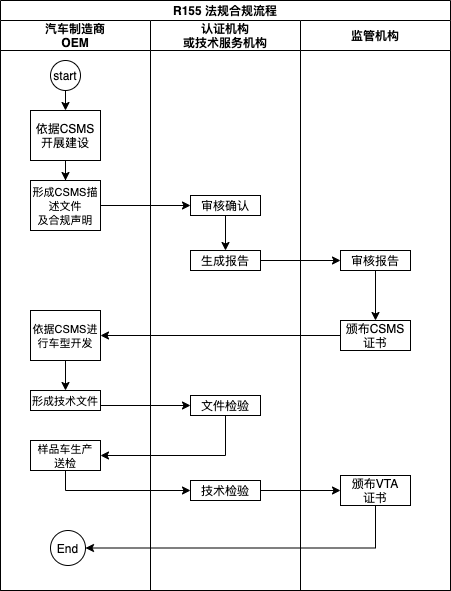

# UNECE WP 29 

## 概念

- UNECE 即联合国欧洲经委会(United Nations Economic Commission for Europe)
  - 建立于1947年，是联合国经济及社会理事会下属的5个地区委员会之一。
  - 有56个成员，除欧洲外，还包括美国、加拿大、以色列和中亚国家。
  - 总部位于瑞士日内瓦。
- WP.29 即车辆法规协调世界论坛（World Forum for Harmonization of Vehicle Regulations）
  - UNECE的内陆运输委员会ITC的附属机构，旨在协调、制定汽车领域技术法规。
  - 目前管理3个联合国协议：
  - 联合国1958年协议《关于采用统一条件批准机动车辆设备和部件并相互承认此批准的协定书》
    - 54个缔约国：所有欧盟国家、其他OECD国家（如日本、土耳其、俄罗斯、澳大利亚、南非）
  - 联合国1998年协议《关于建立机动车辆设备和部件的全球技术法规的协议》，即 UN GPR
  - 联合国1997年协定《关于采用统一条件进行轮式车辆定期技术检查并相互认可此类检查的协定》

- GRVA 自动驾驶和网联车工作组（Working Party  on Automated and Connected Vehicles Autonomous)
- TF CS/OTA 网联安全和OTA焦点组（Task Force on Cyber Security and Over The Air issuses)

- R155 法案：《关于认证车辆在网络安全和网络安全管理系统方面的统一规定》
  - 2020年6月颁布
  - 2021年1月22日正式生效，针对新车型有48个月的过渡期。可以申请CSMS合规证书，可以申请车型认证VTA；之后产生的为新车型。
  - 2022年7月1日，要求现有架构新车通过认证。
  - 2024年7月1日，要求现有架构所有车型通过认证（CSMS+VTA）
  - 2025年1月过渡期结束，要求所有架构车型通过认证。
  - 适用车型：
    - M类（载客）和N类（载货）车辆
    - 装有至少有一个电子控制器的O类（挂车）车辆
    - 若配备了3级起的自动驾驶功能、L6和L7类车辆

- R156 法案：《关于认证车辆在软件更新和软件更新管理系统方面的统一规定》
  
- CSMS（Cyber Security Management System） 网络安全管理体系
  - 旨在审查OEM是否在汽车完整生命周期内制定了网络安全流程，确保汽车生命周期中都有对应的流程措施用以控制相关风险。
- VTA （Vehicle Type Approval）车辆（网络安全）型式认证
  - 旨在确保车辆的网络安全防护技术能够覆盖各生命周期的安全需求，且保证实施的防护能应对网络安全威胁。

## 合规方法或流程

### R155 合规认证流程

