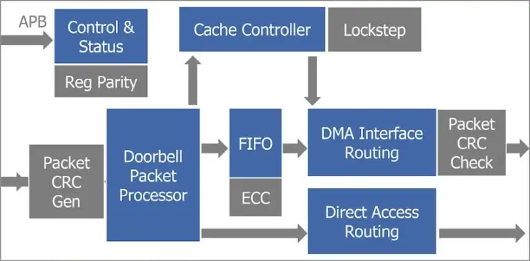
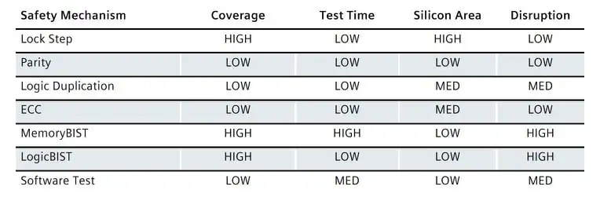
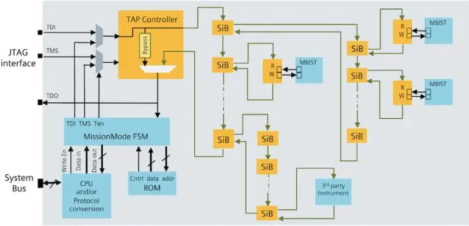
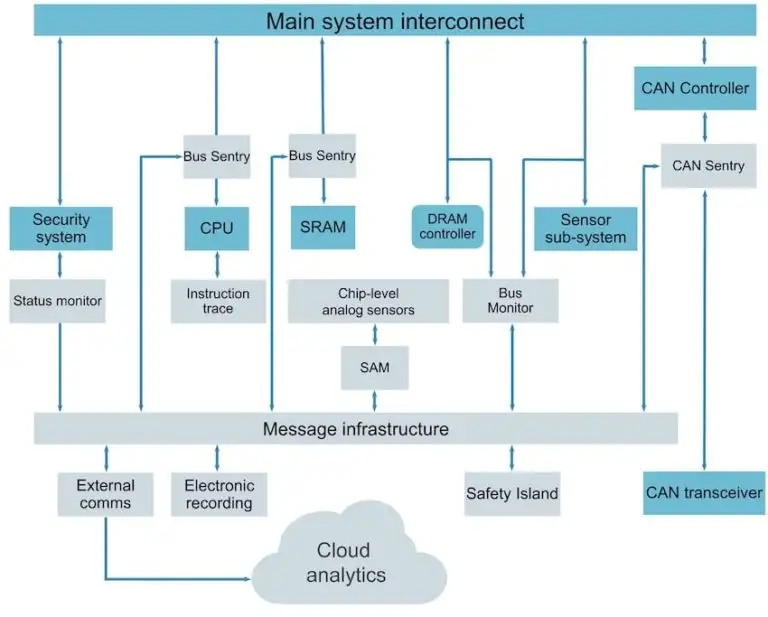
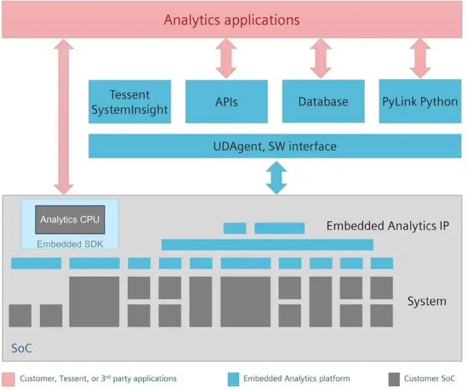

# 功能安全
自动驾驶汽车的前景正在推动汽车半导体部件的设计和测试发生深刻变化。汽车 IC 曾经部署用于控制车窗等简单功能，现在正在执行与高级驾驶辅助系统 (ADAS) 和自动驾驶应用相关的复杂功能。所需的处理能力导致使用尖端工艺的非常大和复杂的 IC。再加上满足 ISO 26262 功能安全标准的安全要求，汽车设备和系统制造商面临着一系列新挑战。但功能安全只是故事的一半；这些系统只有在免受黑客攻击等网络威胁的情况下才是安全的。

这些设备中复杂功能安全和安保内容的增加需要更多的控制和监控。从基本的硬件控制升级到嵌入式 CPU 和软件控制的“安全岛”的可扩展解决方案正变得非常流行。本文探讨了围绕典型安全岛实施的概念以及如何使用它的示例。

## Safety Island

安全岛的承诺是通过以下方式姑那里和控制 SoC内的安全内容：
- 信号故障
- 启用恢复
- 适应未来需求

防止安全关键系统造成的任何损害是功能安全的全部内容。

在芯片内部添加逻辑以检测潜在货瞬态的随机硬件故障时诊断覆盖范围的一部分，同时满足所需的ASIL级别。对于汽车SoC，这些添加的功能安全模块以灰色显示：

SoC中用于IP的安全机制取决于IP的类型，工程师需要权衡覆盖范围、测试时间、硅片面积和对正常运行的中断量：

使用 Tessent MissionMode 架构可以轻松将这些安全机制连接在一起，其中SiB是段插入位，FSM代表有限状态机。

添加 Secure CPU 后，MissionMode 控制器成为Safety Island。

添加这个安全岛时，他与设计的其他部分是分开的，这表现在逻辑上、物理上、供电上的相互独立。

### 内存 BIST
Memeory Built-in Self-Test 可以测试任何内存实例，所以问题是何时运行这些测试。使用非破坏性内存BIST，BIST引擎只进行bursts测试，这时SoC可以正常运行。Safety CPU 是决定何时做bursts测试的大脑，它基于系统活动进行判断。

## Beyond Just Test
BIST 通过IJTAG 接口进行管理，而且它测试硅的结构化缺陷。可以添加的另一种类型的IP成为嵌入式分析，他对整个SoC进行监控和数据收集，以进行更高级别的安全检查，甚至了解网络安全活动。

安全岛连接的消息框架

### 嵌入式分析

嵌入式分析SDK，是一个在SoC内的潜入式安全管理器上运行的软件库，它配置和控制嵌入式分析监视器。

## 