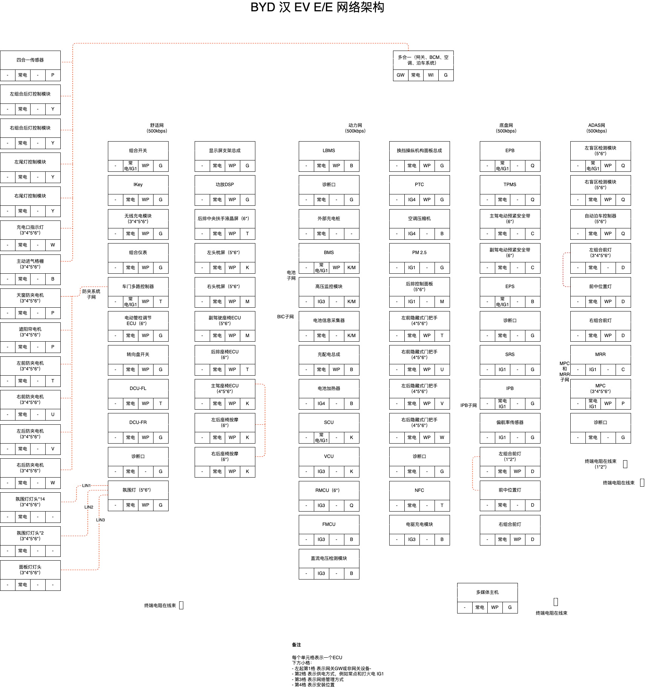
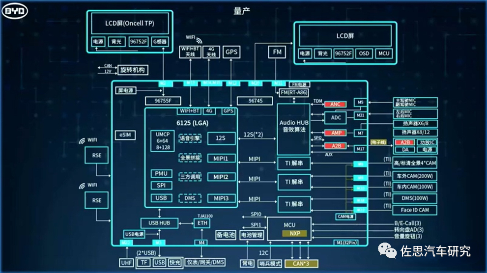
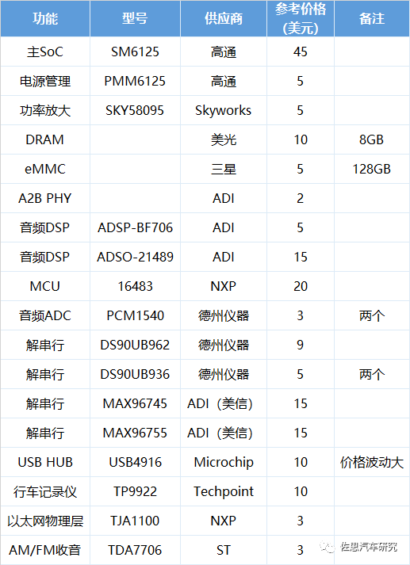
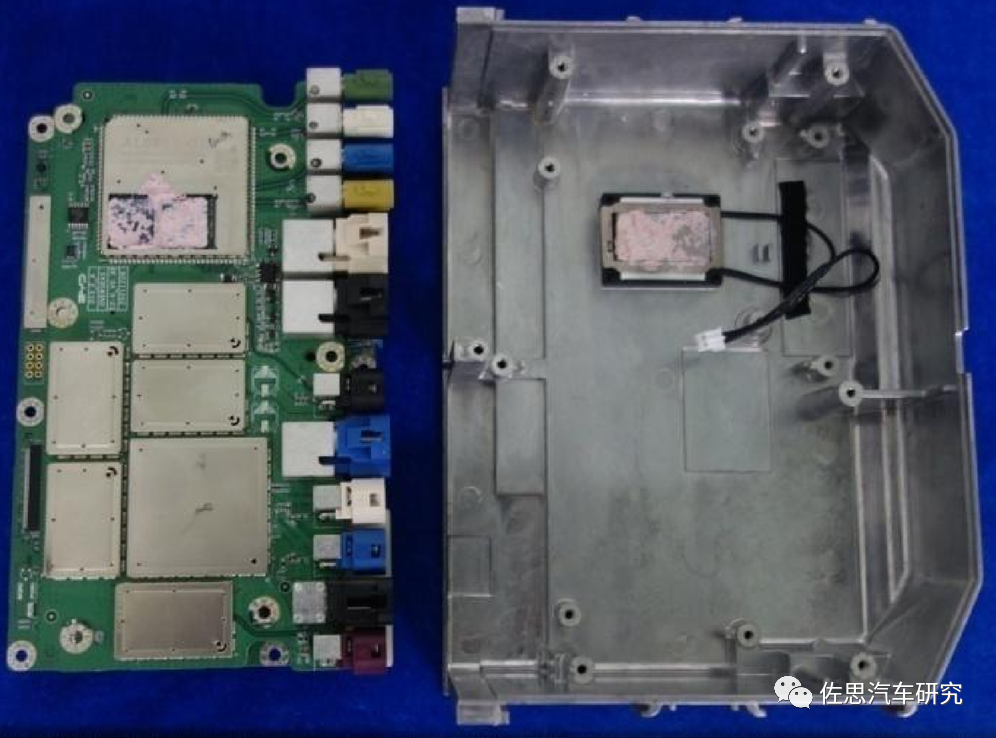
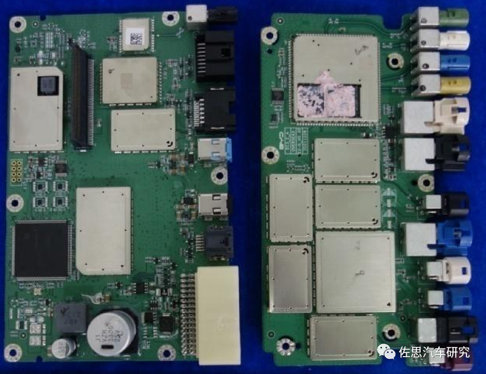
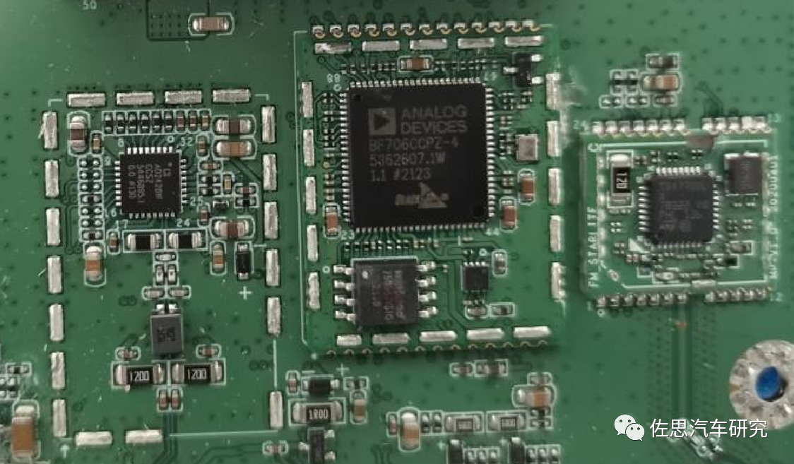
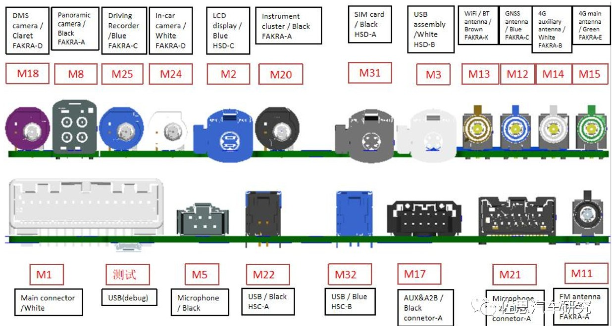

# 比亚迪

## 低压系统

### 汉  车型

电池采用12V 锂蓄电池，电量 25Ah，首款于2011年完成，2013年用在 DM 秦/唐，目前已经发展三代。可以满足各种功能，例如低温冷启动、彭亨低压用电器。电池容量是传统铅酸铁铝电池的20%。

下图为汉ev的网络框架

## DiLINK 3.0

比亚迪对座舱独立特行，使用消费电子芯片做汽车电子（事实上Tesla也是这样，使用AMD reyzen芯片支持最新 Model S plain）、高通8953（625）芯片、高通6125（665）芯片、高通6350（690）、6490等芯片作为通信模组。低端车型使用廉价的 NXP i.MX6 芯片。L3/L4级自动驾驶，高通骁龙 888也可以。

DiLink 3.0 和 4.0是当前（2021～2022）主要平台，4.0 使用5G（高通 SD690）

上图中比亚迪 DiLink 3.0 内部框图。

核心部分：
- LGA 封装（“land grid array”，或者叫“平面网格阵列封装”）的高通SM6125核心模组
- 6+6GB、8+128GB MCP 存储（Multiple Chip Package），一个塑料封装外壳内，垂直堆叠大小不同的各类 存储器 或非存储器芯片，是一种一级单封装的混合技术，用此方法节约小巧 印刷电路板 PCB空间。
- 车机为平台化设计，除元车型外全部为标配，不同车型是内存和屏幕大小的差异
- 左边屏幕是中控屏
- 右边是仪表屏
- 带有4G Modeom
- 包括T-Box

比亚迪自有 SM 6125 是一种SoM模组，类似常用的4G/5G通信模组，有自制能力。宝马电动车旗舰产品iX用的5G模组就是比亚迪生产的。

### 车机
比亚迪车机主要芯片一览表

左边是ADI的A2B音频总线Phy，中间是ADI的音频DSP BF706CCP，价格大概5美元，右边是AM/FM收音芯片，即意法半导体的TDA7706。从框架图也可以看出，比亚迪的音频功率放大是单独外置在车机外的，这是奔驰宝马豪华车的标准做法，只有这样才可能保证音质。本土品牌如此重视音质，恐怕只有比亚迪一家。

美国国家公路交通安全管理局(NHTSA)推荐电动车要产生警示声音，旨在提醒行人有EV、HEV和PHEV存在的声音。司机可以触发警示音(类似于汽车喇叭的声音，但不那么急迫)。但在低速时，声音必须能自动响起。声音有很多，从人造信号音到模仿发动机噪音和轮胎经过砾石的真实声音。ADI公司提供两种不同解决方案，包括用于EV的车内发动机声音模拟以及外部发动机声音产生。高端应用方案基于ADSP-BF706开发。对于入门级应用，则基于ADAU1450 SigmaDSP。比亚迪就采用了高端方案。ADSP-BF706 Blackfin®处理器为音频处理和CAN总线接口提供单芯片解决方案。ADI公司开发了在ADSP-BF706上运行的CAN软件协议栈，使得用户能以极少的工作量构建汽车级演示(也可以使用Vector公司CAN协议栈)。此外，ADI公司提供完整的硬件和软件参考设计，以及用于实时参数调试的SigmaStudio开发环境。

**对音频芯片及应用的攻击可能是一个新方向。**

B板中部是MCU，根据框架图里的描述，似乎是一个NXP的MCU，可能是S32K系列，这个系列目前仍然非常紧俏，交货期超过52周也就是一年。比亚迪是能自制MCU的，但车机领域牵涉庞大的生态系统，比亚迪也无能为力。MCU上部的屏蔽罩里是ADI的ADSP-21489芯片，这是一个音效DSP芯片，价格大约12-15美元。

B板背面有两颗音频ADC，即德州仪器的PCM1540，是针对麦克风的。

SM6125模组，模组包含了5个芯片，主芯片高通6125，射频功率放大芯片是Skyworks的SKY58095，电源管理芯片是高通的PMM6125，还有三星的eMMC和高通的WLAN与BT二合一芯片。

SM6125模组，模组包含了5个芯片，主芯片高通6125，射频功率放大芯片是Skyworks的SKY58095，电源管理芯片是高通的PMM6125，还有三星的eMMC和高通的WLAN与BT二合一芯片。

360环视和其他摄像头部分。比亚迪有8个摄像头，对应三个德州仪器的解串行芯片。4个360环视对应德州仪器的DS90UB962Q-1，大概9美元。两个200万像素摄像头对应德州仪器DS90UB936Q-1，价格大概5美元。

有一颗似乎是行车记录仪专用芯片Techpoint的TP9922。Techpoint是一家日本的小公司，员工总人数不到80人。2021年收入大约6400万美元，70%都来自中国，其中车用芯片占一半，估计比亚迪是其最大客户。在比亚迪DiLink 4.0里也有两颗Techpoint的芯片。

除了德州仪器的解串行，比亚迪也用了美信（ADI）的解串行。

MAX96745/96755这两颗解串行都需要NDA才能拿到资料。不过从框架图上可以看出这两颗芯片，一颗对应中控屏，应该是MIPI DSI或HDMI转LVDS，另一颗对应仪表屏，也是MIPI DSI或HDMI转LVDS。

其他比较重要的芯片还有USB HUB的USB4916，由Microchip提供，应该是一款比较紧缺的芯片，特斯拉后排缺少USB接口就是因为USB4916太紧缺了，不过处在芯片交易圣地的深圳，只要出得起价钱，没有芯片是买不到的。还有100M以太网物理层芯片，即NXP的TJA1100。

背部接口

尽管比亚迪半导体能做芯片，但比亚迪车机里找不到比亚迪的芯片，比亚迪销量暴增，单从车机领域来说，高通和ADI是大赢家。国产芯片任重道远。

拆机图片和背板接口图片取自美国FCC网站。
