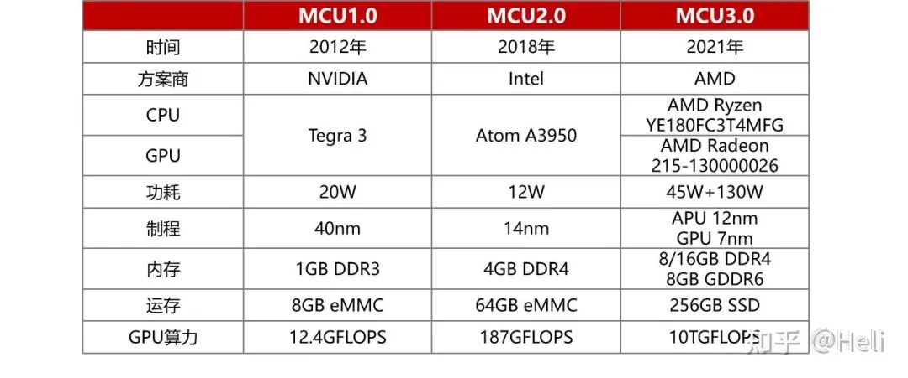
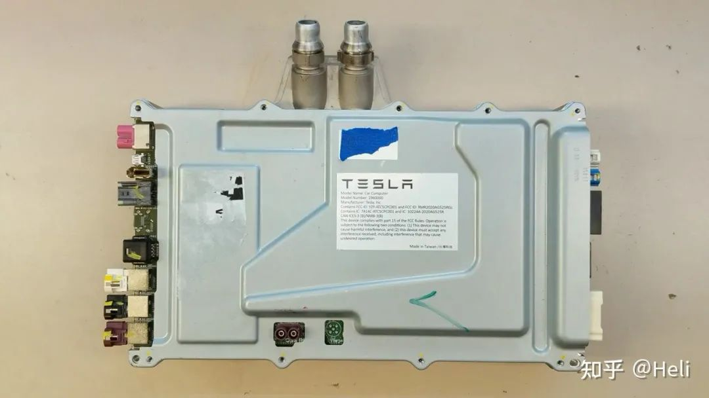
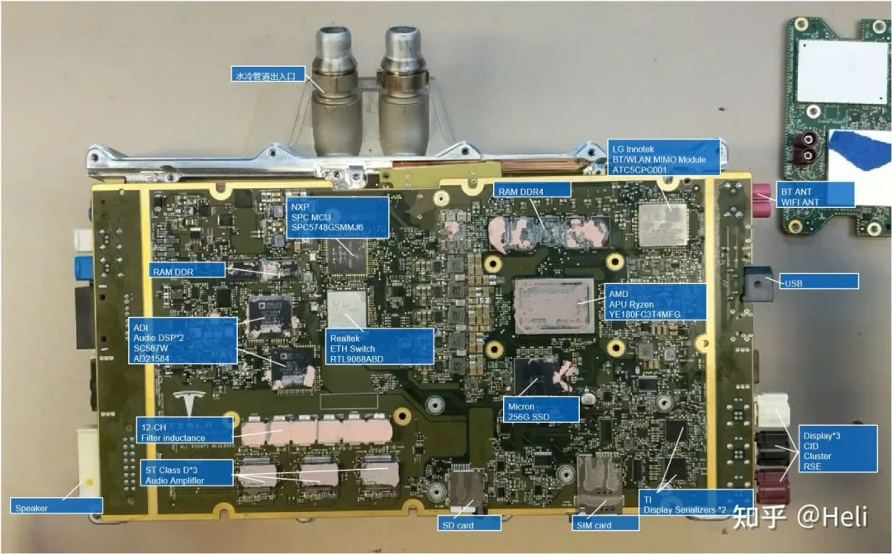
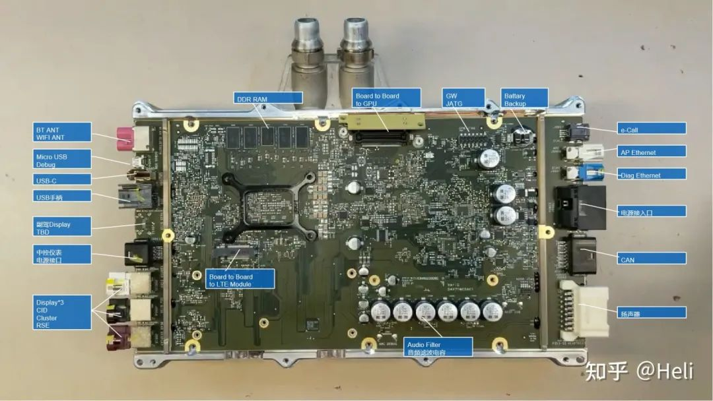
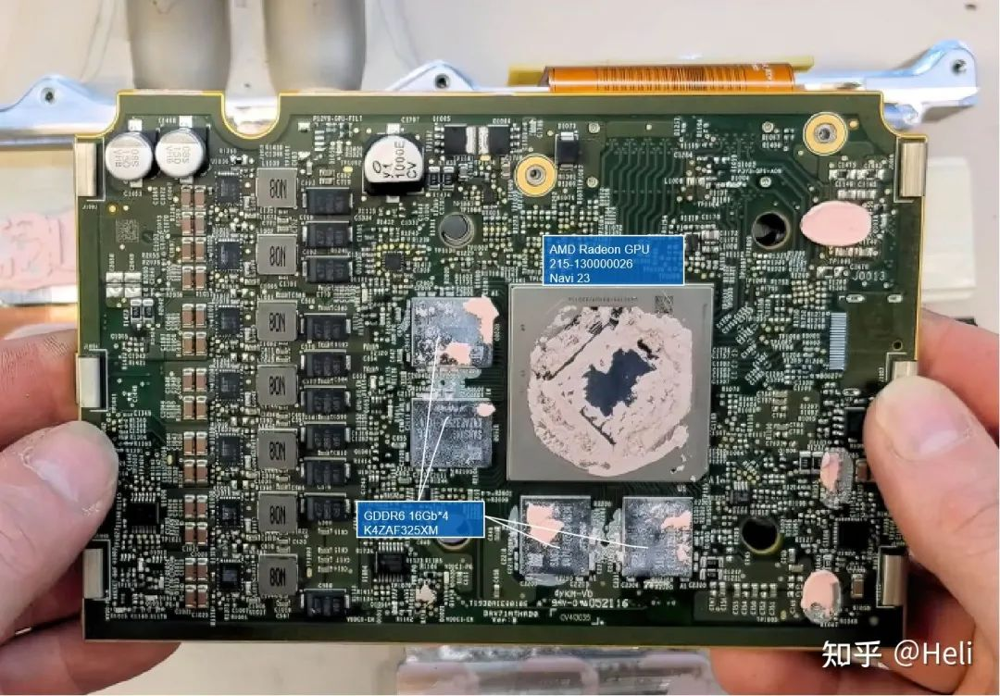
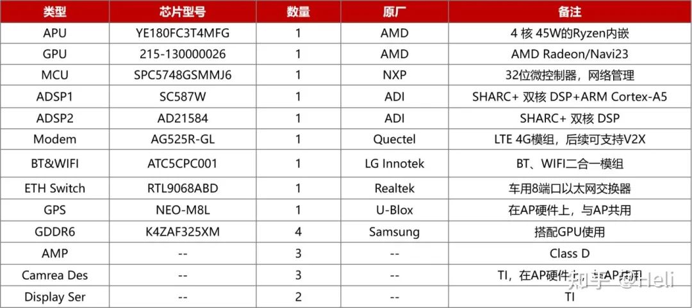
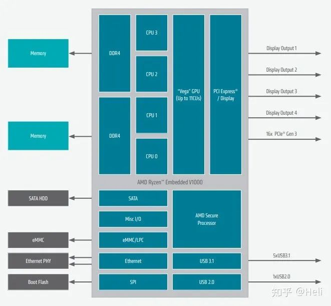
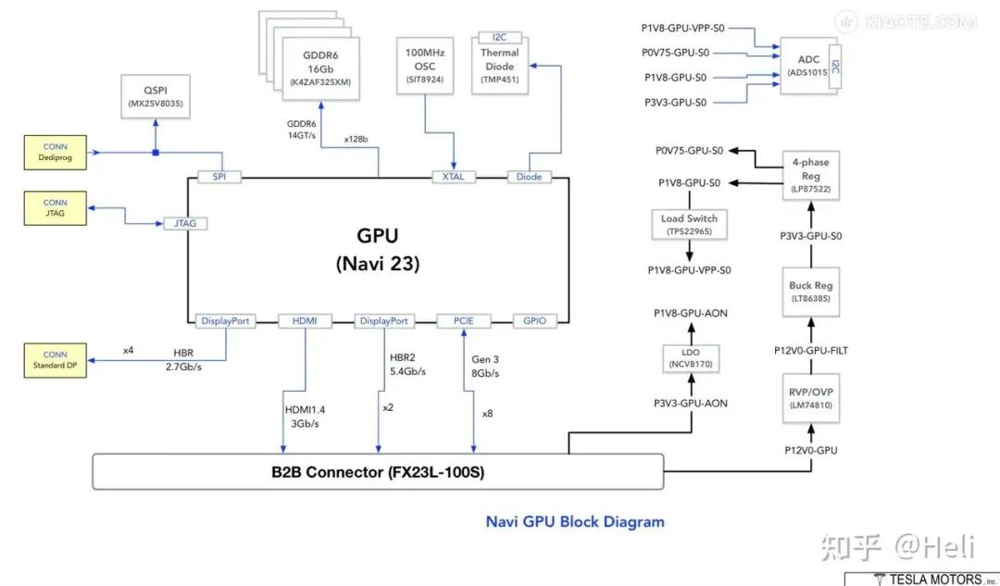

# Tesla

## 特斯拉 MCU 迭代

## Model S Plaid MCU 3.0

### 中央计算模块 CCM

CCM一共有四块PCB板，比Model 3多了一块AMD GPU核心板，包括1多媒体控制主板，2通信小板，3GPU核心板，另一面为4自动驾驶单元Autopilot板。

特斯拉的硬件平台化是真的优秀，不同PCB板可以搭配组合，Model Y与Model S通信小板长得完全一样，Autopilot与Model3 AP 3.0也基本没改动。

下面详细看下变化比较大的MCU3.0的两块PCBA，大PCBA正面主要包括了APU、MCU、ADSP、BT&WIFI模组、显示Serializers、Amplifler等关键器件，关键器件放置在一面有助于PCBA生产的二次回炉。

大PCBA背面主要防止一些阻容感等无源器件。

GPU主板主要为GPU和4颗GDDR6独立显存，GPU的OPN号为215-130000026。

MCU关键器件清单如下：

APU选择AMD的锐龙嵌入式V1000系列处理器，OPN型号为“YE180FC3T4MFG”，官网没找到这颗APU芯片，应该属于定制物料，符合AEC-Q100车规认证。APU是“Accelerated Processing Units”的简称，翻译过来叫加速处理器，将处理器CPU和集成GPU核心做在一个晶片上，即在同一个芯片上。

“YE”代表Ryzen Embedded，“180F”代表这颗处理器属于嵌入式V1000系列，“C3”代表TDP为45W，“T”代表芯片的物理封装为FP5 BGA，“4M”代表这颗芯片拥有4核心CPU，“FG”Zen+架构的Picasso APU。

物料OPN与V1807B的“YE1807C3T4MFB”仅差两个字母，应该属于同一系列，CPU基频3.35GHz(3.8GHz max)，4核，内有Vega 11集显(1300MHz)，支持2x 10Gb以太网，视频显示能力最大4x HDMI 2.0b or 4x DP 1.4，支持Dual Channel的DDR（内存条）。

GPU部分网传一张带Tesla公司的架构框图，核心为Navi23，OPN号为215-130000026，搭配4颗三星独立显存GDDR6，一颗16Gb(2GB)共8GB，速率14GT/s，显存接口128-bit，外围还有电源、JTAG调试口，晶振，热传感器等，GPU的HDMI、DP、PCIE结构通过B2B（Board to Board）板对板连接器与大板APU链接。

连接器型号为FX23L-100S，供应商为广濑HRS，100Pin，最大传输速率支持8Gbps，能够满足HDMI/DP/PCIE Gen3的高速数据传输需求。

