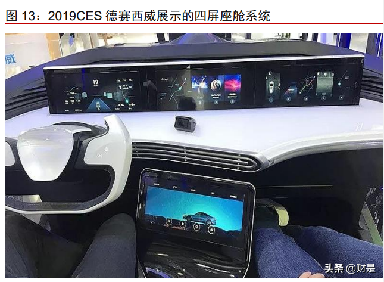
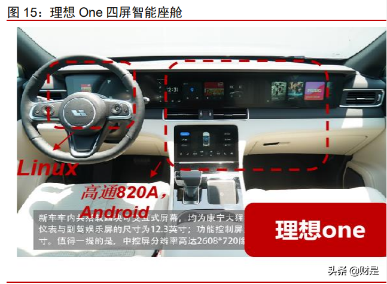
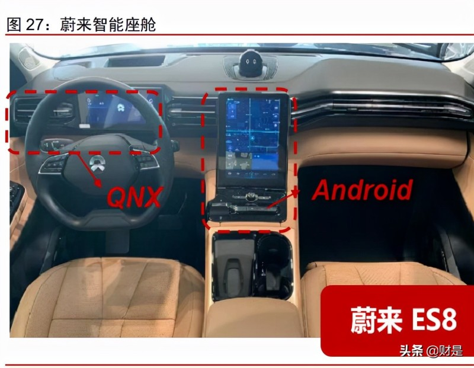
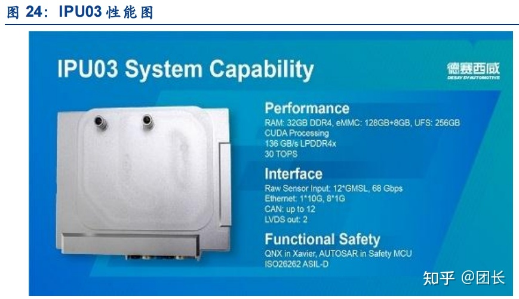
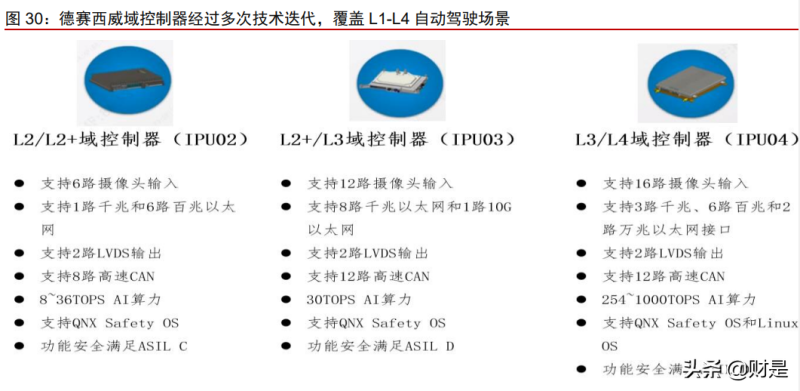
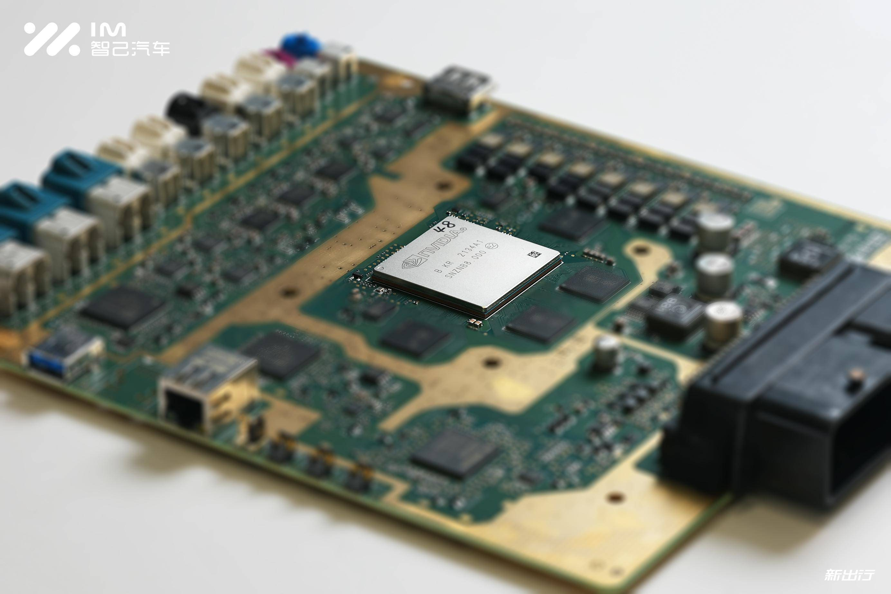
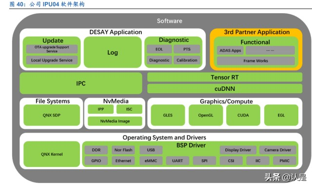

# 德赛西威

#### 智能座舱
2017 年德赛西威发布国内首款基于用户使用场景设计的多屏融合智能座舱。在 2018 年的亚洲 CES 展上，德赛西威展示了新一代智能驾驶舱技术：
- 双 12.3 英寸显示屏、10.1 英寸车身控制触摸屏以及全息影像。 
- 多屏间协同交互使得驾驶舱交互更为高效智能。

2019 年 CES 展上，德赛展示完整的四屏座舱系统，包含：
- 全液晶仪表（QNX 系统）
- 中控屏幕
- 副驾驶娱乐系统
- 车辆控制屏幕。
- 底层支持高通、恩智浦等计算芯片，兼容 Linux、安卓等车载系统。

公司的明星产品是长安 CS75 双联屏、理想 One 双芯四屏等。长安 CS75 双联屏、 理想 One 双芯四屏等在 2019 年下半年推出，均成为车型座舱内最大亮点。其中理想 One 双芯四屏产品
- 底层为：Andriod/Linux 双系统
- 仪表盘和车控屏通过德州仪器 J6 芯片驱动
- 运行比较稳定的 Linux 系统；
- 中央大屏和副驾娱乐屏则是通过高通骁龙 820A 芯片驱动， 运行比较开放的 Android 系统。
- 四块屏幕可以从物理上区分交互逻辑与层次。

公司首款自主研发的智能座舱域控制器在奇瑞的瑞虎 8PLUS 上落地。该方案：
- 搭载两 个 12.3 英寸的智慧交互屏幕
-  6 核瑞萨 R-CAR H3 系列高性能芯片；
-  采用异构双系统： 安全需求高的仪表盘采用 QNX Hypervisor 2.0 虚拟机；
-  中控屏采用生态更为丰富的 Android 9.0 系统提供娱乐功能。
- 智能座舱域控制器为双操作系统的灵活使用提供了可能。
- 该智能座舱域控制器同时还为公司实现首个 AR 导航方案的量产落地，通过摄像头收集的实施车外景象和视频，同时投影到仪表盘上，将驾驶信息和导航实景相互融 合。
- 公司的下一代基于高通 8155 的智能座舱域控制器也已经有成型产品，具备出货能力。

芯片端，一芯多屏需要芯片能够提供更高的算力。应对这一点，底层芯片厂商高 通、瑞萨、NXP 等陆续推出新款高性能芯片，以支撑多屏的使用效果。其中高通迅速崛起， 依靠将成型的手机芯片进行车规级改造，快速推出高算力系列芯片实现迭代；高通的820A、 SA8155 以及即将推出的 SA8295 等芯片受到高端车型的青睐，德赛西威也选择了与高通 合作部署自己的智能座舱系统业务。德赛西威领先市场布局，迅速推出了自己基于高通平 台的智能座舱产品。以一颗芯片取代此前多芯片的架构，可以实现将 此前用于人车交互的大量功能整合，更方便车身 E/E 架构设计。以高通 820A 为例，单 颗芯片分为 5 个部分，分别是 CPU、GPU、数字信号处理器（DSP）、图像信号处理器（ISP） 及调制解调器，还有 Wi-Fi、蓝牙、4G 通信、GPS 定位等各类模块，原本分散于多个芯 片中的功能实现统一。此外，高通 820A 可以很好适配安卓系统，支持 8 路摄像头视频信 号、图像识别和传感器融合的深度学习技术，并能为 3D 倒车影像、驾驶员监测以及简单 ADAS 算法提供算力。

从操作系统角度来看，Hypervisor 虚机保证了同一智能座舱系统使用不同的操作 系统，从而保证安全性与通用性。由于不同屏幕负责的功能不同，对应的安全等级不同。 实时操作系统 QNX 是微内核的操作系统，在实时性和安全性上有保证，但本身开发难度 高，上层生态应用不足；Linux、Android 等非实时性操作系统，安全性上存在不足，但开 发相对简单且上层应用生态随智能手机发展已经较为丰富。为了解决两个系统并存的问题， 在车载芯片及多个上层系统之间引入虚拟化管理的系统概念，来分配 CPU 资源、协调命 令执行，打造一个可以同时运行多套独立操作系统的环境。

采用双系统的主要目的是兼顾使用者感受与驾驶安全性。Android 系统具备更完善的 娱乐生态和更多的开发者资源，QNX 系统则更强调保证驾驶的安全性，避免娱乐功能的屏 幕出现系统崩溃从而影响驾驶的情况。Linux 系统相对稳定，能够保证车辆控制和驾驶等 相关功能的安全运行。当前，“安卓/Linux&高通”+“QNX&德州仪器/瑞萨”的组合成为 了大量车厂的智能座舱解决方案选择。随着一芯多屏多系统开始逐步升级成为主流，使用 高通高算力芯片同时支撑多个虚拟化操作系统的做法也开始为部分高端车型选用。

长期来看，智能座舱域一芯多屏多系统成为未来趋势。一芯多屏—双/多联屏—智能座 舱与智能驾驶域融合，每一层级对厂商的软件能力要求逐步提升。随座舱域芯片算力提升， 积累部分冗余，部分 ADAS 能力可以被集成在座舱域控制器中，使其重要性进一步提升。

#### 自动驾驶
德赛西威公司的自动驾驶解决方案整合软硬件全栈解决方案：
- 硬件方面，公司拥有自研的传感器能力与域控制器能力；
- 软件方面，公司在低速 ADAS 算法领域展开自研，并通过将软硬件打通融合，实现自身一体化的低速自动驾驶解决方案能力。

公司 2016 年开始智能驾驶研发布局，当前已经实现了全自研的算法+传感器+域控制器一体化解决方案，包含域控制器、摄像头、毫米波雷达、T-BOX 以及 ADAS 算法等， 主要有以下产品：

- 硬件——域控制器：自动驾驶域控制器 IPU02、IPU03、IPU04；

- 硬件——传感器等：摄像头、24G 与 77G 毫米波雷达、超声波雷达、T-BOX、 V2X、地图定位等。
- 算法侧：DMS、360 环视、泊车辅助 APA、AVP 以及部分高速自动驾驶算法。

从技术路径上来看，公司当前已经实现了自研算法+传感器+域控制器一体化解决方案， 通过正向的研发-落地循环，积累了丰富的自动驾驶关键技术，包括图像感知、激光雷达点 云处理、高精地图、融合 RTK 和高精地图的厘米级高精定位、雷达等多传感器融合，以 及路径规划和控制技术等。

2020年上半年，德赛西威公司L3级别自动驾驶域控制器产品——IPU03 正式量产，配套供货小鹏汽车P7车型。IPU03 搭载 Xavier 芯片。

德赛西威在传感器上非常领先。毫米波雷达、车载摄像头，这两样是自动驾驶的核心传感器。德赛西威目前已经可以量产77GHz毫米波雷达，研发进展处于国内领先水平。

IPU02：搭载德州仪器Jacinto 7处理器架构开发的TDA4VM处理器系列，支持 ACC 自适应巡航系统、AEB 自动紧急制动系 统，可支持公司自研 360 环视+APA+AVP 低速自动驾驶算法，可以选配搭载高速自动驾驶 算法（如上下匝道、跟车等），并与全自研自产的传感器摄像头、毫米波雷达、超声波雷 达结合，形成独立的一体化解决方案。IPU02 的产品技术创新性在于在低速的情况下，通 过复用部分高速场景传感器，再加上超声波和环视摄像头来实现代客泊车。IPU02 的单车 ASP 在 3000 元以上。2021 年三季度公司已经量产搭载代客泊车功能的 IPU02 产品。

IPU03：基于英伟达 Xavier 芯片，于 2020 年 4 月在小鹏 P7 上正式批量出货，为整 车提供 L3 级别自动驾驶技术的算力支持。IPU03 通过多传感器进行数据采集，最高可接 入 16 路高清摄像头、5 个毫米波雷达、12 路超声波传感器以及 1-3 个激光雷达，能实时 计算整车自身行驶状态以及周边环境的数据信息，实现 360 度全方位感知融合并做出安全 的决策及控制，支持高速场景下的上下匝道、自主变道，城市道路的塞车自动跟车，低速 场景下的自动泊车 APA 以及停车场记忆泊车 VAP 等功能。

IPU04：将基于英伟达 Orin 最新一代自动驾驶芯片平台，预计将于 2022 年年中出货， 已经获得来自理想 X 的订单。我们估算 IPU04 单车 ASP 超过 1 万元。由于 Orin 相较于 Xavier 在 L3+以上智能驾驶上能提供更强的算力，我们认为 IPU04 作为国内乃至全球首款 落地的英伟达 Orin 域控制器，将会成为公司的标杆出货产品。根据 2021 年半年报披露， IPU04 当前除理想以外已在其他多个客户定点。（报告来源：未来智库）

#### 自动驾驶算法

除了域控制器外，公司不断研发 ADAS 算法产品，优先在低速自动驾驶领域实现突 破。一方面，公司聚焦低速算法落地，在 360 环视+APA 辅助泊车+AVP 自主泊车的低速 自动驾驶场景，实现研发的快速产品化落地；另一方面，前瞻布局高速自动驾驶领域，公 司新加坡团队在 2019 年获得新加坡陆路交通管理局（LTA）颁发的无人驾驶车辆第一阶段 路测的牌照，专门开发 L4 和 L5 级自动驾驶和汽车网络安全的前沿技术。

公司当前自动驾驶 ADAS 产品输出以 360 环视、自动泊车两类产品为主，两类技术可 以分别输出也可协同输出。360 环视在全球具有技术领先优势，自动泊车是全球第一款高 清全景融合超声波传感器全自动泊车系统。公司自动驾驶技术坚持全栈自研，硬件产品（毫 米波雷达和摄像头）可以制造，软件算法（自动泊车、疲劳监控 DMS）也可以自行研发， 具备软硬件一体化能力。目前 360 环视、APA 辅助泊车技术在国内自主品牌（吉利、奇瑞） 落地，采购英伟达 Orin 芯片的 IPU04 域控制器即将在理想新车型上量产，预计未来会在 自主品牌和合资品牌有更多落地。

1）360 环视：软件算法结合硬件探测器，保护行车安全。360 环视系统是车机通过摄 像头探测器采集车辆四周的影像，经过图像处理单元一系列的智能算法处理，最终形成一 幅车辆四周的全景俯视图显示在屏幕上，直观地呈现出车辆所处的位置和周边情况。360 环视可以协助驾驶员处理车辆起步、行车转弯、泊车入位、窄道会车、规避障碍等情况， 为车辆提供了最基础的 ADAS 能力。

2）自动泊车系统：德赛西威推出全球第一款高清全景融合超声波传感器全自动泊车 系统，通过深度融合摄像头的视觉+超声波融合解决方案，算法上与 MOMENTA 合作，实 现 3D 泊车指引、特定车位泊车的功能，覆盖 80%的泊车场景；相较而言，传统 APA 超声 波方案仅能完成水平、垂直、斜向三种泊车动作。公司产品已在奇瑞星途、吉利星越等车 型上量产。

APA 泊车辅助属于 AVP 的前置技术，是最常见的泊车辅助系统。在汽车低速巡航时 候，使用超声波雷达等传感器完成定位，帮助驾驶员找到尺寸合适的停车位，并在驾驶员 发出泊车指令的时候，将汽车泊入停车位。应用的硬件设备包括 8 个车前车后的 UPA 超 声波雷达，4 个装在车两侧的 APA 超声波雷达。APA 需要驾驶员在车内实时监控，以保证 泊车顺利完成，属于 L2 级别的自动驾驶技术。

公司的自动泊车系统与 360 环视系统集成于同一 ECU，相较于只能提供一个算法的 供应商而言，主机厂采购德赛西威的整体方案成本更低。预计公司进一步将 AVP 集成进入 IPU02 控制器，从而不断提升产品价值量。

3）AVP 自主泊车：自动代客泊车 AVP（Auto Valet Parking）普遍被认为是最早能够 实现的量产的 L4 级别自动驾驶技术，因为其速度较低，场景较为封闭，安全系数较高。 公司基于自身毫米波雷达能力，自主 AVP 算法，实现向吉利星越 L 的 AVP 供货，并在长 城拿到 AVP 定点项目。

4）高速自动驾驶场景探索：除了已经量产的 L3 级别功能外，公司同时在新加坡开设 专门的 L4-L5 研发团队。2019 年 12 月，公司获得新加坡 M1 自动驾驶牌照，意味着公司 的测试车获得在新加坡特殊区域公共道路行驶的资格。

L3 以上自动驾驶技术由于将事故责任界定为汽车自身，且技术较为超前，因此当前落 地进展较慢。德赛西威当前研发集中于 ADAS，具备相对成熟的落地路径。公司的 APA 已 经在领克 06 等多个车型落地，区别于一般的自动泊车，驾驶员可以在车外实现一键泊车， 而不需要停留在车内。AVP 技术已经在吉利星越 L 落地，并在长城部分车型进行试点。公 司将 360 环视、APA、AVP 等低速自动驾驶技术与 IPU02 自动驾驶域控制器整合，为客 户提供可选择的打包服务。

### IPU 04

在英伟达 Orin 系列 SoC 推出之前，业内主流的大算力芯片包括特斯拉的 FSD 以及英伟达的 Xavier 等。

Xavier 的算力为 30 TOPS，特斯拉 FSD 单 SoC 算力为 72 TOPS。2019 年，英伟达在 GTC 大会上推出 Orin Soc，每秒可运行 200 万亿次计算，性能相当于上一代 （Xavier） 的 7 倍。

2020 年，英伟达又基于当年发布的新架构 Ampere 安培架构对 Orin 进行了升级，并规划了覆盖 10 TOPS - 200 TOPS - 2000 TOPS 多个版本的计算平台。由于产能和产品规划原因，Orin 系列最终推出的 SoC 是 2 个版本： 
- 110 TOPS   的 Orin 和   
- 254 TOPS   的 OrinX。
- 基于多个 Orin 或者 OrinX 的组合，对应的智能驾驶域控制器算力可达 1000 TOPS 以上。

IPU 04 最高可接入   16 路 高清摄像头， 5 个 毫米波雷达， 12 路 超声波传感器，以及   1 - 3 个 激光雷达。

蓝鲸 OS4.0：公司自主研发的蓝鲸 OS4.0 搭载骁龙 8155 芯片，一芯多屏，前 后排应用可相互共享，首创原子组件 Launcher、动态壁纸等可跟随账号切换不 同场景应用。在 27 寸大屏中支持应用双开，三种尺寸自由变换。首款基于地图 的社交漂流瓶应用、自定义语音形象、丰富生态能力，给用户带来全新的驾驶娱 乐体验。

2) 整车级 OTA：公司深耕 OTA 领域，做一站式 OTA 解决方案，包含云端，车载 终端，后台业务管理系统。自主研发了 OTA 差分算法（已获得专利），多协议、 多账号，无感升级，安全认证等核心关键技术，可以实现单 ECU、多 ECU、整 车、甚至是生态系统级 OTA 升级，为车厂提供一个成熟稳定可靠的 OTA 系统。

3) 信息安全：公司构建了 PKI 系统、数据加密、入侵检测 IDPS、终端安全、渗透 测试等多个层级的安全方案，从云，管，端三大通道为用户提供全方位的信息安 全保护。同时具备了风险管理，安全运维管理，安全事件管理，安全流程管理四 大安全管理能力，在行业内率先拿到国家公安部等级保护三级认证资格， IDS&IDPS 等产品可以助力车厂满足国家相关信息安全法律法规。

