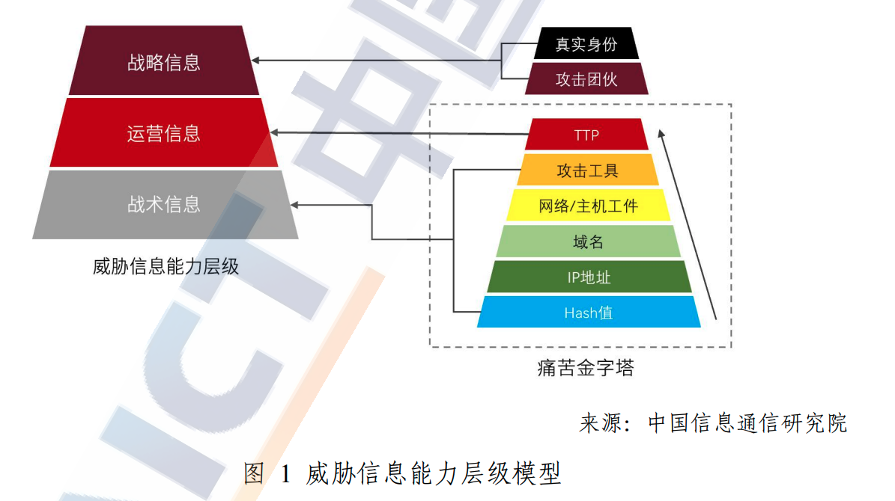

# 威胁情报

2021.3.12.《中华人民共和国国民经济和社会发展第十四个五年规划和2035远景目标纲要》正式发布明确提出要将“加强安全基础设施建设，强化跨领域网络安全信息共享和工作协同，提升网络安全威胁发现、监测预警、应急指挥、攻击溯源能力”

网络安全威胁情报，作为发现网络威胁、抵御网络攻击的重要依托，助力信息安全防御手段向主动化、自动化、精准化转型，对维护国家网络空间安全、建设数字中国具有重要意义。

## 概念

### 网络安全威胁信息的概念

综合国内外研究，归纳分析了多方定义后，信通院和微步发布的白皮书中提到：
- 网络安全威胁信息来源于对既往网络安全威胁的研究、归纳、总结，并作用于已知网络安全威胁或即将出现的网络威胁；
- 网络安全威胁信息的价值是为受相关网络安全威胁影响的企业或对象提供可机器读取或人类读取的战术战略数据并辅助其决策。因此，网络安全威胁信息需要包含背景、机制、指标等能够辅助决策的各项内容。

研究对象是威胁，包含以下失陷指标（Indicators of Compromise IOC）：
- 木马样本或其hash值
- 远控域名
- 攻击IP
- 安全事件
- 攻击团伙

研究结果是通过研究网络威胁的背景、机制、指标等内容，生产出能够作用于该威胁的战术或战略数据，这些数据就是“信息”。信息可分为多个层次：
- 单一失陷指标
- 资产特征
- 时间画像
- 团伙画像
- 攻击者身份

最终这些信息要用来发现威胁、认识威胁、追踪威胁。

### 发展

从Gartner提出该概念，网络安全威胁信息已经发展了8年，形成了专业产线，研发工作高度专业化、高成本。

研发方面：
- 网络安全威胁信息研发产线涵盖原始数据、基础网络数据、网络威胁数据的采集、提取、分析等数据全生命周期管理，研发对象多元、研发环节多。
- 依托于总量大、质量高的原始数据，及互联网公开的信息。
- 对研发人员有较高要求，需要能够感知新型网络威胁的存在，研究威胁投递途径、关联关系等，搭建对应的网络安全威胁狩猎模型进行追踪。最终以来不同类型的分析系统去进行威胁分析和威胁信息的提取。

资深安全专家David J.Bianco 于2013年提出了痛苦金字塔The Pyramid of Pain 威胁信息指标模型，获得业界广泛认可。

根据攻击者的痛苦程度，将IOC指标价值划分了不同层级，从下到上价值依次递增，分别为：
- Hash值
- IP地址
- 域名
- 网络/主机工件
- 攻击工具
- TTPs

随着时代发展，更大的价值还有：
- 攻击团伙画像
- 现实真实身份

### 意义和作用
- 通过公开可用资源预测潜在网络威胁
- 在发生前做好防御
- 实施主动防御
- 精准动态防御

根据PPDR安全防御模型，主要优势体现在：
- 检测方面：能够辅助用户对相关资产、风险、攻击面进行排查，从而让用户快速了解网络当前攻击情况。
- 防御方面：采取主动防护措施，对网络威胁进行精准打击。可以针对IoC进行防护。
- 响应方面：能够帮助提供更完善的安全的安全事件响应方案
- 预测方面：构建安全预警机制，不断收集新型威胁信息，根据当前网络环境薄弱环节有效预测可能的威胁，帮助企业做好应对未知网络安全风险。
- 提升报警准确性、降低无效报警数量、极大减轻运营人员压力，使其聚焦于真实威胁。

## 国内威胁情报相关合作

2021年工信部牵头组建了工业和信息化部网络安全威胁和漏洞信息共享平台（NVDB），督促网络产品提供者合理发布自身安全产品漏洞，鼓励漏洞收集平台和其他漏洞发现组织和个人主动保送漏洞信息，支持开展网络安全产品漏洞技术评估，督促网络产品提供者及时修补产品安全漏洞。

2016.2.国家CERT与中国互联网协会网络信息安全工作委员会联合发起了中国互联网网络安全威胁治理联盟CCTGA，宣布建立专业领域协作机制，联合网络安全领域上下游力量，加强全国网络安全纵深防御体系建设，有效整治互联网地下黑产相关威胁，为净化网络环境和网民利益起到积极作用。

2019.3. 上海市信息安全行业协会协同连尚网络、平安科技、顺风集团成立了“威胁数据共享联盟”，重点共享治理网络威胁的知识体系和信息。通过平台化模式累积网络威胁最佳解决途径、威胁数据脱敏后变成他人可分享知识，进行策略分配到执行的知识库，供联盟内企业进行对比查询，共同推进新技术应用，维护行业安全稳定发展，提升数据治理与安全防御，打造安全创新新生态。

## 形势

- PC端勒索软件2020年全年激增，并造成严重危害
- 移动设备感染率上上，IoT沈北被感染可能性加大
- 对供应链、VPN、漏洞等攻击面的兴趣仍然持续
- 冠状病毒相关域名数量增加
- 疫情相关垃圾邮件大规模出现。2020年趋势科技显示数据表明至少有1600万个与新冠肺炎疫情相关的网络威胁被检出，包括恶意url、垃圾邮件、恶意软件
- 针对远程办公场景的攻击手段增加
- 攻击者活跃度显著提升，主要攻击对象是从事疫苗研发、生物医疗、政策制定的组织和机构。会调整钓鱼诱饵，冒充疫情相关信息引诱攻击对象，窃取核心数据。

攻击手法
- 根据现有数据统计，2020年全球失陷主机6，431，498台，国内约880，607台，约占全球1/8。
- 钓鱼邮件仍是主流攻击手段。
  - 欧盟网络安全局ENISA指出，“攻击包括诸如基于企业工程的电子邮件攻击（BEC）和身份欺骗技术等计划，以使网络钓鱼活动更为有效”。
  - 超过99%的分发恶意软件的电子邮件需要人为干预（包括点击链接、打开文档、接受安全告警、其他）才能有效。
  - 攻击者模拟信誉良好的组织和机构，目标通常是窃取身份验证数据等敏感信息、安装恶意软件或获取信用卡号等财务资源。
  - 一部分钓鱼属于鱼叉式网络钓鱼，具有高度针对性。
  - 无确定攻击目标的“广撒网”式钓鱼攻击更为活跃。
  - 趋势科技发现攻击者开始使用在线表单（调查问卷）来托管钓鱼网站。比假冒域名或网站，创建表单的时间更短，技术成本更低。
  - 钓鱼邮件将与勒索软件、APT攻击等手段相结合，诱饵和所用邮箱也将和企业机构信息有高度相关。

- 远程办公普及，VPN攻击带来新的网络安全挑战。
  - 根据Zscaler数据，CVE数据库中列出了将近500个VPN漏洞；企业中93%的用户使用VPN，94% 的用户知道网络攻击者将VPN作为攻击目标。

- 勒索软件产业化特征明显，攻击手法出现新变化。
  - 利用未修补漏洞、滥用弱的远程桌面协议安全性、恶意软件。
  - Ryuk和Sodinokibi是目前最知名的勒索软件，很大程度上定义了现代勒索软件格局。
  - 2020年还出现了一些新的勒索软件：例如Egregor和DoppelPaymer。
  - RansomExx勒索软件对Linux服务器攻击能力不容小觑，主要目标是VMware环境。及用于存储VMware文件的计算机。
  - 攻击手段也从删除或加密数据，变为定位高价值数据后通过泄漏站点（DLS）间接泄漏被盗数据。这种手法可被理解为BigGameHunter（BGH）的演进。2020年BGH的态势趋于迫使受害者一旦被勒索软件感染就马上进行勒索谈判。
  - 根据保险公司Coalition的数据，2020上半年，colition保单中被勒索软件攻击的频率增加了260%，平均赎金增加了47%，金额达到338，669美元。

- 供应链攻击成为规避网络安全防御措施的新攻击手段
  - solarwinds公司被攻击时2020年最受关注的攻击连攻击事件之一。
  - 