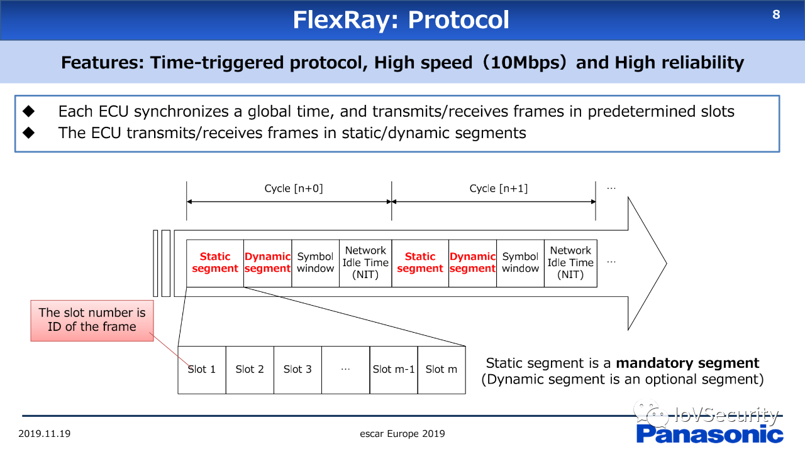

#  实时系统
>参考Kopetz H. Real-time Systems-Design Principles for Distributed Embedded Applications. Springer,2011.

实时系统的定义：系统行为的正确性不仅取决于任务所执行计算的逻辑结果，而且取决于这些结果的产生时刻，这类系统称为实时系统。

实时系统的分类：
- 强实时系统（hard real time system): 系统收到严格的时间约束，违反这些约束可能会对被控环境造成灾难性后果。如核工业。
- 关键实时系统（critical real time system)：如果延迟的结果是错误的，并且失效的后果超过了系统附加值，那么系统的所有运行情况必须进行确认。
  - 如汽车底盘控制、线控转向系统、线控制动系统。
- 弱实时系统（soft real time system）：若系统包含的设备在遵守时间约束方面的要求较低。，如汽车倒车影像。

实时系统受到可靠性约束，涉及运行安全性和容错问题。必须具备以下特点：
- 确定性
- 可预测性
- 冗余、容错
- 耐繁重工作负载
- 可维护性
- 灵活性

实时系统一支持两类应用：
- 事件触发：任意时刻到达的事件
  - 事件触发型总线：CAN、Ethernet、FlexRay
- 时间触发：已知时间点触发
  - 时间触发型总线有：TTCAN、TTP/C、TTEthernet、FlexRay

> 触发：导致某些动作（如执行任务、发送报文）启动的时间。
## Basic
Features:
- Time triggered protocol 
- High Speed (10 Mbps)
- High reliability

### 协议

- Flexray相关ECU会同步一个全局时间，在预定义的slots进行发送和接收帧。
- Flexray在static/dynamic 段实现ECU 收/发帧。

从上图可知，FlexRay的帧结构为：
- 同步 + Cycle 【n+0】+ Cycle 【n+1】
- Cycle 【n+0】：
  - Static Segment + Dynamic Segment + Symbol window + Network Idle Time（NIT）
    - Static Segment：Slot 1 + Slot 2 + Slot 3 + ... + Slot m-1 + Slot m
    - Slot 号是帧的ID。
    - Static 段是必要的段，动态段是可选的段。
- Cycle 【n+1】
  - Static Segment + Dynamic Segment + Symbol window + Network Idle Time（NIT）

FlexRay 可以支持高灵活性的网络设计：
- 协议方面：支持总线、星型、混合等拓扑。
- 错误控制：错误控制未指定，各应用自行负责。主要的错误定义包括：SyntaxError，ContentError，BoundaryViolation，TxConflict。
- 物理层：通过两路电压差分线实现信号传输。