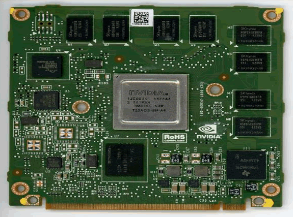
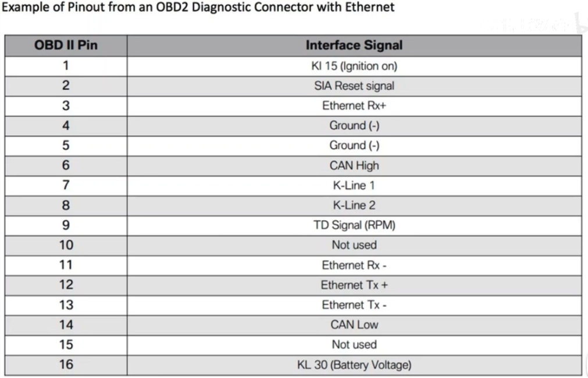

# 实车分析
来源：
- B站视频

## Tesla Model 3

特斯拉将很多传统的控制器进行了融合，形成了前、左、右车身控制器。

- 前车身控制器（Front VCU）：控制整个车身的电压分配
- 左车身控制器（Left VCU）：分配左边的电压，包括刹车控制
- 右车身控制器（Right VCU）：分配右边的电压，包括刹车控制

下图是tesla model3 右VCU的开盖图

其中可以看到有：
- ST 芯片
- 负责座椅的SEAT区域
- frontwindow 负责前窗
- rearwindow 后窗
- dashboard 仪表盘
- front door 前门
- vbat 电源

分析连接线

右侧VCU连接线有9个插口，227个引脚。

比较重要的有5路CAN总线：
- autopilot 控制器连接

搭建测试台驾

## Tesla Model S

来源
- [Reverse Engineering Tesla Hardware](https://www.pentestpartners.com/security-blog/reverse-engineering-tesla-hardware/)

- [Reverse Engineering the Tesla Firmware Update Process](https://www.pentestpartners.com/security-blog/reverse-engineering-the-tesla-firmware-update-process/)

这里分析了逆向 Tesla Model S 的车机（Instrument Cluster）的过程和结果，分析了固件升级的过程。

### 车型硬件概述

类似同时代车辆，Tesla 也是由CAN网关连接了多路相互隔离的CAN总线。网关是一台功能强大的嵌入式计算机，带有互联网连接功能，网关还控制着自身组件的固件升级。

Tesla 的物理组成：
- CID （central information display）：中央信息显示，在仪表盘中央的最大块的控制台
- IC （Instrument Cluster） 仪表盘
- Conventional CAN connected ECUs 传统CAN连接的各个ECUs

#### CID
CID是一个高度集成的实体，包括下列功能：
- WiFi 和 Bluetooth
- Gateway 接口，连接VCM 和各种CAN 总线
- 与网关连接的全尺寸的 4G Byte SD 卡槽及卡
- Nvida VCM （图像计算模块），ARM-based 单板计算机，2GB RAM，8GB NAND Flash ，64MB NOR flash，以及各种外设。
- 以太网交换机
- 16Gbyte microSD 连接到VCM，用于存放数据
- 3G modem 用于蜂窝通信
- 包括 FPGA 显示逻辑在内的其他模块

很多别的车辆将IVI（In-Vehicle infotainment）、CAN Gateway和TCU（Telematics Control Unit）等部件独立部署，但是Tesla 将这些整合在一起作为一个整体大单元，即CID。

在别的车辆上，IVI、Gateway、TCU是由不同供应商提供的，但Tesla 整合了这些组件，实现了全局控制，这也说明了为什么Tesla可以进步的如此之快。

##### CID 硬件架构

相当复杂，由一块14-layer PCB 板承载了多个功能区块。这使得逆向很困难，很难查到相关信息且破坏后会导致无法工作。

其中使用了 Nvida Tegra visual computing module （VCM）。

奥迪、宝马、兰博基尼都与Nvida 有类似合作。

Nvida Tegra VCM 是一块基于ARM的多核SoC，包括GPU、audio、video加速器等功能。他比别的IVIs 所用的SoCs功能更加强大，因为它有更大的CID显示器。Tesla Autopilot （AP1 和AP2）使用单板计算模块，CID 和 IC 中的 VCMs是不同的，这个车型没有一个Tesla Autopilot 模块，所以我们不能测试它。没有在CID上找到任何重要/明显的对autopilot的引用。

VCM 没有公开的数据表，这在车辆电子里比较常见，逆向它是非常困难的。由于只有一块测试用件，不能去破坏它。一个近似的VCM 模块用于在 Jetson Pro Development Kit 中。

虽然没有VCM或Tegra SoC的手册，但开发板通常包括模块的原理图（schematics）和引脚（pin-outs）以及用于破坏性测试的备件。这对于逆向很有帮助。遗憾的是，Jetson Pro Development Kit 也不公开文档。但是相类似的开发板，例如 JetSon TK1可以获得。总之，可获得的相关资料较少，对逆向的支持很有限。

为了获取文档和论坛信心，需要有Nvida.com的有效开发者账号，但是登陆后仅发现一项与VCMs相关的信息。Nvida 需要开发者签署NDA（开发者协议）来获得访问权，而且不能和任何第三方共享信息。

在VCM上的连接器可能是MXM，用于某些笔记本上图像模块，有标准化的引脚。然而，这些模块的引脚与VCM的不像。我们查找了其他Tegra-based 单片机模块，但是没有找到任何近似的东西。这个车型里，使用了不同的连接器、外部存储和外设。我们没有找到任何别的有价值的东西。有些新闻报道提到tesla 将改变nvidia 平台到intel，新班子叫做Gordon lake，但看起来还是很像nidia vcm。

连接器似乎是相同的，而安装安排看起来不同，尤其是关于散热板的使用。和以前一样，我们无法在未输入保密协议的情况下获取数据表。为了更深入的逆向，我们将VCMs从CID和IC中提取出来。

CID中VCM的主要模块包括：
- 一组 unpopulated 8路头,J1
- 一组 unpopulated 的LQFP100 包的印记，这个目的不清楚
- TI 电源管理单元 TPS6586291
- Nvidia Tegra SoC T301QS-P-A3 – this part number, like many microcontrollers and SoCs for automotive applications, is not listed anywhere, and may be a proprietary Tesla part. One can assume that this is a Tegra 3 SoC.
- SK Hynix 8GiByte eMMC NAND Flash H26M42003GMRA – the main persistent storage on the device
- SK Hynix 4GiBit DDR3 SDRAM H5TQ4G83AFR – there are four, giving 2GiByte of RAM. This will be shared for general purpose use and graphics. There are four unpopulated footprints which could be used for further RAM.
- SMSC USB to Ethernet controller LAN89530AM – for the Ethernet connection out to the switch
- SMSC Automotive USB transceiver USB83340 – for USB connections out to the rest of the CID
- Spansion 64Mibyte NOR Flash GL512S11DHA02 –storage for the kernel and bootloaders

IC中VCM的主要模块包括：
- An unpopulated 8-way header, J1
- An unpopulated footprint for LQFP100 package
- An unpopulated footprint for TSOP48 package (most likely parallel NAND flash as an alternative to eMMC)
- TI power management unit TPS65829I
- Nvidia Tegra SoC T20AGS-SH-A4 – a Tegra 2 not a Tegra 3 in the CID; this is probably because the screen is smaller and requires less power.
- SK Hynix 4GiByte eMMC NAND Flash H26M31001FRP1 – 50% less than the CID
- SK Hynix 1GiBit H5PS1G83KFR – there are eight, giving 1GiByte of RAM, 50% less than the CID
- SMSC USB to Ethernet controller LAN89350AM
- SMSC Automotive USB transceiver USB83340
- Spansion 64MiByte NOR Flash GL512S11DHA02

我们相信CID和IC所用的VCM的引脚是相同的，电压和地都出现在同样的引脚，这一点可以通过示波器来确定。

我们不想直接测试VCMs，因为可能会毁坏CID或IC，会导致车辆不可用，且维修成本在3000到10000英镑。

后来，我们从二手市场上得到了一个VCM，它与IC上的VCM大致相同，除了它少50%的RAM。对其进行侵入性测试，但是没有得到有价值结果。

Stage 1 和 Stage 2 的bootloaders，kernel 和其他启动相关数据存放在 64MB NOR flash 中，并且它们中的大部分以主存/恢复机制进行备份，允许设备启动到一个recovery mode。

文件系统的其他部分存储在 8GB 的NAND Flash中：
- 许多文件以压缩、只读、文件系统存储（squashfs）
- 有少量比例的read/write文件系统（ext4）
- 少量的设置和日志以非压缩形式

#### IC
IC是一个基础的仅安全相关的模块：
- 同样有 Nvida VCM，但与CID的型号不同，1GB RAM。

#### 其他ECUs
CAN总线连接的其他ECUs是车辆内常见的电子控制单元：
- 集成了Flash的MCU
- 运行裸金属软件或RTOS
- 由各种T1供应商提供，与其他车辆类似
- 车身控制器由Pektron提供定制

#### 以太网交换机

Tesla models的车机上有一个内置的以太网交换机，连接着VCM与其他车辆部件，芯片为Marvell 88e6061.

marvell 88E6061 ：
- 5端口 10/100 交换机
- 支持Vlans
- 使用串口（SMI ）进行配置
- 在CID启动时，交换机进行配置。

使用逻辑分析仪可以监听SMI命令，我们没能确定是否命令可以被VCM或网关处理器所发送。

来自不同组件的通信通过不同的VLANs进行隔离。

与SMI关联的通信，没有安全功能，例如完整性保护，它信任任何信号，意味着通信可能被篡改。VLAN 配置可能被因此而改变，可能将新的命令和程序写到系统。交换机上有5个led灯，指示了5个端口的 link/traffic 。LQFP 打包提供了简单的信号访问。

#### 网关
网关使用了Freescale SPC 5668GVMG 芯片，一块基于PowerPC的微控制器，有2MB flash存储和512KB的RAM。

这个芯片的所有datasheet时可被公开获取的。

这个网关带有CAN 收发器。近似的设备经常在CAN网关中发现。网关被接入CAN总线和以太网交换机。我们相信在网关上的固件是FreeRTOS，很多车上都使用这一系统。

#### 蜂窝modem

这个车型使用了：
- 常见的 Sierra AirPrime AR8552 ，挂载了一块子板；
  - the AR8552 uses a Qualcomm MDM6200 SoC，通常运行嵌入式linux，名为 Legato。
  - 使用USB，实现modem与VCM的连接通信。
- 与GPS接收模块临近，GPS 接收模块是ublox LEA-6R-0-002 
- 还有一个加速传感器。

VCM 不包括SIM卡，不像先前文档中提过的US Tesla modems。这款车使用了远程pod 和一个线缆连接到CID，所以SIM卡可能可以不移除CID就访问或改变。这可能是欧洲的法律要求，确保Tesla可以使用多种移动网络。

在这里，SIM 是一个 O2 one，我们不知道是否这个SIM来自于原车还是已经被改装过。SIM上没有什么有价值的数据，例如SMS消息。modem 与一个EESIM一起工作。

车内许多TCUs不允许用户访问或更换SIM，嵌入的或不可访问的SIMS成为常见情况。我们发现任何跟踪功能或运行在CID‘s VCM 的 eCall，这意味着安全和网络安全特性直接在cellular modem中运行。

无危害的从Sierra Wireless AR8522 模块恢复固件是非常困难的，应为他紧紧的被BGA封装所包裹，有相当多的BGA芯片，所有的芯片都覆盖在一个坚固的壳下面。

#### WIFI 模块

CID 使用了一块 Parrot Wifi 和蓝牙模块，面朝下焊接的。我们没法确定特定模块型号，因为没有办法把它从主板上移下来。Parrot FC6050W 在先前的分析中已经分析过。

VCM 和Parrot 模块通过USB通信。

#### SD 卡存储

在CID主板上，有2个SD卡曹。一个在CID顶部，允许访问16GB microSB，与VCM连接。

必须拆下CID才能访问4GB普通SD卡。它连接到网关，用于在固件更新期间暂存文件。在逆向工程过程中，这两个都延伸到了CID之外，以便在汽车行驶时可以轻松地接近它们。

可以看到，卡上没有做完整性保护和加密。
#### 其他部件
在CID上还有一些其他的与安全相关的组件：
- 模拟设备 ADSP-21489 DSP 芯片，可能用于 audio playback 和记录。一个 LQFP 包于外部串口flash芯片连接。
- Cyclone IV EP4CE40F23A7N FPGA  连接到2个 ISSI RAM 芯片 和一个串行 flash 芯片为比特流（特别是FPGA 固件）。这允许了VCM可以连接显示和触摸板，显示glue logic

#### Tesla 物理组成间的连接：
CAN总线连接：
- CID 和 IC 都连接在以太网和CAN总线上。

6路CAN线：
- CAN 1：与诊断OBD-II port 采用专用的连接
- CAN 2: 车身（body）：door、lights、mirrors 都与CAN总线连接
- CAN 3: 动力系统（powertrain）：驱动逆变器（drive inverters）、电池管理系统BMS、充电器（Charger）、热能控制器（thermal controller）
- CAN 4: 车身（body）：空调（climate control）、座椅（seats）
- CAN 5: no
- CAN 6: 底盘（chassis）：悬架（suspension）、仪表盘（instrument cluster）、稳定控制器（stability controller）、动力转向（power steering）。

Tesla 中还由一定数量的LIN 总线。

USB：
- CID 后面有两个usb 端口，都可以接受媒体设备和在UI上显示，可以使用USB外设，如以太网adapter和keyboards
- 以太网卡可以被发现，但不能工作
- 键盘可以被发现，但不能工作。

内部USB：
- 在CID主板上有一个USB接口，连接到VCM。可能用于获取tegra recovery mode 的访问权。[RCM的漏洞](https://github.com/Qyriad/fusee-launcher/blob/master/report/fusee_gelee.md)在2018年发现，恶意USB包可能绕过安全机制。我们证实了研究人员发现。

以太网端口：
- CID上有2个暴露的以太网口，使用专门的车路连接器连接。
- 一个用于专用的诊断连接器，通过专门的握手进行加固，且没有已知的漏洞。种子从Tesla 服务器和CID发出，都经过了VPN连接。
- CID 和IC 被另一个以太网口连接。一台以太网交换机负责交换和监听流量。已知的漏洞在这部分都被修复了。带有Tesla autopilot的车辆，这个诊断以太网连接都被重新设计了，并且有一个诊断端口。

传统诊断连接器：
- 还有两个传统的诊断连接器
- 一个是OBD-II端口，提供了CAN bus 1和6 的访问。
- 有一个特殊的诊断口，连接CAN bus 2，3，4和6，以及K-Line总线使用了唯一的HVAC。
- 没有访问控制和信号隔离，如果有人访问这个端口，它们可以监听和发送任意的CAN报文。

JTAG 接头：
- 各种嵌入式设备可能通过JTAG进行固件恢复或被攻击。
- JTAG 功能在CID和IC的多个设备上均可见。
- 一些 tesla 狂热分子高速我们它们已经被锁定了。

用于判断pin-out的方法建议：
- 穷举JTAG测试（JTAGGulating），可以产生假正例并损害班子
- 如果某个引脚可以被访问且datasheets 可以获得的话，持续测试某个设备上的已知的JTAG pins是可以的。

在这里，唯一可访问的pins和JTAG 是模拟设备ADSP-21489 ，剩下的全部在BGA封装下保护着。这个设备的JTAG可以被识别，因为 datasheet 和 pinout 是可获得的。我们做了一个电缆来连接jtag adapter 和 逻辑分析仪。

我们尝试了JTAG命令，但CID和IC上的VCM没有响应，这导致我们认为，很可能是由于SoC保险丝熔断而阻止了访问。使用MPC56xx系列提供的“审查”功能，JTAG ID从网关处理器获得响应。它使用64位密码保护。我们尝试了FEEDFACECAFEBEEF的默认值，但没有成功。我们排除了暴力强迫的可能性；固件可以使用其他方法获得。

JTAG ID引发了ADSP-21489的响应，但它似乎使用了64位密码保护。这种专有保护方案需要一个特定的JTAG适配器。这将花费约1200英镑，可能只是确认无法访问。而且我们认为，这不太可能立即构成任何安全风险。

JTAG Secure正在阻止对Altera Cyclone IV FPGA的访问。目前还没有已知的安全问题。我们没有对Parrot Wi-Fi板进行检查，因为没有可用的数据表，并且安全性影响很低。我们很高兴看到所有JTAG访问都被关闭，因为许多系统都允许访问。

## 宝马刷写
宝马刷写调教可以通过xHP flashtool实现。

宝马1系，使用android手机刷写工具（OBD 盒子）：
- thor wifi adapter
  - M flasher for BMW m2/m3/m4 f8x
- mhd wifi adapter
  - 支持

OBD 连接线：

- 宝马车2007年前常采用 K-Line，例如E系列 X3，X5，Z4等
- 后来才用了 D-CAN.例如除了E，F，G等之外的各车型。

连接线直连手机

刷写界面

刷写前要求：
- 手机
  - 要进入飞行模式、关闭蓝牙、关闭4G、电池保证大于25%。
- 车辆
  - 要扣紧安全带、不能打开或关闭车门、确保Ignition 打开（不要打开引擎）、不要打开车灯、将后装设备全部拆卸下来。

第一次10分钟刷写完。4s店要几百美元。

宝马有的车型，在刷写obd时要用到网线：

这里面没有6和14两路常见的高速CAN线。因为宝马新款都用以太网。

