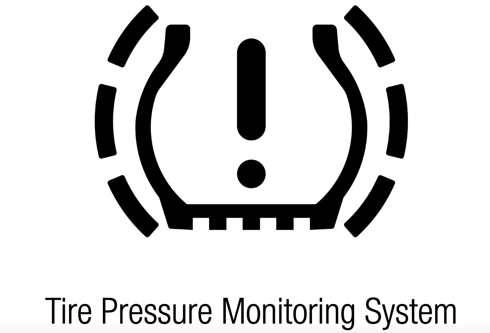

# TPMS

2013年10月20日，Jared Boone 在ToorCon 15会议上作了一个名为“Dude, Where's My Car? Tire Pressure Monitor”的演讲。

这个报告引用了美国TREAD Act。
> 修订《美国法典》第49编，要求报告外国机动车辆或轮胎或其他机动车辆设备的缺陷，以及其他目的。由美利坚合众国参议院和众议院在国会会议上颁布，第1节。简称。本法案可被称为“运输召回增强、责任和文件（TREAD）法案”。
> 第2节。保留第30118条。2001年《交通部和相关机构拨款法》第364节对《美国法典》第49编第30118节的修正案被废除，该节应视为未颁布该修正节而有效。
>

可以从上面传感器中看到的信息：
- ID：C8E7C8CD
- Frequency：315MHz
- FCC ID：KR5S120123

这里的FCC是指[Federal Communications Commission](https://www.fcc.gov/oet/ea/fccid) ，

以S120123型胎压保护发射器为例，它集成了压力、温度和加速度传感器和315MHz RF发射器。接收单元包括315MHz接收器。

胎压检测系统及控车辆胎压 TireGuard系统在行驶或静止时监测车辆的轮胎压力。安装在气门杆上的每个轮胎内部的电子单元（车轮单元）定期测量实际轮胎压力。通过RF通信，该压力信息被传输到RF接收器/解码器。

当车辆开始移动，胎压监控的发射器进入行驶模式，它测量和发送RF burst 每分钟4次，最多每分钟30次。电报报文时间长度近30ms，在此周期后发射器测量和发送数据。当车辆停止后的十分钟内，发射器奖保持在行驶模式。如果在任何测量周期中，压力降低被检测到（与最近发射的压力值有区别），将在5秒后执行重新测量。如果压力持续变化，那么发射器将会报告。为了正常发射胎压，轮子必须旋转并且tpms必须工作在压力下。对于工厂测试、安装测试等等，这个设备必须能够被125kHz的信号所激活。用于认证测试样品被修改为CW发射，在用活化后持续约2分钟

被测件信息：
Equipment Under Test (EUT)
Device: Transmitter
Trade Name: Siemens VDO
Model: 5WY7243 TireGuard Type S120 123
Serial Number: none (Prototype)
FCC ID: KR5S120123
Power: 3V DC
Transmit Frequency: 315 MHz
Type of modulation: FSK
Interface: none
Variants:
Highest frequency generated or used in the device: Resonator 315MHz、

Technical description
Carrier frequency: 315 MHz
Frequency shift: ± 45 kHz
Number of channels: 1
Duty cycle: < 0.1%
Type of modulation: Frequency Shift Keying (FSK)
Rated Output Power: < 10 mW
Antenna: integral
Voltage supply: 1 Lithium battery 3V (CR2450)
Voltage supply range : 2.1 up to 3.2V

Modulation: FSK
Deviation: +/- 33 kHz
Symbol rate: 20.15 kHz
Carrier: 53 kHz + 314.95 MHz = 315.03MHz