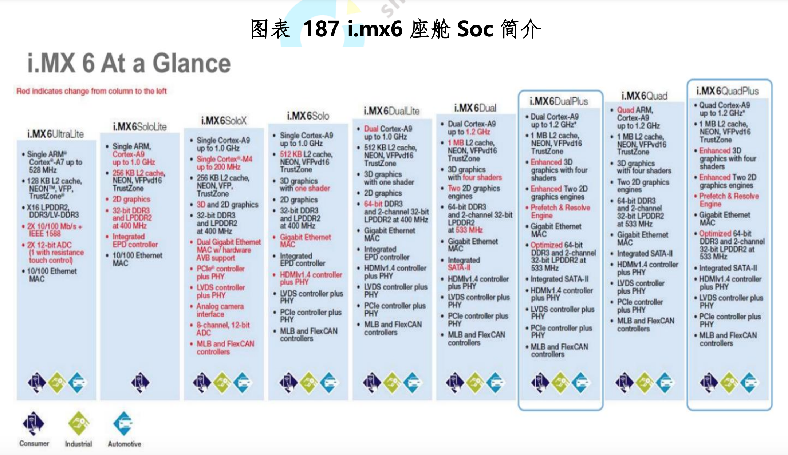

# 智能座舱

来源：
- 佐思汽研 汽车智能座舱白皮书 2021

## 定义
### 2020年顶级智能座舱的算力
根据ARM在2017年投资者大会上发布的数据：
- Cockpit ～ 50,000 DMIPS。
  - 主要特性：Audio Visual、Maps、Traffic、Toll payment、Google services、Rear entertainment、Voice recognition、Gesture control、Cluster、HUD
- 连接网关 ～ 20,000 DMIPS
  - 主要特性：LTE ，5G，WIFI，Bluetooth，connecting to  CAN FD,LIN,Flexray,Ethernet
- 车身电子电器（ECUs） ～ 小于 10,000 DMIPS
  - 主要有：HVAC，Lighting，Doors，electric seat，windows，mirrors，cameras，seat belt，air bag，BCM
- 半自动驾驶 ～ 350，000 DMIPS
  - 主要有：L3自动驾驶，Radar/Image processing，Collision avoidance，Precrash，Cruise control，Lane departure，Parking。

- Chassis ～ 15，000 DMIPS
  - 主要有 EPS，ABS/EBS，Active VDC，EPB
- e-Powertrain ～ 15，000 DMIPS
  - 主要有：主motor控制，transmission，工程控制，transmission，engine control，generator，E-water pump，battery management。

根据IHS markit分析，智能座舱的典型功能包括：

- 仪表显示系统
- 前后中控屏
- 车载信息娱乐系统
- 流媒体后视镜
- 抬头显示系统
- 视觉感知系统
- 语言交互系统
- 其他部件或软件

<image src="images/智能座舱/智能座舱典型功能.png">

对于智能座舱，决定其功能和性能的关键是主SoC的算力，衡量CPU算力的单位主要是每秒处理的百万级的机器语言指令数（Dhrystone Million Instructions PerSecond，DMIPS）。ARM的数据显示，2021年的智能座舱算力为5万DMIPS。

基于上SoC高于20,000 DMIPS 才能流畅地运行智能座舱的主要功能（AR 导航或云导航、360度全景、播放流媒体、AR-HUD、多操作系统虚拟机等）。GPU方面，只要 100 GFLOPS 的算力就可以支持3个720P屏幕。

**简单定义一下，CPU高于 20,000 DMIPS , GPU 高于 100 GFLOPS 的SoC的座舱就是智能座舱**。

目前车载 SoC 除了英特尔，基本上都是 ARM 架构，ARM 架构 SoC 的算力。

从用户购买决策的关键因素来看，根据 IHS Markit 最新的调研结果，座舱智能科技配置水平是仅次于安全配置的第二大类关键要素，其重要程度已超过动力、空间与价格等传统购车关键要素，反映出座舱智能科技已成为用户购车的重要考量。

## 术语

### Floating-point Operations Per Second 即 每秒所执行的浮点运算次数。
它是一个衡量计算机计算能力的量，这个量经常使用在那些需要大量浮点运算的科学运算中。有时也会被记为flop/s。Giga Floating-point Operations Per Second,即每秒10亿次的浮点运算数,常作为GPU性能参数但不一定代表GPU的实际表现，因为还要考虑具体如何拆分多边形和像素、以及纹理填充，理论上该数值越高越好。1GFlops = 1,000MFlops。

### Dhrystone 
指整数运算。

### GFLOPS
一个 GFLOPS (gigaFLOPS) 等于每秒10亿 (=10^9) 次的浮点运算。
### IPC 每周期平均执行指令数/解码位宽

IPC是SoC或内核来说的重要参数，表示每周期平均执行指令数，也称为解码位宽。

### L1 缓存

L1 缓存也是SoC的重要参数之一。还有一个是 L1 缓存，因为指令是从缓存中取得的，L1 缓存有分为 L1i 和 L1d，分别用来存储指令和数据。L2 缓存是不区分指令和数据的。L3 缓存多个核心共用一个，通常也不区分指令和数据。 还有一种缓存叫 TLB，它主要用来缓存 MMU 使用的页表，通常我们讲缓存（cache)的时候是不算它的。架构的算力不是一个固定值，但架构决定了其算力大致范围，Cache 的大
小在这个有限的范围内再确定算力值。

## 基本构成

智能座舱是由不同的座舱电子组成的完整体系，其关键技术主要由四部分组成。

- 第一部分是机械技术，包括可变化车体技术和内饰机构技术。未来汽车可根据不同模式进行伸缩折叠是一种趋势，座舱需要可以根据乘客对于不同场景的使用需求，实现内饰空间的不断调整变化。
- 第二部分是电子硬件技术，包含芯片技术、显示屏技术、专用电器总成以及传感器技术四大技术。
- 第三部分是软件技术，主要有操作系统和各种应用软件。汽车智能化发展必然会趋向于一机多屏，通过操作系统实现一个车机芯片控制各屏的软件。
- 第四部分是两大支撑技术，分别是人工智能技术和云计算技术。未来智能算法的准确性决定了不同品牌智能座舱的差异化，是影响车内体验的关键。

智能座舱通过上述技术，实现人机交互。以中控屏、仪表盘、后座娱乐屏等硬件为载体， 实现人脸识别、多音区检测、视线追踪、疲劳分级以及多模命令词等核心智能化功能。除此以外，还可以衍生出音量自动调节、高速分心提醒、疲劳拯救等个性化附加功能。未来，智能座舱还可能应用到增强现实和虚拟现实技术。

## 现有问题
主要问题：
- 智能交互技术所需的数据获取难度大
- 多模态人机交互体系没有形成理想模式
- 基于视觉的组合仪表功能逻辑设计存在缺陷

虽然将来智能座舱必然会形成一套多模态人机交互体系，但是视觉仍然是人们获取信息效率最高的方式，未来多模态人机交互仍然会以视觉为核心。目前大部分车机的界面层级都很多，功能切换需要操作比较繁琐的步骤，而这都需要依赖于视觉，长时间的操作影响驾驶安全，车机需要让功能切换变得容易操作，可以迅速完成。因此部分主机厂选择了“去APP化”的方式，将一些重要的、使用频率高的功能以组件的形式放置在首页，以此来减少层级。然而这种做法并不能从根本上解决问题，用户在开车时会用到许多种功能，将所有功能都放置在首页是不切合实际的，而且这种做法使架构变得更加复杂， 用户操作时视觉停留时间不会有显著变化。

如今，车企存在着明显的孤岛效应，这种数据互联互通能力的缺失对智能座舱智能座舱产业来说是一项巨大的挑战。

智能座舱的智能化需要依托大量的数据进行训练，从而实现智能程度更高的人机交互反馈效果，数据规模直接影响了智能座舱的用户体验。而大部分车企并不愿意向外界公开车辆和驾驶数据，甚至合作公司也难以获得相应的数据，这就导致了现有技术无法得到所需的足够的数据积累，制约着智能座舱产业的快速发展。比如智能座舱的语音交互技术，目前语音识别、语义理解受数据限制，用户实际体验时存在识别准确度较低、无法有效沟通的情况，技术实现上与设想有一定的差距。

## 主要SoC

目前与未来常见的座舱SoC：
- 瑞萨
  - R-CAR H3E
  - R-CAR H3
- 英特尔
  - A3960
- 高通
  - SA8155P
  - SA8195P
  - SA8295P
- NXP
  - i.MX8QM
- TI  
  - TDA4VM
  - TDA4 H
- Nvidia
  - XavierNX
  - Parker
- 三星
  - Exynos Auto V9
- Telechips
  - Dolphin 3H
  - Dolphin 3E
- 联发科
  - MT2712
  - MT8195
- 地平线
  - 征程2/3/5

### NXP

NXP 的强项在网络与射频领域，尤其射频领域，如车载收音几乎垄断，毫米波雷达芯片市场占有率超过 50%，MOST 和 FLEXRAY 总线 PHY 垄断市场，车载音频功率放大器市场占有率也超过 50%，但是座舱 SoC 领域，NXP 已经是后继无力。

NXP 靠 i.mx6 曾经几乎垄断座舱，虽然已经过了 10 年，四核 i.mx6 仍然是中低端 Infotainment 领域霸主。主要客户包括长安、丰田、日产、PSA、福特中低端。

但是 NXP 在 2016 年以后明显落后了，NXP 目前最先进的已经量产的还是 ARM 在 2015 年 2 月发布的 Cortex-A72 架构。而高通和英伟达已经在用 A78 架构了。A78 还需要先进制程架构支持，众所周知，7 纳米 5 纳米费用惊人，NXP 现在最先进不过是 16 纳米。NXP 一向强调成本控制，对于先进制程敬而远之。

NXP 最后一代座舱处理器 i.mx8 早在 2013 年 9 月就已经发布,然而直到 8 年多后的现在，下一代针对座舱 i .mx 处理器还未公开发布。很有可能 NXP 停止维护这条产品线了。

NXP 无力跟进。NXP i.mx8 只拿下福特一个大客户和少数几个中国小客户。向上无法突破，向下也没价值，低端市场是越来越小的。i.MX8 系列处理器多达几十种，但针对座舱的只有两种，即 i.MX8QM 和 i.MX8QP。

### Nvidia

英伟达除了针对自动驾驶的 DRIVE AV 全套协议栈还有针对座舱的 DRIVE IX 全套协议栈，以前英伟达只是单纯地贩卖芯片，并且 DRIVE IX 是从针对自动驾驶的 Orin 芯片开始，也包括之前的 Parker 和 Xavier。Orin 如果只做智能驾驶，出货量肯定非常低，远不能收回研发成本，座舱领域的出货量会远高于智能驾驶。

英伟达提供全套算法，包括障碍物识别、路径规划、行为决策、执行策略、定位、地图流制造、自动泊车，还有底层软件系统，内含了 QNX 的驱动，CUDA 生态系统等等。

现在不仅是自动驾驶部分，Orin 开发平台还全面进军座舱,即 DRIVE IX，包括了驾驶员状态监测、AR HUD、泊车视觉化、NLP 自然语音识别、虚拟机、电子倒车镜后视镜等。并且英伟达野心不止 L3/L4，新一代开发平台也包括了 L2。

2020 年 11 月，英伟达与现代宣布达成合作协议，在座舱领域全面合作。他们的第一个作品就是现代高端品牌的第一辆电动车 GV60，实际两者自 2019 年就开始合作了。

座舱方面，GV60 的座舱被现代称之为 Connected Car Integrated Cockpit 即 CCIC，无缝连接仪表、中控、HUD、电子倒
车镜。CCIC 应该使用了 QNX 的虚拟机，一套硬件拖动中控、仪表和两个电子倒车镜。仪表和中控的尺寸都是 12.3 英寸，与宝马旗舰 IX 的座舱设计颇为近似。

### 高通

高通 820A 正式发布在2016CES大展上。当时可谓惊艳，820A 共三个型号，分别是 820A SCL、820A High 和 820A Prem，820A SCL 是最低端型号。大众、路虎、小鹏等一系列厂家都有采用。但是 4 核的产品很快跟不上潮流，高通 8 核的第三代产品有三款分别是 SA6155P、SA8155P 和 SA8195P。SA6155P 性能不突出，很少人使用，SA8155P 对应的手机平台是高通骁龙855，性能强劲，新兴造车选择 SA8155P 比较多。

SA8155P 是第一款 7 纳米汽车座舱 SoC 芯片，采用 8 核设计，3 个中核为 Kryo 435，相当于 ARM Crotex-A76，运行频率 2.1GHz，一个 Kryo 435 大核，运行频率 2.4GHz，4 个 Kryo Silver 小核，相当于 ARM Cortex-A55，运行频率 1.8GHz，一个 Adreno 640 GPU。

SA8195P 并非源自手机骁龙系列，而是源自 PC 系列平台，高通在 2017 年开始进军 PC 领域，主要是瞄准微软 Surface 和平
板与笔记本电脑二合一型电脑。第一个产品是骁龙 835，之后是骁龙 850，之后改名为骁龙 7C，2019 年则有骁龙 8C，骁龙 8C
（SC8180）还有升级版骁龙 8cx 和 8cx 5G，SA8195P 就是基于骁龙 8C 的产品。

国内平板笔记本二合一电脑并不受欢迎，在美国还是颇受欢迎的，再有就是骁龙 7C/8C 都自带 Modem，车规版 SA8195P 有不带 Modem 的版本。

高通在 2021 年 1 月推出第四代座舱 SoC，目前可以确定的型号是 SA8295，可能是 Premier，采用 5 纳米设计。SA8295 源
自手机领域的 Snapdragon 888 采用 8 核设计，一个 Cortex-X1 的超大核，运行频率2.84GHz，车机版应该低一点，估计2.5GHz，3 个 A78 大核，运行频率 2.4GHz 车机版低一点，估计 2.1GHz，4 个 A55 高效率核，运行频率 1.8GHz，估计车机版也要再降100MHz。

此外还有一些非车规芯片，如高通 625 也被中国厂家大量使用。高通非车规座舱 SoC 有两大类，一类是 CSR 芯片，CSR 是
高通在 2015 年 24 亿美元收购的，其车机 SoC 芯片实际来自 CSR在 2009 年 1.36 亿美元收购的 SiRF 技术，以前主打后装市场，现在有在前装发扬光大的趋势。另一类则是手机用的非车规的骁龙 625，虽是 2016 年 2 月发布的芯片，但性能足够满足目前的主流应用。

### 瑞萨
瑞萨是日本日立、三菱电机和 NEC 三家的半导体业务合并而成的企业。瑞萨是日本最大的芯片厂家，其汽车 MCU 市场占有率比较
高，大约有 1/3，座舱领域的 MCU 基本由瑞萨垄断。座舱 SoC 方面，目前主推 R-CAR 3 代，这是 2015 年 12 月发布，大约 2018 年中量产的芯片。

### 英特尔

英特尔目前有 5 款芯片可选，其中 4 款是 2016 年 8 月推出的，即A3930/A3940/A3950/A3960，2018年底新增一款A3920，性能略高于特斯拉 Model 3 用的 A3950，但没有通过 AEC-Q100 车规认证，不过价格远低于 A3950，国内有几家非一线新兴造车厂家在用。

论性能，英特尔的 A3900 系列远不如其他三家来得高，毕竟它是 4 核芯片，且推出自 2016 年。但英特尔是最成功的，客户范围最广，包括铁杆支持者宝马，几乎全部使用旗舰 A3960。通用的一众主力车型，如 GMC 的 SIERRA 和 DENALI，还有未来的电动悍马。卡迪拉克的高端凯雷德，还有 2022 或 2023 年上市的凯迪拉克旗舰轿车 Celestiq。其余还有现代起亚的高端产品和选配产品，还有高端的 Genesis。斯巴鲁的中高端也是全线使用英特尔的芯片。此外还包括沃尔沃的主力车型 XC40/60 以及捷豹路虎的部分车型。国内则包括了红旗的三款主力车型以及长城的轿跑 F7，还有奇瑞的星途。

英特尔除了 2018 年底添加了 A3920 后，一直没有新产品推出，所以英特尔的老顾客大部分转投了高通阵营。

### Telechips

Telechips 成立于 1999 年，2004 年在韩国上市，目前有大约 356 名员工，研发人员占 66.8%。Telechips 大约 90%的产品用于车上，其中 65%是 SoC，35% 是音频芯片。主要客户是现代汽车，占其 65%的收入，其他客户还有丰田、日产、长安。

Telechips 积极进军高端市场，顶级旗舰 Dolphin3H 包含 8 个 A72，8 个 A53 内核，把高通 SA8155 当做对手。Dolphin3H 的 16 核设计也是座舱 SoC 中内核最多的。

### 联发科

联发科给大部分人的印象都是一家手机芯片公司，实际联发科是多元化的，以 2021 年 2 季度为例，手机所占收入比例为 57%，智慧装置包括车载、IoT、ASIC（主要是网络与服务器领域）和计算（主要是人工智能芯片）占收入比例为 22%，智能家庭占 14%，功率芯片占 7%。联发科已经是全球第四大 IC 设计公司，预计 2021 年收入大约 150 亿美元。

联发科车载领域产品代号黄山，联发科在 2016 年开始研发车载芯片，一度是独立的事业部，2020 年 9 月并入智慧装置事业部。主要产品一个是与吉利合作的产品，另外一个是针对座舱的 MT2712，还有针对超短距离毫米波雷达的 MT2706，针对 TCU 的 MT2731。

目前 MT2712 进展比较快。采用 MT2712 的厂家主要有大众、现代、奥迪，合作 Tier1 有三星哈曼、LG 电子、伟世通。大众的 MIB 3 Regio 版车机就是采用 MT2712，2020 年主要是用在南美地区，2021 年下半年拓展到北美地区，合作 Tier1 是伟世通。与LG 的合作主要是印度的现代与起亚中档车型，与三星哈曼的合作主要是奥迪的后排遥控系统，未来会进一步拓展，可能会包括虚拟后视镜。

MT2712 的升级产品为 MT2713，采用 7 纳米工艺。

MT8666 具有集成的蓝牙、FM、WLAN 和 gps 模块，是一个高度集成的基带平台，包括调制解调器和应用处理子系统。该芯片集成了最多 2.2GHz 的 arm Cortex-A73，最多 2.2GHz 的 ARM Cortex-A53 和 MALI G72 的 GPU。LPDDR 3 可达 4GB(32 位数据总线宽度的单通道)，LPDDR4X 高达 8GB(16 位数据总线宽度的双通道)，内存时钟至 lpdr3-1866 或 lddr4-3600，LTE Cat 7 (300Mbps)。

针对 SA8155P，联发科对应的产品应该是 MT8192，针对SA8195P，联发科对应的产品应该是 MT8195。虽然这两个都是针对笔记本电脑领域的，但现在这个界限很模糊了。

### 地平线
地平线是国内唯一一家车规级 AI 芯片大规模前装量产的企业，以软硬结合为底层技术理念。在智能驾驶领域，地平线不但能提供高效能边缘 AI 芯片，还可以结合丰富算法 IP、开放工具链等在内的全面赋能服务，加速合作伙伴智能驾驶的应用落地。

地平线于 2019 年发布中国首款车规级 AI 芯片——征程 2 后，又于 2020 年和 2021 年分别发布地平线征程 3 和征程 5 。于今年发布的第三代车规级产品征程5，兼具高性能和大算力，单颗芯片 AI 算力 128TOPS，支持 16 路摄像头感知计算，能够支持整车智能所需要的多传感器融合、预测和规划控制等需求。

截至 2021 年 12 月，地平线征程系列芯片出货量已突破 80万片，已公布搭载征程系列芯片的有长安 UNI-T、奇瑞蚂蚁、智己汽车、长安 UNI-K、广汽埃安 AION Y、哈弗 H9、岚图 FREE、江淮汽车思皓 QX、广汽传祺 GS4 Plus、上汽大通 MAXUS MIFA
概念车、2021 款理想 ONE 等十余款车型。其中，首款搭载征程 2，于 2020 年 3 月上市的主力车型长安 UNI-T 在上市半年内实现了每月销量上万的佳绩，验证了“有算法能力的 AI 芯片公司+整车厂”合作模式的潜力。

基于芯片+算法的软硬结合理念，地平线打造了 Horizon Halo™ 车载智能交互解决方案，Halo3 可支持 4 麦克加 7 摄像头的接入，其中舱内三颗高清摄像头 DMS+IMS+RMS，车外 AVR，四路 APA 环视视觉感知处理摄像头，通过建立前排与后排、车内与车外、视觉与语音的全方位感知交互，形成更多的联动交互可能性。

目前，Horizon Halo 3 覆盖多个场景已有近两百个算法模型，其主打的多模交互可极大提升汽车对用户的意图理解与行为理解，减少用户在人机交互中的多轮对答，借助语音+视觉的融合算法模型实现了全时免唤醒、可见即可说、可见即可控等特色功能。此外还支持动静态手势、场景编辑、儿童关怀、DVR 车外智能识别与感知、后排行为、全车人脸识别等。

### 其他

低端的 Display Audio 市场主要是 ST 和松下，由于市场萎缩，松下也出售了半导体业务，但仍有很多 Display Audio 车机使用松下芯片，因为松下汽车系统是全球最大的 Display Audio 车机厂家。ST 对 Display Audio 市场还有比较高的关注度，主打高性价比的手机投射应用，力求获取更大的市场份额，主要型号是 ST1275 和 ST1295。

德州仪器的 J6 系列早期是大众、奔驰、宝马、奥迪座舱的主 SoC，随着时代发展，J6 系列算力低下，而 J7 系列到 2020 年才量产，长时间的产品断档，让德州仪器失去了市场，但奔驰、宝马、奥迪为了减少研发投入，最大化利用研发成果，座舱的副 SoC 还是 J6 不变，主要负责导航和收音，再增加一颗高算力的主 SoC，未来如果全新设计，J6 系列就无容身之地了。

J7 时代即 TDA4 系列，基本上放弃了座舱市场，主打自动泊车、ADAS、DMS。

## 技术体系
主要的技术趋势包括： 
- 域中心化
- 更高性能的多核处理器

### 虚拟机/Hypervisor

虚拟机/Hypervisor，有些也称之为 VMM（virtual machine monitor）。这个概念来自PC界，随着座舱处理器的性能越来越强，座舱屏幕越来越多，座舱电子涵盖的功能越来越多，虚拟机已经成为座舱电子不可或缺的软件系统，ARM V8-A 架构芯片的大量出现也使得虚拟化很容易实现，多核高性能处理器不用虚拟机也难发挥全部性能，虚拟机已经是高性能多核处理器的标配。单处理器可以节约大量成本，无需仪表 MCU，无需仪表的 10 层 PCB，无需仪表 ECU 盒子，无需存储器，无需 CAN 收发器和大量线束。目前主要用在座舱领域，主要也是中国市场。

典型代表：
- 如长城关联公司诺博采用高通 SA8155P 芯片加黑莓 QNX 虚拟机为 2022 版哈弗 H6 运动型打造的座舱系统，包括全液晶仪表、HUD、360 环视、驾驶员状态监控、语音识别、增强现实导航、OMS 等功能。
- 奇瑞瑞虎 8 和捷途由德赛西威打造的座舱也是黑莓 QNX 虚拟机。

在虚拟化环境下，物理服务器的 CPU、内存和 I/O 等硬件资源被虚拟化并受 Hypervisor 的调度，多个操作系统在 Hypervisor 的协调下可以共享这些虚拟化后的硬件资源，同时每个操作系统又可以保存彼此的独立性。

对座舱电子来说通常是三个 OS：
- 一个是强调实时性的仪表 OS，一般是 ASIL B；
- 一个是丰富功能的娱乐 OS，一般是 ASIL A；
- 还有一个弱 ADAS 功能，如 360 环视，DMS 驾驶者行为监控，面部识别等，一般是 ASIL C。通常都称之为 Guest OS。

根据 Hypervisor 所处层次的不同和 Guest OS 对硬件资源的不同使用方式，Hypervisor 虚拟化被分为两种类型：
- Bare-metal 虚拟化方式（“裸机”虚拟化）和 
- Host OS 虚拟化方式(基于操作系统的虚拟化，宿主型虚拟化)。 

车载系统基本上都是裸机虚拟机，一般称之为 Type-1 型。除了基于软件的虚拟化之外，还有一类基于硬件的虚拟化，德州仪器和 NXP 更看好硬件虚拟化，他们首推硬件虚拟化。

Hypervisor 直接给物理外设打交道，那它当然需要运行在特权 privilege 模式了，在过去没有 virtualization extesion 的情况下，guest os 和 guest application 只能都运行在 de-privileged 模式，如下图所示。

虚拟机分全虚拟和半虚拟两种，全虚拟是应用在虚拟操作系统上，半虚拟是 API 应用在虚拟操作系统上。

目前常见的虚拟机包括：
- 黑莓的 QNX
- 英特尔主导的 ACRN
  - 典型代表：奇瑞星途 VX，仪表使用 Clear Linux，仪表盘显示刷新频率达 60Hz，中控采用最新的安卓 9.0 系统，
- Mobica 为代表的 XEN
- 松下收购的 Open Synergy 的 COQOS
- 德国大陆汽车的 L4RE
  - 1998 年德国德累斯顿大学开发了基于 L4 的开源操作系统 Fiasco.OC，采用基于对象的 C++语言。同时也开发了 L4 运行环境，即 L4Re。
  - 德国和法国的虚拟机系统推测有不少都是基于 L4Re 的。
  - Fiasco.OC 里有专为虚拟机开发的部分，称之为 NOVA
- 法国 VOSyS 的 VOSySmonitor
  - 基于MT2712 的虚拟机样品，即 VOSYSmonitor，并称通过了 ASIL C 级认证。它不是严格意义上的虚拟机，更像是一个虚拟分区系统。它利用 ARM 的 TrustZone，支持多个并行不同类型不同安全等级的操作系统。
- 其余还有很多，包括：
  -  Green Hills 的 Integrity
  -  日本的 eSOL，SYSGO 的Pike
  -  Mentor 的 Nucleus
  -  三星哈曼的 Redbend
  -  EPAM 的 Xen 等。
  -  松下收购了 Opensynergy，该公司有一套名为 COQOS 的虚拟机系统。不仅可用于座舱，也可以用于自动驾驶系统，对自适应Autosar也有对应。并且也通过了2018版的ASIL B 级认证。下一代日产、福特有可能采用这套系统（基于瑞萨R-CAR 3）
- Mobica 与联发科 MT2712 合作的三屏座舱电子系统，包括中控导航、仪表和副驾（360 度环视），集成了TomTom的导航系统，该解决方案是使用 Google 的 Android 开放源代码项目（AOSP）开发的，可让OEM 保留数据 IP，以用于未来的获利策略。Mobica 的虚拟机主要基于 Xen Project。

### 显示接口

- 汽车显示屏接口目前主要是 LVDS
- 未来追求更高分辨率和更大尺寸，可能会采用 eDP 或 V-By-One
- 此外 HUD 一般分辨率比较低，且是模拟显示，一般是 RGB 接口。

RGB 接口又叫 TTL 接口，比如常见的 TFT W 型 HUD 其显示屏一般是 JDI 的 ACK453AKC-E，1.8 英寸大小，分别率 480*240，6 比特 RGB 接口。此外一些小于 6 英寸的屏幕一般也多用 TTL 接口。

LVDS，即 Low Voltage Differential Signaling，是一种低压差分信号技术接口。它是美国 NS 公司（美国国家半导体公司）为克服以 TTL 电平方式传输宽带高码率数据时功耗大、EMI 电磁干扰大等缺点而研制的一种数字视频信号传输方式。

LVDS 就分成单通道与双通道两种扁排线，前者负责传输视频信号的电线只有 8 条，后者就有 16 条，单通道 LVDS 最高只支持到 1366×768 的分辨率，若要支持 1440×900（含）以上高分辨率的 LCD 屏，就一定要双通道 LVDS 的扁排线。分辨率越高，排线越密集，成本很高，体积很大。同时排线之间容易干扰。因此 LVDS 传输距离一般不超过 30 厘米。大部分车载高级 SoC芯片都不是针对车载原始设计的，多是针对手机设计的，视频输出都是 HDMI 或 MIPI，需要转换为 LVDS 信号。车内显示屏基本都是 LVDS 接口。不过车内的 LVDS 与其他领域的 LVDS 不同，车内 LVDS 约定俗成就是同轴连接的 LVDS，而其他领域则是排线。

eDP，Embedded DisplayPort 它是一种基于 DisplayPort 架构和协议的一种内部数字接口。主要在新式笔记本电脑、工业电脑和工控机上使用。英特尔从 Haswell（搭配 8 系列芯片组）平台之后，芯片组就取消 LVDS 接口的支持，只保留直接由 CPU 直接输出的 eDP 信号。4 条线就可以传输 2K 视频，LVDS 需要 32条以上。微封包结构，能够实现多数据的同时传输，较大的传输速率，4lanes 高达 21.6Gbps，较小的尺寸，宽 26.3mm，高1.1mm，利于产品的轻薄化，无需 LVDS 转换电路，简化设计，eDP 通过数据加干扰可以取得较小的 EMI（电磁干扰）。

外部接口，HDMI是主要接口形式。DVI和DP都是用在电脑领域，车载领域极为罕见。
唯一需要多说的是MIPI，这是原先手机摄像头和显示屏开发的近距离传统标准，目前越来越强大，应用越来越广。

MIPI CSI 针对摄像头，已经取得业内主流地位，DSI针对显示，两者核心都是基于D-PHY，未来将会有C-PHY和A-PHY。

### 主要T1

Aptiv, Bosch, Continental, Denso, Harman, Faurecia, Panasonic, and Visteon

已经开发了面向智能座舱的新型ECU，称为Cockpit Domain Controller （CDC）。

### 高性能处理器
基于下列基础的SoCs：
- Arm Cortex 系列CPU based
- GPU based
- FPGA based

主要芯片供应商
- Nvidia
  - Nvidia Tegra 30 ，quad-core ARM Cortex-A9 32bit CPU， 1.4GHz
  - 主要部署：
    - Audi MIB2+ cockpit domain controller
    - Tesla CID/IC上
    - 据说比亚迪最新签约
- NXP
  - NXP i.MX8 为 ARM Cortex-A35 2或4核 64位CPU，基于最新的ARMv8架构
- Qualcomm
  - Snapdragon 820A， GPU-based 800系列
- Samsung
  - Samsung ExynosAuto 64位 2.9GHz 4核核4额外的ARM Cortex-A55核心 1.9GHz
- renesas

#### 瑞萨
配备 R-Car H3、M3 和 M3N 的高端驾驶舱和信息娱乐解决方案

R-Car (H3/M3/M3N) SoC、电源管理 IC (PMIC) 和可编程时钟发生器的组合实现了可扩展的驾驶舱和信息娱乐解决方案，支持高图像质量、多视频显示输出和各种内存接口.

系统优势：

- 带有 LPDDR4-3200 和 HyperFlash™ 存储器的 R-Car SoC、包括外围电路的参考板和用于定制的板对板连接器为应用程序开发提供了一个高效和完整的开发环境。
- 灵活的时钟发生器能够产生从 1MHz 到 350MHz 的任何时钟频率，允许单个器件替换多个分立时钟电路，从而节省工程材料清单 (BOM) 成本并减少 PCB 面积。
- 灵活的 PMIC 系统可以提供广泛的多核 SoC，并将完整的电源轨管理与多种睡眠模式集成以优化系统解决方案。
- 使用经过 R-Car SoC 验证的 PMIC 降低成本和开发时间。

主要产品：

带SoC的板和套件：
- Salvator-XS (RTP0RC7795SIPB0012S - S03) R-Car H3-SiP 评估板 (H3 SiP Ver3.0 + DRAM 8GB)
可根据要求提供设计信息（原理图、Gerber、BOM 列表）和驱动软件。

- 救世主-XS (RTP0RC7795SIPB0012S - S5A) R-Car M3-SiP 评估板 (M3 SiP Ver3.0 + DRAM 8GB)
可根据要求提供设计信息（原理图、Gerber、BOM 清单）和驱动软件。
- RTP0RC77951SKBX010SA03	R-Car H3 模型 R-Car 入门套件 Premier	
- RTP8J77961ASKB0SK0SA05A	R-Car M3 模型 R-Car 入门套件 Pro