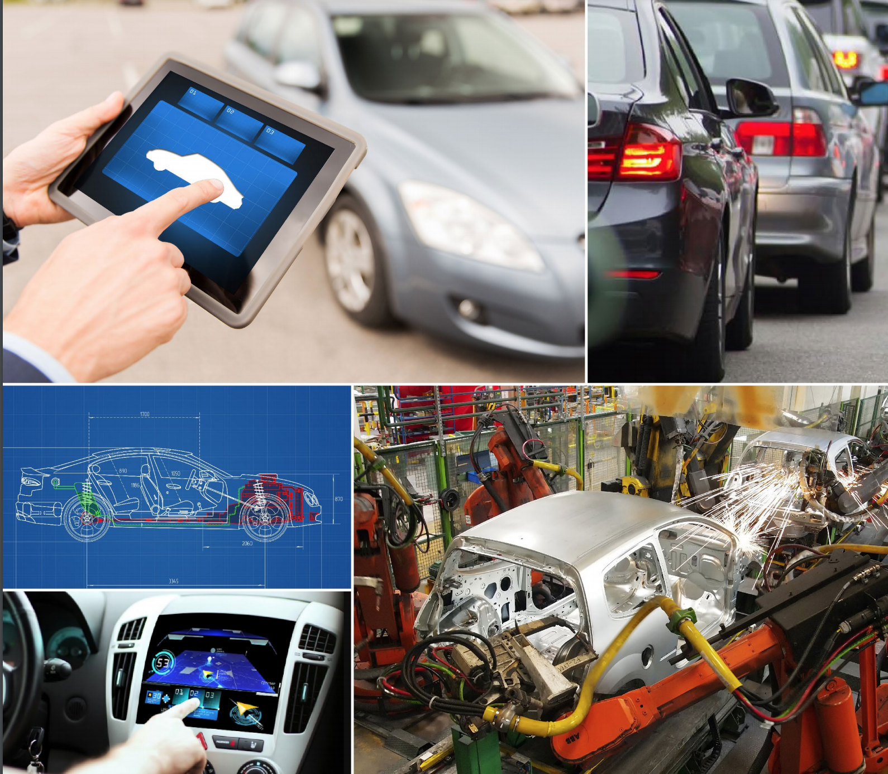
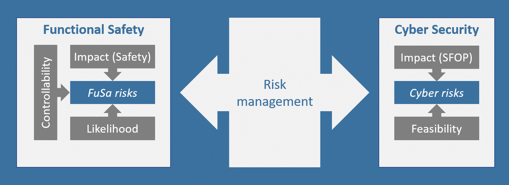
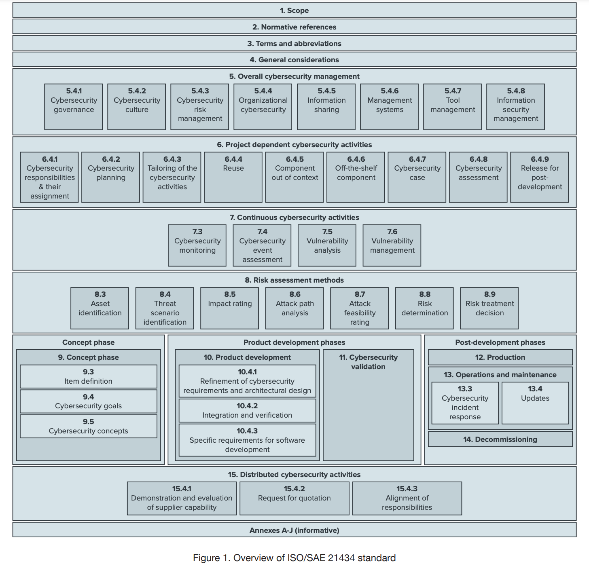

# 智能网联汽车 Cyber Security 概述

## 概念

智能网联汽车，（Intelligent Connected Vehicle，ICV），是指车联网与智能车的有机联合，是搭载先进的车载传感器、控制器、执行器等装置，并融合现代通信与网络技术，实现车与X（人、车、路、云等）智能信息交换共享、共享，具备复杂环境感知、智能决策、协同控制等功能，实现安全、舒适、节能、高效行驶，并最终可替代人来操作的新一代汽车。 

传统汽车：
- 核心部件：发动机、变速箱、底盘
- 产品定位：运输工具、代步工具

技术、产业的发展趋势：
- 软件定义汽车
- 汽车新四化（智能化、网联化、电动化、共享化）
- 车辆形态不断演变

智能网联汽车：
- 核心部件：电池、芯片、软件、数据、通信等等
- 产品定位：智能化数字平台、移动空间。
- 前端是集成复杂数字系统构成的车辆。
- 后端是融合计算、数据、网络的大型关键基础设施。

智能网联汽车，具有明显的物联网终端设备属性。包含了车载传感器、控制器、执行器等装置，融合了现代通信网络技术，能实现车与X（车、路、云、网、图、人）的智能信息交换、共享。预计2025年，全球86%的车辆将是网联汽车，且软件化程度越来越高。随之而来的是网络攻击面的扩大和暴露，更多网络安全脆弱性的曝光，将使ICV面临的安全威胁日益严峻。

### 背景

据 Juniper Research 称，到 2023 年，将有 7.75 亿辆消费车辆通过远程信息处理或车载应用程序连接，高于 2018 年的 3.3 亿辆。此外，国际数据公司预测，到同年，全球近 70%新的轻型车辆和卡车将配备嵌入式连接。其他联网汽车研究表明，到 2023 年，全球联网汽车市场预计将增长至 1220 亿美元，复合年增长率为 14%。 

随着这个互联汽车生态系统的扩展，全球汽车原始设备制造商、一级和二级供应商以及其他智能移动参与者继续为互联汽车开发各种服务、组件和技术。因此，随着车辆连接性的增长和对嵌入式解决方案的需求增加，联网车辆遭受网络攻击的风险也在增加。根据 2020 年 3 月 GSA 和麦肯锡的报告，目前，汽车拥有多达 150 个 ECU 和大约 1 亿行代码，到 2030 年，许多人预计它们将拥有大约 3 亿行软件代码。如此多的代码为网络攻击创造了大量机会，不仅针对汽车本身，还针对其生态系统的所有组件。 

每一项新的互联服务和功能都为黑客带来了额外的切入点，并为潜在的网络、欺诈和数据泄露事件带来了机会，从而威胁到公司、司机和道路使用者。

到 2023年，网络攻击可能使汽车行业蒙受高达 240 亿美元的损失6，为了遏制针对联网汽车的网络攻击的预期增加 ，政府机构和独立监管机构已努力要求 OEM、零部件和软件供应商和移动服务。 

### ICV基本构成

### 智能化系统
- 环境感知系统
  - 车载传感器
    - 毫米波雷达：77GHz，22GHz
    - 激光雷达：
    - 视觉传感器：德州仪器、恩智浦、安霸、英伟达、英特尔、Mobileeye。
    - 超声波雷达
    - 处理器
    - 高精度定位系统：如北斗卫星实时动态RTK差分定位、北斗卫星导航系统GNSS协同定位、惯性导航定位、增强视觉定位系统
  - 车载多源协同感知处理系统
  - 基于C-V2X的多源协同感知系统
- 智能决策系统
  - 行为预测系统（多种模型：有限状态机、决策树、知识推理）
  - 行为决策系统
    - 支持自主跟车、车道保持、自主换道、超车、掉头、转向、泊车等关键行为。
  - 轨迹规划系统
    - 计算更新周期小于100ms，达到人类水平90%。
  - 多车协同控制系统
    - 通信与编队
  - 自动驾驶计算平台，如华为Mobile Data Center 平台和地平线Matrix平台。
- 控制执行系统
  - 线控底盘系统：实现车辆纵向、横向、垂向动力学协同耦合控制及底层执行器控制算法。包含不同功能和等级的线控子系统和线控底盘。
    - 驱动系统
    - 制动系统
    - 转向系统
    - 悬架系统
    - 底盘域控制器和智能驾驶域控制器

  - 先进驾驶辅助系统ADAS
  - 电子电器架构平台
    - 2025建立域控制器的电子电器架构平台，实现ICV各项功能安全、可靠运行；2030建立以计算平台为核心的EE架构平台，车内控制器数量大幅降低；2035基于车路云一体化的车辆平台架构，实现整车云端协同控制。
  - 制动系统
    - 自动紧急制动AEB
  - 转向系统
    - 车道保持辅助LKA
  - 自适应巡航ACC
  - 协同控制（？？？）
  - 面向停车场、封闭场景的车辆集成控制算法的开发和测试
- 安全系统
  - 信息安全：ICV信息安全防护系统
  - 功能安全
  - 预期功能安全
- 高精地图系统
  - 先进驾驶辅助地图ADAS Map
  - 高精地图 HAD Map
- 人机交互系统
  - 车机
### 网联化系统（V2X）

- 车内网络
  - CAN总线系统
  - 以太网系统
  - LIN总线系统
  - FlexRay系统
- V2X
  - 车用环境无线存取（WAVE）、专用短程通讯（DSRC）
    - 是IEEE 802.11p底层通信协议与IEEE 1609系列标准所构成的技术，采用5.9GHz频段，并具备低传输延迟特性，以提供车用环境中短距离通讯服务。IEEE802.11p解决在高速移动环境中数据的可靠低时延传输问题、IEEE1609系列规范对V2X通信的系统架构、资源管理、安全机制等进行阐释。
    - 用于连接V2V，V2R（路侧）的RF通用射频技术。
  - LTE-V2X
    - 针对车辆应用定义了两种通信方式：集中式（LTE-V-Cell）和分布式（LTE-V-Direct）。
  - 
- 车云网络
  - 
  - DSRC 专用短程通信技术是一种新型的技术，专门用于机动车辆在高速公路等收费点实现不停车自动收费ETC技术。
  - 4G
    - 车载联网终端/远程信息处理器 T-Box
  - 5G
    - 智能交通5G网络
  - GPS
  - NR-V2X频谱
  - LTE-V2X
  - NR Uu控制
  - LTE直通链路
  - 单播组播系统。
  - 2030完成NR-V2X 6GHz以上毫米波系统

 
- 云控平台
  - 2025建立区域级ICV大数据云控基础平台；2030建立国家级ICV云控平台；2035云控平台覆盖一二线主要城市全区域和高速公路全路段。
  - 实时信息融合与共享、计算、应用编排、数据分析、信息安全
- 车路协同系统
  - 2025机遇车路数字化信息共享的驾驶辅助技术成熟应用、车路融合环境感知技术实现应用、车路融合的辅助定位技术成熟。
  - 2030机遇车路云协同决策的自动驾驶技术逐步成熟，在重要交通节点、路段和封闭园区实现应用。
  - 2035形成全国车路云一体化自动驾驶技术。
- 智能道路系统
  - 2030高速公路实现基于交通基础设施的HA级自动驾驶、城市快速路实现机遇交通基础设施的CA级自动驾驶。
  - 2030城市主干路最优服务车辆自动驾驶等级覆盖DA级和PA级

### 基础支撑技术

- 信息安全技术
  - 2025构建ICV基础防护体系，在CA、HA落地；实现HA级以上信息安全防护体系落地；信息安全防护体系全面落地。
  - 标准体系
  - 防护体系
  - 安全漏洞检测
- 功能安全和预期功能安全
  - 2025完善ICV整车、系统、芯片层面的功能安全设计流程；建立预期功能安全设计分析流程。
  - 
- 高精地图
  - 先进驾驶辅助地图ADAS Map
  - 高精地图 HAD Map
- 高精度定位
  - 北斗卫星实时动态RTK差分定位技术
  - 北斗卫星导航系统GNSS协同定位
  - 惯性导航
  - 增强视觉定位
- 法规标准
  - 先进驾驶辅助系统ADAS
  - 自动驾驶AD
  - 汽车信息安全CS
  - 网联功能与应用CFA
- 测试评价技术
  - 整车与系统测试
  - 虚拟仿真
  - 场地测试
  - 典型驾驶场景库
- 示范推广

### ICV 安全威胁
汽车联网率的持续增加，使得大规模的攻击成为可能；而网联汽车的新功能越丰富，其安全风险也越大，一旦发生重大信息安全事件，将会影响到公共安全，对车企造成巨大的经济、名誉损失，对用户造成生命、财产损失。

主要涉及3个层面：
- 个人隐私泄露
- 企业经济损失
- 国家公共安全问题（重大交通安全事）

### ICV 安全现状
- 安全现状1：庞大的产业链面临巨大安全隐患
  - ICV产业链条长，跨越了汽车、电子、通信、交通、车辆管理等多个行业和领域。
  - 整个供应链中任何一个环节被植入后门，都会影响整车安全和ICV安全应用，很难排查。
- 智能网联汽车攻击面广，远程攻击成为首选
  - 联网是ICV的基本属性，也是网络攻击的重要入口。
- 代码庞大复杂，安全开发能力和软件生命周期管理的严重滞后，很容易引入漏洞
- 汽车工业与ICT行业的理念差距很大
  - 汽车工业理念：安全（Safety）和可靠，产品开发周期长，产品生命周期长，重点是硬件
  - ICT行业理念：用户体验和网络安全（Cyber Security），采用敏捷开发，产品生命期短，重点是软件
- 整个行业的安全标准、技术和实践都存在不足。
  - 产品实现的安全机制不完善
  - 产品漏洞修复慢、更新慢
  - 安全开发过程尚未建立或组织、过程不健全
  - 数据安全和隐私保护未能有效落实
  - 网络安全监控与响应机制不健全
- Safety 和 Security 的设计挑战
  - 不同方向的设计，会有不同的结果。
  - 例如：功能安全（Safety）设计人员希望将MCU的调试接口开放，以便检测RAM内容；Cyber Security设计人员要求关闭接口，防止黑客获取RAM内容。
  - 例如：The cyber security 要求对关键部件设立防火墙和访问控制；The safety 因网络延迟降而反对。
- 海量数据上云带来隐私保护挑战
  - 自动驾驶汽车每小时产生25GB的数据
  - 数据安全与隐私保护法规频发：GDPR、《数据安全法》、《个人隐私保护法》、《个人信息管理体系（PIMS）国际标准》、ISO27001

### ICV 安全发展趋势
- 开始从汽车全生命周期、全应用场景考虑安全问题。
- 国家和行业建立了ICV安全标准和技术规范体系。
- 国家交通一体化建设，正在关注车内关键部件安全、智能交通安全、V2X通信安全。
- 自动驾驶汽车安全设计、安全测试、安全运营。

---

## ICV Cyber Security 法规标准

### 国际法规与标准

#### WP.29 汽车信息安全及软件升级法规要求草案

>"Proposal for a new UN Regulation on uniform provisions concerning the approval of vehicles with regards to cyber security and cyber security management system"

2020年6月，联合国世界车辆法规协调论坛（UN/WP.29)发布了汽车信息安全及软件升级法规要求草案。

- 该法案影响供应链中所有企业。
- 建立了管理框架。
- 建立了对车辆的最小要求。
- 但尚未提供细节指导。
- 要求对OEM信息安全管理和流程进行认证评估。
- 对车型认定的流程及最小要求进行了约束。

#### 欧洲经委会（UNECE）WP.29 发布法规：网络安全 (R155) 和软件更新 (R156)

这两项2021年的新规定，要求建立网络安全管理系统 (CSMS)，涵盖组织处理与车辆、设备和服务整个生命周期相关的网络风险的政策和流程与汽车产品安全开发以及生产、运营、维护和退役等开发后活动相关的活动和文件。

- R155 法案：《关于认证车辆在网络安全和网络安全管理系统方面的统一规定》
- R156 法案：《关于认证车辆在软件更新和软件更新管理系统方面的统一规定》

R155和R156法案，要求在以下4个方面实施措施：
- 要求车企管理车辆网络风险。
- 优化设计，降低网络安全风险。
  - 通过设计确保车辆网络安全，减轻价值链上的风险。
- 检测、监控和响应车辆网络安全事件。
- 安全可靠软件更新
  - 提供安全可靠的软件更新机制，确保车载软件通过OTA远程升级的安全行。

这些将使网络安全成为不可谈判的，以确保60 多个国家/地区的市场准入和类型批准，这些国家/地区是 UNECE WP.29 成员的一部分。在不久的将来，原始设备制造商、一级供应商和供应链的其余部分必须证明这些目标，才能获得在市场上推出新车的授权。

特别注意：
- R155附录5列出了7大类网络威胁和漏洞类别，以及69种攻击路径。
- ISO/SAE 21434 作为遵守法规的主要参考标准

#### ISO 21434 Road Vehicle Cybersecurity Engineering

2016年，SAE International 和 ISO 专家开始一起工作，解决汽车网络安全相关行业标准制定问题。
- ISO 26262 规范了功能安全标准;
- SAE J3061 奠定了网络安全标准的基础。

2020年2月，国际标准化组织和国际自动机工程学会（SAE）形成了DIS版道路车辆网络信息安全指引 [ISO/SAE 21434](https://www.iso.org/standard/70918.html)。**这个标准是汽车制造商和供应商确保网络安全风险得到有效管理的基准。**

本标准为确保最终道路使用者/驾驶者的安全和保障而制定的，因此，风险的决定级别和相应的网络安全措施是基于最终对驾驶员的影响而制定的。该标准提供一个标准化的网络安全框架，将网络安全确立为车辆从概念阶段到报废整个生命周期工程的一个不可分割的元素，确保网络安全在后期运营过程中得到考虑（软件更新、服务、维护、事故响应等），并呼吁采取与汽车网络安全相关的经验教训、培训和沟通的有效方法。

时间轴：
- 2016年1月，SAE 发布了标准SAE J3061
- 2016年中，ISO/TC22 道路车辆技术委员会的 SC32/WG11 Cybersecurity 信息安全工作组成立。
- 2017年3月，SC32/WG11 Cybersecurity 立项起草了 ISO/SAE AWI 21434
- 2020年2月，SC32/WG11 Cybersecurity 发布了 ISO/SAE DIS 21434 ，并取代了SAE J3061
- 2021年7月，ISO/SAE 21434 FDIS 发布。

> 备注：国际标准组织(ISO)标准的制订过程分为五个步骤：经过工作小组草案（Work Draft；WD）、委员会草案（Committee Draft；CD）、国际标准草案（Draft International Standard；DIS）、最终国际标准版草案( Final Draft International Standard；FDIS )与正式发行的国际标准版( International Standard；IS )

ISO/SAE 21434 DIS 特点：
- 基于SAE J3061制定，覆盖车辆整个生命周期的工程管理标准。
- 不涉及具体技术实现细节。
- 计划2020年末完成。
- 参考V字形模型开发流程。
- 主要从安全风险管理、产品开发、生产、运营/维护、跨产品或组织层面的保障流程等四个方面来保障汽车信息安全工程工作的开展。
- 目标是采用该标准设计、生产、测试的产品能具备一定的信息安全防护能力。

##### 主要内容

ISO/SAE 21434主要从15个方面对车辆的网络安全进行了阐述，其中5-7章从宏观上介绍车辆网络安全的总体要求：
- 整体网络安全管理
- 基于项目的网络安全管理
- 持续网络安全活动

后续的7个章节按照产品全生命周期的顺序，定义了下列各阶段对于车辆网络安全的要求：
- 风险评估
- 概念开发
- 验证到生产
- 运维、退役等

最后一章“分布式网络安全活动”主要介绍当前车辆分布式合作开发的背景下，对于资产识别，要求报价，责任分布等方面的网络安全要求。

每个章节都是从5个角度进行叙述：
- 概要
- 目的
- 输入
- 要求和建议
- 工作产品

#### 通用数据保护条例 (GDPR)

### 国内法规与标准
#### 政策法规
- 2000年9月，国务院颁布《互联网信息服务管理办法》
- 2018年，工业和信息化部印发《车联网（智能网联汽车）产业发展行动计划》。
- 2018年6月，《网络安全法》正式实施。
- 2018年，《APP违法违规收集使用个人信息行为认定方法》
- 2018年，《个人信息安全规范》
- 2020年2月10日，11部委联合发布《智能汽车创新发展战略》
- 2020年3月，《网络信息内容生态治理规定》施行。
- 2020年10月，《中华人民共和国个人信息保护法（草案）》发布。
- 2020年11月，中国智能网联汽车产业创新联盟发布《中国智能网联汽车技术路线图2.0》

- 2021年1月，《互联网用户公众账号信息服务管理规定》
- 2021年2月，中共中央、国务院印发了《国家综合立体交通网规划纲要（2021年-2035年）》
- 2021年3月，国家互联网信息办公室、工业和信息化部、公安部、国家市场监督管理总局联合制定和发布了《常见类型移动互联网应用程序必要个人信息范围规定》
- 2021年3月，公安部发布《道路交通安全法（修订建议稿）》
  - 应当依法确定驾驶人、自动驾驶系统开发单位的责任，并依照有关法律、法规确定损害赔偿责任；构成犯罪的，依法追究刑事责任。具有自动驾驶功能但不具备人工直接操作模式的汽车上道路通行的，由国务院有关部门另行规定。
- 2021年4月，工业和信息化部发布《智能网联汽车生产企业及产品准入管理指南（试行）》（征求意见稿）

- 2021年4月，深圳发布《深圳经济特区智能网联汽车管理条例》（征求意见稿）
  - 符合智能网联汽车产品地方标准或者团体标准的产品，列入深圳市智能网联汽车产品目录。
  - 提出先驾驶人赔偿，再追究生产和销售企业的责任。
- 2021年6月，《中华人民共和国数据安全法》通过，自2021年9月1日起施行。
- 2021年7月，工业和信息化部 国家互联网信息办公室 公安部联合印发《网络产品安全漏洞管理规定》，本规定自2021年9月1日起施行。

#### 国家、行业标准
- 2017年9月，《国家车联网产业标准体系建设指南（电子产品和服务）》
  - 2020年完成车载电子产品与服务平台的关键技术标准及测试标准，建立车载智能终端的安全和质量认证标准体系，推动车联网产业服务平台标准在产业中的实际应用。
- 2017年12月，《国家车联网产业标准体系建设指南（智能网联汽车）》
  - 2025年系统形成能够支撑高级别自动驾驶的智能网联汽车标准体系。制定100项以上的智能网联汽车标准，涵盖智能化自动控制，网联化协同决策技术以及典型场景下自动驾驶功能与性能相关的技术要求和评价方法，崔晋智能网联汽车和“智能化+网联化”融合发展，以及技术和产品的全面推广普及。
- 2018年6月，《国家车联网产业标准体系建设指南（总体要求）》。
  - 到2020年，基本建成国家车联网产业标准体系。
- 2019年10月，《国家车联网产业标准体系建设指南（车辆智能管理）》。
  - 到2022年底，完成基础型技术研究、制定智能网联汽车登记管理、身份认证与安全等领域重点标准20项以上，为开展车联网环境下的智能网联汽车道路测试、车联网城市级验证示范工作提供支撑。
  - 到2025年，系统形成能够支撑车联网环境下车辆智能管理的标准体系，制修订道路交通运行管理、车路协同管控与服务等业务领域重点标准60项以上。
- 2019年10月，《国家车联网产业标准体系建设指南（智能交通相关）》
  - 到2022年底，制修订智能交通基础设施、交通信息辅助等领域智能交通急需标准20项以上，初步构建起支撑车联网应用和产业发展的标准体系；
  - 到2025年，制修订智能管理和服务、车路协同等领域智能交通关键标准20项以上，系统形成能够支撑车联网应用、满足交通运输管理和服务需求的标准体系。

- 2020年4月，工信部发布《道路机动车辆产品准入新技术、新工艺、新材料应用评估办法》（征求意见稿）
  - 道路机动车辆生产企业因采用新技术、新工艺、新材料，其产品不能满足《管理办法》规定的准入条件时，可向工业和信息化部提出相关准入条件豁免申请，并按照本办法进行评估。

- 2021年，广州市率先走入车-路-城“标准化”时代，发布《广州市车联网先导区建设总体技术规范》和《广州市车联网先导区V2X云控基础平台技术规范》。

- 2021年7月，全国信息安全标准化技术委员会组织起草形成了《信息安全技术 网联汽车 采集数据的安全要求》标准草案，现面向社会公开征求意见。

2020年标准数量超过30个。

## 智能网联汽车安全风险

中汽中心发布了自己的Top 10。来源为owasp web安全、移动安全、物联网安全，进行自己的总结排序。

### 2019 TOP 10

- 1.不安全的云端接口
- 2.未经授权的访问
- 3.系统存在后门
- 4.不安全的车载通信
- 5.车载网络未做安全隔离
- 6.系统固件可被提取及逆向
- 7.不安全的第三方组件
- 8.敏感信息泄漏
- 9.不安全的加密
- 10.不安全的配置

### 2020 top 10

- 1.不安全的生态接口
- 2.未经授权的访问
- 3.系统存在后门
- 4.不安全的车载通信
- 5.系统固件可被提取及逆向
- 6.存在已知漏洞组件
- 7.车载网络未做安全隔离
- 8.敏感信息泄漏
- 9.不安全的加密
- 10.不安全的配置

## 汽车网络安全风险评估方法
 > 中汽数据

### EVITA

E-Safety Vehicle Intrusion Protected Applications是欧盟于2008年发起的一个针对网联汽车安全的项目，其目标是设计一个车载网络的体系结构的原型，使其中与网络安全相关的组件受到保护。EVITA方法主要参考ISO/IEC 15408 (7)和ISO 26262，设立了四个安全目标：可用性（Operational），功能安全（safety），隐私（privacy）和资产（Financial）。

对于每个网络安全目标，EVITA项目考虑:
- 威胁识别:使用“暗面”场景和攻击树来识别一般性威胁，从而识别一般性威胁网络安全的需求。威胁分类:根据威胁结果的严重程度和成功攻击的概率，制定了对威胁风险进行分类的建议。
对于每个严重度等级可以从下表获得（与26262相比，其拓展了非功能安全相关的目标）

未完。。。

---

## 软件更新系统对OEMS和供应商的影响——如何应对UNR156和ISO24089

>escrypt 2021.6.

### 背景
- Mary Barra,GM的CEO认为：汽车工业将在接下来的5到10年发生更多的变化，这比过去50年要多的多。
- 到2021年，超过380 million的联网汽车行驶在路上。
- 制造商因网联汽车有着清晰的商业机会，所以正加速使其汽车联网。
- 消费者接受网联汽车的速度比预期的要快
- 技术公司将在未来扮演汽车市场的主角
- 全自动汽车将在几年后出现。

### UNECE wp.29 要求

UN R155/R56法案要求通过4个方面管理风险，对汽车制造厂建立清晰的性能和审计要求：
- 管理车辆网络安全
- 通过设计来加固车辆，缓解风险
- 检查和响应安全事件
- 提供安全、加固的软件升级。