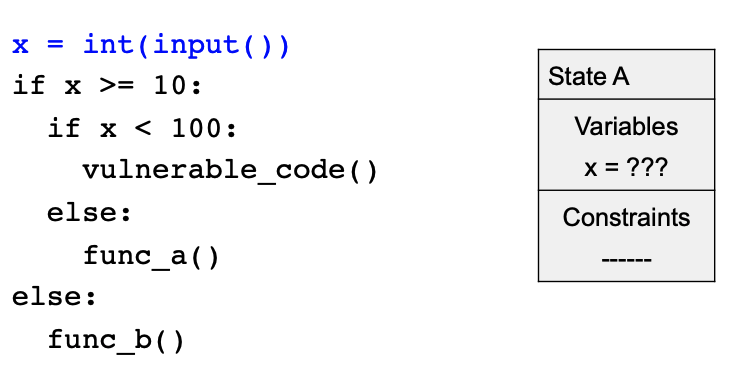
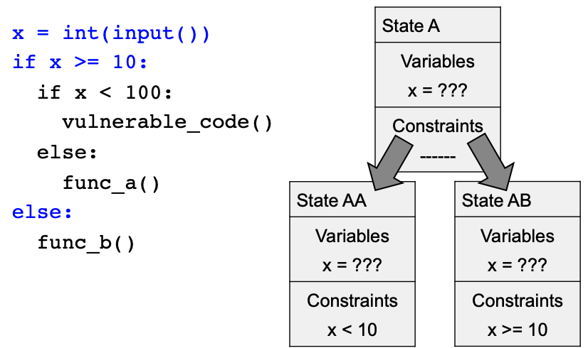
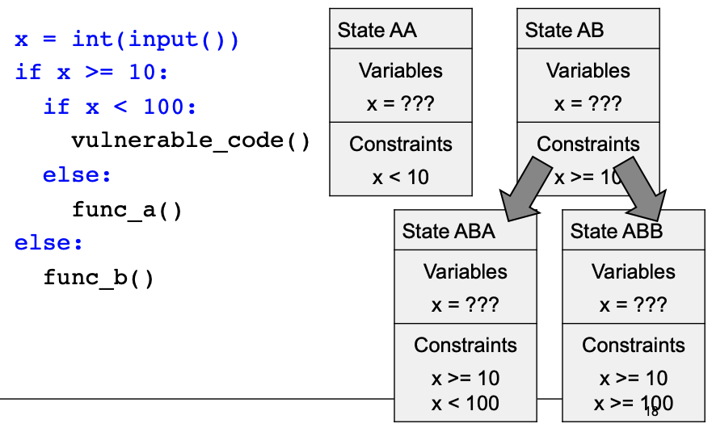
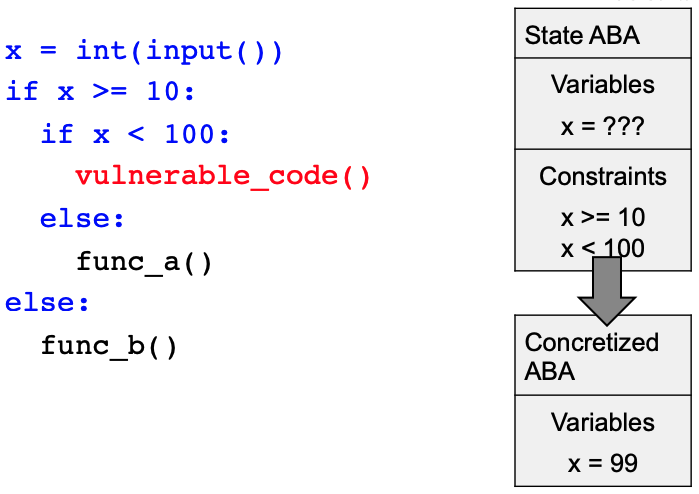
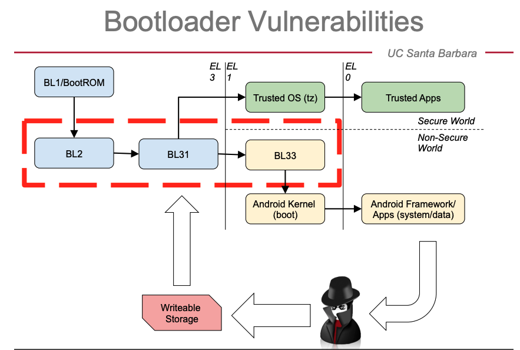

# 嵌入式软件漏洞挖掘

嵌入式软件，常称为固件。嵌入式软件是连接现实世界和网络世界的一种纽带，它在各种电子设备中非常常见。相关的词汇很多，例如pervasive、ubiquitous computing、IoT，在传感器（Sensors）和执行器（Actuators）中比比皆是。

嵌入式软件代码量巨大，难免在其中包含漏洞。嵌入式软件的漏洞分析主要特点是：
- 仅有二进制文件（甚至没有OS或库）
- 软件与硬件关系密切

补丁管理上也有特点：
- 设备必须便宜
- 供应商可能已经消失了。

嵌入式软件的安全挑战：
- 远程访问
  - 设备认证
  - 访问控制
  - 是进入系统的关键
- 增加的漏洞面
  - 从物理世界发起的攻击
  - 供应链攻击
- 可以访问固件

代表：MIRAI 病毒
## 二进制分析
二进制代码是0/1组成的，不像源代码中有类型信息、控制流信息、符号信息等等辅助。

### 静态分析

### 动态分析

### 符号执行
符号执行的例子："如何触发路径 X 或条件 Y ?"，基本思路如下：
- 解释应用，保持输入值的抽象性（sumbolic）
- 跟踪变量上的 “constraints”
- 当条件被触发时，“concretize ”（具体地） 获取一个可能的输入

例如有代码：
```py{.line-numbers}
x = int(input())
if x >= 10:
    if x < 100:
    vulnerable_code()
    else:
    func_a()
else:
    func_b()
```

符号执行时步骤如下：
- 分析第1行代码，建立一个 STATE A，里面含每个变量的值和变量的约束



- 分析分支结构if-else，从STATE A 生成两个子状态：AA和AB。



- 分析内层分支结构（第3行），基于AB构建子分支状态ABA和ABB。


- 分析第4行代码，此时变量具体复制为99



Pros&Cons：
- Pros
  - 精确
  - 没有假正例（有正确的环境模型）
  - 产生直接的可执行的输入
- Cons：
  - 不易扩展。约束计算是NP-complete
  - 状态和路径可能爆炸

### UCSB 开发的二进制分析框架 ANGR
ANGR 是UCSB开发的开源分析平台。

ANGR的组成：
- 二进制加载器
- 静态分析程序
  - 控制流图
  - 数据流图
  - Value-Set分析
- 符号执行引擎
  - 前向符号执行
  - Under-constrained SE


angr的挑战和目标
- 可扩展性
- 精确度
- 恶意软件新模型

angr的优化方案：
- 快速路径（fastpath）和适应性具像化（adaptive concretization）
  - 如果可能，以非符号方式分析部分代码
- 窥视孔优化（peephole optimization）
  - 替换破坏符号执行的代码段
- 延迟约束求解（lazy constraint solving）
  - 有时等待添加更多约束会使解决更容易

- 约束计算优化
  - 求解缓存
  - 约束子集管理
  - 表达式简化
  - 表达式重写

- 静态分析支持
  - Veritesting
  - LESE（loop extended sym exec）智能循环unrolling
  - Code summarization
  - VSA（Value set analysis）

## AFL：Fuzzing Tool

AFL（American Fuzzy Lop）

ANGR 集成了一些别的工具，例如AFL。AFL可以帮助我们构造大量输入进行测试。符号执行优势在特定输入
## 漏洞模型
漏洞造成的危害有：
- 内存安全漏洞
  - 溢出执行
  - 越界读取（heartbleed）
  - 任意地址写
- 认证绕过（后门）
- 执行器控制

通常，分析认证过程代码比较困难（大多有复杂的加密算法），但分析认证成功后的将要执行代码比较容易。如何查找这部分代码？
- 查找认证成功的点
  - 没有OS/ABI信息时，需要通过二进制你想去查
  - 有ABI信息时
- 识别认证成功的位置（authenticated point）
  - 可以通过静态分析，查看数据引用、系统调用、可读字符分析等
- 路径收集
  - 认证通过后路径可能存在多种
- 漏洞检测
  - bootloader 漏洞



- 两种恶意模型
  - 内存 corruption
  - 不安全的解锁

符号污染传播（symbolic Taint Propagation）

几种芯片的bootloader 

DARPA	Cyber	Grand	Challenge

## 参考
- Christopher Kruegel ,Finding Vulnerabilities in Embedded Software, UC Santa Barbara
- 