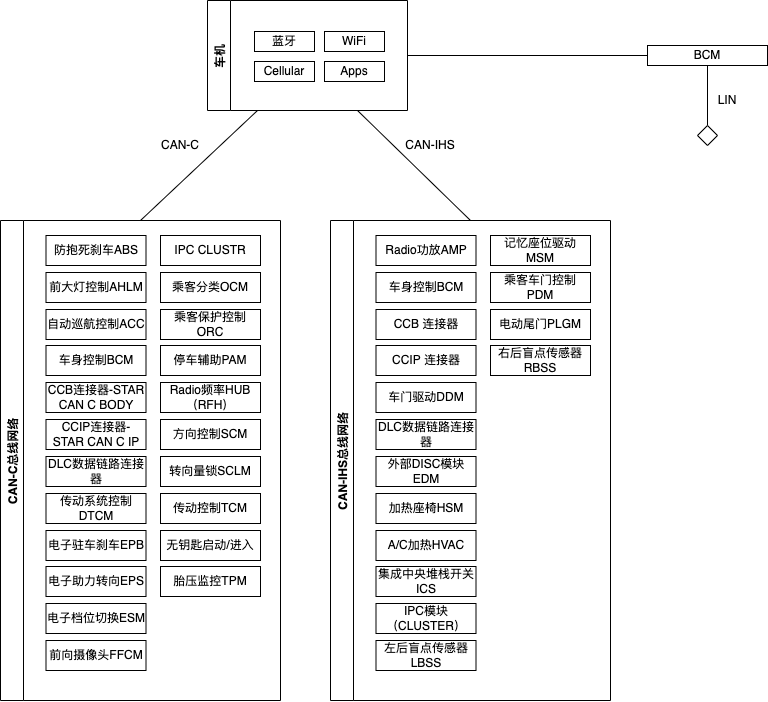
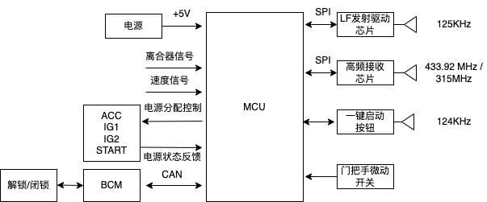
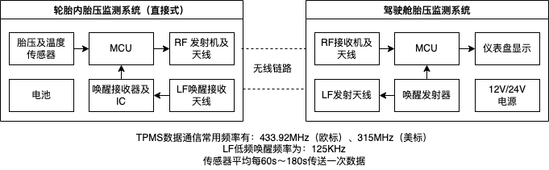
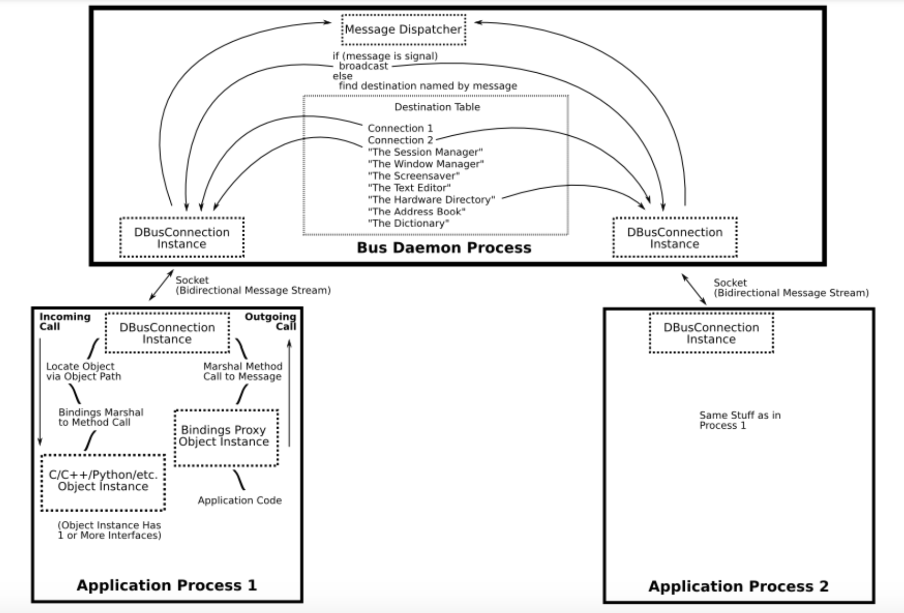
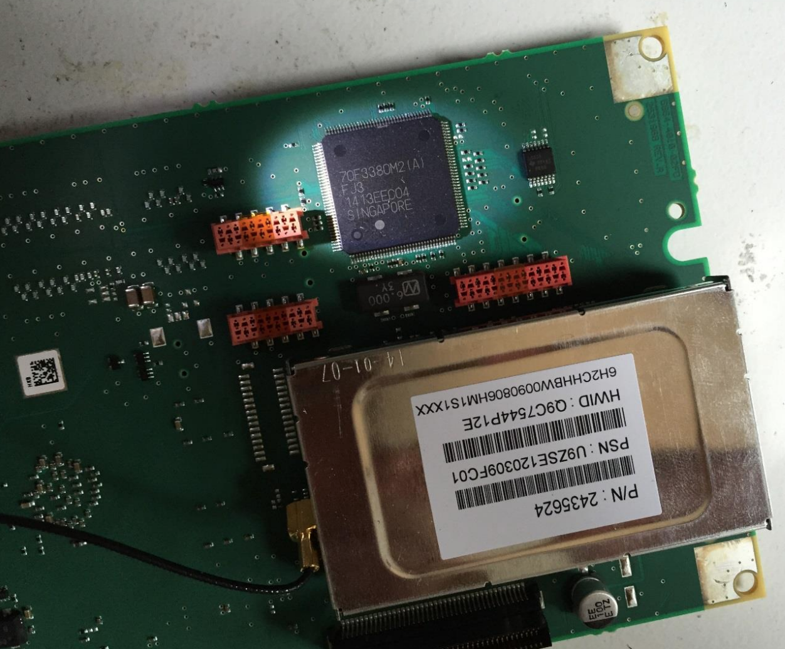

# 汽车网络安全系列 0x01 —— 历史的交叉口

HHHParty 2022年5月10日

汽车就像“移动的房间”，为人们提供了出行服务的同时，还兼顾了临时居所的功能。自1885年德国人卡尔.奔驰（ BariFriedri BhAenz） 制造出第一台能用的三轮汽车以来，汽车产品和产业经过了近140年的发展，在发动机、传动系统、制动系统、车身结构、驾乘操控等方面有了诸多变化。近50年间，汽车的电子电气架构也从分布模块，到多域集中，再向智能融合方向发展，为原有的纯机械结构加上了电，将火与电这两种神奇的力量融于一身，一台汽车上的传感器、线束、控制器、软硬件系统越来越多，功能越来越丰富。而最近的20年，以Tesla为代表的科技公司还为汽车开启智能，汽车从“移动的房间”逐渐演变为电气化、联网化、智能化的“移动房间”。科技的发展有其两面性，当汽车用户和汽车制造商不断憧憬着汽车在未来有多么美好的时候，一个从未在汽车上出现的问题出现了。这个问题就是现在汽车行业普遍关注和升温的网络安全问题。

2015年8月，Charlie Miller 博士和Chris Valasek 发表了他们的研究报告：《Remote Exploitation of an Unaltered Passenger Vehicle》。这篇长达91页的报告较为详细介绍了针对 2014款 Jeep Cherokee 车型的网络安全问题研究，特别是对未改装原款车型的远程攻击部分，引起了各界人士的关注。之前对此类问题的研究，汽车OEM厂商总体态度是比较一致的，那就是这种攻击必须要物理接触车辆才能实施，这样的攻击还不如直接剪断汽车内的电线来的直接，所以没必要特别关注。而 Miller 等人的报告揭示了网络攻击不仅能远程实施，还将大面积影响众多消费者安全。至此，汽车OEM厂商、零部件T1/T2厂商不得不开始重新审视面向汽车的网络攻击，这种攻击不再只是一些技术狂热者的个人臆想，而是一种必须面对的客观存在了。


图1 Fiat Chrysler U.S. 2014 Jeep Grand

2015年，美国国家高速公路交通安全管理局（NHTSA）根据上面报告和自身调查，发出了有史以来第一张由于网络安全而产生的召回要求。NHTSA 要求生产2014款 Jeep Cherokee（Grand）的 Fiat Chrysler 公司召回存在相关问题的车辆，包括：2013-2015款道奇蝰蛇，2013-2015款Ram 1500、2500和3500皮卡，2013-2015款Ram 3500、4500、5500 Chassis Cabs皮卡，2014-2015款Jeep大切诺基和自由光SUV，2014-2015款道奇Durango SUV，2015款克莱斯勒200、克莱斯勒300和道奇Charger轿车，2015款道奇Challenger轿跑等车型，共涉及140万辆车，所召回的车辆都搭载了基于 QNX 系统的 Uconnect 系统，配备8.4英寸大屏幕。Fiat Chrysler 公司总损失高达数百万美元。那年7月，Fiat Chrysler 公司在纽交所的股票收盘价格为15.15美元，下跌了2.5%。

  

图2 Fiat Chrysler U.S. 2014 Jeep Grand召回信息  

事实上，随着网络化、智能化程度的不断提高，汽车不可避免地融入了万物联网的世界，也自然而然会受到IoT世界中的网络安全问题的影响。这也是近年来 NHTSA、WP.29、SAE、CICV等国内外汽车研究机构开启汽车网络安全专门研究的时代背景和技术背景。在国内，随着车联网、智能网联汽车等概念的唱响，理想、蔚来、小鹏等造车新势力的崛起，华为、百度、小米、京东等互联网厂商的入局，汽车行业与互联网行业开始深度融合。国内大部分的汽车技术研究机构、汽车OEM厂商、汽车零部件供应商（T1/T2）和互联网厂商开始聚焦汽车网络安全领域，纷纷结合自身需求和特长，一方面考虑设计和实现更为成熟、更加经济的网络安全解决方案，另一方面考虑将网络安全作为新的价值增长点为内、外部客户提供相关产品和服务。

为了更好的理解和应对汽车网络安全问题，个人认为（1）首先需要基于典型案例或场景从技术层面了解问题现象和原因；（2）之后对问题进行初步的归纳总结，制定基本的风险缓解措施和安全控制方案；（3）由于不同车型的技术架构、联网方式、实现细节各不相同且在快速发展变革，而攻击者也在不断演进自己的战术和技术，所以需要对（1）和（2）两个步骤进行不断地迭代，形成更为全面、更为细致、更有弹性的安全基线和安全框架。

在“汽车与网络安全”这一系列专题下，我尝试将系统地分析与讨论涉及汽车网络安全的主要方面和技术细节，希望能为国内关注汽车网络安全的专业人士提供一些有价值的参考信息。作为这个系列的第一篇，希望通过回顾《Remote Exploitation of an Unaltered Passenger Vehicle》这份技术报告的诸多细节来发现汽车中现实存在的网络安全问题，并形成后续的分析脉络。


图3 《Remote Exploitation of an Unaltered Passenger Vehicle》报告

## 报告内容回顾

Miller 等人2015年发表的这份报告，不少人听说过，但认真阅读的人比较少，大多把它当作一则新闻看待。作为汽车黑客的开山之作，其内容很丰富，值得详读一番。Miller 等人选择 2014款 Jeep Cherokee 作为研究对象的原因，是这款车恰好被作者发现且能充分证明远程网络攻击能够窃取驾驶员隐私并且实现远程控车。在《Remote Exploitation of an Unaltered Passenger Vehicle》报告中，大致分为下面几个部分：
- 2014款 Jeep Cherokee 的技术分析
- 网络安全攻击面分析
- 攻击路径上各系统的详细技术分析和漏洞发现
- 远程攻击尝试
- 发现与结论

### 2014款 Jeep Cherokee 的技术分析

从报告来看，Miller 等人对2014款 Jeep Cherokee 车型的分析聚焦于车机系统（即车载信息娱乐系统）、以车机为核心的车辆网络连接和该车型具备的辅助自动驾驶功能等。

2014款 Jeep Cherokee车型将车机（Head Unit/Radio）与CAN总线直接相连。基本组成如下图所示：



分析这些系统的意义在于进行攻击面分析，寻找远程攻击入口。车机具有远处通信功能，如果能从远程渗透车机，那么就可以访问连接在CAN-IHS和CAN-C网络上的大量ECUs，这意味着恶意CAN消息可以发送到所有车辆控制物理功能的ECUs上。事实上，之后的远程渗透过程也是沿着这个思路进行的。

2014款 Jeep Cheerokee 配备了为数不少的辅助驾驶功能，这些功能一方面为驾乘人员和车外环境提供了更多的安全保障，但另一方面也增加了网络入侵的可能。这些功能包括：自动巡航控制ACC、前向碰撞告警（FCW+）、道路偏离告警（LDW+）、泊车辅助系统PAM等等。Miller等人利用了PAM系统来实现了远程控车操作。

### 攻击面分析

网络攻击是利用系统漏洞并破坏目标网络信息系统机密性、完整性、可用性的过程，它开始于对目标的信息搜集和攻击入口寻找。面向汽车的网络攻击也不例外，通过分析网络架构和车辆功能，发现潜在的攻击入口有6个：

|攻击入口|连接的ECU|连接总线|
|-|-|-|
|远程无钥匙进入/启动系统RKE|车机（Radio）频率控制模块RFHM|CAN-C|
|被动防盗系统 PATS|车机（Radio）频率控制模块RFHM|CAN-C|
|胎压监测系统TPMS|车机（Radio）频率控制模块RFHM|CAN-C|
|蓝牙系统Bluetooth|车机（Radio）|CAN-C，CAN-IHS|
|FM/AM/XM|车机（Radio）|CAN-C，CAN-IHS|
|蜂窝通信Cellular|车机（Radio）|CAN-C，CAN-IHS|
|Internet / APPs|车机（Radio）|CAN-C，CAN-IHS|

就上面列表中的内容，简要说明如下：

1.RKE和PATS是最先会被考虑的攻击入口，因为一旦发现并利用 RKE 或 PATS 的漏洞，就能够证明非法进入车辆和点火启动是成立的。下图给出了 RKE 类似系统的组成。

> 注：RKE 在有些资料中，称为无钥匙进入系统和无钥匙进入系统（Keyless Entry Start & Exit Security System，Kessy），也有OEM称之为被动进入和被动启动系统（Passive Entry & Passive Start，PEPS）。



图3 - 无钥匙进入系统的基本结构

2.2014款 Jeep Cheerokee 的远程无钥匙进入系统 RKE（钥匙）里有一短距离无线发射器能够与车内的ECU——Raido 频率HUB模块（RFHM）进行通信。当钥匙发送包含了正确识别码的信息，RFHM 若判断该钥匙有效，会随后完成锁闭、解锁和启动车辆等操作。RFHM的固件（Firmware）程序负责 RF 信号处理、加解密识别码、识别遥控钥匙发送的数据，还能为备用钥匙编程。Jeep的被动防盗系统 PATS 使用了一块放在启动钥匙中的芯片与车内传感器通信，而这一传感器直接连接着 Raido 频率 HUB 模块（RFHM）。当启动按钮按下时，车载计算机会发生一个射频信号，钥匙内的应答器采集到这一信号后会返回一个唯一的RF信号给车载计算机。之后，车载计算机会确认启动并持续运行。这个过程少于1秒，如果车载计算机没有接收到正确的识别码，某些部件（例如燃油泵和某些部件上的起动机）将保持禁用状态。虽然存在发现 RFHM 固件漏洞及利用方法存在可能，但其远程实施攻击的可能性不大，因为必须非常接近车辆才能与车内传感器进行通信。

3.胎压监测系统 TPMS 也是一个常被考虑的攻击入口。TPMS的基本结构如下图4所示。Cheerokee 的每条轮胎都装有压力传感器，使用短距离无线通信方式实时传递数据给 RFHM 中的信号接收传感器。在一些安全研究中TPMS确实可能被攻击者通过无线信号注入方式产生干扰或影响功能，甚至可以证明TPMS以不安全方式处理接收到的数据，但通过TPMS形成代码注入和执行的可能性较小。




图4 - TPMS系统的基本结构

4.车载蓝牙系统是值得关注的一个攻击入口，从近年来美国 NIST 的国家漏洞库 NVD 可知，与蓝牙相关的漏洞有583个（截止2022年5月10日），其中不乏可远程利用的高危漏洞。2014款 Jeep Cheerokee 的蓝牙系统集成在车机系统中，蓝牙配对成功后可执行访问车机中的通信录、拨打电话、听音乐、发送短信等操作。

5.2014款 Jeep Cheerokee 的 Radio 数据系统衔接着GPS、AM/FM Radio、卫星Radio等远程输入，还具有通过FM模拟信号或卫星信号向外发送数据的功能，因此它的 Radio 数据系统也被考虑为一个攻击入口。

6.基于蜂窝通信的互联网接入模块不仅连通了互联网，也将作为一个WiFi热点为车内乘客提供服务，所以Jeep上的蜂窝通信和WiFi热点也都被列为重要的攻击入口。由于 2014款 Jeep Cherokee 的WiFi热点必须付费后才能开通使用，所以利用 WiFi 热点漏洞是存在付费这一条件的。默认的 WiFi 加密方式为带8位字符+数字的随机密钥的 WPA2 算法，这一点是比较安全。

7.车载信息娱乐系统（Telematic）及其中应用既可连接互联网且常见于包含可利用漏洞，是值得关注的一大攻击入口，而暴露出严重问题的 Uconnect 系统也证实了这一点。

### 漏洞挖掘详情

#### Uconnect 系统

Uconnect 系统是一款功能不俗的车机系统。2014款 Jeep Cheerokee 装配的为Uconnect 8.4AN/RA4，由 Harman Kardon 制造，提供车载娱乐、WiFi连接、导航、应用软件和蜂窝通信功能，所用的OS为黑莓 QNX。


主要功能芯片为同档次车型中较为常见的 TI OMAP-DM3730 芯片，这是一种基于ARM Cortex-A8的32位单核数字媒体处理芯片，支持以太网，OS为Linux 或 RTOS（Jeep选用了QNX）。Uconnect 通过CAN-IHS总线与其他ECUs通信，在一些装配了 Uconnect Acess组件的车辆里，也会使用CAN-C总线与ECUs通信。

Harman 公司产的 Uconnect系统在 Fiat Chrysler 公司其他车型上也颇为常见，例如：Chrysle、Dodge、Jeep、Ram等等。由于 Uconnect 中存在漏洞，所以引发了后来 Fiat Chrysler 公司的大范围召回。

##### 可读写的MMC
Uconnect 中的文件存放在 NAND Flash 中。出于不同的目的，Flash上有多个文件系统，如下表所示：

|分区名|权限|功能|
|-|-|-|
|初始化程序加载 IPL| 只读|LPL 分区包含了启动Uconnet的 Bootloader。|
| IFS |只读| IFS 分区包含了 QNX 文件系统镜像，它包含了OS所有二进制和配置文件，将在启动时被加载到RAM中。|
|ETFS|读写|ETFS是嵌入式事务文件系统，用于嵌入式固态存储设备，高可靠，支持POSIX 语义的全层级目录结构|
|MMC|读写|多媒体卡分区挂载于/fs/mmc0，用于存储系统数据，是Uconnect中唯一的大容量可写存储器|

在这几个分区中，IPL 的安全显然非常重要。Bootloader一旦被篡改，那么将形成 rootkit，任何恶意程序都可无声无息的被运行，但实现难度也是显然的，即攻击者必须物理接入车机主控芯片进行操作。IFS 的安全也很重要，它存放了所有运行 QNX 系统的二进制文件和配置信息。特别是它还与软件更新相关，通过查看车机中未打包的 ISO 文件，在主目录下可以找到 ‘manifest’ 清单文件。其中部分内容揭示了 IFS 的位置是文件 “ifs-cmc.bin” 。还可以在QNX中找到 `swdl/usr/share/swdl.bin` 这个包含升级过程的镜像文件。ETFS 中没有对特别有价值的内容，所以这里不再赘述。但是 MMC 文件系统是非常值得关注的，因为它以读写方式被挂载，意味着可以在上面写脚本或代码并执行它。例如在上面发现了诸如“sshd”、“boot.sh"和“runafterupdate.sh”等脚本，还有安装脚本“mmc.lua", 是从ISO镜像中拷贝 `/usr/share/MMC_IFS_EXTENSION` 到 “/fs/mmc0/app”。

##### WIFI 访问口令
QNX 中运行了一些有分析价值的服务，其中一个比较重要的是 PPS（Persistent Publish/Subscribe Service），它有几个相关文件比较重要：

```
/pps/can/vehctl
/pps/can/tester
/pps/can/can_c
/pps/can/send
/pps/can/comfortctl
```

这些文件主要用于PPS服务写入数据，作为输入供其他进程读取。例如GPS数据。进一步分析，可以看到在一个名为 `can_c` 的子目录中有PPS文件，但是写这些文件不能产生 CAN 消息，这一点可以通过 CAN Sniffer 工具验证。换句话说，PPS并不发送CAN消息，但是揭示了一些通信方式信息。Miller 等人原本希望能够使用 PPS 文件发送篡改的 CAN 消息，但没有成功。QNX 中有一个负责产生 WiFi 随机密码的二进制文件"WifiSvc"，逆向该文件后能找到相关实现函数 `WiFi.E:generateRandomAsciiKey()`。这个函数中的随机密码是在一个系统时间 t （单位为s）的基础上做了一些运算后得到的。如果 t 是随机性的，那么预测随机密码将成为难题。但是后来 Miller 等人发现这个 t 是车机头一次启动的时间，所以可以根据这个知识构造出一个 wordlist 来穷举WiFi热点的 WPA2 加密连接。

攻击可以根据车的生产日期来猜测车机的第一次启动时间，进而构造这个 wordlist。如果我们可以正确估计一台车其车机第一次启动的月份，那么这个 wordlist 会有 1千5百万个密码，而第一启动车机也通常不会在夜晚，所以可以去掉一半选项。此外，一些研究表明可以 133,000 次/秒的速度执行离线测试，这意味着2分钟内就可完成破解。

##### 可利用端口/服务

对WiFi热点更为常见的访问方法是对默认网关进行端口扫描，检查是否有开放端口。2014款 Jeep Cheerokee 车机的开放端口不止一个：

```sh
$ netstat -n | grep LISTEN

tcp 0 0 *.6010 *.* LISTEN  # Wicome
tcp 0 0 *.2011 *.* LISTEN  # NATP
tcp 0 0 *.6020 *.* LISTEN  # SASService，实现语音API的服务端
tcp 0 0 *.2021 *.* LISTEN  # MonitorService 从runtime 提交 debug/trace 信息到文件或TCP/IP；通过TCP/IP，提供发送GCF消息给SCP系统
tcp 0 0 127.0.0.1.3128 *.* LISTEN # 3proxy 代理服务
tcp 0 0 *.51500 *.* LISTEN  # 3proxy admin web server
tcp 0 0 *.65200 *.* LISTEN  # dev-mv2trace
tcp 0 0 *.4400 *.* LISTEN  # HmiGateway
tcp 0 0 *.6667 *.* LISTEN  # D-Bus session bus
```

这些端口对应的服务大多是专用的，很可能存在漏洞，很有可能成为攻击入口。经 Miller 等人分析，最有价值的大致是 6667 端口。通常这个端口被 IRC 所保留。使用 telnet 连接到6667端口并敲几个回车，发现响应不对，这个服务不是IRC服务器，而是基于IP的D-Bus会话服务。它是一种进程间通信和进程间远程过程调用机制。

D-Bus 会话服务的交互机制如下图所示：


对于D-Bus，总的来看仅有两条总线值得关注：系统总线和会话总线。系统总线负责D-Bus后台进程和系统服务注册；会话总线由用户应用保留（自定义）。D-Bus可能要求认证，在Jeep的车机里，认证向匿名活动开放，如下所示：

```sh
telnet 192.168.5.1 6667
Trying 192.168.5.1...
Connected to 192.168.5.1.
Escape character is '^]'.
AUTH ANONYMOUS
OK 4943a53752f52f82a9ea4e6e00000001
BEGIN
```
##### 蜂窝通信
2014款 Jeep Cherokee 中使用的 Harman Uconnect 系统有蜂窝通信（Cellular）功能，可以使用 Sprint's cellular 网络通信。这个系统也被称为车载信息系统（Telematics）。Telematics 是车载 WiFi、实时升级和许多其他远程连接的基础。在这里，实现蜂窝通信的是一块 Sierra Wireless AirPrime AR5550，如下图所示：


从标记上看，Sierra Wireless AirPrime AR5550 使用了 高通（Qualcomm）的 3G 基带芯片和 Sprint 载波。使用 Sierra Wireless Software Development Kit 可以开发和调试这个系统。


在对内通信方面，Harman Uconnect 系统所用的 TI OMAP-DM3730 不能与 CAN 总线直接通信，所以2014款 Jeep Cherokee 中使用另一块芯片 Renesas V850 FJ3 负责 CAN 总线接入和处理，如下图所示：



Renesas V850 FJ3 在2014年前后的美国车机市场上非常常见，它是一款低功耗、可用于持续监测CAN通信数据的芯片，必要时由 OMAP-DM3730 用高电压芯片唤醒。


### 远程攻击尝试

#### D-Bus服务渗透

D-Bus 系统可以匿名访问并且用于进程间通信，所以寻找其中漏洞并利用它是自然的。这种弱防护的复杂服务最有可能含有代码注入、越权、信息泄露、内存冲突等风险。通过进一步分析，Miller 等人发现了一个重要的 D-Bus 服务 “NavTrailService”，它的代码实现在 “/service/platform/nav/navTrailService.lua” 中。这是一个Lua脚本，所以寻找命令注入类漏洞是首选，所以寻找命令注入类漏洞是首选，Miller 等人也确实发现了一些可疑点：

```lua
function methods.rmTrack(params, context)
 return {
  result = os.execute("rm \"" .. trail_path_saved .. params.filename .. "\"")
 }
end
```

这里的“rmTrack”方法存在一个命令注入漏洞，允许攻击者通过指定一个文件名，来调用D-Bus方法运行任意的shell命令。类似的情况还在其他函数中可以看到，特别是处理用户交互的一些功能中。但是，命令注入其实没有必要，因为 “NavTrailService” 服务提供了一个 “execute” 方法用来执行任意shell命令，这是系统预留的一个功能而不是漏洞，下面是“NavTrailService” 服务中所有可用的方法：

```
"com.harman.service.NavTrailService":
{"name":"com.harman.service.NavTrailService",
"methods":{"symlinkattributes":"symlinkattributes","getProperties":"getPr
operties","execute":"execute","unlock":"unlock","navExport":"navExport","ls":"ls","attributes":"attributes","lock":"lock","mvTrack":"mvTrack","getTracksFolder":"getTracksFolder","chdir":"chdir","rmdir":"rmdir","getAllProperties":"getAllProperties","touch":"touch","rm":"rm","dir":"dir","writeFiles":"writeFiles","setmode":"setmode","mkUserTracksFolder":"mkUserTracksFolder","navGetImportable":"navGetImportable","navGetUniqueFilename":"navGetUniqueFilename","mkd
ir":"mkdir","ls_userTracks":"ls_userTracks","currentdir":"currentdir","rmTrack":"rmTrack","cp":"cp","setProperties":"setProperties","verifyJSON":"verifyJS
ON"}},
```

可以看出，在车机上以 root 身份执行命令是比较容易的，特别是车机上默认安装了很多常见的通信工具，例如 netcat。

#### 对 Uconnect 的攻击

Miller 等人发现了在Uconnect中很多 LUA 脚本可用于影响车辆内部和通信功能，例如调高音量或阻止某个控制功能起作用。这些脚本提供了一个命令集，一旦攻击者可以远程接入系统，那么相关车辆功能都有可能受其影响。

车机有查询和获取GPS位置的功能，相关数据也可以通过未授权的 D-Bus 通信从端口6667得到。例如相关脚本如下：

```lua
service = require("service")
gps = "com.harman.service.NDR"
gpsMethod = "JSON_GetProperties"
gpsParams = {
 inprop = {
 "SEN_GPSInfo"
 }
}
response = service.invoke(gps, gpsMethod, gpsParams)
print(response.outprop.SEN_GPSInfo.latitude, response.outprop.SEN_GPSInfo.longitude) 
```

执行该脚本得到GPS信息：
```sh
$ lua getGPS.lua
40910512 -73184840
```

在某些地图软件，例如 Google Map中输入这个数值 40.910512 -73.184840，可以发现目标车辆的位置为 Long Island。

车机还可以控制车辆供暖和空调，下面代码是设置风扇为任意速度的示例：

```lua
require "service"
params = {}
control = {}
params.zone = "front"
control.fan = arg[1]
params.controls = control
x=service.invoke("com.harman.service.HVAC", "setControlProperties", params)
```

车机还有一大功能是控制Radio，这一点也是可以远程实现控制的。例如攻击者知道某首歌曲正在播放，他可以使用下列脚本突然调高音量：

```lua
require "service"
params = {}
params.volume = tonumber(arg[1])
x=service.invoke("com.harman.service.AudioSettings", "setVolume", params)
```

还可以通过脚本设定FM电台：
```lua
require "service"
Tuner = "com.harman.service.Tuner"
service.invoke(Tuner, "setFrequency", {frequency = 94700})
```
或是通过脚本改变当前车机屏幕的显示：
```lua
require "service"
x=service.invoke("com.harman.service.LayerManager", "viewBlackScreen", {})
x=service.invoke("com.harman.service.LayerManager", "stopBlackScreen", {})
x=service.invoke("com.harman.service.LayerManager", "viewCameraInput", {})
x=service.invoke("com.harman.service.LayerManager", "stopViewInput", {})
x=service.invoke("com.harman.service.LayerManager", "showSplash", {timeout =2})
```

或是改变屏幕显示的图片，图片格式应为png格式：
```sh
mount -uw /fs/mmc0/
cp pic.png /fs/mmc0/app/share/splash/Jeep.png
pidin arg | grep splash
kill <PID>
splash -c /etc/splash.conf &
```

通过关闭“service.lua” 进程，可以使车机上的物理按钮失效：
`kill this process: lua -s -b -d /usr/bin service.lua`

#### 蜂窝通信模块渗透
上面分析了如何利用USB进行越狱和如何利用D-Bus服务及其漏洞等两种方法实现任意代码执行，但仍然停留在物理接触车辆的攻击场景内，没有实现远程代码执行（RCE）。虽然接入 WiFi 热点并实现对车辆渗透是令人兴奋的，这也说明了可以远程实现命令执行，但很多人不会每月付费 $34.99 来开启车内WiFi模块且 WiFi 通信距离在百米之内，远程执行的限制较大。为了能够真正实现远程渗透攻击，Miller 等人研究了更为实际的蜂窝通信模块。在 Uconnect 系统中查看网络配置：


```sh
$ ifconfig
lo0: flags=8049<UP,LOOPBACK,RUNNING,MULTICAST> mtu 33192
 inet 127.0.0.1 netmask 0xff000000
pflog0: flags=100<PROMISC> mtu 33192
uap0: flags=8843<UP,BROADCAST,RUNNING,SIMPLEX,MULTICAST> mtu 1500
 address: 30:14:4a:ee:a6:f8
 media: <unknown type> autoselect
 inet 192.168.5.1 netmask 0xffffff00 broadcast 192.168.5.255
ppp0: flags=8051<UP,POINTOPOINT,RUNNING,MULTICAST> mtu 1472
 inet 21.28.103.144 -> 68.28.89.85 netmask 0xff000000
```

地址 192.168.5.1 是 Uconnect 系统的WiFi网络地址；地址 68.28.89.85 是一个互联网地址，但端口 6667 并不是在这个地址上开放的；地址 21.28.103.144 是 Uconnect 连接互联网的真实地址，但是仅能被 Sprint 网络内部访问。经过试验，发现 PPP 接口的IP地址会在车辆每次重启时改变，但地址空间总在两个A类地址块内：21.0.0.0/8 或 25.0.0.0/8，这应当是 Sprint 网络分配给车辆的IP地址段。这里特别重要的是找到绑定内部网络端口 6667 的方法，下面的输出是执行 `netstat` 命令的结果：

```sh
$ netstat

Active Internet connections
Proto Recv-Q Send-Q Local Address Foreign Address State
tcp 0 0 144-103-28-21.po.65531 68.28.12.24.8443 SYN_SENT
tcp 0 27 144-103-28-21.po.65532 68.28.12.24.8443 LAST_ACK
tcp 0 0 *.6010 *.* LISTEN
tcp 0 0 *.2011 *.* LISTEN
tcp 0 0 *.6020 *.* LISTEN
tcp 0 0 *.2021 *.* LISTEN
tcp 0 0 localhost.3128 *.* LISTEN
tcp 0 0 *.51500 *.* LISTEN
tcp 0 0 *.65200 *.* LISTEN
tcp 0 0 localhost.4400 localhost.65533
ESTABLISHED
tcp 0 0 localhost.65533 localhost.4400
ESTABLISHED
tcp 0 0 *.4400 *.* LISTEN
tcp 0 0 *.irc *.* LISTEN
udp 0 0 *.* *.*
udp 0 0 *.* *.*
udp 0 0 *.* *.*
udp 0 0 *.* *.*
udp 0 0 *.bootp *.*
```

上面例子中，端口 6667 被标记为知名服务 IRC，且被绑定到所有网络接口。因此 D-Bus 通信可以经蜂窝网在 Jeep 上执行。Miller 等人尝试了使用一款 Sprint Airave 2.0型号的 femtocell（小基站）设备迫使 Jeep 连接到他们自建的蜂窝网络。这款设备有公开的渗透脚本，可以打开 Telnet 和 Https。通过使用这个渗透脚本，Airave 设备可以通过 Telnet 访问。令人兴奋的是，可以通过蜂窝网络 Ping 到 Jeep 车并访问 D-Bus 服务。这意味着可以使用相同的渗透脚本实现很大范围的攻击。

在尝试使用自己基站证明能够通过蜂窝通信实现攻击后，还需要验证公共的 Sprint 通信基站是否可以实现攻击。首先通过一台 Sprint 低端手机（Sprint burner phone）可以与其他 Sprint 设备、Jeep 车等等进行通信。这使攻击的范围大幅扩大。更令人吃惊的是，蜂窝通信连接不限于某单个基站或蜂窝片区，美国国内的任何 Sprint 设备都可以与其他 Sprint 设备进行ping 或 telnet 访问。例如，下面是从 Pttsburgh 访问 St. Louis Jeep 车的例子：

```
$ telnet 21.28.103.144 6667
Trying 21.28.103.144...
Connected to 21.28.103.144.
Escape character is '^]'.
a
ERROR "Unknown command"
```

注意：联网主机需要连接到 Sprint 网络上，例如通过 Sprint 移动电话或某个 Uconnect WiFi 热点，而不是互联网上的任意主机。

#### 扫描有漏洞的车辆

为了发现更多存在漏洞的车辆，可以通过扫描IP地址 21.0.0.0/8 和 25.0.0.0/8 区间的 Sprint 设备是否开放了 6667端口，凡是有响应的都可认为是存在漏洞的 Uconnect 系统或 IRC 服务器。下面列出了 Miller 等人发现有响应（极有可能存在漏洞）的车型：

2013 DODGE VIPER
2013 RAM 1500
2013 RAM 2500
2013 RAM 3500
2013 RAM CHASSIS 5500
2014 DODGE DURANGO
2014 DODGE VIPER
2014 JEEP CHEROKEE
2014 JEEP GRAND CHEROKEE
2014 RAM 1500
2014 RAM 2500
2014 RAM 3500
2014 RAM CHASSIS 5500
2015 CHRYSLER 200
2015 JEEP CHEROKEE
2015 JEEP GRAND CHEROKEE

由于一台车可以扫描其他有漏洞的车辆，并且渗透过程不要去用户交互，所以这个代码可以写成一个蠕虫。它将不断扫描漏洞车辆，渗透他们后再进行扫描...。

#### 渗透 V850

在实现远程命令执行后，还不能进行远程控车。这需要借助CAN总线发送控车消息。之前提到 Uconnect OMAP 芯片是借助 Renesas V850ES/FJE芯片连接和使用两种CAN总线的，所以下一步就是探索如何利用 V850 了。

分析车机系统中的文件，发现 V850 和 CAN 通信被引用为 “IOC” ，而且可以在程序中发现 IOC 是可以被车机主控 OMAP 芯片升级的，升级包需要放在 USB 介质中。研究 IOC 如何被升级、如何使用篡改后的固件刷写 IOC 就成为下一步横向扩展的关键。最终 Miller等人成功找到一个确切地能修改 V850 固件的方法，实现了从 D-Bus 服务利用到ECUs控制，即实现了远程执行任意CAN消息发送。这一部分涉及大量技术细节，这里就不赘述了。

#### 完整的渗透链小结

第一步：识别目标

首先需要某个目标车辆的IP地址。可以随机选择一个或编写一个蠕虫病毒攻击他们。如果知道目标车辆 VIN 或 GPS，可以扫描所在区域的IP段，直到找到对应的目标车辆。由于这些车联网设备是 Sprint 网络中的慢速设备，所以比较实际的方法是使用多个设备（上百个）并行扫描。

第二步：渗透车机的 OMAP 芯片

一旦掌握了某台含有前文所述漏洞的车辆的IP，可以使用恰当的 D-Bus 服务来运行指定代码。最简单的是上传一个 SSH 公钥、配置文件，然后启动 SSH 服务。这样就可以使用SSH远程终端连接车机了。

第三步：控制 Uconnect 系统

如果想控制 radio、HVAC、GPS 或其他非 CAN 相关攻击，那么仅需要使用 Lua 脚本就可以实现。事实上，许多功能可以通过 D-Bus 服务实现而不需要执行代码。

第四步：刷写 V850 固件

为了进一步控制车辆，特别是控制 CAN 相关功能，需要对 V850 芯片刷写篡改的固件。刷写过程需要准备好固件（bin文件）并且重启动系统，这可能会影响驾驶员当前操作（危险）。如果刷写失败，那么车机可能变砖。

第五步：执行功能

从车机 OMAP 芯片使用SPI通信向V850芯片发送命令，利用V850篡改后的固件发送适当的 CAN 消息给可以产生物理行为的车辆 ECUs，可以实现远程控车的目的。
### 发现与结论

发现总结：
- 2014年10月，Miller等人发现了D-Bus有可利用漏洞
- 2015年3月，发现了FCA，可以重编程V850芯片，能够从OMAP芯片向V850发送篡改后的CAN消息。
- 2015年5月，发现了D-Bus可以通过蜂窝网络进行访问，而不只是通过WiFi。
- 2015年7月，向FCA、Harman/Kardon。NHTSA和QNX提供了这份报告。
- 2015年7月16日，chrysler发布了补丁
- 2015年7月24日，Sprint 蜂窝网络封堵了端口6667，Chrysler 召回 140万台车辆。

补丁与风险缓解：
- Chrysler公司推出了一个修复补丁，可在15.26.1版本上可见。
- Sprint 蜂窝网络封堵了端口6667

Miller 的报告总结了研究团队三年来汽车安全研究的成果。在这篇文章中，演示了一种可以对许多菲亚特-克莱斯勒汽车执行的远程攻击。易受攻击的车辆数量达数十万辆，这迫使FCA召回了140万辆汽车，并改变了Sprint运营商网络。这种远程攻击可针对位于美国任何地方的车辆进行，无需攻击者或驾驶员对车辆进行修改或进行物理交互。远程攻击会影响某些物理系统，如转向和制动。我们提供这项研究的目的是希望我们能够学会在未来制造更安全的车辆，以便驾驶员能够相信自己在驾驶过程中不会受到网络攻击。制造商、供应商和安全研究人员可以利用这些信息继续调查吉普切诺基和其他车辆，以确保现代汽车的安全。

## 后续

本篇是CICV网络安全团队有关汽车网络安全系列技术文章的第一篇，后续我们将继续推出相关文章，希望大家能够喜欢。


## 参考文献
- Charlie Miller，Chris Valasek,《Remote Exploitation of an Unaltered Passenger Vehicle》,2015.
- [Jacky，《无钥匙进入及启动系统（Kessy）简介》 ](https://zhuanlan.zhihu.com/p/57872365.)
- [QNX 官方文档](https://www.qnx.com/developers/docs/7.0.0/index.html)
