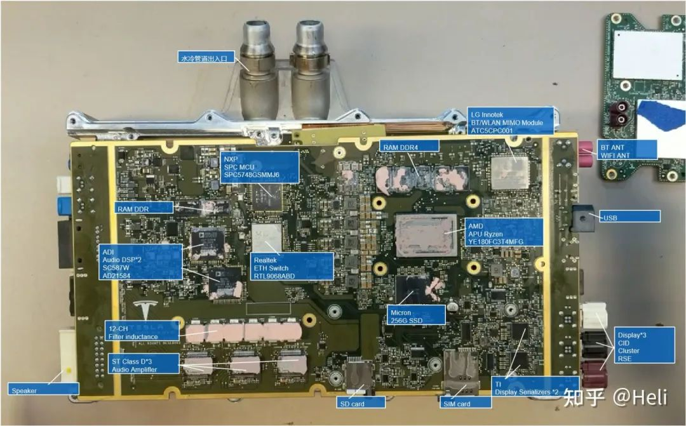

# 汽车网络安全系列 0x02 —— 底层逻辑

在国内，2020年、特别是2021年，整个汽车行业掀起了网络安全讨论的热潮。这主要是因为 WP.29 的道路车辆网络安全提案正式被UNECE所批准，形成了两个联合国法案：
- UN Regulation No. 155 - Cyber security and cyber security management system
- UN Regulation No. 156 - Software update and software update management system

以及法案参考的国际标准：
- ISO/SAE 21434 Road vehicles — cybersecurity engineering
- ISO/CD 24089: Road vehicles — Software update engineering

国内与车辆网络安全相关的国标也在日益完善，例如：
- GB/T 40855-2021	《电动汽车远程服务与管理系统信息安全技术要求及实验方法》
- GB/T 40856-2021	《车载信息交互系统信息安全技术要求及试验方法》
- GB/T 40857-2021	《汽车网关信息安全技术要求及试验方法》
- GB/T 40861-2021	《汽车信息安全通用技术要求》

国内政府监管方也在2020年和2021年连续发布了大量法规：
- 2020.11.23，《关于进一步加强汽车远程升级（OTA）技术召回监管的通知》
- 2021.04.07，《智能网联汽车生产企业及产品准入管理指南（试行）》征求意见稿
- 2021.04.28，《信息安全技术网联汽车采集数据的安全要求》标准草案
- 2021.05.12，《汽车数据安全管理若干规定》（征求意见稿）
- 2021.06.04，《关于汽车远程升级（OTA）技术召回备案的补充通知》
- 2021.06.10，《数据安全法》正式通过，2021.9.1开始施行。
- 2021.07.12，《网络产品安全漏洞管理规定》
- 2021.07.27，《智能网联汽车道路测试与示范应用管理规范（试行）》
- 2021.07.30，《关于加强智能网联汽车生产企业及产品准入管理的意见》
- 2021.08.16，《汽车数据安全管理若干规定（试行）》
- 2021.08.21，《个人信息保护法》正式通过，2021.11.1.开始施行。
- 2021.09.13，《关于开展汽车数据安全、网络安全自查工作的通知》
- 2021.09.15，《关于加强车联网网络安全和数据安全工作的通知》
- 2021.10.01，《汽车数据安全管理若干规定（试行）》
- 2021.10.29，《数据出境安全评估办法》（征求意见）
- 2021.11.14，《网络数据安全管理条例》（征求意见）

标准是推荐的，法规是强制的。从这些法规和标准中可以看出，世界范围的汽车网络安全热潮正加速到来。究其原因，一方面是网联化、智能化的汽车是高价值商品，消费者购买和使用时都十分关心其安全性；另一方面产品准入、市场监管和交通管理等政府部门对于可能影响公共安全的智能网联汽车也是格外关注。

工信部《关于加强智能网联汽车生产企业及产品准入管理的意见》中的描述如下：

>“为加强智能网联汽车生产企业及产品准入管理，维护公民生命、财产安全和公共安全，促进智能网联汽车产业健康可持续发展，根据《中华人民共和国道路交通安全法》《中华人民共和国网络安全法》《中华人民共和国数据安全法》《道路机动车辆生产企业及产品准入管理办法》等规定，提出以下意见.......加强汽车数据安全、网络安全、软件升级、功能安全和预期功能安全管理，保证产品质量和生产一致性，推动智能网联汽车产业高质量发展。

市监总局《关于进一步加强汽车远程升级（OTA）技术召回监管的通知》中也有类似描述：
>"随着汽车智能化、网联化技术发展，汽车远程升级（Over-The-Air，以下简称OTA）技术得到了广泛应用。为加强监管，规范OTA技术在召回工作中的应用，切实保障人民群众的人身财产安全......"

在行业媒体、政策、法务、商务等人士将汽车网络安全推向风口之后，作为技术人员该如何把握其实质？如何对现有体系、产品或在研方案有所作为，使产品或技术具有安全属性且富于弹性？

本文尝试对其进行分析，不当之处请大家给予指正。

## 代码量与漏洞数比翼双飞
从上世纪80年代到今天，各型 ECUs 陆续装车，通过 ECUs 增加车辆功能和性能的方式已经遇到瓶颈。如今的各型汽车在硬件配置上基本相同，软件开始成为汽车差异化和竞争的核心要素。行业内开始流行“软件定义汽车（SDV）”这个词。不少研究报告中都提到，一辆数字汽车的软件代码量会超过1亿行，而且一辆2025年生产的智能网联汽车代码量预计超过7亿行。虽然不知道这个预测是否可信，但汽车制造的技术壁垒已经从传统“发动机、变速传动、底盘三大件”以及零部件集成能力，转变为汽车软件的开发能力。根据 Berylls 咨询公司的预测，汽车软件市场规模在2020～2030年间，每年的增长率为13%，从760亿欧元增长到2520亿欧元。具体地，智能驾驶领域将占据汽车服务市场的最大份额，软件平台、安全以及集成测试验证也将有较高增长。

网络安全事件绝大多数由于攻击者利用漏洞而形成。汽车软件代码数量的增长也造成了漏洞数量的激增。漏洞是伴随软件代码共生的客观存在，这大致是因为代码是人写的，而人总会犯错。很多管理者认为开发者认真一点或管理严格一点就不会犯错不会有漏洞，但事实上无论人们如何努力都无法做到这一点，有些漏洞只是没有被发现或没有显示被利用罢了。软件代码的平均漏洞率为每千行代码一个漏洞，所以随着一辆2025年生产的智能网联汽车代码量预计超过7亿行，其漏洞数大致会达到70万个。

## 安全分析与加固的目标

### 网络安全一般目标

纵观国内外各行业，网络安全起步早、做得好的领域是传统IT网络，特别是IT网络关键基础设施保护领域。2017年国家《网络安全法》正式实施，其第二十一条规定，国家实行网络安全等级保护制度，网络运营者应当按照网络安全等级保护制度的要求，履行安全保护义务，保障网络免受干扰、破坏或者未经授权的访问，防止网络数据泄露或者被窃取、篡改。随后，公安部制定了一系列政策加强网络安全法的落实，其中影响最大的是2019年推出的“等保2.0”。

参考“等保2.0”的网络安全观和具体措施，实现对新技术、新应用安全保护对象和安全保护领域的全覆盖，更加突出技术思维和立体防范，注重全方位主动防御、动态防御、整体防护和精准防护，强化“一个中心，三重防护”的安全保护体系，把云计算、物联网、移动互联、工业控制系统、大数据等相关新技术新应用全部纳入保护范畴。

“一个中心，三重防护”的安全保护体系是指：
- 可信计算环境
  - 可信硬件
  - 可信操作系统
  - 可信基础软件
  - 可信的应用软件（如自动驾驶、无钥匙启动等）
  - 可信的第三方组件
- 可信通信网络
  - 可信的外部通信
  - 可信的车内通信
- 安全的边界防护
  - 内、外部网络的隔离/访问控制
  - 安全关键系统与舒适系统的隔离/访问控制
  - 安全的供应链，如外部网络服务

虽然说汽车是一个区别于传统IT网络的复杂系统，但网络安全的本质仍然相同，所以可以借鉴其思路来加强汽车网络安全防护或用于差缺补漏。

### 硬件系统
因为运行软件的基础是硬件，所以构建可信计算环境的基础是可信的硬件环境。现代汽车的电子电器（E/E）系统是硬件与软件的集成系统，它的主要构成有：ECUs、执行部件、传感器、输入设备（按钮、旋钮）、输出设备（显示屏、喇叭、报警器、音响）、数据线和电力线束、电池、发电机等等。汽车行业内常根据功能集群划分E/E域，例如：
- 车身域：通常包含防盗系统、门窗控制系统、座椅控制系统、雨刷系统、车灯系统等。
- 信息娱乐域：通常包含仪表盘（cockpit）、中控显示、Radio、多媒体支持系统、通信网络系统等。
- 底盘域：通常包括车辆动态安全相关的系统，如AES、ESP、ASC、DSC等等。
- 动力域：通常包含所有控制动力转换为驱动力的功能，例如发动机电控、变速箱标定、油泵、OBD等等。
- 被动安全域：通常包含防撞或者伤害转移等功能，例如安全带预紧，安全气囊等等

对于汽车网络安全技术人员而言，上述系统中与网络安全密切相关的是包含网络通信接口、软件的ECUs，其他部件不是主要关注点。ECUs中的核心关键是各种微控制芯片（MCU）。

汽车的电子电器（E/E）系统随着智能化需求而呈现一些变化：
- 核心器件的芯片 MCU 逐渐被 SoC 替代。SoC一般都是 CPU +（GPU+FPGA+ASIC）的系统级芯片，计算性能远超 MCU 芯片。
- 车载以太网将取代 CAN 成为车载干路通信网络，车内通信速度大幅提升。普通非屏蔽双绞线就可实现 100 Mbps，最高可达 1Gbps，这比 CANFD 的 5 Mbps 高级不少。
- 基于SOA理念开发的软件与硬件逐渐解耦，可以通过OTA升级不断提升车辆功能或性能。

目前，MCU 在很多ECUs中仍然占据中央控制器位置，支持汽车车身、底盘、动力、BMS、网关、T-Box等各项应用。相对于其他消费级工业电子元件，汽车电子元件需要面对更苛刻的外部工作环境，使用寿命要求更长，可靠性和安全性要求更高。所以很多厂商提出了车规级芯片，通常认为通过可靠性标准AEC-Q系列、功能安全标准ISO 26262 两项标准的可被称为“车规级芯片”。

以Tesla 车载信息娱乐系统中的MCU为例：
- 2012年v1.0 采用了 Nvidia 的 Tegra3。功耗20W，制程 40nm，内存 1GB DDR3，运算存储 8GB eMMC，GPU算力 12.4GFLOPS。
- 2018年v2.0 采用了 Intel Atom 3950（阿童木）。功耗12W，制程 14nm，内存 4GB DDR4，运算存储 8GB eMMC，GPU算力 12.4GFLOPS。
- 2021年v3.0，采用了 AMD Ryzen YE180FC3T4MFG、AMD Radeon 215-130000026。功耗45W+130W，制程 APU 12nm GPU 7nm，内存 8/16GB DDR4 8GB GDDR6，运算存储 256GB SSD，GPU算力 100TGFLOPS。首款搭载车型为 Model S Plaid。

下图所示的为 Tesla 2021年推出的 MCU v3.0 的中央处理模块电路板，这块电路板装在 Tesla Model S plaid 北美车型上。

通常在MCU上会提供下列安全功能：
- 支持通过安全网络通信在现场进行闪存固件更新的技术：
  - 可信安全IP（TSIP），提供了可靠的密钥管理、加密通信和篡改检测，以确保针对窃听、篡改和病毒等外部威胁提供强有力的保护。例如：Renesas的RX651微控制器。
  - 可信闪存区域保护
    - 双存储区闪存使设备制造商更容易安全可靠地执行现场固件更新。例如：Renesas的RX651微控制器。
- 硬件安全模块 (HSM)，基于硬件的信任根，以支持安全通信、OTA更新和安全引导。例如 STMicro的SPC58 Chorus系列32位汽车微控制器的HSM。
- 加密硬件加速器（例如对 AES、3DES、RSA、SHA 和TRNG 的硬件加速）
- 入侵检测和防御系统 (IDPS) 软件，监视控制器区域网络 (CAN) 总线并检测汽车设计中电子控制单元 (ECU) 的通信模式异常。

此外，有的厂商推出了辅助主MCU的安全MCU，通过I2C或单线接口链接，充当主MCU的安全协处理器，完成如密钥存储、加密加速等任务。例如：Microchip的ATECC608A安全元件，可以实现从安全引导到 OTA 验证，再到用于物联网和云服务身份验证的安全密钥存储和传输。架构如下图所示。

总体上包括的功能有：
- 加固存储区
- 密码计算引擎
- 真随机数生成器
- 单调计数器
- 唯一序列号
- 通信接口

另一个专门用于安全功能实现的低成本MCU是Microchip的SAM L11，可以保护功耗受限的物联网节点免受故障注入和边信道攻击等威胁的影响。该器件通过模块化GUI抽象出低级安全细节，使开发人员可以选择相关的安全功能，从而简化嵌入式安全功能实现。SAM L11抽象出的安全功能包括第三方配置服务。该器件还集成了Arm的TrustZone技术，这种技术隔离了微控制器内的安全代码和非安全代码。此外，SAM L11还简化了与Amazon Web Services (AWS) 等云服务连接时物联网节点的安全需求。

Arm的TrustZone环境（图5）将任务关键代码和协议栈与复杂的操作系统 (OS) 软件和大型代码库分开，从而防止固件后门进入安全密钥存储区。该环境创建了多个软件安全域，以限制对微控制器内部特定内存、外设和 I/O 组件的访问。

> ISO 26262 中提到了安全措施（safety measure）和安全机制（safety mechanism）两个概念：
> Safety Measure: activity or technical solution to avoid or control systematic failures and to detect random hardware failures or control random hardware failures, or mitigate their harmful effects.
> Safety mechanism: technical solution implemented by E/E functions or elements, or by other techonologies, to detect faults or control failures in order to achieve or maintain a safe state.

大多我们提到的MCU安全机制是ISO 26262 中的Safety mechanism，用于防治失效时间导致单点故障或减少残余故障，并防止故障潜伏。虽然与网络安全（cyber secuirty）定义不同，但可以相互补充。因为网络安全漏洞可能引发mcu原有安全机制失效。支持功能安全应用的MCU，一般都提供了诸多安全机制，例如下列类型：
- 1.ECC：Error Checking and Correcting，是面向RAM/Flash的错误检查和纠正技术。
  - 在奇偶校验（Parity）基础上的错误校验技术。在每一字节（8位）外又额外增加了一位用来进行错误检测。
  - ECC与Parity不同的是如果数据位是8位，则需要增加5位来进行ECC错误检查和纠正，数据位每增加一倍，ECC只增加一位检验位，也就是说当数据位为16位时ECC位为6位，32位时ECC位为7位，数据位为64位时ECC位为8位，依此类推，数据位每增加一倍，ECC位只增加一位。

- 2.Lockstep 锁步核校验：面向芯片core
  - 主核和检查核都可以从XBAR和缓存阵列读数据
  - 只有主核对XBAR和缓存阵列进行写操作
  - 主核和检查核都可对缓冲控制读写数据
  - 主核的输出会送到XBAR和RCCU
  - 检查核的输出只能送到RCCU
  - 检查核位于安全域，物理上与主核隔离

下图为Lockstep 锁步核校验的基本架构图：

- 3.Watchdog：针对时钟的监控
- 4.CMU：监控电池电压，正常值范围内进入安全状态。
- 5.BIST：针对安全机制或寄存器安全
  - 用于安全机制失效检查。BIST一般在MCU上电后自测，通过后才能正常上电。
- 6.通信帧计数器
  - Frame counter 是在多帧传输中为了防止桢丢失或者帧错乱通过应用层软件对报文进行的编码或加密，这种安全机制可认为是纯软件的安全机制。一般有用户定义的软件实现。
- 7.ADC自测
  - 测试通道可获取参考电压与带隙基准电压的比值，正常情况下，这个比值应该是一个预期中的固定常量，当参考电压有波动或者带隙电压失效后，通过该自测试可及时发现问题，提示用户ADC转换数据已经不可信。假设安全目标的故障容错时间为100ms，那么建议用户必须在100ms以内至少启用一次芯片提供的ADC Self Test，以保证在Delta Time =100ms 时间内，ADC均可认为在正常工作。

安全机制需要在故障容错时间内，检测故障控制失效影响，维持系统的安全状态。安全机制的设计与使用必须考虑故障容错时间。目前MCU安全目标对应的故障容错时间一般为10ms，用户在使用功能安全MCU时一定要考虑这个时间，并且零部件产品级的故障容错时间需要大于MCU的FTTI。如果某条安全机制不能在系统故障容错时间之内检测到失效事件及影响，这也是没有意义的安全机制，对用户的功能安全开发无实际帮助。

### 软件系统
目前主流的汽车软件架构是3层的：
- 上层：应用软件层
  - 包括：智能座舱 HMI、ADAS/AD 应用、网联应用等等。
- 中层：功能软件层
  - 包括：库组件、中间件（例如 AutoSar的RTE、分布式通信）等等。
- 下层：系统软件层
  - 包括：虚拟机 Hypervisor、OS内核、板级支持包BSP等等。
  - BSP中包含硬件相关代码，主要有：Bootloader、HAL代码、驱动程序、配置文档。

#### 操作系统
参考 ICT 软件的发展历程，汽车软件极有可能在经历一段时间的“百花齐放、烟囱林立”之后，逐步被几型OS、中间件、关键应用所整合替代。汽车操作系统是底层软件中至关重要的核心，目前看可以分为下列类型：
- 通用型OS：例如 QNX、Linux、Android、WinCE等等
- 定制型OS：定制OS通常是在通用型OS基础上定制而成，例如 大众的VW.OS、特斯拉的Version、Google的车载Android、华为的鸿蒙OS、阿里的AliOS。
- ROM型OS：此类OS是基于Android或Linux的定制OS，通常不涉及内核更改，仅修改应用软件。由于定制简单、成本低被大多数车企采用。
- 超级APP：不是完整的汽车OS，是借助手机的丰富功能映射到汽车中控，满足娱乐需求，例如 Apple CarPlay、百度的Carlife，华为的Hicar等。

长期看，QNX、Linux、Android 三类基础OS是汽车OS的主要方向。目前QNX在嵌入式OS的市场占有率为第一，但 Android 的市场比重在不断提升，主要原因是Android对移动互联应用的支持最好，且开源、灵活、生态丰富，特别适合安全性要求较小的车载娱乐信息。由于操作系统是汽车软件生态的关键，所以主要车企都在积极布局OS。自研操作系统有助于简化车辆软件开发流程及增加 OTA 频率。以特斯拉为例，由于采用开源 Linux 自研操作系统，特斯拉可以不再依赖于软件供应商，而是自己完全掌握堆栈，一旦发现问题即可通过 OTA 进行快速修正与升级，提升用户体验。此外，自研操作系统而后向产业链企业开放车辆编程，可以掌握开发者生态资源，形成一 定垄断优势。有了操作系统就可以建立生态垄断，对上层各组成部分和应用进行全面的把控。例如德国大众自研 VW.OS，依托自身近千万辆汽车年销量，迫使 Tier1 以及软件供应商甚至其他 OEM 在 VW.OS 的基础上进行开发，最终形成“OS 授权许可费 + 车联网服务 + APP 对接许可费 + APP 增值服务分成”的商业模式，获得超额利润。

|车企或第三方|操作系统|基础OS|合作方|简介|
|-|-|-|-|-|
|大众|VW.OS|-||统一并简化全车控制单元，构成品牌生态系统|
|戴姆勒|MB.OS|Linux||供电动车使用|
|吉利|GKUI|Android||智能交互系统，有丰富应用，与阿里云/google云合作的全球云平台|
|长城|Hi-Life|小度OS|||
|比亚迪|DiLink|Android|||
|特斯拉|Version|Linux4.4||支持PyTorch深度学习、基于Kafka开源实时数据处理平台，可支持车载信息系统和高级辅助自动驾驶|
|蔚来|NIO OS|Android||支持自动辅助驾驶、数字座舱、智能互联等|
|小鹏|Xmart OS|Android||具备远程控制、AI智能及V2X功能、Xpilot支持高级辅助自动驾驶|
|理想|Li OS|-||驾驶包括整车控制、自动驾驶功能|
|威马|Liviing Engine|Android|||
|斑马智行|AliOS|Linux宏内核、Alios RTOS 微内核|上汽荣威、名爵，东风神龙|多核异构分布式，面向多端口、多场景，介入阿里巴巴生态|
|百度|小度OS|-||提供从底层到云端的完整体系，开放HM、应用层、OTA、TSP账号，满足从语音交互到视觉的完整自然交互|
|梧桐车联（腾讯）|TiNNOVE OpenOS|Android||功能模块化|
|华为|Harmony OS|-|沃尔沃、长安、吉利、东风、广汽传祺、比亚迪|全场景内核的分布式OS，分为内核层、系统服务层、框架层、应用层。鸿蒙座舱系统HOS，智能车控系统VOS，智能驾驶系统AOS，支持通过跨域集成软件框架Vehicle Stack 进行控制管理|
|国汽智控|ICVOS|-||实现硬件和应用的解耦，支持异构和弹性扩展芯片硬件平台|
|仙豆智能|Fun-Life|Android||||
|亿咖通|GKUI|Android||||

在操作系统这个大的概念里，通常包含着板级支持包（BSP）这个子概念。主要构成有Bootloader、HALs、Drivers、Configures。硬件相关的部分一般会封装在BSP中。BSP对于不同的OS有不同形式的实现，与硬件芯片架构也密切相关，所以理解BSP的实现需要对芯片架构十分熟悉，例如高通、瑞萨、TI、NXP、Nvidia等芯片的架构，但由于很多芯片资料在NDA保护之下，所以理解BSP的实现并不容易。

为了发挥不同OS的特性，所以一些工作场景需要让不同类型的OS运行在同一硬件平台上，这时虚拟化（Hypervisor）技术就显的比较重要了。车载的Hypervisor需要以下3个技术点：
- 严格隔离的分区和资源分配
- 灵活高效的实时和非实时任务调度
- 虚拟机间的进程间通信（IPC over hypervisos）

当前主流的虚拟化技术提供商为 QNX 和 ACRN，对比如下：

|Hypervisor 产品|研发机构|应用情况|特性|
|-|-|-|-|
|QNX hypervisor| RIM|斯巴鲁力狮、傲虎、路虎卫士、广汽埃安LX、中科创达、诚迈科技、光庭信息|闭源、入门费21万美元、唯一ASIL-D级OS hypervisor|
|ACRN|Intel与Linux Foundation|奇瑞星途、长城F7、红旗|免费、开源|
|XEN|Mobica|||
|COQOS|松下Open Synergy|||
|L4RE|德国大陆|||
|VOSySmonitor|法国VOSyS|||

#### 中间件

汽车软件中还有一个关键组成，就是中间件。它为上层应用提供了数据传输、应用调度、系统集成、流程管理等功能，大大提升了应用软件的开发效率。经典的中间件开发设计标准有大家熟悉的 AUTOSAR、OSEK/VDX等等。AUTOSAR 规定了分层架构、方法论和应用接口规范，使得汽车嵌入式系统控制软件开发者，得以在 ECU 软件开发与验证过程中，摆脱对硬件系统的依赖，实现了软硬件的分离。AUTOSAR 整个架构从上到下分为4层，每层之间为保持独立性，每一层只能调用下一层的接口，并为其上一层提供接口。从上到下分为4层依次为：
- 应用层（Application Software Layer），本层实现执行器控制。
- 运行时环境（Runtime Environment，RTE）
- 基础软件层（Basic Software Layer，BSW）
- 微控制器（Microcontroller）

AUTOSAR 分为 Classic Platform 和 Adaptive Platform 两大平台，其中 Classic Platform 主要面向分布式 ECU，Adaptive AUTOSAR 主要面向更复杂的域控制器和中央计算平台的电子电气架构。相比于 Classic AUTOSAR ，Adaptive AUTOSAR 的优势在于：实时性强、操作系统移植性高以及软件升级更灵活。

AUTOSAR 是传统头部车企制定的规范，目前已有超 300 家生态伙伴加盟，但是能完整开发基于 AUTOSAR 架构底层协议栈的公司极少，目前全球知名的 AUTOSAR 解决方案厂商包括：ETAS（博世）、EB（Continental）、 Mentor Graphics（Siemens）、Wind River（TPG Capital），以及 Vector、KPIT（美印合资）等，大部分 Tier 1 和主机厂都需要向这些供应商购买底层软件。在国内，Classic AUTOSAR 标准下的开发工具链及基础软件被上述国外供应商垄断，国内供应商有：东软睿驰、华为、经纬恒润等。Adaptive AUTOSAR 方面，仍处于起步阶段，大陆 EB 与和大众合作将 AP AUTOSAR 和 SOA 平台应用于大众 MEB 平台 ID 系列纯电动车型上。国内厂商纷纷将 AP AUTOSAR 作为发力重点，推出相应的 中间件及其工具链产品，抢占市场先机。

||AUTOSAR CP |AUTOSAR AP|
|-|-|-|
|开发语言|C|C++|
|适用场景|传统ECU|自动驾驶|
|应用架构|面向信号|SOA|
|升级性|不易升级|灵活在线升级|
|安全等级|最高ASIL-D|ASIL-B～ASIL-D|
|实时方式|硬实时|软实时|
|主要通信|CAN、LIN|以太网|
|操作系统|AUTOSAR OS（OSEK OS）|POSIX OS（Linux、QNX）|

AUTOSAR要求开发人员严格按标准编写代码。分布式情况下，会造成代码量成倍增加，开发成本很高；域集中模式下，也无法减少代码量。因此，特斯拉没有采用AUTOSAR 规范，而是采用自研OS和基础软件实现更高效的开发。在国内，2020年7月，一汽、上汽、广汽、蔚来、吉利、长城、长安、北汽福田、东 风、一汽解放、小鹏汽车、东软睿驰、恒润、拿森、地平线、苏州挚途、万向钱潮、威迈斯、重塑、中汽创智这 20 家企业组成中国汽车基础软件生态委员会 （AUTOSEMO），旨在形成由本土企业主导具有自主知识产权的基础软件架构标准和接口规范，共享知识成果，建立产业生态。

AUTOSAR 提供的安全机制有：
- 存储分区
- 计时监控
- 逻辑监视
- End2End 保护

用户需要在此基础上进行二次开发，加入更多的安全机制才能符合功能安全要求。

安全部署架构
安全需要一个整体的方法，触及设备架构、系统设计、生产、部署和生命周期管理的每个部分。只有通过整个供应链的参与者的一致性，才有可能产生安全的解决方案。

Secure Deploy 架构旨在增强和简化产品创建、制造和管理的整个生命周期的安全实施。这使组织能够建立在安全的基础上，以在其产品的整个生命周期内保护其知识产权。

功能：

从创建的那一刻起保护知识产权
OEM 密钥委托和签名
在生产和现场抑制恶意软件注入
全球控制高价值知识产权以抑制克隆和假冒
恶劣环境中的安全编程
确保全球利益相关者之间的关键基础设施流动
OEM 密钥和数据主权
对现有生产流程的影响最小
受限设备的安全更新和修补
提供安全即服务