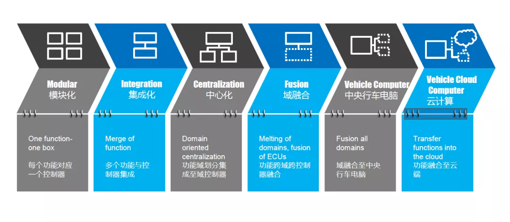
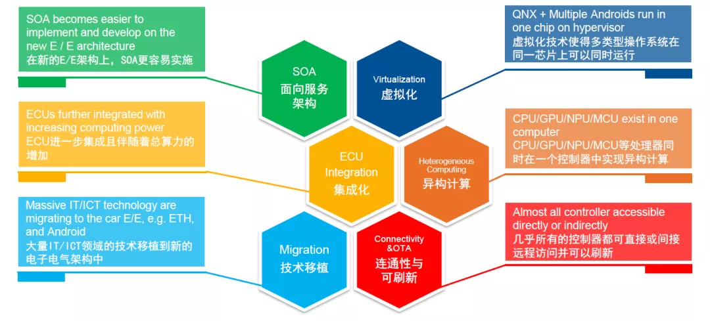
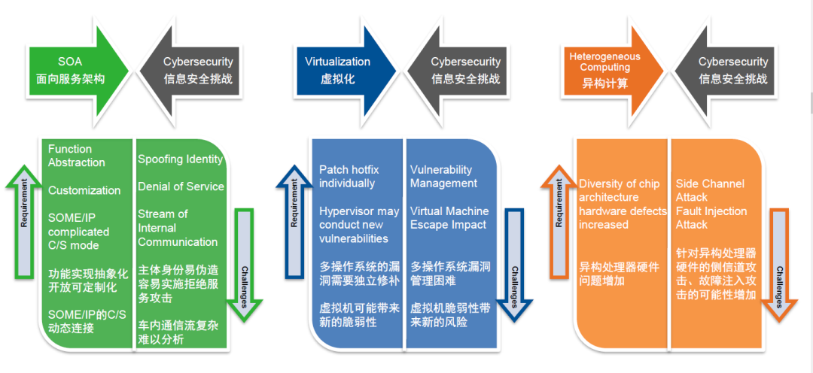
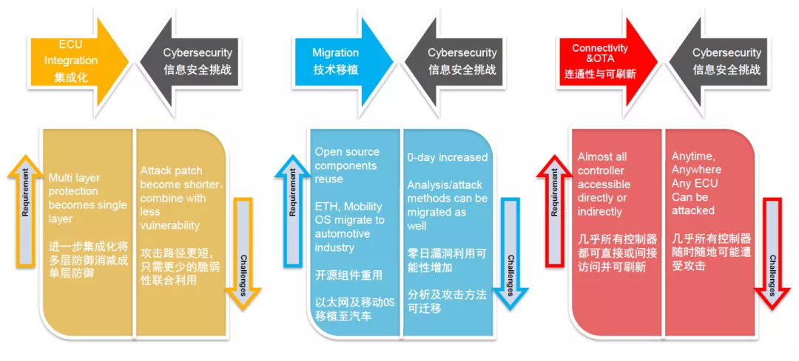
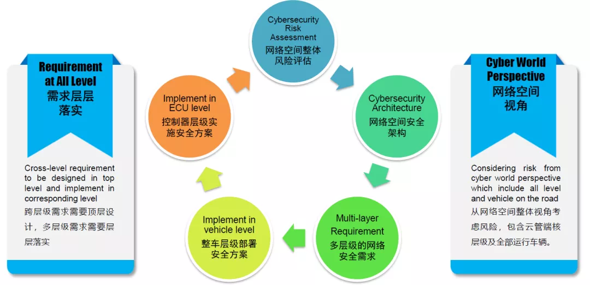
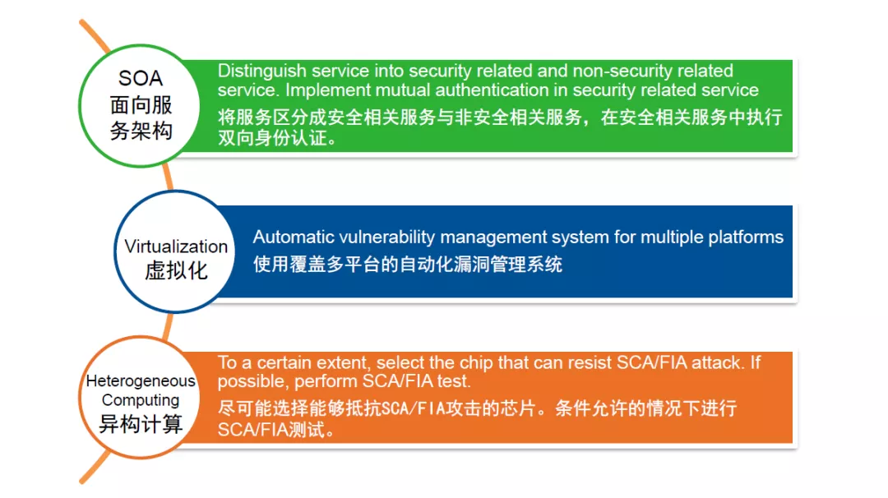
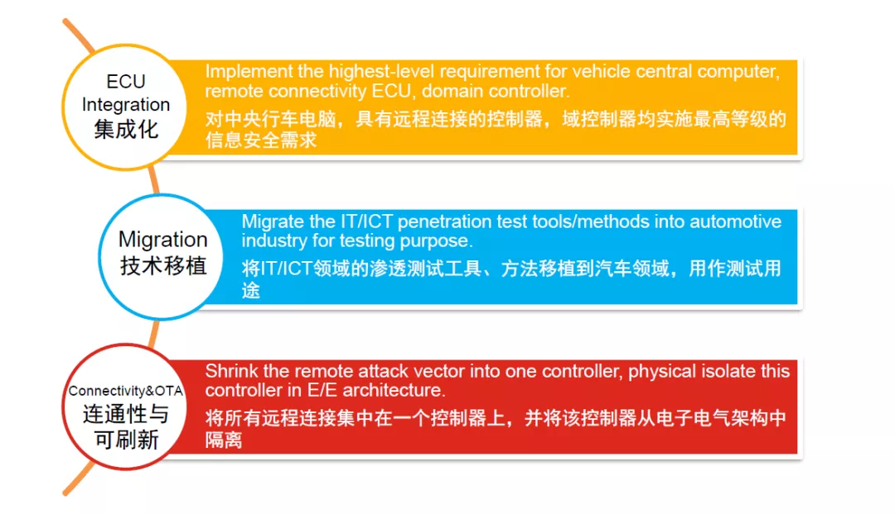
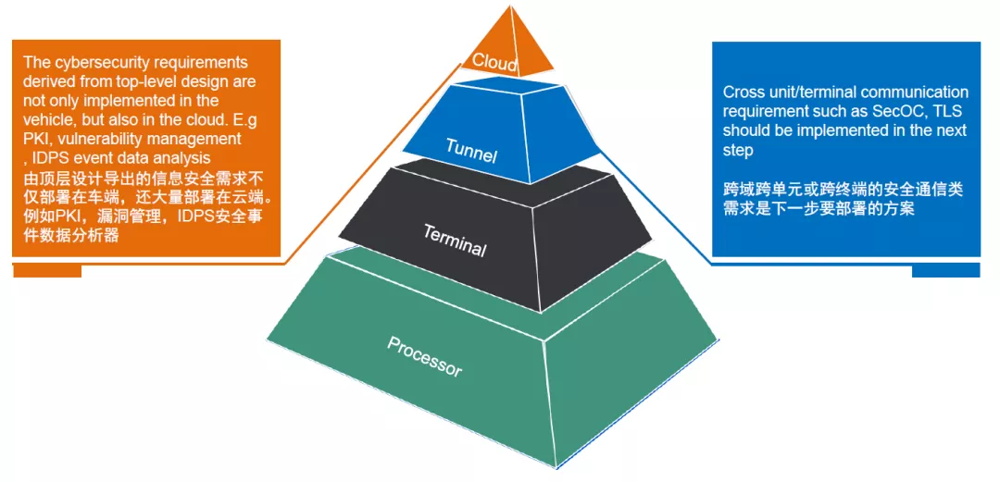
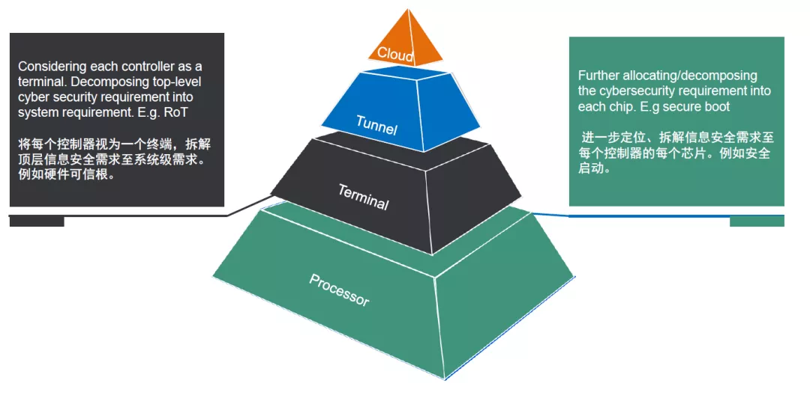
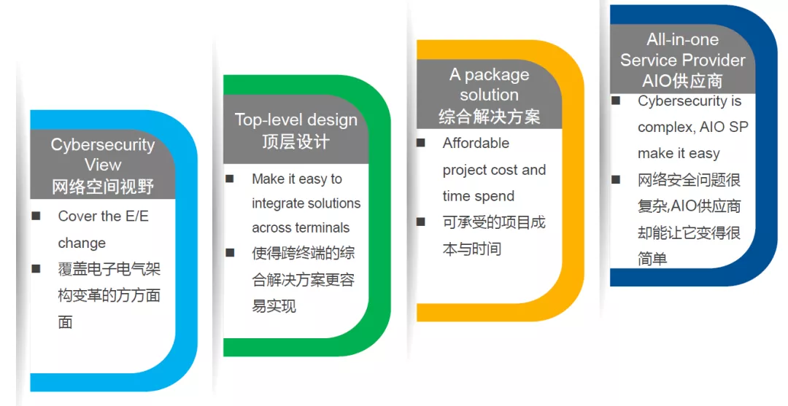

# 汽车电器架构信息安全

图中是其中一种对于电子电气架构演进路线的总结。一共分为六个阶段。
- 第一阶段是模块化的架构，每个功能对应一个控制器，我们可以称之为模块化阶段。
- 第二阶段是多个功能集成至一个控制器，但是本质上只是多合一的功能集成形式，这个阶段叫做集成化阶段。
- 第三阶段是将功能按照域进行划分，例如底盘域、动力域与智驾域，此时部分域中的功能由一个在中心的域控制器实现大部分控制功能，例如域控制器，这个阶段叫做中心化。
- 第四阶段会有部分功能跨域进行融合，此时某个功能很可能是跨域来实现的，从功能本身来举例，全车OTA功能就是明显的例子，这个阶段叫做域融合阶段。
- 第五阶段是当域融合到一定程度后，大部分控制器的功能都集成到了一个中央行车电脑里面，并且全车大部分算力也都集中在这个控制器里，外围只剩下传感器及执行器，这个阶段我们可以称之为中央行车电脑的阶段。
- 第六阶段是当中央行车电脑的功能与运算任务，部分由云端实现的架构，这个阶段是云计算的阶段。

从市场上很多公开的信息来看，大部分车型都处在第三、第四阶段，有少数在研新车型已经行进到了第五阶段，也有处于两个阶段之间的在研车型，因此并不能简单的将某款车型的电子电气架构认为完全是处在某个阶段。并且单从功能层面来讲，甚至部分功能已经是主要由云计算来实现了，而电子电气架构却还在第三阶段。

电子电气架构演进特点：
- SOA
- 虚拟化
- ECU 集成化
- 异构计算
- 技术移植
- 连通性与可刷新

那么电子电气架构的演进有什么样的特点，我们通过这张图来展示。最近软件定义汽车的话题很火，并且也已经有部分OEM在研新车型已经使用了SOA架构及开发模式。一方面是新技术的诞生与需求的变化导致电子电气架构加速演进，另一方面电子电气架构的演进反过来给SOA的部署带来了很大的便利。因此我们可以认为电子电气架构带来的第一个新事物就是SOA。
同时，高级别自动驾驶，智能座舱等热门功能对总算力的需求进一步增加，在电子电气架构上也可以明显的看到为了满足高算力的需求，分布在E/E架构中的各个控制器的集成程度进一步提升，这个也带来了集成化的趋势。除此之外，在原先IT/ICT领域的成熟技术也在大量移植到汽车工业中。例如以太网和安卓，以及在这之上的各种协议和应用，其中以太网的应用对电子电气架构及网络拓扑带来了非常深远的影响，技术移植过来就用，也是一个比较大的特点。
集中化带来了算力集中，而算力集中了之后，需要能够有效利用算力去实现不同场景的业务需求，在这个背景之下，虚拟化技术也得到了应用，使得多个类型的操作系统运行在同一芯片上。除此之外，虽然算力分布是在继续集中，但是业务场景与计算能力的多样化却在继续，在同一个控制器里面集成CPU/GPU/NPU/MCU等异构处理器处理复杂任务和场景的情况却越来越普遍。最后一个我们识别到的特点，就是现在几乎所有的新车型都是联网的，而且还有近场端通信，加上全车OTA刷新也在推广，这样我们可以看到的是，几乎所有控制器都可直接或者间接远程访问并可以刷新。
以上是我们在E/E架构演进中观察到的，那么这些特点和变化对信息安全有会有什么样的影响，会带来什么样的挑战呢？

## 电子电气架构演进带来的相关的信息安全挑战

- SOA vs Security
  - SOME/IP 复杂的C/S模式，使内部通信流复杂难以分析
  - 功能抽象开发可定制，可能存在身份伪造

- 虚拟化 vs Security
  - 多操作系统的漏洞需要独立修补
  - 管理困难
  - 虚拟机可能带来新的脆弱性 
- 异构计算 vs 信息安全挑战
  - 异构处理器硬件问题增加
  - 针对异构处理器的侧信道攻击、故障注入攻击的可能性增加。

如何应对新的挑战

第一个观点，我们要具备全网络空间视角。这里指的是，在评估风险的时候，将云管端核，以及所有已售出在运行的同类型车辆当作一个整体来考虑。而要做到这样，其实对人的能力要求非常之高。

第二个观点，就是我们可以将网络空间粗略分成云管端核四个层级，我们在导出信息安全需求的时候会发现，有很多需求跨了多个层级，要实现相应的设计工作，需要有一个顶层视角开展顶层设计，最后将需求层层落实。

我将如何应对E/E架构演进带来的挑战归纳为以下5个步骤：

第一步，将全网络空间当作整体进行分析评估，这里的方法论使用ISO21434。

第二步，在该网络空间中构建安全架构覆盖可能产生风险的方方面面。

第三步，将导出的安全需求分层布置，跨层跨终端的需求从顶层设计，部分部署在云端，路端的需求在这个层级就已经可以落地了。

第四步，将拆解到整车的信息安全需求分解到整车，此时整车会被视为一个终端。

第五步，将需求进一步分解到控制器层级，最后在控制器层级实施落地。以上是在应对新挑战时，应该关注的2个要点以及5个步骤。

在整车级怎么部署呢？首先还是将需求分层，我们从顶层视角看的时候，会发现有大量的需求是部署在云端和管端的，而且在云端部署的这些需求，大多都是跨层级跨终端的需求。例如PKI, 漏洞管理系统，IDPS在云端的安全日志分析器等等。然后下一步就是将远程通信，近场端通信，车内通信的通信协议及安全措施定下来。比如TLS和SecOC。而制定通信协议类的需求，也是需要从整体考虑的。你会发现信任链和TEE的建立，会一直从芯片内核的HSM一直延伸到云端。

