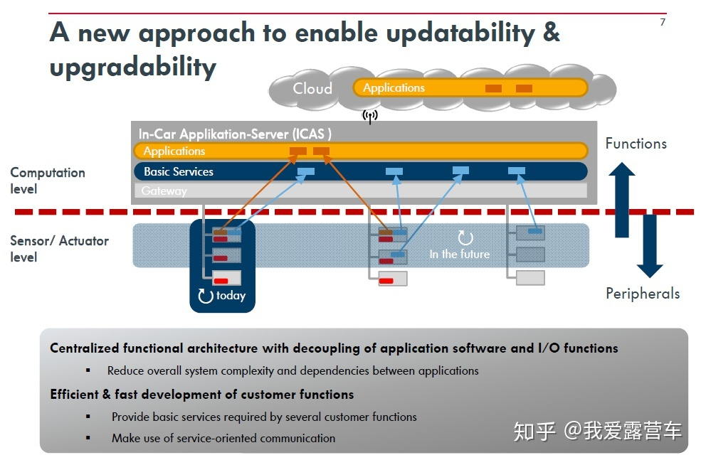

# 汽车电器网络架构

- 昨天：
  - 众多小的ECU执行单一特定功能
  - 基于信号的通信
  - 后来使用中央网关实现跨域通信
  - 引入了网关上的CAN防火墙
- 今天
  - EE架构支持安全特性
  - 面向服务的通信被应用，高性能的ECUs
  - cyclic 消息仍在使用
- 未来
  - 使用基于ring的网络来实现冗余
  - 引入了车载计算机（使用了安全增强高性能微控制器）

## 综述
随着汽车新四化的推进，汽车技术正在从控制模式、能源形式、使用场景和商业应用等方面实现全面的革新，智能汽车的电子电气架构正从分布式走向集中式。为了提高汽车智能化、舒适度以及车辆安全性，更多的传感器、控制器、执行器等电子模块被引入车内，这也使得车内网络架构愈发复杂，对通信连接技术的要求越来越高，原有的电子电气架构也趋于饱和，已经不能满足新四化发展的要求。

对于未来汽车电子架构来说，垂直融合将取代分布协同成为趋势。同时，软件定义的需求正呼之欲出，汽车亟待从机械化到电子化的华丽转身，这些都要求汽车电子电气架构做出变革：提升效率，降低复杂度—不论是硬件制造的复杂度，还是软件开发的复杂度。

新型车载高速网络技术和5G无线技术的引入，已使这一融合变为部分现实。如果网络带宽足够宽，延迟足够低，这一趋势将会更加明显：算力向中央集中、向云端集中，汽车电子电气架构的演进也正朝着这个方向进行。

在域控制器的体系架构之下，各个功能部件均成为独立的域，在每个域之下有相应的控制功能集合。域与域之间可以做到安全隔离，也可以根据需求进行通信和互操作，形成类似以太网总线上的计算机局域网，变成了松散耦合的架构。

### 什么是汽车电子电气架构？
电子电气架构：EEA，Electrical/Electronic Architecture

根据百度百科的解释：“汽车电子电气架构是集合了汽车的电子电气系统原理设计、中央电器盒设计、连接器设计、电子电气分配系统等设计为一体的整车电子电气解决方案”的概念，由德尔福(DELPHI)首先提出。具体就是在功能需求、法规和设计要求等特定约束下，通过对功能、性能、成本和装配等各方面进行分析，将动力总成、传动系统、信息娱乐系统等信息转化为实际的电源分配的物理布局、信号网络、数据网络、诊断、电源管理等电子电气解决方案。

EEA的开发包括需求定义、逻辑功能架构设计、软件/服务架构设计、硬件架构设计、线束设计等不同层面的开发活动，如图2和图3。

### 电子电气架构演进的根本驱动力（Motviation）是什么？

人类生产生活重心的转移与客户预期的改变

随着移动互联网在消费者生活领域的广泛渗透，人们的生活习惯和价值取向开始转移。伴随互联网尤其是移动互联网的飞速发展，人类的生产生活重心逐步转移至虚拟的赛博空间(Cyberspace)中。尤其是2007年苹果创造出智能手机这种便携化的智能终端后，不论是网上购物、网上娱乐、网络社交、移动支付、网络咨询，还是在线政务、线上办公、在线教育等生产生活活动，都在逐步地向赛博空间转移。未来还将有更多的老百姓被转化为网民，并更多地“生活”在赛博空间中。

人类生产生活逐步向赛博空间转移的过程中，也会对PC、平板电脑、手机或其他智能终端等消费电子产品的使用习惯和喜好向其他人类生产生活工具上转移。一旦其他工具具备了PC、平板或手机相应特征，就会形成市场需求，因为人类又多了一种智能终端能够与赛博空间进行连接，熟悉的、便利的互联网应用又可以在新工具和设备上运行，方便了生活，提高了生产效率。

汽车的驾驶自动化(Drving Automatization)趋势在很久很久以前就已经产生了。了解下Global OEM的Demo项目，甚至上知网搜索下相关论文，就会发现ADAS是多么古老的一种技术了，远远早于近几年的人工智能热潮。但是，随着特斯拉Model S、Model X等一系列车型的推出，使人们对汽车智能化(Intelligence)有了新的期待。仔细品一下Automatization和Intelligence这两个单词的含义，个人认为还是Intelligence含义更丰富。因此，汽车智能化，不仅包括了驾驶自动化，也包括智能网联、智能交互（以及后续的智能座舱）等数字化和信息化趋势。

也因为特斯拉等新玩家的创新性车型的推出，人们开始对汽车有了以下这种强烈的预期（图4），即智能汽车。所谓的智能汽车，基本是要对标着手机、PC这种数字化/信息化的半导体设备去了。

既然老百姓的需求是“智能汽车”，那么具备“智能汽车”特征的车型就会有更多市场需求，客户也更加愿意买单。那么表征智能汽车的核心智能化功能都有哪些呢？按照汽车智能化的趋势（即CASE，Connected互联、Autonomous自动、Sharing共享、Electric电动），智能驾驶、智能座舱、智能网联应该就是终端用户期待的功能。以上的这些功能，相对于曾经汽车电子的功能，复杂度有很大提升。为了实现以上复杂功能，我们需要软件的SOA架构，我们需要基于服务的通信，我们需要满足车规的RTOS（实时操作系统），我们需要FOTA（固件空中升级），总之，我们需要一台软硬件解耦的、能够用“软件来定义功能”的汽车。这就需要一个大大的前提——集中化的EEA。这又是为什么呢？

先进行粗略分析。首先，看看当前的整车EEA现状：a) 电子单元：众多分散的运算&控制单元；b) 电气单元：发动机、伺服电机、电磁阀等; c) 执行机构：机械、液压、气门机构... 也就是说，当前的汽车只是一台相对精密的机电一体化设备（Mechatronics，隶属于控制工程范畴，还需进一步电气化），而非数字化/信息化的半导体设备（ICT范畴），距离智能手机有些遥远。但是消费者目前想要的是一台像手机一样的车（智能终端、电子设备）。究竟如何才能使汽车朝向一台大型的“电子”设备转型呢？答案是继续提高电气化程度，即电子电气架构从分布式向集中式发展，直到形成真正的车载中央计算机。

接下来，分为两个具体维度进行分析：

#### 整车设计/制造维度

从整车的设计/制造维度讲，若汽车继续按照当前的分布式架构发展，且不说算力是否满足，单就车辆物理安装空间上讲就有问题。可能会导致难以布置更多ECU和更多线束；更多的ECU和更多的线束，势必导致组装困难，只能继续依靠人工。伊隆马斯克也曾为过度依赖自动化产线而焦头烂额，之后也曾发誓要对汽车进行“线束革命”，说明过多复杂线束和过多ECU的安装会严重影响产线的高度自动化。而集中式电子电气架构，能够逐步平抑ECU和线束的增长趋势，甚至到达某个时间节点之后，能够促进大幅减少ECU和线束用量，降低EEA网络拓的扑复杂度。倘若确实能够减少ECU数量和线束用量，也就能够降低电子电气系统的重量，对整车的轻量化设计目标也有帮助。

电子电气架构的集中化，就意味着单个ECU的“扩容”，以及多个ECU的“合并”。换句话说，ECU要越来越大型化，算力要高，功耗/成本还都需要进行控制。结论是什么？需要大型的、高算力的、制程小的（意味着低功耗）车载SOC芯片。为什么要用SOC芯片？因为通过堆大量算力低的芯片做控制器不可行；芯片多，集成度低，PCB板以及域控制器太大不好布置（想象一下Demo车的后备箱塞满工控机的场景），功耗和成本也高。总之，集成化程度高是刚需，SOC芯片又能够较好的解决这个问题。各个芯片玩家疯狂扩大SOC规模（从英伟达Xavier和ORIN，到特斯拉FSD芯片，甚至Mobileye提供EyeQ5的开放方案），也是为了解决这个痛点。所谓“规模”，实质是指算力，DMIPS/TFLOPS/TOPS都要足够高。

有了强大而“趁手”的芯片，就能“攒”出来满足集中化要求的ECU了。不管是叫DCU（域控制器），还是HPC（高性能计算机），甚至是VCC（车载中央计算机），也不过是表征一下ECU有多大规模。

综上论述，从整车维度讲，大型SOC芯片（以及基于大型SOC芯片构建的大型域控制器/高性能计算机）和先进线束都是集中化EEA的关键基础技术。

2.2.2 价格/成本维度

不管是什么产品，到了只拼价格/成本的竞赛，基本意味着没有太大创新了。因为创新是有代价的，创新是很“贵”的一件事，因此我相信集中化EEA也会遵循发展的常识。最开始是功能导向，为了实现某些关键功能的落地而不惜代价，价格/因素会较少考虑；然后是性价比导向，关键功能实现了，为了体现性价比，就会把手伸到“别人的地盘”，即几个大型ECU通过吸收其他专用小型ECU的功能（把小型ECU从车上干掉，平抑整个系统的成本），通过集成更多功能来保持“虽然贵，但是功能也强大”的性价比优势；最后是成本导向，大型ECU的功能scope确定了、“扩张边界”也确定了，就得比价格/成本了。然后不停的往复循环以上逻辑。

当前的智能驾驶域，在L0-L2已经相对成熟，因为该级别的各个ADAS功能相对确定，因此边界已经清晰了，那么开始打“性价比”牌和赤裸裸的“价格”牌也就不奇怪了。而L2+到L3还在比拼功能落地，那么价格因素就可以适当妥协（当然不能无限妥协，毕竟做产品归根结底是做生意，钱永远是最重要的）。

总之，若把智能驾驶、智能座舱的复杂功能作为必定要实现的“既定事实”看的话，集中化EEA还是“省钱”的。因为，即便假设分布式EEA从技术角度能够实现复杂功能，成本也会非常高。

以上，也可以回答作者作为一个做量产ADAS/AD的技术人员，为什么要关注整车电子电气架构演进的原因。因为关注EEA的进化，实质是关注前装量产高级别自动驾驶功能的落地节奏，以及汽车数字化、软件化的推进节奏！
### 通过何种方式达到集中化EEA，如何发展（Roadmap）？

根据下图的描述，一般EEA从分布式到中央集中式需要经历三个阶段，即分布式-域集中-中央集中。

### 什么算是集中式的EEA？有哪些常见类型？

#### 三域EEA（域集中式EEA）

三域，顾名思义，是指车辆控制域、智能驾驶域和智能座舱域。

其中，车辆控制域基本将原动力域、底盘域和车身域等传统车辆域进行了整合（整合更多是系统层面的概念，并不一定是硬件层面合并，因此并不是说这个域中其他ECU就不存在，或者就减少了）；

智能驾驶域和智能座舱域则专注实现汽车的智能化和网联化。

涉及的零部件主要有4类:
- 车控域控制器（VDC，Vehicle Domain Controller）
- 智能驾驶域控制器（ADC，ADAS\AD Domain Controller）
- 智能座舱域控制器（CDC，Cockpit Domain Controller）
- 若干高性能网关

其中：
- VDC作为Private DCU，负责整车控制，实时性安全性要求高；
- ADC作为Public DCU，负责自动驾驶相关感知、规划、决策相关功能的实现；
- CDC作为Public DCU，负责HMI交互和智能座舱相关（甚至整合T-Box）功能的实现；

三域EEA算是非常彻底的域集中式EEA。

三域EEA常见的实践包括：

##### 大众MEB平台的E3架构

大众的MEB平台（首款车ID3）的E3架构，即由3个车辆应用服务器（ICAS，即In-Car Application Server）组成的域集中式EEA，具体包括：车辆控制服务器ICAS1、智能驾驶服务器ICAS2和信息娱乐服务器ICAS3（如图6所示）。通过ICAS这种大型域控制器，逐步得将本域的其他ECU的软件功能（如智能传感器Smart Sensor的一些功能Applications，以及基础软件Basic Services）逐步向ICAS中转移，直到其他ECU（本域的传感器和执行系统）慢慢被合并。

E3的骨干网采用车载以太网实现，如下图所示。由图可知，车控域控制器需要更多DMIPS算力，因此除了提供MCU（Micro Controller Unit）外，还有一个多核ARM作为MPU（Micro Processor Unit）。ICAS1作为Conti提供的方案，不知道这颗MPU会采用谁家的芯片。

##### 宝马iNEXT车型的三域架构

宝马iNEXT车型的EEA也包括3个域控制器，分别是:
- BDC（body Domain Controller，对应VDC）
- SAS（即ADC）
- MGU（Media Graphics Unit，对应CDC）。

宝马ADC的hPAD版本，主要由 1xMCU（TC397）+ 2xCPU（Intel Denveton）+ 2xSOC（Mobileye EyeQ5，1个软硬件一体，1个开放）。

宝马ADC的uPAD版本，主要由 1xMCU + 1xCPU（Intel Xeon）+ 3xSOC（Mobileye EyeQ5，1个软硬件一体，2个开放）。

##### 华为的CC架构

华为的“计算+通信”架构（CC架构）比较特殊，把智能网联也囊括了，应该是IOT视角的中心计算（云）+通信（管）+边缘计算（端）这种思路。

从华为的视角，所有业务都分为“云”、“管”、“端”；把端做多做大了，就像往悬崖对面拉了更多的锁链，桥梁（华为的“管”，一端是5G基站、路测单元等设备，另一端是类似T-Box等设备）就更结实稳固了。

手机、汽车、智能家居（华为的智慧屏），都属于各种“端”。而华为的汽车三域架构，也属于“端”（车端）的范畴。因此车端的EE架构算是CC架构包含的一个“小架构”，也是VDC、ADC、CDC和网关等部件组成，而且把T-box也作为。另外，华为将ADC叫做MDC（大名鼎鼎的“移动数据中心”，Mobile Data Center）。

##### 伟世通的三域EEA方案

伟世通的三域EEA方案（概念），也是三个域控制器，Body Super Core即为VDC，ADAS Super Core即为ADC，Cockpit Super Core即为CDC。

#### Zonal EEA（中央集中式EEA）

Zonal EEA有几个关键组成，即车载中央计算机（VCC，Vehicle Central Computer）、区控制器（ZCU，Zonal ECU）、环形链接的以太网TSN组成的主干网及CAN/LIN/10BaseT1s区内网、双电源冗余供电及区域内智能分级供电。

简单讲，分布式架构就是“计算的分布式，供电的集中式”；而Zonal EEA就是“供电的分布式，计算的集中式”，正好反过来。Zonal EEA不仅能将计算资源集中，便于软硬件分离；也给整车各个控制器的电源管理带来很多想象力。

#### 车载中央计算机（VCC）

定位：VCC在车辆中的定位是中央计算机，核心定位是实现智能驾驶和智能座舱相关的业务逻辑；并且具备网联功能，连接车端（边缘侧）和云端。VCC的操作系统的可能实现形式，比如会是Classic AUTOSAR、Adaptive AUTOSAR（POSIX OS）和Linux（如图11所示）。Classic AUTOSAR覆盖安全性和高实时性需求，Adaptive AUTOSAR覆盖灵活的安全性需求，Linux只需要QM。

架构：VCC这种中央计算机的软件架构，可能会是基于Adaptive AUTOSAR的SOA（面向服务的架构）；硬件架构，可能会是多颗大型SOC芯片，甚至会有专用SOC搭配（例如纯粹的AI加速核）；芯片间通信，可能会是以太网或PCIe。

算力：DMIPS算力至少250k，可能需要500k；TOPS(int8)算力至少600；若车路协同落地，TOPS算力可能会往云端转移，例如车端至少300+云端AI算力。

接口支持：支持Automotive Ethernet，以及Fast Ethernet (OBD)。

VCC整体特点的总结：可扩展的计算能力，可升级的软件能力。

#### 区控制器（ZCU）

定位：ZCU主要充当网关、交换机和智能接线盒的角色；提供并分配数据和电力，并实现车辆特定区域的feature，如图所示。

具体来讲：
关于数据分发：
- 1.支持任何类型的传感器、执行器和Display（显示器）的接口；
- 2.区域内，区控制器与低阶的ECU通信时，有可能会用10BaseT1s（无屏蔽双绞线以太网1）代替其他的通信方式，比如CAN、FlexRay等；因此，也会充当IP-based设备（以太网通信设备）与骨干网（车载中央计算机与区控制器级之间的以太网通信）之间的交换机角色；当然，如果区域内的通信不完全被10BaseT1s以太网替代时（有CAN、LIN等通信存在），还会充当传统设备的网关；
- 3.关于TSN主干网（以太网），要具备高带宽和实时通信，同时保证可靠性和fail-operational特性；
- 4.eSwitch/eFuse功能；

关于分级配电（供电）：
- 1.一级配电网络，双电源（冗余）将电力输送到区控制器；
- 2.二级配电网络，区控制器负责将电力继续向下输送到底层控制器，因此区控制器需要具备eFuse/高边power distribution功能；

关于车辆特定区域的feature实现：
- 区控制器会配置ASIL等级高的MCU来实现车辆区域的各种基本功能。
- 同时保证系统功能安全。

接口支持：
- 车载以太网：10BaseT1s/100BaseT1/1000BaseT1；
- I2C/I3C/CSI/DSI/I2S；
- PCIe/GMSL/FPDLink
- LIN/CAN/CANFD/PSI5/UART/SPI

ZCU除了以上基本特性外，可能也会涉及到一些变迁，比如逐步“吸收”区内其他ECU的功能。第一阶段，可能是相对通用化的ZCU，采用标准化软件模块，兼容现有ECU网络（CAN/LIN/FlaxRay）；作为数据转发设备，将区内的功能在服务层面就行抽象；第二个阶段，会以降低区内ECU数量为目的，整合其他ECU功能，并将控制I/O虚拟化。可能带来的影响：ZCU的对于计算需求增大，MCU难以满足算力需求，可能还需要增加MPU（增加纯DMIPS算力的SOC，比如Denverton甚至Xeon）来满足算力需求。

具体的变迁方式，如下图所示。

#### Zonal EEA的通信架构

Zonal EEA的通信主要包括主干网（1000BaseT1）和区内网（10BaseT1s/100BaseT1/CAN/ CANFD/FlexRay）。

其中，主干网主要采用千兆车载以太网，用于连接VCC和ZCU，实现面向服务的通信（Service-Oriented Communication）；要实现的通信协议有：SOME/IP（IP中间件）、DoIP（IP诊断）、UDPNM（基于UDP的网络管理）、TSN（802.1Qbv/CB/Qbu /Qch/Qci...，即车载时间敏感网络）、XCP（标定测量）等。另外，针对信息娱乐和网联服务，还需要实现HTTP。

区内网则主要是实现面向信号&PDU的通信（Signal-Oriented Communication），带宽在500k（CAN）、2M（CANFD）、10M（10BaseT1s）和100M（100BaseT1）不等。未来的趋势，可能会逐步被10BaseT1s取代（伴随着上文提到的功能集中化趋势）。

实现SOA需要面向服务的通信。基于HTTP及SOME/IP(车载)的以太网通信，能够提供更高的带宽及灵活性；同时可以尽最大可能地使用下图（图15）的通信栈中的协议和标准，简化车载通信类型。

#### 基于Zonal EEA的SOA软件架构

SOA架构，具备什么优点呢？根据大众软件定义汽车材料的描述，有以下优点：

- 基于服务发现&订阅发布模式的动态绑定特性
- 基于REST的数据表征（统一接口，无状态stateless，关注点分离separation of concerns）
- 接口的前后兼容性
- 软件可更新性（Updateability）、软件可移植性（Portability）、组件可重用性（Reusability）、硬件可升级性（Upgradeability）

具体地，车载中央计算机（VCC）中基于多芯片的软件部署架构，也将会是SOA架构，如图17所示。

#### Zonal EEA的一些优势

伊隆马斯克曾高调宣称：Model Y线束长度减少到100米。想要达到这个目标的实际难度是很大的，但是这种提法的理论依据确实还是很充分的。

图18是博世建立的一个理论模型，对不设置区控制器（左边）和设置了区控制器（右边）的线束长度对比。很明显，所有外围ECU直连车载中央计算机，线束只多不少，线束拓扑非常不合理；只有设置了相应的区控制器，线束拓扑才得以简化，线束密度也大大降低。因此，Zonal EEA说能够降低线束长度，减少线束质量，是有理论支撑的。线束复杂度和长度减少了，装配就简化了，也能大大提高产线的自动化水平，提高制造能力。当然，这就需要开发出更为先进的整车线束链接。可能德尔福拆分时，把动力部分作为SpliCo拆出去，ADAS和德尔福派克（线束工厂）作为RemainCo留下来，改名为APTIV，也是为了开发SVA架构更方便吧。控制器和线束的设计制造能力都在，可以更好的形成系统方案。

图19是博世用PREEvision搭的线束拓扑（转成PPT展示），模拟Zonal架构layout出来的线束拓扑。线束复杂度和长度降低幅度不小。

图20，基于Zonal EEA的通信方式，会从Signal-Oriented通信（CAN/CANFD）切换到 Service-Oriented通信（以太网，和以太网TSN），便于SOA（基于服务的软件架构）在车辆上的实现。

#### Zonal EEA的常见实施案例

##### 特斯拉的Zonal EEA

特斯拉的CCM（Central Computing Module），其实是伪“中央计算机”，主要是由Autopilot ECU和MCU（Media Control Unit，其实就是车机）以及网联模块组成的，封装在一个控制器中（液冷系统冷却）；

##### 丰田的Zonal EEA

丰田的EEA属于典型的Zonal-EEA。

- 在硬件上，通过ECU的集成来降低控制器成本；
- 软件上，使用基于Adaptive AUTOSAR和Classic AUTOSAR的SOA架构，实现便捷的软件迭代和功能的可扩展性；
- 线束上，最大程度减少线束长度，降低线束设计复杂度，减重降本，提高产线自动化；
- 安装空间上，集中化的架构减少了ECU数量和线束长度，腾出更多空间，为后续迭代预留空间。

##### 沃尔沃的Zonal EEA

沃尔沃的Zonal EEA包括Core System和Mechatronic Rim，不过将ZCU划入了中央计算集群中；同时还定义了与核心计算系统相对应的概念：机电一体化区域，其实如果以VIU为节点看的话，也可以分出几个区来。VCU对应车载中央计算机，冗余设计；VIU对应区控制器。

##### 安波福的Zonal EEA

即SVA架构；供应商层面的Zonal EEA。中央计算群对应冗余的车载中央计算机，PDC即为区控制器。

SVA架构的落地节奏。也可参考下，真正高级别前装自动驾驶落地，时间要比该时间更晚。

##### 博世的Zonal EEA概念：

##### 伟世通的Zonal EEA概念

### 域控制器体系架构

中央网关控制器（主干网络 1000Mbps Ethernet）
- OBD-II 诊断
- 座舱域控制器（1000Mbps Ethernet 向上连接）
  - 蓝牙模块（可用 LIN 向上连接）
  - wifi模块
- 自动驾驶控制器（1000Mbps Ethernet 向上连接）
  - 前向毫米波雷达（CAN 向上连接）
  - 前视摄像头（CAN 向上连接）
  - 右后侧雷达（CAN 向上连接）
  - 右前侧雷达（CAN 向上连接）
  - 左后侧雷达（CAN 向上连接）
  - 左前侧雷达（CAN 向上连接）
  - 后环式摄像头（CAN 向上连接）
  - 4*超声波雷达（CAN 向上连接）
- 车身域控制器（1000Mbps Ethernet 向上连接）
  - 4*防夹玻璃（LIN 向上连接）
  - 光/雨量传感器（LIN 向上连接）
  - 天窗模块（LIN 向上连接）
  - 氛围等模块（LIN 向上连接）
  - 座椅模块（LIN 向上连接）
- 动力域控制器（1000Mbps Ethernet 向上连接）
  - 电池管理系统（CAN 向上连接）
  - 电源转换模块（CAN 向上连接）
  - 真空泵控制器（CAN 向上连接）
  - 车载充电机（CAN 向上连接）
  - 自动空调面板（CAN 向上连接）
  - 空调压缩机（CAN 向上连接）
  - 加热器（CAN 向上连接）
- 刹车控制域
  - 行人警告系统（CAN 向上连接）
  - 车身稳定系统（CAN 向上连接）
  - 电子助力转向系统（CAN 向上连接）
  - 电子驻车系统（CAN 向上连接）
  - 转角传感器系统（CAN 向上连接）
  - 安全气囊系统（CAN 向上连接）
- 引擎控制域
### 未来EE构成与特点

新一代汽车电子电气系统的设计与开发主要是围绕近年来汽车技术智能化、网联化发展趋势下所带来的任务复杂化和系统复杂化而展开的，目的是为了满足汽车电子越来越复杂的系统和功能要求，主要包括以下方面：
- 实现高速数据传输与处理：目前常用车载以太网速率为100Mpbs和1000Mbps，未来10Gbps等更高的速率将应用于更高级别的自动驾驶汽车中；
- 打造标准化软硬件平台：要求平台具备良好的可移植性和可扩展性，能够灵活地增添或删除功能，可以满足产品线上各类产品对功能与成本的不同要求；
- 系统软硬件分离：从整车的层面上实现系统软硬件的分离设计，从而使软件不依赖于硬件存在，实现软件对于硬件的解耦，方便于不同的硬件平台之间可以灵活地进行程序的开发和移植；
- 具备可重构性：重构的意义在于能够使开发者根据不同的设计需求灵活调整相应功能，同时基础平台可以被反复利用，缩短研发周期，节省研发成本；
- 支持外部环境互联特性：汽车不再作为一个相对封闭的系统，而是具备与外部环境进行互通互联的能力，有效支持车辆智能化、网联化发展需求；
- 更高级别的安全策略：汽车智能化程度提高，智能驾驶、车联网的普及使车内中央处理单元承担越来越要的角色，面对车外通信的复杂环境和未知情况，车内处理单元的安全策略要求越来越高，必须提高安全策略级别以应对复杂多变的外部环境。

#### 重塑未来电子电气架构的主要因素

1、异构软件平台的系统集成

构建以AP（Adaptive Platform）+ CP（Classic Platform）AUTOSAR为基础的混合软件架构。对有高可靠性、高实时性要求的域采用具有更高功能安全等级的CP架构，对于需要进行海量数据并行处理的智驾域和娱乐域，则采用AP架构。

2、由基于信号向面向服务（SOA）的通讯方式转变
基于SOA的电子电气架构开发依托传统“V”流程开发方法，结合敏捷开发思想、分层架构模型、模块化服务设计，形成一套以服务设计为核心的强内聚、松耦合、可复用的面向服务的架构。

3、汽车电子电气架构安全体系
从一开始就在汽车架构的设计中充分考虑安全保障。根据新一代电子电气架构的正向开发方式，利用用户思维、软件思维和硬件思维从整车、系统和零件的角度开展从上到下的架构设计，将安全体系融入其中，并在汽车的整个生命周期内对安全保障进行维护。

#### 未来趋势
在未来，随着汽车电子及软件功能的大幅增长，最终可能向基于中央计算机的车辆集中式电子电气架构，甚至车-云协同控制发展。

### AUTOSAR
在2003年AUTOSAR组织刚成立的时候，只有一个AUTOSAR标准，没有AP（Adaptive Platform）与CP（Classic Platform）之分。

在2005年，AUTOSAR组织推出了第一个AUTOSAR版本1.0

在2017年，AUTOSAR组织推出了第一个AP AUTOSAR版本R1703，这是第一次外界看到AP AUTOSAR，AUTOSAR也是从这个时候起被分为AP与CP。此时，CP AUTOSAR版本命名为R4.x.x。在外界看来，AP 与CP是在2017年被区分开的，但是早在2015年，AUTOSAR组织内部就已经进行了区分。还有一个时间点是在2019年11月份，将AP、CP以及FO（Foundation）版本号进行了统一命名：AP AUTOSAR R1911、CP AUTOSAR R1911等。

无论是AP AUTOSAR还是CP AUTOSAR，总体目标是一致的：
- 更好的管理数量增多，功能复杂度增加的汽车ECU
- 改善ECU软件质量和可靠性
- 提升产品升级灵活性，缩短产品推向市场的时间
- 可拓展的架构解决方案

CP AUTOSAR与AP AUTOSAR倡议内容是相同的：
- 汽车软件架构标准设计
- 详细的底层软件模块设计
- 汽车产品各域标准化数据描述
- 适用于此架构的过程定义和软件工具链

#### 芯片类型
CP AUTOSAR一般运行在8bit、16bit、32bit的微控制器（MCU）中，如英飞凌的TC3xx，瑞萨的RH850等。

AP AUTOSAR可以运行在64bit的高性能处理器（MPU）、CPU等中，如瑞萨的H3，英伟达的Xavier等。除此之外，AP AUTOSAR也可以运行在虚拟硬件上。

PS：有些公司可能会将某种POSIX OS移植到如TC3xx中，进而在TC3xx中使用AP，这种例子很少见，且不推荐，所以这里不做细究。

#### 芯片算力
运行CP AUTOSAR 的芯片算力一般低于1000 DMIPs

AP AUTOSAR可以运行在算力高于20000 DMIPs的芯片上

这里的算力是指逻辑算力DMIPs，还有另一种TOPS，一般是指AI芯片的指标，一般是指矩阵运算算力。

#### OS
##### OS类型
CP AUTOSAR OS是基于OSEK标准的。

AP AUTOSAR OS是POSIX OS，且至少应包含PSE51子集。

##### 开发商
CP AUTOSAR OS一般由CP AUTOSAR供应商开发，如AUBASS、VECTOR等。

AP AUTOSAR 配套的OS一般是由专门的OS厂商开发的，如eSOL的eMCOS、黑莓的QNX等。

#### CP与AP
##### 架构
CP AUTOSAR是分层的软件架构，有较为明显得上下层关系，如下图所示：

从下到上依次为：
- 微控制器层（HW）
- 基础软件层（BSW）
  - 微控制器抽象层
  - ECU抽象层
  - 服务层
  - 复杂驱动
- RTE层
- Application层

AP AUTOSAR一般是指ARA（AUTOSAR Runtime for Adaptive Applications），主要由两部分组成（Foundation和Service），如下图所示：

上图中，所有的模块都称为功能集群（Functional Clusters, FC）。

上图中，蓝色的FC属于Foundation的部分，橘色的部分属于Service的部分。

无论是Foundation部分的FC，还是Service部分的FC，都不是上下层关系。

#### 架构设计原则
CP AUTOSAR架构设计原则为：
- CP AUTOSAR将于硬件相关的以及通用系统功能定义为BSW模块；
- 应用功能定义为独立的软件组件SWC
- RTE分离SWC和BSW
- BSW可配置，并且可以被多个产品线的ECU重复使用
- 不开源

AP AUTOSAR架构设计原则为：
- 遵循面向服务的架构SOA设计范式（理念）
- 充分利用其他领域软件成熟技术，重用软件市场成熟组件，缩短开发周期
- 充分利用各种开源软件

#### 开发流程
开发流程来看，CP与AP都主要都包括以下三个阶段：
- 设计阶段：设计ARXML
- 代码生成：基于ARXML生成代码
- 集成：集成Application，编译调试等

主要有以下不同：
- 在AP AUTOSAR设计阶段，需要进行Service与Manifest的设计，而CP则不用。CP需要进行ECU配置设计，而AP没有ECU配置这个设计项。
- 当然，CP 与AP都需要进行系统设计，诊断设计，具体的不同体现在设计时。
- 在代码生成时，CP是生成基础软件模块相关的代码，AP生成的是FC相关的代码和Manifest，需要注意的是，AP中不是所有的FC都会生成相关的代码和Manifest。
- 集成时，AP AUTOSAR需要考虑 OEM Application Cloud，而CP则不用。

CP 与AP开发流程如下图所示：

蓝色虚线框表示CP AUTOSAR的开发流程，绿色表示AP AUTOSAR的开发流程。

上图中，在代码生成阶段没有体现AP要生成Manifest，实际开发时需要。

上图中，只是一个简单的整理，并没有涵盖AUTOSAR所有需要设计的内容。

#### 接口类型
- CP AUTOSAR常用的接口是Sender-Receiver，Client-Server等

- AP AUTOSAR常用的接口是Service Interface等

当设计CP AUTOSAR与AP AUTOSAR之间的通信时，需要进行信号到服务的转换设计！当前能提供该功能模块的只要有ETAS，Signal2Service Function Cluster

#### 通信方式
- CP AUTOSAR是基于信号的通信，主要包括CAN、Lin、FlexRay等。
- AP AUTOSAR是面向服务的通信，支持基于以太网的IPC、RPC等。

- CP AUTOSAR虽然可以支持SOME/IP，但是，CP AUTOSAR中SOME/IP只不过是把Sender-Receiver的CAN通信转换成了Client-Server的以太网通信，整个通信链路仍是静态配置的，并不是真正的面向服务的通信。

这也是为什么AUTOSAR官方说AP AUTOSAR是SOA，但从来不会说CP AUTOSAR是SOA。

#### 调度方式
- CP AUTOSAR OS采用固定的任务调度配置。在OS Task中调度BSW Main Functions以及SWC的Runnable Entities，按既定规则顺序执行。并协同BSW Modules和App SWC的模式切换。

- AP AUTOSAR 支持多种动态调度策略，配置在运行时完成，配置信息在Manifest文件中体现。

- AP AUTOSAR中与调度相关的模块主要为执行管理（EM）和状态管理（SM），应用程序运行在Process、Thread中。

- CP AUTOSAR中，任务的调度周期可以到us级别。而AP AUTOSAR是在ms（一般是几十上百）级。

#### 状态管理
CP AUTOSAR 通过模式开关组件处理不同的状态：
- BSW模式（Network Online, Offline）
- Application模式（Normal等）
- Vehicle 模式（Active，Inactive）

AP AUTOSAR主要通过以下三种状态来进行状态管理：

- Function Group（FG）State：功能组状态

Machine State：Machine状态是一种特色的功能组状态

- Process State：进程状态，EM通过Function Group来改变Process State。

- Execution State：进程的执行状态

#### Safety
根据AUTOSAR官方的说法，在功能安全上，CP AUTOSAR可以支持高达ASIL-D的系统开发。AP可以支持高达ASIL-B的系统开发。

当然，这并不意味着，使用AP时，最多只能设计出ASIL-B的系统。

更深的内容就跟功能安全有关了，建议参考以下ISO26262以及CP & AP AUTOSAR与功能安全相关的文档。

CP AUTOSAR中的Safety机制主要有：

- 与OS相关的Safety机制：
  - 内存保护
  - 时序保护
  - 硬件保护
- E2E保护，如下图所示

- 看门狗管理器
  - Alive 监视
  - Deadline 监视
  - Logic 监视

- 硬件诊断
  - Core Test
  - RAM Test
  - Flash Test

AP AUTOSAR中ara::com支持E2E。

同时也在ara::phm中提供了以下恢复措施：
- 请求SM切换到指定Function Group状态
- 请求EM重新启动指定进程
- 将错误信息转发到应用程序

#### Security
CP AUTOSAR中的Security方案主要包括：
- SecOC：Secure Onboard Communication
- CSM：Crypto Service Manager

CP AUTOSAR中使用Security方案时的流程如下图所示

主要流程为：
- 添加/验证身份验证信息（针对/来自较低层）
- 实现上下层模块的接口
- 由PduR路由配置解决
- 维护缓冲区以存储和修改安全的I-PDU

AP AUTOSAR中与Security相关的模块主要为：
- ara::iam：身份验证管理
- ara::crypto：用于通用加密操作和安全密钥管理

ara::crypto主要功能如下：
- 为Adaptive Application提供接口，负责加密原语的构建和监督
- 提供了通过标准化接口访问加密算法的多种实现的基础结构。
- 该规范对加密堆栈的内部体系结构和实现没有任何限制。

#### 应用层
##### 开发语言
CP AUTOSAR主要使用的是C语言，相关的标准是MISRA C。当然，应用软件、基础软件都使用C语言。这里是为了文章结构放到了应用层章节进行说明，不代表只有应用层是C语言。

AP AUTOSAR也是如此，只是为了文章结构而放到这里进行说明。

AP AUTOSAR主要使用的是C++语言，相关的标准是ISO/IEC 14882:2014。当前支持C++11、C++14，也支持一定的C++17。

需要注意的是，根据1003.13-2003，AP中的操作系统接口（OSI）必须通过POSIX PSE51接口提供OS的功能，这些POSIX PSE51是C接口。

也就意味着，使用AP AUTOSAR时，需要使用C++开发应用程序，但是这些C++应用程序需要将PSE51 C接口与C++库（包含C++标准库）结合在一起使用。

#### 代码执行
CP AUTOSAR上的应用程序直接从ROM执行代码。

AP AUTOSAR上的应用程序则是从持久性内存加载到RAM中运行。

#### 地址空间
CP AUTOSAR所有应用程序具有相同的地址空间，其Safety主要通过内存保护单元（MPU）支持。

AP AUTOSAR上，每个应用程序都有自己的（虚拟）地址空间，这是通过内存管理单元（MMU）来支持的。

#### Update
CP AUTOSAR自身是不支持OTA的，这就意味着要更新在CP AUTOSAR上运行的应用程序，就必须更新这个ECU的代码。通过其他控制器对运行CP AUTOSAR的控制器进行更新不算CP AUTOSAR自身的OTA。

AP AUTOSAR是自身支持OTA的，AP AUTOSAR可以自己删除/更新/增加单个Application，而且AP AUTOSAR也可以更新某个功能集群（FC）的代码，只是这种用例比较少见。

#### 应用场景
CP AUTOSAR与AP AUTOSAR主要的不同是在应用场景上。

- CP AUTOSAR一般应用在对实时性要求高、对功能安全要求高、对算力要求较低的场景中，如引擎控制、制动系统等。

- AP AUTOSAR一般应用在对实时性有一定要求、对功能安全有一定要求，对算力要求较高的场景中，如：
  - 传感器融合处理、运行时动态更新
  - 自动驾驶中：与交通基础设施的通信、与云服务器进行通信
  - 域控制器的车辆架构：车身域、娱乐域、动力域
  - OTA
  - 跨域计算平台、智能手机集成等等

以上便是对CP AUTOSAR与AP AUTOSAR进行的简单对比，除此之外还有其他很多可以对比的地方，如标定、诊断、部署等等。大家可以参考相关的标准。

总的一句话，AP AUTOSAR是CP AUTOSAR的相互补充，一同合作！
#### 时间同步
CP AUTOSAR与时间同步相关的模块为StbM。

AP AUTOSAR与时间同步相关的模块为ara::tsync

CP AUTOSAR与AP AUTOSAR使用相同的时间同步协议，

CP中的StbM提供的API函数与AP中的ara::tsync所提供的API函数在功能上基本是相同的，具体哪个StbM的API函数与哪个ara::tsync的API函数功能相同见下表：

### 集中式架构
集中式电子电气架构包涵：
- 计算机层
  - 车载计算平台（提供算力和通讯带宽）
  - 自动驾驶
  - 智能座舱
- 执行控制层
  - 区域导向电子电气架构
  - 多合一产品
    - 多合一产品和区域控制器提供成本优化空间。

## 大众
在MEB的平台上，大众采用了全新一代整车电子电器架构，从分布式架构（奥迪A8）直接到中央计算架构（MEB）。

MEB的中央计算架构中，有三个主要计算单元，分别叫做ICAS1、ICAS2、ICAS3.

ICAS指In Car application Server。

三域：
- ICAS1：负责车内应用系统，同时为ECU提供跨网通信能力，包括车身控制、电动系统、高压驱动、灯具系统、舒适系统等。其中，ICAS1中分为不同的网关，用于区分不同的网络，同时也为不同的局域网提供不同的安全防护，保证内部网络的数据安全。
  - Basisdienste
  - Kommouikationsserver
  - Gateway
  - Ethernet switch
- ICAS2：负责自动高级自动驾驶
  - FAS
  - Basisdienste
  - kommunikastionserver
  - Ethernet-switch
- ICAS3：负责娱乐系统等域控制器，把导航、仪表、HUB、智能座舱所有算法和硬件集中于此。
  - Basisdienste
  - MCC
  - Grafikrechner

## 大众 ID.4 

- ICAS1（JS33）
- ICAS3（J794）

>

其网络架构共使用了13个子网络：
- CAN-FD EV ：主要连接DC/DC、BMC、AC充电机等，速率为2M/s
- 蓄电池CAN：用于连接电池管理单元BMC与从板CMC，速率为500k/s
- MFL-CAN：用于ICAS1 与 ESC、刹车系统 eBKV、EPS 连接，速率为2M/s
- 驱动CAN-FD：用于连接ICSA1 与驱动单元、安全气囊，速率为2M/s
- AFS-CAN：用于连接ICAS1与大灯和E-sound，速率为500k/s
- 舒适CAN：用于连接 ICAS1与座椅、天窗、车门等控制单元，速率为500k/s；
- 驾驶员辅助CAN-FD：用于连接ICAS1与ACC、PLA、RVC、MFK等，速率为2M/s；
- 100M以太网：用于ICAS1与ACC、PLA、RVC、MFK之间以及外部诊断之间的连接，速率为100M/s。
- 1G以太网：用于ICAS1与ICAS3，以及ICAS1余OCU4之间的连接，速率为1G/s。
- Con.-CAN：用于ICAS1与KESSY之间的连接。速率为500k/s。
- MIB-CAN：用于ICAS3与音响功放之间的连接，速率为500k/s。
- AB：CAN-FD：用于ICAS1与ICAS3之间，以及ICAS1余HUD、仪表、中自控、ID Light 之间的连接，速率为2M/s。

ID4中没有出现负责高级自动驾驶的ICAS2.部分自动驾驶功能在ICAS1中实现。

对于ICAS1和ICAS3，分别进行了功能分区处理，其中ICAS1的$\mu$诊断控制器分为1个区，$\mu$性能处理器分4个区，ICAS3的$\mu$性能处理器分为2个区，如下图所示：

其中：
ICAS1的µ诊断控制器负责最多 8 个不同 CAN 区域通信。此外，它还负责控制和协调大量功能：
- 防盗锁止系统主控制器；    - 组件保护主控制器

- 防盗报警装置；    - Kessy 自适应/ 中央门锁

- 调光；    - 疲劳识别系统

- 历史数据；    - 驾驶模式选择

- 续驶里程计算；    - 标准车外照明灯

- 离车方案；    - 显示协调器

- Time Master Base（时间周期）；    - 驻车协调器

- 低电压电源管理系统；    - 高电压电源管理系统

- 高电压充电管理；    - 接线端控制

- 可订购的功能主控制器（ FoD）

LIN 控制：

- 蓄电池数据管理；    - 车内监控/备用喇叭
- 尾灯；    - 脱手检测（ HoD）
ICAS1的µ性能处理器分4个区，具体功能如下：
1. Adaptive 系统 1 的应用程序服务器 1（8123）：
- 为 ICAS 3 的 3 个显示器的服务器/CAN 准备显示数据；
- 车辆定位（用于远程服务和功能的位置）；
- 控制充电管理服务器。充电程序，充电计时器，充电配置文件- 在线服务的消息存储器。
2. Java 系统 2 的应用程序服务器 1（8124）：
- 车载测试仪。目前在此协调控制单元的升级程序；
- 诊断服务和车辆状态数据服务器。至后端服务器网关；
- 控制车辆充电或温度调节的远程服务。
3. 嵌入式软件集群 1（ C002）：
- 个性化管理；
- 复杂车灯系统、动态车灯辅助系统、矩阵大灯控制；
- 具有备份记录和存储功能的里程计数器。为 ICAS 3 准备。
4. 软件集群内务 1（ C003）：
- 性能处理器的“ 管家”；
- 控制基础设施和 IP 路由。
ICAS3分为2个区，分别为：
1、信息娱乐系统电子装置 1（安全分区）：

- 针对中央显示屏、组合仪表（ iID）和平视显示器（ HUD）的显示控制系统，包括安全带未系警示消息、电量表、保养周期显示、消耗量；

- 控制显示语言；

- 倒车摄像头的视频解码；

- 控制 ID Light；

- 控制音频驱动程序，例如仪表板警告音，外置声音放大器；

- 车辆状态和统计数据（行程计算机）；

- 诊断服务的服务器。

2、 信息娱乐系统的系统 1 应用程序服务器 3 （车载信息娱乐系统）：

- 导航系统；

- 收音机/媒体，音频管理，智能手机集成；

- 触摸操作，语音操作；

- Connectivity, BT, WLAN， USB 接口；

- WEB – 应用程序。

以上就是对ID.4 X的总线架构以及两个中央控制单元的功能进行详细的梳理，其中图1是来源于海外版ID4的技术资料，而图2是来自上汽大众ID.4 X的技术资料，为什么在国内版本会把ICAS2给阉割掉呢，而把辅助驾驶功能集成至ICAS1中，暂时还不得而知。其它的话大致是一样的，虽然图1中并没有表明各方块代表什么控制器。

## 电子电气架构演进背景下的ADAS/AD ECU零部件形态

### 典型的分布式ADAS零部件形态

正好对应L1至L2级别自动驾驶。这些零部件分别为：

- FCM： Front Camera Module，前视摄像头模块(一体机)
- FCR：Front Central Radar，前雷达模块(一体机)
- SRRs：Side-Rear Radar，侧后雷达模块（左、右）
- AV-ECU：Around-View ECU，全景环视控制器
- PA-ECU：Parking Assist ECU，泊车辅助控制器
- DMS-ECU：Driver Monitoring System ECU，驾驶员监控系统控制器
- MAP ECU：地图控制器（ADAS或高精度）

### 典型的集中式ADAS/AD零部件形态

正好对应L2+至L4级别自动驾驶。这些零部件分别为：

- ADAS DCU（低阶ADC）：驾驶辅助域控制器，chipset除了MCU外，可能会包含0-1个MPU；
- ADAS/AD DCU（高阶ADC）：chipset除了MCU外，可能会包含1-3个MPU；
- AD HPC：除了MCU，可能会包含1-4个MPU；
- VCC：目前想象不出来会是哪种chipset；甚至起初的VCC大概率不会是单个PCB板，而是像特斯拉CCM一样的多板叠加形成的车载中央计算机。

## 设计EEA需要考虑的方面

车辆各种高级功能都依赖于线束和控制器才能发挥作用，然而日益增加的复杂性和产品开发期望缩短的压力，导致汽车制造商和系统集成商的成本和时间压力增加。因此，汽车制造商纷纷革新现有的电子电器架构。

例如：
- 小鹏 X-EEA3.0 中央计算平台 + 区域控制架构
- 广汽埃安 中央计算平台架构（星灵架构），包括一个中央运算单元（新能源控制+车身控制）、座舱控制器、智能驾驶控制器、前侧区域控制器、后侧区域控制器、左侧区域控制器、右侧区域控制器。
- 长城 计算平台架构GEEP 3.0
- 上汽零束 银河架构。包括：高性能计算单元 HPC1+HPC2，4个Zone控制器。、

设计EEA的几个重点任务：
- 基于整车需求分解出电气、电子需求。整车需求可能包括：机械、EE、软件、热学等等。
- 定义网络拓扑
  - 各控制器功能清单
  - 域内各控制器功能分配优化、网络连接
- 满足ISO26262 功能安全要求，首先从整车层面进行分析，然后再分解到各个域、各个控制器。
- 满足网络安全要求。
- 电源模式分配
- 处理器和网络负载
- 复用

