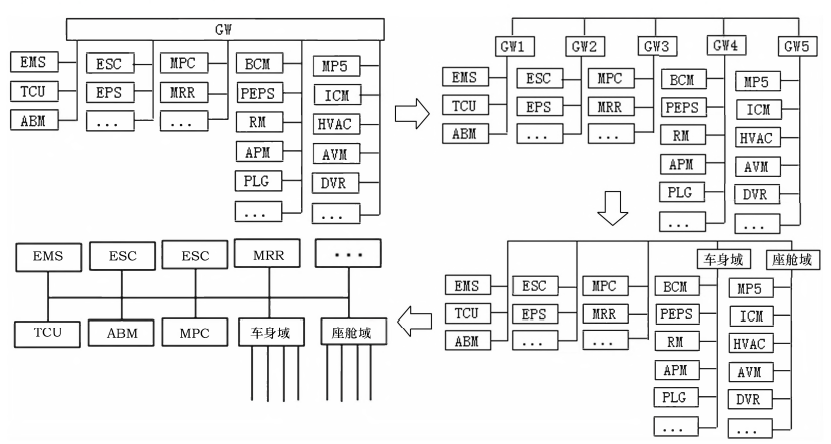
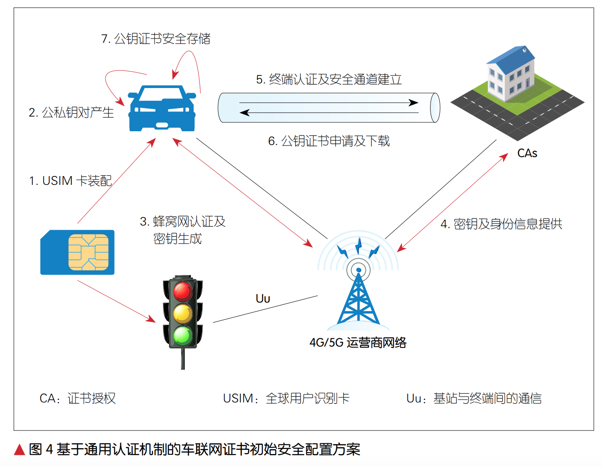

# 汽车电子电器架构测试

随着汽车EEA的演进，从分布式控制到集成式控制，再到域控制、再到集中式。

当前分布式架构的优势：
- 可按需裁剪适配高中低性能
- 按照功能划分控制单元适用于整车开发组织架构；
- 控制单元功能单一，ODM开发后可应用不同OEM；
- 零部件独立开发，平台化效率高，软硬件开发可依托供应商；
- 整车采用基于网关和CAN通信，成本低。

但随着产品升级、配置下沉、控制器和线束成本高、域控交互要求高、传统CAN负载能力不足（增加了报文与信号路由）、软件改动不便、整车集成和测试难度提升、OTA系统集成和测试困难等问题，传统OEM开始构建软件研发团队，重塑技术架构和供应链体系。

以往OEM只需要掌握功能简单、安全要求低的控制器开发，例如车身控制器BCM、门模块、空调控制等。

现状：
- 传统车动力系统： 发动机电子控制单元ECU+变速器控制器TCU 形式已经固化；
- 新能源车的动力系统 电机控制器PCU+车辆整车控制器VCU+电池管理系统BMS+OBC模式正在朝集成化方向发展。
- 底盘控制域已经成熟，高端车采用电控悬架提升舒适度，采用可变转向比提高操控性。
- 混合动力：P4电机逐渐取代传统的分动器+传动轴+驱动器的四驱系统。
- 被动安全领域：独立的安全气囊控制器被几个核心供应商控制。
- 自动驾驶领域：各种传感系统对通信系统要求高，所以引入以太网；EPS、ESC、EMS、TCU传统动力底盘近作软件开发以适应自动驾驶对转向、制动、加速、停车的需求。
- 车身控制领域：客户价值体现多、功能越来越复杂。使用大量消费电子技术，如联网、语音控制、AI等，接近于手机。
- 智能座舱：客户价值体现多、功能越来越复杂。使用大量消费电子技术，如联网、语音控制、AI等，接近于手机。
- 域控制器，是对领域内的算力的整合，具有主干网接口。
- 主干网：主流目前为CAN，动力底盘部分采用Flexray，成本高。高端OEM在研究以太网作为主干网，但研发费用和零部件成本高，且整车层面没有必然的功能需求，目前仅在自动驾驶和OBD诊断方面采用。

- 各主机厂基础技术架构不同，研发组织结构不同，无法全盘推倒，只有根据自己的实际情况曲迭代开发符合自己需求、降低开发成本和控制开发周期的路线。

## 几种情况
### 第一阶段 2个域控制器
- 动力底盘单元不变。
- 车身域控和智能座舱域控（软件）是整车软件开发和产品升级的核心。

车身域：
- 车身领域以BCM车身控制为中心整合出车身域控制器，带大量的子CAN和LIN子网
- 短期内不能整合的作为子节点，之后逐渐集成。
- 最终只保留了带总线的开关、传感器、执行器、对造型和结构有特殊要求的部件
- 内部软件完全通用化

智能座舱域：
- HMI主机中心仪表、HMI屏、HUD等座舱域控制器下属的显示屏等通过内部CAN传输控制信号
- 通过 LVDS、CAN、以太网等传输视屏和音频信号
- 通过LIN传输传感器、开关、部分执行器的信号
- 域控制器逐步对域内子节点大规模集成，是域功能算法中心。

经过集成，形成以动力底盘 + 车身域 + 座舱域 的主干网络架构，独立网关或将不存在，网关的功能分布到各域控制器中。

对主干网节点进行整合裁剪，动力底盘节点集成的难度大，但是可以通过带子CAN和私有CAN来减少主干网的节点，从而控制主干网的负载率。子网不但用在域控制器与子节点之间，同时可以用在主干节点之间辅助主干网的通信。
主干网考虑逐步升级，初期沿用CAN对传统动力底盘节点的通信接口没有变动，充分发挥CAN低成本的优势，充分考虑控制主干网的负载率。

### 第2阶段 升级主干网

- 随着功能增加、主干网负载升高，升级主干网。
- 使用CAN-FD，也能够使动力底盘大部分节点兼容，能够对现有架构进行延续、拓展、兼容。
- 使用CAN-FD报文代替CAN报文，减少报文数量，降低主干网的负载率
- 视动力底盘一级供应商的零部件升级情况。

这种架构适合大部分传统汽车OEM,采用分阶段、迭代方式的开发，有利于技术能力的逐步提升，提高产业化落地的效率，降低开发风险，同时符合整车产品迭代的规律，保证了零部件供应链的延续性。

### 第3阶段 其他领域的整合
- 对于纯电动和PHEV（插电式混合动力汽车），VCU将集成PCU、BMS、OBC（车载充电机）等模块形成新能源的动力域控制器。
- 对于燃油车，新建一个动力域控制器作为动力域网关则没有集成算力，意义不大，可以直接跳过此阶段。
- L2+以上级自动驾驶车，将形成1～2个自动驾驶的信息融合层与决策控制层核心控制器，接入大量摄像头、毫米波雷达、超声波雷达等，并集成以太网交换机获取茶粉定位、高精度地图信息，扩展成为自动驾驶域控制器。
  - 自动驾驶域控制器接在主干网上，与EMS、TCU直接交互。
  

此时的架构就是：动力底盘域+自动驾驶域+车身域+座舱域

自动驾驶域、智能座舱域可能根据通信需求，内部使用以太网，连接传感器、地图、T-Box。

若自动驾驶成为标配，OEM也可能将自动驾驶域与动力底盘域整合为——行驶域。

目前，域控制器可以集成，传感器、执行器由于安装位置的要求，无法集成。

普通经济型车也有200个左右的传感器和执行器，都接入车载计算机，线束会比较复杂，所以要在分布式和集中控制式中寻求系统成本、装配成本、可靠性的平衡。传统OEM考虑到自身特点，无法一刀切自己的EE架构，但技术发展趋势无法阻挡，所以利用现有资源逐步提升研发能力，逐步过渡才是最佳的演进路线。

## 趋势与变化

- 车辆智能化发展和通信技术的快速演进，车联网从以支持车载信息服务为主向以支持智能化和网联化为基础的辅助驾驶、自动驾驶和智慧交通的应用发展。

- 现阶段的车联网无线通信技术主要有2种：IEEE 802.11p 为基础的专用短程通信技术（DSRC）和蜂窝车用无线通信技术（C-V2X）。
  - 802.11p 是2003年以 802.11a为基础制定并于2010年完成标准化，后续版本802.11bd预计2021年10月完成。
  - C-V2X包括LTE-V2X和5G-V2X。
  - 美国交通不2016通过立法形式推动2023年美国所有轻型车辆强制安装DSRC车载装备。
  - 2019年12月，美国联邦通信委员会FCC发布消息，为C-V2X分配了 20 MHz （5905～5925MHz）频段。
  - 日本现有ITS频谱 760MHz，5.8GHz
  - 欧洲 2008年已为智能交通系统分配 5.9GHz 频段。2019年车辆、交通牌、高速路将安装网联设备。
  - 中国 2018年确定 5.9GHz 频段用于车联网直连通信。

- 中国中国通信标准化协会（CCSA）、中国智能交通产业联盟（C-ITS）、中国汽车工程学会（C-SAE）、国际移动通信系统（IMT-2020C-V2X 工作组等组织积极推进 LTE-V2X 端到端标准体系的构建。目前已基本建设完成LTE-V2X标准体系和核心标准规范制定，包括总体技术、空中接口、安全以及网络层与应用消息层、车载终端和路侧设备等各个部分，初步形成了覆盖LTE-V2X标准协议栈各层次、各层面、设备的标准体系。
- 5G-V2X 的 标 准 正 在 推 进 中，CCSA 及 C-V2X 工作组已开展 C-V2X 业务需求增强研究，已立项基于 5G 的车联网通信技术究。此外，C-ITS/C-SAE 等也开始启动应用层数据规范第 2 阶段研究。

### LTE-V2X
- 目前中国的产品已覆盖芯片、模组、车载终端、路侧终端、平台、应用等端到端的全产业链。
  - 支持 LTE-V2X 的通信芯片有 3 家厂商。
  - 车规级通信模组有 4 家厂商
  - C-V2X 车载终端有 10 余家厂商
  - 路侧终端有 8 家厂商。
  - 在车联网 V2X 基础数据平台、车企业务平台、示范区测试数据平台、第三方应用平台等均有产品，并在各地车联网示范区开始部署验证。
  - 测试验证方面，大唐电信、万集科技等 9 家终端设备厂商完成了 IMT2020（5G）推进组 C-V2X 工作组组织的网络层应用层互操作、协议一致性测试。
  - 2018 年 11 月，共有中外 11 家整车企业、8 家 LTE-V2X 终端提供商和 3 家通信模组厂商共同参与世界首例“跨芯片模组、跨终端、跨整车”的 LTE-V2X“三跨”互联互通应用示范。
  - 2019 年 10 月 22—24 日，共有 26家整车厂商、11 家通信模组厂商、28家终端提供商、6 家安全厂商和位置服务提供商共同参与 C-V2X“四跨”（在“三跨”基础上增加了“跨安全平台”）互联互通应用示范活动。

- 为了推进车联网产业和应用落地，工信部、交通部、公安部设立 30 多个应用示范区，一方面在北京、上海、重庆等地建立了多场景、多环境测试场，验证 C-V2X 端到端的关键技术，推进了车联网产品商用研发进程。

### 5G-V2X

- 随着中国 5G 商用，基于 5G 新空口（NR）的增强移动宽带（eMBB）芯片已商用；
- 随着高通等 5G 芯片的陆续发布，移远、LG 等纷纷发布 5G 车载模组。
- 在网络方面，中国从 2018 年底到 2019 年初陆续部署 5G NR eMBB网络，3 大运营商已于 2019 年 10 月31 日正式推出 5G 商用套餐。
- 中国移动计划 2020 年将为全国超过 340 个城市提供 5G 商用服务；
- 中国联通计划将在 7 个城市正式开通 5G 实验网，在 33 个城市实现热点区域覆盖，在 n个城市定制了 5G 网中专网；
- 中国电信也计划在 2019 年年底前建设 4 万个 5G 基站，分布在约 50 个城市中

### C-V2X 辅助驾驶典型场景

通过 C-V2X 工作组、C-SAE、C-ITS 等中国标准及产业组织共同研究，面向辅助驾驶阶段定义了 17 个 C-V2X 的基础应用场景。这些应用场景基于 C-V2X 信息交互，实现车辆、道路设施、行人等交通参与者之间的实时状态共享，辅助驾驶员进行决策。

序号 类别 应用名称
1 安全 前向碰撞预警
2 安全 交叉路口碰撞预警
3 安全 左转辅助
4 安全 盲区预警 / 变道辅助
5 安全 逆向超车预警
6 安全 紧急制动预警
7 安全 异常车辆提醒
8 安全 车辆失控预警
9 安全 道路危险状况提示
10 安全 限速预警
11 安全 闯红灯预警
12 安全 弱势交通参与者碰撞预警
13 效率 绿波车速引导
14 效率 车内标牌
15 效率 前方拥堵提醒
16 效率 紧急车辆提醒
17 信息服务 汽车近场支付

此外，5G 汽车联盟（5GAA）也定义了辅助驾驶典型应用场景，包括安全、效率、高级辅助驾驶、行人保护 4 大类共计 12个场景，具体场景与中国定义类似。

辅助驾驶典型应用场景的部署，对通信网络、数据处理、定位等方面提出了具体需求。
- 在通信方面，时延要求小于 100 ms（在特殊情况下小于20 ms）
- 可靠性需满足 90% ～ 99%
- 典型数据包大小为 50 ～ 300 B，最大1200 B；
- 在数据处理方面，据统计单车产生的数据每天约为 GB 级，对大量车辆、道路、交通等数据的汇聚，需要满足海量数据储存的需求，
- 同时对这些数据提出实时共享、分析和开放的需求；
- 在定位方面，定位精度需满足车道级定位，即米级定位，并且车辆需要获取道路拓扑结构

### 自动驾驶典型应用场景及技术需求

5G 技术的更大数据吞吐量、更低时延、更高安全性和更海量连接等特性，极大地促进了智能驾驶和智慧交通发展。产业各方开始了面向自动驾驶的增强型应用场景的研究与制定，一方面从基础典型应用场景的实时状态共享过渡到车与车、车与路、车与云的协同控制，增强了信息交互复杂程度，可实现协同自动驾驶与智慧交通的应用；另一方面基于通信与计算技术的提升，交通参与者之间可以实时传输高精度视频、传感器数据，甚至是局部动态高精度地图数据，提高了感知精度与数据丰富程度。

序号 类别 应用名称
1 安全 协作式变道
2 安全 协作式匝道汇入
3 安全 协作式交叉口通行
4 安全 感知数据共享 / 车路协同感知
5 安全 道路障碍物提醒
6 安全 慢行交通轨迹识别及行为分析
7 效率 车辆编队
8 效率 协作式车队管理
9 效率 特殊车辆信号优先
10 效率 动态车道管理
11 效率 车辆路径引导
12 效率 场站进出服务
13 效率 基于实时网联数据的交通信号配时动态优化
14 效率 高速公路专用道柔性管理
15 效率 智能停车引导
16 信息服务 浮动车数据采集
17 信息服务 差分数据服务
18 信息服务 基于车路协同的主被动电子收费
19 信息服务 基于车路协同的远程软件升级

3GPP 将增强的应用场景分为 4 类，包括：车辆编队行驶、半 / 全自动驾驶、传感器信息交互和远程驾驶；

5GAA 也针对面向自动驾驶的增强应用场景进行了定义，涉及安全、效率、自动驾驶、公共服务等方面。

面向自动驾驶的增强应用场景对数据交互技术、高精度定位技术、多传感器融合技术、高性能处理平台、高精度地图等提出了新的需求。
- 在通信方面，单车上下行数据速率需求大于 10 Mbit/s，部分场景需求 50 Mbit/s，
- 时延需求为 3 ～ 50 ms，
- 可靠性需大于99.999%；
- 在信息交互方面，需实时交互车辆、道路、行人的全量数据，
- 利用多传感器融合技术获取实时动态交通高精度地图；
- 在数据处理方面，单车每天将产生高达 PB 级的数据，对数据的存储、分析等计算能力提出了更高的要求；
- 在定位方面，需达到亚米级甚至厘米级的定位精度。

### 车联网关键技术

#### 整体架构
基于 C-V2X 通信技术的“人 - 车 -路 - 网”多方协同的车联网不同于传统 Telematics 网络，它对数据传输的传输速率、时延、可靠性等方面提出了更高的需求。网络除了进行数据传输，还需要辅助实现协同计算；因此，运营商需要将传统通信网络升级为“通信 + 计算”的网络，以满足新的车联网应用场景需求。

基于“通信 + 计算”网络的车联网体系架构

<image src="images/v2x/基于通信+计算网络的车联网体系架构.png">

平台的关键技术从整体架构的演进可以看出，为满足车联网新的需求，通信网络将逐步引入“计算”能力，辅助实现海量数据的实时计算；因此，V2X 平台应具备以下能力：
- （1）提供海量终端管理、用户管理、计费管理、应用管理、安全管控、系统监测控制等运营、运维管理能力；

- （2）提供海量终端数据统一接入、业务鉴权、交通数据汇聚及分析、应用托管、高性能数据存储、交通信息开放、边缘节点资源调度、路侧传感数据融合计算、业务连续性保持等业务支撑能力。

<image src="images/v2x/v2x平台参考架构.png">

由于车联网对海量数据高性能处理的需求，除增强平台自身能力之外，对于部署方案也应进行优化。相对传统的“中心平台 - 终端”架构，新的车联网需要更贴近用户、灵活性更高的 部 署 方 案。 由 此， 引 入 V2X 多 级平台系统架构。平台各级能力可根据V2X 业务对时延、数据计算量、部署等方面的需求，分层提供不同的服务能力，如图 3 所示（初步考虑基于“中心 - 区域 - 边缘”三层架构满足车联网业务需求）。

<image src="images/v2x/V2X多级平台部署架构.png">

通信网络的关键技术 C-V2X 通信技术包含 LTE-V2X和5G-V2X。

LTE-V2X 主要是针对百毫秒时延的辅助驾驶场景，一方面引入直连通信，支持终端之间直接通信，降低时延，增强终端在无网络覆盖时通信能力；另一方面对公众网 Uu（基站与终端间的通信）接口进行性能优化，定义应用于 V2X 的服务质量等级标识（QCI）、缩短多播控制信道（MCCH）周期等，降低时延，提升可靠性。

5G-V2X 主要是针对毫秒级时延、单车百兆速率的自动驾驶场景，基于5G NR Uu 技术引入 5G PC5。

为 满 足 车 联 网 低 时 延、 高 可 靠性、大带宽等需求，5G Uu 网络引入了 V2X 通信切片、边缘计算、服务质量（QoS）预测等特性。
- （1）5G 切片技术。车联网车联网的应用场景非常丰富，业务需求呈现出多样性的特征，既有大带宽、数据传输速率高的需求，又有对可靠性、时延等要求高的需求。对车联网可考虑 3种类型切片：
  - 第 1 类为 eMBB 切片，支持车内娱乐、视频应用及在线游戏等业务需求；
  - 第 2 类是 V2X 通信切片，支持驾驶相关业务的网络需求；
  - 第 3 类是针对汽车厂商定制化的切片，可以由车厂单独运营，支持某品牌车辆特有服务，如远程问题诊断等。

- 边缘计算技术。移动边缘计算（MEC）技术将计算、存储、业务服务能力向靠近终端或数据源头的网络边缘迁移，具有本地化处理、分布式部署的特性。面向车联网的 MEC 一方面通过将业务部署在边缘节点，以降低 C-V2X 网络的端到端通信时延；另一方面作为本地服务托管环境，提供强大的计算、存储资源。

- （3）QoS 预测。车联网业务有别于其他 5G 网络业务，对通信性能的改变十分敏感。面对这一需求，5G 网络引入了智能网元网络数据分析功能（NWDAF）， 通 过 采 集 分 析 数 据，提前预判某车辆进入的小区是否能够满足 5G-V2X 业务的 QoS 需求，从而提前通知车辆。此外，5G-V2X 应用还将反馈给网络最高 QoS 需求和最低 QoS 需求，最大限度保障 5G-V2X 的
业务。

**这里，需要测试人员特别注意，既然对网络通信性能敏感，那么简单的DoS或参数篡改就可能造成较大的影响。**

- （4）业务连续性。业务连续性指在终端移动状态下，通过不同网络侧会话管理机制来保障车辆快速移动状态下不同用户面功能（UPF）切换时的业务体验。目前 3GPP 标准中 R15 版本定
义的保障业务连续性主要有 3 种模式。
  - 在 R16 版本中又增加了 1 种超可靠低时延的业务连续性方案，在涉及到切换的 2 个 UPF 之间建立转发通道，保障车辆在移动过程中会话不中断。

5G 在直连通信技术上也进行了增强， 同 LTE-V2X 类 似，NR PC5 也 支持 2 种通信模式，即模式 1 和模式 2（ 类 似 于 LTE-V2X 中 的 模 式 3 和 模式 4）。3GPP 正在讨论新增资源调度NR 模式 2 的子模式以优化通信性能。在低时延方面，NR V2X 支持 3 ms 端到 端 超 低 时 延 需 求，引 入 60 kHz 子载波间隔支持更短的子帧结构，NRSidelink 支持基于预配置资源的免调度传 输 方 案。 在 高 可 靠 方 面，5G-V2X支持单播及组播，并支持混合自动重传请求（HARQ）等重传技术，确保高于 99.999% 的超高可靠性。同时，5G-V2X PC5 既支持 ITS 频段，又可扩展到 IMT 频段，从而创造了更多的业务空间。

#### 车联网安全关键技术
随着车联网的不断完善与逐步应用，产业界越来越意识到车联网信息安全问题的重要性 [6] 。如何在不降低系统运行效率，不增加额外开销的前提下，有效实现车路协同系统节点安全认证，确保车载终端、路侧设备、云平台等网元实体之间信息通信的安
全性，是当前产业界面临的主要技术挑战；因此，在车联网安全方面需在两方面取得突破进展。

- （1）安全认证技术。为了确保车联网业务中消息来源的真实性、内容的完整性，并防止消息重放，中国C-V2X 车联网系统采用数字证书通过数字签名 / 验签等密码技术对 V2X 业务消息进行保护，因此，需要车联网安全管理系统来实现证书颁发与撤销、终端安全信息收集、数据管理、异常分析等一系列功能。在此之前，车联网终端必须完成设备初始化，以安全的方式完成数字证书等敏感参数的初始配置。
  - 目前针对该问题，有 2 种解决方案：一种是车企自建证书管理体系，自己维护系统，确保系统的安全可靠；
  - 另一种方案则是基于通用认证机制（GBA）的终端认证服务，如图 4

对于安装 USIM 卡，支持 LTE-Uu接口通信的 V2X 设备，可基于用户与运营商间的共享密钥 K 和蜂窝网基础认证及密钥协商能力简化设计，实现CA 管理实体与 V2X 设备间的身份认证，并在两者之间建立初始信任关系，满足 ECA 证书及其他证书初始申请、安全传输的需要。该方案能够使车载单元（OBU）终端仅依靠自身安全硬件和网络 GBA 安全能力即可在线完成初始安全配置，避免了工厂复杂的密钥管理，降低了汽车企业生产线及管理系统安全改造的成本，提高了汽车工业自动化生产水平。未来该技术的演进还可为 5G 车联网的应用提供可靠的安全保障。

- （2）车联网高性能安全芯片技术。C-V2X 车联网技术目前已确定采用通过数字签名 / 验签的方式对车联网消息进行保护。为了实现上述机制，车联网终端需要以芯片 / 硬件 / 固件安全
为基础，以安全的方式生成随机数及密钥，实现密码运算，对密码公私钥对、数字证书等敏感参数进行安全存储。

根据 3GPP 提供业务模型估计，车联网终端设备的验签处理能力预计至少应达到 2 000 次 / 秒，这对安全芯片的处理性能提出了较高要求。除此之外，安全芯片应当符合车规级，满足测试标准。同时，在中国境内使用的安全芯片产品还应符合《密码法》规 定 及 要 求， 应 支 持 采 用 商 用 密 码（SM）2/SM3/SM4 算法实现密码相关处理及运算。然而，同时满足支持国密算法以及车规级性能要求的高性能安全芯片目前在中国是没有的。因此，研究高性能安全芯片技术是当前车联网产业面临的主要挑战.

## 自动驾驶

Automated Vehicle；Autonomous Vehicle；Intelligent Vehicle....

《中国制造 2025》中将智能网联汽车定义为搭载先进的车载传感器、控制器、执行器等装置，并融合现代通信与网络技术，实现车内网、车外网、车际网的无缝链接，具备信息共享、复杂环境感知、智能化决策、自动化协同等控制功能，与智能公路和辅助设施组成的智能出行系统，可实现“高效、安全、舒适、节能”行驶的新一代汽车。

"环境感知——决策与规划——控制域执行“

关键技术包括：
- 环境感知
- 精确定位
- 决策规划

### 环境感知

- 环境感知技术是利用摄像机、激光雷达、毫米波雷达、超声波等车载传感器，以及 V2X 和 5G 网络等获取汽车所处的交通环境信息和车辆状态信息等多源信息，为自动驾驶汽车的决策规划进行服务。

- 摄像机按照芯片类型可分为 CCD 摄像机和 CMOS 摄像机两种。
  - CCD 摄像机，由光学镜头、时序及同步信号发生器、垂直驱动器及模拟/数字信号处理电路组成，具有体积小、重量轻、低功耗、无滞后、无灼伤、低电压等特点。
  - CMOS 摄像机，集光敏元阵列、图像信号放大器、信号读取电路、模数转换电路、图像信号处理器及控制器于一体，具有传输速率高、动态范围宽、局部像素的可编程随机访问等优点。

- 激光雷达。激光雷达是以发射激光束来探测目标空间位置的主动测量设备。根据探测原理，激光雷达分为单线（二维）激光雷达和多线（三维）激光雷达。
  - 单线激光雷达，通过发出一束激光扫描线对区域进行旋转扫描，并根据区域内各个点与激光雷达的相对空间距离与方位，返回测量值。
  - 多线激光雷达，通过发出两束或两束以上的激光扫描线对区域进行旋转扫描。多线激光雷达能够检测目标的空间距离与方位，并可以通过点云来描述三维环境模型，可以提供目标的激光反射强度信息，提供被检测目标的详细形状。
  - 国际市场上推出的主要有 4 线、8 线、16 线、32 线和 64 线。激光雷达发出的线束越多，每秒采集的点云越多，同时造价也越高。
  - 激光雷达已经发展了3代：一代为机械扫描激光雷达、二代为混合固态激光雷达、三代纯固态激光雷达。
  - 性能指标：水平视角、垂直视角、探测距离、线数、扫描精度、体积、价格

- 毫米波雷达（频率30-300GHz）
  - 分为脉冲方式、调频连续波方式两种。
  - 脉冲方式毫米波雷达，其基本原理与激光雷达相似，它在硬件结构上比较复杂、成本较高，很少用于自动驾驶汽车，目前大多数车载毫米波雷达都采用调频连续波方式。
  - 调频连续波方式毫米波雷达，具有结构简单、体积小、成本低廉，容易实现近距离探测。
  - 毫米波雷达具有全天候、探测距离远、价格便宜、质量轻、体积小等优点，能够较精确得到目标的相对距离和相对速度。
  - 不足之处是分辨率低，在很多场合易受干扰。

- 超声波雷达（20kHz以上的超声波）
  - 超声波雷达的数据处理简单快速，检测距离较短，多用于近距离障碍物检测。超声波具有频率高、波长短、绕射现象小、方向性好、能够成为射线而定向传播等优点。
  - 超声波雷达的不足在于距离信息不精准，一般用于精度要求不高的地方，如倒车雷达等。

环境感知技术有两种技术路线，一种是以摄像机为主导的多传感器融合方案，典型代表是特斯拉。另一种是以激光雷达为主导，其他传感器为辅助的技术方案，典型企业代表如谷歌、百度等。

#### 环境感知场景
环境感知包括：可行驶路面检测、车道线检测、路缘检测、护栏检测、行人检测、机动车检测、非机动车检测、路标检测、交通标志检测、交通信号灯检测等。

### 精确定位
自动驾驶汽车的基础是精准导航，不仅需要获取车辆与外界环境的相对位置关系，还需要通过车身状态感知确定车辆的绝对位置与方位

- 惯性导航系统
  - 由陀螺仪和加速度计构成，通过测量运动载体的线加速度和角速率，并将数据对时间求积分，得到速度、位置、姿态。惯导属于推算导航方式，即在已知基准点位置的前提下，根据连续观测推算下一点位置。
- 轮速编码器与航迹推算
  - 通常轮速编码器安装在汽车的前轮，分别记录左轮与右轮的总转数。通过分析每个时间段里左右轮的转数，可以推算出车辆向前走了多远，向左右转了多少度等。由于在不同地面材质（如冰面与水泥地）上转数对距离转换存在偏差，随着时间推进，测量偏差会越来越大，因此单靠轮测距器并不能精准估计自动驾驶汽车的位姿。
- 卫星导航系统
  - GPS（6轨面24颗卫星，WGS-84坐标系）、GLONASS（27颗+3颗，3个近圆轨道）、北斗（5颗静止+30颗非静止，采用CGCS2000坐标系）
- SLAM自主导航系统（Simulataneous Localization and Mapping，即时定位与地图构建）
  - 也称为CML（concurrent mapping and localization，并发建图与定位）
  - 有两种slam：一是基于激光雷达的，例如谷歌汽车，通过gps对位置进行判断，并以激光雷达slam点云图像与高精度地图进行坐标配准，匹配后确认自身位姿。二是基于视觉的SLAM，以mobileye为例，通过采集信号灯、路牌等表示得到一个简单的三维坐标数据，再通过视觉识别车道线等信息，获取一个一维数据。摄像机中的图像与定位方法rem地图中进行配准，即可完成定位。

### 决策规划
自动驾驶汽车的行为决策与路径规划是指依据环境感知和导航子系统输出信息，通过一些特定的约束条件如无碰撞、安全到达终点等，规划出给定起止点之间多条可选安全路径，并在这些路径中选取一条最优的路径作为车辆行驶轨迹。

- 路径规划
  - 路径局部规划，自动驾驶车辆中的路径规划算法会在行驶任务设定之后将完成任务的最佳路径选取出来，避免碰撞和保持安全距离。在此过程中，会对路径的曲率和弧长等进行综合考量，从而实现路径选择的最优化。
  - 驾驶任务规划：即全局路径规划，主要的规划内容是指行驶路径范围的规划。当自动驾驶汽车上路行驶时，驾驶任务规划会为汽车的自主驾驶提供方向引导方面的行为决策方案，通过 GPS 技术进行即将需要前进行驶的路段和途径区域的规划与顺序排列。

- 行为决策，主要的行为决策算法有以下 3 种：
  - 基于神经网络：自动驾驶汽车的决策系统主要采用神经网络确定具体的场景并做出适当的行为决策。
  - 基于规则：工程师想出所有可能的“if-then 规则”的组合，然后再用基于规则的技术路线对汽车的决策系统进行编程。
  - 混合路线：结合了以上两种决策方式，通过集中性神经网络优化，通过“if-then 规则”完善。
- 感知与决策技术的核心是人工智能算法与芯片。
- 市场上采用的自动驾驶主流芯片主要分为两种，一种是英特尔-Mobileye 开发的 Mobileye® EyeQX™系列车载计算平台。另一种是英伟供的 NVIDIADrive PX 系列车载计算平台。

### 控制与执行

车辆控制系统是自动驾驶汽车行驶的基础，包括车辆的纵向控制和横向控制。纵向控制，即车辆的驱动与制动控制，是指通过对油门和制动的协调，实现对期望车速的精确跟随。横向控制，即通过方向盘角度的调整以及轮胎力的控制，实现自动驾驶汽车的路径跟踪。

车辆控制平台是无人车的核心部件，控制着车辆的各种控制系统。其主要包括电子控制单元（ECU）和通信总线两部分。ECU 主要用来实现控制算法，通信总线主要用来实现 ECU 与机械部件间的通信功能。

ECU 它和普通的单片机一样，由微处理器（CPU）、存储器（ROM、RAM）、输入/输出接口（I/O）、模数转换器（A/D）以及整形、驱动等大规模集成电路组成。发动机在运行时，它采集各传感器的信号进行运算，并将运算的结果转变为控制信号，控制被控对象的工作。它还实行对存储器（ROM、RAM）、输入/输出接口（I/O）和其他外部电路的控制；存储器 ROM 中存放的程序是经过精确计算和大量实验获取的数据为基础，这个固有程序在发动机工作时，不断地与各传感器采集来的的信号进行比较和计算，把比较和计算的结果用来控制发动机的点火、空燃比、怠速、废气再循环等多项参数。它还有故障自诊断和保护功能。RAM 也会不停地记录行驶中的数据，成为 ECU 的学习程序，为适应驾驶员的习惯提供最佳的控制状态，这个程序也叫自适应程序。

通信总线：目前，车用总线技术被国际自动机工程师学会（SAE）下的汽车网络委员会按照协议特性分为 A、B、C、D 共 4 类，
- A 类总线面向传感器或执行器管理的低速网络，它的位传输速率通常小于 20Kb/s，以 LIN 规范为代表；
- B 类总线面向独立控制模块间信息共享的中速网络，位传输速率一般在 10~125Kb/s，以 CAN 为代表；
- C 类总线面向闭环实时控制的多路传输高速网络，位传输速率一般在 125Kb/s ~1Mb/s；
- D 类总线面向多媒体设备、高速数据流传输的高性能网络，位传输速率一般在 2Mb/s 以上。

## 参考

- Wai CHEN，李源，刘伟，《车联网产业进展及关键技术分析》，中兴通讯技术，2020.2. 第26卷第1期.Page5-11.
- 自动驾驶技术领域的国内代表性研究学者包括贺汉根、李德毅、杨静宇、郑南宁等，国外包括 Sebastian Thrun、Chris Urmson、Elon Musk、Amnon Shashua 等。