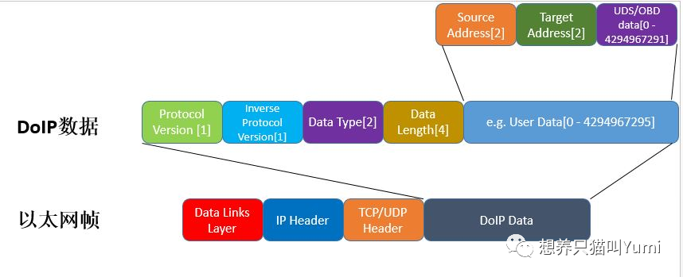
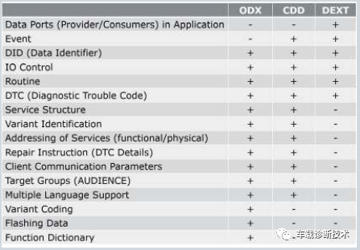
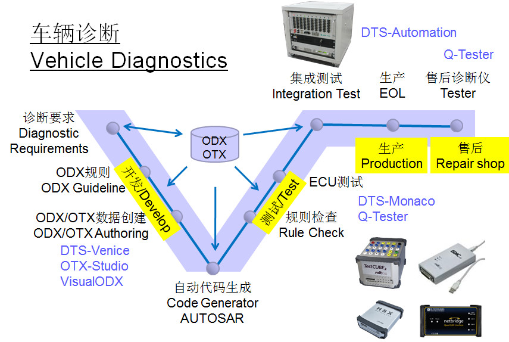
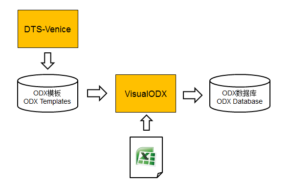
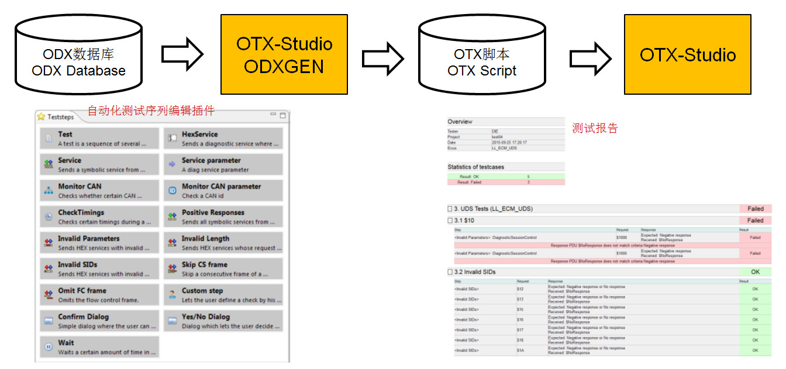
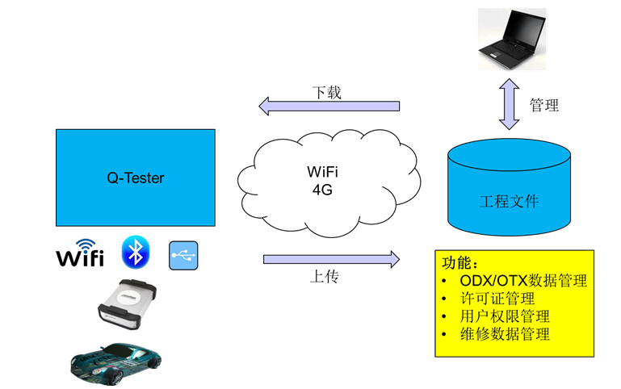
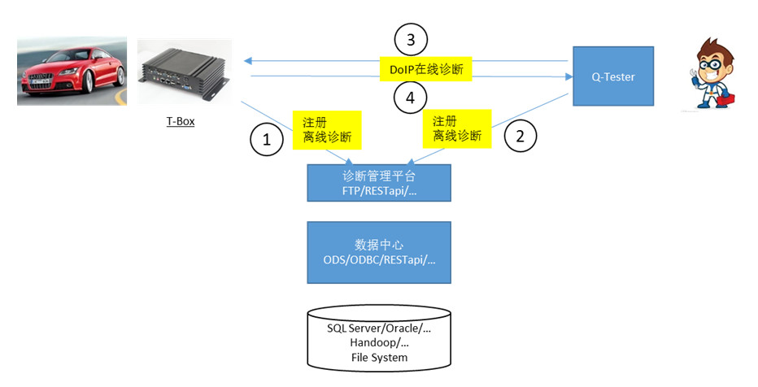
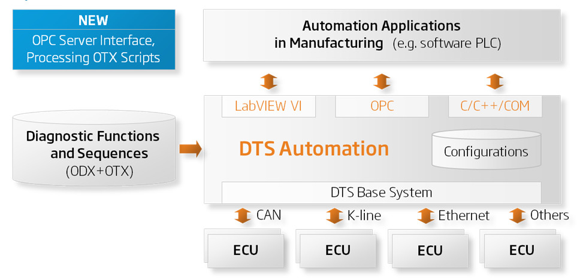
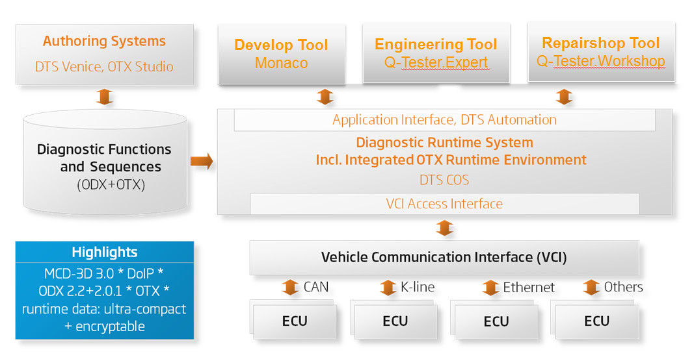

# 汽车诊断

## 概念

诊断就是实现外部设备和汽车ECU交换数据信息的技术。

从功能逻辑上来分，ECU主要有三种
- 逻辑控制功能
- 总线功能
- 诊断功能

### 诊断协议

- ISO-14229-1 定义了UDS的一些规范和需求。UDS协议（unified diagnostic service） 统一诊断服务
- ISO 14229-2 定义了应用层提供的服务，在会话层实现提供统一接口
- ISO-14229-3：定义了UDS在CAN总线上的实现
- ISO-14229-5：定义了UDS通过网络协议传输的实现
- ISO-15765-2：传输层和网络层由ISO-15765-2实现，它的主要作用是为数据包提供分段，流控制，错误检测等功能。
- ISO-11898：数据链路层和物理层就是由ISO-11898实现的CAN总线要求。
- ISO-13400：Ethernet技术实现诊断通信。
- ISO-15031-5 OBD协议。
- ISO-15765-4 排放相关的诊断

### 诊断模型

- 诊断协议+诊断数据+诊断设备
- -> 协议描述文件
  - -> 诊断ECU
  - -> 配置数据库
- -> 诊断数据库
  - 生产检测
    - VIN码识别
    - ECU电检
    - EPS 初始化
  - 售后检测
    - 诊断
    - 刷新

### 汽车诊断类型

- 自诊断（Onboard 诊断），主要是获取车机系统以及连接设备的状态信息，并将诊断的结果记录下来便于通信诊断读取。
- 通信诊断（Offboard 诊断），主要就是指UDS中的相关诊断服务。

### DoIP 技术

DoIP是Diagnostic communication over Internet Protrocol的简称，顾名思义，就是通过网络协议进行通信。
ISO-13400-1：一般信息和用例定义
ISO-13400-2：传输协议和网络层服务
ISO-13400-3：基于IEEE802.3的有线车辆接口
ISO-13400-4：以太网诊断连接器
ISO-13400-5：一致性测试规范
 
DoIP的优势有以下几点：
- ①更快的诊断响应
- ②传输大量数据的时间更短（用于软件刷新和参数下载）
- ③使得远程的直接诊断成为可能
 
DoIP通信完整协议栈：
- ①ISO13400-1处于应用层之上，是对一些通用信息和应用场景的描述。
- ②应用层是基于ISO14229-1和IS014229-5，前者是UDS的完整定义，后者是UDS通过网络协议传输的定义。
- ③会话层：ISO14229-2对于所有的诊断通信都是一样的，目的是为上层提供统一的接口，使上层应用不需要随着顶层通信技术的变化而改变。
- ④传输层和网络层由ISO13400-2定义，ISO13400-2中规定了DoIP通信在传输层中使用TCP和UDP协议，在网络层使用IPv4或者IPv6
- ⑤ISO13400-2中还定义了DoIP诊断通信对Ethernet数据链路层和物理层的要求。
 
DoIP数据的基本结构：

一个以太网帧数据包含：
- 数据链路层+IP头+TCP/UDP头+DoIP数据

DoIP数据包含：使用的ISO13400版本（1byte）+ 使用的ISO13400版本按位取反（1byte）+ 数据类型（2byte）+ 数据长度（4byte）+ User Data（源地址（2byte）+ 目标地址（2byte）+ 诊断数据）

### OBD 诊断

为了监控排放相关系统，比如发动机和变速箱，美国 和欧洲制定了OBD（On-Board-Diagnose）标准。OBD定义了排放相关系统必须支持的诊断服务和数据传输格式，支撑OBD数据传输的底层线路可以是K线，也可以是CAN线，目前大多数车的OBD接口都是CAN总线。OBD与UDS是并列的一套应用层协议，对于与排放相关系统相关的ECU来说，通常这种ECU上既要实现OBD，也要实现UDS。

#### OBD协议

ISO-15301-5，即OBD所用的诊断服务，OBD共定义了9个诊断服务，0x01~0x09。

目前，UDS和OBD是两套应用层协议，而OBD所提供诊断服务其实属于UDS所提供服务的一个子集，理论上来说UDS中的诊断服务都可以实现OBD中的要求。为了降低同时需要实现两套协议的成本，所以标准化组织分配了ISO 27145（World-Wide Harmonized OBD）这个标准号来将OBD与UDS统一，使用UDS中的诊断服务来替代OBD相关的诊断服务。具体替换方案如下表：

WWH-OBD中UDS与OBD服务的对应关系

|UDS | 诊断服务| OBD|
|-|-|-|
|22h|read data by identifier| 01h,09h|
|19h|read dtc information|02h,03h,07h|
|14h|clear diagnostic information|04h|
|31h|routine control|05h,06h,08h|

### 对CAN的诊断

#### 基于ISO-15765 的CAN协议

ISO 15765 协议内容：
- ISO-15765-1：定义了一般信息和用例
- ISO-15765-2：定义了网络层服务
- ISO-15765-3：定义了一元化诊断服务的实施（基于CAN的UDS）

基于CAN总线实现的诊断协议的传输层.这里以 classical CAN为例，CAN FD原理类似. CAN总线物理层的每一帧只能传输8个字节，CAN FD一帧最多能传输64个字节，那么如果UDS产生的一条诊断命令超过了8个字节，在CAN总线上一帧是承载不了的，就需要进行分包，这也是DoCAN(Diagnose over CAN)要解决的最主要的问题.

为了实现诊断命令的分包传输，ISO-15765-2总共定义了4种类型的帧结构，每种帧结构以数据域的前两个或一个字节来标识（取决于帧类型）.

这四种类型分别是：
- ①SingleFrame
- ②FirstFrame
- ③ConsecutiveFrame
- ④FlowControl

其中SingleFrame用于长度不超过7个字节的诊断命令或响应. FirstFrame，ConsecutiveFrame，FlowControl用于传输长度大于7个字节的诊断命令或响应.四种帧数据结构如下图所示：

### 对以太网的诊断

#### 基于ISO-13400数据传输协议的以太网诊断（DoIP）：

首先来简单说一下ISO-13400协议，主要包含的内容如下所示：
- ISO-13400-1：一般信息和用例定义
- ISO-13400-2：传输协议和网络层服务
- ISO-13400-3：基于IEEE802.3的有线车辆接口
- ISO-13400-4：以太网诊断连接器
- ISO-13400-5：一致性测试规范

Tips:关于具体每一部分的内容感兴趣的可以自己直接百度下载，这里不会赘述详细的内容.

继传统CAN线、MOST、FlexRay以及CAN-FD后，车载以太网将凭借其低成本、高带宽、高传输速率、网络实时而被纳入到新型整车总线中.尤其在娱乐信息系统及T-Box子网中，采用以太网传输视频数据代替原有各模块间复杂连接线将很大程度减少线束重量及复杂度。同时以太网也将是未来解决如何快速更新ECU软件及标定的主要策略之一.

以太网诊断（DoIP）技术：是在UDS诊断服务基础上，通过TCP/IP及以太网来进行远程车辆诊断，协议定义在ISO-13400，文档中详细描述了外部测试及刷新设备如何与整车内部ECU通过以太网及TCP/IP协议进行通讯.

## 诊断数据库

汽车诊断功能开发包括：
- 需求定义
- 软件实现（基于autosar）
- 测试验证

业界常见的诊断数据库格式：
- CDD
- ODX
- ARXML

OEM厂商会使用pdf/word提供企业级诊断规范给ECU供应商，ECU供应商根据这些文档开发自己的ECU级诊断规范，通常使用Excel诊断需求调查表形式与OEM交互。这中间会有各种交流的问题。解决方案是将这些机器不可读的数据描述文档转化为机器可读的诊断数据库，诊断开发和应用流程中的诊断设备直接读取诊断数据库中的诊断信息，以此为基础实现诊断相关工作，避免人为理解的误差，同时提高诊断需求获取的正确性以及诊断流程的实现效率。

### Vector诊断数据库CDD
CDD是Vector 私有的诊断数据库格式，用于描述ECU的诊断功能需求，例如ECU支持UDS协议描述的诊断功能，则需要支持其中定义的会话跳转、安全解锁、读写数据流、读取故障码等服务和参数。

CDD文件是最早实现软件读取诊断需求的文件格式，也是在汽车行业内被最多诊断用户掌握的诊断数据库格式。

- CDDT 用于描述OEM即整车级别的诊断需求
- CDD 文件的建立基于CDDT模版
- 一个CDD文件对应一个ECU的诊断需求，从而保证ECU的诊断数据满足整车级别的需求与数据，同时可以减少相同数据的重复定义，提高CDD数据库的定义效率。

CDD在整个过程中的作用：
- 保证整个流程的数据一致性和有效性
- 在功能实现阶段，可以导入配置功能，自动生成协议栈；
- 用于V模型中右侧的单元测试、集成测试（数据输入源）。

CDD也是一种基于xml的描述文件。

### ODX

Open Diagnostic data eXchange （ISO 22901-1 ），是2002年开始，ASAM组织的odx工作组制定的标准。

发起者除了能够实现软件读取诊断信息外，还期望跨越工具边界，实现开放式的诊断数据库格式。在经历多个ASAM内部版本后，ODX标准第一版（ASAM ODX 2.0.0）于2004年发布。此后经过不断的完善， ISO组织于2008年收录ASAM ODX 2.2.0版本，正式发布ISO ODX标准——ISO 22901。

当前汽车行业中常用的是ODX 2.0.1和ODX 2.2.0。

ODX 2.0.1版本包含：
- 诊断服务；
- 诊断通信参数；
- 车辆接口；
- 刷写数据等模块。

ODX 2.0.1版本对UDS的支持不够完善，缺少功能寻址、肯定响应抑制位、会话安全级状态机等内容。

ODX 2.2.0不仅补充了缺失的内容，同时增加了：
- ECU配置
- 车辆功能信息库等内容

ODX 2.2.0版本更好地支持当前车辆的诊断现状。两个版本互不兼容，用户在使用ODX文件时需要确定使用的版本（所以用户在选择使用ODX数据库时需要明确使用的是那个版本）。

ODX2.2.0包含7层子模块：
- ODX-D和ODX-C描述诊断数据和服务，但ODX文件不仅可以描述单个ECU的诊断需求/数据，也可以描述整车所有ECU的诊断需求/数据；
- 在ODX-D和ODX-C基础上，增加整车接口（ODX-V），可将整车数据打包成一个PDX工程；

以上三个子模块也是诊断仪调用ODX文件实现诊断通信的基础模块。除诊断通信之外，在生产售后等阶段的诊断仪还需要具备ECU配置、刷写、车辆功能检测等功能。

ODX-E描述ECU配置信息，方便下限工具快速抓取车辆产线下线所需要的所有的数据内容，而不用像以往，需要下线工程师根据下线配置表，每个车型（高中低不同配置）对应的配制内容后，在手动选取配制数据烧录到整车；

ODX-F描述刷写数据，该数据（ODX-F）可以想象成一个容器，其内具体刷写数据还是Hex、S19、Bin等文件格式，只是在ODX-F这个容器中多了其他一些手段，比如增加Checksum、Signature等，保证刷写数据的完整性和有效性检验，增加了一道手段，保证ECU刷写的正确性；

ODX-FD描述面向功能的诊断信息库，从而满足生产售后的诊断应用需求。

ODX是开放式的诊断数据交互格式，用户可以依据ISO相关标准开发参数化诊断仪，调用ODX文件实现诊断功能。同时，ODX对于整车级诊断通信的支持以及对生产售后的诊断应用的支持会更友好，所以ODX文件更多地被应用于OEM的工程、生产、售后等阶段的各种诊断仪中。

其实关于CDD、ODX格式，其物理存在形式都是XML格式，只是行业先发者根据自己公司技术积累，基于不同协议按照不同的人机交互界面，形成了不同的数据库（用户看到的就是交互界面）。其实质就是诊断数据内容就摆在那里（XML根目录形式），就看哪家公司形成最好的人机交互界面让用户使用。

同样，先出发者（欧洲西方国家），凭借此，建立整个工具链圈（也相当于生态）。对于我国用户，只是使用者，并且使用后还离不开（他们卖的还死贵，总感觉在交智商税，这种情形不但是汽车行业，医药、工业控制软件皆如此）。形成的生态，构造了很高的技术护城河，让后来者只是使用者。不是说这样不好，业务嘛，术有专攻精于某一处，但是国家之间，没有永恒的朋友，只有永恒的利益，因此还是要有Plan B。

### arxml

AUTOSAR是汽车开放系统架构，该架构有利于车辆电子系统软件的交互与更新，并为高效管理复杂的车辆电子和软件系统提供基础。AUTOSAR定义统一的数据库格式（*.arxml），包括网络、诊断等。

AUTOSAR定义的诊断提取格式，用于DCM（诊断通信管理器）、DEM（诊断事件管理器）以及FIM（功能抑制管理器）的需求及配置定义。ARXML最初与AUTOSAR 4.2.1一起发布，在早期阶段只标准化UDS信息，AUTOSAR 4.3.0增加对OBD-II/WWHOBD/FIM/SAE J1939的相应扩展。因此，ARXML涵盖AUTOSAR支持的用于诊断的所有基础软件模块的配置。该文件可以描述相应协议传输的数据，还可以描述ECU应用软件中数据的来源。当且仅当两种类型的信息均可用时，才可以完全配置基础诊断软件。

主要元素包括：
- UDS/OBD/WWH-OBD/SAE J1939等诊断服务和相关子服务在AUTOSAR架构中的配置数据；
- 故障路径和故障存储器（Fault Memory）；
- 诊断数据元素和相关数据类型；
- 将诊断数据元素映射到应用软件；
- 功能抑制（FIM）。

ARXML满足AUTOSAR诊断模块的需求，应用于开发阶段的代码设计，支持AUTOSAR Classic以及Adaptive 平台。相较于CDD应用于诊断开发全流程，ODX应用于生产售后阶段，ARXML则专业服务于AUTOSAR架构中诊断模块软件的实现。

区别于其它诊断数据库，ARXML描述基础软件与应用程序软件的交互，即其特有的元素：诊断映射。诊断映射描述基础软件中诊断元素之间的连接，例如例程（Routine）、DID数据、事件（Event）以及应用程序层的软件组件（SWC）。为此，必须以符合AUTOSAR定义的建模方式对软件组件的接口进行建模，存在多种通信模式以访问客户端/服务器接口上的功能调用，或通过发送器/接收器接口实现诊断功能。过去，集成商必须在基础软件和应用程序软件的端口之间手动配置数千种该类型的连接。这不仅减少错误的可能性，同时节省时间并提高质量。

### 小结

从描述的诊断信息来区分：

- ODX描述的内容包括:
  - 诊断服务
  - 诊断数据
  - DTC维修信息
  - 通信参数等诊断信息
  - 还可以描述配置信息
  - 刷写数据
  - 以及车辆功能信息库；
  - ODX符合参数化诊断仪的需求，能够使参数化诊断仪实现诊断通信、ECU配置以及软件刷写等功能。
  - ODX和ECU软件之间的信息鸿沟较大，例如，用于错误检测的去抖动或位移算法对于基础软件至关重要，但在ODX中完全缺少此信息。
  - 与此同时，OEM的ODX编写准则之间的巨大差异进一步使更换ECU配置的可能性更加复杂，所以ODX应用于ECU基础软件配置以及诊断功能验证阶段的情况较少

- CDD
  - 除与ODX类似的诊断信息外，
  - 还可以描述DTC Event，用于DEM的实现；
  - DEXT在描述DID/IO Control/Routine/DTC以及Event等诊断数据信息的基础上，增加了应用程序中的数据端口

- AUTOSAR用于
  - 基础软件的诊断模块配置
  - 并且是AUTOSAR Adaptive平台唯一的输入格式。
  - 由于服务于AUTOSAR代码的专业性，ARXML缺少与诊断仪或测试设备之间通信的描述，不能应用在诊断验证以及参数化诊断仪中。

## 整车诊断过程

为了保证整车下线出厂质量要求，提高售后服务水平，无缝衔接的诊断系统开发在整车开发中的重要性日益突出。完备的诊断测试系统，不仅能简化零部件供应商的诊断测试工作，更能大大减少OEM厂商的诊断测试工作量，也便于对控制器供应商进行系统管理，保证诊断数据的完备性和可靠性。

### 诊断系统架构

### 诊断需求
根据整车架构、配置、参数和性能、动力总成、底盘、车身、电子电器、空调等各部分要实现的功能和设计要求，提出相应的诊断要求（零部件供应商也需要根据诊断要求来实现控制器相应的功能）。

### ODX规则
根据诊断要求，编写ODX诊断数据库实现规则，包括整车所有控制器都必须支持的协议要求和不同控制器单独支持的特有功能要求

### ODX/OTX数据创建
1.根据ODX规则创建诊断数据库（可用于车辆的整个生命周期，便于数据管理）。对于整车所有控制器都必须支持的协议要求，可用DTS Venice + Visual ODX来实现，实现流程如下图：

① 在DTS Venice中，基于标准的协议模板创建新工程；
② 在Visual ODX中导入整车厂的协议要求（Excel表格式），创建协议层诊断数据，即实现诊断数据库创建规范，所有控制器都必须基于这个创建规范来完善各自独特功能诊断数据的创建；
③ 在DTS Venice中完善各个控制器独特功能的诊断数据的创建。

2.用Softing的OTX Studio创建自动化诊断测试序列OTX，实现流程如下：

能实现以下自动化测试功能：
①诊断功能：
读取整车控制器装备情况；
检查软硬件版本号等标示信息；
读过程传感器值（如车速，转速，发动机温度等），实时监控车辆状态；
读故障码及其环境数据；
搜索特定的故障码；
检查控制器对有效请求服务ID给出的正响应；
检查控制器对无效请求服务ID或无效请求数据ID给出的负响应；
建立并检查总线静默模式（只监控不响应）；
测试时间参数：计时，延时等；
对控制器进行传输协议测试，检查控制器响应是否正常；
客户定制化测试序列。

②非诊断功能：
存储，生成报告，动态用户对话框，通用文件进入，xml文件…

### 自动代码生成
将ODX文件导入到AUTOSAR配置工具中，生成.c/.h文件。

### 规则检查
DTS Venice自带的检查功能，主要检查创建的数据库是否符合ASAM 2.2.0标准（一般和第三步ODX创建数据库同时进行）。

### ECU测试
用DTS Monaco和Q-Tester Expert对单个控制器进行功能测试（在ECU开发阶段，零部件供应商使用整车厂认可的诊断工具来测试，将大大减少整车厂后期集成测试工作量）。
DTS Monaco：整车厂用来验证ODX数据库完备性，确保传递给其他部门和零部件供应商的数据库没有问题；
Q-Tester Expert: 零部件供应商进行单个控制器功能测试，整车厂进行质量检验。
Q-Tester Expert可以实现以下功能：
基本诊断功能测试，包括读取物流数据，参数数据，测量数据等；
进程控制，输入输出控制等；
读/清故障码；
单个控制器功能配置（Coding）；
整车控制器功能配置（一键Coding）及Coding数据管理;
单个控制器刷写/再编程（Flash/Reprogramming）；
整车刷写；
总线报文记录；
客户定制化需求。

Q-Tester之数据中心: 进行ODX/OTX数据管理，许可证管理，用户权限管理，维修数据管理等。 

Q-Tester之远程诊断：便于对路试车辆进行远程控制，实现诊断测试和故障修复等，省时，省力，也大大降低了整车厂的诊断测试成本。

### 集成测试
DTS Automation来实现自动化的集成测试，优点：
降低对相关工作人员诊断知识的要求，简化相关工作人员的工作流程并减少其工作量；
主要用于：
生产过程中软件刷新和标定；
诊断测试台架；
下线测试；
硬件在环测试。

### 生产
类似集成测试，也可以用DTS Automation来实现。

### 售后
用Q-Tester Workshop来实现。优点：
保证工具链的无缝衔接，功能强大(和Expert版功能基本一样)，只是操作更简单，不需要太多的诊断知识。
整车生命周期，诊断测试工具链架构图：

## 实例

### 小鹏

#### 小鹏 P7

OBD接口

引脚 含义
IP33-16 供电正极
IP33-6	与中央网关相连的DCAN-H
IP33-14	与中央网关相连的DCAN-L
IP33-12	与中央网关相连的ETH-T+
IP33-13	与中央网关相连的ETH-T-
IP33-3	与中央网关相连的ETH-R+
IP33-11	与中央网关相连的ETH-R-
IP33-8	DOIP的激活线
IP33-7	与直流充电口和BMS相连的CAN-H
IP33-15	与直流充电口和BMS相连的CAN-L
IP33-4、IP33-5	GND